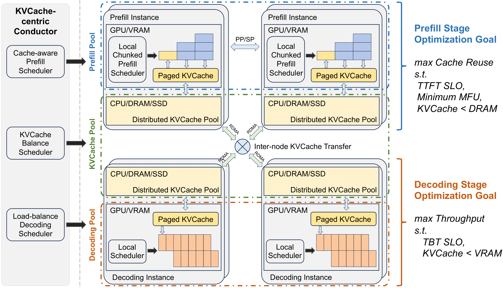
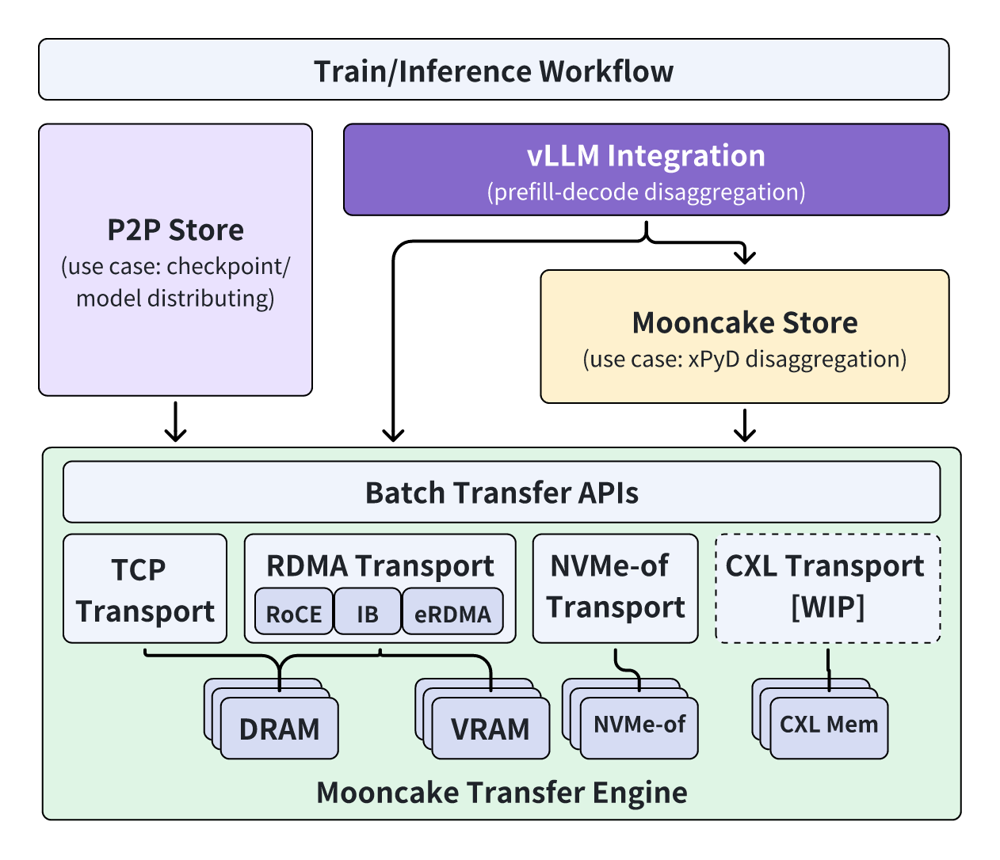

<div align="center">
  
  <h2 align="center">
      A KVCache-centric Disaggregated Architecture for LLM Serving
  </h2>
  <a href="https://www.usenix.org/system/files/fast25-qin.pdf" target="_blank"><strong>Paper</strong></a>
  | <a href="https://www.usenix.org/system/files/fast25_slides-qin.pdf" target="_blank"><strong>Slides</strong></a>
  | <a href="FAST25-release/traces" target="_blank"><strong>Traces</strong></a>
  | <a href="https://arxiv.org/abs/2407.00079" target="_blank"><strong>Technical Report</strong></a>
  | <a href="https://kvcache-ai.github.io/Mooncake/" target="_blank"><strong>Blog</strong></a>
  | <a href="https://join.slack.com/t/mooncake-project/shared_invite/zt-3qx4x35ea-zSSTqTHItHJs9SCoXLOSPA" target="_blank"><strong>Slack</strong></a>
  <br />
  <br />

  [](https://kvcache-ai.github.io/Mooncake/)
  [](https://pypi.org/project/mooncake-transfer-engine)
  [](https://pypi.org/project/mooncake-transfer-engine)
  [](https://pypi.org/project/mooncake-transfer-engine)
  [](https://deepwiki.com/kvcache-ai/Mooncake)
  [](https://github.com/kvcache-ai/Mooncake/graphs/commit-activity)
  [](https://github.com/kvcache-ai/Mooncake/blob/main/LICENSE-APACHE)

</div>
<br/>

Mooncake is the serving platform for  <a href="https://kimi.ai/"> Kimi</a>, a leading LLM service provided by <a href="https://www.moonshot.cn/"> Moonshot AI</a>.
Now both the Transfer Engine and Mooncake Store are open-sourced!
This repository also hosts its technical report and the open-sourced traces.

<h2 id="updates">🔄 Updates</h2>

- **Feb 24, 2026**: [TorchSpec: A Large-scale Speculative Decoding System](https://github.com/torchspec-project/TorchSpec) is open sourced, using Mooncake to decouple inference and training via efficient hidden states management.
- **Feb 12, 2026**: [Mooncake Joins PyTorch Ecosystem](https://pytorch.org/blog/mooncake-joins-pytorch-ecosystem/) We are thrilled to announce that Mooncake has officially joined the PyTorch Ecosystem!
- **Jan 28, 2026**: [FlexKV](https://github.com/taco-project/FlexKV), a distributed KV store and cache system from Tencent and NVIDIA in collaboration with the community, now supports [distributed KVCache reuse](https://github.com/taco-project/FlexKV/blob/main/docs/dist_reuse/README_en.md) with the Mooncake Transfer Engine.
 - **Dec 27, 2025**: Collaboration with [ROLL](https://github.com/alibaba/ROLL)! Check out the paper [here](https://arxiv.org/abs/2512.22560).
 - **Dec 23, 2025**: SGLang introduces [Encode-Prefill-Decode (EPD) Disaggregation](https://lmsys.org/blog/2026-01-12-epd/) with Mooncake as a transfer backend. This integration allows decoupling compute-intensive multimodal encoders (e.g., Vision Transformers) from language model nodes, utilizing Mooncake's RDMA engine for zero-copy transfer of large multimodal embeddings.
 - **Dec 19, 2025**: Mooncake Transfer Engine has been [integrated into TensorRT LLM](https://github.com/NVIDIA/TensorRT-LLM/tree/main/cpp/tensorrt_llm/executor/cache_transmission/mooncake_utils) for KVCache transfer in PD-disaggregated inference.
 - **Dec 19, 2025**: Mooncake Transfer Engine has been directly integrated into vLLM v1 as a [KV Connector](https://docs.vllm.ai/en/latest/features/mooncake_connector_usage/) in PD-disaggregated setups.
 - **Nov 07, 2025**: [RBG + SGLang HiCache + Mooncake](https://github.com/sgl-project/rbg/blob/main/keps/74-mooncake-integration/README.md), a role-based out-of-the-box solution for cloud native deployment, which is elastic, scalable, and high-performance.
 - **Sept 18, 2025**: Mooncake Store empowers vLLM Ascend by serving as [the distributed KV cache pool backend](https://docs.vllm.ai/projects/ascend/zh-cn/main/user_guide/feature_guide/kv_pool.html).
 - **Sept 10, 2025**: SGLang officially supports Mooncake Store as a [hierarchical KV caching storage backend](https://lmsys.org/blog/2025-09-10-sglang-hicache/). The integration extends RadixAttention with multi-tier KV cache storage across device, host, and remote storage layers.
 - **Sept 10, 2025**: The official & high-performance version of Mooncake P2P Store is open-sourced as [checkpoint-engine](https://github.com/MoonshotAI/checkpoint-engine/). It has been successfully applied in K1.5 and K2 production training, updating Kimi-K2 model (1T parameters) across thousands of GPUs in ~20s.
 - **Aug 23, 2025**: [xLLM](https://github.com/jd-opensource/xllm) high-performance inference engine builds hybrid KV cache management based on Mooncake, supporting global KV cache management with intelligent offloading and prefetching.
 - **Aug 18, 2025**: vLLM-Ascend [integrates Mooncake Transfer Engine](https://docs.vllm.ai/projects/ascend/en/latest/developer_guide/feature_guide/disaggregated_prefill.html) for KV cache register and disaggregate prefill, enabling efficient distributed inference on Ascend NPUs.
 - **Jul 20, 2025**: Mooncake powers [the deployment of Kimi K2](https://lmsys.org/blog/2025-07-20-k2-large-scale-ep/) on 128 H200 GPUs with PD disaggregation and large-scale expert parallelism, achieving 224k tokens/sec prefill throughput and 288k tokens/sec decode throughput.
 - **Jun 20, 2025**: Mooncake becomes a PD disaggregation [backend](https://kvcache-ai.github.io/Mooncake/getting_started/examples/lmdeploy-integration-v0.9.html) for LMDeploy.
 - **May 9, 2025**: NIXL officially supports Mooncake Transfer Engine as [a backend plugin](https://github.com/ai-dynamo/nixl/blob/main/src/plugins/mooncake/README.md).
 - **May 8, 2025**: [Mooncake x LMCache](https://kvcache-ai.github.io/Mooncake/getting_started/examples/lmcache-integration.html) unite to pioneer KVCache-centric LLM serving system.
 - **May 5, 2025**: Supported by Mooncake Team, SGLang release <a href="https://lmsys.org/blog/2025-05-05-large-scale-ep/" target="_blank">guidance</a> to deploy DeepSeek with PD Disaggregation on 96 H100 GPUs.
 - **Apr 22, 2025**: LMCache officially supports Mooncake Store as a <a href="https://blog.lmcache.ai/2025-04-22-tencent/" target="_blank">remote connector</a>.
 - **Apr 10, 2025**: SGLang officially supports Mooncake Transfer Engine for disaggregated prefilling and KV cache transfer.
- **Mar 7, 2025**: We open-sourced the Mooncake Store, a distributed KVCache based on Transfer Engine. vLLM's xPyD disaggregated prefilling & decoding based on Mooncake Store will be released soon.
 - **Feb 25, 2025**: Mooncake receives the **Best Paper Award** at **FAST 2025**!
 - **Feb 21, 2025**: The updated <a href="FAST25-release/traces" target="_blank">traces</a> used in our FAST'25 paper have been released.
 - **Dec 16, 2024**: vLLM officially supports Mooncake Transfer Engine for disaggregated prefilling and KV cache transfer.
- **Nov 28, 2024**: We open-sourced the Transfer Engine, the central component of Mooncake. We also provide two demonstrations of Transfer Engine: a P2P Store and vLLM integration.
- **July 9, 2024**: We open-sourced the trace as a <a href="https://github.com/kvcache-ai/Mooncake/blob/main/FAST25-release/arxiv-trace/mooncake_trace.jsonl" target="_blank">JSONL file</a>.
 - **June 27, 2024**: We present a series of Chinese blogs with more discussions on <a href="https://zhuanlan.zhihu.com/p/705754254">zhihu 1</a>, <a href="https://zhuanlan.zhihu.com/p/705910725">2</a>, <a href="https://zhuanlan.zhihu.com/p/706204757">3</a>, <a href="https://zhuanlan.zhihu.com/p/707997501">4</a>, <a href="https://zhuanlan.zhihu.com/p/9461861451">5</a>, <a href="https://zhuanlan.zhihu.com/p/1939988652114580803">6</a>, <a href="https://zhuanlan.zhihu.com/p/1959366095443064318">7</a>.
 - **June 26, 2024**: Initial technical report release.


<h2 id="overview">🎉 Overview</h2>

Mooncake features a KVCache-centric disaggregated architecture that separates the prefill and decoding clusters. It also leverages the underutilized CPU, DRAM, and SSD resources of the GPU cluster to implement a disaggregated KVCache pool.



The core of Mooncake is its KVCache-centric scheduler, which balances maximizing overall effective throughput while meeting latency-related Service Level Objectives (SLOs). Unlike traditional studies that assume all requests will be processed, Mooncake faces challenges in highly overloaded scenarios. To mitigate these, we developed a prediction-based early rejection policy. Experiments show that Mooncake excels in long-context scenarios. Compared to the baseline method, Mooncake can achieve up to a 525% increase in throughput in certain simulated scenarios while adhering to SLOs. Under real workloads, Mooncake’s innovative architecture enables <a href="https://kimi.ai/">Kimi</a> to handle 75% more requests.

<h2 id="components">🧩 Components</h2>

<!--  -->


**Mooncake Core Component: Transfer Engine (TE)**
The core of Mooncake is the Transfer Engine (TE), which provides a unified interface for batched data transfer across various storage devices and network links. Supporting multiple protocols including TCP, RDMA, CXL/shared-memory, and NVMe over Fabric (NVMe-of), TE is designed to enable fast and reliable data transfer for AI workloads. Compared to Gloo (used by Distributed PyTorch) and traditional TCP, TE achieves significantly lower I/O latency, making it a superior solution for efficient data transmission.

**P2P Store and Mooncake Store**
Both P2P Store and Mooncake Store are built on the Transfer Engine and provide key/value caching for different scenarios. P2P Store focuses on sharing temporary objects (e.g., checkpoint files) across nodes in a cluster, preventing bandwidth saturation on a single machine. Mooncake Store, on the other hand, supports distributed pooled KVCache, specifically designed for XpYd disaggregation to enhance resource utilization and system performance.

**Mooncake Integration with Leading LLM Inference Systems**
Mooncake has been seamlessly integrated with several popular large language model (LLM) inference systems. Through collaboration with the vLLM and SGLang teams, Mooncake now officially supports prefill-decode disaggregation. By leveraging the high-efficiency communication capabilities of RDMA devices, Mooncake significantly improves inference efficiency in prefill-decode disaggregation scenarios, providing robust technical support for large-scale distributed inference tasks.
In addition, Mooncake has been successfully integrated with SGLang's Hierarchical KV Caching, vLLM's prefill serving, and LMCache, augmenting KV cache management capabilities across large-scale inference scenarios.

**Elastic Expert Parallelism Support**
Mooncake adds elasticity and fault tolerance support for MoE model inference, enabling inference systems to remain responsive and recoverable in the event of GPU failures or changes in resource configuration. This functionality includes automatic faulty rank detection and can work with the EPLB module to dynamically route tokens to healthy ranks during inference.

**Tensor-Centric Ecosystem**
Mooncake establishes a full-stack, Tensor-oriented AI infrastructure where Tensors serve as the fundamental data carrier. The ecosystem spans from the Transfer Engine, which accelerates Tensor data movement across heterogeneous storage (DRAM/VRAM/NVMe), to the P2P Store and Mooncake Store for distributed management of Tensor objects (e.g., Checkpoints and KVCache), up to the Mooncake Backend enabling Tensor-based elastic distributed computing. This architecture is designed to maximize Tensor processing efficiency for large-scale model inference and training.

<h2 id="show-cases">🔥 Show Cases</h2>

### Use Transfer Engine Standalone ([Guide](https://kvcache-ai.github.io/Mooncake/design/transfer-engine/index.html))

Transfer Engine is a high-performance data transfer framework. Transfer Engine provides a unified interface to transfer data from DRAM, VRAM or NVMe, while the technical details related to hardware are hidden. Transfer Engine supports multiple communication protocols including TCP, RDMA (InfiniBand/RoCEv2/eRDMA/NVIDIA GPUDirect), NVMe over Fabric (NVMe-of), NVLink, HIP, CXL, and Ascend. For a complete list of supported protocols and configuration guide, see the [Supported Protocols Documentation](https://kvcache-ai.github.io/Mooncake/getting_started/supported-protocols.html).

#### Highlights
- **Efficient use of multiple RDMA NIC devices.** Transfer Engine supports the use of multiple RDMA NIC devices to achieve the *aggregation of transfer bandwidth*.

- **Topology aware path selection.** Transfer Engine can *select optimal devices* based on the location (NUMA affinity, etc.) of both source and destination.

- **More robust against temporary network errors.** Once transmission fails, Transfer Engine will try to use alternative paths for data delivery automatically.

#### Performance
With 40 GB of data (equivalent to the size of the KVCache generated by 128k tokens in the LLaMA3-70B model), Mooncake Transfer Engine delivers up to **87 GB/s** and **190 GB/s** of bandwidth in 4×200 Gbps and 8×400 Gbps RoCE networks respectively, which are about **2.4x and 4.6x faster** than the TCP protocol.

<!--  -->


### P2P Store  ([Guide](https://kvcache-ai.github.io/Mooncake/design/p2p-store.html))
P2P Store is built on the Transfer Engine and supports sharing temporary objects between peer nodes in a cluster. P2P Store is ideal for scenarios like checkpoint transfer, where data needs to be rapidly and efficiently shared across a cluster.
**P2P Store has been used in the checkpoint transfer service of Moonshot AI.**

#### Highlights
- **Decentralized architecture.** P2P Store leverages a pure client-side architecture with global metadata managed by the etcd service.

- **Efficient data distribution.** Designed to enhance the efficiency of large-scale data distribution, P2P Store *avoids bandwidth saturation* issues by allowing replicated nodes to share data directly. This reduces the CPU/RDMA NIC pressures of data providers (e.g., trainers).

<!-- #### Performance
Thanks to the high performance of Transfer Engine, P2P Stores can also distribute objects with full utilization of *hardware incoming bandwidth* (e.g., A 25Gbps NIC was used in the following figure, and the throughput of get replica is about 3.1 GB/s). -->

<!--  -->

### Mooncake Store ([Guide](https://kvcache-ai.github.io/Mooncake/design/mooncake-store.html))
Mooncake Store is a distributed KVCache storage engine specialized for LLM inference based on Transfer Engine. It is the central component of the KVCache-centric disaggregated architecture. The goal of Mooncake Store is to store the reusable KV caches across various locations in an inference cluster. Mooncake Store has been supported in  [SGLang's Hierarchical KV Caching](https://lmsys.org/blog/2025-09-10-sglang-hicache/), [vLLM's prefill serving](https://docs.vllm.ai/en/latest/features/disagg_prefill.html) and is now integrated with [LMCache](https://kvcache-ai.github.io/Mooncake/getting_started/examples/lmcache-integration.html) to provide enhanced KVCache management capabilities.

#### Highlights
- **Multi-replica support**: Mooncake Store supports storing multiple data replicas for the same object, effectively alleviating hotspots in access pressure.

- **High bandwidth utilization**: Mooncake Store supports striping and parallel I/O transfer of large objects, fully utilizing multi-NIC aggregated bandwidth for high-speed data reads and writes.

### SGLang Integration ([Guide](https://kvcache-ai.github.io/Mooncake/getting_started/examples/sglang-integration/hicache-integration-v1.html))

SGLang officially supports Mooncake Store as a [HiCache storage backend](https://lmsys.org/blog/2025-09-10-sglang-hicache/). This integration enables scalable KV cache retention and high-performance access for large-scale LLM serving scenarios.

#### Highlights
- **Hierarchical KV Caching**: Mooncake Store serves as an external storage backend in SGLang's HiCache system, extending RadixAttention with multi-level KV cache storage across device, host, and remote storage layers.
- **Flexible Cache Management**: Supports multiple cache policies including write-through, write-through-selective, and write-back modes, with intelligent prefetching strategies for optimal performance.
- **Comprehensive Optimizations**: Features advanced data plane optimizations including page-first memory layout for improved I/O efficiency, zero-copy mechanisms for reduced memory overhead, GPU-assisted I/O kernels delivering fast CPU-GPU transfers, and layer-wise overlapping for concurrent KV cache loading while computation executes.
- **Elastic Expert Parallel**: Mooncake's collective communication backend and expert parallel kernels are integrated into SGLang to enable fault-tolerant expert parallel inference ([sglang#11657](https://github.com/sgl-project/sglang/pull/11657)).
- **Significant Performance Gains**: The multi-turn benchmark demonstrates substantial performance improvements over the non-HiCache setting. See our [benchmark report](https://kvcache-ai.github.io/Mooncake/performance/sglang-hicache-benchmark-results-v1.html) for more details.
- **Community Feedback**: Effective KV caching significantly reduces TTFT by eliminating redundant and costly re-computation. Integrating SGLang HiCache with the Mooncake service enables scalable KV cache retention and high-performance access. In our evaluation, we tested the DeepSeek-R1-671B model under PD-disaggregated deployment using in-house online requests sampled from a general QA scenario. On average, cache hits achieved an 84% reduction in TTFT compared to full re-computation. – Ant Group

### vLLM Integration ([Guide v0.2](https://kvcache-ai.github.io/Mooncake/getting_started/examples/vllm-integration/vllm-integration-v0.2.html))
To optimize LLM inference, the vLLM community is working on supporting [disaggregated prefilling (PR 10502)](https://github.com/vllm-project/vllm/pull/10502). This feature allows separating the **prefill** phase from the **decode** phase in different processes. The vLLM uses `nccl` and `gloo` as the transport layer by default, but currently it cannot efficiently decouple both phases in different machines.

We have implemented vLLM integration, which uses Transfer Engine as the network layer instead of `nccl` and `gloo`, to support **inter-node KVCache transfer** [(PR 10884)](https://github.com/vllm-project/vllm/pull/10884). Transfer Engine provides simpler interfaces and more efficient use of RDMA devices.

We will soon release the new vLLM integration based on Mooncake Store, which supports xPyD prefill/decode disaggregation.

**_Update[Dec 16, 2024]: Here is the latest vLLM Integration ([Guide v0.2](https://kvcache-ai.github.io/Mooncake/getting_started/examples/vllm-integration/vllm-integration-v0.2.html)) that is based on vLLM's main branch._**

#### Performance
By supporting Topology Aware Path Selection and multi-card bandwidth aggregation, Mean TTFT of vLLM with Transfer Engine is up to 25% lower than traditional TCP-based transports.
In the future, we will further improve TTFT through GPUDirect RDMA and zero-copy.

| Backend/Setting                                         | Output Token Throughput (tok/s) | Total Token Throughput (tok/s) | Mean TTFT (ms) | Median TTFT (ms) | P99 TTFT (ms)|
|---------------------------------------------------------|---------------------------------|--------------------------------|----------------|------------------|---------------|
| Transfer Engine (RDMA) | 12.06                           | 2042.74                        | 1056.76        | 635.00           | 4006.59       |
| TCP  | 12.05                           | 2041.13                        | 1414.05        | 766.23          | 6035.36       |

- Click [here](https://kvcache-ai.github.io/Mooncake/performance/vllm-benchmark-results-v0.2.html) to access detailed benchmark results.

**More advanced features are coming soon, so stay tuned!**

<h2 id="quick-start">🚀 Quick Start</h2>

### Before using Mooncake

Mooncake is designed and optimized for high-speed RDMA networks. Though Mooncake supports TCP-only data transfer, we **strongly** recommend users to evaluate the functionality and performance of Mooncake with RDMA network support.

The following need to be installed before running any component of Mooncake:
- RDMA Driver & SDK, such as Mellanox OFED.
- Python 3.10, virtual environment is recommended.
- CUDA 12.1 and above, including NVIDIA GPUDirect Storage Support, if the package is built with `-DUSE_CUDA` (disabled by default). *You may install them from [here](https://developer.nvidia.com/cuda-downloads)*.

### Use Python package
The simplest way to use Mooncake Transfer Engine is using `pip`:

**For CUDA-enabled systems:**
```bash
pip install mooncake-transfer-engine
```

**For non-CUDA systems:**
```bash
pip install mooncake-transfer-engine-non-cuda
```

> [!IMPORTANT]
> - The CUDA version (`mooncake-transfer-engine`) includes Mooncake-EP and GPU topology detection, requiring CUDA 12.1+.
> - The non-CUDA version (`mooncake-transfer-engine-non-cuda`) is for environments without CUDA dependencies.
> - If users encounter problems such as missing `lib*.so`, they should uninstall the package they installed and build the binaries manually.

### Use Docker image
Mooncake supports Docker-based deployment, see [Build Guide](https://kvcache-ai.github.io/Mooncake/getting_started/build.html) in detail.

To produce an image that compiles Mooncake from source, builds the wheel via `scripts/build_wheel.sh`, and installs that wheel inside the container, use `build-wheel.dockerfile`:

```bash
docker build -f docker/mooncake.Dockerfile \
  --build-arg PYTHON_VERSION=3.10 \
  --build-arg EP_TORCH_VERSIONS="2.9.1" \
  -t mooncake:from-source .
```

The resulting image already has a virtual environment at `/opt/venv` with the freshly built wheel installed. Launch it with GPU/RDMA access as needed, for example:

```bash
docker run --gpus all --network host -it mooncake:from-source /bin/bash
```

> [!NOTE]
> Make sure you build the image from the repository root so that Git metadata and submodules are available inside the build context.

### Build and use binaries
The following are additional dependencies for building Mooncake:
- Build essentials, including gcc, g++ (9.4+) and cmake (3.16+).
- Go 1.20+, if you want to build with `-DWITH_P2P_STORE`, `-DUSE_ETCD` (enabled by default to use etcd as metadata servers), or `-DSTORE_USE_ETCD` (use etcd for the failover of the store master).
- CUDA 12.1 and above, including NVIDIA GPUDirect Storage Support, if the package is built with `-DUSE_CUDA`. *This is NOT included in the `dependencies.sh` script. You may install them from [here](https://developer.nvidia.com/cuda-downloads)*.
- [Optional] Rust Toolchain, if you want to build with `-DWITH_RUST_EXAMPLE`. *This is NOT included in the `dependencies.sh` script.*
- [Optional] `hiredis`, if you want to build with `-DUSE_REDIS` to use Redis instead of etcd as metadata servers.
- [Optional] `curl`, if you want to build with `-DUSE_HTTP` to use HTTP instead of etcd as metadata servers.

The build and installation steps are as follows:
1. Retrieve source code from GitHub repo
   ```bash
   git clone https://github.com/kvcache-ai/Mooncake.git
   cd Mooncake
   ```

2. Install dependencies
   ```bash
   bash dependencies.sh
   ```

3. Compile Mooncake and examples
   ```bash
   mkdir build
   cd build
   cmake ..
   make -j
   sudo make install # optional, make it ready to be used by vLLM/SGLang
   ```


<h2 id="milestones"> 🛣️ Incoming Milestones</h2>

- [x] First release of Mooncake and integrate with latest vLLM
- [ ] Share KV caches across multiple serving engines
- [ ] User and developer documentation

<h2 id="trace">📦 Open Source Trace</h2>

```json
{
    "timestamp": 27482,
    "input_length": 6955,
    "output_length": 52,
    "hash_ids": [46, 47, 48, 49, 50, 51, 52, 53, 54, 55, 56, 57, 2353, 2354]
}
{
    "timestamp": 30535,
    "input_length": 6472,
    "output_length": 26,
    "hash_ids": [46, 47, 48, 49, 50, 51, 52, 53, 54, 55, 56, 57, 2366]
}
```
The above presents two samples from our trace dataset. The trace includes the timing of request arrivals, the number of input tokens, the number of output tokens, and the remapped block hash. To protect our customers' privacy, we applied several mechanisms to remove user-related information while preserving the dataset's utility for simulated evaluation. More descriptions of the trace (e.g., up to 50% cache hit ratio) can be found in Section 4 of the technical report.

**_Update[Feb 21, 2025]: The updated [traces](FAST25-release/traces) used in our FAST'25 paper have been released! Please refer to the paper's appendix (found [here](FAST25-release/Mooncake-FAST25.pdf)) for more details._**

<h2 id="citation">📑 Citation</h2>
Please kindly cite our paper if you find the paper or the traces are useful:

```bibtex
@article{qin2025mooncake_tos,
  author    = {Qin Ruoyu and Li Zheming and He Weiran and Cui Jialei and Tang Heyi and Ren Feng and Ma Teng and Cai Shangming and Zhang Yineng and Zhang Mingxing and Wu Yongwei and Zheng Weimin and Xu Xinran},
  title     = {Mooncake: A KVCache-centric Disaggregated Architecture for LLM Serving},
  year      = {2025},
  publisher = {Association for Computing Machinery},
  address   = {New York, NY, USA},
  issn      = {1553-3077},
  url       = {https://doi.org/10.1145/3773772},
  doi       = {10.1145/3773772},
  journal   = {ACM Trans. Storage},
  month     = {nov},
  keywords  = {Machine learning system, LLM serving, KVCache},
}

@inproceedings{qin2025mooncake,
  author    = {Ruoyu Qin and Zheming Li and Weiran He and Jialei Cui and Feng Ren and Mingxing Zhang and Yongwei Wu and Weimin Zheng and Xinran Xu},
  title     = {Mooncake: Trading More Storage for Less Computation {\textemdash} A {KVCache-centric} Architecture for Serving {LLM} Chatbot},
  booktitle = {23rd USENIX Conference on File and Storage Technologies (FAST 25)},
  year      = {2025},
  isbn      = {978-1-939133-45-8},
  address   = {Santa Clara, CA},
  pages     = {155--170},
  url       = {https://www.usenix.org/conference/fast25/presentation/qin},
  publisher = {USENIX Association},
  month     = {feb},
}

@article{qin2024mooncake_arxiv,
  title  = {Mooncake: A KVCache-centric Disaggregated Architecture for LLM Serving},
  author = {Ruoyu Qin and Zheming Li and Weiran He and Mingxing Zhang and Yongwei Wu and Weimin Zheng and Xinran Xu},
  year   = {2024},
  url    = {https://arxiv.org/abs/2407.00079},
}
```
