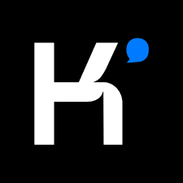
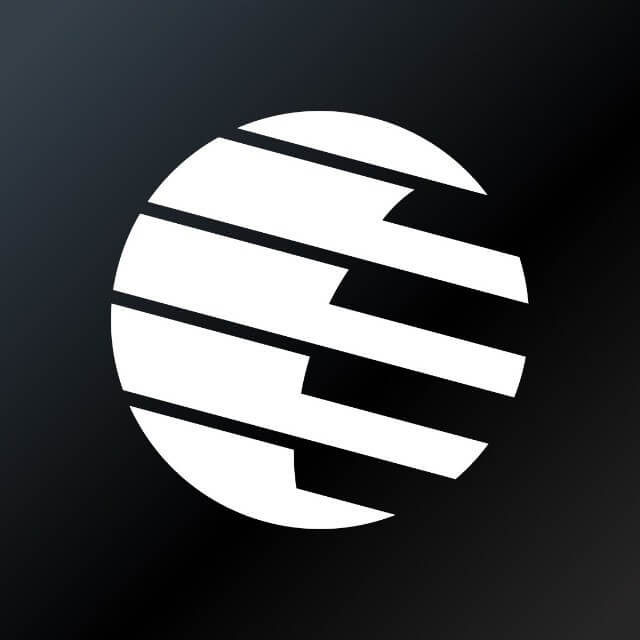
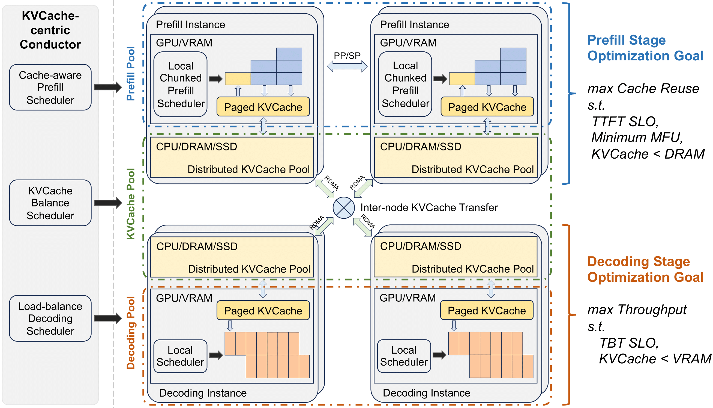
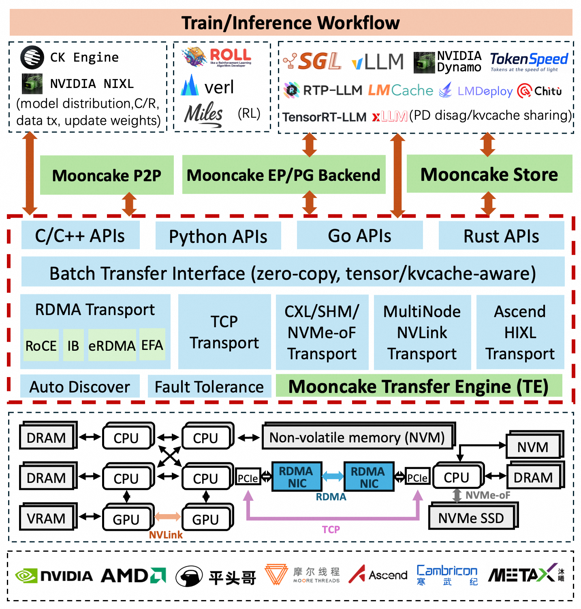
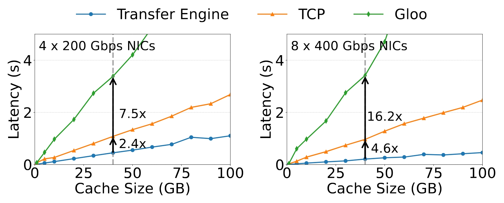
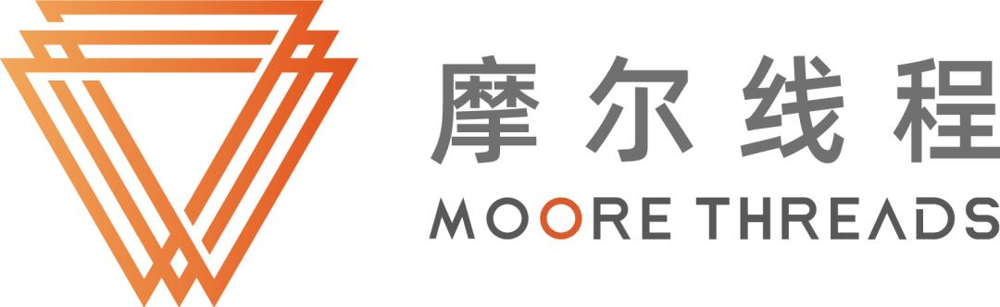
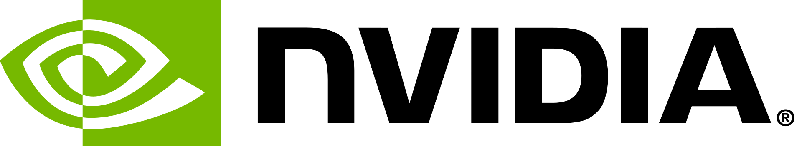
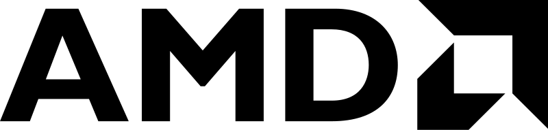

<div align="center">
  
  <h2 align="center">
      A KVCache-centric Disaggregated Architecture for LLM Serving
  </h2>
  <a href="https://www.usenix.org/system/files/fast25-qin.pdf" target="_blank"><strong>Paper</strong></a>
  | <a href="https://www.usenix.org/system/files/fast25_slides-qin.pdf" target="_blank"><strong>Slides</strong></a>
  | <a href="FAST25-release/traces" target="_blank"><strong>Traces</strong></a>
  | <a href="https://kvcache-ai.github.io/Mooncake/" target="_blank"><strong>Documentation</strong></a>
  | <a href="https://kvcache.ai/" target="_blank"><strong>Blog</strong></a>
  | <a href="https://join.slack.com/t/mooncake-project/shared_invite/zt-3qx4x35ea-zSSTqTHItHJs9SCoXLOSPA" target="_blank"><strong>Slack</strong></a>
  <br />
  <br />

  [](https://deepwiki.com/kvcache-ai/Mooncake)
  [](https://pypi.org/project/mooncake-transfer-engine)
  [](https://github.com/kvcache-ai/Mooncake/graphs/commit-activity)
  [](https://github.com/kvcache-ai/Mooncake/blob/main/LICENSE-APACHE)
  <br />

  [](https://pypi.org/project/mooncake-transfer-engine)
  [](https://pypi.org/project/mooncake-transfer-engine)
  [](https://pypi.org/project/mooncake-transfer-engine-cuda13)
  [](https://pypi.org/project/mooncake-transfer-engine-non-cuda/)
  [](https://pypi.org/project/mooncake-transfer-engine-npu/)
</div>
<br/>

Mooncake is the serving platform for  <a href="https://kimi.ai/"> Kimi</a>, a leading LLM service provided by <a href="https://www.moonshot.cn/"> Moonshot AI</a>.
Now both the Transfer Engine and Mooncake Store are open-sourced!
This repository also hosts its technical report and the open-sourced traces.

<h2 id="updates">🔄 Updates</h2>

- **May 7, 2026**: 🚀 [vLLM officially features Mooncake Store](https://vllm.ai/blog/mooncake-store) — a deep dive into how Mooncake's distributed KVCache engine supercharges vLLM inference with high-throughput, memory-efficient, cross-instance KV cache sharing!
- **Apr 29, 2026**: SGLang introduces [RDMA-based P2P weight transfer for large-scale distributed RL](https://lmsys.org/blog/2026-04-29-p2p-update/) using Mooncake TransferEngine, achieving 7x faster weight updates for the 1T-parameter Kimi-K2 model (53s → 7.2s) with zero-copy RDMA transfer across thousands of GPUs.
- **Mar 19, 2026**: [TorchSpec: Speculative Decoding Training at Scale](https://pytorch.org/blog/torchspec-speculative-decoding-training-at-scale) is [open sourced](https://github.com/torchspec-project/TorchSpec), using Mooncake to decouple inference and training via efficient hidden states management.
- **Mar 5, 2026**: [LightX2V](https://github.com/ModelTC/LightX2V/pull/893) now supports disaggregated deployment based on Mooncake, enabling encoder/transformer service decoupling with Mooncake Transfer Engine for high-performance cross-device and cross-machine data transfer.
- **Feb 25, 2026**: [SGLang](https://github.com/sgl-project/sglang) merged [Encoder Global Cache Manager](https://github.com/sgl-project/sglang/pull/16137), introducing a Mooncake-powered global multimodal embedding cache that enables cross-instance sharing of ViT embeddings to avoid redundant GPU computation.

<details>
<summary>More</summary>

- **Feb 24, 2026**: [vLLM-Omni](https://docs.vllm.ai/projects/vllm-omni/en/latest/design/feature/disaggregated_inference/) introduces disaggregated inference connectors with support for both `MooncakeStoreConnector` and `MooncakeTransferEngineConnector` for multi-node omni-modality pipelines.
- **Feb 12, 2026**: [Mooncake Joins PyTorch Ecosystem](https://pytorch.org/blog/mooncake-joins-pytorch-ecosystem/) We are thrilled to announce that Mooncake has officially joined the PyTorch Ecosystem!
- **Jan 28, 2026**: [FlexKV](https://github.com/taco-project/FlexKV), a distributed KV store and cache system from Tencent and NVIDIA in collaboration with the community, now supports [distributed KVCache reuse](https://github.com/taco-project/FlexKV/blob/main/docs/dist_reuse/README_en.md) with the Mooncake Transfer Engine.
 - **Dec 27, 2025**: Collaboration with [ROLL](https://github.com/alibaba/ROLL)! Check out the paper [here](https://arxiv.org/abs/2512.22560).
 - **Dec 23, 2025**: SGLang introduces [Encode-Prefill-Decode (EPD) Disaggregation](https://lmsys.org/blog/2026-01-12-epd/) with Mooncake as a transfer backend. This integration allows decoupling compute-intensive multimodal encoders (e.g., Vision Transformers) from language model nodes, utilizing Mooncake's RDMA engine for zero-copy transfer of large multimodal embeddings.
 - **Dec 19, 2025**: Mooncake Transfer Engine has been [integrated into TensorRT LLM](https://github.com/NVIDIA/TensorRT-LLM/tree/main/cpp/tensorrt_llm/executor/cache_transmission/mooncake_utils) for KVCache transfer in PD-disaggregated inference.
 - **Dec 19, 2025**: Mooncake Transfer Engine has been directly integrated into vLLM v1 as a [KV Connector](https://docs.vllm.ai/en/latest/features/mooncake_connector_usage/) in PD-disaggregated setups.
 - **Nov 07, 2025**: [RBG + SGLang HiCache + Mooncake](https://github.com/sgl-project/rbg/blob/main/keps/74-mooncake-integration/README.md), a role-based out-of-the-box solution for cloud native deployment, which is elastic, scalable, and high-performance.
 - **Sept 18, 2025**: Mooncake Store empowers vLLM Ascend by serving as [the distributed KV cache pool backend](https://docs.vllm.ai/projects/ascend/zh-cn/main/user_guide/feature_guide/kv_pool.html).
 - **Sept 10, 2025**: SGLang officially supports Mooncake Store as a [hierarchical KV caching storage backend](https://lmsys.org/blog/2025-09-10-sglang-hicache/). The integration extends RadixAttention with multi-tier KV cache storage across device, host, and remote storage layers.
 - **Sept 10, 2025**: The official & high-performance version of Mooncake P2P Store is open-sourced as [checkpoint-engine](https://github.com/MoonshotAI/checkpoint-engine/). It has been successfully applied in K1.5 and K2 production training, updating Kimi-K2 model (1T parameters) across thousands of GPUs in ~20s.
 - **Aug 23, 2025**: [xLLM](https://github.com/jd-opensource/xllm) high-performance inference engine builds hybrid KV cache management based on Mooncake, supporting global KV cache management with intelligent offloading and prefetching.
 - **Aug 18, 2025**: vLLM-Ascend [integrates Mooncake Transfer Engine](https://docs.vllm.ai/projects/ascend/en/latest/developer_guide/feature_guide/disaggregated_prefill.html) for KV cache register and disaggregate prefill, enabling efficient distributed inference on Ascend NPUs.
 - **Jul 20, 2025**: Mooncake powers [the deployment of Kimi K2](https://lmsys.org/blog/2025-07-20-k2-large-scale-ep/) on 128 H200 GPUs with PD disaggregation and large-scale expert parallelism, achieving 224k tokens/sec prefill throughput and 288k tokens/sec decode throughput.
 - **Jun 20, 2025**: Mooncake becomes a PD disaggregation [backend](https://kvcache-ai.github.io/Mooncake/getting_started/examples/lmdeploy-integration-v0.9.html) for LMDeploy.
 - **May 9, 2025**: NIXL officially supports Mooncake Transfer Engine as [a backend plugin](https://github.com/ai-dynamo/nixl/blob/main/src/plugins/mooncake/README.md).
 - **May 8, 2025**: [Mooncake x LMCache](https://kvcache-ai.github.io/Mooncake/getting_started/examples/lmcache-integration.html) unite to pioneer KVCache-centric LLM serving system.
 - **May 5, 2025**: Supported by Mooncake Team, SGLang release <a href="https://lmsys.org/blog/2025-05-05-large-scale-ep/" target="_blank">guidance</a> to deploy DeepSeek with PD Disaggregation on 96 H100 GPUs.
 - **Apr 22, 2025**: LMCache officially supports Mooncake Store as a <a href="https://blog.lmcache.ai/2025-04-22-tencent/" target="_blank">remote connector</a>.
 - **Apr 10, 2025**: SGLang officially supports Mooncake Transfer Engine for disaggregated prefilling and KV cache transfer.
- **Mar 7, 2025**: We open-sourced the Mooncake Store, a distributed KVCache based on Transfer Engine. vLLM's xPyD disaggregated prefilling & decoding based on Mooncake Store will be released soon.
 - **Feb 25, 2025**: Mooncake receives the **Best Paper Award** at **FAST 2025**!
 - **Feb 21, 2025**: The updated <a href="FAST25-release/traces" target="_blank">traces</a> used in our FAST'25 paper have been released.
 - **Dec 16, 2024**: vLLM officially supports Mooncake Transfer Engine for disaggregated prefilling and KV cache transfer.
- **Nov 28, 2024**: We open-sourced the Transfer Engine, the central component of Mooncake. We also provide two demonstrations of Transfer Engine: a P2P Store and vLLM integration.
- **July 9, 2024**: We open-sourced the trace as a <a href="https://github.com/kvcache-ai/Mooncake/blob/main/FAST25-release/arxiv-trace/mooncake_trace.jsonl" target="_blank">JSONL file</a>.
 - **June 27, 2024**: We present a series of Chinese blogs with more discussions on <a href="https://zhuanlan.zhihu.com/p/705754254">zhihu 1</a>, <a href="https://zhuanlan.zhihu.com/p/705910725">2</a>, <a href="https://zhuanlan.zhihu.com/p/706204757">3</a>, <a href="https://zhuanlan.zhihu.com/p/707997501">4</a>, <a href="https://zhuanlan.zhihu.com/p/9461861451">5</a>, <a href="https://zhuanlan.zhihu.com/p/1939988652114580803">6</a>, <a href="https://zhuanlan.zhihu.com/p/1959366095443064318">7</a>.
 - **June 26, 2024**: Initial technical report release.

</details>

<h2 id="overview">🎉 Overview</h2>

Mooncake features a KVCache-centric disaggregated architecture that separates the prefill and decoding clusters. It also leverages the underutilized CPU, DRAM, and SSD resources of the GPU cluster to implement a disaggregated KVCache pool.



The core of Mooncake is its KVCache-centric scheduler, which balances maximizing overall effective throughput while meeting latency-related Service Level Objectives (SLOs). Unlike traditional studies that assume all requests will be processed, Mooncake faces challenges in highly overloaded scenarios. To mitigate these, we developed a prediction-based early rejection policy. Experiments show that Mooncake excels in long-context scenarios. Compared to the baseline method, Mooncake can achieve up to a 525% increase in throughput in certain simulated scenarios while adhering to SLOs. Under real workloads, Mooncake’s innovative architecture enables <a href="https://kimi.ai/">Kimi</a> to handle 75% more requests.

<h2 id="show-cases">🔥 Show Cases</h2>

<!--  -->
<div align="center">
  
</div>

### Transfer Engine (TE)

The core of Mooncake is the Transfer Engine (TE), a high-performance data transfer framework. TE offers a unified interface for batched data movement across diverse storage, network, and accelerator environments. By supporting multiple transport protocols, topology-aware routing, multi-NIC bandwidth aggregation, and automatic failover, TE delivers low-latency, scalable, and robust data transmission for distributed AI workloads. See the [Transfer Engine guide](https://kvcache-ai.github.io/Mooncake/design/transfer-engine/index.html) for details.

<details>
<summary>Highlights</summary>

- **Efficient use of multiple RDMA NIC devices.** Transfer Engine supports the use of multiple RDMA NIC devices to achieve the *aggregation of transfer bandwidth*.

- **Topology-aware path selection.** Transfer Engine can *select optimal devices* based on the location (NUMA affinity, etc.) of both source and destination.

- **Robust against temporary network errors.** Once transmission fails, Transfer Engine will try to use alternative paths for data delivery automatically.

- **Superior performance at scale.** With 40 GB of data (equivalent to the size of the KVCache generated by 128k tokens in the LLaMA3-70B model), Mooncake Transfer Engine delivers up to **87 GB/s** and **190 GB/s** of bandwidth in 4×200 Gbps and 8×400 Gbps RoCE networks respectively, which are about **2.4x and 4.6x faster** than the TCP protocol.

<!--  -->


- **Broad support for heterogeneous transports and accelerators.** Transfer Engine provides unified data transfer across diverse protocols, including TCP, RDMA, AWS EFA, NVMe-oF, NVLink, HIP, Barex, CXL, and Ascend-family transports. When built with the corresponding runtime, Transfer Engine can detect accelerator memory and select suitable transport paths for efficient data movement across CUDA, MUSA, HIP, MACA, Cambricon MLU, and Ascend-enabled environments. For a complete list of supported protocols and configuration guide, see the [Supported Protocols Documentation](https://kvcache-ai.github.io/Mooncake/getting_started/supported-protocols.html).

- **Widely adopted across the LLM ecosystem.** TE is used in production inference stacks such as [SGLang](https://github.com/sgl-project/sglang), [vLLM](https://github.com/vllm-project/vllm), [TensorRT-LLM](https://github.com/NVIDIA/TensorRT-LLM), [vLLM-Ascend](https://github.com/vllm-project/vllm-ascend), [checkpoint-engine](https://github.com/MoonshotAI/checkpoint-engine), and [NIXL](https://github.com/ai-dynamo/nixl), among others, to efficiently transfer KV cache, embeddings, model weights, and other data.

</details>

### Mooncake Store

Mooncake Store is a high-performance distributed key-value cache storage engine designed for LLM inference. Built on the Transfer Engine, it stores and manages reusable KV caches and model weights across inference clusters, with support for efficient object storage, replication, eviction, and high-bandwidth data transfer. See the [Mooncake Store guide](https://kvcache-ai.github.io/Mooncake/design/mooncake-store.html) for details.

<details>
<summary>Highlights</summary>

- **High bandwidth utilization.** Mooncake Store supports large-object striping, parallel I/O, and end-to-end zero-copy data transfer, fully utilizing aggregated bandwidth across multiple NICs.

- **Multi-tier cache hierarchy**. Mooncake Store supports a multi-level cache design across DRAM and SSD/NVMe, enabling larger cache capacity.

- **Elastic and disaggregated storage.** Mooncake Store decouples KVCache storage from inference engines, allowing storage nodes to be dynamically added or removed while keeping cached data independent from engine restarts, upgrades, and scheduling decisions.

- **Programmatic object management.** Mooncake Store allows applications to control object placement and lifecycle through per-object policies, including replica counts, preferred segments, soft pin, and hard pin. These controls help inference systems protect important KV caches and model weights while guiding replication, placement, and eviction behavior.

- **Broad ecosystem adoption.** Broad ecosystem adoption. Mooncake Store is used across the LLM systems ecosystem as a high-performance distributed storage backend for KV caches, hidden states, and model weights. It supports integrations with [SGLang's Hierarchical KV Caching](https://lmsys.org/blog/2025-09-10-sglang-hicache/), [vLLM's prefill serving](https://docs.vllm.ai/en/latest/features/disagg_prefill.html), and [LMCache](https://kvcache-ai.github.io/Mooncake/getting_started/examples/lmcache-integration.html), and has been adopted by systems such as [TorchSpec](https://pytorch.org/blog/torchspec-speculative-decoding-training-at-scale/) and [TransferQueue](https://github.com/Ascend/TransferQueue) to decouple inference, training, and reinforcement-learning workloads through efficient state management and asynchronous data movement.

</details>

### Elastic Expert Parallelism Support

Mooncake adds elasticity and fault tolerance support for MoE model inference, enabling inference systems to remain responsive and recoverable in the event of GPU failures or changes in resource configuration. This functionality includes automatic faulty rank detection and can work with the EPLB module to dynamically route tokens to healthy ranks during inference.

### Tensor-Centric Ecosystem

Mooncake establishes a full-stack, Tensor-oriented AI infrastructure where Tensors serve as the fundamental data carrier. The ecosystem spans from the Transfer Engine, which accelerates Tensor data movement across heterogeneous storage (DRAM/VRAM/NVMe), to Mooncake Store for distributed management of Tensor objects (e.g., KVCache and model weight), up to the Mooncake Backend enabling Tensor-based elastic distributed computing. This architecture is designed to maximize Tensor processing efficiency for large-scale model inference and training.

### SGLang Integration ([Guide](https://kvcache-ai.github.io/Mooncake/getting_started/examples/sglang-integration/index.html))

Mooncake is deeply integrated into [SGLang](https://github.com/sgl-project/sglang/) as a high-performance communication and storage backend. These integrations enable efficient KV cache transfer in PD-disaggregated serving, scalable multi-level KV caching through HiCache, fault-tolerant expert-parallel inference, high-performance multimodal pipeline data movement, and fast RDMA-based weight synchronization for large-scale RL training. Together, Mooncake and SGLang provide a production-oriented foundation for building elastic, high-throughput, and resource-efficient LLM and multimodal serving systems.

<details>
<summary>Highlights</summary>

- **PD Disaggregated Serving:** SGLang officially supports Mooncake Transfer Engine as a backend for disaggregated serving and KV cache transfer, enabling prefill and decode workers to exchange KV cache data efficiently across devices and machines.

- **Hierarchical KV Caching**: Mooncake Store serves as an external storage backend in SGLang's HiCache system, extending RadixAttention with multi-level KV cache storage across device, host, and remote storage layers.

- **Elastic Expert Parallel**: Mooncake's collective communication backend and expert parallel kernels are integrated into SGLang to enable fault-tolerant expert parallel inference ([Elastic EP](https://www.lmsys.org/blog/2026-03-25-eep-partial-failure-tolerance/)).

- **Community Feedback**: Effective KV caching significantly reduces TTFT by eliminating redundant and costly re-computation. Integrating SGLang HiCache with the Mooncake service enables scalable KV cache retention and high-performance access. In our evaluation, we tested the DeepSeek-R1-671B model under PD-disaggregated deployment using in-house online requests sampled from a general QA scenario. On average, cache hits achieved an 84% reduction in TTFT compared to full re-computation. – Ant Group

- **Cloud-Native SGLang HiCache Deployment with RBG**: The RBG + SGLang HiCache + Mooncake integration provides a role-based, out-of-the-box cloud-native deployment solution that is elastic, scalable, and optimized for high-performance inference workloads.

- **Encode-Prefill-Decode Disaggregation for Multimodal Serving**": SGLang introduces Encode-Prefill-Decode disaggregation with Mooncake as a transfer backend. This enables compute-intensive multimodal encoders, such as Vision Transformers, to be decoupled from language model workers while transferring large embeddings efficiently through Mooncake’s RDMA-based engine.

- **SGLang-Omni Multi-Stage Pipeline Data Transfer**: SGLang-Omni integrates Mooncake as a relay backend for efficient cross-stage tensor and blob transfer in multimodal serving pipelines. This enables high-performance data movement between heterogeneous components such as thinker, talker, codec, and vocoder stages.

- **RDMA-Based P2P Weight Transfer for Distributed RL**: SGLang adopts Mooncake TransferEngine for RDMA-based peer-to-peer weight transfer in large-scale distributed reinforcement learning. This enables zero-copy weight updates across thousands of GPUs and significantly accelerates synchronization for trillion-parameter models.

</details>

### vLLM Integration ([Guide](https://kvcache-ai.github.io/Mooncake/getting_started/examples/vllm-integration/index.html))

Mooncake integrates with vLLM to accelerate large language model serving through high-performance KV cache transfer and distributed KV cache storage. The integration supports both disaggregated prefill-decode serving and cross-instance KV cache sharing, helping vLLM deployments reduce TTFT, improve cache reuse, and scale more efficiently across multi-node inference clusters.

<details>
<summary>Highlights</summary>

- **Disaggregated prefill-decode serving**: Mooncake enables vLLM to split prefill and decode workloads across different nodes. Through MooncakeConnector, vLLM transfers KV cache blocks from prefill workers to decode workers using Mooncake’s high-performance transfer engine, allowing prefill and decode resources to scale independently while keeping cross-node KV transfer overhead low.

- **Distributed KV cache pooling and sharing**: [Mooncake Store extends vLLM](https://vllm.ai/blog/2026-05-06-mooncake-store) from isolated per-instance KV caches to a shared, cluster-level KV cache pool. Through MooncakeStoreConnector, multiple vLLM instances can store, retrieve, and reuse KV cache blocks based on hash-based prefix caching, reducing redundant prefill computation and improving cache efficiency for workloads with repeated prefixes, especially agentic and multi-turn serving scenarios.

* **vLLM-Omni stage communication**: Mooncake also integrates with [vLLM-Omni](https://github.com/vllm-project/vllm-omni) through `MooncakeTransferEngineConnector` and `MooncakeStoreConnector`, enabling efficient cross-node data exchange between vLLM-Omni stages.

</details>

<h2 id="supported-hardware">🖥️ Supported Hardware</h2>

Mooncake supports hardware backends across accelerator vendors, cloud fabrics, and standard datacenter interconnects.

The following hardware partners and cloud platforms are supported by the Mooncake, covering GPUs, specialized AI accelerators, and cloud-native interconnects:

<div align="center">
  <table>
    <tr>
      <td align="center"><br/><sub>Huawei</sub></td>
      <td align="center"><br/><sub>Cambricon</sub></td>
      <td align="center"><br/><sub>Moore Threads</sub></td>
      <td align="center"><br/><sub>MetaX</sub></td>
      <td align="center"><br/><sub>T-Head</sub></td>
      <td align="center"><br/><sub>NVIDIA</sub></td>
      <td align="center"><br/><sub>AMD</sub></td>
      <td align="center"><br/><sub>Alibaba Cloud</sub></td>
      <td align="center"><br/><sub>AWS</sub></td>
    </tr>
  </table>
</div>

For complete protocol behavior, SDK requirements, and vendor-specific configuration, see the [supported protocols](https://kvcache-ai.github.io/Mooncake/getting_started/supported-protocols.html), [build guide](https://kvcache-ai.github.io/Mooncake/getting_started/build.html), and [Transfer Engine design docs](https://kvcache-ai.github.io/Mooncake/design/transfer-engine/index.html).

<h2 id="quick-start">🚀 Quick Start</h2>

### Before using Mooncake

Mooncake is designed and optimized for high-speed RDMA networks. Though Mooncake supports TCP-only data transfer, we **strongly** recommend users to evaluate the functionality and performance of Mooncake with RDMA network support.

The following need to be installed before running any component of Mooncake:
- RDMA Driver & SDK, such as Mellanox OFED.
- Python 3.10, virtual environment is recommended.
- CUDA 12.1 and above, including NVIDIA GPUDirect Storage Support, if the package is built with `-DUSE_CUDA` (disabled by default). *You may install them from [here](https://developer.nvidia.com/cuda-downloads)*.
- Cambricon Neuware, if the package is built with `-DUSE_MLU`. By default Mooncake looks for Neuware under `NEUWARE_HOME` or `/usr/local/neuware`.
- Hygon DTK SDK, if the package is built with `-DUSE_HYGON`. By default Mooncake looks for DTK under `DTK_HOME` or `/opt/dtk`.
- Iluvatar CoreX SDK, if the package is built with `-DUSE_COREX`. By default Mooncake looks for CoreX under `COREX_HOME` or `/usr/local/corex`.

### Use Python package
The simplest way to use Mooncake Transfer Engine is using `pip`:

**For CUDA-enabled systems:**

- CUDA < 13.0
```bash
pip install mooncake-transfer-engine
```
- CUDA >= 13.0
```bash
pip install mooncake-transfer-engine-cuda13
```

**For non-CUDA systems:**
```bash
pip install mooncake-transfer-engine-non-cuda
```

**For NPU systems:**
```bash
pip install mooncake-transfer-engine-npu
```

> [!IMPORTANT]
> - The CUDA version (`mooncake-transfer-engine`) includes Mooncake-EP and GPU topology detection, requiring CUDA 12.1+.
> - The non-CUDA version (`mooncake-transfer-engine-non-cuda`) is for environments without CUDA dependencies.
> - MLU support is currently available through source builds with `-DUSE_MLU=ON`; there is no dedicated prebuilt MLU wheel yet.
> - If users encounter problems such as missing `lib*.so`, they should uninstall the package they installed and build the binaries manually.

### Build From Source

For the default source build, use the automatic dependency script and standard CMake flow:

```bash
git clone https://github.com/kvcache-ai/Mooncake.git
cd Mooncake

sudo bash dependencies.sh

mkdir build
cd build
cmake ..
make -j
sudo make install # optional, make it ready to be used by vLLM/SGLang
```

For custom accelerator backends, Docker deployment, NVMe-oF, EFA, CXL, Redis / HTTP metadata, Rust bindings, or other advanced build options, see the [Build Guide](https://kvcache-ai.github.io/Mooncake/getting_started/build.html).

<h2 id="trace">📦 Open Source Trace</h2>

```json
{
    "timestamp": 27482,
    "input_length": 6955,
    "output_length": 52,
    "hash_ids": [46, 47, 48, 49, 50, 51, 52, 53, 54, 55, 56, 57, 2353, 2354]
}
{
    "timestamp": 30535,
    "input_length": 6472,
    "output_length": 26,
    "hash_ids": [46, 47, 48, 49, 50, 51, 52, 53, 54, 55, 56, 57, 2366]
}
```
The above presents two samples from our trace dataset. The trace includes the timing of request arrivals, the number of input tokens, the number of output tokens, and the remapped block hash. To protect our customers' privacy, we applied several mechanisms to remove user-related information while preserving the dataset's utility for simulated evaluation. More descriptions of the trace (e.g., up to 50% cache hit ratio) can be found in Section 4 of the technical report.

**_Update[Feb 21, 2025]: The updated [traces](FAST25-release/traces) used in our FAST'25 paper have been released! Please refer to the paper's appendix (found [here](FAST25-release/Mooncake-FAST25.pdf)) for more details._**

<h2 id="citation">📑 Citation</h2>
Please kindly cite our papers if you find the papers or the traces are useful:

```bibtex
@article{sun2026survivingpartialrankfailures,
  title     = {Surviving Partial Rank Failures in Wide Expert-Parallel MoE Inference},
  author    = {Xun Sun and Shaoyuan Chen and Pingchuan Ma and Yue Chen and Ziwei Yuan and Zhanhao Cao and Han Han and Shangming Cai and Teng Ma and Xuchun Shang and Xinpeng Zhao and Ke Yang and Junlin Wei and Lianzhi Lin and Yuji Liu and Feng Ren and Haoran Hu and Cheng Wan and Yingdi Shan and Yongwei Wu and Mingxing Zhang},
  year      = {2026},
  url       = {https://arxiv.org/abs/2605.10670},
}

@article{qin2025mooncake_tos,
  author    = {Qin Ruoyu and Li Zheming and He Weiran and Cui Jialei and Tang Heyi and Ren Feng and Ma Teng and Cai Shangming and Zhang Yineng and Zhang Mingxing and Wu Yongwei and Zheng Weimin and Xu Xinran},
  title     = {Mooncake: A KVCache-centric Disaggregated Architecture for LLM Serving},
  year      = {2025},
  publisher = {Association for Computing Machinery},
  address   = {New York, NY, USA},
  issn      = {1553-3077},
  url       = {https://doi.org/10.1145/3773772},
  doi       = {10.1145/3773772},
  journal   = {ACM Trans. Storage},
  month     = {nov},
  keywords  = {Machine learning system, LLM serving, KVCache},
}

@inproceedings{qin2025mooncake,
  author    = {Ruoyu Qin and Zheming Li and Weiran He and Jialei Cui and Feng Ren and Mingxing Zhang and Yongwei Wu and Weimin Zheng and Xinran Xu},
  title     = {Mooncake: Trading More Storage for Less Computation {\textemdash} A {KVCache-centric} Architecture for Serving {LLM} Chatbot},
  booktitle = {23rd USENIX Conference on File and Storage Technologies (FAST 25)},
  year      = {2025},
  isbn      = {978-1-939133-45-8},
  address   = {Santa Clara, CA},
  pages     = {155--170},
  url       = {https://www.usenix.org/conference/fast25/presentation/qin},
  publisher = {USENIX Association},
  month     = {feb},
}

@article{qin2024mooncake_arxiv,
  title  = {Mooncake: A KVCache-centric Disaggregated Architecture for LLM Serving},
  author = {Ruoyu Qin and Zheming Li and Weiran He and Mingxing Zhang and Yongwei Wu and Weimin Zheng and Xinran Xu},
  year   = {2024},
  url    = {https://arxiv.org/abs/2407.00079},
}
```
