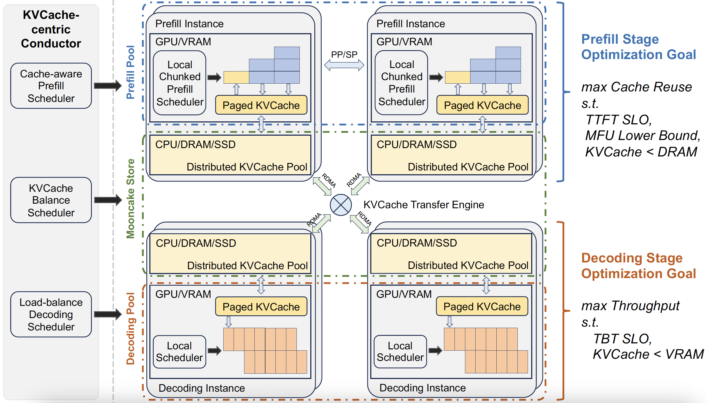

<div align="center">
  <h1>Mooncake: A KVCache-centric Disaggregated<br/> Architecture for LLM Serving</h1>
  <a href="https://arxiv.org/abs/2407.00079" target="_blank"><strong>📃 Technical Report</strong></a>
</div>
<br/>

Mooncake is the serving platform for  <a href="https://kimi.ai/"> Kimi</a>, a leading LLM service provided by <a href="https://www.moonshot.cn/"> Moonshot AI</a>. 
This repository hosts its technical report and also the open sourced traces. 

More will come - perhaps not very soon, but stay tuned!

<h2 id="updates">🔥 Updates</h2>

 - **July 9, 2024**: We open sourced the trace as a <a href="https://github.com/kvcache-ai/Mooncake/blob/main/mooncake_trace.jsonl" target="_blank">jsonl file</a>!.
 - **June 27, 2024**: We present a series of Chinese blogs with more discussions on <a href="https://zhuanlan.zhihu.com/p/705754254">zhihu 1</a>, <a href="https://zhuanlan.zhihu.com/p/705910725">2</a>, <a href="https://zhuanlan.zhihu.com/p/706204757">3</a>, <a href="https://zhuanlan.zhihu.com/p/707997501">4</a>.
 - **June 26, 2024**: Initial technical report release.


<h2 id="overview">🎉 Overview</h2>

Mooncake features a KVCache-centric disaggregated architecture that separates the prefill and decoding clusters. It also leverages the underutilized CPU, DRAM, and SSD resources of the GPU cluster to implement a disaggregated cache of KVCache. 



The core of Mooncake is its KVCache-centric scheduler, which balances maximizing overall effective throughput while meeting latency-related Service Level Objectives (SLOs) requirements. Unlike traditional studies that assume all requests will be processed, Mooncake faces challenges due to highly overloaded scenarios. To mitigate these, we developed a prediction-based early rejection policy. Experiments show that Mooncake excels in long-context scenarios. Compared to the baseline method, Mooncake can achieve up to a 525% increase in throughput in certain simulated scenarios while adhering to SLOs. Under real workloads, Mooncake’s innovative architecture enables <a href="https://kimi.ai/">Kimi</a> to handle 75% more requests.

<h2 id="trace">📦 Open Source Trace</h2>

```json
{
    "timestamp": 27482,
    "input_length": 6955,
    "output_length": 52,
    "hash_ids": [46, 47, 48, 49, 50, 51, 52, 53, 54, 55, 56, 57, 2353, 2354]
}
{
    "timestamp": 30535,
    "input_length": 6472,
    "output_length": 26,
    "hash_ids": [46, 47, 48, 49, 50, 51, 52, 53, 54, 55, 56, 57, 2366]
}
```
The above presents two samples from our trace dataset. The trace includes the timing of request arrivals, the number of input tokens, the number of output tokens, and the remapped block hash. To protect our customers' privacy, we applied several mechanisms to remove user-related information while preserving the dataset's utility for simulated evaluation. More descriptions of the trace (e.g., up to 50% cache hit ratio) can be found in Section 4 of the paper's Version 3.

<h2 id="citation">📑 Citation</h2>
Please kindly cite our paper if you find the paper or the trace is useful:

```bibtex
@article{qin2024mooncake,
  title        = {Mooncake: A KVCache-centric Disaggregated Architecture for LLM Serving},
  author       = {Ruoyu Qin, Zheming Li, Weiran He, Mingxing Zhang, Yongwei Wu, Weimin Zheng, and Xinran Xu},
  year         = {2024},
  url          = {https://arxiv.org/abs/2407.00079}
}
```
