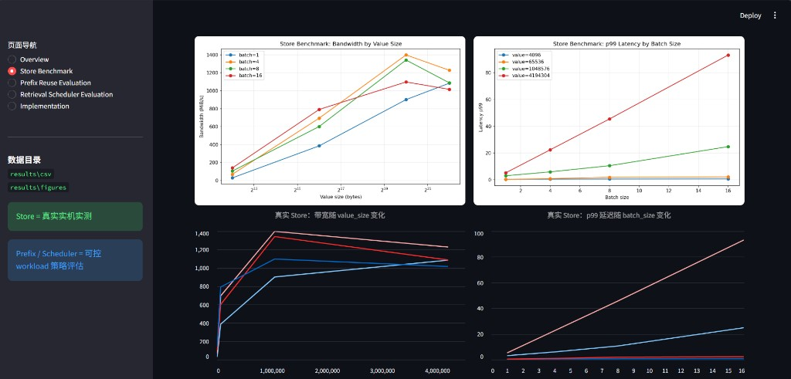
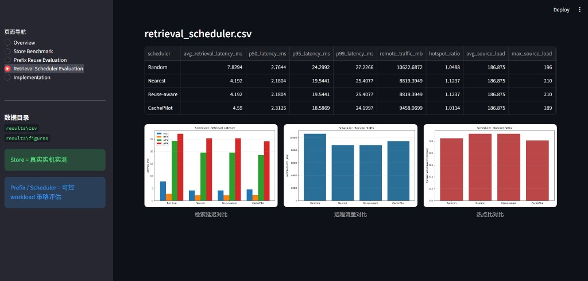

# CachePilot

### 基于 Mooncake 的 KVCache 复用与调度评测系统

> **演示视频（百度网盘）**  
> 链接：https://pan.baidu.com/s/1eXwtXfHxEAkfoE_EqY9pdw  
> 提取码：`hvb7`

<p align="center">
  
</p>

<p align="center">
  <b>真实 Mooncake Store 实机实测</b> · AutoDL RTX 4090 · TCP · 峰值带宽 <code>1399.08 MiB/s</code>
</p>

<p align="center">
  <a href="https://pan.baidu.com/s/1eXwtXfHxEAkfoE_EqY9pdw">演示视频</a> ·
  <a href="#真实实测结果摘要">实测结果</a> ·
  <a href="#创新性">创新性</a> ·
  <a href="#开源规范性">开源规范</a> ·
  <a href="#场景适配性">场景适配</a> ·
  <a href="#dashboard-可视化演示">Dashboard</a> ·
  <a href="#如何运行">快速开始</a> ·
  <a href="DESIGN.md">设计文档</a> ·
  <a href="EVALUATION.md">评测文档</a> ·
  <a href="docs/CachePilot_技术文档.pdf">技术文档 PDF</a> ·
  <a href="docs/CachePilot_彩色汇报PPT.pdf">汇报 PPT PDF</a>
</p>

---

## 项目简介

**CachePilot** 是 2026 Mooncake 赛题参赛作品：一个**非侵入式** KVCache 评测套件。

它以 Mooncake 官方 Store Benchmark 为真实底座，通过封装 `store_kv_bench.py` 完成真实 Mooncake Store 的 put/get/`read_perf` **实机测试**，并扩展 Prefix Reuse 可控 workload 评估与 Retrieval Scheduler 离线策略评估。系统统一输出 CSV、日志、图表，并提供 Streamlit Dashboard 用于演示与截图。

**不修改 Mooncake 核心代码。** 真实调用链路：

```text
mooncake_master → HTTP metadata → MooncakeDistributedStore
  → store_kv_bench.py → mooncake_store_runner.py → results/ → dashboard.py
```

| 模块 | 性质 | 说明 |
|------|------|------|
| Store Benchmark | **真实实机实测** | 官方 `store_kv_bench.py` + `MooncakeDistributedStore` |
| Prefix Reuse Evaluation | 可控 workload 评估 | prefix length × hit ratio → TTFT 改善趋势 |
| Retrieval Scheduler Evaluation | 离线策略评估 | Random / Nearest / Reuse-aware / CachePilot |

### 评审维度对齐

| 维度 | 权重 | CachePilot 体现 |
|------|------|-----------------|
| 技术完整性 | 30% | 真实 Store 实测 + Prefix / Scheduler 评估 + Dashboard + 文档 / PPT / 视频 |
| 开源规范性 | 10% | 独立仓库、清晰目录、可复现脚本、文档齐全、非侵入对接 Mooncake |
| 场景适配性 | 25% | 对齐长上下文 Prefix 复用、Store IO、多节点 KV 检索调度等真实 serving 场景 |
| 创新性 | 35% | **CachePilot 多目标检索评分** + Store→复用→调度闭环评测 + 非侵入官方 bench 扩展 |

---

## 开源规范性

CachePilot 以**可独立复现、可审查、可二次开发**为目标组织开源交付物，不 fork、不 patch Mooncake 核心。

| 规范项 | 落地方式 |
|--------|----------|
| 独立开源仓库 | 独立 GitHub 仓库，与 Mooncake 解耦；通过 `MOONCAKE_ROOT` / `--mooncake-root` 对接 |
| 非侵入集成 | 仅 subprocess 调用官方 `store_kv_bench.py`，不修改 Mooncake C++/Python 源码 |
| 目录与模块清晰 | `benchmark/`、`scripts/`、`results/`、`docs/` 职责分离，入口脚本可执行 |
| 依赖可声明 | `requirements.txt` 明确列出 `numpy` / `pandas` / `matplotlib` / `streamlit` |
| 一键复现 | `bash scripts/run_all.sh` 产出 CSV / log / figures；`run_dashboard.sh` 可视化 |
| 文档完备 | `README.md` + `DESIGN.md` + `EVALUATION.md` + 技术文档 PDF + 汇报 PPT + 演示视频 |
| 结果可追溯 | 真实实测 CSV / 原始 Store 日志 / 决策明细一并归档，指标可核对 |
| 跨平台脚本 | Linux `*.sh` + Windows `run_dashboard.bat`；路径统一相对项目根 |
| 许可证 | 本仓库采用 [MIT License](LICENSE)；Mooncake 本体遵循其上游许可证 |

**评审可直接验证：** clone → `pip install -r requirements.txt` → `bash scripts/run_all.sh` / `bash scripts/run_dashboard.sh`。

---

## 场景适配性

CachePilot 面向 Mooncake / LLM serving 中的真实 KVCache 痛点设计，而不是脱离场景的通用压测工具。

| 真实场景 | 痛点 | CachePilot 适配方式 |
|----------|------|---------------------|
| 长上下文 Prefill | TTFT 随 prefix 变长急剧上升 | Prefix Reuse Evaluation：量化 hit ratio / prefix length 对 TTFT 的改善 |
| 多请求共享 System Prompt / RAG 前缀 | Prefix KV 可复用但缺少收益评估 | 可控 workload：`prefix_tokens × cache_hit_ratio`，可与真实 Store get 延迟标定 |
| Mooncake Store 读写 | 需要官方语义下的吞吐 / 尾延迟基线 | 真实调用 `verify_write` / `read_perf`，覆盖 4KB→4MB、batch 1→16 |
| Prefill–Decode 分离与跨节点取 KV | 副本选择影响延迟、远程流量与热点 | Retrieval Scheduler：对比 Random / Nearest / Reuse-aware / **CachePilot** |
| 集群过载与热点源节点 | 热点副本拖垮尾延迟 | `hotspot_ratio`、`remote_traffic_mb`、p99 联合评估 |
| 比赛 / 工程演示与复现 | 需要可展示、可截图、可复核 | Streamlit Dashboard + 归档 CSV / PNG / 视频 |

**与 Mooncake 能力的对应关系：**

- **Store 层**：适配 `MooncakeDistributedStore` 的 put/get 与官方 scenario，建立真实 IO 基线。  
- **复用层**：适配长上下文 / 多轮对话中的 Prefix Cache 复用收益分析。  
- **调度层**：适配多副本、多节点检索时的延迟–流量–负载权衡，CachePilot 分数显式纳入 importance、reuse、fetch latency。

> 说明：Store Benchmark 为 AutoDL RTX 4090 上的**真实实机实测**；Prefix / Scheduler 为面向上述场景的**可控 workload 策略评估**，用于指导调度与复用策略，不替代端到端 LLM serving 声明。

---

## 创新性

CachePilot 的创新不在于重写 Mooncake，而在于提出一套**可落地的 KVCache 评测与调度方法论**：用真实 Store 建立 IO 基线，用可控 workload 量化 Prefix 复用收益，再用多目标评分策略优化跨节点检索，三者形成闭环。

### 创新点一：CachePilot 多目标检索评分（核心算法）

相对 Random / Nearest / 仅看复用的 Reuse-aware，CachePilot 在选副本时同时权衡 **重要性、复用热度、拉取代价、瞬时负载、本地亲和**：

```text
score = α · importance
      + β · normalized_reuse
      − γ · normalized_fetch_latency
      − load_penalty
      + local_bonus
```

| 相对基线 | 基线做法 | CachePilot 增量 |
|----------|----------|-----------------|
| Random | 随机挑副本 | 用可解释分数替代盲目选择 |
| Nearest | 只最小化距离 / 延迟 | 额外纳入 reuse 与 importance，避免“近但不重要” |
| Reuse-aware | 偏爱高复用块 | 额外抑制高延迟与热点源，降低 `hotspot_ratio` |
| **CachePilot** | — | **多目标联合优化**：延迟 ↓、远程流量可控、热点更均衡 |

实验对比（同一 workload、固定 seed）可见：CachePilot 在保持较低 p99 的同时，**热点比优于 Nearest / Reuse-aware**（见 Dashboard Scheduler 页与 `retrieval_scheduler.csv`）。

### 创新点二：Store → Prefix → Scheduler 闭环评测框架

多数工作只做其中一层；CachePilot 把三层串成可复现流水线：

```text
真实 Mooncake Store 实测（吞吐 / p50 / p99）
        ↓ 标定 store_get 延迟参数
Prefix Reuse 收益评估（TTFT reduction）
        ↓ 暴露跨节点取 KV 的代价结构
Retrieval Scheduler 策略对比（CachePilot vs 基线）
        ↓
统一 CSV / 图表 / Dashboard 输出
```

**创新含义：** 不是“再跑一遍官方 bench”，而是把官方 Store 指标转化为上层复用与调度决策的输入，形成 **测量 → 量化 → 决策** 的评测闭环。

### 创新点三：非侵入式官方 Benchmark Extension

| 常见做法 | CachePilot 做法 |
|----------|-----------------|
| Fork Mooncake 改核心 | **零侵入**：独立仓库，subprocess 包装 `store_kv_bench.py` |
| 自研假 Store API | **真实** `MooncakeDistributedStore` 语义与官方 scenario |
| 单次手工压测 | 参数矩阵自动化：`value_size × batch_size`，日志解析入库 |
| 只有数字表格 | CSV + PNG + Streamlit Dashboard，面向评审演示 |

这使创新成果可以**在不改上游的前提下复现、对比、扩展**（例如继续接入 `zcopy` / `mixed_rw` / RDMA）。

### 创新点四：把“复用值不值”变成可计算指标

Prefix Reuse Evaluation 将长上下文场景抽象为：

```text
TTFT_cache = hit · (Store_get + decode_1st) + (1−hit) · (prefill + decode_1st)
TTFT_reduction = TTFT_no_cache − TTFT_cache
```

从而回答工程上真正关心的问题：**在给定 prefix 长度与命中率下，复用能换来多少 TTFT 收益？**  
该模块可直接吃真实 Store 的 get 延迟标定，使评估结果与实测底座对齐，而不是脱离硬件的空泛曲线。

### 一句话总结

> **CachePilot = 真实 Mooncake Store 基线 × Prefix 复用收益量化 × 多目标检索评分调度**  
> 在不修改 Mooncake 核心的前提下，给出可复现、可对比、可演示的 KVCache 优化评测方案。

---

## Dashboard 预览

Streamlit 演示界面，适合比赛录屏与文档截图。

### Store Benchmark — 真实 Mooncake Store 实测

<p align="center">
  
</p>

> 带宽随 value size 上升，峰值约 **1399 MiB/s**（1MB, batch=4）；大对象高 batch 下 p99 明显升高。

### Retrieval Scheduler — 策略评估对比

<p align="center">
  
</p>

> 对比 Random / Nearest / Reuse-aware / CachePilot 的延迟、远程流量与热点比。

### 启动 Dashboard

```bash
# From Mooncake repo root:
cd benchmarks/cachepilot
python3 -m venv .venv && source .venv/bin/activate
pip install -r requirements.txt
bash scripts/run_dashboard.sh
# Windows: scripts\run_dashboard.bat
```

浏览器打开 [http://localhost:8501](http://localhost:8501)（服务器请使用外部映射地址）。

---

## 真实实测结果摘要

**环境：** AutoDL · RTX 4090 24GB · 16 核 / 120GB · Ubuntu 22.04 · Python 3.10 · CUDA 11.8 · `mooncake-transfer-engine-non-cuda` · **TCP**

### verify_write — `return_code=0`

| req/s | kv/s | MiB/s | p50 | p95 | p99 | misses | verify_failures |
|------:|-----:|------:|----:|----:|----:|-------:|----------------:|
| 2482.98 | 9931.94 | 38.8 | 0.260 ms | 0.718 ms | 0.781 ms | **0** | **0** |

### read_perf — 16 组全部 `return_code=0`

| value_size | batch | MiB/s | p50 | p99 |
|------------|------:|------:|----:|----:|
| 4KB | 1 | 28.78 | 0.106 ms | 0.380 ms |
| 4KB | 16 | 139.86 | 0.352 ms | 0.703 ms |
| 64KB | 4 | 694.43 | 0.304 ms | 0.917 ms |
| **1MB** | **4** | **1399.08** | 2.574 ms | 5.956 ms |
| 4MB | 4 | 1227.74 | 12.251 ms | 22.456 ms |
| 4MB | 16 | 1015.36 | 52.517 ms | **93.267 ms** |

<p align="center">
  
  
</p>

<p align="center">
  <sub>左：真实 Store 带宽 · 右：真实 Store p99 延迟</sub>
</p>

---

## 策略评估图表

<p align="center">
  
  
</p>

<p align="center">
  
  
  
</p>

---

## 赛题对应关系

| 赛题关注点 | CachePilot 模块 | 说明 |
|-----------|-----------------|------|
| Mooncake Store 性能 | `mooncake_store_runner.py` | 真实调用官方 bench，实测 `MooncakeDistributedStore` |
| KVCache 复用 | `prefix_reuse_benchmark.py` | 可控 Prefix Reuse workload 评估 |
| 检索 / 调度优化 | `retrieval_scheduler_sim.py` | Retrieval Scheduler 策略评估 |
| 可复现实验 | `scripts/run_all.sh` + Dashboard | CSV / PNG / log + 可视化演示 |
| 开源规范 | 独立仓库 + LICENSE + 文档 | 非侵入、可复现、可审查 |
| 场景适配 | Prefix / Store / Scheduler | 对齐长上下文复用与跨节点取 KV |
| 创新性 | CachePilot 评分 + 闭环评测 | 多目标调度、Store→复用→调度、官方 bench 扩展 |

---

## 目录结构

```text
CachePilot/
├── README.md / DESIGN.md / EVALUATION.md
├── dashboard.py                 # Streamlit 演示界面
├── requirements.txt
├── benchmark/                   # Store wrapper + 策略评估 + 绘图
├── scripts/
│   ├── run_all.sh
│   ├── run_dashboard.sh         # Linux / Git Bash
│   └── run_dashboard.bat        # Windows
├── docs/
│   ├── screenshots/             # Dashboard 截图
│   ├── CachePilot_技术文档.pdf
│   └── CachePilot_彩色汇报PPT.pdf
└── results/
    ├── csv/                     # 真实实测 + 评估 CSV
    ├── logs/
    └── figures/                 # 带宽 / 延迟 / TTFT / 调度图
```

---

## 安装与运行

```bash
cd benchmarks/cachepilot   # or: cd CachePilot for the standalone repo
python3 -m venv .venv
source .venv/bin/activate          # Windows: .venv\Scripts\activate
pip install -r requirements.txt
```

依赖：`numpy` · `pandas` · `matplotlib` · `streamlit`  
Store 实测另需 Mooncake Python binding（本实验：`mooncake-transfer-engine-non-cuda`）并启动 master。

### 设置 MOONCAKE_ROOT

```bash
export MOONCAKE_ROOT=/path/to/Mooncake
# 或: python benchmark/mooncake_store_runner.py --mooncake-root /path/to/Mooncake ...
```

未指定时自动尝试 `../Mooncake`、`../../Mooncake`、`/root/autodl-tmp/mooncake_competition/Mooncake`。

### 启动 Mooncake master

```bash
mooncake_master \
  --enable_http_metadata_server=true \
  --http_metadata_server_host=0.0.0.0 \
  --http_metadata_server_port=8080 \
  --eviction_high_watermark_ratio=0.95
```

| 参数 | 本实验值 |
|------|----------|
| metadata-server | `http://HOST_IP:8080/metadata` |
| master-server | `HOST_IP:50051` |
| protocol | `tcp` |

### 一键全流程

```bash
export MOONCAKE_ROOT=/path/to/Mooncake
bash scripts/run_all.sh
bash scripts/run_dashboard.sh
```

---

## 输出文件

| 路径 | 说明 |
|------|------|
| `results/csv/store_verify_real.csv` | 真实 verify_write |
| `results/csv/store_benchmark.csv` | 真实 read_perf（16 组） |
| `results/csv/prefix_reuse.csv` | Prefix Reuse 评估 |
| `results/csv/retrieval_scheduler.csv` | Scheduler 策略评估 |
| `results/figures/*.png` | 带宽 / 延迟 / TTFT / 调度图 |
| `docs/screenshots/*.png` | Dashboard 演示截图 |
| `docs/CachePilot_技术文档.pdf` | 技术文档 |
| `docs/CachePilot_彩色汇报PPT.pdf` | 汇报 PPT |

---

## 当前限制

1. **非侵入**：不修改 Mooncake 核心，Store 依赖官方 bench 与 `MooncakeDistributedStore`。
2. **Prefix / Scheduler** 为离线策略评估，不作为端到端集群 LLM serving 性能声明。
3. Store 实测需 `mooncake_master` + Mooncake Python binding。
4. 当前实机验证为**单机 TCP**；RDMA / 多机待扩展。

---

## 后续计划

- 扩展 `fill` / `write_perf` / `mixed_rw` / `zcopy` 一键矩阵
- 用真实 Store get 延迟标定 Prefix Reuse 参数
- 扩展 CachePilot 调度分数（副本、带宽预算、拓扑）
- 多机 / RDMA 联合评测

---

## License

本仓库采用 [MIT License](LICENSE)。Mooncake 本体请遵循其上游许可证。
