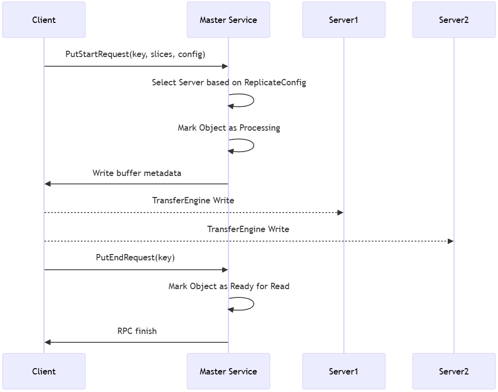

# Mooncake Store Preview

## Introduction

Mooncake Store is a high-performance **distributed key-value (KV) cache storage engine** designed specifically for LLM inference scenarios.

Unlike traditional caching systems such as Redis or Memcached, Mooncake Store is positioned as **a distributed KV cache rather than a generic caching system**. The key difference is that in the former, the key is derived from the value through hashing, so value is immutable after inserting (although the key/value pair may be garbage collected).

Mooncake Store provides low-level object storage and management capabilities, while specific caching strategies (e.g., eviction policies) are left to upper-layer frameworks (like vLLM) or users for implementation, offering higher flexibility and customizability.

Key features of Mooncake Store include:
- **Object-level storage operations**: Mooncake Store provides simple and easy-to-use object-level APIs, including `Put`, `Get`, and `Remove` operations.
- **Multi-replica support**: Mooncake Store supports storing multiple data replicas for the same object, effectively alleviating hotspots in access pressure.
- **Eventual consistency**: Mooncake Store ensures that `Get` operations read complete and correct data, but does not guarantee the latest written data. This eventual consistency model ensures high performance while simplifying system design.
- **High bandwidth utilization**: Mooncake Store supports striping and parallel I/O transfer of large objects, fully utilizing multi-NIC aggregated bandwidth for high-speed data reads and writes.
- **Dynamic resource scaling**: Mooncake Store supports dynamically adding and removing nodes to flexibly handle changes in system load, achieving elastic resource management (to be refined in future versions).

## Architecture

Mooncake Store is managed by a global **Master Service** responsible for allocating storage space pools. The specific allocation details are implemented by the `BufferAllocator` class, coordinated by the `AllocationStrategy` strategy class.


As shown in the figure above, there are two key components in Mooncake Store Preview:
1. **Master Service**: Manages the logical storage space pool of the entire cluster and maintains node entry and exit. This is an independently running process that provides RPC services externally. Note that the metadata service required by the Transfer Engine (via etcd, Redis, or HTTP, etc.) is not included in the Master Service and needs to be deployed separately.
2. **Client**: Shares a process with the vLLM instance (at least in the current version). Each Client is allocated a certain size of DRAM space, serving as part of the logical storage space pool. Therefore, data transfer is actually from one Client to another, bypassing the Master.

## Client C++ API

### Constructor and Initialization `Init`

```C++
ErrorCode Init(const std::string& local_hostname,
               const std::string& metadata_connstring,
               const std::string& protocol,
               void** protocol_args,
               const std::string& master_addr);
```

Initializes the Mooncake Store client. The parameters are as follows:
- `local_hostname`: The `IP:Port` of the local machine or an accessible domain name (default value used if port is not included)
- `metadata_connstring`: The address of the metadata service (e.g., etcd/Redis) required for Transfer Engine initialization
- `protocol`: The protocol supported by the Transfer Engine, including RDMA and TCP
- `protocol_args`: Protocol parameters required by the Transfer Engine
- `master_addr`: The address information (`IP:Port`) of the Master

### Get

```C++
ErrorCode Get(const std::string& object_key, 
              std::vector<Slice>& slices);
```


Used to retrieve the value corresponding to `object_key`. The retrieved data is guaranteed to be complete and correct. The retrieved value is stored in the memory region pointed to by `slices` via the Transfer Engine, which can be local DRAM/VRAM memory space registered in advance by the user through `registerLocalMemory(addr, len)`. Note that this is not the logical storage space pool (Logical Memory Pool) managed internally by Mooncake Store.

### Put

```C++
ErrorCode Put(const ObjectKey& key,
              std::vector<Slice>& slices,
              const ReplicateConfig& config);
```



Used to store the value corresponding to `key`. The required number of replicas can be set via the `config` parameter. The data structure details of `ReplicateConfig` are as follows:

```C++
enum class MediaType {
    VRAM,
    RAM,
    SSD
};

struct Location {
    std::string segment_name;   // Segment Name within the Transfer Engine, usually the local_hostname field filled when the target server starts
};

struct ReplicateConfig {
    uint64_t replica_num;       // Total number of replicas for the object
    std::map<MediaType, int> media_replica_num; // Number of replicas allocated on a specific medium, with the higher value taken if the sum exceeds replica_num
    std::vector<Location> locations; // Specific storage locations (machine and medium) for a replica
};
```

### Remove

```C++
ErrorCode Remove(const ObjectKey& key);
```

Used to delete the object corresponding to the specified key. This interface marks all data replicas associated with the key in the storage engine as deleted, without needing to communicate with the corresponding storage node (Client).

### Master Service

The cluster's available resources are viewed as a large resource pool, managed centrally by a Master process for space allocation and guiding data replication 

**Note: The Master Service does not take over any data flow, only providing corresponding metadata information.**

#### Master Service APIs

The protobuf definition between Master and Client is as follows:

```protobuf
message BufHandle {
  required uint64 segment_name = 1;  // Storage segment name (can be simply understood as the name of the storage node)
  required uint64 size = 2;          // Size of the allocated space
  required uint64 buffer = 3;        // Pointer to the allocated space

  enum BufStatus {
    INIT = 0;          // Initial state, space reserved but not used
    COMPLETE = 1;      // Completed usage, space contains valid data
    FAILED = 2;        // Usage failed, upstream should update the handle state to this value
    UNREGISTERED = 3;  // Space has been unregistered, metadata deleted
  }
  required BufStatus status = 4 [default = INIT]; // Space status
};

message ReplicaInfo {
  repeated BufHandle handles = 1; // Specific locations of the stored object data

  enum ReplicaStatus {
    UNDEFINED = 0;   // Uninitialized
    INITIALIZED = 1; // Space allocated, waiting for write
    PROCESSING = 2;  // Writing data in progress
    COMPLETE = 3;    // Write completed, replica available
    REMOVED = 4;     // Replica has been removed
    FAILED = 5;      // Replica write failed, consider reallocation
  }
  required ReplicaStatus status = 2 [default = UNDEFINED]; // Replica status
};

service MasterService {
  // Get the list of replicas for an object
  rpc GetReplicaList(GetReplicaListRequest) returns (GetReplicaListResponse);

  // Start Put operation, allocate storage space
  rpc PutStart(PutStartRequest) returns (PutStartResponse);

  // End Put operation, mark object write completion
  rpc PutEnd(PutEndRequest) returns (PutEndResponse);

  // Delete all replicas of an object
  rpc Remove(RemoveRequest) returns (RemoveResponse);

  // Storage node (Client) registers a storage segment
  rpc MountSegment(MountSegmentRequest) returns (MountSegmentResponse);

  // Storage node (Client) unregisters a storage segment
  rpc UnmountSegment(UnmountSegmentRequest) returns (UnmountSegmentResponse);
}
```

1. GetReplicaList

```protobuf
message GetReplicaListRequest {
  required string key = 1; 
};

message GetReplicaListResponse {
  required int32 status_code = 1;
  repeated ReplicaInfo replica_list = 2; // List of replica information
};
```

- **Request**: `GetReplicaListRequest` containing the key to query.
- **Response**: `GetReplicaListResponse` containing the status code status_code and the list of replica information `replica_list`.
- **Description**: Used to retrieve information about all available replicas for a specified key. The Client can select an appropriate replica for reading based on this information.

2. PutStart

```protobuf
message PutStartRequest {
  required string key = 1;             // Object key
  required int64 value_length = 2;     // Total length of data to be written
  required ReplicateConfig config = 3; // Replica configuration information
  repeated uint64 slice_lengths = 4;   // Lengths of each data slice
};

message PutStartResponse {
  required int32 status_code = 1; 
  repeated ReplicaInfo replica_list = 2;  // Replica information allocated by the Master Service
};
```

- **Request**: `PutStartRequest` containing the key, data length, and replica configuration config.
- **Response**: `PutStartResponse` containing the status code status_code and the allocated replica information replica_list.
- **Description**: Before writing an object, the Client must call PutStart to request storage space from the Master Service. The Master Service allocates space based on the config and returns the allocation results (`replica_list`) to the Client. The Client then writes data to the storage nodes where the allocated replicas are located. The need for both start and end steps ensures that other Clients do not read partially written values, preventing dirty reads.

3. PutEnd

```protobuf
message PutEndRequest {
  required string key = 1; 
};

message PutEndResponse {
  required int32 status_code = 1;
};
```

- **Request**: `PutEndRequest` containing the key.
- **Response**: `PutEndResponse` containing the status code status_code.
- **Description**: After the Client completes data writing, it calls `PutEnd` to notify the Master Service. The Master Service updates the object's metadata, marking the replica status as `COMPLETE`, indicating that the object is readable.

4. Remove

```protobuf
message RemoveRequest {
  required string key = 1; 
};

message RemoveResponse {
  required int32 status_code = 1;
};
```

- **Request**: `RemoveRequest` containing the key of the object to be deleted.
- **Response**: `RemoveResponse` containing the status code `status_code`.
- **Description**: Used to delete the object and all its replicas corresponding to the specified key. The Master Service marks all replicas of the corresponding object as deleted.

5. MountSegment

```protobuf
message MountSegmentRequest {
  required uint64 buffer = 1;       // Starting address of the space
  required uint64 size = 2;         // Size of the space
  required string segment_name = 3; // Storage segment name
}

message MountSegmentResponse {
  required int32 status_code = 1;
};
```

The storage node (Client) allocates a segment of memory and, after calling `TransferEngine::registerLocalMemory` to complete local mounting, calls this interface to mount the allocated continuous address space to the Master Service for allocation.

6. UnmountSegment

```protobuf
message UnmountSegmentRequest {
  required string segment_name = 1;  // Storage segment name used during mounting
}

message UnMountSegmentResponse {
  required int32 status_code = 1;
};
```

When the space needs to be released, this interface is used to remove the previously mounted resources from the Master Service.

#### Object Information Maintenance
The Master Service needs to maintain mappings related to `BufferAllocator` and object metadata to efficiently manage memory resources and precisely control replica states in multi-replica scenarios. Additionally, the Master Service uses read-write locks to protect critical data structures, ensuring data consistency and security in multi-threaded environments. The following are the interfaces maintained by the Master Service for storage space information:

- MountSegment

```C++
ErrorCode MountSegment(uint64_t buffer,
                       uint64_t size,
                       const std::string& segment_name);
```

The storage node (Client) registers the storage segment space with the Master Service.

- UnmountSegment

```C++
ErrorCode UnmountSegment(const std::string& segment_name);
```

The storage node (Client) unregisters the storage segment space with the Master Service.

The Master Service handles object-related interfaces as follows:

- Put

```C++
    ErrorCode PutStart(const std::string& key,
                       uint64_t value_length,
                       const std::vector<uint64_t>& slice_lengths,
                       const ReplicateConfig& config,
                       std::vector<ReplicaInfo>& replica_list);

    ErrorCode PutEnd(const std::string& key);
```

Before writing an object, the Client calls PutStart to request storage space allocation from the Master Service. After completing data writing, the Client calls PutEnd to notify the Master Service to mark the object write as completed.

- GetReplicaList

```C++
ErrorCode GetReplicaList(const std::string& key,
                         std::vector<ReplicaInfo>& replica_list);
```

The Client requests the Master Service to retrieve the replica list for a specified key, allowing the Client to select an appropriate replica for reading based on this information.

- Remove

```C++
ErrorCode Remove(const std::string& key);
```

The Client requests the Master Service to delete all replicas corresponding to the specified key.

### Buffer Allocator

The BufferAllocator is a low-level space management class in the Mooncake Store system, primarily responsible for efficiently allocating and releasing memory. It leverages Facebook's CacheLib `MemoryAllocator` to manage underlying memory. When the Master Service receives a `MountSegment` request to register underlying space, it creates a `BufferAllocator` object via `AddSegment`. The main interfaces in the `BufferAllocator` class are as follows:

```C++
class BufferAllocator {
    BufferAllocator(SegmentName segment_name,
                    size_t base,
                    size_t size);
    ~BufferAllocator();

    std::shared_ptr<BufHandle> allocate(size_t size);
    void deallocate(BufHandle* handle);
 };
```

1. Constructor: When creating a `BufferAllocator` instance, the upstream needs to pass the address and size of the instance space. Based on this information, the internal cachelib interface is called for unified management.
2. `allocate` function: When the upstream has read/write requests, it needs to specify a region for the upstream to use. The `allocate` function calls the internal cachelib allocator to allocate memory and provides information such as the address and size of the space.
3. `deallocate` function: Automatically called by the `BufHandle` destructor, which internally calls the cachelib allocator to release memory and sets the handle state to `BufStatus::UNREGISTERED`.

### AllocationStrategy
AllocationStrategy is a strategy class for efficiently managing memory resource allocation and replica storage location selection in a distributed environment. It is mainly used in the following scenarios:
- Determining the allocation locations for object storage replicas.
- Selecting suitable read/write paths among multiple replicas.
- Providing decision support for resource load balancing between nodes in distributed storage.

AllocationStrategy is used in conjunction with the Master Service and the underlying module BufferAllocator:
- Master Service: Determines the target locations for replica allocation via `AllocationStrategy`.
- `BufferAllocator`: Executes the actual memory allocation and release tasks.

#### APIs

1. `Allocate`: Finds a suitable storage segment from available storage resources to allocate space of a specified size.

```C++
virtual std::shared_ptr<BufHandle> Allocate(
        const std::unordered_map<std::string, std::shared_ptr<BufferAllocator>>& allocators,
        size_t objectSize) = 0;
```

- Input: The list of available storage segments and the size of the space to be allocated.
- Output: Returns a successful allocation handle BufHandle.

#### Implementation Strategies

`RandomAllocationStrategy` is a subclass implementing `AllocationStrategy`, using a randomized approach to select a target from available storage segments. It supports setting a random seed to ensure deterministic allocation. In addition to random allocation, strategies can be defined based on actual needs, such as:
- Load-based allocation strategy: Prioritizes low-load segments based on current load information of storage segments.
- Topology-aware strategy: Prioritizes data segments that are physically closer to reduce network overhead.

## Use Cases

After installing dependencies via `dependencies.sh`, compile as a regular CMake project:
```
mkdir build
cd build
cmake ..
make
sudo make install # python binding
```

### Starting the Transfer Engine's Metadata Service
The example below demonstrates how to use Mooncake Store in a real environment. Mooncake Store uses the Transfer Engine as the transport engine, which relies on its metadata service (etcd/Redis/HTTP). For starting and configuring the metadata service, refer to [Transfer Engine](./transfer-engine.md).

### Starting the Master Service

The Master Service runs as an independent process, providing gRPC interfaces, and is responsible for metadata management of Mooncake Store (note that the Master Service does not reuse the metadata service of the Transfer Engine). The default listening port is `50051`. After compilation, it can be run directly:

```bash
./master_service
```
For debugging, enable the `-v` option to output more log information:
```bash
./master_service -v
```

After starting, the Master Service will output in the logs:
```
Starting Mooncake Master Service
Port: 50051
Max threads: 4
Master service listening on 0.0.0.0:50051
```

### 3. Starting the Application with Mooncake Store Client

The Mooncake Store Client provides libraries in both C++ and Python and cannot be run directly. It needs to be embedded into an upper-layer application (e.g., vLLM).

#### Python Usage Example
Before running the Python script, ensure that the corresponding Python binding library is installed (make install).

```python
import os
import time

from distributed_object_store import distributed_object_store

store = distributed_object_store()
# Protocol used by the Transfer Engine, options are "rdma" or "tcp"
protocol = os.getenv("PROTOCOL", "tcp")
# Device name used by the Transfer Engine
device_name = os.getenv("DEVICE_NAME", "ibp6s0")
# Hostname of this node in the cluster
local_hostname = os.getenv("LOCAL_HOSTNAME", "localhost:12355")
# Address of the Transfer Engine's metadata service, using etcd as the metadata service here
metadata_server = os.getenv("METADATA_ADDR", "127.0.0.1:2379")
# Size of the Segment mounted by each node to the cluster, allocated by the Master Service afterward, in bytes
global_segment_size = 3200 * 1024 * 1024
# Size of the local buffer registered with the Transfer Engine, in bytes
local_buffer_size = 512 * 1024 * 1024
# Address of the Mooncake Store's Master Service
master_server_address = os.getenv("MASTER_SERVER", "127.0.0.1:50051")
# Initialize the Mooncake Store Client
retcode = store.setup(
    local_hostname,
    metadata_server,
    global_segment_size,
    local_buffer_size,
    protocol,
    device_name,
    master_server_address,
)

# The segment will be automatically unmounted when the store is destroyed
```

The interface is similar to a hash table, providing `get`/`put`/`remove` interfaces. Note that the `update` interface is not supported.

```python
test_data = b"Hello, World!"
key = "test_key"

store.put(key, test_data)
store.get(key)  # Returns test_data
store.remove(key)
store.get(key)  # Returns empty bytes after deletion
```

#### C++ C++ Usage Example

The C++ API of Mooncake Store provides more low-level control.

First, create and initialize a client instance:

```cpp
#include "client.h"
#include "types.h"

auto client = std::make_unique<Client>();

// Configure connection parameters
const std::string local_hostname = "localhost:12345";    // Local machine address
const std::string metadata_server = "127.0.0.1:2379";   // Address of the Transfer Engine metadata service
const std::string protocol = "tcp";                      // Transport protocol (tcp/rdma)
const std::string master_addr = "127.0.0.1:50051";      // Address of the Master Service
void** protocol_args = nullptr;                          // Protocol parameters, required for RDMA

// Initialize the client
ErrorCode rc = client->Init(local_hostname, 
                          metadata_server,
                          protocol, 
                          protocol_args,
                          master_addr);
```

Mounting a Segment to the Cluster (Optional)

```cpp
// Create and mount a storage segment
const size_t segment_size = 32 * 1024 * 1024;  // 32MB
void* segment_ptr = allocate_buffer_allocator_memory(segment_size);
rc = client->MountSegment(local_hostname, segment_ptr, segment_size);
```

Registering the Local Buffer for the Transfer Engine
```cpp
// Create a local memory allocator (for transfer buffers)
const size_t buffer_size = 128 * 1024 * 1024;  // 128MB
auto buffer_allocator = std::make_unique<SimpleAllocator>(buffer_size); // For buffer memory management

// Register the transfer buffer with the Transfer Engine
rc = client->RegisterLocalMemory(
    buffer_allocator->getBase(),
    buffer_size,
    "cpu:0",    // Device identifier
    false,      // Whether memory is remotely accessible
    false       // Whether to update metadata
);
```
##### Put Operation
Writing data to the Mooncake Store cluster:

```cpp
const std::string test_data = "Hello, Mooncake Store!";
const std::string key = "test_key";

// Allocate space in the registered buffer
void* write_buffer = buffer_allocator->allocate(test_data.size());
// Write data to this space, note that test_data.size() should not exceed kMaxSliceSize
// If greater than kMaxSliceSize, write in slices (refer to DistributedObjectStore::allocateSlices)
memcpy(write_buffer, test_data.data(), test_data.size());
std::vector<Slice> write_slices{{write_buffer, test_data.size()}};

// Configure replica strategy
ReplicateConfig config;
config.replica_num = 1;  // Set the number of replicas

// Perform the Put operation
rc = client->Put(key, write_slices, config);
// Release the allocated buffer
buffer_allocator->deallocate(write_buffer, test_data.size());
```

##### Get Operation
Reading data from the Mooncake Store cluster:

```cpp
// Prepare the read buffer, slices need to match those used during writing, metadata information can be obtained via `Client::Query`
// Code can be referenced from the `get` function in `distributed_object_store.cpp`
mooncake::Client::ObjectInfo object_info;
rc = client->Query(key, object_info);

std::vector<Slice> slices;
int ret = allocateSlices(slices, object_info, str_length); // Allocate space of corresponding size based on metadata information

client_->Get(key, object_info, slices); // Perform the Get operation

// Release the allocated buffer
freeSlices(slices);
```

##### Remove Operation
Deleting the metadata for the specified key in the Mooncake Master Service.
```cpp
rc = client->Remove(key);
```

##### Resource Cleanup
After use, resources need to be cleaned up, and previously mounted segments should be unmounted to avoid failures in subsequent operations

```cpp
// Unmount the segment
rc = client->UnmountSegment(local_hostname, segment_ptr);
```

