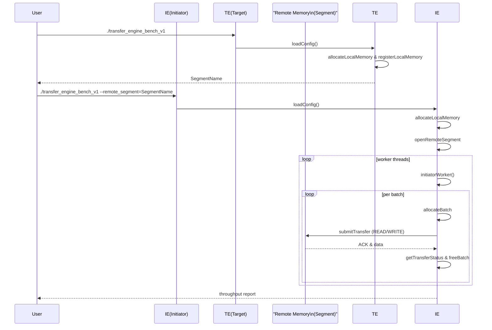

# 🚀 Transfer Engine Benchmark (v1)  
**File:** `mooncake-transfer-engine/example/transfer_engine_bench_v1.cpp`

---

## 📋 Index

1. [Overview](#-overview)  
2. [Prerequisites & Build](#-prerequisites--build)  
3. [Command-Line Flags](#-command-line-flags)  
4. [High-Level Architecture](#-high-level-architecture)  
   - [Modes: Target vs Initiator](#modes-target-vs-initiator)  
   - [Sequence Diagram](#sequence-diagram)  
5. [Core Components & Data Flow](#-core-components--data-flow)  
   - [Configuration Loader](#configuration-loader)  
   - [Memory Management](#memory-management)  
   - [Request Lifecycle](#request-lifecycle)  
   - [Worker Logic](#worker-logic)  
6. [Code Walkthrough](#-code-walkthrough)  
   - [Utilities & Constants](#utilities--constants)  
   - [`submitRequestSync`](#submitrequestsync)  
   - [`initiatorWorker`](#initiatorworker)  
   - [`allocateAllLocalMemory` / `deallocateAllLocalMemory`](#allocatealllocalmemory--deallocatealllocalmemory)  
   - [`initiator` / `target` / `main`](#initiator--target--main)  
7. [Example Usage](#-example-usage)  
8. [License](#-license)  

---

## 🔍 Overview

This C++ example demonstrates **benchmarking** of the `mooncake::v1::TransferEngine`. It provides two modes:

- **Target**: Exposes a local memory segment (server/receiver).  
- **Initiator**: Opens the remote segment and issues **read/write/mix** requests in batches across multiple threads.

Key goals:  
- Measure throughput (GB/s, MB/s, etc.)  
- Optionally perform data integrity checks  
- Support CPU DRAM & GPU VRAM (if compiled with `USE_CUDA`)  
- Flexible metadata backends: **p2p**, **etcd**, **redis**, **http**

---

## 🛠️ Prerequisites & Build

- **C++17** or above  
- **gflags**, **glog**  
- Underlying **mooncake-transfer-engine** v1 libraries  
- *(Optional)* CUDA toolkit (for GPU memory benchmarks)

Typical build command snippet:
```bash
mkdir build && cd build
cmake .. 
make transfer_engine_bench_v1
```

---

## ⚙️ Command-Line Flags

| Flag                 | Type    | Default    | Description                                               |
|:---------------------|:--------|:-----------|:----------------------------------------------------------|
| `--metadata_type`    | string  | `"p2p"`    | Metadata backend: `p2p` \| `etcd` \| `redis` \| `http`     |
| `--metadata_servers` | string  | `""`       | Comma-separated list (required unless `p2p`)              |
| `--workload`         | string  | `"read"`   | Test pattern: `read` \| `write` \| `mix`                  |
| `--local_segment`    | string  | `""`       | Custom local segment name (optional)                      |
| `--remote_segment`   | string  | `""`       | Remote segment name (required for *initiator* mode)       |
| `--integrity_check`  | bool    | `false`    | **(mix only)** Validate data correctness                  |
| `--shmfs`            | bool    | `false`    | Use POSIX shared memory (`SHM`)                           |
| `--batch`            | int32   | `16`       | Requests per batch                                        |
| `--size`             | uint64  | `65536`    | Payload size (bytes) per request                          |
| `--duration`         | int32   | `10`       | Benchmark runtime (seconds)                               |
| `--threads`          | int32   | `4`        | Number of concurrent worker threads                       |
| `--report_unit`      | string  | `"GB"`     | Throughput unit: `GB`/`GiB`/`Gb`/`MB`/`MiB`/…/`Kb`          |
| `--report_precision` | uint32  | `2`        | Decimal precision in report                               |
| *(CUDA only)*        |         |            |                                                            |
| `--use_dram`         | bool    | `true`     | Allocate from CPU DRAM                                    |
| `--use_vram`         | bool    | `true`     | Allocate from GPU VRAM                                    |

---

## 🏗️ High-Level Architecture

### Modes: Target vs Initiator

1. **Target Mode**  
   - No `--remote_segment` supplied  
   - Registers a local memory segment  
   - Waits for incoming read/write requests  
   - Terminates gracefully on `SIGINT` / `SIGTERM`

2. **Initiator Mode**  
   - `--remote_segment` provided  
   - Opens the remote segment on target  
   - Spawns **N** worker threads  
   - Issues batched `READ` / `WRITE` / `MIX` operations for `<duration>`  
   - Collects throughput stats at the end  

### Sequence Diagram



---

## 🔗 Core Components & Data Flow

### Configuration Loader

- **`loadConfig()`**  
  Builds a JSON context string with:
  - `local_segment_name`
  - `metadata_type`
  - `metadata_servers`  
  Then calls `config->loadConfigContent(...)`.

### Memory Management

- **`allocateAllLocalMemory(...)`**  
  - Iterates over **num_buffers**  
  - Chooses **SHM** or default  
  - Chooses **CPU** or **GPU** based on `--use_dram` / `--use_vram`  
  - Calls `engine->allocateLocalMemory` + `engine->registerLocalMemory`

- **`deallocateAllLocalMemory(...)`**  
  - Unregisters & frees each block

### Request Lifecycle

1. **`submitRequestSync(...)`**  
   - `allocateBatch(batch_size)`  
   - Build `std::vector<Request>`  
   - `submitTransfer(batch_id, requests)`  
   - Poll `getTransferStatus` until **COMPLETED** or **FAILED**  
   - `freeBatch(batch_id)`

2. **`calculateRate(data_bytes, duration)`**  
   - Converts bytes/sec into chosen unit (GB/s, MB/s, etc.)  
   - Respects `--report_precision`

### Worker Logic

- **`initiatorWorker(...)`**  
  - Binds thread to a NUMA socket  
  - Fetches `remote_base` via `getStartAddress(...)`  
  - Chooses `READ`/`WRITE`/`MIX`  
  - Loops until global flag `running == false`  
    - For **mix**: optionally do `fillData → WRITE → fillData(0) → READ → checkData`  
    - Otherwise `submitRequestSync(...)` in a single opcode  
  - Accumulates **batch_count** atomically  

---

## 📖 Code Walkthrough

### Utilities & Constants

```cpp
#define CHECK_FAIL(call) do { \
  auto status_ = call; \
  if (!status_.ok()) { \
    LOG(INFO) << "Error: " << status_.ToString(); \
    exit(EXIT_FAILURE); \
  } \
} while (0)

static const std::unordered_map<std::string,uint64_t> RATE_UNIT_MP = {
  {"GB", 1000ull*1000ull*1000ull}, {"GiB",1ull<<30}, /*…*/ 
};
```
- **`CHECK_FAIL`** simplifies error checking  
- **`RATE_UNIT_MP`** maps units to byte multipliers  

---

### submitRequestSync

```cpp
Status submitRequestSync(
  TransferEngine *engine,
  SegmentID handle,
  int thread_id,
  void *addr,
  uint64_t remote_base,
  Request::OpCode opcode
) { ... }
```
1. **Batch Allocation**  
2. **Populate Requests**  
3. **Submit & Poll**  
4. **Free Batch**  

---

### initiatorWorker

```cpp
Status initiatorWorker(
  TransferEngine *engine,
  SegmentID handle,
  int thread_id,
  void *addr
) { ... }
```
- NUMA-pin the thread  
- Compute base address in remote segment  
- Select workload  
- Loop until global `running` → call `submitRequestSync`  
- For `mix+integrity_check`: use `fillData` & `checkData`  

---

### Memory Management

```cpp
void allocateAllLocalMemory(...);
void deallocateAllLocalMemory(...);
```
- Abstracts CPU/GPU memory allocation & registration  
- Honors `--shmfs`, `--use_dram`, `--use_vram`  

---

### initiator / target / main

- **`target()`**  
  - Signal handlers (`SIGINT`, `SIGTERM`)  
  - Load config, allocate & register memory  
  - Print segment name for initiator  
  - Loop until signaled → deallocate & exit  

- **`initiator()`**  
  - Load config, allocate local memory  
  - `openRemoteSegment(handle, remote_name)`  
  - Spawn `--threads` worker threads  
  - Sleep for `--duration` seconds  
  - Stop, join threads, compute throughput  

- **`main()`**  
  - Parse flags  
  - Calculate `buffer_capacity` ≥ `size × batch × threads`  
  - Discover NUMA nodes & CUDA devices  
  - Determine `num_buffers`  
  - If `--remote_segment.empty()`: run **target**  
    else: run **initiator**

---

## 💡 Example Usage

```bash
# 1️⃣ Start the Target (server) in one terminal:
./transfer_engine_bench_v1 \
  --metadata_type=redis \
  --metadata_servers=127.0.0.1:6379 \
  --local_segment=mySegment

# …it prints:
#   Target server has been started.
#   ./transfer_engine_bench_v1 --remote_segment=mySegment

# 2️⃣ Start the Initiator (client) in another:
./transfer_engine_bench_v1 \
  --metadata_type=redis \
  --metadata_servers=127.0.0.1:6379 \
  --remote_segment=mySegment \
  --workload=mix \
  --integrity_check \
  --threads=8 \
  --duration=20
```

---

## 📜 License

```
Copyright 2024 KVCache.AI

Licensed under the Apache License, Version 2.0 (the "License");
you may not use this file except in compliance with the License.
You may obtain a copy at http://www.apache.org/licenses/LICENSE-2.0
```

---

*Happy benchmarking! 🚀*