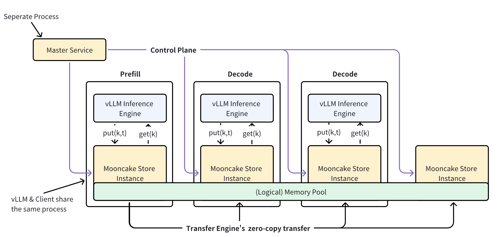
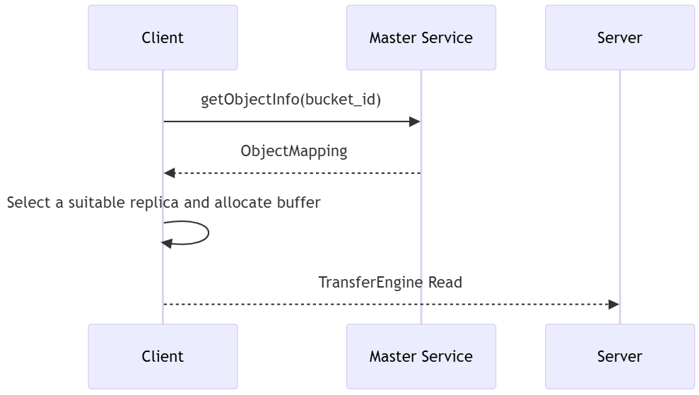
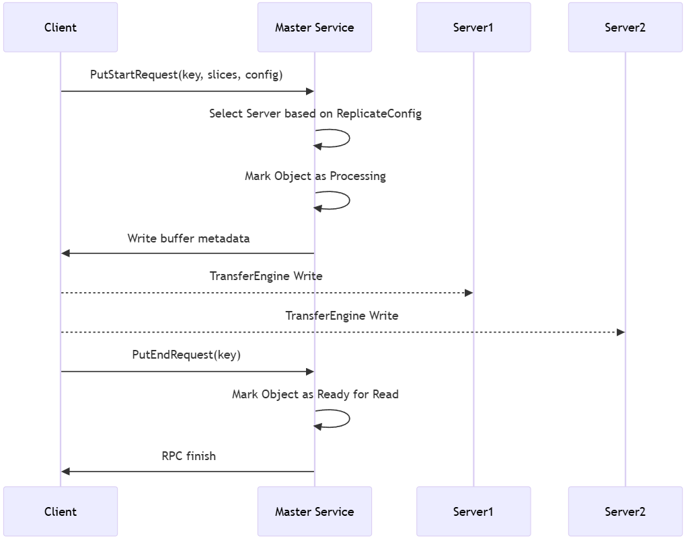

# Mooncake Store Preview

## 概述

Mooncake Store 是一款专为LLM推理场景设计的高性能**分布式键值 KV Cache 存储引擎**。

与 Redis 或 Memcached 等传统缓存系统不同，Mooncake Store 的核心定位是**KV Cache 的存储引擎而非完整的缓存系统**。它们之间的最大区别是，对于前者，key 是由 value 通过哈希计算得到的，因此不再需要 `update()` 操作，也没有版本管理方面的需求。

Mooncake Store 提供了底层对象存储和管理功能，而具体的缓存策略（如淘汰策略）则交由上层框架（比如vLLM）或用户实现，从而提供更高的灵活性和可定制性。

Mooncake Store 的主要特性包括：

*   **对象级存储操作**：提供简单易用的对象级 API，包括 Put、Get 和 Remove 等操作，方便用户进行数据管理。
*   **多副本支持**：支持为同一对象保存多个数据副本，有效缓解热点访问压力。
*   **最终一致性**：保证 Get 操作读取到完整且正确的数据，但不保证读取到最新写入的数据。这种最终一致性模型在确保高性能的同时，简化了系统设计。
*   **高带宽利用**：支持对大型对象进行条带化和并行 I/O 传输，充分利用多网卡聚合带宽，实现高速数据读写。
*   **动态资源伸缩**：支持动态添加和删除节点，灵活应对系统负载变化，实现资源的弹性管理，将在未来版本中完善实现。

## 架构

Mooncake Store 由一个全局的`Master Service` 进行分配存储空间池职责。
具体的分配细节由 `BufferAllocator` 类实现，结合 `AllocationStrategy` 策略类协调分配行为。



如上图所示，在 Mooncake Store Preview 中，有两个关键组件：
1. Master Service，用于管理整个集群的逻辑存储空间池（Logical Memory Pool），并维护节点的进入与退出。这是一个独立运行的进程，会对外提供 RPC 服务。需要注意的是，Transfer Engine所需的元数据服务（通过etcd、redis或HTTP等）不包含在Master Service内，需要另行部署。
2. Client 与 vLLM 实例共享一个进程（至少目前版本是这样）。每个 Client 分配了一定大小的 DRAM 空间，作为逻辑存储空间池（Logical Memory Pool）的一个部分。因此，数据传输实际上是从一个 Client 到另一个 Client，不经过 Master。

## Client C++ API

### 构造及初始化函数Init

```C++
ErrorCode Init(const std::string& local_hostname,
               const std::string& metadata_connstring,
               const std::string& protocol,
               void** protocol_args,
               const std::string& master_addr);
```

初始化 Mooncake Store 客户端。其中各参数含义如下：
- `local_hostname` 表示本机的 IP:Port 或者可访问的域名（若不含端口号则使用默认值）
- `metadata_connstring` 表示 Transfer Engine 初始化所需的 etcd/redis 等元数据服务的地址
- `protocol` 为 Transfer Engine 所支持的协议，包括rdma、tcp
- `protocol_args` 是Transfer Engine 需要的协议参数
- `master_addr` 是Master的地址信息IP:Port


### Get 接口

```C++
ErrorCode Get(const std::string& object_key, 
              std::vector<Slice>& slices);
```




用于获取 `object_key` 对应的值。该接口保证读取到的数据是完整且正确的。读取到的值将通过 TransferEngine 存储到 `slices` 所指向的内存区域中，可以是用户提前通过 `registerLocalMemory(addr, len)` 注册的本地 DRAM/VRAM 内存空间，注意非 Mooncake Store 内部管理的逻辑存储空间池（Logical Memory Pool）。

> 在目前的实现中，Get 接口可选 TTL 功能。当首次获取 `object_key` 对应的值后一段时间（默认为 1s），相应的条目会被自动删除。

### Put 接口

```C++
ErrorCode Put(const ObjectKey& key,
              std::vector<Slice>& slices,
              const ReplicateConfig& config);
```



用于存储 `key` 对应的值。可通过 `config` 参数设置所需的副本数量。
其中`ReplicateConfig` 的数据结构细节如下：

```C++
enum class MediaType {
    VRAM,
    RAM,
    SSD
};

struct Location {
    std::string segment_name;   // Transfer Engine 内的 Segment Name，通常是目标 Server 启动时填写的 local_hostname 字段内容
};

struct ReplicateConfig {
    uint64_t replica_num;       // 指定对象的总副本数量
    std::map<MediaType, int> media_replica_num; // 指定某个介质上分配的副本数量，累加超过 replica_num 时取高值
    std::vector<Location> locations;// 指定某个副本的具体存放位置 (机器和介质)
};
```

### Remove 接口

```C++
ErrorCode Remove(const ObjectKey& key);
```

用于删除指定 key 对应的对象。该接口标记存储引擎中与 key 关联的所有数据副本已被删除，不需要与对应存储节点(Client)通信。

### Master Service

将集群中所有可用的资源看做一个巨大的资源池，由一个中心化的 Master 进程进行空间分配，并指导实现数据复制（**注意 Master Service 不接管任何的数据流，只是提供对应的元数据信息**）。

#### Master Service 接口

Master与Client的通信协议如下：

```protobuf
message BufHandle {
  required uint64 segment_name = 1;  // 存储段名称（可简单理解为存储节点的名称）
  required uint64 size = 2;          // 分配空间的大小
  required uint64 buffer = 3;        // 指向分配空间的指针

  enum BufStatus {
    INIT = 0;          // 初始状态，空间已被预留但尚未使用
    COMPLETE = 1;      // 使用完成，空间存储了有效数据
    FAILED = 2;        // 使用失败，上游应将 handle 状态更新为此值
    UNREGISTERED = 3;  // 空间已被注销，元数据已删除
  }
  required BufStatus status = 4 [default = INIT]; // 空间状态
};

message ReplicaInfo {
  repeated BufHandle handles = 1; // 存储对象数据的具体位置

  enum ReplicaStatus {
    UNDEFINED = 0;   // 未初始化
    INITIALIZED = 1; // 空间已分配，等待写入
    PROCESSING = 2;  // 正在写入数据
    COMPLETE = 3;    // 写入完成，副本可用
    REMOVED = 4;     // 副本已被移除
    FAILED = 5;      // 副本写入失败，可考虑重新分配
  }
  required ReplicaStatus status = 2 [default = UNDEFINED]; // 副本状态
};

service MasterService {
  // 获取对象的副本列表
  rpc GetReplicaList(GetReplicaListRequest) returns (GetReplicaListResponse);

  // 开始 Put 操作，分配存储空间
  rpc PutStart(PutStartRequest) returns (PutStartResponse);

  // 结束 Put 操作，标记对象写入完成
  rpc PutEnd(PutEndRequest) returns (PutEndResponse);

  // 删除对象的所有副本
  rpc Remove(RemoveRequest) returns (RemoveResponse);

  // 存储节点(Client)注册存储段
  rpc MountSegment(MountSegmentRequest) returns (MountSegmentResponse);

  // 存储节点(Client)注销存储段
  rpc UnmountSegment(UnmountSegmentRequest) returns (UnmountSegmentResponse);
}
```

1. GetReplicaList

```protobuf
message GetReplicaListRequest {
  required string key = 1; 
};

message GetReplicaListResponse {
  required int32 status_code = 1;
  repeated ReplicaInfo replica_list = 2; // 副本信息列表
};
```

* 请求: GetReplicaListRequest，包含需要查询的 key。
* 响应: GetReplicaListResponse，包含状态码 status_code 和 副本信息列表 replica_list。

说明: 用于获取指定 key 的所有可用副本的信息。Client 可以根据这些信息选择合适的副本进行读取。

2. PutStart

```protobuf
message PutStartRequest {
  required string key = 1;             // 对象键值
  required int64 value_length = 2;     // 待写入的数据总长度
  required ReplicateConfig config = 3; // 副本配置信息
  repeated uint64 slice_lengths = 4;   // 记录每个数据分片的长度
};

message PutStartResponse {
  required int32 status_code = 1; 
  repeated ReplicaInfo replica_list = 2;  // Master Service 分配好的副本信息
};
```

* 请求: PutStartRequest，包含 key、数据长度和副本配置config。
* 响应: PutStartResponse，包含状态码 status_code 和分配好的副本信息 replica_list。

说明: Client 在写入对象前，需要先调用 PutStart 向 `Master Service` 申请存储空间。`Master Service` 会根据 config 分配空间，并将分配结果（replica_list）返回给 Client。Client 随后将数据写入到分配副本所在的存储节点。 之所以需要 start 和 end 两步，是为确保其他Client不会读到正在写的值，进而造成脏读。

3. PutEnd

```protobuf
message PutEndRequest {
  required string key = 1; 
};

message PutEndResponse {
  required int32 status_code = 1;
};
```

* 请求: PutEndRequest，包含 key。
* 响应: PutEndResponse，包含状态码 status_code

Client 完成数据写入后，调用 PutEnd 通知 `Master Service`。`Master Service` 将更新对象的元数据信息，将副本状态标记为 COMPLETE，表示该对象可以被读取。

4. Remove

```protobuf
message RemoveRequest {
  required string key = 1; 
};

message RemoveResponse {
  required int32 status_code = 1;
};
```

* 请求: RemoveRequest，包含需要删除对象的key
* 响应: RemoveResponse，包含状态码 status_code 

用于删除指定 key 对应的对象及其所有副本。Master Service 将对应对象的所有副本状态标记为删除。

5. MountSegment

```protobuf
message MountSegmentRequest {
  required uint64 buffer = 1;       // 空间的起始地址
  required uint64 size = 2;         // 空间的大小
  required string segment_name = 3; // 存储段名称
}

message MountSegmentResponse {
  required int32 status_code = 1;
};
```

存储节点(Client)自己分配一段内存，然后在调用`TransferEngine::registerLoalMemory` 完成本地挂载后，调用该接口，将分配好的一段连续的地址空间挂载到`Master Service`用于分配。

6. UnmountSegment

```protobuf
message UnmountSegmentRequest {
  required string segment_name = 1;  // 挂载时的存储段名称
}

message UnMountSegmentResponse {
  required int32 status_code = 1;
};
```

空间需要释放时，通过该接口在`Master Service` 中把之前挂载的资源移除。

#### 对象信息维护
`Master Service` 需要维护与 `BufferAllocator` 相关的映射关系和对象元数据等信息，在多副本场景下实现对内存资源的高效管理和副本状态的精确控制。此外，`Master Service` 使用读写锁保护关键数据结构，从而在多线程环境下保证数据的一致性与安全性。
以下为`Master Service` 维护存储空间信息的接口：

- MountSegment

```C++
ErrorCode MountSegment(uint64_t buffer,
                       uint64_t size,
                       const std::string& segment_name);
```

存储节点(Client)向`Master Service`注册存储段空间。

- UnmountSegment

```C++
ErrorCode UnmountSegment(const std::string& segment_name);
```

存储节点(Client)向`Master Service`注销存储段空间。

`Master Service` 处理对象相关的接口如下：

- Put

```C++
    ErrorCode PutStart(const std::string& key,
                       uint64_t value_length,
                       const std::vector<uint64_t>& slice_lengths,
                       const ReplicateConfig& config,
                       std::vector<ReplicaInfo>& replica_list);

    ErrorCode PutEnd(const std::string& key);
```

`Client` 在写入对象前，先调用 PutStart 向 `Master Service`申请分配存储空间。
`Client` 在完成数据写入后，调用 PutEnd 通知 `Master Service`标记对象写入完成。

- GetReplicaList

```C++
ErrorCode GetReplicaList(const std::string& key,
                         std::vector<ReplicaInfo>& replica_list);
```

`Client`向`Master Service`请求获取指定key的副本列表，`Client`可以根据这些信息选择合适的副本进行读取。

- Remove

```C++
ErrorCode Remove(const std::string& key);
```

`Client`向`Master Service`请求删除指定key的所有副本。

### Buffer Allocator

BufferAllocator是Mooncake Store 体系中处于底层的空间管理类，主要的职责是高效分配和释放内存，借助 Facebook 的 CacheLib MemoryAllocator 来管理底层内存。
在`Master Service`接收 `MountSegment`请求注册底层空间时，会通过 `AddSegment` 创建一个 BufferAllocator 对象。
在 BufferAllocator类中，主要接口如下：

```C++
class BufferAllocator {
    BufferAllocator(SegmentName segment_name,
                    size_t base,
                    size_t size);
    ~BufferAllocator();

    std::shared_ptr<BufHandle> allocate(size_t size);
    void deallocate(BufHandle* handle);
 };
```

1. 构造函数，上游创建BufferAllocator 实例时，需要传入实例空间的地址和大小，根据这些信息，内部会调用底层的cachelib接口进行统一管理；
2. `allocate`函数： 上游发生读写请求时，需要指定一片区域供上游使用, allocate会调用内部的cachelib的allocator分配内存，然后提供这片空间的地址、大小等信息；
3. `deallocate`函数： 由BufHandle的析构函数自动调用，内部会调用cachelib的allocator释放内存，然后设置handle状态为`BufStatus::UNREGISTERED`。

### AllocationStrategy

AllocationStrategy 是一个分配策略类，用于高效地在分布式环境中管理内存资源的分配和副本的存储位置选择。主要用于以下场景：
1. 确定对象存储副本的分配位置。
2. 在多个副本间选择适合的读/写路径。
3. 为分布式存储中各节点之间的资源负载均衡提供决策支持。

AllocationStrategy 与`Master Service`和底层模块 `BufferAllocator` 配合使用：
* `Master Service`：通过 `AllocationStrategy` 决定副本分配的目标位置。
* `BufferAllocator`：实际执行分配和释放内存的任务。

#### 接口

1. Allocate：从可用的存储资源中，寻找适合的存储段来分配指定大小的空间。

```C++
virtual std::shared_ptr<BufHandle> Allocate(
        const std::unordered_map<std::string, std::shared_ptr<BufferAllocator>>& allocators,
        size_t objectSize) = 0;
```

输入：当前可用的存储段列表，以及所需分配的空间大小。
输出：返回分配成功的存储空间句柄`BufHandle`。

#### 具体实现策略

`RandomAllocationStrategy` 是 `AllocationStrategy` 的一个实现子类，使用随机化的方式从可用存储段中选择一个目标, 支持设定随机种子来保证分配的确定性。
除了随机分配，还可以根据实际需求定义策略。例如：
* 基于负载的分配策略：根据存储段的当前负载信息优先选择低负载段。
* 拓扑感知策略：优先选择物理上更接近的数据段以减少网络开销。

## Mooncake Store Python API

### setup
```python
def setup(
    self,
    local_hostname: str,
    metadata_server: str,
    global_segment_size: int = 16777216,  # 默认 16MB
    local_buffer_size: int = 16777216,    # 默认 16MB
    protocol: str = "tcp",
    rdma_devices: str = "",
    master_server_addr: str = "127.0.0.1:50051"
) -> int
```
初始化存储配置和网络参数。

**参数**  
- `local_hostname`: 本地节点的主机名/IP
- `metadata_server`: 元数据协调服务器地址
- `global_segment_size`: 共享内存段大小（默认 16MB）
- `local_buffer_size`: 本地缓冲区分配大小（默认 16MB）
- `protocol`: 通信协议 ("tcp" 或 "rdma")
- `rdma_devices`: RDMA 设备规格（格式取决于具体实现）
- `master_server_addr`: 主服务器地址 (host:port 格式)

**返回值**  
- `int`: 状态码 (0 = 成功，非零 = 错误)

---

### initAll
```python
def initAll(
    self,
    protocol: str,
    device_name: str,
    mount_segment_size: int = 16777216  # 默认 16MB
) -> int
```
初始化分布式资源并建立连接。

**参数**  
- `protocol`: 使用的网络协议 ("tcp"/"rdma")
- `device_name`: 硬件设备标识符
- `mount_segment_size`: 挂载内存段大小（默认 16MB）

**返回值**  
- `int`: 状态码 (0 = 成功，非零 = 错误)

---

### put
```python
def put(self, key: str, value: bytes) -> int
```
存储二进制对象到分布式存储。

**参数**  
- `key`: 唯一对象标识符 (字符串)
- `value`: 要存储的二进制数据 (bytes 类型对象)

**返回值**  
- `int`: 状态码 (0 = 成功，非零 = 错误)

---

### get
```python
def get(self, key: str) -> bytes
```
从分布式存储检索对象。

**参数**  
- `key`: 要检索的对象标识符

**返回值**  
- `bytes`: 检索到的二进制数据

**异常**  
- `KeyError`: 当指定键不存在时抛出

---

### remove
```python
def remove(self, key: str) -> int
```
从存储系统中删除对象。

**参数**  
- `key`: 要删除的对象标识符

**返回值**  
- `int`: 状态码 (0 = 成功，非零 = 错误)

---

### isExist
```python
def isExist(self, key: str) -> int
```
检查对象是否存在。

**参数**  
- `key`: 要检查的对象标识符

**返回值**  
- `int`: 
  - `1`: 对象存在
  - `0`: 对象不存在
  - `-1`: 发生错误

---

### close
```python
def close(self) -> int
```
清理所有资源并终止连接。对应 `tearDownAll()` 方法。

**返回值**  
- `int`: 状态码 (0 = 成功，非零 = 错误)

### 代码使用样例
```python

import mooncake_vllm_adaptor as mva
store = mva.MooncakeDistributedStore()
store.setup(
    local_hostname="IP:port",
    metadata_server="etcd://metadata server IP:port",
    protocol="rdma",
    ...
)
store.initAll(protocol="rdma", device_name="mlx5_0")

# Store configuration
store.put("kvcache1",  pickle.dumps(torch.Tensor(data)))

# Retrieve data
value = store.get("kvcache1")

store.close()
```

## 编译及使用方法
Mooncake Store 与其它相关组件（Transfer Engine等）一同编译。
```
mkdir build
cd build
cmake ..
make
sudo make install # 安装 Python 接口支持包
```

### 启动 Transfer Engine 的 Metadata 服务
Mooncake Store 使用 Transfer Engine 作为核心传输引擎，因此需要启动元数据服务（etcd/redis/http），`metadata` 服务的启动与配置可以参考[Transfer Engine](./transfer-engine.md)的有关章节。特别注意：对于 etcd 服务，默认仅为本地进程提供服务，需要修改监听选项（IP 为 0.0.0.0，而不是默认的 127.0.0.1）。可使用 curl 等指令验证正确性。

### 启动 Master Service

Master Service 独立作为一个进程，对外提供 gRPC 接口，负责Mooncake Store 的元数据管理（注意Master Service 并不复用Transfer Engine 的Metadata服务），默认监听端口为 `50051`。在编译完成后，可直接运行位于 `build/mooncake-store/src/` 目录下的 `mooncake_master`。启动后，Master Service 会在日志中输出下列内容：
```
Starting Mooncake Master Service
Port: 50051
Max threads: 4
Master service listening on 0.0.0.0:50051
```

### 启动验证程序
Mooncake Store 提供了多种验证程序，包括基于 C++ 和 Python 等接口形态。下面以 `stress_cluster_benchmark` 为例介绍一下如何运行。

1. 打开 `stress_cluster_benchmark.py`，结合网络情况修改初始化代码，重点是 local_hostname（对应本机 IP 地址）、metadata_server（对应 Transfer Engine 元数据服务）、master_server_address（对应 Master Service 地址及端口）等：
```python
import os
import time

from distributed_object_store import DistributedObjectStore

store = DistributedObjectStore()
# Transfer engine 使用的协议，可选值为 "rdma" 或 "tcp"
protocol = os.getenv("PROTOCOL", "tcp")
# Transfer engine 使用的设备名称
device_name = os.getenv("DEVICE_NAME", "ibp6s0")
# 本节点在集群中的 hostname,端口号从（12300-14300）中随机选择
local_hostname = os.getenv("LOCAL_HOSTNAME", "localhost")
# Transfer Engine 的 Metadata 服务地址，这里使用 etcd 作为元数据服务
metadata_server = os.getenv("METADATA_ADDR", "127.0.0.1:2379")
# 每个节点向集群中挂载的 Segment 大小，挂载之后由Master Service 进行分配，单位为字节
global_segment_size = 3200 * 1024 * 1024
# 注册Transfer Engine 的本地缓冲区大小，单位为字节
local_buffer_size = 512 * 1024 * 1024
# Mooncake Store 的 Master Service 地址
master_server_address = os.getenv("MASTER_SERVER", "127.0.0.1:50051")
# 每次 put() 的数据长度
value_length = 1 * 1024 * 1024
# 总共发送请求数量
max_requests = 1000
# 初始化 Mooncake Store Client
retcode = store.setup(
    local_hostname,
    metadata_server,
    global_segment_size,
    local_buffer_size,
    protocol,
    device_name,
    master_server_address,
)
```

2. 在一台机器上运行 `ROLE=prefill python3 ./stress_cluster_benchmark.py`，启动 Prefill 节点。
3. 在另一台机器上运行 `ROLE=decode python3 ./stress_cluster_benchmark.py`，启动 Decode 节点。
无报错信息表示数据传输成功。

## 范例代码

#### Python 使用示例
我们提供一个参考样例 `distributed_object_store_provider.py`，其位于 `mooncake-store/tests` 目录下。为了检测相关组件是否正常安装，可在相同的服务器上后台运行 etcd、Master Service（`mooncake_master`）等两个服务，然后在前台执行该 Python 程序，此时应输出测试成功的结果。

#### C++ 使用示例

Mooncake Store 的 C++ API 提供了更底层的控制能力。我们提供一个参考样例 `client_integration_test`，其位于 `mooncake-store/tests` 目录下。为了检测相关组件是否正常安装，可在相同的服务器上运行 etcd、Master Service（`mooncake_master`），并执行该 C++ 程序（位于 `build/mooncake-store/tests` 目录下），应输出测试成功的结果。
