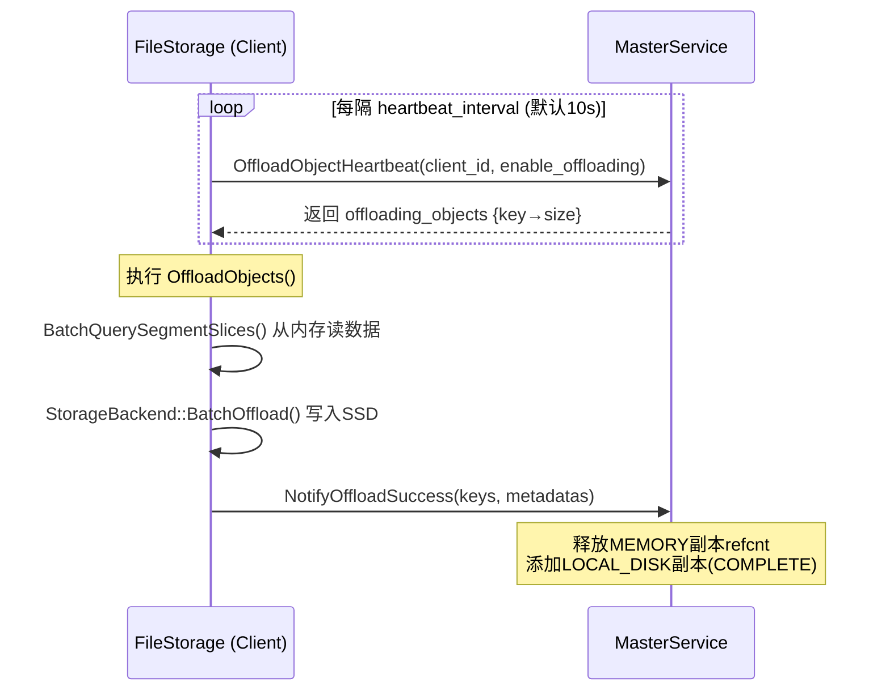
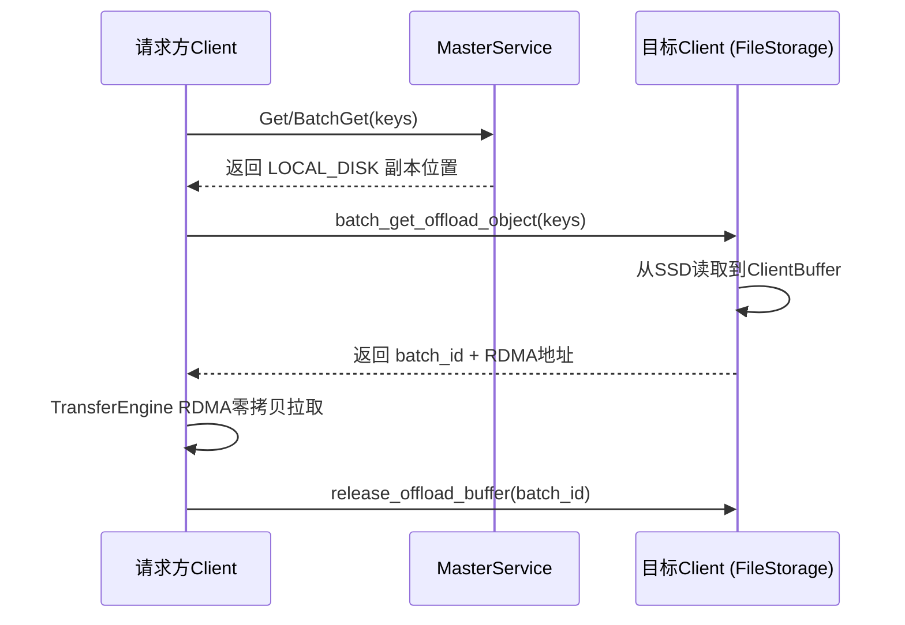
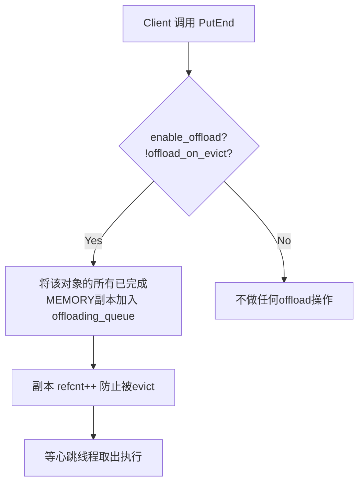
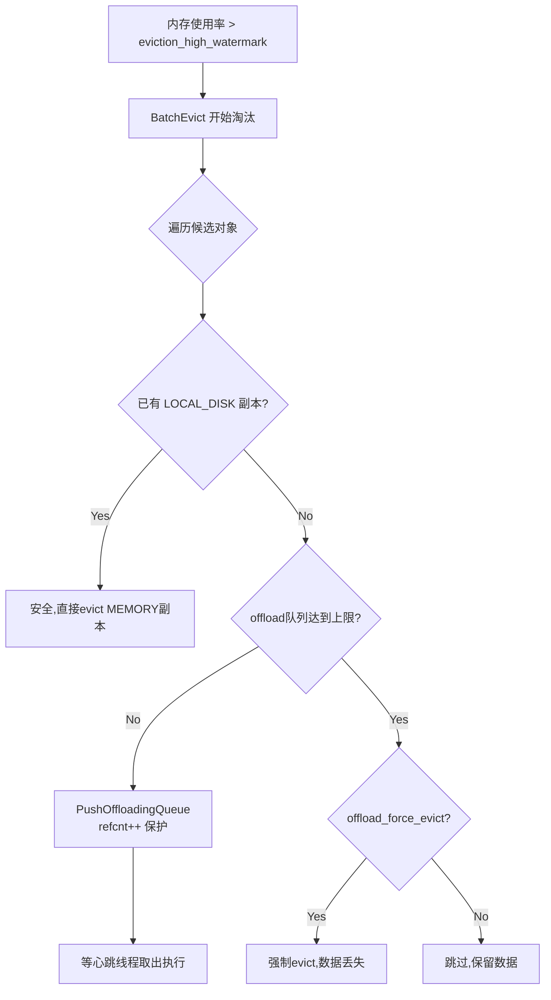
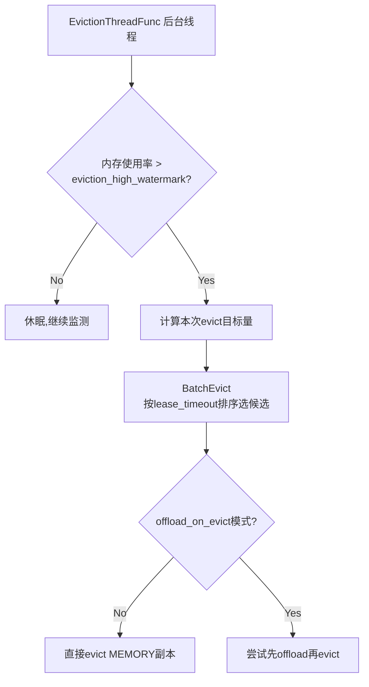
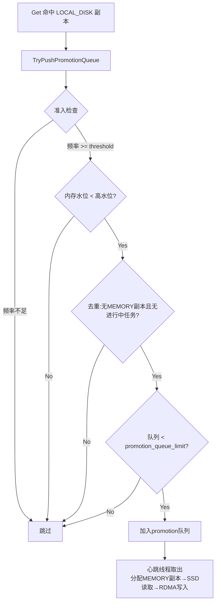

# Mooncake SSD Offload 机制

## 1. 核心概念

Offload 是 Mooncake 将数据从 **DRAM（MEMORY副本）** 迁移到 **本地 SSD（LOCAL_DISK副本）** 的过程。与 Eviction（直接丢弃）不同，Offload 将数据持久化到磁盘，后续可通过 Load 路径读回。

```
MEMORY副本 ──Offload──→ LOCAL_DISK副本 ──Promotion──→ MEMORY副本
    │                       │
    └──Eviction（丢弃）      └──Disk Eviction（丢弃）
```

## 2. 核心数据流

### 2.1 Offload（内存 → SSD）



### 2.2 Load（SSD → 请求方）



## 3. 触发时机与 Key 选取

系统有两种 offload 触发模式，由 `offload_on_evict` 开关控制：

### 模式 A：PutEnd 即入队（默认，`offload_on_evict=false`）



- **选取标准**：所有 PutEnd 完成的对象**无差别入队**
- **无筛选逻辑**：不区分冷热，全部 offload

### 模式 B：Eviction 时入队（`offload_on_evict=true`）



- **选取标准**：由 `BatchEvict` 决定候选对象，基于 **lease_timeout 时间排序**（近似 LRU）
- **两轮扫描**：第一轮淘汰无 soft pin 的对象，第二轮淘汰有 soft pin 的对象（需 `allow_evict_soft_pinned_objects=true`）
- **保护机制**：入队时 `refcnt++` 防止 offload 期间被 evict

### Master 端 Eviction 流程



## 4. Offload 与 Eviction 的关系

| 维度 | Offload | Eviction |
|------|---------|----------|
| 目的 | 将数据持久化到 SSD | 释放内存空间 |
| 数据去向 | 本地 SSD 文件 | 丢弃 |
| 数据可恢复 | 是（通过 Load/Promotion） | 否 |
| 触发者 | 心跳线程（定时） | Eviction 后台线程（水位触发） |
| 副本变化 | MEMORY → LOCAL_DISK | MEMORY → 删除 |

**协同关系**：
- Offload 是 Eviction 的**前置安全网**——先持久化再释放，避免数据丢失
- `offload_on_evict=true` 时二者紧密耦合：eviction 候选先尝试 offload，成功后才释放内存
- `offload_on_evict=false` 时二者独立：PutEnd 时入 offload 队列，eviction 按自己逻辑运行

## 5. 四种配置组合

| 组合 | enable_offload | offload_on_evict | offload_force_evict | 行为 |
|------|:-:|:-:|:-:|------|
| A（默认） | true | false | false | PutEnd 立即入 offload 队列，eviction 独立运行 |
| B | true | true | false | eviction 时才尝试 offload，失败则跳过（保留数据） |
| C | true | true | true | eviction 时先 offload，队列满则强制 evict（数据丢失） |
| D | true | false | true | 等同 A（force_evict 无效） |

## 6. Promotion（SSD → 内存热提升）

当 `promotion_on_hit=true` 时，频繁访问的 LOCAL_DISK 数据自动提升回内存：



- **频率统计**：Count-Min Sketch，阈值 `promotion_admission_threshold`（默认 2）
- **每次心跳限 1 个** promotion 任务（`kMaxPerHeartbeat=1`）

## 7. 关键代码索引

### 7.1 Master 端（`mooncake-store/src/master_service.cpp`）

| 函数 | 行号 | 职责 |
|------|------|------|
| `EvictionThreadFunc()` | :3160 | 后台线程，监测内存水位，触发 `BatchEvict` |
| `BatchEvict()` | :4466 | 核心淘汰逻辑，按 lease_timeout 选候选对象，内部定义 `try_evict_or_offload` lambda(:4515) 处理 offload/evict 分支 |
| `OffloadObjectHeartbeat()` | :2618 | 客户端心跳入口，返回 `offloading_objects` 队列给客户端 |
| `NotifyOffloadSuccess()` | :2705 | 处理客户端 offload 完成通知：释放 MEMORY 副本 refcnt，添加 LOCAL_DISK 副本 |
| `PushOffloadingQueue()` | :2744 | 将 key 入 offload 队列，根据副本的 segment 名称定位目标客户端 |
| `TryPushPromotionQueue()` | :2823 | Get 命中 LOCAL_DISK 时调用，经四重准入检查后将 key 加入 promotion 队列 |
| `PromotionObjectHeartbeat()` | :2919 | 返回待 promotion 任务（每次心跳限 1 个） |
| `PromotionAllocStart()` | :2948 | 为 promotion 分配 MEMORY 副本（PROCESSING 状态） |
| `NotifyPromotionSuccess()` | :3041 | 确认 promotion 完成：标记 MEMORY 副本 COMPLETE，释放 LOCAL_DISK refcnt |

**PutEnd 中的 offload 触发**（:1390）：

```cpp
if (enable_offload_ && !offload_on_evict_) {
    metadata.VisitReplicas(/* MEMORY + COMPLETED */, [&](Replica& replica) {
        auto result = PushOffloadingQueue(key, replica);
        if (result) {
            replica.inc_refcnt();  // 防止 offload 期间被 evict
        }
    });
}
```

**BatchEvict 中的 try_evict_or_offload**（:4515）：

```cpp
auto try_evict_or_offload = [&](const std::string& key, ObjectMetadata& metadata, ...) {
    if (!offload_on_evict_) return metadata.size * evict_replicas(metadata);  // 直接淘汰

    if (has_local_disk_replica(metadata))
        return metadata.size * evict_replicas(metadata);  // 已有SSD副本，安全淘汰

    if (offload_force_evict_ && offload_queued >= offload_cap)
        return metadata.size * evict_replicas(metadata);  // 队列满，强制淘汰

    // 尝试入 offload 队列
    auto result = PushOffloadingQueue(key, replica);
    if (result) { replica.inc_refcnt(); /* 保护 */ return ...; }

    if (offload_force_evict_) return metadata.size * evict_replicas(metadata);  // 入队失败，强制淘汰
    return 0;  // 跳过，保留数据
};
```

### 7.2 Client 端（`mooncake-store/src/file_storage.cpp`）

| 函数 | 行号 | 职责 |
|------|------|------|
| `Heartbeat()` | :495 | 心跳主循环：拉取 offload 任务 → `OffloadObjects()` → `ProcessPromotionTasks()` |
| `OffloadObjects()` | :341 | 执行 offload：从内存读数据 → 写 SSD → 通知 Master |
| `BatchGet()` | :300 | Load 路径：从 SSD 读到 ClientBuffer，返回 RDMA 可访问地址 |
| `ProcessPromotionTasks()` | :534 | 驱动 promotion：拉取任务 → 分配 MEMORY → SSD 读取 → RDMA 写入 |

### 7.3 RPC 通信层（`mooncake-store/src/master_client.cpp`）

| 函数 | 行号 | 职责 |
|------|------|------|
| `OffloadObjectHeartbeat()` | :941 | RPC 封装：客户端 → Master 拉取 offload 任务 |
| `NotifyOffloadSuccess()` | :963 | RPC 封装：客户端 → Master 确认 offload 完成 |
| `PromotionObjectHeartbeat()` | :977 | RPC 封装：客户端 → Master 拉取 promotion 任务 |
| `PromotionAllocStart()` | :985 | RPC 封装：客户端 → Master 请求分配 promotion 的 MEMORY 副本 |
| `NotifyPromotionSuccess()` | :998 | RPC 封装：客户端 → Master 确认 promotion 完成 |

## 8. 控制开关与环境变量详解

### 8.1 Master 端开关

配置文件：`mooncake-store/include/master_config.h`，可通过 `master.yaml` 或命令行参数设置。

#### `enable_offload`（默认 false）

- **false**：SSD offload 完全禁用。客户端调用 `OffloadObjectHeartbeat(enable_offloading=false)` 时，Master 清空该客户端的 offload 队列并释放所有 refcnt。对象只有 MEMORY 副本，内存不足时直接 eviction 丢弃。
- **true**：启用 offload。客户端 `FileStorage` 初始化时注册 LOCAL_DISK segment（`MountLocalDiskSegment`），心跳线程开始工作。PutEnd 或 eviction 时对象可被加入 offload 队列。

#### `offload_on_evict`（默认 false）

- **false（模式 A）**：PutEnd 完成后**立即**将该对象的所有 MEMORY 副本加入 offload 队列。意味着所有写入的数据都会尽快下沉到 SSD，内存中的副本仅作为 RDMA 访问源存在，直到 offload 完成后由 Master 释放。
- **true（模式 B/C）**：PutEnd 时不做任何 offload 操作。只有当内存使用率超过 `eviction_high_watermark_ratio` 触发 `BatchEvict` 时，才将候选淘汰对象入 offload 队列。**区别**：模式下 B 对象在内存充裕时不会被 offload，仅在被选中淘汰时才持久化到 SSD。

#### `offload_force_evict`（默认 false）

- **false**：在 `offload_on_evict=true` 模式下，如果 offload 队列已满（达到 `offloading_queue_limit_ * kOffloadCapRatio` = 25000），超出上限的候选对象**跳过淘汰**，数据保留在内存中。这会导致本轮 eviction 无法释放足够内存，Master 会打印 WARNING。
- **true**：在 `offload_on_evict=true` 模式下，offload 队列满时不再跳过，而是**强制 eviction 丢弃数据**。适用于宁可丢失数据也要保证内存可用的场景。
- **注意**：此开关仅在 `offload_on_evict=true` 时生效。单独设置（模式 D）无任何效果。

#### `promotion_on_hit`（默认 false）

- **false**：LOCAL_DISK 副本被 Get 命中后，后续访问始终走 SSD Load 路径（读磁盘 → staging buffer → RDMA 传输）。
- **true**：Get 命中 LOCAL_DISK 副本时，`TryPushPromotionQueue()` 被调用，通过 Count-Min Sketch 统计访问频率。频率达到 `promotion_admission_threshold` 的 key 被加入 promotion 队列，心跳线程将其从 SSD 提升回 MEMORY 副本。**效果**：热点数据自动回到内存，后续访问走 RDMA 零拷贝路径，避免 SSD I/O 延迟。

#### `promotion_admission_threshold`（默认 2）

- Count-Min Sketch 的频率阈值。key 被访问的次数（近似）达到此值才有资格 promotion。
- **设为 1**：任何被访问一次的 LOCAL_DISK key 立即被加入 promotion 队列。适合缓存空间充裕的场景。
- **设为更大值（如 5）**：需要多次访问才 promotion。避免一次性访问冷数据占用 promotion 资源。

#### `promotion_queue_limit`（默认 50000）

- 全局（所有 shard 共享）的待 promotion 任务上限。
- **达到上限**：`TryPushPromotionQueue` 中的容量门控拒绝新任务，热 key 暂时留在 SSD。
- 此上限同时控制 `promotion_in_flight_` 计数器，防止 promotion 占用过多内存。

#### `eviction_high_watermark_ratio`（默认 0.85）

- 内存使用率触发 eviction 的阈值。
- **设高（如 0.95）**：容忍更高的内存使用率，eviction 触发更晚，留给 offload 的时间窗口更短。
- **设低（如 0.70）**：更早触发 eviction，内存更充裕，但在 `offload_on_evict=true` 模式下会提前开始 offload。

#### `eviction_ratio`（默认 0.05）

- 每轮 `BatchEvict` 的目标回收比例（相对于总内存）。
- **设大（如 0.10）**：每轮淘汰更多对象，eviction 频率更低但每轮耗时更长。
- **设小（如 0.02）**：每轮淘汰少量对象，更平滑但 eviction 线程更频繁工作。

### 8.2 Client 端环境变量

#### `MOONCAKE_OFFLOAD_FILE_STORAGE_PATH`（默认 `/data/file_storage`）

- SSD 上的存储目录路径。BucketStorageBackend 在此目录下创建 `.bucket` 和 `.meta` 文件。
- **不设置**：使用默认路径，需确保该目录存在且有写入权限。
- **建议**：设置为 NVMe SSD 挂载点，如 `/nvme/mooncake_offload`。

#### `MOONCAKE_OFFLOAD_STORAGE_BACKEND_DESCRIPTOR`（默认 `bucket_storage_backend`）

- `bucket_storage_backend`：默认推荐。多对象合入桶文件（256MB/桶，500 key/桶），支持 FIFO/LRU 淘汰，支持重启恢复。
- `file_per_key_storage_backend`：每个对象一个文件。适合调试，大规模场景下文件数爆炸。
- `offset_allocator_storage_backend`：单文件 + 偏移分配器，1024 分片元数据。高并发性能好，但**不支持重启恢复**（启动时 truncates）。

#### `MOONCAKE_OFFLOAD_BUCKET_SIZE_LIMIT_BYTES`（默认 256MB）

- BucketStorageBackend 单个桶文件的大小上限。配置定义在 `mooncake-store/include/storage_backend.h` 的 `BucketBackendConfig::bucket_size_limit`（:181-182）。
- **分组逻辑**（`GroupOffloadingKeysByBucket()`，`storage_backend.cpp:1880`）：心跳返回的 offload 对象按此大小打包分组。对象被依次加入当前桶，直到桶数据量达到 256MB 或 500 个 key 为止。凑不满一桶的剩余对象暂存在 `ungrouped_offloading_objects_` 中，等下次心跳凑满再写入。
- **设小（如 64MB）**：桶更小更密集，淘汰粒度更细（LRU/FIFO 淘汰时整桶删除，浪费空间更少），但文件数量增多。
- **设大（如 512MB）**：减少文件数，但淘汰时整桶删除可能浪费更多有效数据。
- **注意**：单个对象大小超过此限制时会被跳过（:1911 打印 ERROR 日志）。

#### `MOONCAKE_OFFLOAD_BUCKET_KEYS_LIMIT`（默认 500）

- BucketStorageBackend 单个桶文件的 key 数量上限。配置定义在 `BucketBackendConfig::bucket_keys_limit`（:184）。
- 与 `bucket_size_limit` 共同控制分组，任一条件先达到即封桶。

#### `MOONCAKE_OFFLOAD_BUCKET_EVICTION_POLICY`（默认 `none`）

- BucketStorageBackend 的 SSD 空间淘汰策略。配置定义在 `BucketBackendConfig::eviction_policy`。
- `none`：不淘汰。SSD 写满后 offload 失败。
- `fifo`：淘汰最早创建的桶。
- `lru`：淘汰最久未被读取的桶（通过 `last_access_ns_` 原子计数器追踪）。

#### `MOONCAKE_OFFLOAD_LOCAL_BUFFER_SIZE_BYTES`（默认 1280MB）

- Load 路径的 staging buffer 大小。从 SSD 读取数据时先写入此 buffer，再通过 RDMA 传输。
- **设小**：并发 Load 能力受限，大对象可能需要排队等待 buffer 槽位。
- **设大**：支持更多并发 Load，但占用更多 Host 内存。
- 此 buffer 会被注册到 Transfer Engine 用于 RDMA 访问。

#### `MOONCAKE_OFFLOAD_TOTAL_SIZE_LIMIT_BYTES`（默认 2TB）

- SSD 磁盘使用上限。达到上限后 BucketStorageBackend 触发淘汰（如有 eviction policy）。
- **设为 0**：BucketBackend 默认使用磁盘物理容量的 90%。

#### `MOONCAKE_OFFLOAD_HEARTBEAT_INTERVAL_SECONDS`（默认 10）

- 客户端心跳线程的间隔。每次心跳执行：(1) 拉取 offload 任务 (2) 执行 OffloadObjects (3) 执行 ProcessPromotionTasks。
- **设小（如 3）**：offload/promotion 响应更快，但 Master RPC 压力增大。
- **设大（如 30）**：减少 RPC 开销，但数据在内存中停留更久，promotion 延迟更高。

#### `MOONCAKE_OFFLOAD_USE_URING`（默认 false）

- **false**：使用标准 POSIX I/O（pread/pwrite）。
- **true**：使用 Linux io_uring 异步 I/O。每个线程拥有独立的 io_uring ring（无锁），ClientBuffer 注册为 fixed buffer 避免 mmap 开销，配合 O_DIRECT 绕过页缓存。**仅 Linux 可用**。

### 8.3 内部硬编码常量

| 常量 | 值 | 说明 |
|------|----|------|
| `offloading_queue_limit_` | 50000 | 单客户端 offload 队列最大长度（`master_service.h`） |
| `kOffloadCapRatio` | 0.5 | `offload_force_evict` 的触发阈值 = `offloading_queue_limit_ * 0.5` = 25000 |
| `kMaxPerHeartbeat` | 1 | 每次心跳最多返回 1 个 promotion 任务，防止阻塞 |
