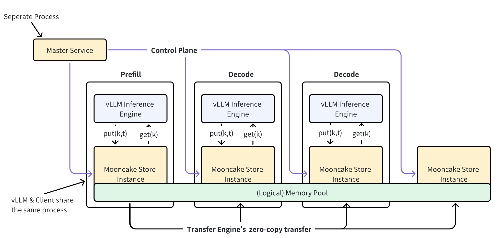

# Mooncake Store Deployment & Tuning Guide

This guide covers minimal deployment, and operational tuning of Mooncake Store.

## Architecture Overview




**Master Service** (`mooncake_master`): The central coordinator. It manages cluster membership, allocates object storage across client nodes, and enforces eviction/placement policies. Runs as a standalone process.

**Client Node**: Each node contributes DRAM (and optionally VRAM/SSD) to form the distributed cache pool. Clients communicate with the master over RPC for control operations (`Put`/`Get`/`Remove`), but transfer actual data directly between each other via the Transfer Engine — the master is never in the data path.

**Metadata Service**: A separate service (etcd, Redis, or HTTP) used by the Transfer Engine for peer discovery and configuration. The master's embedded HTTP metadata server can replace an external etcd/Redis for simple deployments. We also provide a P2P handshake mechanism (`P2PHANDSHAKE`) that enables decentralized metadata management by storing metadata locally on each node, eliminating the need for a centralized service — this is the simplest metadata handshake method and the recommended starting point (see [Quick Start](#quick-start)).

For a detailed design discussion, see the [Mooncake Store Design](../design/store/mooncake-store.md).

---

## Quick Start

Deploy a minimal single-node Mooncake Store in three steps.

### 1. Start the Metadata Service

This quick start uses **P2P handshake** — the simplest option, with **nothing to start**: each node exchanges and stores Transfer Engine metadata locally during connection setup. You just pass the literal string `P2PHANDSHAKE` as the client's `metadata_server` (step 3).

For large or long-lived clusters, use the master's embedded HTTP metadata server or an external etcd/Redis instead — see [Deployment Scenarios](#deployment-scenarios).

### 2. Start the Master Service

With P2P handshake the master needs no metadata-server flags:

```bash
mooncake_master
```

On success the master logs a single line like:

```
Master service started on port 50051, max_threads=4, ...
```

The master's default RPC port is `50051`. (To embed an HTTP metadata server instead of using P2P, add `--enable_http_metadata_server=true --http_metadata_server_port=8080`.)

(start-a-store-client)=
### 3. Start a Store Client

A client contributes DRAM (and optionally SSD) to the cluster. The simplest way is to embed Mooncake in a Python process and call `store.setup(...)` with `metadata_server="P2PHANDSHAKE"`:

```python
from mooncake.store import MooncakeDistributedStore

store = MooncakeDistributedStore()
store.setup(
    local_hostname="localhost",
    metadata_server="P2PHANDSHAKE",           # decentralized; no metadata service
    global_segment_size=3200 * 1024 * 1024,   # DRAM contributed to the cluster
    local_buffer_size=512 * 1024 * 1024,      # Transfer Engine buffer
    protocol="tcp",
    rdma_devices="",                          # keyword is rdma_devices (not device_name)
    master_server_addr="127.0.0.1:50051",     # keyword is master_server_addr
)
```

There are **three ways** to run a client — programmatic (above), a standalone `mooncake_store_service` process (configured via `MOONCAKE_*`), and the `mooncake_client` real-client RPC process. See [Reference: Client Configuration & Tuning](#reference-client-configuration-tuning) for all three, with full parameter/env tables.

**What just happened:**

1. The client registered itself with the master via RPC.
2. The master allocated a 3.2 GB segment on this node and added it to the cluster's memory pool.
3. The client is now ready to serve `Put`/`Get`/`Remove` requests.

### Run the Stress Benchmark

Mooncake Store includes sample programs for validating C++ and Python integrations. The [stress benchmark script](gh-file:mooncake-store/tests/stress_cluster_benchmark.py) can be used to verify a two-role prefill/decode setup.

Configure the script with command-line flags (run with `--help` for the full list):

- `--local-hostname`: the local machine's reachable IP address or hostname.
- `--metadata-server`: the Transfer Engine metadata service, e.g. `P2PHANDSHAKE`, `http://127.0.0.1:8080/metadata`, or an etcd address.
- `--master-server`: the Mooncake Store master address. Use `IP:Port` in default mode, or `etcd://IP:Port;IP:Port;...;IP:Port` in etcd-backed HA mode.
- `--protocol`: transport, `tcp` / `rdma` / `cxl` / `ascend` (defaults to `rdma`).

Then start the roles:

```bash
python3 mooncake-store/tests/stress_cluster_benchmark.py --role prefill
python3 mooncake-store/tests/stress_cluster_benchmark.py --role decode
```

For RDMA, topology auto-discovery and NIC filters can be passed through environment variables:

```bash
MC_MS_AUTO_DISC=1 MC_MS_FILTERS="mlx5_1,mlx5_2" python3 mooncake-store/tests/stress_cluster_benchmark.py --role prefill
MC_MS_AUTO_DISC=1 MC_MS_FILTERS="mlx5_1,mlx5_2" python3 mooncake-store/tests/stress_cluster_benchmark.py --role decode
```

The absence of errors indicates successful data transfer.

### Verify Installed Examples

For a Python integration check, run `mooncake-store/tests/distributed_object_store_provider.py` after starting the metadata service and `mooncake_master`.

For a C++ integration check, run `build/mooncake-store/tests/client_integration_test` after building tests and starting the required services.

### Verify

```bash
# Health check — master metrics endpoint
curl -s http://localhost:9003/metrics/summary

# List registered clients
# (exposed through the store's Python API or RPC)
```

---

## Deployment Scenarios

### Single-Node (TCP) — Development / Quick Evaluation

The simplest deployment, as shown in [Quick Start](#quick-start). A single `mooncake_master` orchestrates clients over TCP. Suitable for development, testing, and single-host evaluation.

```bash
mooncake_master \
  --enable_http_metadata_server=true \
  --http_metadata_server_host=0.0.0.0 \
  --http_metadata_server_port=8080
```

Limitation: the master is a single point of failure. If it crashes, cluster operations pause until it is restored.

---

### High-Availability (etcd) — Production HA

Runs a cluster of master instances coordinated through etcd. If the leader fails, the remaining instances elect a new leader automatically.

```bash
# Start each master instance with:
mooncake_master \
  --enable_ha=true \
  --ha_backend_type=etcd \
  --ha_backend_connstring="10.0.0.1:2379;10.0.0.2:2379;10.0.0.3:2379" \
  --enable_oplog=true \
  --rpc_address=10.0.0.1
```

Each instance must specify its own reachable `--rpc_address`. `--etcd_endpoints` is still accepted as a backward-compatible alias for the etcd HA backend connection string when `--ha_backend_connstring` is empty. The etcd cluster used for HA can be shared with or separate from the Transfer Engine's metadata etcd.

**Client addressing:** to reach an HA cluster, clients must use the `etcd://` master-address form (so they can discover the current leader) instead of a single `IP:Port` — set `master_server_addr` (Method A) / `MOONCAKE_MASTER` (Method B) / `--master_server_address` (Method C) to `etcd://10.0.0.1:2379;10.0.0.2:2379;...`.

---

### High-Availability (Redis) — Alternative HA Backend

Same HA semantics but using Redis instead of etcd for leader election:

```bash
mooncake_master \
  --enable_ha=true \
  --ha_backend_type=redis \
  --ha_backend_connstring="redis://127.0.0.1:6379" \
  --rpc_address=10.0.0.1
```

**Client addressing:** clients reach a Redis-backed HA cluster with the `redis://connstring` master-address form (e.g. `redis://127.0.0.1:6379`) for `master_server_addr` / `MOONCAKE_MASTER` / `--master_server_address`, instead of a single `IP:Port`. Redis is used only for leader election here. OpLog replication currently requires `ha_backend_type=etcd`.


---

### Snapshot & Restore — Backup / Disaster Recovery

```{caution}
Metadata Snapshot And Restore is experimental feature.
```

Periodically persist master metadata to local disk or S3, enabling recovery from a recent snapshot after a crash.

```bash
export MOONCAKE_SNAPSHOT_LOCAL_PATH=/data/mooncake_snapshots

mooncake_master \
  --enable_snapshot=true \
  --snapshot_interval_seconds=300 \
  --snapshot_retention_count=5 \
  --snapshot_object_store_type=local \
  --enable_snapshot_restore=true
```

---

### Tiered Storage with SSD Offload — Cost-Effective Capacity

Extends the cache pool from DRAM to SSD while keeping normal reads and writes on the distributed memory path. With `--enable_offload=true`, completed memory writes are queued for asynchronous SSD persistence through the master control plane. Set `--offload_on_evict=true` to defer that SSD write until the memory eviction path selects an object for reclamation. When `--promotion_on_hit=true`, SSD-only objects can be promoted back to DRAM after repeated reads; admission is gated by `--promotion_admission_threshold`.

```bash
mooncake_master \
  --enable_offload=true \
  --offload_on_evict=true \
  --promotion_on_hit=true \
  --promotion_admission_threshold=2 \
  --enable_http_metadata_server=true \
  --http_metadata_server_port=8080
```

Do not set `--root_fs_dir` with `--enable_offload=true`. `--root_fs_dir` is a legacy parameter from an older persistence path and may cause issues on the SSD offload path. Configure each real client's offload directory with `MOONCAKE_OFFLOAD_FILE_STORAGE_PATH` instead.

---

### CXL-Aware Allocation — Memory Tiering

When the host has CXL-attached memory, the master can preferentially allocate new objects on the CXL tier, reserving local DRAM for latency-sensitive operations.

```bash
mooncake_master \
  --enable_cxl=true \
  --cxl_path=/dev/dax0.0 \
  --cxl_size=17179869184 \
  --allocation_strategy=cxl
```

---

### Container / Dynamic Network Interface

When the master runs in a container with a dynamic IP, use `--rpc_interface` to resolve the RPC address from a stable interface name:

```bash
mooncake_master \
  --rpc_interface=eth0 \
  --enable_http_metadata_server=true \
  --http_metadata_server_host=0.0.0.0 \
  --http_metadata_server_port=8080
```

The master resolves the current IPv4 address of `eth0` at startup and uses it as the advertised RPC address.

---

## High Availability (HA)

Mooncake Store supports a Primary-Standby HA model with batch-record OpLog replication. The active Primary serves traffic and writes ordered batches to etcd. Standby nodes poll the durable batch prefix and apply each entry in strict sequence order.

### HA Architecture

```
+------------------+     etcd batch records     +---------------+
| Primary          | --------------------------> | Standby       |
| OrderedOpLogWriter|     durable_prefix         | OpLogApplier  |
| MasterService    |                              | MetadataStore |
+------------------+                              +---------------+
       ^                                                 |
       |         Leadership Election                      |
       +---------------- etcd/redis/k8s ------------------+
```

### HA Configuration

HA leadership and metadata replication are configured separately:

- The HA coordinator elects the active master. Configure it with `--enable_ha`, `--ha_backend_type`, `--ha_backend_connstring`, and `--cluster_id`. For `ha_backend_type=etcd`, legacy `--etcd_endpoints` is used only when `--ha_backend_connstring` is empty.
- The optional batch-record OpLog persists metadata mutations so standby masters can catch up and later be promoted. Enable it explicitly with `--enable_oplog=true`; it is disabled by default and requires `ha_backend_type=etcd` and a build with `STORE_USE_ETCD`.


- `--enable_oplog`: Enable the primary OpLog writer and standby reader. Defaults to `false`.
- `--oplog_poll_interval_ms`: Base polling and retry delay for the batch standby, in milliseconds.
- `--oplog_batch_max_entries`: Maximum number of entries admitted to an ordered batch. Defaults to `1024`.
- `--batch_oplog_retry_timeout_sec`: Maximum consecutive retryable batch-standby failure window in seconds (default `180`).

For snapshot-based standby bootstrap, also configure:

- `--enable_snapshot_restore` (bool, default `false`): Enable standby to bootstrap from the latest snapshot at startup.
- `--snapshot_object_store_type` (str): Snapshot object store type: `local` or `s3`.
- `--snapshot_catalog_store_type` (str): Snapshot catalog store type: `embedded` (default) or `redis`.

### Standby Bootstrap

When a Standby starts, it follows this sequence:

1. **Snapshot Bootstrap** (if `enable_snapshot_restore=true`):
   - Load the latest snapshot from the configured catalog and object store.
   - Rebuild object metadata and segment state from the snapshot baseline.
2. **OpLog Catch-up**:
   - Start from the snapshot's `last_included_seq` (or from 1 if no snapshot).
   - Poll `durable_prefix`, read batch records up to that boundary, and apply entries in strict sequence order.

Supported OpLog entry types:
- `PUT_END`: Object write completion
- `REMOVE`: Object removal
- `PUT_REVOKE`: Object revocation
- `SEGMENT_MOUNT`: Segment mount event
- `SEGMENT_UNMOUNT`: Segment unmount event
- `SEGMENT_UPDATE`: Segment update event

### Promotion and Failover

When the Primary fails, the Standby is promoted through the following steps:

1. **Leadership Lease**: The supervisor must acquire and retain the leadership lease before promotion begins.
2. **Final Prefix Read and Catch-up**: The Standby stops its polling loop, reads `durable_prefix` again, and applies all durable batches. A missing prefix is accepted only when the local applied sequence is zero; otherwise promotion fails closed.
3. **Export Context**: The Standby exports its current state as a `PromotionContext`, including:
   - `applied_seq_id`: The latest applied OpLog sequence ID.
   - `objects`: All object metadata from the in-memory store.
   - `segments`: All segment registry entries.
4. **State Restoration**: The new Primary restores and validates the complete `PromotionContext`, populating metadata shards and the segment manager. A context with zero objects and segments still passes through restoration so that unsupported recovery modes cannot bypass validation.
5. **Serving Gate**: The supervisor revalidates leadership and exposes the RPC service only after restoration succeeds. Promotion, restoration, or leadership validation failure leaves `service_ready=false`, keeps data endpoints unavailable, and releases leadership. Failure to release leadership does not make the candidate serviceable.
6. **Invalid Endpoint Filtering**: During restoration, any replica endpoints that correspond to segments no longer in the registry are automatically filtered out from `GetReplicaList` results.

This fail-closed behavior is intentional. Older versions could log a restoration error and continue serving from empty or partially restored metadata. That behavior was a correctness bug, not a supported availability fallback: the serving state could disagree with the durable OpLog and poison later recovery attempts. Mooncake does not automatically discard snapshots, OpLog records, or metadata after a recovery error.

### Example: HA Deployment with etcd

Primary configuration (`primary.yaml`):

```yaml
enable_ha: true
ha_backend_type: "etcd"
ha_backend_connstring: "etcd-1:2379;etcd-2:2379;etcd-3:2379"
cluster_id: "mooncake_cluster"
enable_oplog: true
oplog_poll_interval_ms: 1000
oplog_batch_max_entries: 1024
enable_snapshot: true
snapshot_object_store_type: "local"
snapshot_catalog_store_type: "embedded"
rpc_port: 50051
```

Standby configuration (`standby.yaml`):

```yaml
enable_ha: true
ha_backend_type: "etcd"
ha_backend_connstring: "etcd-1:2379;etcd-2:2379;etcd-3:2379"
cluster_id: "mooncake_cluster"
enable_oplog: true
oplog_poll_interval_ms: 1000
oplog_batch_max_entries: 1024
enable_snapshot_restore: true
snapshot_object_store_type: "local"
snapshot_catalog_store_type: "embedded"
rpc_port: 50052
```

Environment variable for local snapshot storage:

```bash
export MOONCAKE_SNAPSHOT_LOCAL_PATH=/data/mooncake_snapshots
```

Start the cluster:

```bash
# Start Primary
mooncake_master --config_path=primary.yaml

# Start Standby
mooncake_master --config_path=standby.yaml
```

### Recovery from Unusable HA State

First repair temporary backend, configuration, or snapshot-access failures and restart the affected Standby. If the recovery history is confirmed unusable and losing all cached metadata is acceptable, start a new empty cluster explicitly:

1. Stop every Primary and Standby process that uses the old `cluster_id`.
2. Confirm that losing the old cache metadata and snapshots is acceptable.
3. Change every node to a new, previously unused `cluster_id`.
4. Start the new cluster and allow applications to repopulate the cache.
5. Keep the old namespace for diagnosis, then remove it separately after confirming that no old process can reconnect.

Using a new `cluster_id` isolates the new cluster from the old OpLog, durable prefix, producer view, and snapshot namespace. Do not delete individual recovery keys or reuse the old `cluster_id` while any old process may still run. There is no automatic reset-on-restore-failure option.

### Resetting a Legacy OpLog Namespace

The batch-only implementation does not migrate or read older per-entry OpLog data. Reusing a namespace that contains legacy `latest`, numeric entry, or snapshot sidecar keys is rejected.

Reset is destructive:

1. Stop every Primary and Standby process that uses the cluster ID.
2. Confirm that loss of the old metadata and snapshots is acceptable.
3. Delete the complete `/oplog/{cluster_id}` namespace directly with the operator's etcd tooling.
4. Start the cluster with empty state and batch-record OpLog enabled.

Do not delete individual compatibility keys while any process is running, and do not retain an old snapshot baseline with a nonzero sequence after deleting `durable_prefix`.

## Metrics Endpoints

The master exposes Prometheus-style metrics on `--metrics_port`:

```bash
# Prometheus format
curl -s http://<master_host>:9003/metrics

# Human-readable summary
curl -s http://<master_host>:9003/metrics/summary
```

When tenant quota is enabled, `/metrics` also includes per-tenant quota gauges and quota counters:

- `mooncake_tenant_quota_requested_bytes{tenant_id}`
- `mooncake_tenant_quota_effective_bytes{tenant_id}`
- `mooncake_tenant_quota_charged_bytes{tenant_id}`
- `mooncake_tenant_quota_admission_closed{tenant_id}`
- `mooncake_tenant_quota_over_quota{tenant_id}`
- `mooncake_tenant_quota_explicit_policy{tenant_id}`
- `mooncake_tenant_quota_reject_total{tenant_id,reason}`
- `mooncake_tenant_evict_bytes_total{tenant_id}`
- `mooncake_tenant_quota_allocatable_capacity_bytes`
- `mooncake_tenant_quota_requested_bytes_sum`
- `mooncake_tenant_quota_effective_bytes_sum`

---

## Tenant Quota Management

:::{toctree}
:maxdepth: 1

Multi-Tenant Deployment <multi-tenancy>
:::

---

## Quick Tips

- Scale `--rpc_thread_num` with available CPU cores and workload.
- Start with default eviction settings; adjust `--eviction_high_watermark_ratio` and `--eviction_ratio` based on memory pressure and object churn.
- Use `/metrics/summary` during bring-up; integrate `/metrics` with Prometheus/Grafana for production.
- For detailed SSD offload configuration (storage backends, eviction policies, io_uring), see the [SSD Offload guide](ssd/ssd-offload).
- For NVMe-oF SSD pool configuration see the [NVMe-oF SSD Pool Deployment Guide](ssd/nvmf-ssd-deployment-guide)
- For the experimental HF3FS USRBIO adapter used by descriptor-based DFS replicas, see the [HF3FS USRBIO adapter guide](../getting_started/plugin-usage/3FS-USRBIO-Plugin).
- For detailed monitoring and observation see [Observability](../getting_started/observability)

:::{toctree}
:maxdepth: 1
:hidden:

KV Cache Sharing and Isolation<kv-cache-sharing-and-isolation>
SSD Storage<ssd/index>
HF3FS USRBIO Adapter (Experimental)<../getting_started/plugin-usage/3FS-USRBIO-Plugin>
../getting_started/observability
:::

---

## Reference: Master Startup Flags

### RPC

| Flag | Default | Description |
|------|---------|-------------|
| `--rpc_port` | `0` → effective `50051` | RPC listen port. The literal default is `0`, which falls back to the deprecated `--port` (default `50051`) |
| `--rpc_thread_num` | `0` → effective `min(4, CPU cores)` | RPC worker threads. The literal default is `0`, which falls back to the deprecated `--max_threads` → `min(4, CPU cores)` |
| `--rpc_address` | `0.0.0.0` | RPC bind address |
| `--rpc_interface` | empty | Network interface to resolve RPC address at startup (overrides `--rpc_address`) |
| `--rpc_conn_timeout_seconds` | `0` | Idle connection timeout; `0` disables |
| `--rpc_enable_tcp_no_delay` | `true` | Enable TCP_NODELAY |

### Logging

The master uses glog. When `--log_dir` is set, all severities are merged into a single journal file in that directory (`mooncake_master.INFO.<date>-<time>.<pid>`), reachable through the stable `mooncake_master.INFO` symlink.

glog's standard flags (`--log_dir`, `--max_log_size`, `--logtostderr`, ...) control the rest.

### Metrics

| Flag | Default | Description |
|------|---------|-------------|
| `--enable_metric_reporting` | `true` | Periodically log master metrics |
| `--metrics_port` | `9003` | HTTP port for `/metrics` endpoints |

### KV Cache Event Publisher

The master can publish KV cache lifecycle events over a ZMQ PUB socket for
cache-aware indexers such as Mooncake Conductor. This feature is compiled out
by default. Install `libzmq3-dev` and configure Mooncake Store with
`-DENABLE_KV_EVENTS=ON` before enabling it at runtime.

Both `--kv_events_bind_endpoint` and `--kv_events_backend_id` are required when
the publisher is enabled. If either value is empty, or the ZMQ socket cannot
bind, the master logs an error and continues with event publishing disabled.

```bash
mooncake_master \
  --enable_kv_events=true \
  --kv_events_bind_endpoint=tcp://0.0.0.0:5557 \
  --kv_events_backend_id=store-node-1
```

Register an address reachable by the indexer, rather than the wildcard bind
address, through the indexer's `POST /register` endpoint. For the event format,
registration fields, and object-key behavior, see the {ref}`Mooncake Store
master publisher <mooncake-store-master-publisher>` reference.

| Flag | Default | Description |
|------|---------|-------------|
| `--enable_kv_events` | `false` | Enable the ZMQ KV cache event publisher; requires a build with `ENABLE_KV_EVENTS=ON` |
| `--kv_events_bind_endpoint` | empty | ZMQ PUB bind endpoint, for example `tcp://0.0.0.0:5557`; required when enabled |
| `--kv_events_backend_id` | empty | Cache-owner identity emitted as `backend_id`; required when enabled |
| `--kv_events_emit_legacy_compat` | `true` | Include vLLM/SGLang-compatible aliases such as `type` and `block_hashes` |
| `--kv_events_emit_object_key` | `true` | Emit the raw Mooncake `object_key`. Setting this to `false` suppresses `stored` and `removed` entirely, since those events then carry no object identity; `cleared` is unaffected |
| `--kv_events_queue_capacity` | `65536` | Maximum pending events; the publisher drops the oldest event when the queue is full and reserves its sequence number so the loss stays visible. Set to `0` for an unbounded queue |

One master publisher serves one fixed model and parallel context, so the
remaining flags below are emitted verbatim in every event envelope. Empty
strings and `--kv_events_block_size=0` are encoded as nil.

| Flag | Default | Description |
|------|---------|-------------|
| `--kv_events_model_name` | empty | Emitted as `model_name` |
| `--kv_events_additional_salt` | empty | Emitted as `additional_salt`; the hash namespace this publisher's keys belong to |
| `--kv_events_lora_name` | empty | Emitted as `lora_name` |
| `--kv_events_block_size` | `0` | Emitted as `block_size` |
| `--kv_events_dp_rank` | `0` | Emitted as `dp_rank`, both per event and in the batch trailer |
| `--kv_events_tenant_id` | `default` | Accepted for configuration compatibility but not emitted. Every event carries the tenant of the Store operation that produced it |

### HTTP Metadata Server (Embedded)

| Flag | Default | Description |
|------|---------|-------------|
| `--enable_http_metadata_server` | `false` | Enable embedded HTTP metadata server |
| `--http_metadata_server_host` | `0.0.0.0` | Metadata bind host |
| `--http_metadata_server_port` | `8080` | Metadata TCP port |
| `--enable_metadata_cleanup_on_timeout` | `false` | Delete a client's stale HTTP metadata (`mooncake/[<cluster>/]ram/<segment>` and `mooncake/[<cluster>/]rpc_meta/<segment>`) when its heartbeat times out (see below) |

### Stale Metadata Cleanup on Client Timeout

When a client crashes or is force-killed (`kill -9`, OOM, node failure), it cannot
run its normal cleanup, leaving stale entries on the HTTP metadata server
(`mooncake/[<cluster>/]ram/<segment>` and `mooncake/[<cluster>/]rpc_meta/<segment>`).
The HTTP metadata server has no heartbeat of its own, so these entries linger and
can mislead nodes that later connect or restart with different RDMA parameters.

With `--enable_metadata_cleanup_on_timeout=true`, the Master Service reuses its
existing client-heartbeat monitor: when a client's `--client_ttl` expires, in
addition to unmounting the segment it also removes that client's `ram/` and
`rpc_meta/` keys from the HTTP metadata server. It supports both deployment
topologies:

- **Co-located** (`--enable_http_metadata_server=true`): the master removes the
  keys via a direct in-process call (no network overhead).
- **Separately deployed** HTTP metadata server: the master derives the metadata
  server address from the cluster's existing configuration and removes the keys
  via HTTP `DELETE`. The address is read, in priority order, from:
  1. the `MOONCAKE_TE_META_DATA_SERVER` environment variable (the same Transfer
     Engine metadata connection string the clients use, e.g.
     `http://host:8080/metadata`), then
  2. the `metadata_server` field of the JSON file pointed to by
     `MOONCAKE_CONFIG_PATH`.

Notes:
- Only `http(s)` metadata servers are supported; `etcd`/`redis`/`P2PHANDSHAKE`
  backends are not cleaned up (a warning is logged and cleanup stays disabled).
- The feature is opt-in and best-effort: if no co-located server is enabled and
  no HTTP metadata address can be derived, the master logs a warning and
  disables cleanup. Remote `DELETE` failures are logged but never block the
  client-monitor thread or the main process.
- Respects `MC_METADATA_CLUSTER_ID` for custom key prefixes (matching the
  Transfer Engine).

```bash
# Co-located metadata server
mooncake_master \
  --enable_http_metadata_server=true \
  --enable_metadata_cleanup_on_timeout=true \
  --client_ttl=10

# Separately-deployed HTTP metadata server (address derived from the env var)
export MOONCAKE_TE_META_DATA_SERVER=http://metadata-host:8080/metadata
mooncake_master \
  --enable_metadata_cleanup_on_timeout=true \
  --client_ttl=10
```

### Memory Allocator

| Flag | Default | Description |
|------|---------|-------------|
| `--memory_allocator` | `offset` | Memory allocator: `offset` (default) or `cachelib` |

### Allocation Strategy

| Flag | Default | Description |
|------|---------|-------------|
| `--allocation_strategy` | `random` | Allocation strategy: `random` (pure random, fastest), `free_ratio_first` (best memory load balance), `ssd_free_ratio_first` (SSD-aware free-ratio-first), `cxl` (prefer CXL memory), or `local_first` (prefer local host memory segments before ordered remote fallback) |

### PutStart Timeouts

| Flag | Default | Description |
|------|---------|-------------|
| `--put_start_discard_timeout_sec` | `30` | Seconds before an uncompleted `PutStart` is discarded |
| `--put_start_release_timeout_sec` | `600` (10 min) | Seconds before `PutStart`-allocated space is released

### Eviction & TTLs

| Flag | Default | Description |
|------|---------|-------------|
| `--default_kv_lease_ttl` | `10000` ms | Lease TTL for KV objects. Supports `5000ms`, `5s`, `30m`, `1h` |
| `--default_kv_soft_pin_ttl` | `1800000` ms | Soft pin TTL (30 min) |
| `--max_kv_soft_pin_ttl` | `86400000` ms | Maximum request-level soft pin TTL (24 h) |
| `--allow_evict_soft_pinned_objects` | `true` | Allow evicting soft-pinned objects |
| `--eviction_ratio` | `0.05` | Fraction evicted at high watermark |
| `--eviction_high_watermark_ratio` | `0.90` | Usage ratio triggering eviction |
| `--client_ttl` | `10` s | Seconds before a silent client is considered disconnected |

### Tenant Quota

| Flag | Default | Description |
|------|---------|-------------|
| `--enable_multi_tenants` | `false` | Enable strict tenant registration and per-tenant memory quota admission |
| `--tenant_quota_connector_type` | `file` | Tenant quota policy connector type: `file` or `etcd` when built with `STORE_USE_ETCD=ON` |
| `--tenant_quota_connector_uri` | empty | Connector URI; for `file`, the writable YAML policy path; for `etcd`, the endpoints string |

### High Availability

**Master Node High Availability**
| Flag | Default | Description |
|------|---------|-------------|
| `--enable_ha` | `false` | Enable HA mode |
| `--ha_backend_type` | `etcd` | HA backend: `etcd`, `redis`, or `k8s` |
| `--ha_backend_connstring` | empty | HA backend connection string |
| `--etcd_endpoints` | empty | Backward-compatible etcd HA endpoints, used only for `ha_backend_type=etcd` when `--ha_backend_connstring` is empty |
| `--cluster_id` | `mooncake_cluster` | Cluster ID for HA persistence |
| `--enable_oplog` | `false` | Enable the primary OpLog writer and standby reader; currently requires `enable_ha=true` and `ha_backend_type=etcd` |
| `--oplog_poll_interval_ms` | `1000` | Base polling and retry delay for the batch standby, in milliseconds |
| `--oplog_batch_max_entries` | `1024` | Maximum number of entries admitted to an ordered batch |
| `--batch_oplog_retry_timeout_sec` | `180` | Maximum consecutive retryable batch-standby failure window in seconds |

```{caution}
Metadata Snapshot And Restore is experimental feature.
```

**Metadata Snapshot And Restore**

| Flag | Default | Description |
|------|---------|-------------|
| `--enable_snapshot` | `false` | Enable periodic metadata snapshot |
| `--snapshot_interval_seconds` | `600` (10 min) | Interval between snapshots |
| `--snapshot_child_timeout_seconds` | `300` (5 min) | Timeout per snapshot child process |
| `--snapshot_retention_count` | `2` | Number of recent snapshots retained |
| `--snapshot_object_store_type` | required | Object store: `local` or `s3` |
| `--snapshot_catalog_store_type` | empty | Catalog store: `embedded` or `redis` |
| `--snapshot_catalog_store_connstring` | empty | Catalog store connection string (required for `redis`) |
| `--snapshot_backup_dir` | empty | Optional local backup directory |
| `--enable_snapshot_restore` | `false` | Restore from latest snapshot at startup |

**Environment variable:** `MOONCAKE_SNAPSHOT_LOCAL_PATH` (required when `--snapshot_object_store_type=local`) — persistent directory for local snapshots.

```{warning}
The snapshot storage path is a **managed directory** exclusively controlled by Mooncake. Old snapshots exceeding `--snapshot_retention_count` are automatically deleted. Use a dedicated directory to avoid data loss.
```

### Task Manager

| Flag | Default | Description |
|------|---------|-------------|
| `--max_total_finished_tasks` | `10000` | Max finished tasks kept in memory |
| `--max_total_pending_tasks` | `10000` | Max queued pending tasks |
| `--max_total_processing_tasks` | `10000` | Max simultaneously processing tasks |
| `--pending_task_timeout_sec` | `300` (5 min) | Timeout for pending tasks (`0` = no timeout) |
| `--processing_task_timeout_sec` | `300` (5 min) | Timeout for processing tasks (`0` = no timeout) |
| `--max_retry_attempts` | `10` | Max retries for failed tasks (`NO_AVAILABLE_HANDLE`) |

### Offload / Tiered Storage

Flags for controlling data movement between DRAM and SSD.

| Flag | Default | Description |
|------|---------|-------------|
| `--enable_offload` | `false` | Enable offload from DRAM to SSD |
| `--offload_on_evict` | `false` | Defer offload to eviction time rather than at `Put` |
| `--offload_force_evict` | `false` | Force-evict objects exceeding capacity without offload |
| `--offloading_queue_limit` | `50000` | Max number of objects allowed in the offloading queue per local disk segment. Increase to allow more objects to be offloaded to SSD before force-eviction kicks in |
| `--offload_cap_ratio` | `0.5` | Per-cycle offload cap as a fraction of `offloading_queue_limit` (range `[0.0, 1.0]`). Controls how many objects can be queued for offload in a single eviction cycle before falling back to force-evict |
| `--promotion_on_hit` | `false` | Promote SSD-resident keys to DRAM on read hit |
| `--promotion_admission_threshold` | `2` | Min CountMinSketch count to allow promotion (`1` = disable gating) |
| `--promotion_max_per_heartbeat` | `1` | Max promotion tasks handed to a single client per heartbeat. Each task is a synchronous SSD-read + RDMA-write on the client; serializing them avoids blocking past the client-liveness window |
| `--promotion_queue_limit` | `50000` | Max in-flight promotion tasks |
| `--quota_bytes` | `0` (90% of capacity) | Storage quota in bytes |
| `--enable_disk_eviction` | `true` | Enable disk eviction |

Start with `--enable_offload=true` for eager asynchronous SSD persistence after `Put` completion. Add `--offload_on_evict=true` when you want SSD writes to happen only when memory pressure selects an object for eviction. Add `--promotion_on_hit=true` to allow hot SSD-only data to be promoted back to DRAM, and tune `--promotion_admission_threshold` to control how many observed reads are required before promotion is queued.

For SSD offload, configure the disk path on each real client with `MOONCAKE_OFFLOAD_FILE_STORAGE_PATH`; the master tracks these objects as `LOCAL_DISK` replicas. Do not use the legacy `--root_fs_dir` parameter with `--enable_offload=true`.

When `--offload_on_evict=true` is active, each `BatchEvict` cycle can queue at most `offloading_queue_limit * offload_cap_ratio` objects for SSD offload (default: `50000 * 0.5 = 25000`); objects exceeding this cap fall back to force-evict (discard) if `--offload_force_evict=true`, otherwise they remain in memory. For SSD-heavy workloads where NVMe bandwidth is underutilized while the KV-cache hit rate suffers, raise both `--offloading_queue_limit` and `--offload_cap_ratio` so more objects per cycle are actually persisted to SSD instead of discarded. Example: `--offloading_queue_limit=500000 --offload_cap_ratio=0.8` yields a per-cycle cap of `400000` (vs the default `25000`).

### CXL Memory

| Flag | Default | Description |
|------|---------|-------------|
| `--enable_cxl` | `false` | Enable CXL memory support |
| `--cxl_path` | `/dev/dax0.0` | DAX device path for CXL memory |
| `--cxl_size` | `8GB` (`8589934592`) | CXL memory size in bytes |

When `--allocation_strategy=cxl` is set alongside `--enable_cxl=true`, the master preferentially allocates new objects on CXL memory.

### Legacy Shared-filesystem `DISK` Persistence

The older shared-filesystem persistence path remains available independently
of descriptor-based DFS:

| Flag | Default | Description |
|------|---------|-------------|
| `--root_fs_dir` | empty | Enable legacy `DISK` replicas under `<root_fs_dir>/<cluster_id>`. The path must resolve to the same shared filesystem location on every participating client. |
| `--global_file_segment_size` | `INT64_MAX` (unlimited) | Declared legacy file capacity used by master usage metrics. It does not configure descriptor-based DFS shard files. |

With `--root_fs_dir` set, the master adds a legacy `DISK` replica to each new
object and clients write it asynchronously. This path is distinct from both
client-owned `LOCAL_DISK` SSD offload and descriptor-based `DFS` replicas. Do
not combine `--root_fs_dir` with `--enable_offload=true`; configure real-client
SSD offload with `MOONCAKE_OFFLOAD_FILE_STORAGE_PATH` instead.

(dfs-storage)=
### Descriptor-based DFS Storage

```{warning}
**Work in progress.** Descriptor-based DFS is intended for development and
evaluation only. It is not production-ready and is not covered by Mooncake
Store's general fault-tolerance, HA continuity, durability, or multi-tenant
guarantees.
```

Mooncake Store can place an additional replica in a shared distributed
filesystem. The master publishes a descriptor containing a file path, offset,
object size, aligned allocation size, and integer allocator ID. Clients use the
descriptor to access the same files through either regular POSIX I/O or the
HF3FS USRBIO adapter.

Two allocator modes are available:

- `shard` is the default and preserves the original behavior. It pre-creates a
  fixed set of shard files and allocates reusable ranges within the key-selected
  shard.
- `bucket` selects `ImmutableBucketAllocator`. It creates bucket files on
  demand, appends immutable entries, persists sealed-bucket metadata, and
  reclaims whole buckets in LRU order. In this mode the descriptor's existing
  `shard_idx` field carries the bucket ID; the serialized descriptor format is
  unchanged.

DFS replicas are separate from `LOCAL_DISK` SSD-offload replicas. They do not
use the legacy `--root_fs_dir` persistence path or the master's asynchronous
offload task queue.

```{note}
Bucket mode restores committed entries from sealed-bucket metadata after a
standalone master restart. Shard mode remains in-memory only, and neither mode
is compatible with master snapshot/oplog recovery or HA leader failover. See
the complete list of limitations below.
```

#### Master configuration

Enable the DFS allocator in the master process and select a shared root and
shard layout. For example, to use HF3FS:

```bash
export MOONCAKE_ENABLE_DFS=1
export MOONCAKE_DFS_ROOT_DIR=/mnt/3fs/mooncake
export MOONCAKE_DFS_FS_ADAPTER=hf3fs
export MOONCAKE_DFS_ALLOCATOR_TYPE=shard
export MOONCAKE_DFS_SHARD_COUNT=64
export MOONCAKE_DFS_SHARD_CAPACITY=4294967296
export MOONCAKE_DFS_ALIGNMENT=4096
export MOONCAKE_DFS_SINGLE_TENANT=true

mooncake_master [other master arguments]
```

At startup, the master creates `MOONCAKE_DFS_SHARD_COUNT` shard files and
preallocates each file to `MOONCAKE_DFS_SHARD_CAPACITY`. The example therefore
configures 256 GiB of total logical shard capacity (`64 * 4 GiB`). Ensure the
shared filesystem has sufficient capacity; whether all backing space is
reserved immediately depends on the selected filesystem adapter.

To use immutable buckets instead, select `bucket` and configure the per-bucket
and total capacity limits:

```bash
export MOONCAKE_ENABLE_DFS=1
export MOONCAKE_DFS_ROOT_DIR=/mnt/3fs/mooncake
export MOONCAKE_DFS_FS_ADAPTER=hf3fs
export MOONCAKE_DFS_ALLOCATOR_TYPE=bucket
export MOONCAKE_DFS_BUCKET_CAPACITY=268435456
export MOONCAKE_DFS_MAX_BUCKET_COUNT=256
export MOONCAKE_DFS_ALIGNMENT=4096
export MOONCAKE_DFS_SINGLE_TENANT=true
```

Bucket files are created when needed. Each object, including its key header and
alignment padding, must fit in one bucket. Reducing `max_bucket_count` below the
number of existing buckets does not delete them immediately; it prevents new
buckets from being created until the count is again below the limit.

The `hf3fs` adapter requires Mooncake to be built with `USE_3FS=ON`. Use
`MOONCAKE_DFS_FS_ADAPTER=posix` for development and integration testing on a
regular shared filesystem.

#### Client configuration

Every client that may read or write a DFS replica must initialize
`FileStorage` and select the distributed backend. Use an absolute DFS root path;
the root string, shard count, shard capacity, and alignment must match the
master configuration. Select an adapter that can access the same underlying
shared files; the examples use the same adapter in every process.

```bash
export MOONCAKE_OFFLOAD_ENABLED=true
export MOONCAKE_OFFLOAD_STORAGE_BACKEND_DESCRIPTOR=distributed_storage_backend
export MOONCAKE_OFFLOAD_FILE_STORAGE_PATH=/data/file_storage
export MOONCAKE_MASTER=127.0.0.1:50051
export MOONCAKE_DFS_ROOT_DIR=/mnt/3fs/mooncake
export MOONCAKE_DFS_FS_ADAPTER=hf3fs
export MOONCAKE_DFS_ALLOCATOR_TYPE=shard
export MOONCAKE_DFS_SHARD_COUNT=64
export MOONCAKE_DFS_SHARD_CAPACITY=4294967296
export MOONCAKE_DFS_ALIGNMENT=4096
export MOONCAKE_DFS_SINGLE_TENANT=true

python -m mooncake.mooncake_store_service
```

For a programmatic Python client, pass `enable_ssd_offload=True` to `setup()`
instead of `MOONCAKE_OFFLOAD_ENABLED`. Programmatic setup still reads the
backend-specific `MOONCAKE_OFFLOAD_STORAGE_BACKEND_DESCRIPTOR` and
`MOONCAKE_DFS_*` variables shown above; only the launcher-level setup fields are
supplied as Python arguments. The
`MOONCAKE_OFFLOAD_FILE_STORAGE_PATH` directory must already exist and be an
absolute, writable, non-symlink directory. DFS shard data is stored under
`MOONCAKE_DFS_ROOT_DIR`; the FileStorage path is still required for client
initialization because the shared `FileStorageConfig` validates it even when
the selected backend stores data in the DFS root.

Native C++ clients must initialize a `DistributedStorageBackend` with the same
DFS layout and attach it to the client with `SetDfsStorageBackend()` before
issuing DFS reads or writes. Reads and writes use the DFS descriptor carried by
the current query or start-operation response; no client-side descriptor cache
is required.

#### DFS configuration reference

| Variable | Scope | Default | Description |
|----------|-------|---------|-------------|
| `MOONCAKE_ENABLE_DFS` | Master | `false` | Enable master-side DFS allocation. `MOONCAKE_DFS_ENABLED` is accepted as a compatibility fallback. |
| `MOONCAKE_DFS_ROOT_DIR` | Master and clients | `/mnt/3fs/mooncake` | Absolute shared DFS root; use the same path string in every process. Falls back to `MOONCAKE_DISTRIBUTED_ROOT_DIR`. |
| `MOONCAKE_DFS_FS_ADAPTER` | Master and clients | `hf3fs` | Filesystem adapter: `hf3fs` or `posix`. Falls back to `MOONCAKE_DISTRIBUTED_FS_TYPE`. |
| `MOONCAKE_DFS_ALLOCATOR_TYPE` | Master and clients | `shard` | Allocator mode: `shard` or `bucket`. All participants must use the same mode. |
| `MOONCAKE_DFS_SHARD_COUNT` | Master and clients | `64` | Number of DFS shard files. |
| `MOONCAKE_DFS_SHARD_CAPACITY` | Master and clients | `4294967296` (4 GiB) | Logical file capacity of each shard in bytes. Each object is allocated wholly within one shard. |
| `MOONCAKE_DFS_BUCKET_CAPACITY` | Master and clients | `268435456` (256 MiB) | Bucket file capacity in bytes. Must be aligned and large enough for the entry header. Used only in `bucket` mode. |
| `MOONCAKE_DFS_MAX_BUCKET_COUNT` | Master | `256` | Maximum number of bucket files. Must be in `[1, INT32_MAX]`; total logical capacity is this value times bucket capacity. |
| `MOONCAKE_DFS_ALIGNMENT` | Master and clients | `4096` | Allocation alignment in bytes; must be a power of two and divide the shard capacity. |
| `MOONCAKE_DFS_SINGLE_TENANT` | Master and clients | `true` | Currently must remain `true`. |
| `MOONCAKE_DFS_EVICTION_ENABLED` | Master | `true` | Enable DFS allocator eviction. |
| `MOONCAKE_DFS_EVICTION_HIGH_WATERMARK` | Master | `0.9` | Usage ratio that triggers eviction. |
| `MOONCAKE_DFS_EVICTION_LOW_WATERMARK` | Master | `0.7` | Usage ratio targeted by an eviction cycle. |
| `MOONCAKE_DFS_DEFERRED_FREE_SECONDS` | Master | `30` | Delay before a freed shard range may be reused. |
| `MOONCAKE_DFS_EVICTION_CHECK_INTERVAL` | Master | `5` | Eviction check interval in seconds. |
| `MOONCAKE_DFS_BATCH_READ_THREADS` | Clients | `128` | Worker count for reads spanning multiple buckets. Must be in `[1, 256]`. |
| `MOONCAKE_DFS_BATCH_READ_MERGE_ENABLED` | Clients | `false` | Merge adjacent entries from the same bucket into bounded reads. |
| `MOONCAKE_DFS_DIRECT_READ_ENABLED` | Clients | `true` | Use page-cache-bypassing reads where the adapter supports them. POSIX falls back to buffered reads when `O_DIRECT` is unavailable. |

The master admin HTTP endpoint can change the bucket count limit without a
restart:

```bash
curl -X PUT http://MASTER_HOST:METRICS_PORT/api/v1/dfs/max_bucket_count \
  -H 'Content-Type: application/json' \
  -d '{"max_bucket_count":512}'
```

The response reports `old_value` and `new_value`. Non-positive values and
values above `INT32_MAX` return HTTP 400. The endpoint returns HTTP 409 unless
the active master uses the Bucket allocator.

#### Requesting and accessing DFS replicas

Callers request DFS placement through `ReplicateConfig`:

```python
from mooncake.store import ReplicateConfig

config = ReplicateConfig()
config.replica_num = 1
config.dfs_replica_num = 1
store.put("key", b"value", config)
```

`dfs_replica_num` may currently be `0` or `1`. A DFS replica must be requested
with at least one memory replica (`replica_num >= 1`), so DFS-only placement is
not supported.

In shard mode each key hashes to exactly one DFS shard. Allocation does not fall
back to a different shard, so a request may return `NO_AVAILABLE_HANDLE` when
its selected shard is full even if other shards have free space.

In Bucket mode batches are packed in request order across as many buckets as
needed. A Bucket entry contains a key-length header, the key bytes, the value,
and zero padding to `MOONCAKE_DFS_ALIGNMENT`. Entries are append-only and values
are never overwritten in place. Removing an object creates an in-memory
tombstone; physical space is recovered when the complete Bucket is evicted.

For `Put`, `BatchPut`, `Upsert`, and `BatchUpsert`, the client writes requested
memory and NoF replicas, stages device buffers to host memory when necessary,
and then performs positional DFS writes. Shard writes and upserts remain
synchronous. Bucket puts copy caller-owned CPU or GPU payloads into owned
staging and may return after queuing a batch write; the DFS replica remains
`PROCESSING` until the background write succeeds and `PutEnd(DFS)` commits it.
A failed asynchronous write calls `PutRevoke(DFS)` so incomplete replicas do not
become readable. Requests combining NoF and DFS remain synchronous.

Bucket reads validate descriptor paths and entry layouts before I/O. BatchRead
groups work by bucket and can run buckets in parallel. With direct POSIX reads,
aligned pooled staging buffers absorb unaligned caller buffers and ranges;
short reads and partial failures are reported as `FILE_READ_FAIL` rather than
returning partial data.

For a same-size `Upsert`, if either the existing object or the new request has
a DFS replica, the requested memory, NoF, and DFS replica counts must match the
existing topology. A different-size update releases the old placement and
allocates a new topology.

On reads, the master returns the readable replica list through the normal query
path, and the client selects the first complete replica. If it selects DFS, any
client configured with the same DFS root and shard layout can issue positional
reads for that descriptor.

#### Current limitations

- Only the `default` tenant is supported.
- `dfs_replica_num` must be `0` or `1`, and `replica_num >= 1` is required when
  it is enabled.
- C and Rust clients cannot currently request or access descriptor-based DFS:
  their replication configuration does not expose `dfs_replica_num`, and their
  setup API cannot initialize the distributed `FileStorage` backend. Use the
  native C++ or Python/RealClient API.
- A DFS object is never striped. In shard mode it must fit in the key-selected
  shard; in Bucket mode the complete entry must fit in one bucket.
- Shard allocator state is in memory and is not restored after restart.
- Bucket recovery restores only committed entries in sealed buckets. The active
  bucket has no metadata snapshot by design and is discarded after a crash.
  Sealing happens when allocation rolls over to a new bucket or eviction freezes
  a bucket.
- DFS cannot be enabled with snapshot generation, snapshot restore, oplog
  recovery, or standby restore. Bucket metadata recovery is local standalone
  restart recovery, not HA metadata replication.
- Asynchronous Bucket writes use a fixed client worker pool and retry only the
  completion RPC. There is no persistent retry queue or configurable
  acknowledgement policy.
- DFS writes currently have no DFS-specific timeout, request cancellation, or
  `fsync` durability guarantee.

The older `--root_fs_dir` and `--global_file_segment_size` flags configure the
legacy `DISK` path described above and are not used by descriptor-based DFS
replicas.

### NoF (NVMe-oF SSD Pool)

```{caution}
NVMe-oF SSD Pool (NoF) is an experimental feature.
```

Master-side flags for the NVMe-oF SSD pool. They control eviction within the NoF SSD tier and the heartbeat used to detect and unmount unresponsive NoF segments. For the client-side NoF I/O tuning (`MC_NOF_*`), see the [NVMe-oF SSD Pool Deployment Guide](ssd/nvmf-ssd-deployment-guide.md).

| Flag | Default | Description |
|------|---------|-------------|
| `--nof_eviction_ratio` | `0.05` | Fraction of objects evicted when NoF SSD space is full |
| `--nof_eviction_high_watermark_ratio` | `0.90` | Usage ratio that triggers eviction in the NoF SSD tier |
| `--nof_heartbeat_interval_sec` | `10` | How often the master probes each mounted NoF segment |
| `--nof_heartbeat_probe_timeout_ms` | `1000` | Timeout for a single NoF heartbeat probe |
| `--nof_heartbeat_failures_threshold` | `3` | Consecutive NoF heartbeat failures before a segment is unmounted |

### Master Configuration File

In addition to CLI flags, the master accepts JSON/YAML config files:

```bash
mooncake_master --config_path=mooncake-store/conf/master.yaml
```

```yaml
rpc_interface: "eth0"
rpc_port: 50051
```

### Local-first Allocation

Mooncake can prefer memory segments on the writer's host before falling back to remote hosts. This is useful when colocating inference workers and store segments, because a store node failure only invalidates the KV cache written to that host instead of spreading one request's cache across the whole cluster.

This feature is disabled by default. Enable it on the master by selecting the local-first allocation strategy:

```yaml
allocation_strategy: "local_first"
```

When enabled, the master applies local-first allocation only for memory replicas with `replica_num == 1`. Explicit `preferred_segment` or `preferred_segments` are tried first; if they are unavailable or full, Mooncake falls back through active hosts in cyclic lexicographic host-id order, starting from the writer host when it has active segments, or otherwise from the next greater active host id. Within the same host, segment names are sorted and rotated by key hash so multiple segments on one host do not always receive the first allocation attempt.

By default, the client derives the host id from `local_hostname` by removing the port. For example, `host-a:50051` and `host-a:50052` map to the same host id, `host-a`. Set `MOONCAKE_HOST_ID` to override this derived value with a stable, globally unique node identifier. The override is read directly by the C++ client, so it applies to every client initialization method. It must be set before creating the client, and all writer and store processes on the same physical or logical host must use the same value. An empty or whitespace-only override falls back to `local_hostname`. Loopback and wildcard values such as `localhost`, `127.0.0.1`, `0.0.0.0`, `::1`, and `::` are treated as unknown and do not trigger automatic local-first placement.

In Kubernetes, keep `MOONCAKE_LOCAL_HOSTNAME` as the routable pod IP for the transfer endpoint and use `spec.nodeName` as the shared placement identity:

```yaml
env:
  - name: MOONCAKE_LOCAL_HOSTNAME
    valueFrom:
      fieldRef:
        fieldPath: status.podIP
  - name: MOONCAKE_HOST_ID
    valueFrom:
      fieldRef:
        fieldPath: spec.nodeName
```

Apply the same `MOONCAKE_HOST_ID` mapping to every writer and store pod. This separates the per-pod network address from the node-level placement identity, allowing colocated pods with different IPs to match for local-first allocation.

---

(reference-client-configuration-tuning)=
## Reference: Client Configuration & Tuning

A client is configured through one of the **methods** introduced in [Start a Store Client](#start-a-store-client), plus a shared family of engine-tuning variables:

- **Method A — Programmatic (`setup()` arguments)**: launcher-level fields are passed as explicit Python arguments instead of being loaded through `MooncakeConfig`. Backend-specific variables read by C++, including `MOONCAKE_OFFLOAD_STORAGE_BACKEND_DESCRIPTOR` and `MOONCAKE_DFS_*`, still apply.
- **Method B — Service / Integration (`MOONCAKE_*` + CLI)**: `mooncake.mooncake_store_service` and the vLLM/SGLang connectors read `MOONCAKE_*` environment variables (via `MooncakeConfig`).
- **Method C — Resource-owning real client (`mooncake_client`)**: configured through `mooncake_client` CLI flags (see the **Method C** subsection below).
- **Engine runtime tuning (`MC_*`)**: low-level variables read by the C++ Transfer Engine / store client at runtime. They are orthogonal to the above and **apply to all methods**.

The Method A arguments and the `MOONCAKE_*` variables are the **same logical fields in two forms** (Method B maps onto Method A); note that the `mooncake_client` CLI (Method C) uses yet another spelling for some of them (e.g. `--device_names`, `--master_server_address`).

### Method A — Programmatic (`setup()` arguments)

Arguments of `MooncakeDistributedStore.setup(...)`:

| Argument | Type | Default | Description |
|----------|------|---------|-------------|
| `local_hostname` | str | required | This node's hostname / IP |
| `metadata_server` | str | required | `P2PHANDSHAKE` / `http://…:8080/metadata` / etcd address |
| `global_segment_size` | int (bytes) | required | DRAM contributed to the cluster (the sample uses 3.2 GB) |
| `local_buffer_size` | int (bytes) | required | Transfer Engine buffer |
| `protocol` | str | required | `tcp` / `rdma` / `efa` / `cxl` / `ascend` |
| `rdma_devices` | str | required | RDMA NIC(s), comma-separated (pass `""` for non-RDMA). **Keyword is `rdma_devices`, not `device_name`** |
| `master_server_addr` | str | required | Master `host:port`. **Keyword is `master_server_addr`, not `master_server_address`** |
| `engine` | TransferEngine | `None` | *(advanced)* Reuse an existing Transfer Engine instance instead of creating one |
| `enable_ssd_offload` | bool | `false` | *(advanced)* Initialize client-side `FileStorage`; required for SSD offload and descriptor-based DFS |
| `ssd_offload_path` | str | empty | *(advanced)* FileStorage path; with the distributed backend, DFS data uses `MOONCAKE_DFS_ROOT_DIR` |
| `tenant_id` | str | `default` | *(advanced)* Tenant identifier |
| `enable_client_http_server` | bool | `false` | Enable the client-side HTTP `/health`, `/metrics`, `/metrics/summary`, and `/version` endpoints |
| `client_http_port` | int | `9300` | Client-side HTTP endpoint port, used only when `enable_client_http_server=true` |

```{note}
The first seven arguments have **no Python default** — the C++ defaults are not exposed by the pybind binding, so they must all be supplied (a bare `setup(local_hostname, metadata_server)` raises `TypeError`). The later arguments (`engine`, SSD offload fields, `tenant_id`, and client HTTP endpoint fields) are optional. In Method A, launcher-level `MOONCAKE_*` variables used only by `MooncakeConfig` are ignored. Variables consumed directly by the C++ client, including the FileStorage/DFS backend variables and low-level `MC_*` engine variables below, are still read.
```

### Method B — Service / Integration (`MOONCAKE_*` + CLI)

`python -m mooncake.mooncake_store_service` (and the vLLM/SGLang connectors) build their configuration through `MooncakeConfig`, resolved in this order:

1. `--config <path>` CLI argument → load from that JSON file.
2. Otherwise `MOONCAKE_CONFIG_PATH` (if set) → load from that file; else read the `MOONCAKE_*` variables below.
3. `-D key=value` CLI overrides individual fields (keys must match the `MooncakeConfig` field names, e.g. `-Dmaster_server_address=...`).

```{note}
The store service CLI only accepts `--config`, `-D/--define`, `--port`, and `--max-wait-time`. There are **no** `--local_hostname` / `--metadata_server` / `--master_server` flags — use the `MOONCAKE_*` variables (or `-D`) instead.
```

| Variable | Maps to (`setup()` arg) | Default | Description |
|----------|-------------------------|---------|-------------|
| `MOONCAKE_MASTER` | `master_server_addr` | — (required unless `MOONCAKE_CONFIG_PATH`) | Master `host:port` |
| `MOONCAKE_TE_META_DATA_SERVER` | `metadata_server` | `P2PHANDSHAKE` | `P2PHANDSHAKE` / `http://…:8080/metadata` / etcd address |
| `MOONCAKE_PROTOCOL` | `protocol` | `tcp` | `tcp` / `rdma` / `efa` / `cxl` / `ascend` |
| `MOONCAKE_DEVICE` | `rdma_devices` | empty | RDMA/EFA device(s), comma-separated; `auto-discovery` supported |
| `MOONCAKE_GLOBAL_SEGMENT_SIZE` | `global_segment_size` | `3355443200` (3.125 GiB) | DRAM contributed; accepts byte integer **or** suffixed form like `500gb` |
| `MOONCAKE_LOCAL_BUFFER_SIZE` | `local_buffer_size` | `1073741824` (1 GiB) | Transfer Engine buffer; same parsing as above |
| `MOONCAKE_LOCAL_HOSTNAME` | `local_hostname` | `localhost` | |
| `MOONCAKE_OFFLOAD_ENABLED` | `enable_ssd_offload` | `false` | Initialize client-side `FileStorage`; required for SSD offload and descriptor-based DFS |
| `MOONCAKE_OFFLOAD_FILE_STORAGE_PATH` | `ssd_offload_path` | empty | FileStorage path; DFS shard data uses `MOONCAKE_DFS_ROOT_DIR` with the distributed backend |
| `MOONCAKE_TENANT_ID` | `tenant_id` | `default` | Tenant identifier |
| `MOONCAKE_ENABLE_CLIENT_HTTP_SERVER` | `enable_client_http_server` | `false` | Enable client-side `/health`, `/metrics`, `/metrics/summary`, and `/version` endpoints |
| `MOONCAKE_CLIENT_HTTP_PORT` | `client_http_port` | `9300` | Client-side HTTP endpoint port |
| `MOONCAKE_CONFIG_PATH` | — | unset | Path to a JSON config file (takes precedence over the variables above) |

```{note}
`MooncakeConfig` (Method B) defaults `global_segment_size`/`local_buffer_size` to 3.125 GiB / 1 GiB. A direct `setup()` (Method A) has **no** default for these — they are required arguments. Unlike `MC_STORE_LOCAL_HOT_CACHE_SIZE` (raw bytes only), `MOONCAKE_GLOBAL_SEGMENT_SIZE` / `MOONCAKE_LOCAL_BUFFER_SIZE` accept human-readable suffixes (`kb`/`mb`/`gb`/…) because they are parsed by `MooncakeConfig`.
```

**Launch examples:**

```bash
# P2P handshake
MOONCAKE_MASTER=127.0.0.1:50051 \
MOONCAKE_TE_META_DATA_SERVER=P2PHANDSHAKE \
python -m mooncake.mooncake_store_service

# HTTP metadata server
MOONCAKE_MASTER=127.0.0.1:50051 \
MOONCAKE_TE_META_DATA_SERVER=http://127.0.0.1:8080/metadata \
python -m mooncake.mooncake_store_service
```

Or via a JSON config file. The service also exposes a lightweight HTTP API (on `--port`, default `8080`) for manual `Get`/`Put` debugging:

```json
{
  "local_hostname": "localhost",
  "metadata_server": "http://127.0.0.1:8080/metadata",
  "global_segment_size": 268435456,
  "local_buffer_size": 268435456,
  "protocol": "tcp",
  "device_name": "",
  "master_server_address": "127.0.0.1:50051",
  "tenant_id": "default",
  "enable_client_http_server": false,
  "client_http_port": 9300
}
```

```bash
python -m mooncake.mooncake_store_service --config=<config_path> --port=8081
python -m mooncake.mooncake_store_service --config=<config_path> -Dtenant_id=tenant-a
```

### Method C — Resource-owning Real Client (`mooncake_client`)

Run the `mooncake_client` binary as a standalone RPC process that owns storage resources; application processes (vLLM / SGLang) use lightweight **dummy clients** to forward requests to it. It connects to the master and listens on port `50052` by default.

```bash
mooncake_client \
  --global_segment_size="4GB" \
  --master_server_address="127.0.0.1:50051" \
  --metadata_server="http://127.0.0.1:8080/metadata" \
  --tenant_id="default"
```

| Flag | Default | Description |
|------|---------|-------------|
| `--host` | `0.0.0.0` | Client service bind host. Accepts `ip:port` to specify the data plane port for TransferEngine |
| `--port` | `50052` | Client RPC listen port (dummy↔real client control plane) |
| `--global_segment_size` | `4 GB` | Global segment size contributed by the client |
| `--master_server_address` | `127.0.0.1:50051` | Master service address |
| `--metadata_server` | `http://127.0.0.1:8080/metadata` | Transfer Engine metadata service |
| `--protocol` | `tcp` | Transfer protocol |
| `--device_names` | empty | Transfer device name(s), comma-separated |
| `--threads` | `1` | Client worker thread count |
| `--tenant_id` | `default` | Tenant identifier |
| `--enable_offload` | `false` | Enable client-side SSD offload |
| `--start_offload_rpc_server` | `true` | Start the offload RPC server for dummy clients |
| `--enable_http_server` | `false` | Enable client-side `/health`, `/metrics`, `/metrics/summary`, and `/version` endpoints |
| `--http_port` | `9300` | Client-side HTTP endpoint port |

`mooncake_client --version` prints the release version plus the short git hash,
and the same value is logged at startup.

### Client HTTP Health and Metrics Endpoint

Each real client can expose its own lightweight HTTP endpoint independently of the master admin HTTP server and the Python store REST API. This endpoint is disabled by default for programmatic clients and `mooncake_store_service`; enable it explicitly when you want to scrape client-local metrics:

```python
store.setup(
    local_hostname,
    metadata_server,
    global_segment_size,
    local_buffer_size,
    protocol,
    rdma_devices,
    master_server_addr,
    enable_client_http_server=True,
    client_http_port=9300,
)
```

For `mooncake_store_service`, use `MOONCAKE_ENABLE_CLIENT_HTTP_SERVER=true` and optionally `MOONCAKE_CLIENT_HTTP_PORT=<port>`, or set the same fields in the JSON config. For `mooncake_client`, use `--enable_http_server=true --http_port=<port>`.

| Endpoint | Description |
|----------|-------------|
| `GET /health` | Client health check |
| `GET /metrics` | Prometheus-format client metrics |
| `GET /metrics/summary` | Human-readable client metrics summary |
| `GET /version` | Client version as JSON (`version` for RPC handshake compatibility, `display_version` for release plus short git hash) |

```bash
curl http://<client-host>:9300/version
```

```json
{"version":"2.0.0","display_version":"0.3.12.post1 (git: f9e8311f)"}
```

```{note}
`MC_STORE_CLIENT_METRIC` controls whether client metrics are collected. If the client HTTP server is enabled but `MC_STORE_CLIENT_METRIC=0`, `/metrics` and `/metrics/summary` return HTTP 503 with `metrics not available`. `/health` and `/version` are unaffected.
```

### Engine Runtime Tuning (`MC_*`)

The following `MC_*` variables are read directly by the engine/client at runtime and **apply to all methods (A, B, and C)**.

#### Runtime Protocol

| Variable | Default | Description |
|----------|---------|-------------|
| `MC_RPC_PROTOCOL` | `tcp` | RPC transport protocol between master and clients: `tcp` or `rdma` |
| `MC_RPC_TIMEOUT_MS` | `30000` | Per-request deadline (ms) for client→master RPCs and for store→store SSD offload reads. Applies uniformly to every RPC method. A negative value disables the timeout. On expiry the call returns `RPC_TIMEOUT` |
| `MC_RPC_CONNECT_TIMEOUT_MS` | `30000` | Connection-establishment timeout (ms) for the master RPC client and for the store→store SSD offload client. Worth lowering when SSD offload is enabled: an offload read that picks a store which has gone away without deregistering waits this long on each of 3 connect attempts (91 s at the default) before returning a clean miss |
| `MC_RPC_CLIENT_IO_THREADS` | `min(16, online CPU count)`, minimum `1` | Fallback number of threads and `io_context` instances for each component's RPC client I/O pool. A positive integer overrides the default; invalid values and `0` use the default |
| `MC_STORE_RPC_CLIENT_IO_THREADS` | `MC_RPC_CLIENT_IO_THREADS` | Store/Master client RPC I/O pool size. This pool is isolated from Transfer Engine traffic. Invalid values and `0` use the fallback |
| `MC_TE_RPC_CLIENT_IO_THREADS` | `MC_RPC_CLIENT_IO_THREADS` | Transfer Engine and TENT client RPC I/O pool size. This pool is isolated from Store/Master traffic. Invalid values and `0` use the fallback |
| `MC_USE_TENT` / `MC_USE_TEV1` | unset | Set to any value to enable the TENT (next-gen) transfer engine |
| `MC_STORE_CLUSTER_ID` | unset | Cluster ID label attached to client metrics |

RPC client I/O pool settings are read and resolved once when the process-wide
`Environ` singleton is initialized. Changes therefore require a process
restart. When Store and Transfer Engine run in the same process, each component
owns the configured number of threads and `io_context` instances.

#### Topology Discovery

| Variable | Default | Description |
|----------|---------|-------------|
| `MC_MS_AUTO_DISC` | unset | Auto-discover NIC/GPU topology. Set `1` to force on, `0` to provide `rdma_devices` manually. When unset, auto-discovery is **off** except for `rdma`/`efa` protocols when no `rdma_devices` are given, where it defaults **on**. Ignored when TENT is enabled |
| `MC_MS_FILTERS` | empty | Comma-separated NIC whitelist (e.g., `mlx5_0,mlx5_2`) |

When `MC_MS_AUTO_DISC=0`, pass `rdma_devices` (comma-separated) to the Python `setup()` call.

#### Transfer Engine Metrics (disabled by default)

| Variable | Default | Description |
|----------|---------|-------------|
| `MC_TE_METRIC` | `0` | Set to `1` to enable engine metrics. Not supported with TENT |
| `MC_TE_METRIC_INTERVAL_SECONDS` | `5` | Seconds between reports |

#### Client Metrics (enabled by default)

| Variable | Default | Description |
|----------|---------|-------------|
| `MC_STORE_CLIENT_METRIC` | `1` | Set `0` to disable |
| `MC_STORE_CLIENT_METRIC_INTERVAL` | `0` | Reporting interval; `0` collects but does not periodically report |
| `MC_STORE_CLIENT_MIN_PORT` | `12300` | Min local port for client connections |
| `MC_STORE_CLIENT_MAX_PORT` | `14300` | Max local port for client connections |

#### Local Hot Cache

Local hot cache provides a DRAM read cache on top of SSD-resident objects for faster access.

| Variable | Default | Description |
|----------|---------|-------------|
| `MC_STORE_LOCAL_HOT_CACHE_SIZE` | unset | Size of the local hot cache **in raw bytes** (decimal integer, e.g., `8589934592` for 8 GB). Suffixed forms like `"8gb"` are **not** parsed. Set to a positive value to enable the hot cache |
| `MC_STORE_LOCAL_HOT_BLOCK_SIZE` | `16777216` (16 MB) | Block size for hot cache **in raw bytes** (decimal integer, e.g., `2097152` for 2 MB). Suffixed forms like `"2mb"` are **not** parsed. Only read when the hot cache is enabled |
| `MC_STORE_LOCAL_HOT_CACHE_USE_SHM` | unset | Set `1` to use memfd-backed shared memory |
| `MC_STORE_LOCAL_HOT_ADMISSION_THRESHOLD` | unset | Minimum CountMinSketch count before a key is admitted to hot cache |

#### Object-Level Checksum Diagnostics

Set `MOONCAKE_STORE_CHECKSUM=1` on a Mooncake Store client process before the client is created to enable object-level CRC-64 checks. The client computes the checksum before `put`/`upsert`, stores it in master metadata, and verifies the logical `object_size` bytes returned by a full-object `get`. For complete diagnostic coverage, enable the switch on every writer and reader client. A client with the switch disabled does not generate or verify checksums; an enabled reader skips verification for objects whose metadata has no checksum.

This switch is intended for corruption diagnosis, not normal production use. It adds a full data scan to writes and reads, performs device-to-host staging for GPU buffers, and disables the local hot cache. Range reads, including `get_into_ranges`, are intentionally not verified.

Do not run binaries from before and after checksum support was introduced in the same deployment; Mooncake Store clients, the primary master, and the standby master must all use a checksum-capable version. Checksum-capable masters persist checksum metadata in new snapshots and can load snapshots created by older versions; objects restored from an older snapshot have no checksum and are read without verification. Snapshots containing checksum metadata cannot be restored by binaries that predate checksum support, so rolling back requires an older compatible snapshot or a fresh deployment.

#### Local Memory Optimization

| Variable | Default | Description |
|----------|---------|-------------|
| `MC_STORE_MEMCPY` | auto | Prefer local memcpy when source/destination are on the same client. When unset, auto-detected by transport: **enabled** in a TCP-only environment, **disabled** when an RDMA/other transport is available. Accepts `1`/`true`/`yes`/`on` or `0`/`false`/`no`/`off` to override |
| `MC_STORE_CLIENT_SETUP_RETRIES` | `20` | Number of times to retry client registration on failure |
| `MC_CXL_DEV_SIZE` | unset | CXL device size in raw bytes for client-side allocation. **Required when `protocol="cxl"`** — the client aborts at startup if it is missing |

#### MMap Buffer & HugePages

| Variable | Default | Description |
|----------|---------|-------------|
| `MC_STORE_USE_HUGEPAGE` | unset | Set `1` to request HugeTLB-backed `mmap()` |
| `MC_STORE_HUGEPAGE_SIZE` | `2MB` | Supported: `2MB`, `512MB`, `1GB` |
| `MC_MMAP_ARENA_POOL_SIZE` | unset | Pre-allocated arena pool size (e.g., `8gb`). Explicitly set to enable the arena |
| `MC_DISABLE_MMAP_ARENA` | unset | Disable arena, fall back to per-call `mmap()`. Accepts `1`/`true`/`yes`/`on` (or `0`/`false`/`no`/`off`) |

RDMA Store segments backed by HugeTLB are populated in parallel immediately
before transfer-engine registration. No additional population-mode setting is
required:

```bash
export MC_STORE_USE_HUGEPAGE=1
export MC_STORE_HUGEPAGE_SIZE=2MB
```

For direct mappings, workers divide the mapping into page ranges. For
NUMA-segmented mappings, each worker is scheduled on the NUMA node associated
with its `mbind()` region before touching pages. The mmap arena retains its
eager `MAP_POPULATE` behavior for DMA safety; set `MC_DISABLE_MMAP_ARENA=1` if
the deferred direct-mmap path is desired while the arena is otherwise enabled.

#### yalantinglibs Log Level

```bash
export MC_YLT_LOG_LEVEL=info
```

Available: `trace`, `debug`, `info`, `warn` (or `warning`), `error`, `critical`. When unset (or set to an unrecognized value), the level defaults to `warn`.
