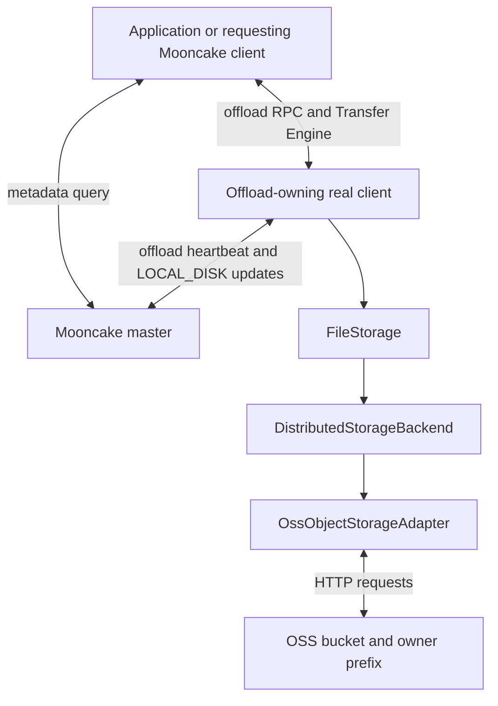

# OSS Offload

## Overview

Object storage services, such as OSS and S3, provide key-based storage.
Mooncake Store integrates object storage through `ObjectStorageAdapter` in the
existing `FileStorage` offload path. As with local SSD and NVMe KV backends,
the master records `LOCAL_DISK` replicas owned by a real client; readers still
access the payload through that owner.

The examples below use the OSS adapter. Other services require a compatible
adapter; changing the endpoint alone does not add S3 support.

For implementation details, see [OSS Backend Design](../design/store/oss-backend.md).

## Prerequisites

- An existing OSS bucket and an endpoint reachable from each offload owner.
  No OSS filesystem mount is required.
- Credentials with permission to PUT, GET, HEAD, LIST, and DELETE within the
  chosen namespace. STS credentials are supported.
- A dedicated object-key prefix for each offload owner.
- An existing absolute, writable, non-symlink directory for
  `MOONCAKE_OFFLOAD_FILE_STORAGE_PATH`, required by common `FileStorage`
  initialization. This does not enable a local SSD cache for OSS.
- libcurl and OpenSSL development libraries and headers.

## Build Support

The build enables the OSS adapter when libcurl and OpenSSL are available.
No OSS SDK or additional OSS-specific build flag is required. Follow the
[build guide](../getting_started/build.md) to build and install Mooncake.

Batch I/O uses `curl_multi_wait`; libcurl 7.66.0 is not required. Upload-buffer
tuning is optional: with headers older than 7.62.0, the library default is used.

## Topology



Only the offload owner needs OSS credentials. The master and requesting clients
do not directly read or write OSS objects.

## Configuration

Set the backend and OSS variables in each offload owner's environment:

```bash
export MOONCAKE_OFFLOAD_STORAGE_BACKEND_DESCRIPTOR=distributed_storage_backend
export MOONCAKE_OFFLOAD_FILE_STORAGE_PATH=/data/file_storage
export MOONCAKE_DISTRIBUTED_FS_TYPE=oss
export MOONCAKE_DISTRIBUTED_ROOT_DIR=/mooncake/my-cluster/owner-1
export MOONCAKE_OSS_ENDPOINT=https://oss-cn-hangzhou.aliyuncs.com
export MOONCAKE_OSS_BUCKET=my-mooncake-bucket
export MOONCAKE_OSS_REGION=cn-hangzhou
# Supply MOONCAKE_OSS_ACCESS_KEY_ID and MOONCAKE_OSS_ACCESS_KEY_SECRET
# through your credential-management mechanism, not checked-in scripts.
```

Replace the example endpoint, bucket, region, and owner prefix for your
deployment. Each `FileStorage` instance selects one backend: OSS does not run
alongside the local-file or NVMe KV backend within that instance.

### Backend and namespace

| Environment variable | Setting for OSS | Description |
|----------------------|-----------------|-------------|
| `MOONCAKE_OFFLOAD_STORAGE_BACKEND_DESCRIPTOR` | `distributed_storage_backend` | Select the backend that hosts the OSS adapter. |
| `MOONCAKE_OFFLOAD_FILE_STORAGE_PATH` | `/data/file_storage` by default | Existing local directory required by common initialization; object payloads go to OSS. |
| `MOONCAKE_DISTRIBUTED_FS_TYPE` | `oss` | Select object-storage mode rather than a filesystem adapter. |
| `MOONCAKE_DISTRIBUTED_ROOT_DIR` | An owner-specific prefix | Use an absolute-style path; the adapter strips leading and trailing slashes. This is not a mount point. |

OSS offload does not require Master DFS configuration and does not require
disabling a separately configured DFS tier. In the offload owner's environment,
`MOONCAKE_DFS_FS_ADAPTER` and `MOONCAKE_DFS_ROOT_DIR` override the corresponding
`MOONCAKE_DISTRIBUTED_*` values because they share a configuration parser.
Leave these overrides unset when using the example above.

### Endpoint and credentials

| Environment variable | Default | Description |
|----------------------|---------|-------------|
| `MOONCAKE_OSS_ENDPOINT` | Required | Endpoint including `http://` or `https://`. Alias: `OSS_ENDPOINT`. |
| `MOONCAKE_OSS_BUCKET` | Required | Existing bucket. Alias: `OSS_BUCKET`. |
| `MOONCAKE_OSS_REGION` | Required | OSS signing region. Alias: `OSS_REGION`. |
| `MOONCAKE_OSS_ACCESS_KEY_ID` | Required unless anonymous | Access key ID. Alias: `OSS_ACCESS_KEY_ID`. |
| `MOONCAKE_OSS_ACCESS_KEY_SECRET` | Required unless anonymous | Access key secret. Alias: `OSS_ACCESS_KEY_SECRET`. |
| `MOONCAKE_OSS_SECURITY_TOKEN` | Empty | Optional STS token. Alias: `OSS_SESSION_TOKEN`. |
| `MOONCAKE_OSS_PATH_STYLE` | `false` | Use `endpoint/bucket/key` instead of virtual-hosted bucket addressing. |
| `MOONCAKE_OSS_ANONYMOUS` | `false` | Disable signing; only for test endpoints or suitably configured public access. |

Primary names take precedence over aliases, including explicitly empty values.
Configuration is read at initialization; changing environment variables does
not reconfigure an active adapter or refresh its credentials.

### Backend concurrency and health check

| Environment variable | Default | Description |
|----------------------|---------|-------------|
| `MOONCAKE_OSS_MAX_CONNECTIONS` | `64` | Maximum admitted requests and total/per-host connections per batch; minimum `1`. Not a process-wide limit. |
| `MOONCAKE_OSS_RECEIVE_BUFFER_SIZE` | `1048576` (1 MiB) | libcurl receive-buffer suggestion for batch requests, clamped to 16 KiB–10 MiB. Single-request GETs keep the library default. |
| `MOONCAKE_OSS_UPLOAD_BUFFER_SIZE` | `1048576` (1 MiB) | Upload-buffer suggestion for `PutV` / `PutBatch`, clamped to 16 KiB–2 MiB. Applied only with libcurl headers 7.62.0 or newer; otherwise the library default is used. |
| `MOONCAKE_DISTRIBUTED_HEALTH_CHECK` | `false` | Write and read back a probe object during initialization, then best-effort delete it. |

Numeric tuning values are decimal integers. Invalid or out-of-range integers
use the default; the bounds above then apply. Buffer sizes are libcurl
suggestions, not TCP socket-buffer sizes or guaranteed throughput settings.

The common offload heartbeat defaults to 10 seconds and is configured through
`MOONCAKE_OFFLOAD_HEARTBEAT_INTERVAL_SECONDS`. Other common client settings are
described in [SSD Offload](ssd/ssd-offload.md).

## Start Mooncake

Start the master with offload enabled:

```bash
mooncake_master --rpc_port=50051 --enable_offload=true
```

After applying the backend settings above, create the required local directory
and start a real client. This example uses a local master and TCP transfers:

```bash
mkdir -p /data/file_storage
export MOONCAKE_MASTER=127.0.0.1:50051
export MOONCAKE_LOCAL_HOSTNAME=127.0.0.1
export MOONCAKE_PROTOCOL=tcp
export MOONCAKE_TE_META_DATA_SERVER=P2PHANDSHAKE
export MOONCAKE_OFFLOAD_ENABLED=true

python -m mooncake.mooncake_store_service
```

Use routable addresses for a multi-node deployment. This launcher example
assumes `MOONCAKE_CONFIG_PATH` is unset; a service configuration file otherwise
takes precedence.

Embedded real-client mode uses the same backend and OSS variables. Pass
`enable_ssd_offload=True` and `ssd_offload_path` to
`MooncakeDistributedStore.setup()` alongside the normal connection and memory
arguments. The [SSD Offload guide](ssd/ssd-offload.md) describes embedded and
standalone real-client deployment modes.

## Troubleshooting

### The adapter cannot initialize

Check build dependencies, required endpoint/region/credential settings, and the
local directory. Check for stale `MOONCAKE_DFS_*` overrides. The optional health
check exercises OSS access; it does not test the complete Store read path.

### Requests fail with authentication or permission errors

Verify the endpoint, signing region, bucket permissions, and STS token lifetime.
The adapter does not refresh credentials automatically.

### An object is in OSS but cannot be read through Store

A bucket object alone is not a readable Store replica. The master must have
the key's metadata and a reachable owner. Keep prefixes owner-specific; a shared
bucket does not make owners interchangeable.

### SSD capacity metrics do not match OSS usage

`MOONCAKE_OFFLOAD_TOTAL_SIZE_LIMIT_BYTES` supplies a configured capacity value
(default: 2 TiB), not a queried OSS bucket capacity. Master usage tracks registered
`LOCAL_DISK` replicas. OSS has no backend quota enforcement or automatic object
GC here, so these metrics are not physical bucket usage or a cloud-cost limit.
