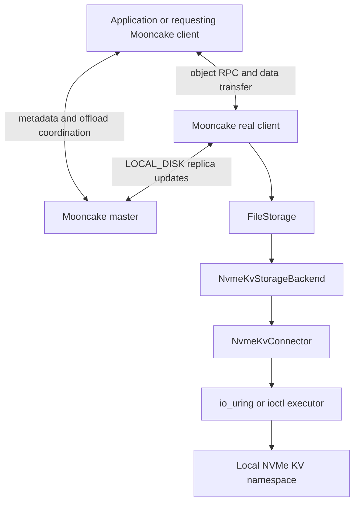

# NVMe KV Local-Disk Backend

## Overview

Mooncake Store can use a node-local NVMe Key-Value namespace as an SSD offload backend. The backend implements `StorageBackendInterface`, so the master tracks offloaded objects as `LOCAL_DISK` replicas and applications continue to use the normal Mooncake Store APIs.

For implementation details, see [NVMe KV Backend Design](../../design/nvme-kv-backend.md).

## Prerequisites

- A Linux host with an NVMe KV namespace exposed as a device node.
- Device support for NVMe KV Store, Retrieve, Delete, and store-if-not-exists semantics.
- Read and write permission on the configured device for the Mooncake real client process.
- An existing writable directory for `MOONCAKE_OFFLOAD_FILE_STORAGE_PATH`, as required by the common `FileStorage` configuration.
- `liburing` headers and library when the io_uring executor is required.

## Build Support

The ioctl executor is built as part of Mooncake Store. NVMe uring command support is enabled automatically when CMake finds `liburing` and Linux headers that expose `nvme_uring_cmd`, `IORING_OP_URING_CMD`, SQE128, and CQE32 support.

During configuration, check for:

```text
io_uring: NVMe uring command support enabled
```

If this support is unavailable, the backend can still use the ioctl executor.

## Topology



The master selects the real client that owns a `LOCAL_DISK` replica. Only that real client opens the local NVMe KV device and issues device commands.

## Configuration

Set the NVMe KV variables in the real client environment. They are not required by the master.

```bash
export MOONCAKE_OFFLOAD_STORAGE_BACKEND_DESCRIPTOR=nvme_kv_storage_backend
export MOONCAKE_OFFLOAD_FILE_STORAGE_PATH=/var/lib/mooncake/nvme-kv
export MOONCAKE_NVME_KV_DEVICE_PATH=/dev/nvme1n1
export MOONCAKE_NVME_KV_TRANSPORT=auto
```

The directory configured by `MOONCAKE_OFFLOAD_FILE_STORAGE_PATH` must already exist and be writable. NVMe KV object values are stored on the device selected by `MOONCAKE_NVME_KV_DEVICE_PATH`.

### Required settings

| Environment variable | Default | Description |
|----------------------|---------|-------------|
| `MOONCAKE_OFFLOAD_STORAGE_BACKEND_DESCRIPTOR` | `bucket_storage_backend` | Set to `nvme_kv_storage_backend`. |
| `MOONCAKE_OFFLOAD_FILE_STORAGE_PATH` | `/data/file_storage` | Existing writable directory required by the common `FileStorage` configuration. |
| `MOONCAKE_NVME_KV_DEVICE_PATH` | None | Namespace block-device path or NVMe generic character-device path. io_uring resolves namespace block paths to the matching `/dev/ng*` device. |

### Transport and command settings

| Environment variable | Default | Description |
|----------------------|---------|-------------|
| `MOONCAKE_NVME_KV_TRANSPORT` | `auto` | `auto`, `io_uring`, or `ioctl`. `auto` tries io_uring first and falls back to ioctl only when io_uring initialization fails. |
| `MOONCAKE_NVME_KV_NSID` | `1` | Namespace ID encoded in NVMe KV commands. |
| `MOONCAKE_NVME_KV_QUEUE_DEPTH` | `256` | io_uring queue depth and executor capability exposed to the backend. |
| `MOONCAKE_NVME_KV_RUNTIME_TRANSFER_LIMIT` | `270336` | Runtime upper bound for one NVMe KV value transfer, in bytes. |
| `MOONCAKE_NVME_KV_PROTOCOL_MAX_VALUE_SIZE` | `524288` | Protocol or device value-size ceiling. |
| `MOONCAKE_NVME_KV_TRANSFER_ALIGNMENT_BYTES` | `4096` | DMA buffer and transfer-length alignment. |
| `MOONCAKE_NVME_KV_VALUE_BLOCK_UNIT_BYTES` | `512` | Unit used to encode the NVMe KV value block count. |

The effective maximum value size is the smaller of the runtime transfer limit and protocol maximum, rounded down to the configured transfer alignment.

### Backend concurrency

| Environment variable | Default | Description |
|----------------------|---------|-------------|
| `MOONCAKE_NVME_KV_IO_CONCURRENCY` | `18` | Total backend I/O concurrency. When unset, Mooncake uses the smaller of 18, queue depth, and the configured maximum. |
| `MOONCAKE_NVME_KV_MAX_IO_CONCURRENCY` | `256` | Upper bound for automatic or explicit backend I/O concurrency. |
| `MOONCAKE_NVME_KV_PREPARE_CONCURRENCY` | `12` | Workers used for checksum and object-layout preparation. |
| `MOONCAKE_NVME_KV_BATCH_SUBMIT_CONCURRENCY` | `6` | Independent chunk submission lanes. |
| `MOONCAKE_NVME_KV_ROOT_SUBMIT_CONCURRENCY` | `1` | Root submission lanes. A chunked object's root is queued only after its chunks complete. |
| `MOONCAKE_NVME_KV_READ_PLAN_BATCH_SIZE` | `8` | Logical objects grouped into one chunk-read planning task. |

Preparation, chunk submission, and root submission use bounded worker pools. Explicit lane counts are capped by the effective I/O concurrency.

## Transport Selection

### `auto` (recommended)

Configure a namespace block-device path such as `/dev/nvme1n1`. When NVMe uring command support is compiled in, Mooncake resolves the matching NVMe generic character device, such as `/dev/ng1n1`, and initializes io_uring. If initialization fails, Mooncake opens the original block-device path with ioctl. The selected transport remains fixed for the connector lifetime.

### `io_uring`

Use this mode to require io_uring. Mooncake accepts either a namespace block-device path with a matching `/dev/ng*` device or the generic character-device path directly. Initialization fails instead of falling back.

### `ioctl`

Use this mode to require Linux NVMe passthrough ioctl. Configure the namespace block-device path. Each command is synchronous within one backend worker, and the backend worker pool supplies parallelism.

## Start Mooncake

Start the master with SSD offload enabled:

```bash
mooncake_master \
    --rpc_port=50051 \
    --enable_offload=true
```

Start a real client on the host that owns the NVMe KV device:

```bash
mooncake_client \
    --master_server_address=127.0.0.1:50051 \
    --host=<machine-ip> \
    --protocol=rdma \
    --device_names=<rdma-device> \
    --port=50052 \
    --global_segment_size="4 GB" \
    --enable_offload=true \
    --metadata_server=P2PHANDSHAKE
```

Embedded real-client mode uses the same environment variables. Set `enable_ssd_offload=True` when calling `MooncakeDistributedStore.setup()`. See [SSD Offload](ssd-offload.md) for the complete client flows.

## Troubleshooting

### io_uring falls back to ioctl

Check that the build enabled NVMe uring command support and that the matching generic character device exists. Set `MOONCAKE_NVME_KV_TRANSPORT=io_uring` to turn fallback into an initialization error while diagnosing the setup.

### Backend initialization reports an empty device path

Set `MOONCAKE_NVME_KV_DEVICE_PATH` in the real client environment.

### Store or Retrieve reports invalid parameters

Verify namespace ID, effective maximum value size, transfer alignment, and value block unit against the device implementation. The runtime transfer limit must be at least one transfer-alignment unit.
