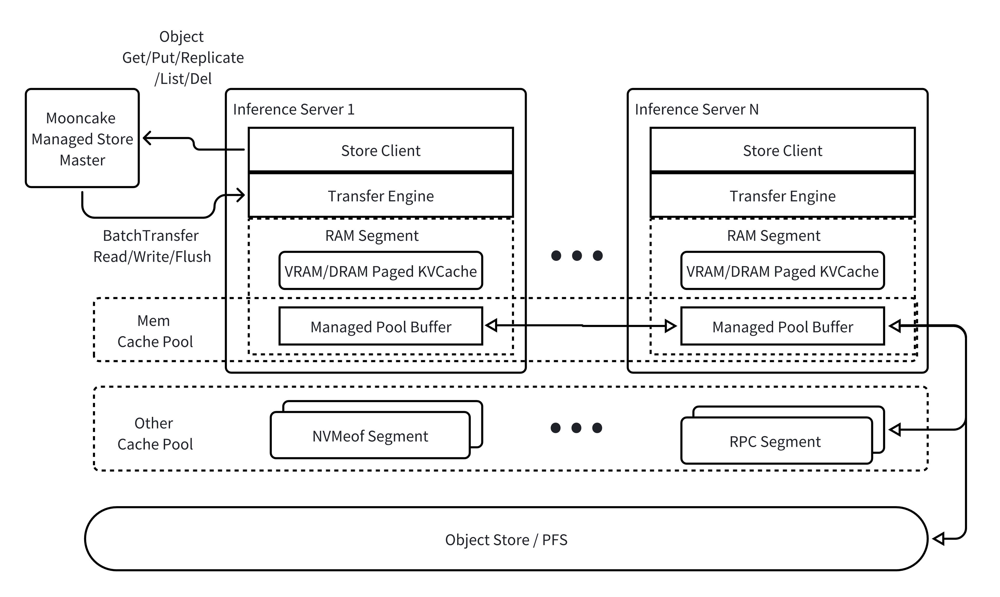

# Mooncake Architecture

Mooncake aims to enhance the inference efficiency of large language models (LLMs), especially in slow object storage environments, by constructing a multi-level caching pool on high-speed interconnected DRAM/SSD resources. Compared to traditional caching systems, Mooncake utilizes (GPUDirect) RDMA technology to transfer data directly from the initiator's DRAM/VRAM to the target's DRAM/VRAM in a zero-copy manner, while maximizing the use of multi-NIC resources on a single machine.

Mooncake:
- provides object-level data storage services
- supports data replication in the cache layer with slice-level placement guarantees and best-effort allocation, with a lightweight design due to not guaranteeing high availability
- ensures the atomicity of object write operations, meaning a `Get` operation will always read one consistent version, but not necessarily the latest one
- supports striping and parallel I/O transfer for larger objects to utilize the aggregated bandwidth of multiple network cards
- supports multiple modes for flushing slow object storage
- supports dynamic addition and removal of cache resources

## Architectural Overview

- Mooncake provides object-level operations, i.e. `Get/Put/List/Del`, and also supports dynamically configuring replication strategies (`Replicate` operations);
- Mooncake supports zero-copy and multi-NIC data transfer over VRAM/DRAM/NVMe SSD. This feature is supported by Transfer Engine, which has been open-sourced;
- **The master node** centrally manages the mappings of objects to VRAM/DRAM/NVM buffers. The master node also drives **managed pool buffer nodes** to achieve data transfer by calling Transfer Engine's APIs;
- **Managed pool buffer nodes** mainly provide DRAM space for storing objects.

> Mooncake has open-sourced the Transfer Engine subsystem, and updates are forthcoming!

## Disaggregated Serving Architecture

Mooncake decomposes multimodal LLM serving into independently scalable stages — Encode–Prefill–Decode (EPD) separation, Prefill/Decode (PD) separation, Attention/Expert (AM) separation for MoE models, and RL disaggregation for post-training — all connected through the shared KVCache pool.

```{mermaid}
flowchart LR
    User(["👤 User<br/>text + image"])

    subgraph EPD["🖼️ EPD Separation · Encode"]
        direction TB
        VE["Vision Encoder"]
        KV[("KV-Cache Pool")]
        VE -- embeddings --> KV
    end

    subgraph PD["⚙️ PD Separation"]
        direction TB
        PF["Prefill<br/>KV → TP / DP"]
        DEC["Decode<br/>autoregressive generation"]
        PF -- KV cache --> DEC
    end

    subgraph AM["🧠 AM Separation · Attention ⇄ Expert"]
        direction TB
        ATT["Attention"]
        EXP["Sparse Expert FFN"]
        ATT <-->|activations| EXP
    end

    subgraph RLD["🔁 RL Disaggregation"]
        direction TB
        RM["RL Reward Model"]
        FSP[("Flow Sample Pool")]
        TR["Training Rollout"]
        MW[("Model Warehouse")]
        RM --> FSP
        FSP <--> TR
        TR -- checkpoints --> MW
    end

    ANS(["📝 Answers / Samples"])
    UW["♻️ Update Weights"]

    User -- prompt --> VE
    KV -- prefix KV --> PF
    DEC <-->|hidden states| AM
    DEC -- tokens --> ANS
    DEC -- rollouts --> TR
    ANS -- rewards --> UW
    MW -- new weights --> UW
    UW -.->|weight sync| DEC

    classDef enc fill:#DBEAFE,stroke:#3B82F6,stroke-width:1px,color:#1E3A8A;
    classDef pd fill:#DCFCE7,stroke:#22C55E,stroke-width:1px,color:#14532D;
    classDef am fill:#FFEDD5,stroke:#F97316,stroke-width:1px,color:#7C2D12;
    classDef rl fill:#EDE9FE,stroke:#8B5CF6,stroke-width:1px,color:#4C1D95;
    classDef io fill:#F1F5F9,stroke:#64748B,stroke-width:1px,color:#0F172A;

    class VE,KV enc;
    class PF,DEC pd;
    class ATT,EXP am;
    class RM,FSP,TR,MW rl;
    class User,ANS,UW io;
```
