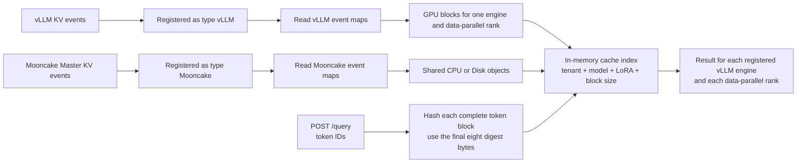

# Mooncake Conductor Architecture

[中文](../../zh/design/conductor/conductor-architecture-design.md)

Mooncake Conductor reads live key-value (KV) cache events and keeps an
in-memory cache index for routing decisions. This page explains how vLLM GPU
information and Mooncake CPU or Disk information enter that index, how query
tokens become lookup values, and how Low-Rank Adaptation (LoRA) adapters keep
cache entries separate. It describes the current C++ service, including the
limits that affect what a cache hit means.

## One event-to-result flow



The registered `type` decides how Conductor reads a message. Topic text and
payload shape do not change that choice. Within one source, valid events are
applied in their received order.

A vLLM event updates GPU information for the registered engine and
data-parallel (DP) rank. A Mooncake event updates shared CPU or Disk
information. A query hashes its complete token blocks, looks up each block in
order, and stops counting a particular result at that result's first missing
block.

## What can share cache

Four fields decide whether registrations, events, and queries use the same
cache information:

| Field | Why it must match |
|---|---|
| `tenant_id` | Keeps one tenant's cache information separate from another tenant. |
| Model name | Prevents blocks from different models from being mixed. Registrations use `modelname`; queries use `model`; views use `model_name`. |
| `lora_name` | Separates the base model from each LoRA adapter. An empty string means the base model. |
| `block_size` | Sets both the number of tokens in one block and the step used when hashing a query. It must be positive. |

An engine's `instance_id` and DP rank do not create a separate sharing group.
They identify which GPU records and result rows belong to that engine. Request
`cache_salt` also does not change the four fields; it changes the block hash
chain for that query instead.

Each four-field group has one registered `hash_profile`. A later registration
for the same fields must use the identical strategy, algorithm, exact
`python_hash_seed` text, derived root digest, and lookup rule. Only cache group
`0`, or no cache group, is currently supported.

## vLLM GPU and Mooncake CPU/Disk information

| Registered source | Accepted cache location | What one stored block means | Where it appears in `/query` |
|---|---|---|---|
| `vLLM` | GPU, case-insensitive | This exact registered endpoint, engine, and DP rank reported the block. | Under that engine's `instances` row and DP rank. |
| `Mooncake` | CPU or Disk, case-insensitive | A Mooncake object provides the block to every registered engine with the same four cache-sharing fields. | As shared `cpu` or `disk` counts under each compatible vLLM engine. |

A Mooncake registration is a subscription name, not an inference engine. It
does not create another row in `/query`. Conductor can accept the subscription
before a compatible vLLM engine is registered, but Mooncake events cannot add
shared cache information until that four-field group exists. This is why the
[usage guide](./usage.md) registers engines before the shared pool.

## How token blocks become lookup values

Conductor hashes one complete token block at a time. The full 32-byte digest
from one block becomes the parent input for the next block; Conductor does not
chain from the shorter 64-bit lookup value.

Before hashing blocks, Conductor resolves the supported profile as follows:

```text
seed_text   = exact `random` or ASCII decimal text in 0..4294967295
seed_cbor   = canonical-CBOR text(seed_text)
root_digest = lowercase_hex(SHA256(seed_cbor))
```

The source profile supplies `python_hash_seed`, not `root_digest`. Its exact
text must equal the `PYTHONHASHSEED` environment value on every compatible
vLLM process. Conductor does not trim or normalize it, read its own process
environment, or infer it from KV events. Thus `"0"` and `"00"` produce
different roots, while numeric JSON `0` is invalid. The explicit text
`"random"` is supported; an unset `PYTHONHASHSEED` is not, because vLLM then
uses random root bytes that registration cannot reproduce.

vLLM `--seed` controls model and sampling random-number generators and is
unrelated to prefix-cache hash identity. LoRA affects every block, a non-empty
request `cache_salt` affects the first block and all its descendants, and
Mooncake `additional_salt` remains diagnostic. `PYTHONHASHSEED` is compatibility
metadata, not a tenant-isolation or security key.

For the currently supported resolved profile, each block is processed as
follows:

1. The first parent is the root derived from `python_hash_seed`. Every later
   parent is the complete SHA-256 digest of the previous block.
2. Conductor encodes a three-item canonical Concise Binary Object
   Representation (CBOR) array: the parent digest as bytes, the block's signed
   token integer array, and either `null` or an ordered array of extra strings.
3. A non-empty `lora_name` is the first extra string on every block. A
   non-empty query `cache_salt` follows it on the first block only. Because the
   first digest changes, the salt also changes every later digest in the chain.
4. Conductor calculates SHA-256 over those canonical CBOR bytes.
5. It reads the final eight digest bytes as one unsigned, big-endian 64-bit
   integer and uses that integer to look up the block.

A trailing group with fewer tokens than `block_size` is not hashed and does
not count as a cache hit. Mooncake event `additional_salt` is decoded for
diagnostics but does not currently enter the four cache-sharing fields or this
lookup calculation.

### Labelled golden vector

The repository fixture records **vLLM 0.22.0 `hash_block_tokens` semantics
with cbor2 6.1.1 and `canonical=True`**. Its example resolved profile records
`python_hash_seed` `"0"` and uses:

```json
{
  "strategy": "vllm_v1",
  "algorithm": "sha256_cbor",
  "python_hash_seed": "0",
  "root_digest": "4e1195df020de59e0d65a33a4279f1183e7ae4e5d980e309f8b55adff2e61c3e",
  "index_projection": "low64_be"
}
```

Canonical CBOR encodes the text string `"0"` as hexadecimal `6130`; this is
not the encoding of integer zero. SHA-256 of those two bytes produces the
shown root digest, which becomes the first block's parent.

For `block_size` `4`, empty `lora_name`, no `cache_salt`, and token IDs
`[1, 2, 3, 4, 5, 6, 7, 8]`, the fixture gives:

| Block | Full SHA-256 digest | Final eight bytes | Unsigned decimal lookup value |
|---|---|---|---|
| 1 | `c9d58ba695280d69b243e1e0df813136ca9196b286fb1a021e0b2e028ef071cb` | `1e0b2e028ef071cb` | `2164874634404590027` |
| 2 | `24125b23e68883b5c2141db2959d48433fe6bde2f26bd914efad121d154ab2d6` | `efad121d154ab2d6` | `17270480062156288726` |

This seed/root pair is a test vector for the producer and library versions
named above, not a default for every deployment. Registrations provide the
exact seed assertion; Conductor derives and reports the root as a diagnostic.

## What query fields mean

All counts are token counts, not block counts. Conductor returns one result for
each selected registered vLLM engine.

| Result field | Meaning |
|---|---|
| `dp` | For each registered DP rank, the consecutive GPU prefix held by that exact engine and rank. Rank keys are decimal JSON strings. |
| `gpu` | The largest `dp` value for the engine. Blocks from different ranks are never joined to make a longer GPU prefix. |
| `cpu` | The consecutive prefix, starting at the first query block, that has at least one compatible shared CPU object. |
| `disk` | The consecutive prefix, starting at the first query block, that has at least one compatible shared Disk object. |
| `longest_matched` | The largest consecutive prefix one DP rank can serve using that rank's GPU blocks plus compatible shared CPU or Disk blocks. A block present in several locations is counted once. |

For example, suppose one rank has the first two blocks on GPU, only the third
block is present in shared CPU cache, and `block_size` is `16`. That rank can
report `longest_matched: 48` and `gpu: 32`, while the independent `cpu` prefix
is still `0` because the first block is not in CPU cache. If the first and
second GPU blocks belong to different DP ranks, Conductor does not combine
those ranks into a two-block hit.

## Cleanup

Cleanup removes only information contributed by the affected source:

- A vLLM remove or clear affects GPU records for the reporting endpoint,
  engine, and DP rank. It preserves other ranks, other engines, and shared
  cache information.
- Mooncake records keep the reporting endpoint, backend, tenant, object key,
  full connector hash, and CPU or Disk location. Removing one object therefore
  preserves another object even when their final eight hash bytes match.
- A Mooncake clear affects shared objects from the reporting endpoint, backend,
  and tenant. It preserves vLLM GPU records and other Mooncake sources.
- Unregistering stops the selected `(instance_id, tenant_id, dp_rank)`
  subscription before removing that endpoint's contributions. A vLLM
  unregister also removes that rank from query results; a Mooncake unregister
  removes all saved object bindings from that endpoint.

The [Conductor subscriber guide](../kv-event/subscriber-guide.md) owns the
detailed event validation and cleanup rules.

## Current limits

- Conductor sees live events after it connects. The current Mooncake publisher
  does not send a startup list of objects that were cached earlier.
- A jump in transport sequence numbers produces a warning and leaves existing
  cache records in place. After reconnect, Conductor asks for missed events
  only when `replay_endpoint` is configured and a previous sequence is known;
  that request does not guarantee recovery. The current Mooncake publisher has
  no replay service.
- Conductor processes Mooncake events in received batch order. It does not
  automatically ignore an event merely because its `event_id` repeats.
- vLLM contributes only GPU information. Mooncake contributes only CPU or Disk
  information. Other cache locations are ignored with a warning.
- Conductor reads layer and parallel-rank metadata from connector keys, but it
  does not check whether all layers or all tensor-parallel (TP), prefill
  context-parallel (PCP), decode context-parallel (DCP), or pipeline-parallel
  (PP) parts are present before reporting shared availability.

## Maintainer source note

The main implementation paths for this page are
`mooncake-conductor/src/prefixindex/hash_strategy.cpp`,
`mooncake-conductor/src/prefixindex/prefix_indexer.cpp`,
`mooncake-conductor/src/kvevent/event_handler.cpp`, and
`mooncake-conductor/src/kvevent/event_manager.cpp`. The exact hash example is
from `mooncake-conductor/tests/fixtures/hash_golden_vectors.json`; query result
behavior is covered by `mooncake-conductor/tests/prefix_indexer_test.cpp` and
`mooncake-conductor/tests/event_manager_test.cpp`.
