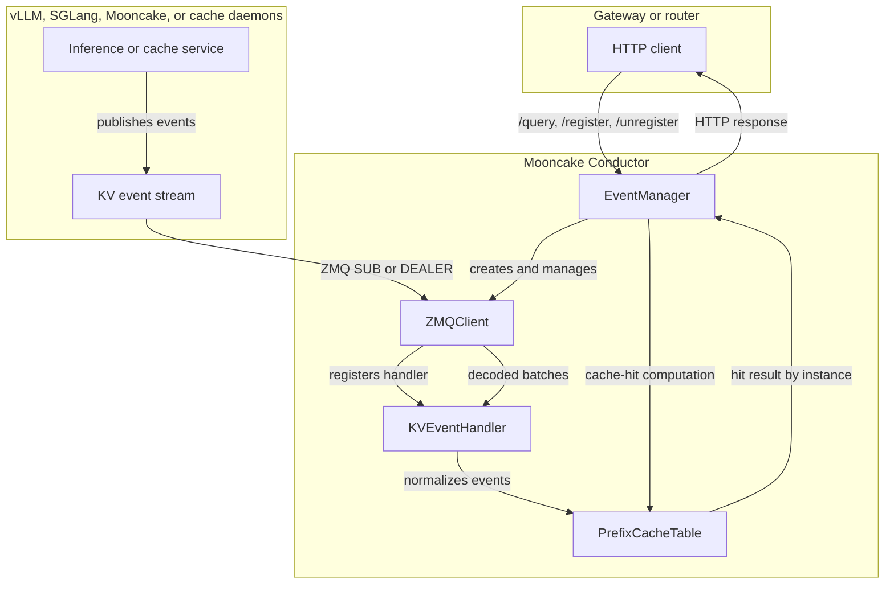

# Mooncake Conductor Architecture

## Overview

Mooncake Conductor is the kv-cache indexer used by cache-aware routers. It
subscribes to KV cache events from inference engines or storage backends,
normalizes those events, maintains a global prefix cache table, and exposes
HTTP APIs for dynamic service registration and cache-hit queries.

The design goal is to let routers answer a simple scheduling question:
for this request prefix, which registered instance has the best reusable KV
cache locality, and on which cache tiers is that prefix available?

## Architecture



## Components

| Component | Responsibility |
|---|---|
| `EventManager` | Owns the Conductor lifecycle, HTTP server, dynamic registration, active service map, and tenant-to-instance map. |
| `ZMQClient` | Connects to publisher endpoints, consumes event frames, decodes event batches, tracks sequence numbers, and requests replay after reconnects. |
| `KVEventHandler` | Adapts decoded engine events into Conductor store/remove events enriched with registration metadata. |
| `PrefixCacheTable` | Maintains model-context-specific prefix maps, engine-hash to conductor-hash mappings, medium metadata, DP-rank metadata, and query-time hit computation. |


## Data model

The prefix index is scoped by `ModelContext`:

```text
(tenant_id, model_name, lora_name, block_size, additional_salt, instance_id)
```

Within each context, Conductor stores:

- a mapping from engine-provided block hash to Conductor prefix hash;
- a prefix hash map that records replica count, medium set, DP-rank set, and
  per-instance access metadata;
- a DP-rank set used to report rank-level hit information.

The current implementation computes complete-block prefix hashes from token IDs
and ignores trailing partial blocks during `/query`.

## Event flow

1. A service is registered statically from `conductor_config.json` or
   dynamically through `POST /register`.
2. `EventManager` creates one `ZMQClient` per `(instance_id, tenant_id,
   dp_rank)` service key.
3. `ZMQClient` subscribes to the publisher endpoint and consumes frames in the
   form `[topic, sequence, payload]`.
4. The payload is decoded into a batch of engine events. Today, the implemented
   parser supports vLLM `BlockStored` and `BlockRemoved` msgpack events.
5. `KVEventHandler` enriches events with registration metadata such as model,
   LoRA, tenant, instance, block size, and additional salt.
6. `PrefixCacheTable` updates the prefix map for stored or removed blocks.
7. If a reconnect detects missed sequence numbers, the `replay endpoint` can be
   used to request missed events.

## Query flow

1. A router obtains prompt token IDs, usually from an engine tokenizer endpoint.
2. The router calls `POST /query` with `model`, `token_ids`, `block_size`, and
   optional `tenant_id`, `instance_id`, `lora_name`, and `cache_salt`.
3. Conductor computes complete-block prefix hashes for the request.
4. The prefix table is scanned in order. The first miss terminates the scan so
   prefix continuity is preserved.
5. Conductor returns per-instance `longest_matched`, medium hit counts, and
   DP-rank hit counts.
6. The router selects the best target instance and forwards the request.

## Dynamic registration

Conductor supports runtime registration so routers or control planes can add
and remove KV event publishers without restarting the process.

```json
{
  "endpoint": "tcp://127.0.0.1:5557",
  "replay_endpoint": "tcp://127.0.0.1:5558",
  "type": "vLLM",
  "modelname": "qwen2.5",
  "lora_name": "",
  "tenant_id": "default",
  "instance_id": "vllm-prefill-node1",
  "block_size": 128,
  "dp_rank": 0,
  "additionalsalt": ""
}
```

Static configuration uses the same fields under `kvevent_instance`:

```json
{
  "http_server_port": 13333,
  "kvevent_instance": {
    "vllm-prefill-node1": {
      "endpoint": "tcp://127.0.0.1:5557",
      "replay_endpoint": "tcp://127.0.0.1:5558",
      "type": "vLLM",
      "modelname": "qwen2.5",
      "lora_name": "",
      "tenant_id": "default",
      "instance_id": "vllm-prefill-node1",
      "block_size": 128,
      "dp_rank": 0,
      "additionalsalt": ""
    }
  }
}
```

## Environment variables

| Variable | Default | Description |
|---|---|---|
| `CONDUCTOR_LOG_LEVEL` | `INFO` | Log level: `DEBUG`, `INFO`, `WARN`, or `ERROR`. |
| `CONDUCTOR_CONFIG_PATH` | `~/.mooncake/conductor_config.json` | Path to the static configuration file. |
| `CONDUCTOR_SEED` | random | Legacy seed option for hash computation experiments. |

## Build and run

```bash
cd mooncake-conductor/conductor-ctrl
go mod tidy
go build -o mooncake_conductor .
```

```bash
export CONDUCTOR_CONFIG_PATH=../example/conductor_config.json
export CONDUCTOR_LOG_LEVEL=INFO
./mooncake_conductor
```

## Project structure

```text
mooncake-conductor/
+-- conductor-ctrl/
|   +-- common/        # shared types, helpers, and sync map
|   +-- kvevent/       # EventManager and KVEventHandler
|   +-- prefixindex/   # prefix cache table and hit computation
|   +-- zmq/           # ZMQ client, event decoding, event types
|   +-- main.go        # process entry point
+-- example/           # demo config and cache-aware proxy
+-- build.sh
+-- CMakeLists.txt
```

See [Indexer API](./indexer-api-design.md) for the HTTP API and KV Events wire
format.
