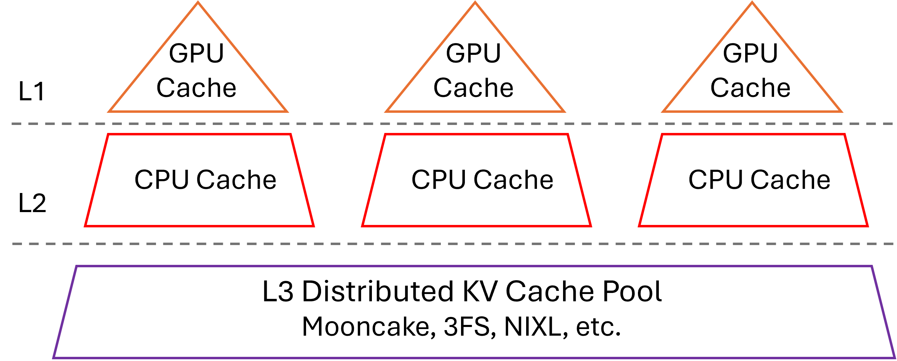
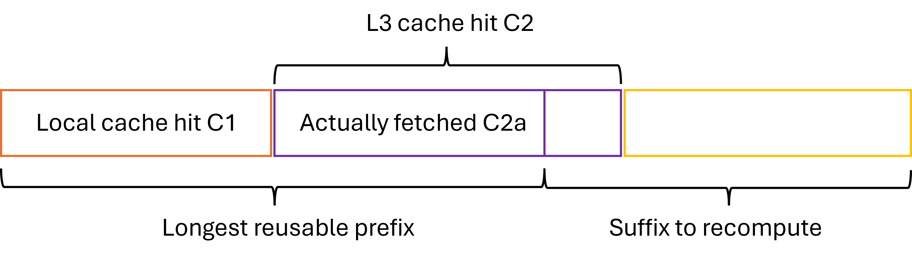

# Mooncake x SGLang HiCache System Design

With the rapid development of tasks such as Agentic Coding, the length of request contexts continues to grow. Increasing the capacity of the KV Cache to improve its hit rate has become increasingly important for enhancing throughput and reducing TTFT. In this context, SGLang introduces **HiCache**, which extends the original RadixAttention (previously limited to GPU memory) by adding hierarchical caching support and integration with distributed storage backends such as Mooncake.

Inspired by the classic three-level cache design of modern CPUs, HiCache organizes GPU memory as L1, host memory as L2, and distributed storage as L3. This hierarchy enables HiCache to fully exploit the "idle" storage space of GPUs and CPUs, while integrating distributed cache systemsfor global KV cache storage and scheduling. As a result, HiCache significantly expands KV cache capacity while maintaining strong read performance—especially in workloads such as multi-QA and long-context inference, where KV cache reuse is frequent. For detailed benchmark results, see [this blog](https://kvcache-ai.github.io/Mooncake/performance/sglang-hicache-benchmark-results-v1.html).

Whiele HiCache supports multiple L3 backends, this document focuses primarily on the **Mooncake** backend.

## Overall Architecture

In many modern CPU architectures, the small but fast L1 and L2 caches are private to each core, enabling rapid access to the hottest data, while the larger L3 cache is shared across all cores to significantly reduce redundancy within the cache. Similarly, in HiCache, the L1 and L2 KV caches are private to each inference instance, whereas the L3 KV cache is shared among all inference instances within the cluster.



## HiRadixTree: Metadata Organization in HiCache

For KV cache data organization, HiCache builds upon the RadixTree structure introduced in RadixAttention and proposes HiRadixTree. In RadixAttention, each node of the RadixTree corresponds to the KV cache of a consecutive span of tokens in GPU memory. A path from the root to a leaf node represents the prefix of a request, and shared prefixes across multiple requests can reuse the same nodes, thereby avoiding redundant storage.

HiRadixTree extends this idea: each node corresponds to the KV cache of a span of consecutive tokens and records where that KV cache is stored—whether in local GPU memory, CPU memory, L3 storage, or multiple of these tiers. If stored locally, HiRadixTree maintains precise metadata, including the exact storage address. However, to reduce overhead, HiRadixTree does not store or continuously synchronize metadata for L3 KV cache. Instead, when accessing L3 data, it queries the backend in real time to retrieve the necessary metadata, such as whether the data exists and on which server and location it resides.

## Overall Workflow

The workflow of HiCache mainly involves three key operations: **local match**, **prefetch** and **write-back**. When the system receives a new request, it first searches the local L1 and L2 caches for matching KV caches. For parts not found locally, it attempts to prefetch from L3. After prefetching, all required KV caches are loaded into the GPU for computation. Once the prefill computation is complete, the system considers storing the newly generated data into L2 or L3.


## Local Match

Local matching is the first step in HiCache's workflow, where incoming request tokens are matched against the HiRadixTree to locate cached KV data in local memory tiers (L1 GPU memory and L2 host memory).

The matching algorithm traverses the HiRadixTree from the root node, following child nodes that match the token sequence prefix. At each node, the incoming token sequence is compared with the node’s stored token sequence. When `page_size > 1`, matching is performed at the page granularity to optimize memory access patterns. If a match terminates within a node’s stored sequence, the node is automatically split to create an exact boundary, improving the efficiency of future matches.

The algorithm returns a continuous prefix of the request, with the first part residing in L1 and the latter part in L2.

Since the process only requires traversing the local HiRadixTree and does not involve any actual data copying, local matching is extremely fast.

## Prefetch from L3

Data prefetching is one of HiCache’s core optimization techniques, designed to proactively load KV caches from L3 storage into local L2 memory, thereby reducing access latency during subsequent operations.

**Prefetch Trigger Conditions**: After local matching, for the parts not found in L1 or L2, the system queries L3 to retrieve metadata for the next continuous matching KV caches. If the length of hit cache in L3 exceeds a threshold (default: 256 tokens, configurable), a prefetch operation is triggered.



**Prefix Awareness**: The algorithm ensures that the retrieved KV cache always forms a complete and continuous prefix, while the portion that requires recomputation is a complete and continuous suffix, as illustrated above. This design simplifies the implementation of the computation phase.

**Multithreading and Asynchronous Computation:** Data prefetching is implemented using multithreading and asynchronous computation to improve efficiency. HiCache employs a two-thread pipeline that continuously processes prefetch requests. The `prefetch_thread_func` thread continuously queries the L3 backend to determine the hit prefix length for each request. Meanwhile, the `prefetch_io_aux_func` thread continuously submits requests whose hit rates exceed the threshold to the L3 backend for execution. For the submitted requests, **Mooncake** uses **RDMA** to read data in parallel from multiple remote storage nodes. This design enables efficient and high-speed data prefetching.

**Prefetch Strategies**: Prefetching operations face a fundamental challenge of timing uncertainty: how long should we wait for the prefetch operation before proactively terminating it? The completion time of a prefetch depends on various factors, such as network conditions, storage backend load, and data size (determined by the model, configuration, and number of tokens to prefetch, etc.), making it difficult to predict accurately. If the waiting time is too long, prefill computation will be significantly delayed, hurting overall inference performance. Conversely, if the waiting time is too short, the prefetch operation may be terminated before completion, preventing the use of prefetched results and wasting computation and I/O overhead. To address these issues, HiCache provides three distinct prefetch termination strategies, enabling flexible adaptation to different runtime scenarios:
- **best_effort**: Terminates immediately when GPU can execute prefill computation, with no waiting time, suitable for scenarios extremely sensitive to latency.
- **wait_complete**: Must wait for all prefetch operations to complete, suitable for scenarios requiring high cache hit rates.
- **timeout**: Terminates after specified time or when complete, balancing latency and cache hit rate needs.

After prefetching stops, the data already fetched (`C2a` in the figure) is used together with the local data (`C1` in the figure) for the prefill computation.

We find that in real-world deployments, the `timeout` strategy tends to be more practical. On one hand, prefetch latency is inherently unpredictable; on the other hand, the prefetch deadline is constrained by the Service Level Objective (SLO). Therefore, it offers significant practical value to allow users to flexibly configure prefetch timeout parameters and to dynamically determine timeout values based on the number of tokens to be prefetched for each request. To support fine-grained control over prefetch timeout conditions, HiCache introduces two configuration parameters:

* `prefetch_timeout_base`: the base timeout, representing overhead unrelated to the number of tokens (e.g., scheduling and synchronization).
* `prefetch_timeout_per_ki_token`: the incremental timeout per thousand tokens.

The timeout is computed as:

```
timeout = prefetch_timeout_base + prefetch_timeout_per_ki_token * num_token_to_fetch / 1024
```

This dynamic timeout mechanism allows the system to intelligently adjust the prefetch time window based on the actual data transfer volume, maximizing prefetch efficiency while ensuring compliance with SLO requirements.

### Data Write-back

The write-back mechanism is responsible for moving frequently accessed KV caches from L1 to L2 and L3, enabling larger and longer-term storage as well as cache sharing across instances.

**Configurable Write-back Policies**: Write-back operations are carried out at the granularity of HiRadixTree node. The system triggers the write-back once the KV Cache in a node meets the specified conditions. HiCache supports three write-back strategies:

* **write_through**: Every access is immediately written back to the next level. When bandwidth is sufficient, this strategy provides the strongest caching benefit.
* **write_through_selective**: Data is written back only after the access frequency exceeds a threshold. This strategy backs up only hot data, reducing I/O overhead.
* **write_back**: Data is written back to the next level only when it is evicted from the upper level. This strategy alleviates storage pressure and is suitable for scenarios where storage capacity is limited but memory utilization must be maximized.

**Asynchronous and Parallel Write-back:** Data write-back is performed asynchronously and in parallel to improve efficiency.

When data is written back from L1 to L2, the `write_backup` function is invoked for asynchronous data transfer, preventing blocking of the main scheduling flow.

When data is written back from L2 to L3 storage, the system calls the `write_backup_storage` function, placing the write-back operation into the `backup_queue`. A dedicated `backup_thread_func` thread continuously retrieves write-back tasks from the queue and invokes the L3 backend to perform the data transfer. Similar to prefetching, **Mooncake** can complete these transfers in parallel and at high speed via **RDMA**.

**Cross-instance Sharing**: When data is written back from L2 to Mooncake, only data not already present in Mooncake is transferred. KV caches stored in Mooncake can then be shared across all SGLang instances in the cluster, significantly improving cache hit rates within the same memory budget.

### Multi-Rank Synchronization

During multi-GPU parallel computation, such as tensor parallelism (TP), HiCache must ensure consistent states across different ranks. Therefore, critical computation steps require the use of `all_reduce` for state synchronization.

For example, during prefetching, `all_reduce(op=min)` is used to ensure that all ranks obtain the same number of L3 hits, preventing inconsistent judgments about whether the prefetch threshold has been reached. Similarly, after prefetching completes or terminates, `all_reduce(op=min)` is again required to guarantee consensus among ranks on the prefix length of the successfully retrieved KV cache.

### Data Transfer Optimization

**Zero-Copy Data Transfers**: Both prefetching and write-back involve substantial data movement. Minimizing the number of data copies can significantly improve system performance:
- HiCache supports passing memory addresses and sizes directly when transferring data from L2 memory to an L3 backend.
- **Mooncake** provides zero-copy read and write interfaces, enabling fully zero-copy data transfers between L2 memory and RDMA. During prefetching, data can be directly read from remote memory into the target L2 memory via RDMA. During write-back, data in L2 can be directly written to the remote target address through RDMA, achieving a completely zero-copy data transfer process.

**“Batch-Oriented” Data Organization**: The granularity of data reads and writes has a major impact on performance. To address this, HiCache L3 stores and transfers KV cache data at the granularity of **pages** and supports different data layouts beyond the existing `layer first` scheme, including `page first` and `page first direct`. Under the `page first` and `page first direct` layouts, all KV cache data belonging to the same page is placed in contiguous memory, allowing it to be passed as a single object to L3 using zero-copy transfers.


However, because GPU KV computation is naturally performed layer by layer, the GPU inherently operates in a `layer first` layout. When transferring `page first` data from L2 to the GPU, data must be transferred at the granularity of one token per layer. The `page first direct` layout mitigates this issue by grouping together all tokens of a given layer within a page, allowing transfers from L2 to GPU to be aggregated at the page-layer level.

**CPU-to-GPU Transfer Optimizations**: In HiCache, moving data from CPU memory to GPU is as performance-critical as prefetching data from L3 to L2. HiCache employs several optimizations for this process:

* **Compute-Transfer Overlap**: During the prefill phase, when transferring data from CPU to GPU, HiCache overlaps layers by concurrently loading the KV cache of layer N+1 while computing layer N. This effectively hides data transfer latency.
* **GPU-assisted I/O Kernels**: On top of `cudaMemcpyAsync`, HiCache implements a set of GPU-assisted I/O kernels specifically optimized for KV cache transfers between CPU and GPU. Compared to the baseline approach, these kernels achieve up to 3x higher transfer speed.

**Write-back Optimization for MLA**: For MHA (Multi-Head Attention) models under multi-TP, each rank holds `1/tp_size` of a token’s KV data. In contrast, for MLA (Multi-Layer Attention) models, all ranks hold the complete and identical KV data for each token. HiCache includes a dedicated optimization for MLA: only one rank initiates the write-back operation, ensuring that data is not redundantly stored across ranks.

### Integration with PD-Disaggregation Deployment Mode

SGLang supports a PD (Prefill-Decode) disaggregation deployment mode through the **Mooncake TransferEngine** (for details, see [this document](https://docs.sglang.ai/advanced_features/pd_disaggregation.html)). 

In the PD-disaggregation deployment mode, HiCache can be enabled on the Prefill nodes to optimize prefill performance. With the hierarchical caching mechanism provided by **HiCache + Mooncake Store**, prefill nodes can handle long-context and multi-turn dialogue scenarios more efficiently, significantly improving performance during the prefill phase. HiCache can also be enabled on the decode nodes to write computation results back to L3.

**Deploy one Mooncake cluster and fully experience all the above optimizations!**