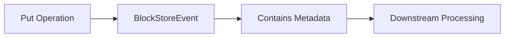
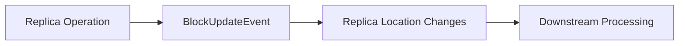
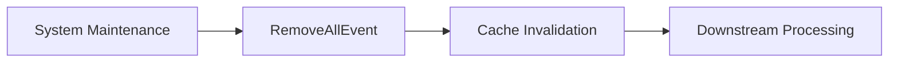

# KV Event Subscriber Guide

This document provides guidance for developers who wish to subscribe to KV cache events in the Mooncake system. It focuses on the message schema and deserialization methods needed to properly handle events sent by the event publisher.

---

## Event Types & Meanings

Before diving into the technical schema, it's important to understand what each event type represents and when they are triggered in the Mooncake system.

### Event Overview Table

| Event Type | Trigger Condition | Purpose | Key Characteristics |
|------------|-------------------|---------|---------------------|
| **BlockStoreEvent** | First storage of KV cache block | Initial block creation with metadata | ✅ contains `StoreEventInfo` metadata<br>✅ Represents initial creation<br>✅ Generated during `Put` operations |
| **BlockUpdateEvent** | Replica management operations (copy/remove/migrate) | Track replica distribution changes | ❌ No `StoreEventInfo` metadata<br>✅ Focuses on replica locations<br>✅ Internal system operations |
| **RemoveAllEvent** | System-wide cache clearance | Signal cache invalidation | ❌ No additional fields<br>✅ System-wide invalidation<br>✅ Maintenance operations |

### Event Type Quick Reference

#### 🏗️ BlockStoreEvent - Storage Event



#### 🔄 BlockUpdateEvent - Replica Event  



#### 🧹 RemoveAllEvent - Clearance Event



### Field Definitions at a Glance

#### Core Event Fields
| Field | Type | Required | Description |
|-------|------|----------|-------------|
| `mooncake_key` | `std::string` | ✅ All events | Unique identifier for cached object |
| `replicas` | Nested array | ✅ BlockStore/Update | Replica locations: `[type, location]` |

#### `StoreEventInfo` Fields (`BlockStoreEvent` only)

When processing `BlockStoreEvent`events, pay special attention to the StoreEventInfo fields which are appended to the event. **These fields have specific default values that indicate when they are not set**:

| Field | Type | Default | Description |
|-------|------|---------|-------------|
| `model_name` | `std::string` | `""` | Model identifier |
| `block_size` | `uint32_t` | `0` | Block size in bytes |
| `block_hash` | `std::string` | `""` | Current block hash |
| `parent_block_hash` | `std::string` | `""` | Parent block hash |
| `token_ids` | `std::vector<uint32_t>` | `[]` | Token ID sequence |

---

## Event Message Schema

The KV event system uses ZeroMQ (ZMQ) for message transport and MessagePack for serialization. Events are sent as multipart ZMQ messages containing three components:

### ZMQ Message Structure

Each event message consists of 3 ZMQ message parts:

```plainText
1. topic Part: Contains the topic string (default: "mooncake")
2. Sequence Number Part: 8-byte big-endian unsigned integer representing the sequence number
3. Payload Part: MessagePack-serialized event batch data
```

### Event Batch Schema

The payload part contains a serialized `EventBatch`object with the following structure:

```typescript
[
    ts, // First element: Timestamp (double) - seconds since UNIX epoch
    [              // Second element: Event list (array)
        [event1_data], // Event 1
        [event2_data], // Event 2
        ... // Additional events
    ]
]
```

Each event in the batch is a serialized event object that begins with an event type identifier string followed by its specific data fields.

### Event Types Schema

There are three main event types supported by the system:

#### Schema

```typescript
// Event triggered on the first storage occurrence - contains 8 fields
BlockStoreEvent {
    "BlockStoreEvent",           // Event type identifier, string type
    std::string mooncake_key,    // Mooncake key
    [                            // Replica location list (nested arrays)
        ["memory", "transport_endpoint"],     // Memory replica
        ["disk", "file_path"],                // Disk replica  
        ["local_disk", "transport_endpoint"]  // Local disk replica
    ],
    std::string model_name,         // Model name
    uint32_t block_size,            // Block size
    std::string block_hash,         // Current block hash
    std::string parent_block_hash,  // Parent block hash
    std::vector<uint32_t> token_ids // Token ID sequence
}

// Contains all internal Mooncake system operations - contains 3 fields
BlockUpdateEvent {
    "BlockUpdateEvent",           // Event type identifier
    std::string mooncake_key,
    [                             // Replica location list
        ["memory", "transport_endpoint"],
        ["disk", "file_path"],
        ["local_disk", "transport_endpoint"]
    ]
}

// Event for clearing all KV Cache in Mooncake - contains 1 field
RemoveAllEvent {
    "RemoveAllEvent"             // Event type identifier
}
```

#### Example

```typescript
// BlockStoreEvent
[
    "BlockStoreEvent", // Event type identifier
    "key_12345",       // mooncake key
    [                  // Replica location list (nested arrays)
        ["memory", "tcp://192.168.1.10:6000"],    // Memory type location
        ["disk", "/data/blocks/block_12345.bin"], // Disk type location
        ["local_disk", "tcp://192.168.1.10:7000"]     // Local disk type location
    ],
    "llama2-7b",       // Model name
    512,               // block size
    "0x41234125",      // Current block hash
    "0x51512342",      // Parent block hash
    [1,2,3,4,5]        // Token id list
]

// BlockUpdateEvent
[
    "BlockUpdateEvent", // Event type identifier
    "key_12345",       // mooncake key
    [                  // Replica location list (nested arrays)
        ["memory", "tcp://192.168.1.10:6000"],    // Memory type location
    ],
]

// RemoveAllEvent
[
    "RemoveAllEvent"   // Event type identifier
]
```

---

## Deserialization Steps

To properly deserialize events from the KV event system, follow these steps:

1. **Receive the multipart message**: Use `zmq::recv_multipart`or equivalent to receive all 3 parts of the message.
2. **Extract the topic**: The first part contains the topic string.
3. **Extract and convert the sequence number**: The second part contains an 8-byte big-endian unsigned integer. On little-endian systems, convert it using `be64toh()`or equivalent function.
4. **Deserialize the payload**: The third part contains MessagePack-serialized data. Deserialize it to get the `EventBatch`.
5. **Process individual events**: Iterate through the events in the batch and handle each according to its type identifier (the first element in each event array).

## Required Libraries

- **ZeroMQ library**: For receiving multipart messages
- **MessagePack library**: For deserializing the payload
- **Byte order conversion functions**: For converting sequence numbers between big-endian and host byte order

---

## Event Batch Timestamp Handling

The event batch timestamp field `ts` is a double-precision floating-point number representing seconds since the UNIX epoch (January 1, 1970). When deserializing, convert this timestamp appropriately:

<details>
<summary>Click to expand: Python example</summary>

```python
import datetime

# Python example
timestamp = event_batch[0]  # double type seconds
dt = datetime.datetime.fromtimestamp(timestamp)
print(f"Event batch timestamp: {dt}")
```

</details>


<details>
<summary>Click to expand: GoLang example</summary>

```go
// Go example
timestamp := eventBatch[0].(float64)
t := time.Unix(int64(timestamp), 0)
fmt.Printf("Event batch timestamp: %v\n", t)
```

</details>

---

## Python Example

Here's a Python example showing how to subscribe to and deserialize KV events:

<details>
<summary>Click to expand: Python example</summary>

```python
def deserialize_block_store_event(event_array):
    if len(event_array) < 8:
        raise ValueError("Invalid BlockStoreEvent array length")
    
    # Extract fields by fixed position
    event_type = event_array[0]  # "BlockStoreEvent"
    mooncake_key = event_array[1]
    replicas = event_array[2]  # Nested array of replica locations
    model_name = event_array[3] # Could be an empty string
    block_size = event_array[4] # Could be an empty string
    block_hash = event_array[5] # Could be an empty string
    parent_block_hash = event_array[6] # Could be an empty string
    token_ids = event_array[7] # Could be an empty string
    
    # Handle default values according to StoreEventInfo specifications
    if model_name == "":
        # Model name not set, use default or skip processing
        model_name = "unknown"
    
    if block_size == 0:
        # Invalid block size, may indicate an error
        raise ValueError("Invalid block size: 0")
    
    if block_hash == "":
        # block_hash is not set, use None to indicate missing value
        block_hash = None
    
    if parent_block_hash == "":
        # No parent block (root block), handle appropriately
        parent_block_hash = None
    
    return {
        "type": event_type,
        "mooncake_key": mooncake_key,
        "replicas": replicas,
        "model_name": model_name,
        "block_size": block_size,
        "block_hash": block_hash,
        "parent_block_hash": parent_block_hash,
        "token_ids": token_ids
    }

def process_replica_locations(replicas):
    """Process nested replica location arrays"""
    replica_info = []
    for replica in replicas:
        if len(replica) != 2:
            continue
        replica_type = replica[0]  # "memory", "disk", or "local_disk"
        location = replica[1]       # Endpoint or file path
        replica_info.append({"type": replica_type, "location": location})
    return replica_info
```

</details>

## GoLang Example

Here's a Go example showing how to subscribe to and deserialize KV events:

<details>
<summary>Click to expand: GoLang example</summary>

```go
func deserializeBlockStoreEvent(eventSlice []interface{}) (map[string]interface{}, error) {
    if len(eventSlice) < 8 {
        return nil, fmt.Errorf("invalid BlockStoreEvent array length: %d", len(eventSlice))
    }
    
    result := make(map[string]interface{})
    
    // Extract fields by fixed position
    result["type"] = eventSlice[0].(string)
    result["mooncake_key"] = eventSlice[1].(string)
    result["replicas"] = eventSlice[2]
    result["model_name"] = eventSlice[3].(string)
    
    // Handle block_size with proper type assertion
    if blockSize, ok := eventSlice[4].(uint32); ok {
        result["block_size"] = blockSize
        if blockSize == 0 {
            return nil, fmt.Errorf("invalid block size: 0")
        }
    } else {
        return nil, fmt.Errorf("invalid block_size type")
    }
    
    // block_hash field handling with default value check
    blockHash := eventSlice[5].(string)
    if blockHash == "" {
        result["block_hash"] = nil // Indicates missing value
    } else {
        result["block_hash"] = blockHash
    }
    
    // parent_block_hash field handling
    parentBlockHash := eventSlice[6].(string)
    if parentBlockHash == "" {
        result["parent_block_hash"] = nil // No parent block
    } else {
        result["parent_block_hash"] = parentBlockHash
    }
    
    result["token_ids"] = eventSlice[7]
    
    return result, nil
}

func processReplicas(replicas interface{}) ([]map[string]string, error) {
    // Process nested replica arrays
    replicaSlice, ok := replicas.([]interface{})
    if !ok {
        return nil, fmt.Errorf("invalid replicas type")
    }
    
    var replicaInfo []map[string]string
    for _, replica := range replicaSlice {
        replicaArr, ok := replica.([]interface{})
        if !ok || len(replicaArr) != 2 {
            continue
        }
        
        replicaType, ok1 := replicaArr[0].(string)
        location, ok2 := replicaArr[1].(string)
        if ok1 && ok2 {
            replicaInfo = append(replicaInfo, map[string]string{
                "type":     replicaType,
                "location": location,
            })
        }
    }
    return replicaInfo, nil
}
```

</details>

---

## Replay Functionality

The KV event system supports replay functionality, allowing subscribers to request historical events. To implement replay:

1. **Send replay request**: Send a 3-part ZMQ message to the replay endpoint:
   - Part 1: Client identifier (any data that identifies your client)
   - Part 2: Empty frame
   - Part 3: Starting sequence number (8-byte big-endian unsigned integer)

2. **Receive replay events**: The system will send historical events starting from the requested sequence number. Each replayed event is sent as a regular ZMQ multipart message.

3. **Replay end marker**: When all available historical events have been sent, the system sends a special end marker message containing the magic sequence `0xFFFFFFFFFFFFFFFF` (8 bytes of 0xFF).

4. **Handle replay completion**: Upon receiving the end marker, you know that the replay session has completed.

5. **Important considerations**: 
   - Replayed events may be older than real-time events already processed
   - Implement duplicate detection if needed
   - Replay buffer size is limited by the system configuration

Example replay request handling:

<details>
<summary>Click to expand: Python example</summary>

```python
def send_replay_request(socket, start_seq):
    """Send replay request to the replay endpoint"""
    client_id = b"my_client_001"  # Your client identifier
    empty_frame = b""             # Empty frame
    seq_be = start_seq.to_bytes(8, byteorder='big')  # Big-endian sequence
    
    messages = [client_id, empty_frame, seq_be]
    socket.send_multipart(messages)

def handle_replay_message(messages):
    """Handle incoming replay message"""
    if len(messages) == 4:
        client_id = messages[0]
        empty_frame = messages[1]
        seq_be = messages[2]
        payload = messages[3]
        
        # Check for end marker
        if payload == b'\xFF\xFF\xFF\xFF\xFF\xFF\xFF\xFF':
            print("Replay session completed")
            return None
        
        # Process regular replay event
        seq = int.from_bytes(seq_be, byteorder='big')
        return deserialize_payload(payload)
    
    return None
```

</details>