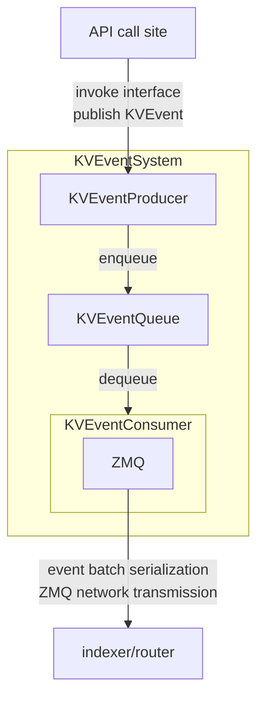
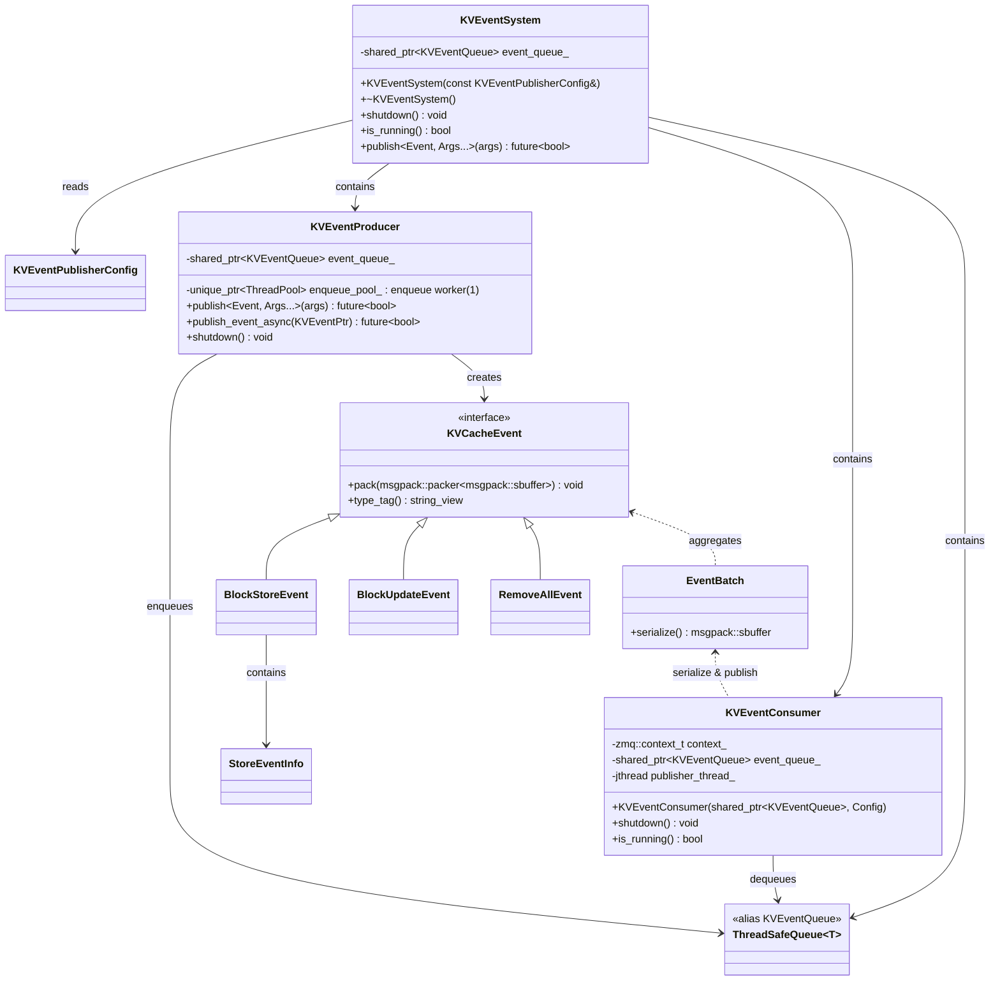
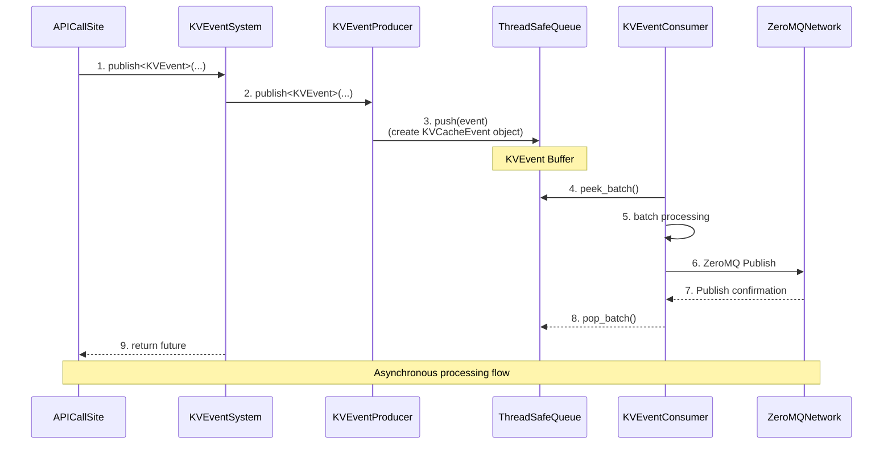
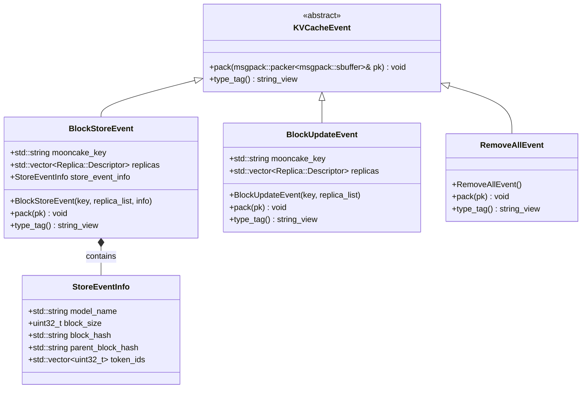

# Mooncake Event System Developer Manual
## 1. System Overview
KVEventSystem is an asynchronous event processing system based on the publish-subscribe pattern. It encapsulates the complex logic of event publishing, consumption, and queue management using the Facade Pattern, providing a concise and unified interface for upper-layer applications.

### 1.1 Core Features

- **Asynchronous Event Publishing**: Supports publishing various types of events in a non-blocking manner.
- **Batch Processing**: Automatically batches and merges events to optimize network transmission efficiency.
- **Reliable Transmission**: Built-in retry mechanisms and queue buffering ensure no event loss.
- **Real-time Monitoring**: Provides detailed runtime statistical information.
- **Flexible Configuration**: Performance and reliability can be adjusted through configuration parameters.

### 1.2 Architecture Design
#### 1.2.1 Architecture Logic Diagram



#### 1.2.2 Class Relationship Diagram



#### 1.2.3 Data Flow Sequence Diagram



------

## 2. Key Class Interface Declarations
### 2.1 Event Classes (kv_event.hpp)
#### Event Class Relationships

| Class Name         | Parent Class   | Key Fields                                     | Description                                   |
| ------------------ | -------------- | ---------------------------------------------- | --------------------------------------------- |
| `KVCacheEvent`     | -              | No fields                                      | Abstract base class, defines event interface  |
| `StoreEventInfo`   | -              | All fields                                     | Container for additional data of store events |
| `BlockStoreEvent`  | `KVCacheEvent` | `mooncake_key`, `replicas`, `store_event_info` | Block storage event                           |
| `BlockUpdateEvent` | `KVCacheEvent` | `mooncake_key`, `replicas`                     | Block update event                            |
| `RemoveAllEvent`   | `KVCacheEvent` | No fields                                      | Clear all cache event                         |

**UML Class Diagram**:



------

#### Event Class Types
##### Event Base Class: `KVCacheEvent`

> The **abstract base class** for all KV cache events, defining the **unified interface** for event serialization and type identification. It uses the abstract base class pattern to provide a unified event processing interface. All concrete event types must inherit from this class and implement the interface methods.

```c++
struct KVCacheEvent {
    virtual void pack(msgpack::packer<msgpack::sbuffer>& pk) const = 0;  // Serialization method
    virtual std::string_view type_tag() const = 0;  // Type identification method
}
```

**Explanation**

| Method Name | Return Type        | Parameters                              | Description                                                  |
| ----------- | ------------------ | --------------------------------------- | ------------------------------------------------------------ |
| `pack`      | `void`             | `msgpack::packer<msgpack::sbuffer>& pk` | Pure virtual function, serializes the event into MessagePack format. Derived classes must implement this method to provide type-specific serialization logic. |
| `type_tag`  | `std::string_view` | None                                    | Pure virtual function, returns a string view of the event type identifier, used for type identification during deserialization. |

------

##### Store Event Pass-Through Meta Data Structure: `StoreEventInfo`

> The `StoreEventInfo`struct is used to carry business metadata for KV cache storage events. All fields in this structure are optional; which fields to populate should be determined by the specific business scenario of the upper-layer cache-aware component (such as indexer or router). The Mooncake system acts only as a transparent pipeline for transmitting these fields and will not perform any business logic validation or interpretation of their content.

```c++
struct StoreEventInfo {
    std::string model_name{""};
    uint32_t block_size{0};
    std::string block_hash{""};
    std::string parent_block_hash{""};
    std::vector token_ids{};
};
```

**Explanation**

| Field Name          | Type                    | Default Value | Constraints/Explanation                                   |
| ------------------- | ----------------------- | ------------- | --------------------------------------------------------- |
| `model_name`        | `std::string`           | `""`          | Model name identifier, empty indicates not set            |
| `block_size`        | `uint32_t`              | `0`           | Block size (bytes), 0 indicates invalid value             |
| `block_hash`        | `std::string`           | `""`          | Hash of the current block, used for unique identification |
| `parent_block_hash` | `std::string`           | `""`          | Parent block hash, used for dependency chain              |
| `token_ids`         | `std::vector<uint32_t>` | Empty vector  | Token ID sequence, can be empty                           |

------

##### Storage Event Structure: `BlockStoreEvent`
> Event type triggered when a KV cache block is stored for the first time, typically containing the additional storage information `StoreEventInfo`that needs to be passed.

```c++
struct BlockStoreEvent {
    std::string mooncake_key;
    std::vector<Replica::Descriptor> replicas;
    StoreEventInfo store_event_info;
}
```

**Explanation**
| Field Name         | Type                               | Default Value (set by constructor) | Constraints/Explanation                      |
| ------------------ | ---------------------------------- | ---------------------------------- | -------------------------------------------- |
| `mooncake_key`     | `std::string`                      | N/A                                | Unique identifier of the cached `ObjectMetadata` in the `MasterService` |
| `replicas`         | `std::vector<Replica::Descriptor>` | N/A                                | List of replica descriptors containing replica location and type information |
| `store_event_info` | `StoreEventInfo`                   | N/A                                | Additional information required for KVCache-aware algorithms |

> The `mooncake_key` field represents the primary key of the cached object in the distributed KV cache system. In the implementation, this value may originate from method parameters (e.g., the key parameter in `PutEnd` method) or from `it->first` when iterating through metadata maps (where it is an iterator over `std::unordered_map<std::string, ObjectMetadata>` in `MasterService::metadata_shards_`).

**Event Format Example**

```javascript
[
    "BlockStoreEvent", // Event type identifier
    "key_001",       // mooncake key
    [                  // Replica location list
        ["memory", "tcp://192.168.1.10:6000"],    // Memory type location
        ["disk", "/data/blocks/block_12345.bin"], // Disk type location
    ],
    "llama2-7b",       // Model name
    512,               // block size
    "0x41234125",      // Current block hash
    "0x51512342",      // Parent block hash
    [1,2,3,4,5]        // Token id list
]
```

------

##### Replica Change Event Structure: `BlockUpdateEvent`
> Event type triggered by any replica update operation other than storage events, including copy/eviction/migration.

```c++
struct BlockUpdateEvent {
    std::string mooncake_key;
    std::vector<Replica::Descriptor> replicas;
}
```

**Explanation**
| Field Name     | Type                               | Default Value | Constraints/Explanation                         |
| -------------- | ---------------------------------- | ------------- | ----------------------------------------------- |
| `mooncake_key` | `std::string`                      | N/A           | Unique identifier of the cached `ObjectMetadata` in the `MasterService` |
| `replicas`     | `std::vector<Replica::Descriptor>` | N/A           | List of replica descriptors containing replica location and type information     |

**Event Format Example**
```javascript
[
    "BlockUpdateEvent", // Event type identifier
    "key_12345",       // mooncake key
    [                  // Global replica location list
        ["memory", "tcp://192.168.1.10:6000"],
        ["memory", "tcp://192.168.1.11:5001"],
        ["disk", "/data/blocks/block_12345.bin"],
    ],
]
```
------
##### Clear All Cache Event Structure: `RemoveAllEvent`
> Event triggered to clear all caches in Mooncake-Store.
```c++
RemoveAllEvent {
}
```

**Explanation**: *This event has no fields, identified only by its type tag.*
**Event Format Example**
```javascript
[
    "RemoveAllEvent"
]
```

------

#### Serialization-Related Types
##### Event Batch Structure: `EventBatch`
> Used to batch serialize events for transmission, thereby reducing network overhead and improving throughput, while timestamps ensure event ordering.

```c++
struct EventBatch {
    double ts;
    std::vector<std::shared_ptr<KVCacheEvent>> events;
}

```

**Explanation**

| Field Name | Type                                         | Default Value (set by constructor) | Constraints/Explanation                                      |
| ---------- | -------------------------------------------- | ---------------------------------- | ------------------------------------------------------------ |
| `ts`       | `double`                                     | N/A                                | Timestamp of batch creation, using Unix timestamp (seconds since 1970-01-01 00:00:00 UTC, floating-point), used by the receiver to process batches in chronological order. |
| `events`   | `std::vector<std::shared_ptr<KVCacheEvent>>` | N/A                                | Array of event pointers, can contain any event object derived from `KVCacheEvent`. Events in the batch are serialized and processed in array order. |

**Event Batch Format Example**
The event batch is serialized as an array containing two elements:
- The first element is the timestamp (floating-point number)
- The second element is an array of events, where each event is its corresponding type's serialized array.

```javascript
[
    170000000.123, // Element 1: Timestamp (double)
    [              // Element 2: Event list (array)
        [           // Event 1: BlockStoreEvent
            "BlockStoreEvent",
            "key_001",
            [
                ["memory", "tcp://192.168.1.10:6000"],
                ["disk", "/data/blocks/block_12345.bin"]
            ],
            "llama2-7b",
            512,
            "0x41234125",
            "0x51512342",
            [1, 2, 3, 4, 5]
        ],
        [           // Event 2: BlockUpdateEvent
            "BlockUpdateEvent",
            "key_12345",
            [
                ["memory", "tcp://192.168.1.10:6000"],
                ["memory", "tcp://192.168.1.11:5001"],
                ["disk", "/data/blocks/block_12345.bin"]
            ]
        ],
        [           // Event 3: RemoveAllEvent
            "RemoveAllEvent"
        ]
    ]
]

```

------

### 2.2 Event System Facade Class (kv_event_system.h)
#### 2.2.1 Configuration Item Descriptions

| Category               | Parameter Name                        | Corresponding Field in `KVEventPublisherConfig` Structure | Type          | Default Value     | Description                                                  |
| ---------------------- | ------------------------------------- | --------------------------------------------------------- | ------------- | ----------------- | ------------------------------------------------------------ |
| **Basic Switch**       | `enable_kv_event_publish`             | None (system switch)                                      | `bool`        | `false`           | Master switch for event publishing functionality. System starts event publishing only when set to `true`. |
| **Network Config**     | `kv_event_publisher_endpoint`         | `endpoint`                                                | `std::string` | `"tcp://*:19997"` | ZeroMQ bind address, supports `tcp://`and `ipc://`protocols. |
|                        | `kv_event_publisher_replay_endpoint`  | `replay_endpoint`                                         | `std::string` | `""`              | Replay endpoint address. Empty value disables replay functionality. |
|                        | `kv_event_publisher_topic`            | `topic`                                                   | `std::string` | `"mooncake"`      | Message topic.                                               |
| **Performance Config** | `kv_event_publisher_hwm`              | `hwm`                                                     | `int`         | `100000`          | ZeroMQ high-water mark, controls memory buffer size.         |
|                        | `kv_event_publisher_send_interval_ms` | `send_interval`                                           | `uint32_t`    | `0`               | Send interval (milliseconds), 0 means no delay.              |
|                        | `kv_event_publisher_max_batch_size`   | `max_batch_size`                                          | `uint32_t`    | `50`              | Maximum batch size, affects throughput and latency.          |
| **Advanced Config**    | `kv_event_publisher_auto_port`        | `auto_port`                                               | `bool`        | `true`            | Automatic port switching, automatically tries other ports if the port is occupied. |

#### 2.2.2 Event Publishing Interface
##### Generic Publishing Method
```c++
// Template method, supports all event types derived from KVCacheEvent
template <DerivedFromKVCacheEvent Event, typename... Args>
std::future<bool> publish(Args&&... args);
```
##### Publishing Different Types of Events

```c++
// 1. Publish block storage event
system.publish<BlockStoreEvent>(
    "key_001",
    replica_list,
    store_info
);

// 2. Publish block update event
system.publish<BlockUpdateEvent>(
    "key_001",
    updated_replicas
);

// 3. Publish clear all event
system.publish<RemoveAllEvent>();

// 4. Custom event (must inherit from KVCacheEvent)
class CustomEvent : public KVCacheEvent { /* ... */ };
system.publish<CustomEvent>(arg1, arg2);

```

------

## 3. Python API Integration

Since only the `BlockStoreEvent` requires the introduction of field information defined in `StoreEventInfo` passed from the inference engine side, a new default parameter (i.e., the optional parameter `store_event_infos`) has been added only to the interfaces related to `put` operations.

> Currently, only the `batch_put_from_multi_buffers` interface has been adapted accordingly. Other interfaces related to `put` operations will also need adaptation subsequently.

### `StoreEventInfo` Type

**Purpose**
The `StoreEventInfo` struct is used to carry business metadata for KV cache storage events. All fields in this structure are optional; which fields to populate should be determined by the specific business scenario of the upper-layer cache-aware component (such as indexer or router). The Mooncake system acts only as a transparent pipeline for transmitting these fields and will not perform any business logic validation or interpretation of their content.

For detailed API specification, please refer to the Python API Reference documentation: [mooncake-store.md](https://github.com/OpenMooncake/Mooncake/blob/main/docs/source/python-api-reference/mooncake-store.md).

### `batch_put_from_multi_buffers` Interface

The `batch_put_from_multi_buffers` interface has been enhanced to support passing `StoreEventInfo` objects via the optional `store_event_infos` parameter. This allows KV cache storage events to carry additional metadata that can be consumed by downstream components.

For detailed API specification and usage examples, please refer to the Python API Reference documentation: [mooncake-store.md](https://github.com/OpenMooncake/Mooncake/blob/main/docs/source/python-api-reference/mooncake-store.md).
