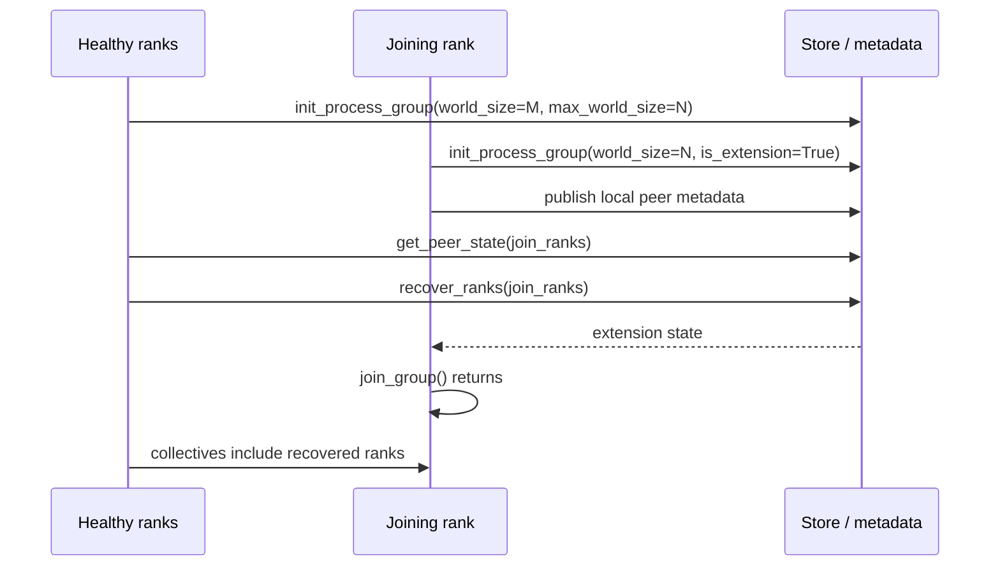

# Mooncake Backend (PG) Design

Mooncake Backend is a `torch.distributed` ProcessGroup backend for Mooncake. It
provides collective and point-to-point communication primitives, rank-health
tracking, and elastic recovery hooks for inference systems that need to keep
serving after partial rank failures.

This document is intended for developers who maintain Mooncake PG itself or
integrate it into higher-level serving systems.

## Goals

Mooncake Backend is designed to:

- integrate with PyTorch through the standard ProcessGroup extension mechanism;
- expose `mooncake` for accelerator tensors and `mooncake-cpu` for CPU tensors;
- support common collective APIs used by inference engines;
- track active and inactive ranks so collectives can continue after failures;
- allow replacement ranks to publish metadata, join an existing group, and be
  activated by healthy ranks;
- reuse Mooncake Transfer Engine and topology information for data movement.

Non-goals:

- It is not a drop-in replacement for every NCCL/Gloo behavior. Validate each
  collective, dtype, and topology required by the application.
- Elastic recovery is an explicit protocol. The backend does not silently add a
  new process to all collectives without application coordination.

## Relationship with `torch.distributed`

Mooncake registers two PyTorch backends when the PG extension module is imported:

- `mooncake-cpu`, registered for CPU devices;
- `mooncake`, registered for accelerator devices such as CUDA or MUSA depending
  on the build.

The backend class itself derives from `c10d::ProcessGroup`. Applications use
regular PyTorch APIs such as `dist.init_process_group()`, `dist.all_reduce()`,
`dist.new_group()`, and `dist.batch_isend_irecv()`.

Point-to-point dispatch in PyTorch expects a `c10d::Backend` object. Mooncake PG
therefore includes a lightweight P2P shim that delegates `send` and `recv` calls
back to the owning `MooncakeBackend` instance.

## Main runtime objects

### `MooncakeBackendOptions`

`MooncakeBackendOptions` carries Mooncake-specific process-group configuration:

| Field | Meaning |
| --- | --- |
| `activeRanks_` | Rank-health tensor exposed to collectives and user code. |
| `isExtension_` | Whether this process is a joining/replacement rank. |
| `maxWorldSize_` | Optional reserved capacity for future ranks. |

The `activeRanks_` tensor must be `torch.int32`. It must be on CPU for
`mooncake-cpu` and on the accelerator device for `mooncake`. When
`maxWorldSize_` is set, `activeRanks_` must be sized to `maxWorldSize_` so the
backend can reserve inactive rank slots.

### Transfer group metadata

Each backend owns shared metadata for:

- the current rank and backend index;
- current capacity (`size`) and visible active size (`activeSize`);
- host and device active-rank masks;
- peer connection state;
- rank-local and rank-global mapping;
- store handles and extension state used by recovery;
- P2P proxy and connection poller state.

`size` is the reserved capacity. `activeSize` is the visible group size returned
by `dist.get_world_size()`. With `max_world_size`, `size` may be larger than
`activeSize`; inactive slots are masked out by the active-rank state.

### Transfer Engine ownership

By default, Mooncake Backend initializes its own Transfer Engine. Advanced
integrations may call `pg.set_transfer_engine(engine)` before
`init_process_group()` to inject an external Transfer Engine. In that mode, the
caller owns the engine and must keep it alive until all Mooncake process groups
using it are destroyed.

## Initialization lifecycle

The initialization flow is:

1. Python imports `mooncake.pg`, which loads a PyTorch-version-specific native
   extension.
2. The extension registers `mooncake` / `mooncake-cpu` with PyTorch.
3. `dist.init_process_group()` invokes the backend factory with PyTorch
   distributed options and optional `MooncakeBackendOptions`.
4. The backend initializes active-rank masks and reserved rank slots.
5. Non-extension ranks publish local peer metadata and wait until current peers
   are connected.
6. Extension ranks enter local-only mode and wait for the explicit join protocol.

The important distinction is that reserving capacity does not automatically make
future ranks active. New ranks are masked until `recover_ranks()` activates them.

## Active ranks and dynamic world size

Mooncake PG tracks two related concepts:

- **Reserved capacity** (`size`): how many rank slots the backend knows about.
- **Visible active size** (`activeSize`): the current group size visible through
  PyTorch APIs.

When `max_world_size` is larger than the initial `world_size`, Mooncake reserves
extra slots but marks them inactive. This lets healthy ranks poll for joiner
metadata and activate the joiners later without reconstructing the process group.

`extend_group_size_to(size)` can also increase capacity. Newly extended ranks
start inactive; the application must call `get_peer_state()` and
`recover_ranks()` before they participate in collectives.

## Elastic recovery protocol

Mooncake PG uses a two-phase protocol for recovery and scale-up:



Healthy rank responsibilities:

1. Reserve capacity with `max_world_size` or `extend_group_size_to()`.
2. Poll `get_peer_state(backend, ranks)` from all healthy ranks in a consistent
   order.
3. Call `recover_ranks(backend, ranks)` once candidate ranks are connected.
4. Refresh higher-level components, such as Mooncake EP buffers, if they cache
   transport metadata.

Joining rank responsibilities:

1. Initialize the process group with `is_extension=True`.
2. Publish local peer metadata through the backend initialization path.
3. Call `join_group(backend)` and block until healthy ranks publish extension
   state.
4. Re-enter normal collectives after `join_group()` returns.

## Subgroup semantics

Mooncake PG follows PyTorch process-group ordering requirements. All processes
that participate in a parent group should call `dist.new_group()` in a consistent
order. This is especially important for elastic subgroups because healthy ranks
and joining ranks must agree on store prefixes and backend indices.

For split-rank elastic patterns, create subgroups using the current membership
on healthy ranks and the eventual membership on joining ranks, while preserving
the same creation order. The PG elastic tests contain executable examples of this
pattern.

## Collective behavior

Collectives use the backend active-rank state to skip inactive ranks. The exact
implementation varies by operation and device type, but the high-level contract
is:

- active ranks participate in the collective;
- inactive ranks are not waited on;
- if communication detects a rank failure, active-rank state can be updated;
- user code can read the current mask with `pg.get_active_ranks(backend)`.

The backend currently implements common collective APIs including all-reduce,
broadcast, all-gather, reduce-scatter, all-to-all, barrier, reduce, gather,
scatter, and single-tensor P2P send/recv.

## Failure and recovery boundaries

Mooncake PG exposes low-level recovery primitives; higher-level systems are
responsible for policy decisions such as:

- which ranks are safe to replace;
- when to stop routing traffic to a failed rank;
- how to recreate model state on a replacement process;
- when to refresh EP, scheduler, or application-level metadata;
- how to coordinate subgroup recovery.

Avoid assuming that `recover_ranks()` alone reconstructs all higher-level state.
It activates the process-group communication path; the application still owns
model weights, KV-cache state, routing policy, and request scheduling.

## Testing checklist for PG changes

When modifying PG internals, run at least:

```bash
# CPU functional tests
python -m unittest discover -s mooncake-pg/tests -k CPU -v

# CUDA functional tests, when GPUs are available
python -m unittest discover -s mooncake-pg/tests -k CUDA -v

# Collective benchmark smoke test
PYTHONPATH=mooncake-pg \
python mooncake-pg/benchmark/pgbench.py \
  --collective all_reduce --backend mooncake --device cuda -g 2 -b 8 -e 1M -f 2
```

Also run elastic tests for changes that touch active ranks, metadata polling,
subgroups, `extend_group_size_to()`, `get_peer_state()`, `recover_ranks()`, or
`join_group()`.

## Related documentation

- [Mooncake EP design](mooncake-ep.md)
- [Python API reference](../python-api-reference/ep-backend.md)
- [PG/EP troubleshooting](../troubleshooting/pg-ep-troubleshooting.md)
