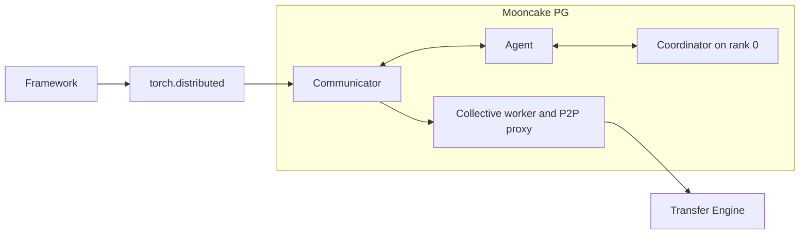

# Mooncake PG Design

Mooncake PG is a communication library built on Mooncake Transfer Engine. It
provides collective and P2P operations together with dynamic membership, fault
tolerance, and recovery.

## Dynamic Membership at a Glance

If you are used to a fixed-membership process group, a natural mental model is
that a group is simply _the set of ranks that were there when the group was
created_. If the set changes, you create another group.

Mooncake PG uses a slightly different model. Think of a group as a **dinner
table with numbered seats**.

The table has a fixed number of seats, decided before dinner starts. During the
meal, however, not every seat has to be occupied.

A diner may leave, but the seat does not disappear. The other diners do not
shuffle around to fill the gap; nobody gets a new seat number just because
someone stepped away. Later, that diner may return to the same seat, or someone
else may occupy it. New diners may also occupy seats that were reserved but
never used.

So there are really two separate questions:

- **How many seats does the table have?**
- **Which seats are currently occupied and participating in the dinner?**

The first stays fixed. The second may change over time.

That is the basic intuition behind Mooncake PG's dynamic membership.

### From the dinner table to Mooncake PG

In Mooncake PG, the numbered seats correspond to **rank slots**. A group
reserves a fixed number of rank slots when it is created, bounded by
`max_group_size`. Which of those ranks currently participate in group
operations is tracked separately by `active_ranks`.

For example, a group can reserve eight rank slots while initially activating
only four -- four diners at an eight-seat table:

```
max_group_size = 8
active_ranks = [1, 1, 1, 1, 0, 0, 0, 0]
```

If rank 2 is later deactivated -- one diner leaves the table:

```
active_ranks = [1, 1, 0, 1, 0, 0, 0, 0]
```

its rank slot remains reserved, and the other ranks are not renumbered -- the
empty seat simply remains empty.

Rank 4 may also subsequently become active without filling that hole:

```
active_ranks = [1, 1, 0, 1, 1, 0, 0, 0]
```

The group keeps the same rank structure throughout these changes; only the set
of active participants changes.

This design also extends naturally to fault tolerance and recovery. A failed
rank can be removed from the active membership without reshaping the group,
while a recovered rank can later rejoin through the same membership mechanism.

## Core Concepts

### Capacity and size

Mooncake PG has capacity at two scopes:

- Process-level `max_world_size` bounds the number of ranks in the whole world.
- Group-level `max_group_size` bounds the number of ranks in a group.

Despite the name, a group's `size` is not the number of active members. It is
one past the highest active in-group rank and therefore acts as a rank-index
upper bound. For example:

```text
active_ranks   = [1, 0, 1, 0]
size           = 3
max_group_size = 4
```

User code that allocates rank-indexed buffers must cover at least `size`
entries, including inactive holes below that bound. Per-group masks such as
`active_ranks` and `failed_ranks_hint` span `max_group_size`.

An extension rank before `joinGroup` (`Isolated` or `Quiescing`) is the
exception: `getSize()` continues to report the group's declared size for
PyTorch rank validation, even though its effective membership is temporarily
`{self}`.

Holes preserve rank numbers. So user code that needs the number of participants
must count `active_ranks` rather than use `getSize()` or
`dist.get_world_size()`.

### Rank namespaces

A process has one `GlobalRank` in the world and may have a different
`InGroupRank` in each group:

- `GlobalRank` indexes the world-capacity namespace `[0, max_world_size)`.
- `InGroupRank` indexes the group-capacity namespace `[0, max_group_size)`.

The distinction matters whenever a group contains only part of the world or
orders its ranks differently. Group-level operations, including
`activate_ranks` and `deactivate_ranks`, use in-group ranks unless stated
otherwise.

### Rank state

The Coordinator tracks a process-level `RankState`:

| State     | Meaning                                                                                         |
| --------- | ----------------------------------------------------------------------------------------------- |
| `Offline` | No usable Agent session exists for this global rank.                                            |
| `Synced`  | The Agent session is synchronized, but the rank is not in the current healthy set.              |
| `Healthy` | The Agent session is synchronized and current link evidence places the rank in the healthy set. |

A new Agent session moves a rank from `Offline` to `Synced`. Link evidence can
promote it to `Healthy` or demote it back to `Synced`; losing the Agent session
makes it `Offline`.

The Coordinator combines link reports from all ranks to determine which ranks
are `Healthy`. The healthy ranks must be connected to one another in both
directions. A registered rank that does not meet these conditions remains
`Synced`.

`RankState` is independent of any group. It describes whether a process is
ready for data-plane communication; participation in a particular group is
described separately by group membership.

### Group membership

`rank_order` connects the two namespaces: it records the `GlobalRank` assigned
to each `InGroupRank`. This is a stable slot assignment, not a list of current
participants. Whether an assigned rank participates is recorded separately by
its `GroupMemberState` and reflected in `active_ranks`.

For example, suppose global ranks 2, 5, and 7 form a group with
`max_group_size = 5`. Inside that group they are in-group ranks 0, 1, and 2, so
`rank_order = [2, 5, 7]`. Calling `deactivate_ranks([1])` targets global rank 5:
its member state becomes `Inactive`, `active_ranks` becomes
`[1, 0, 1, 0, 0]`, and the rank order does not change.

If global rank 9 is later added, it is assigned in-group rank 3 and the rank
order becomes `[2, 5, 7, 9]`. Existing in-group ranks are never renumbered;
new ranks extend the order, while unused group capacity remains unassigned.

`GroupMemberState` has the following values:

| State                | Meaning                                                                  |
| -------------------- | ------------------------------------------------------------------------ |
| `None`               | The rank has not registered with this group.                             |
| `Inactive`           | The rank is registered but has not declared itself ready for activation. |
| `AwaitingActivation` | The rank calls `join_group` and declares itself ready for activation.    |
| `Active`             | The rank participates in collective operations.                          |
| `Left`               | The rank unregistered from this group.                                   |

Founding members become `Active` directly during group bootstrap. A joining
member's activation follows `Inactive` → `AwaitingActivation` → `Active`.
Deactivation returns an active member to `Inactive`.

A `Healthy` rank is ready for data-plane communication, but it participates in
a group only when its group member state is `Active`.

Membership changes are checked against both kinds of state. To activate ranks,
the group must be ready, every newly activated target must be
`AwaitingActivation`, `Healthy`, and have a published endpoint, and every rank
in the resulting active set must be mutually connected with every other rank in
that set. An early activation request remains pending until these conditions
hold or its admission timeout expires.

## Architecture

The data plane executes transfers directly through Mooncake Transfer Engine,
while the control plane tracks processes, connectivity, endpoints, and
committed membership.


```mermaid
flowchart LR
    Framework[Framework] --> Torch[torch.distributed]

    subgraph PG[Mooncake PG]
        Comm[Communicator]
        Agent[Agent]
        Coordinator[Coordinator on rank 0]
        Workers[Collective worker and P2P proxy]
        Comm <--> Agent
        Agent <--> Coordinator
        Comm --> Workers
    end

    Torch --> Comm
    Workers --> TE[Transfer Engine]
```

### Process context and communicators

Each process has one Mooncake PG context. It owns or references the Transfer
Engine and hosts an Agent and the process-wide worker managers; global rank 0
also hosts the Coordinator.

### Coordinator and Agents

The Coordinator owns process `RankState` and each group's member states.
It serializes membership changes and publishes them as `GroupView`s. Agents
mirror those views and apply them to local communicators. Collective and P2P
workers report link evidence; the Coordinator derives the mutually connected
healthy set and decides the resulting state changes.

The Coordinator currently runs on global rank 0 and is not highly available.

### Collectives

Collectives use a direct-write design over Transfer Engine. Each communicator
registers their send, receive, and synchronization buffers.
The worker records transfer failures in `failed_ranks_hint` and reports to the
Agent; membership is not changed on the collective worker side.

### P2P

P2P send and receive use a receiver-driven, credit-based protocol. A receive
operation reserves chunks from a receive pool and writes `CreditSlot`s to the
sender. Each credit identifies the destination chunk and length. The sender
then stages the corresponding data in a send-pool chunk, performs a TE write to
that destination, and writes an `AckSlot` back. The receiver copies the
acknowledged chunk into the user buffer and returns the chunk to the pool.

Each communicator has per-peer operation queues and separate credit and
acknowledgement rings. The control slots carry a group epoch and sequence
number, and a matching header/footer token prevents a partially written slot
from being consumed. Epoch checks discard control traffic left over from an
older group view.

The send and receive polling threads and their fixed-size chunk pools are
shared by all communicators on the same device. Chunk allocation never blocks
a polling thread. When a pool has no free chunk, the operation remains pending
and the poller retries it later.
A transfer error or timeout resets the affected peer lane and reports failure
evidence through the same control-plane path as a collective failure.

## Planned scaling

This section describes planned scaling through Mooncake PG dynamic membership.

### Scale-up

The group must have enough unused `max_group_size` capacity. A joining process
declares an extended rank order (also `is_extension=True` in the PyTorch
integration). The existing group adopts the appended slots as inactive; this
step alone never activates them.

The later join and activation steps are:

1. The joining rank starts in `Isolated` with an effective `{self}`
   membership. This gives the upper layer framework a local-only window for
   initialization and warmup before the rank can affect existing members.
   Collectives in this state must not be interpreted as results from the
   eventual group.
2. When local preparation is complete, the joining rank calls `join_group`.
   The call enters `Quiescing`, drains previously issued collective and P2P
   work, marks the member `AwaitingActivation`, and waits.
3. Any online rank calls `activate_ranks`. The Coordinator admits the request
   only after the activation conditions described above hold for the complete
   future active set. It distributes the new membership and waits for the
   required ranks to apply it; both `join_group` and `activate_ranks` then
   return.

An activation request may arrive before `join_group`; it waits for the joining
rank to become ready rather than bypassing the checks.

### Scale-down

After the upper layer framework stops issuing operations that use the old
membership, any online rank can call `deactivate_ranks` for one or more in-group
ranks. The Coordinator changes those members from `Active` to `Inactive`,
distributes the new membership, and waits for acknowledgements from online
ranks in the old or new active set before returning.

Deactivation does not renumber slots or mark the target process
unhealthy. Its Agent session and data-plane links remain available; to
participate again, that process calls `join_group` and follows the normal
activation path.

## Fault tolerance

### Failure handling

A failed operation reports the caller's data-plane observations to the
Coordinator; the worker itself does not make a membership decision. The two
caller-visible results are:

- `local_success`: whether all transfers required by this operation completed
  at the caller. A successful local result is valid for that caller, but says
  nothing about whether the operation completed at every other rank.
- `failed_ranks_hint`: a per-operation bitmap of length `max_group_size`,
  indexed by in-group rank. It records the ranks for which the caller observed
  a transfer failure; a set bit is evidence, not a global conclusion that the
  peer is faulty.

Failure hints can differ across ranks. Workers submit such observations to the
Coordinator instead of changing membership locally.

#### Reconciliation and `sync_after_failure`

Negative evidence opens a reconciliation window in the Coordinator, allowing
reports from different ranks to arrive before a single decision is made. The
window is 30 seconds by default and must be configured to exceed the default
collective timeout. When the window closes, the Coordinator derives the
mutually connected healthy set, updates `RankState`, and distributes the
result. For groups with auto-deactivation enabled, it also changes unhealthy
active members to `Inactive`.

`sync_after_failure` is both a reporting path and a synchronization point. Its
request piggybacks the Agent's current, unacknowledged link observations. If the
caller has just observed `local_success=false`, those observations can open or
join the Coordinator's reconciliation window. The call then waits for any
pending reconciliation and applies the group view returned by
the Coordinator.

With `auto_deactivate_on_failure=true`, a successful return means that the
caller has applied the membership produced by reconciliation. Its local
`active_ranks` therefore reflects the Coordinator's deactivation decision, and
locally cached readiness queries such as `get_peer_state` are based on the
reconciled state.

With auto-deactivation disabled, reconciliation does not remove members, so
the membership in the returned view may be unchanged.

#### Failure-handling modes

The two options control different parts of the failure path:

- `auto_deactivate_on_failure` selects who owns failure-driven membership
  changes: Mooncake PG or the upper layer framework.
- `auto_sync_on_failure` selects whether a failed collective or P2P operation
  calls `sync_after_failure` automatically before it completes. It does not
  control whether the Coordinator reconciles observations or automatically
  changes membership.

With auto-deactivation disabled, an unhealthy rank may remain active. An
`Offline` rank rejects new operations locally, whereas a `Synced` but unhealthy
rank may still issue them. Successful transfers provide positive link evidence
and can return a `Synced` rank to `Healthy`.

There are three valid configurations.

##### PG-managed, synchronized (default)

```text
auto_deactivate_on_failure = true
auto_sync_on_failure       = true
```

After a local transfer failure, the operation reports its observations and
automatically enters `sync_after_failure`. The Coordinator reconciles rank
state, deactivates unhealthy members, and returns the resulting view; the
caller applies that view before the failed operation completes. The framework
does not need a separate synchronization or deactivation step.

This is the safest and simplest mode, but it deliberately puts control-plane
latency on the failure-completion path. A negative observation opens a
reconciliation window, so the failed operation may remain pending for tens of
seconds while the Coordinator reconciles reports from different ranks.

##### PG-managed, deferred synchronization

```text
auto_deactivate_on_failure = true
auto_sync_on_failure       = false
```

Mooncake PG still reconciles observations and owns the failure-driven
deactivation decision. The difference is that the operation returns after its
data-plane work finishes and exposes `local_success` and `failed_ranks_hint`
without waiting for the reconciliation window. The framework may perform
other work first and call `sync_after_failure` later, before relying on the new
membership or resuming communication on the group.

This mode is useful because `local_success` and `failed_ranks_hint` are
data-plane results, whereas reconciliation is a much slower control-plane
operation. It separates failure notification from membership synchronization
without transferring the membership decision back to the framework.

##### Framework-managed

```text
auto_deactivate_on_failure = false
auto_sync_on_failure       = false
```

The failed operation returns its local evidence without changing membership.
The framework observes failures through `local_success` and
`failed_ranks_hint`, chooses the ranks to remove, and then calls
`deactivate_ranks`.

##### Invalid combination

```text
auto_deactivate_on_failure = false
auto_sync_on_failure       = true
```

This combination is rejected at construction. Automatic synchronization is
meaningful only when Mooncake PG also owns failure-driven deactivation;
otherwise synchronization cannot produce an automatically updated membership
for the failed operation.

This restriction applies only to automatic synchronization.
`sync_after_failure` may still be called manually in any mode, including when
`auto_deactivate_on_failure=false`. The call also acts as an explicit pull of
the Coordinator's latest group view, rather than relying only on pushed view
updates. The framework can therefore obtain a current view while retaining its
own deactivation policy.

### Recovery

A replacement process and a same-process in-place rejoin are separate ways to
bring an inactive slot back. Both reuse the scale-up flow: restored
connectivity can make a rank `Healthy`, but rejoining membership still requires
`join_group` and activation.

#### Replacement process

A replacement registers a new Agent session for the same global rank. The
Coordinator increments the rank epoch and invalidates the old process's link
evidence and endpoints. The replacement recreates its local communicators in
extension mode, starts at `Synced`, may perform local warmup while isolated,
and then follows the normal join and activation flow.

#### In-place rejoin

In-place rejoin applies when the process and its control-plane session remain
alive but the rank has become inactive, commonly after a transient data-plane
failure. Once connectivity recovers, the Coordinator can mark the rank
`Healthy` again. The same process calls `join_group`, drains old
work, republishes the endpoint under a fresh epoch, and
waits for activation. No process restart is required.

## Integration

### Choosing an integration model

An integration combines two independent choices: how planned scaling changes
the communication group, and who owns failure-driven deactivation.

For planned scaling, framework-level group replacement creates another group
and switches to it, so it works with a fixed-membership CCL. Mooncake PG dynamic
membership instead keeps the same group and changes its active ranks.

For failure handling, `auto_deactivate_on_failure` determines ownership. When
it is `true`, Mooncake PG owns deactivation; when it is `false`, the framework
does. `auto_sync_on_failure` is separate from ownership: it only controls
whether a failed operation invokes `sync_after_failure` automatically and waits
for any pending reconciliation before completing.

The table below summarizes the four supported combinations:

| Scaling × Failure mode                                                                   | **PG-managed membership**<br><span style="font-weight: normal;">PG reconciles and deactivates</span>                                                                                                                                                                                 | **Framework-managed membership**<br><span style="font-weight: normal;">Framework synchronizes and decides </span>                                                                                                                                                                              |
| ---------------------------------------------------------------------------------------- | ------------------------------------------------------------------------------------------------------------------------------------------------------------------------------------------------------------------------------------------------------------------------------------ | ---------------------------------------------------------------------------------------------------------------------------------------------------------------------------------------------------------------------------------------------------------------------------------------------- |
| **Mooncake PG dynamic membership**<br>Keep the current group and change its active ranks | Mooncake PG commits requested scaling changes and handles failure-driven deactivation in the existing group. This fits a lean integration with minimal membership orchestration and no group rebuilds.  | The group stays in place, while the framework synchronizes after failures and submits its own deactivation decisions. This fits applications that need direct control over group membership; it uses dynamic membership without group rebuilds, but requires an explicit failure-control path. |
| **Framework-level group replacement**<br>Create a standby/new group and switch to it     | The framework switches groups for planned scaling, while Mooncake PG handles failure-driven deactivation in the current group. This fits an existing standby-group design with minimal failure orchestration; planned scaling still incurs the cost of group creation and switching. | The framework's control plane manages both replacement groups and failure policy. This fits frameworks that already manage group lifecycle and failure policy centrally; it offers the most flexibility but requires the most orchestration.                                                      |

### Interfaces

Mooncake PG exposes a PyTorch integration and an experimental C API.

Importing `mooncake.pg` registers two `torch.distributed` backends:

- `mooncake-cpu` for CPU devices;
- `mooncake` for the accelerator supported by the build.

`MooncakeBackend` derives from `c10d::ProcessGroup`, so applications use the
usual PyTorch entry points, including `dist.init_process_group()`,
`dist.new_group()`, `dist.all_reduce()`, and `dist.batch_isend_irecv()`.
Mooncake-specific capacity, extension, and failure-handling options are passed
through `MooncakeBackendOptions`.

PyTorch dispatches P2P operations and some collective entry points through a
`c10d::Backend` object. Each `MooncakeBackend` therefore registers a lightweight
`MooncakeBackendShim` that forwards supported operations back to its owning
`MooncakeBackend`.
See the [Python API](../api-reference/python/ep-backend.md) for
initialization examples and API details.

Non-PyTorch integrations can use the experimental C API declared in
[`mooncake_pg.h`](https://github.com/kvcache-ai/Mooncake/blob/main/mooncake-pg/include/mooncake_pg.h).

## Contributing

The PG tests are the executable contracts for current behavior:

| Test file                          | Contract covered                                                                                                                     |
| ---------------------------------- | ------------------------------------------------------------------------------------------------------------------------------------ |
| `test_pg_init_functional.py`       | Initialization, single rank, subgroup creation, destruction, and reinitialization                                                    |
| `test_pg_collectives.py`           | Collective coverage                                                                                                                  |
| `test_pg_p2p.py`                   | Direct and batched P2P, ordering, multiple senders, and failure detection                                                            |
| `test_pg_elastic.py`               | Automatic and manual failure handling, scale-up, process replacement, graceful leave, subgroup extension, holes, and in-place rejoin |
| `test_pg_inference_topologies.py`  | TP, PP, DP, EP, and prefill/decode group layouts                                                                                     |
| `test_pg_inference_collectives.py` | Traffic across inference-style groups                                                                                                |

Run tests from the repository root:

```bash
# Run all PG tests
python -m unittest discover -s mooncake-pg/tests -v

# Run CPU-only PG tests
python -m unittest discover -s mooncake-pg/tests -k CPU -v

# Run CUDA PG tests
python -m unittest discover -s mooncake-pg/tests -k CUDA -v

# Collective benchmark smoke test
PYTHONPATH=mooncake-pg \
python mooncake-pg/benchmark/pgbench.py \
  --collective all_reduce --backend mooncake --device cuda -g 2 -b 8 -e 1M -f 2
```

Set `MOONCAKE_PGTEST_DEVICE_FILTERS` to a comma-separated NIC/HCA list when the
test environment needs explicit device selection.

## Related documentation

- [Mooncake EP design](mooncake-ep.md)
- [Python API reference](../api-reference/python/ep-backend.md)
- [PG/EP troubleshooting](../troubleshooting/pg-ep-troubleshooting.md)
