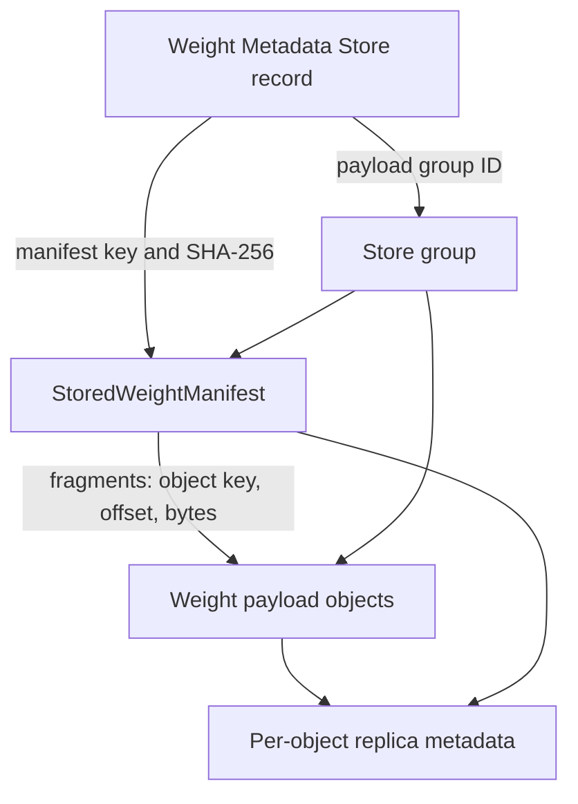

# Weight Management Architecture

Mooncake Store manages one immutable model-weight revision as a first-class
resource. A caller discovers the revision by its exact identity, acquires a
revision lease, resolves its immutable manifest, and then transfers the
manifest's payload ranges. Callers do not need to know the manifest object key
in advance.

This design adds revision-level discovery and lifecycle control without adding
independent tensor-level management metadata.

## Delivery Status

This stage integrates weight imports, publication, and revision leases with
Master and HA replication and recovery. Managed payload-group reclamation,
residency migration, and client RPCs are delivered as follow-up changes. The
state machine remains independent of tensor geometry and physical placement.

## Authority Model

Three records have distinct authority:

| Authority | Location | Owns | Does not own |
| --- | --- | --- | --- |
| Weight Metadata Store | Store Master memory, HA OpLog, and Master snapshot | exact revision discovery, availability, residency summary, operation progress, revision leases, manifest reference | tensor geometry, payload contents, physical replica addresses |
| `StoredWeightManifest` | immutable Store `METADATA` object | tensor descriptors and tensor-fragment-to-object-range mapping | lifecycle state, leases, live runtime addresses |
| Store object metadata | existing per-key Master metadata | replica placement and status in memory, local disk, DFS, or NoF | revision discovery, tensor meaning, serving activation |



The metadata record stays outside the payload group. It therefore remains
discoverable while the group is cold, degraded, deleting, or physically
absent. The manifest and every payload object share one `payload_group_id`.
Generic eviction and removal paths recognize that group as managed and cannot
independently reclaim one member.

The group is a logical lifecycle boundary, not a distributed transaction.
Physical work may be partial while an operation is running. The metadata store keeps
the operation non-terminal until reconciliation observes the required state
for every member.

## Revision Identity and Manifest Location

A revision is addressed by:

```text
(tenant_id, namespace, resource_id, revision, weight_generation)
```

When multi-tenancy is disabled, the Master accepts only the `default` tenant
for weight imports. It rejects another tenant rather than silently changing
the revision identity while writing its OpLog entry. With multi-tenancy
enabled, the identity retains its tenant throughout publication and replay.

Its manifest object key is canonical:

```text
weights/<namespace>/<resource_id>/<revision>/<weight_generation>/manifest
```

`WeightMetadataStore` validates that the payload group ID and manifest key are
the canonical values derived from the revision identity. The Master integration
separately validates those references against physical Store object type,
membership, count, logical bytes, and payload-key digest.

The three textual path components are UTF-8 URL-encoded as individual path
segments. The manifest is hard-pinned during import and stored as
`ObjectDataType::METADATA`. Payload fragments are stored as
`ObjectDataType::WEIGHT` in the same group.

After publication, the manifest key, manifest SHA-256, payload group ID,
payload-key SHA-256, payload count, and logical byte count are immutable.
The Master validates object type, exact group membership, count, logical
bytes, and the digest of sorted payload keys. It deliberately does not parse
the tensor manifest body. A consumer must verify the stored manifest's identity
and SHA-256 before planning tensor ranges.

## State Model

Availability, physical residency, and an in-progress operation are separate:

| Dimension | Values | Meaning |
| --- | --- | --- |
| Availability | `IMPORTING`, `READY`, `DEGRADED`, `DELETING`, `DELETED` | whether the complete revision is safe to discover and load |
| Residency | `UNKNOWN`, `HOT`, `COLD`, `MIXED`, `ABSENT` | observed placement across required group members |
| Operation | `NONE`, `EVICTING`, `REHYDRATING`, `REPAIRING` | durable non-terminal group work |

`READY` means the manifest and every required payload object have a readable
replica. DRAM eviction changes residency but does not by itself make a revision
unavailable. Missing required members produce `DEGRADED`; complete physical
removal produces the retained `DELETED`/`ABSENT` tombstone.

Every mutation is fenced by `expected_metadata_generation`. A stale writer
fails with `STALE_GENERATION`. A retry of an uncertain import commit with the
same generation and immutable manifest reference is idempotent.

## Import and Publication

The managed upload sequence is:

1. `BeginWeightImport` creates or returns the `IMPORTING` metadata record and
   Store-issued canonical payload group ID.
2. `WeightStore` writes every payload object into that group.
3. The immutable `StoredWeightManifest` is committed last into the same group.
4. `CommitWeightImport` validates exact group membership and the manifest
   reference, then durably publishes `READY`.
5. `GetWeightRevision` or bounded `ListWeightRevisions` can discover it.

`READY` is never inferred from key prefixes. An abandoned import is handled by
the explicit abort/reconciliation policy.

## Load and Revision Leases

A reader first resolves the exact metadata identity with `GetWeightRevision`
and acquires a revision lease against the returned metadata generation. It then
reads and validates the manifest, plans ranges, and executes Store-to-runtime
transfers. The caller renews short leases until all transfer work reaches a
terminal state and releases the lease on both success and failure.

Renewal never shortens an existing lease: the new expiry is the later of the
current expiry and the renewal time plus the requested TTL. An expired lease
cannot be renewed.

A live revision lease blocks deletion and residency operations that could
remove the last readable replica. Revision leases do not replace framework
allocation guards, runtime binding generations, or Store's per-object read
leases; those protect different ownership boundaries.

## Residency, Rehydration, and Deletion

`StartWeightResidencyOperation` durably records the operation ID, target,
fenced metadata generation, and progress. Reconciliation then uses existing
per-object primitives:

- `EVICTING` removes memory replicas only after a readable cold replica exists
  for each affected member;
- `REHYDRATING` queues promotion for every group member and waits until all
  required members have readable memory replicas;
- busy or incomplete members keep the operation in progress;
- deletion blocks new leases, waits for live leases, removes payload objects,
  removes the manifest last, verifies absence, and retains a tombstone.

Generic `BatchEvict`, quota eviction, explicit remove, and cleanup paths skip
managed groups. Only the weight lifecycle path may change their aggregate
residency or availability.

## Recovery and HA Rollout

Weight metadata, leases, and operation records use durable-before-visible
OpLog publication. Standby replay stores them in a separate weight-metadata
namespace rather than encoding them as fake object metadata. Master snapshots
carry an optional `weight_metadata` section; an older snapshot without the
section restores empty Weight metadata while preserving ordinary KV metadata.
Derived group indexes are rebuilt from restored metadata records.

Periodic Master snapshots capture the durable log boundary and weight state
under a shared consistency boundary. Weight mutations hold a barrier from
log submission through in-memory publication. If a mutation is still pending,
the snapshot skips that cycle and retries at the next interval rather than
waiting for publication while holding the global snapshot lock. Continuous
overlapping weight mutations can therefore postpone snapshots. Weight state
is frozen in the parent; the forked child only serializes the frozen value.

Batch-OpLog snapshots containing weight state use a version-2 manifest with a
checksummed weight-state artifact captured at the same replay cursor as object
and segment metadata. Clusters with no weight records or allocated weight IDs
continue to emit version-1 snapshots.
Recovery validates and restores that state before applying the remaining OpLog.
The snapshot validator, pruning coordinator, and garbage collector require the
artifact to be intact before allowing log reclamation. Version-1 snapshots
remain readable and restore empty weight state; they cannot recover weight
history that was already omitted and compacted.

Weight mutations wait for durable publication or a terminal writer error,
without a separate publication timeout. A terminal failure cannot be followed
by a late in-memory publication of the same request. A shutdown error does not
prove that an in-flight write is absent from the durable log; recovery may
still replay it, so callers must query the revision before retrying an
uncertain operation.

Clusters using HA plus the etcd batch OpLog fail closed for weight-management
mutations unless the operator sets
`weight_management_oplog_capability_confirmed=true`. Set it only after every
configured standby runs a version that understands all weight metadata and
lease OpLog entries. This is an explicit rolling-upgrade capability assertion,
not automatic standby discovery. Reads and ordinary KV operations are not
gated by it.

The capability flag admits new mutations; it is not a rollback switch.
Disabling it does not remove existing weight state, including state loaded
through snapshot restore or standby promotion. Such a cluster still requires
readers that support its weight OpLog and snapshot formats.

The metadata-only OpLog payload in this stage accepts revisions without an
active residency operation (`operation=NONE`, `operation_id=0`). The applier
rejects an active operation reference rather than accepting metadata whose
operation record cannot be replicated. Residency operation publication and
atomic replication of metadata with its operation record are follow-up work.

## Serving-System Boundary

Store owns durable revision discovery, readable-residency state, leases, and
safe reclamation. SGLang or another runtime owns live GPU addresses, runtime
bindings, allocation guards, and worker-local snapshot generations. Slime,
Kubernetes, Ray, or another serving control plane owns multi-worker activation,
traffic switching, and rollback. Store does not choose a globally active
serving revision.

## Integration Boundary

Follow-up changes expose the lifecycle primitives through the Master RPC and
C++ client surfaces, then add a managed `WeightStore` Python facade for
manifest upload and load. Framework adapters remain responsible for building
and validating tensor manifests, holding runtime allocation guards, and
activating revisions. Manifest-only objects without a Weight metadata record
remain outside this lifecycle.
