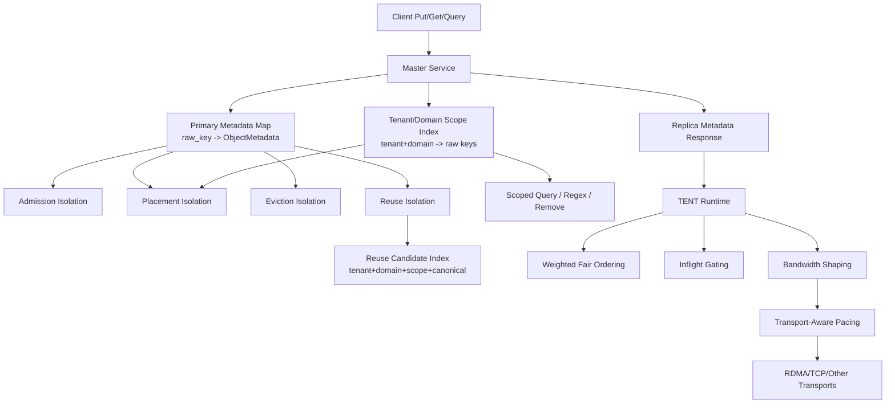
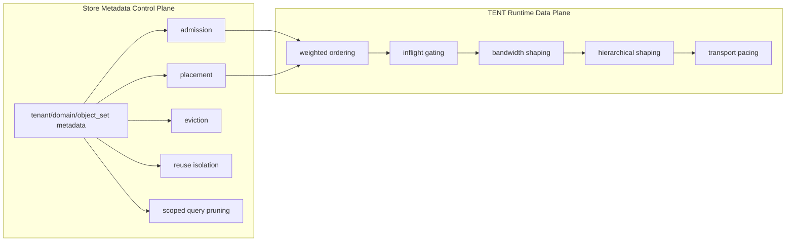
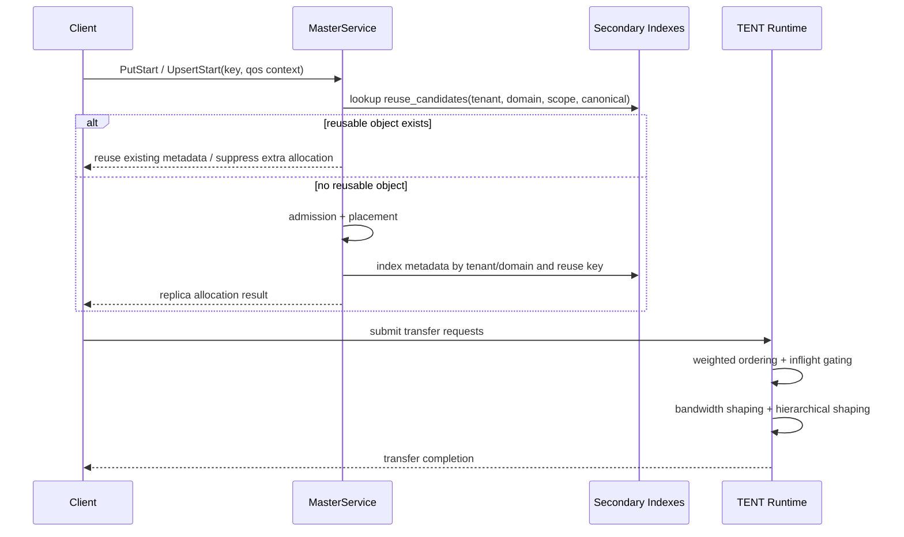

# Mooncake Store Multi-Tenant Isolation Design

## Status

This document summarizes the multi-tenant isolation capabilities already implemented on the current branch, and defines the next metadata-side extension for **reuse isolation** and **tenant/domain-pruned metadata lookup**.

The design is intentionally layered. Different layers solve different interference problems:

- **admission isolation** controls who is allowed to consume capacity
- **placement isolation** controls where objects are placed
- **eviction isolation** controls whose objects are removed first under pressure
- **execution isolation** controls request concurrency and scheduling fairness
- **bandwidth isolation** controls real datapath byte-rate behavior
- **reuse isolation** controls whether one tenant/domain can reuse an existing object or metadata result

## Background

Mooncake Store already stores rich multi-tenant metadata on each object:

- `tenant_id`
- `domain_id`
- `object_set`
- `sharing_scope`
- `qos_tier`
- `logical_key`
- `canonical_key`

These fields are now used in multiple parts of the system, but not all layers are equally mature.

Before the current branch, most isolation behavior was either absent or implicit. The work on this branch made tenant metadata a first-class control surface across store metadata and TENT runtime. The remaining gap is that **reuse semantics** and **metadata query pruning** are still weaker than the rest of the isolation stack.

## Design Goals

- Make multi-tenant isolation explicit and layered rather than implicit and best-effort.
- Keep exact raw-key lookups fast.
- Prevent cross-tenant and cross-domain object reuse unless explicitly allowed.
- Reduce unnecessary metadata traversal by pruning with tenant/domain scope.
- Preserve work-conserving transport behavior: fairness must not reduce total throughput.
- Keep the design compatible with snapshot/restore and HA metadata recovery.

## Non-Goals

- Do not redesign the primary metadata shard layout.
- Do not move all policy into transport backends.
- Do not require a global metadata lock or a global secondary-index coordinator.
- Do not make regex or broad admin queries free; the goal is bounded pruning, not zero-cost cluster-wide search.

## Layered Isolation Model

### Layer 0: Metadata identity layer

This is the naming and scoping foundation used by all upper layers.

Current identity fields:

- tenant: `tenant_id`
- sub-scope: `domain_id`
- finer grouping: `object_set`
- sharing boundary: `sharing_scope`
- logical identity: `logical_key`
- canonical identity: `canonical_key`

As a first step toward namespace-native metadata, the store now has explicit identity helpers:

- `LogicalObjectId = { tenant_id, domain_id, object_set, logical_key }`
- `ReuseIdentity = { tenant_id, domain_id, sharing_scope, canonical_key }`

`BuildLogicalObjectId(raw_key, config)` centralizes the current fallback rule: if `config.logical_key` is empty, the raw key is used as the logical key. `BuildCanonicalObjectKey(...)` then derives canonical identity from the logical identity when the caller does not provide one explicitly.

### Layer 1: Capacity admission isolation

Admission decides whether a write is allowed to consume new capacity.

Implemented behavior on this branch:

- tenant QoS policy participates in admission decisions
- shared-object admission can suppress duplicate allocation when a reusable object already exists
- allocation is no longer purely size-based; it can be shaped by tenant policy context

Problem solved:

- prevents one tenant from consuming capacity without policy checks
- creates the first enforcement point for multi-tenant fairness

### Layer 2: Placement isolation

Placement decides where a newly admitted object should live.

Implemented behavior on this branch:

- tenant QoS policy is carried into placement logic
- domain/object-set locality preferences influence preferred segment selection
- placement is no longer completely tenant-agnostic

Problem solved:

- prevents placement decisions from being based only on global free space
- allows locality and policy to align with tenant/domain intent

### Layer 3: Eviction isolation

Eviction decides whose data is removed first when memory pressure appears.

Implemented behavior on this branch:

- eviction now observes QoS tier and tenant metadata instead of treating all objects as flat peers
- lower-priority objects can be reclaimed before higher-priority ones

Problem solved:

- avoids a global, policy-blind eviction order
- prevents high-value tenant data from competing on exactly the same footing as lower-priority objects

### Layer 4: Execution isolation in TENT runtime

Execution isolation controls how requests enter the data plane.

Implemented behavior on this branch:

- request normalization carries QoS context into TENT runtime
- weighted-fair ordering uses tenant shares for scheduling order
- per-tenant inflight gating caps how many transfers a tenant can keep active
- pending queue drain preserves tenant-aware fairness under contention

Problem solved:

- prevents a single tenant from monopolizing runtime execution slots
- separates concurrency fairness from storage admission fairness

### Layer 5: Bandwidth isolation in TENT runtime

Bandwidth isolation controls how many bytes each active tenant or hierarchy scope can put onto the datapath.

Implemented behavior on this branch:

- runtime-owned bandwidth shaping before transport submission
- chunk-based shaping with burst and interval controls
- adaptive shaping using runtime-observed throughput
- closed-loop control to recover idle capacity and shrink estimates under mismatch
- hierarchical shaping across `tenant/domain/object_set`
- transport-aware pacing hints, with RDMA endpoint post limiting
- lone-active bypass so a single active tenant is not throttled by default
- work-conserving behavior so fairness does not leave capacity idle

Problem solved:

- moves isolation from “who runs first” to “who gets how much bandwidth”
- ensures fairness under contention without turning fairness into a throughput tax

## What Is Still Missing: Reuse Isolation

The current branch has already made multi-tenant policy explicit in admission, placement, eviction, scheduling, and bandwidth shaping. However, **reuse isolation** is not yet fully implemented.

Today, metadata already stores the fields needed to define a reuse boundary, but the system still lacks:

- an explicit reuse eligibility policy boundary
- shard-local secondary indexes for reuse candidates
- tenant/domain-pruned query surfaces for metadata enumeration and regex lookup

This matters for two reasons:

1. **Correctness**
   - without an explicit reuse boundary, future code changes can accidentally allow reuse across tenants or domains
2. **Performance**
   - some metadata paths still scan broad portions of metadata even though tenant/domain information is already available

## Reuse Isolation Policy

The recommended reuse boundary is:

A metadata object is a valid reuse candidate only if all of the following match:

- `tenant_id`
- `domain_id`
- `sharing_scope == "tenant_shared"`
- `canonical_key` is non-empty
- `canonical_key`
- the object has at least one completed replica

This yields the intended semantics:

- different tenant -> cannot reuse
- same tenant, different domain -> cannot reuse
- same tenant/domain but non-shared scope -> cannot reuse
- same tenant/domain/shared scope but different canonical key -> cannot reuse

Even though `canonical_key` may already encode tenant/domain/object_set, the policy should still explicitly include `tenant_id` and `domain_id` in the reuse key. That keeps the isolation boundary robust even if canonical-key construction evolves.

## Metadata Query Performance Problem

Exact `GetReplicaList(key)` lookup is already efficient because metadata is primarily keyed by raw object key. That is not the main bottleneck.

The real traversal hotspots are broader metadata operations such as:

- shared-object admission lookup
- preferred-segment locality lookup
- regex-based metadata query
- bulk key listing
- regex-based removal

Today these paths can traverse much more metadata than necessary, even though tenant/domain scope is already known.

## Secondary Index Architecture

The recommended solution is to keep raw-key primary ownership unchanged and add **per-shard secondary indexes** in `MasterService::MetadataShard`.

### Why per-shard indexes

- they match the existing lock model
- they avoid introducing a new global lock
- they keep exact raw-key lookup unchanged
- they allow incremental mutation under the same shard mutex
- they fit snapshot/restore rebuild naturally

### Recommended indexes

#### 1. Tenant/domain scope index

```text
(tenant_id, domain_id) -> set<raw_key>
```

Use cases:

- scoped key listing
- scoped regex search
- scoped remove-by-regex
- locality lookup pruning

#### 2. Reuse candidate index

```text
(tenant_id, domain_id, sharing_scope, canonical_key) -> set<raw_key>
```

Use cases:

- reuse eligibility lookup
- shared-object admission lookup
- explicit reuse isolation enforcement

#### 3. Optional future locality aggregate index

```text
(tenant_id, domain_id, object_set) -> segment hit counts
```

Use case:

- faster preferred-segment ranking without rescanning candidate metadata

The first implementation can stop at the first two indexes and use the tenant/domain key set to prune locality traversal.

## High-Level Architecture



## Control-Plane and Data-Plane Responsibilities



## Store Metadata Flow with Reuse Isolation



## Current Implementation Summary

### Already implemented on this branch

#### Store-side

- tenant QoS context is persisted in object metadata
- admission is tenant-policy-aware
- placement is tenant-policy-aware
- tier-aware eviction is implemented
- domain/object_set locality participates in preferred-segment decisions

#### TENT runtime side

- weighted-fair ordering by tenant shares
- per-tenant inflight gating
- runtime-owned bandwidth shaping
- adaptive and closed-loop shaping controls
- hierarchical shaping by `tenant/domain/object_set`
- RDMA endpoint pacing via runtime pacing hints

### Planned next extension

- reuse isolation as an explicit metadata layer
- tenant/domain secondary indexes for scoped metadata lookup
- scoped query/regex/remove APIs or internal helpers

## File Scope

### Store metadata and policy

- `mooncake-store/include/master_service.h`
- `mooncake-store/src/master_service.cpp`
- `mooncake-store/include/replica.h`
- `mooncake-store/src/utils.cpp`
- `mooncake-store/include/utils.h`
- `mooncake-store/src/rpc_service.cpp`
- `mooncake-store/src/master_client.cpp`
- `mooncake-store/src/client_service.cpp`

### TENT runtime isolation

- `mooncake-transfer-engine/tent/include/tent/runtime/qos_scheduler.h`
- `mooncake-transfer-engine/tent/src/runtime/qos_scheduler.cpp`
- `mooncake-transfer-engine/tent/include/tent/runtime/transfer_engine_impl.h`
- `mooncake-transfer-engine/tent/src/runtime/transfer_engine_impl.cpp`
- `mooncake-transfer-engine/tent/src/transport/rdma/endpoint.cpp`

### Verification and regression coverage

- `mooncake-store/tests/master_service_test.cpp`
- `mooncake-transfer-engine/tent/tests/qos_scheduler_test.cpp`
- `mooncake-transfer-engine/tent/tests/qos_runtime_gating_test.cpp`
- `mooncake-transfer-engine/tent/tests/transfer_engine_config_override_test.cpp`

## Detailed Next-Step Plan for Reuse Development

### 1. Add shard-local secondary indexes

Inside each `MetadataShard` add:

- tenant/domain candidate key index
- reuse candidate index

The primary map remains:

```text
raw_key -> ObjectMetadata
```

### 2. Centralize index maintenance

All metadata insert/erase/restore paths should flow through shared helpers:

- build index keys
- add to indexes on insert
- remove from indexes on erase
- rebuild indexes after restore

### 3. Rewrite reuse lookup path

The current shared-object lookup should stop scanning all metadata entries and instead:

1. build a reuse key from tenant/domain/scope/canonical identity
2. probe each shard’s reuse index
3. validate only the matched candidate keys

### 4. Rewrite locality lookup path with tenant/domain pruning

Instead of scanning all objects in a shard, locality lookup should:

1. fetch only candidate keys from the tenant/domain scope index
2. filter by `object_set`
3. aggregate segment hits only from that smaller set

### 5. Add scoped query surfaces

Support tenant/domain-scoped metadata operations such as:

- scoped key listing
- scoped regex query
- scoped regex remove

These should reuse the same tenant/domain candidate index.

## Correctness and Performance Considerations

### Correctness risks

- forgetting to unindex on metadata erase
- forgetting to rebuild indexes after snapshot restore
- allowing cross-domain reuse by under-specifying the reuse key
- counting unusable replicas as locality evidence

### Performance trade-offs

- raw-key exact lookup stays unchanged and fast
- broad queries remain more expensive than exact lookups, but should become sharply pruned under tenant/domain scope
- the first phase favors lower implementation risk over a fully aggregated locality index

## Verification Strategy

### Store-side correctness

- same tenant + same domain + shared scope + same canonical key -> reusable
- different tenant -> not reusable
- same tenant + different domain -> not reusable
- non-shared scope -> not reusable
- empty canonical key -> not reusable

### Scoped query correctness

- scoped list returns only keys in the requested tenant/domain
- scoped regex matches only within the requested tenant/domain
- scoped remove does not affect other tenant/domain objects

### Snapshot/restore correctness

- indexes rebuild correctly after restore
- reuse isolation still works after restore
- scoped query still returns correct results after restore

### TENT no-regression coverage

- weighted ordering unchanged when shaping is disabled
- inflight gating unchanged when shaping is disabled
- runtime shaping still preserves lone-active bypass and work-conserving fairness

## Summary

Mooncake multi-tenant isolation is now best understood as a **layered architecture**:

1. metadata identity
2. admission isolation
3. placement isolation
4. eviction isolation
5. execution isolation
6. bandwidth isolation
7. reuse isolation

The current branch has already implemented layers 1 through 6 in meaningful form.

The next step is to complete layer 7 by making reuse boundaries explicit and by adding tenant/domain-pruned metadata lookup. That closes the remaining gap between “policy-aware scheduling” and “policy-aware object identity and reuse.”
