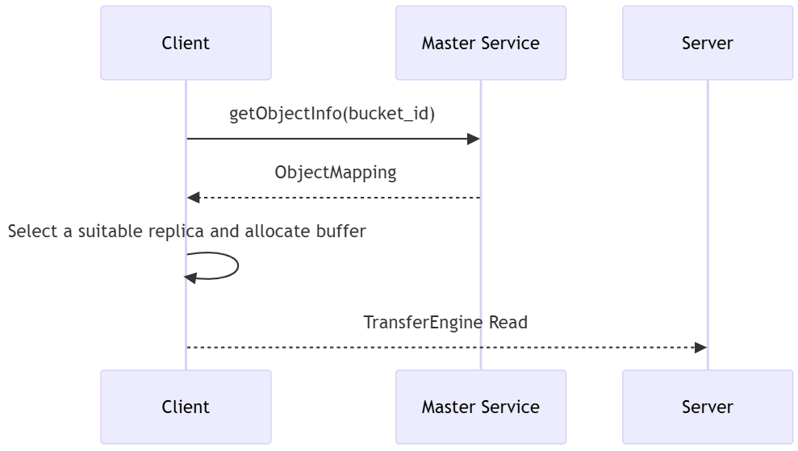
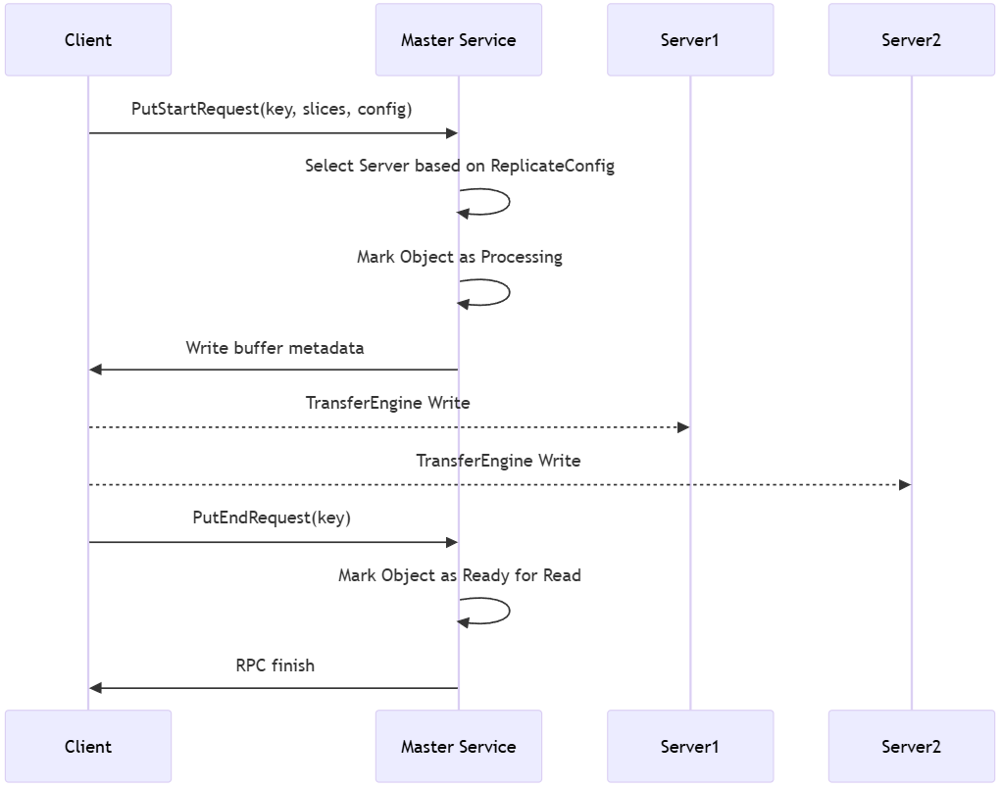
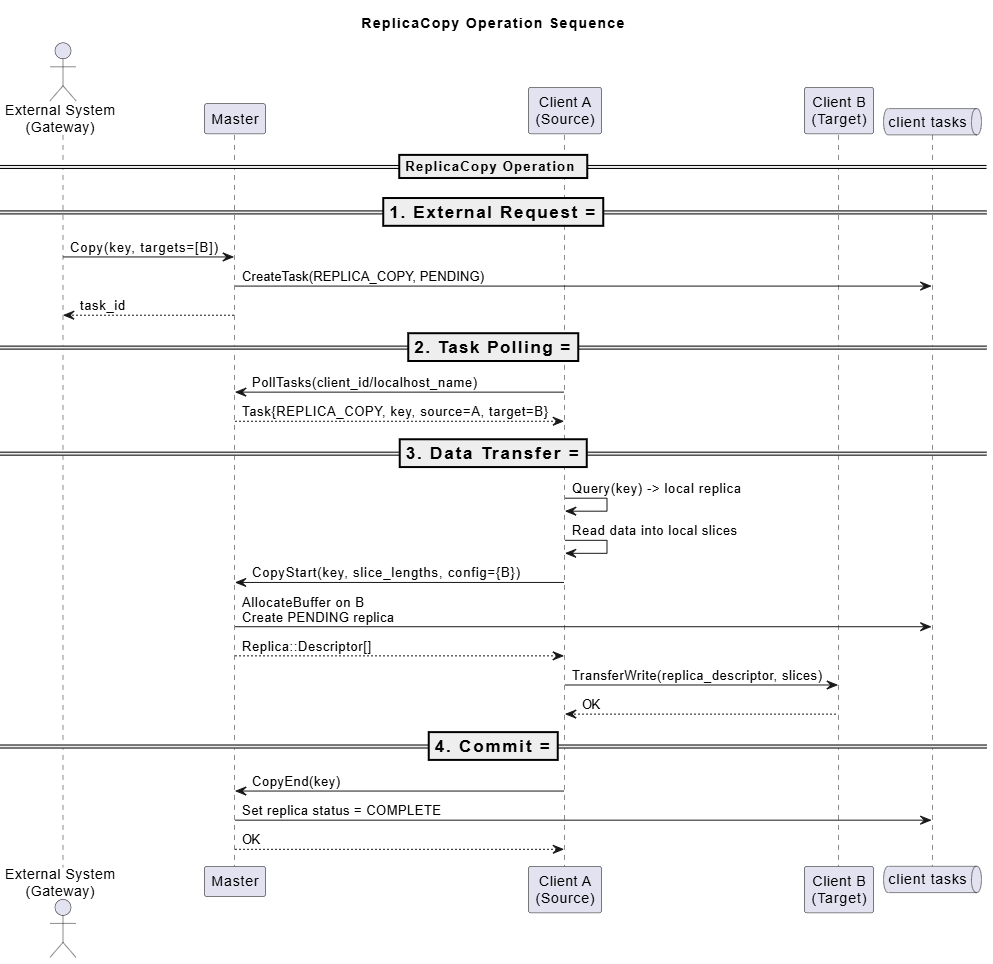
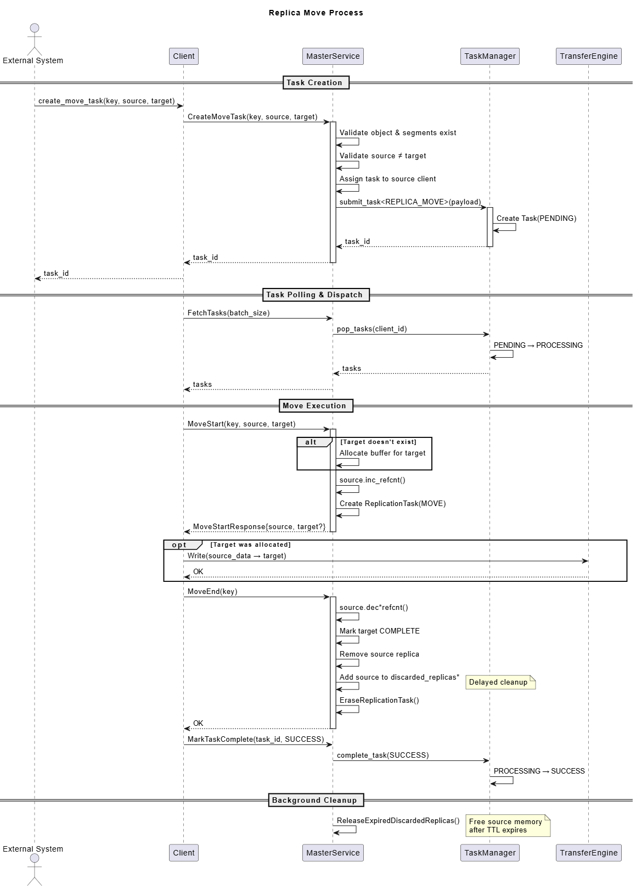

# Mooncake Store

## Introduction

Mooncake Store is a high-performance **distributed key-value (KV) cache storage engine** designed specifically for LLM inference scenarios.

Unlike traditional caching systems such as Redis or Memcached, Mooncake Store is positioned as **a distributed KV cache rather than a generic caching system**. The key difference is that in the latter, the key is derived from the value through hashing, so value is immutable after inserting (although the key/value pair may be evicted).

Mooncake Store provides low-level object storage and management capabilities, including configurable caching and eviction strategies that offers high memory efficiency and is specifically designed to accelerate LLM inference performance.

Key features of Mooncake Store include:
- **Object-level storage operations**: Mooncake Store provides simple and easy-to-use object-level APIs, including `Put`, `Get`, and `Remove` operations.
- **Multi-replica support**: Mooncake Store supports storing multiple data replicas for the same object, effectively alleviating hotspots in access pressure. Each slice within an object is guaranteed to be placed in different segments, while different objects' slices may share segments. Replication operates on a best-effort basis.
- **Strong consistency**: Mooncake Store guarantees that `Get` operations always return correct and complete data. Once an object has been successfully `Put`, it remains immutable until removal, ensuring that all subsequent `Get` requests retrieve the most recent value.
- **Zero-copy, bandwidth-saturating transfers**: Powered by the Transfer Engine, Mooncake Store eliminates redundant memory copies and exploits multi-NIC GPUDirect RDMA pooling to drive data across the network at full line rate while keeping CPU overhead negligible.
- **High bandwidth utilization**: Mooncake Store supports striping and parallel I/O transfer of large objects, fully utilizing multi-NIC aggregated bandwidth for high-speed data reads and writes.
- **Dynamic resource scaling**: Mooncake Store supports dynamically adding and removing nodes to flexibly handle changes in system load, achieving elastic resource management.
- **Fault tolerance**: Mooncake store is designed with robust fault tolerance. Failures of any number of master and client nodes will not result in incorrect data being read. As long as at least one master and one client remain operational, Mooncake Store continues to function correctly and serve requests.
- **Multi-layer storage support**​​: Mooncake Store supports offloading cached data from RAM to SSD, further balancing cost and performance to improve storage system efficiency.

## Architecture


As shown in the figure above, there are two key components in Mooncake Store: **Master Service** and **Client**.

**Master Service**: The `Master Service` orchestrates the logical storage space pool across the entire cluster, managing node join and leave events. It is responsible for object space allocation and metadata maintenance. Its memory allocation and eviction strategies are specifically designed and optimized to meet the demands of LLM inference workloads.

The `Master Service` runs as an independent process and exposes RPC services to external components. Note that the `metadata service` required by the `Transfer Engine` (via etcd, Redis, or HTTP, etc.) is not included in the `Master Service` and needs to be deployed separately.

**Client**: In Mooncake Store, the `Client` class is the only class defined to represent the client-side logic, but it serves **two distinct roles**:
1. As a **client**, it is invoked by upper-layer applications to issue `Put`, `Get` and other requests.
2. As a **store server**, it hosts a segment of contiguous memory that contributes to the distributed KV cache, making its memory available to other `Clients`. Data transfer is actually from one `Client` to another, bypassing the `Master Service`.

It is possible to configure a `Client` instance to act in only one of its two roles:
* If `global_segment_size` is set to zero, the instance functions as a **pure client**, issuing requests but not contributing memory to the system.
* If `local_buffer_size` is set to zero, it acts as a **pure server**, providing memory for storage. In this case, request operations such as `Get` or `Put` are not permitted from this instance.

The `Client` can be used in two modes:
1. **Embedded mode**: Runs in the same process as the LLM inference program (e.g., a vLLM instance), by being imported as a shared library.
2. **Standalone mode**: Runs as an independent process. In this mode, the `Client` is separated into two parts: a **dummy** `Client` and a **real** `Client`: The **real** `Client` is a full-featured implementation that runs as a standalone process and directly communicates with other Mooncake Store components. It handles all RPC communications, memory management, and data transfer operations. The **real** `Client` is typically deployed on nodes that contribute memory to the distributed cache pool; The **dummy** `Client` is a lightweight wrapper that forwards all operations to a local **real** `Client` via RPC calls, which is designed for scenarios where the client needs to be embedded in the same process as the application (such as vLLM), but the actual Mooncake Store operations should be handled by a standalone process. The **dummy** `Client` and the **real** `Client` communicate via RPC calls and shared memory to make sure that Zero-copy transfers are still possible.

Mooncake store supports two deployment methods to accommodate different availability requirements:
1. **Default mode**: In this mode, the master service consists of a single master node, which simplifies deployment but introduces a single point of failure. If the master crashes or becomes unreachable, the system cannot continue to serve requests until it is restored.
2. **High availability mode (unstable)**: This mode enhances fault tolerance by running the master service as a cluster of multiple master nodes coordinated through an etcd cluster. The master nodes use etcd to elect a leader, which is responsible for handling client requests.
If the current leader fails or becomes partitioned from the network, the remaining master nodes automatically perform a new leader election, ensuring continuous availability.

In both modes, the leader monitors the health of all client nodes through periodic heartbeats. If a client crashes or becomes unreachable, the leader quickly detects the failure and takes appropriate action. When a client node recovers or reconnects, it can automatically rejoin the cluster without manual intervention.

## Client C++ API

### Constructor and Initialization `Init`

```C++
ErrorCode Init(const std::string& local_hostname,
               const std::string& metadata_connstring,
               const std::string& protocol,
               void** protocol_args,
               const std::string& master_server_entry);
```

Initializes the Mooncake Store client. The parameters are as follows:
- `local_hostname`: The `IP:Port` of the local machine or an accessible domain name (default value used if port is not included)
- `metadata_connstring`: The address of the metadata service (e.g., etcd/Redis) required for Transfer Engine initialization
- `protocol`: The protocol supported by the Transfer Engine, including RDMA and TCP
- `protocol_args`: Protocol parameters required by the Transfer Engine
- `master_server_entry`: The address information of the Master (`IP:Port` for default mode and `etcd://IP:Port;IP:Port;...;IP:Port` for high availability mode)

### Get

```C++
tl::expected<void, ErrorCode> Get(const std::string& object_key,
                                  std::vector<Slice>& slices);
```



`Get` retrieves the value of `object_key` into the provided `slices`. The returned data is guaranteed to be complete and correct. Each slice must reference local DRAM/VRAM memory that has been pre-registered with `registerLocalMemory(addr, len)` (not the global segments that contribute to the distributed memory pool). When persistence is enabled and the requested data is not found in the distributed memory pool, `Get` will fall back to loading the data from SSD.

### Put

```C++
tl::expected<void, ErrorCode> Put(const ObjectKey& key,
                                  std::vector<Slice>& slices,
                                  const ReplicateConfig& config);
```



`Put` stores the value associated with `key` in the distributed memory pool. The `config` parameter allows specifying the required number of replicas as well as the preferred segment for storing the value. When persistence is enabled, `Put` also asynchronously triggers a persistence operation to SSD.

**Replication Guarantees and Best Effort Behavior:**
- Each slice of an object is guaranteed to be replicated to different segments, ensuring distribution across separate storage nodes
- Different slices from different objects may be placed in the same segment
- Replication operates on a best-effort basis: if insufficient space is available for all requested replicas, the object will still be written with as many replicas as possible

The data structure details of `ReplicateConfig` are as follows:

```C++
struct ReplicateConfig {
    size_t replica_num{1};                    // Total number of replicas for the object
    bool with_soft_pin{false};               // Whether to enable soft pin mechanism for this object
    std::string preferred_segment{};         // Preferred segment for allocation
};
```

### Remove

```C++
tl::expected<void, ErrorCode> Remove(const ObjectKey& key);
```

Used to delete the object corresponding to the specified key. This interface marks all data replicas associated with the key in the storage engine as deleted, without needing to communicate with the corresponding storage node (Client).

### CreateCopyTask

```C++
tl::expected<UUID, ErrorCode> CreateCopyTask(
    const std::string& key,
    const std::vector<std::string>& targets);
```



`CreateCopyTask` creates an asynchronous copy task that will be executed by the client's task execution system. This is useful when you want to submit multiple copy operations without waiting for each one to complete. The task is submitted to the master service, assigned a unique task ID, and executed asynchronously by an available client. The task status can be queried using `QueryTask`.

**Task Execution and Result Reporting:**
1. **Task Assignment**: The master service assigns the task to an available client during the client's periodic ping operation
2. **Task Execution**: The assigned client executes the copy operation asynchronously in a background thread pool
3. **Result Reporting**: Upon completion (success or failure), the client automatically reports the result to the master service via `MarkTaskToComplete`:
   - On success: `status = SUCCESS`, `message = "Task completed successfully"`
   - On failure: `status = FAILED`, `message = <error description>`
4. **Status Query**: You can query the task status at any time using `QueryTask` to monitor progress

### CreateMoveTask

```C++
tl::expected<UUID, ErrorCode> CreateMoveTask(
    const std::string& key,
    const std::string& source,
    const std::string& target);
```



`CreateMoveTask` creates an asynchronous move task that will be executed by the client's task execution system. This is useful when you want to submit multiple move operations without waiting for each one to complete. The task is submitted to the master service, assigned a unique task ID, and executed asynchronously by an available client. The task status can be queried using `QueryTask`.

**Task Execution and Result Reporting:**
1. **Task Assignment**: The master service assigns the task to an available client during the client's periodic ping operation
2. **Task Execution**: The assigned client executes the move operation asynchronously in a background thread pool
3. **Result Reporting**: Upon completion (success or failure), the client automatically reports the result to the master service via `MarkTaskToComplete`:
   - On success: `status = SUCCESS`, `message = "Task completed successfully"`
   - On failure: `status = FAILED`, `message = <error description>`
4. **Status Query**: You can query the task status at any time using `QueryTask` to monitor progress

### QueryTask

```C++
tl::expected<QueryTaskResponse, ErrorCode> QueryTask(const UUID& task_id);
```

`QueryTask` queries the status of an asynchronous task (copy or move). This allows you to monitor the progress of task-based operations. The response includes task status, type, creation time, last update time, assigned client, and status message.

The data structure details of `QueryTaskResponse` are as follows:

```C++
struct QueryTaskResponse {
    UUID id;                                    // Task UUID
    TaskType type;                              // Task type (REPLICA_COPY or REPLICA_MOVE)
    TaskStatus status;                          // Task status (PENDING, PROCESSING, SUCCESS, or FAILED)
    int64_t created_at_ms_epoch;                // Task creation timestamp in milliseconds
    int64_t last_updated_at_ms_epoch;           // Last update timestamp in milliseconds
    UUID assigned_client;                       // UUID of the client assigned to execute the task
    std::string message;                        // Status message or error description
};
```

### BatchQueryIp

```C++
tl::expected<std::unordered_map<UUID, std::vector<std::string>, boost::hash<UUID>>, ErrorCode>
BatchQueryIp(const std::vector<UUID>& client_ids);
```

Used to batch query the IP addresses for multiple client IDs. For each client ID in the input list, this interface retrieves the unique IP addresses from all segments mounted by that client. The operation is performed on the Master Service and returns a map from client ID to their IP address lists. Only client IDs that have successfully mounted segments are included in the result map. This is useful for discovering the network locations of storage nodes in the cluster.

### BatchReplicaClear

```C++
tl::expected<std::vector<std::string>, ErrorCode>
BatchReplicaClear(const std::vector<std::string>& object_keys,
                  const UUID& client_id,
                  const std::string& segment_name);
```

Used to batch clear replicas for multiple object keys belonging to a specific client ID. This interface allows clearing replicas either on a specific segment or across all segments. If segment_name is empty, all replicas of the specified objects are cleared (the objects are deleted entirely). If segment_name is provided, only replicas located on that specific segment are cleared. The operation is performed on the Master Service and returns a list of object keys that were successfully cleared. Only objects that belong to the specified `client_id`, have expired leases, and meet the clearing criteria are processed. This is useful for managing storage resources and cleaning up data on specific storage nodes.

### QueryByRegex

```C++
tl::expected<std::unordered_map<std::string, std::vector<Replica::Descriptor>>, ErrorCode>
QueryByRegex(const std::string& str);
```

Used to query the replica information for all objects whose keys match the given regular expression. This is useful for batch operations or for retrieving a group of related objects. The operation is performed on the Master and returns a map of keys to their replica lists.

### RemoveByRegex

```C++
tl::expected<long, ErrorCode> RemoveByRegex(const ObjectKey& str);
```

Used to delete all objects from the store whose keys match the specified regular expression. This provides a powerful way to perform bulk deletions. The command returns the number of objects that were successfully removed.

### Master Service

The cluster's available resources are viewed as a large resource pool, managed centrally by a Master process for space allocation and guiding data replication

**Note: The Master Service does not take over any data flow, only providing corresponding metadata information.**

#### Master Service APIs

The protobuf definition between Master and Client is as follows:

```protobuf
message BufHandle {
  required uint64 segment_name = 1;  // Storage segment name (can be simply understood as the name of the storage node)
  required uint64 size = 2;          // Size of the allocated space
  required uint64 buffer = 3;        // Pointer to the allocated space

  enum BufStatus {
    INIT = 0;          // Initial state, space reserved but not used
    COMPLETE = 1;      // Completed usage, space contains valid data
    FAILED = 2;        // Usage failed, upstream should update the handle state to this value
    UNREGISTERED = 3;  // Space has been unregistered, metadata deleted
  }
  required BufStatus status = 4 [default = INIT]; // Space status
};

message ReplicaInfo {
  repeated BufHandle handles = 1; // Specific locations of the stored object data

  enum ReplicaStatus {
    UNDEFINED = 0;   // Uninitialized
    INITIALIZED = 1; // Space allocated, waiting for write
    PROCESSING = 2;  // Writing data in progress
    COMPLETE = 3;    // Write completed, replica available
    REMOVED = 4;     // Replica has been removed
    FAILED = 5;      // Replica write failed, consider reallocation
  }
  required ReplicaStatus status = 2 [default = UNDEFINED]; // Replica status
};

service MasterService {
  // Get the list of replicas for an object
  rpc GetReplicaList(GetReplicaListRequest) returns (GetReplicaListResponse);

  // Get replica lists for objects matching a regex
  rpc GetReplicaListByRegex(GetReplicaListByRegexRequest) returns (GetReplicaListByRegexResponse);

  // Batch query IP addresses for multiple client IDs
  rpc BatchQueryIp(BatchQueryIpRequest) returns (BatchQueryIpResponse);

  // Batch clear replicas for multiple object keys
  rpc BatchReplicaClear(BatchReplicaClearRequest) returns (BatchReplicaClearResponse);

  // Start Put operation, allocate storage space
  rpc PutStart(PutStartRequest) returns (PutStartResponse);

  // End Put operation, mark object write completion
  rpc PutEnd(PutEndRequest) returns (PutEndResponse);

  // Delete all replicas of an object
  rpc Remove(RemoveRequest) returns (RemoveResponse);

  // Remove objects matching a regex
  rpc RemoveByRegex(RemoveByRegexRequest) returns (RemoveByRegexResponse);

  // Storage node (Client) registers a storage segment
  rpc MountSegment(MountSegmentRequest) returns (MountSegmentResponse);

  // Storage node (Client) unregisters a storage segment
  rpc UnmountSegment(UnmountSegmentRequest) returns (UnmountSegmentResponse);
}
```

1. GetReplicaList

```protobuf
message GetReplicaListRequest {
  required string key = 1;
};

message GetReplicaListResponse {
  required int32 status_code = 1;
  repeated ReplicaInfo replica_list = 2; // List of replica information
};
```

- **Request**: `GetReplicaListRequest` containing the key to query.
- **Response**: `GetReplicaListResponse` containing the status code status_code and the list of replica information `replica_list`.
- **Description**: Used to retrieve information about all available replicas for a specified key. The Client can select an appropriate replica for reading based on this information.

2. GetReplicaListByRegex

```protobuf
message GetReplicaListByRegexRequest {
  required string key_regex = 1;
};

message ObjectReplicaList {
  repeated ReplicaInfo replica_list = 1;
};

message GetReplicaListByRegexResponse {
  required int32 status_code = 1;
  map<string, ObjectReplicaList> object_map = 2; // Matched objects and their replica information.
};
```

- **Request**: GetReplicaListByRegexRequest, which contains the regular expression key_regex to be matched.
- **Response**: GetReplicaListByRegexResponse, which contains a status_code and an object_map. The keys of this map are the successfully matched object keys, and the values are the lists of replica information for each key.
- **Description**: Used to query for all keys and their replica information that match the specified regular expression. This interface facilitates bulk queries and management.

3. BatchQueryIp

```protobuf
message BatchQueryIpRequest {
  repeated UUID client_ids = 1; // List of client IDs to query
};

message BatchQueryIpResponse {
  required int32 status_code = 1;
  map<UUID, IPAddressList> client_ip_map = 2; // Map from client ID to their IP address lists
};

message IPAddressList {
  repeated string ip_addresses = 1; // List of unique IP addresses
};
```

- **Request**: `BatchQueryIpRequest` containing a list of client IDs to query.
- **Response**: `BatchQueryIpResponse` containing the status code `status_code` and a `client_ip_map`. The keys of this map are the client IDs that have successfully mounted segments, and the values are lists of unique IP addresses extracted from all segments mounted by each client. Client IDs that have no mounted segments or are not found are silently skipped and not included in the result map.
- **Description**: Used to batch query the IP addresses for multiple client IDs. For each client ID in the input list, this interface retrieves the unique IP addresses from all segments mounted by that client.

4. BatchReplicaClear

```protobuf
message BatchReplicaClearRequest {
  repeated string object_keys = 1; // List of object keys to clear
  required UUID client_id = 2;     // Client ID that owns the objects
  optional string segment_name = 3; // Optional segment name. If empty, clears all segments
};

message BatchReplicaClearResponse {
  required int32 status_code = 1;
  repeated string cleared_keys = 2; // List of object keys that were successfully cleared
};
```

- **Request**: `BatchReplicaClearRequest` containing a list of object keys to clear, the client ID that owns the objects, and an optional segment name. If `segment_name` is empty, all replicas of the specified objects are cleared (the objects are deleted entirely). If `segment_name` is provided, only replicas located on that specific segment are cleared.
- **Response**: `BatchReplicaClearResponse` containing the status code `status_code` and a list of `cleared_keys` representing the object keys that were successfully cleared. Only objects that belong to the specified `client_id`, have expired leases, and meet the clearing criteria are included in the result. Objects with active leases, incomplete replicas (when clearing all segments), or belonging to different clients are silently skipped.
- **Description**: Used to batch clear replicas for multiple object keys belonging to a specific client ID. This interface allows clearing replicas either on a specific segment or across all segments, providing flexible storage resource management capabilities.

5. PutStart

```protobuf
message PutStartRequest {
  required string key = 1;             // Object key
  required int64 value_length = 2;     // Total length of data to be written
  required ReplicateConfig config = 3; // Replica configuration information
  repeated uint64 slice_lengths = 4;   // Lengths of each data slice
};

message PutStartResponse {
  required int32 status_code = 1;
  repeated ReplicaInfo replica_list = 2;  // Replica information allocated by the Master Service
};
```

- **Request**: `PutStartRequest` containing the key, data length, and replica configuration config.
- **Response**: `PutStartResponse` containing the status code status_code and the allocated replica information replica_list.
- **Description**: Before writing an object, the Client must call PutStart to request storage space from the Master Service. The Master Service allocates space based on the config and returns the allocation results (`replica_list`) to the Client. The allocation strategy ensures that each slice of the object is placed in different segments, while operating on a best-effort basis - if insufficient space is available for all requested replicas, as many replicas as possible will be allocated. The Client then writes data to the storage nodes where the allocated replicas are located. The need for both start and end steps ensures that other Clients do not read partially written values, preventing dirty reads.

6. PutEnd

```protobuf
message PutEndRequest {
  required string key = 1;
};

message PutEndResponse {
  required int32 status_code = 1;
};
```

- **Request**: `PutEndRequest` containing the key.
- **Response**: `PutEndResponse` containing the status code status_code.
- **Description**: After the Client completes data writing, it calls `PutEnd` to notify the Master Service. The Master Service updates the object's metadata, marking the replica status as `COMPLETE`, indicating that the object is readable.

7. Remove

```protobuf
message RemoveRequest {
  required string key = 1;
};

message RemoveResponse {
  required int32 status_code = 1;
};
```

- **Request**: `RemoveRequest` containing the key of the object to be deleted.
- **Response**: `RemoveResponse` containing the status code `status_code`.
- **Description**: Used to delete the object and all its replicas corresponding to the specified key. The Master Service marks all replicas of the corresponding object as deleted.

8. RemoveByRegex

```protobuf
message RemoveByRegexRequest {
  required string key_regex = 1;
};

message RemoveByRegexResponse {
  required int32 status_code = 1;
  optional int64 removed_count = 2; // The number of objects removed.
};
```

- **Request**: RemoveByRegexRequest, which contains the regular expression key_regex to be matched.
- **Response**: RemoveByRegexResponse, which contains a status_code and the number of objects that were removed, removed_count.
- **Description**: Used to delete all objects and their corresponding replicas for keys that match the specified regular expression. Similar to the Remove interface, this is a metadata operation where the Master Service marks the status of all matched object replicas as removed.

9. MountSegment

```protobuf
message MountSegmentRequest {
  required uint64 buffer = 1;       // Starting address of the space
  required uint64 size = 2;         // Size of the space
  required string segment_name = 3; // Storage segment name
}

message MountSegmentResponse {
  required int32 status_code = 1;
};
```

The storage node (Client) allocates a segment of memory and, after calling `TransferEngine::registerLocalMemory` to complete local mounting, calls this interface to mount the allocated continuous address space to the Master Service for allocation.

10. UnmountSegment

```protobuf
message UnmountSegmentRequest {
  required string segment_name = 1;  // Storage segment name used during mounting
}

message UnMountSegmentResponse {
  required int32 status_code = 1;
};
```

When the space needs to be released, this interface is used to remove the previously mounted resources from the Master Service.

#### Object Information Maintenance

The Master Service needs to maintain mappings related to buffer allocators and object metadata to efficiently manage memory resources and precisely control replica states in multi-replica scenarios. Additionally, the Master Service uses read-write locks to protect critical data structures, ensuring data consistency and security in multi-threaded environments. The following are the interfaces maintained by the Master Service for storage space information:

- MountSegment

```C++
tl::expected<void, ErrorCode> MountSegment(uint64_t buffer,
                                          uint64_t size,
                                          const std::string& segment_name);
```

The storage node (Client) registers the storage segment space with the Master Service.

- UnmountSegment

```C++
tl::expected<void, ErrorCode> UnmountSegment(const std::string& segment_name);
```

The storage node (Client) unregisters the storage segment space with the Master Service.

The Master Service handles object-related interfaces as follows:

- Put

```C++
    ErrorCode PutStart(const std::string& key,
                       uint64_t value_length,
                       const std::vector<uint64_t>& slice_lengths,
                       const ReplicateConfig& config,
                       std::vector<ReplicaInfo>& replica_list);

    ErrorCode PutEnd(const std::string& key);
```

Before writing an object, the Client calls PutStart to request storage space allocation from the Master Service. After completing data writing, the Client calls PutEnd to notify the Master Service to mark the object write as completed.

- GetReplicaList

```C++
ErrorCode GetReplicaList(const std::string& key,
                         std::vector<ReplicaInfo>& replica_list);
tl::expected<std::unordered_map<std::string, std::vector<Replica::Descriptor>>, ErrorCode>
GetReplicaListByRegex(const std::string& str);
```

The Client requests the Master Service to retrieve the replica list for a specified key or for all object keys matching a specified regular expression, allowing the Client to select an appropriate replica for reading based on this information.

- Remove

```C++
tl::expected<void, ErrorCode> Remove(const std::string& key);
tl::expected<long, ErrorCode> RemoveByRegex(const std::string& str);
```

The Client requests the Master Service to delete all replicas corresponding to the specified key or for all object keys that match the specified regular expression.

### Buffer Allocator

The buffer allocator serves as a low-level memory management component within the Mooncake Store system, primarily responsible for efficient memory allocation and deallocation. It builds upon underlying memory allocators to perform its functions.

Importantly, the memory managed by the buffer allocator does not reside within the `Master Service` itself. Instead, it operates on memory segments registered by `Clients`. When the `Master Service` receives a `MountSegment` request to register a contiguous memory region, it creates a corresponding buffer allocator via the `AddSegment` interface.

Mooncake Store provides two concrete implementations of `BufferAllocatorBase`:

**OffsetBufferAllocator (default and recommended)**: This allocator is derived from [OffsetAllocator](https://github.com/sebbbi/OffsetAllocator), which uses a custom bin-based allocation strategy that supports fast hard realtime `O(1)` offset allocation with minimal fragmentation. Mooncake Store optimizes this allocator based on the specific memory usage characteristics of LLM inference workloads, thereby enhancing memory utilization in LLM scenarios.

**CachelibBufferAllocator (deprecated)**: This allocator leverages Facebook's [CacheLib](https://github.com/facebook/CacheLib) to manage memory using a slab-based allocation strategy. It provides efficient memory allocation with good fragmentation resistance and is well-suited for high-performance scenarios. However, in our modified version, it does not handle workloads with highly variable object sizes effectively, so it is currently marked as deprecated.

Users can choose the allocator that best matches their performance and memory usage requirements through the `--memory-allocator` startup parameter of `master_service`.

Both allocators implement the same interface as `BufferAllocatorBase`. The main interfaces of the `BufferAllocatorBase` class are as follows:

```C++
class BufferAllocatorBase {
    virtual ~BufferAllocatorBase() = default;
    virtual std::unique_ptr<AllocatedBuffer> allocate(size_t size) = 0;
    virtual void deallocate(AllocatedBuffer* handle) = 0;
};
```

1. **Constructor**: When a `BufferAllocator` instance is created, the upstream component must provide the base address and size of the memory region to be managed. This information is used to initialize the internal allocator, enabling unified memory management.

2. **`allocate` Function**: When the upstream issues read or write requests, it needs a memory region to operate on. The `allocate` function invokes the internal allocator to reserve a memory block and returns metadata such as the starting address and size. The status of the newly allocated memory is initialized as `BufStatus::INIT`.

3. **`deallocate` Function**: This function is automatically triggered by the `BufHandle` destructor. It calls the internal allocator to release the associated memory and updates the handle’s status to `BufStatus::UNREGISTERED`.

### AllocationStrategy
AllocationStrategy is a strategy class for efficiently managing memory resource allocation and replica storage location selection in a distributed environment. It is mainly used in the following scenarios:
- Determining the allocation locations for object storage replicas.
- Selecting suitable read/write paths among multiple replicas.
- Providing decision support for resource load balancing between nodes in distributed storage.

AllocationStrategy is used in conjunction with the Master Service and the underlying buffer allocator:
- Master Service: Determines the target locations for replica allocation via `AllocationStrategy`.
- Buffer Allocator: Executes the actual memory allocation and release tasks.

#### APIs

`Allocate`: Finds suitable storage segments from available storage resources to allocate space of a specified size for multiple replicas. Uses best-effort semantics, meaning it allocates as many replicas as possible even if the full requested count cannot be satisfied.

```C++
virtual tl::expected<std::vector<Replica>, ErrorCode> Allocate(
        const AllocatorManager& allocator_manager, const size_t slice_length,
        const size_t replica_num = 1,
        const std::vector<std::string>& preferred_segments = std::vector<std::string>(),
        const std::set<std::string> excluded_segments = std::set<std::string>()) = 0;
```

- **Input Parameters**:
  - `allocator_manager`: The allocator manager that manages the allocators to use
  - `slice_length`: Length of the slice to be allocated
  - `replica_num`: Number of replicas to allocate (default: 1)
  - `preferred_segments`: Preferred segments to allocate buffers from (default: empty vector)
  - `excluded_segments`: Excluded segments that should not allocate buffers from (default: empty set)
- **Output**: Returns tl::expected containing either:
  - On success: vector of allocated replicas (may be fewer than requested due to resource constraints, but at least 1)
  - On failure: ErrorCode::NO_AVAILABLE_HANDLE if no replicas can be allocated, ErrorCode::INVALID_PARAMS for invalid configuration

#### Implementation Strategies

`RandomAllocationStrategy` is a subclass implementing `AllocationStrategy` that provides intelligent allocation with the following features:

1. **Preferred Segment Support**: If a preferred segment is specified in the `ReplicateConfig`, the strategy first attempts to allocate from that segment before falling back to random allocation.

2. **Random Allocation with Retry Logic**: When multiple allocators are available, it uses a randomized approach with up to 10 retry attempts to find a suitable allocator.

3. **Deterministic Randomization**: Uses a Mersenne Twister random number generator with proper seeding for consistent behavior.

The strategy automatically handles cases where the preferred segment is unavailable, full, or doesn't exist by gracefully falling back to random allocation among all available segments.

### Eviction Policy

When a `PutStart` request fails due to insufficient memory, or when the eviction thread detects that space usage has reached the configured high watermark (95% by default, configurable via `-eviction_high_watermark_ratio`), an eviction task is triggered to free up space by evicting a portion of objects (5% by default, configurable via `-eviction_ratio`). Similar to `Remove`, evicted objects are simply marked as deleted, with no data transfer required.

Currently, an approximate LRU policy is adopted, where the least recently used objects are preferred for eviction. To avoid data races and corruption, objects currently being read or written by clients should not be evicted. For this reason, objects that have leases or have not been marked as complete by `PutEnd` requests will be ignored by the eviction task.

### Lease

To avoid data conflicts, a per-object lease is granted whenever an `ExistKey` request or a `GetReplicaListRequest` request succeeds. While the lease is active, the object is protected from `Remove`, `RemoveAll`, and `Eviction` operations. Specifically, a `Remove` request targeting a leased object will fail, and a `RemoveAll` request will only delete objects without an active lease. This ensures that the object’s data can be safely read as long as the lease has not expired.

However, if the lease expires before a `Get` operation finishes reading the data, the operation will be considered failed, and no data will be returned, in order to prevent potential data corruption.

The default lease TTL is 5 seconds and is configurable via a startup parameter of `master_service`.

### Soft Pin

For important and frequently used objects, such as system prompts, Mooncake Store provides a soft pin mechanism. When putting an object, it can be configured to enable soft pin. During eviction, objects that are not soft pinned are prioritized for eviction. Soft pinned objects are only evicted when memory is insufficient and no other objects are eligible for eviction.

If a soft pinned object is not accessed for an extended period, its soft pin status will be removed. If it is accessed again later, it will automatically be soft pinned once more.

There are two startup parameters in `master_service` related to the soft pin mechanism:

- `default_kv_soft_pin_ttl`: The duration (in milliseconds) after which a soft pinned object will have its soft pin status removed if not accessed. The default value is `30 minutes`.

- `allow_evict_soft_pinned_objects`: Whether soft pinned objects are allowed to be evicted. The default value is `true`.

Notably, soft pinned objects can still be removed using APIs such as `Remove` or `RemoveAll`.

### Zombie Object Cleanup

If a Client crashes or experiences a network failure after sending a `PutStart` request but before it can send the corresponding `PutEnd` or `PutRevoke` request to the Master, the object initiated by `PutStart` enters a "zombie" state—rendering it neither usable nor deletable. The existence of such "zombie objects" not only consumes storage space but also prevents subsequent `Put` operations on the same keys. To mitigate these issues, the Master records the start time of each `PutStart` request and employs two timeout thresholds—`put_start_discard_timeout` and `put_start_release_timeout`—to clean up zombie objects.

#### `PutStart` Preemption

If an object receives neither a `PutEnd` nor a `PutRevoke` request within `put_start_discard_timeout` (default: 30 seconds) after its `PutStart`, any subsequent `PutStart` request for the same object will be allowed to "preempt" the previous `PutStart`. This enables the new request to proceed with writing the object, thereby preventing a single faulty Client from permanently blocking access to that object. Note that during such preemption, the storage space allocated by the old `PutStart` is not reused; instead, new space is allocated for the preempting `PutStart`. The space previously allocated by the old `PutStart` will be reclaimed via the mechanism described below.

#### Space Reclaim

Replica space allocated during a `PutStart` is considered releasable by the Master if the write operation is neither completed (via `PutEnd`) nor canceled (via `PutRevoke`) within `put_start_release_timeout` (default: 10 minutes) after the `PutStart`. When object eviction is triggered—either due to allocation failures or because storage utilization exceeds the configured threshold—these releasable replica spaces are prioritized for release to reclaim storage capacity.

### Preferred Segment Allocation

Mooncake Store provides a **preferred segment allocation** feature that allows users to specify a preferred storage segment (node) for object allocation. This feature is particularly useful for optimizing data locality and reducing network overhead in distributed scenarios.

#### How It Works

The preferred segment allocation feature is implemented through the `AllocationStrategy` system and is controlled via the `preferred_segment` field in the `ReplicateConfig` structure:

```cpp
struct ReplicateConfig {
    size_t replica_num{1};                    // Total number of replicas for the object
    bool with_soft_pin{false};               // Whether to enable soft pin mechanism for this object
    std::string preferred_segment{};         // Preferred segment for allocation
};
```

When a `Put` operation is initiated with a non-empty `preferred_segment` value, the allocation strategy follows this process:

1. **Preferred Allocation Attempt**: The system first attempts to allocate space from the specified preferred segment. If the preferred segment has sufficient available space, the allocation succeeds immediately.

2. **Fallback to Random Allocation**: If the preferred segment is unavailable, full, or doesn't exist, the system automatically falls back to the standard random allocation strategy among all available segments.

3. **Retry Logic**: The allocation strategy includes built-in retry mechanisms with up to 10 attempts to find suitable storage space across different segments.

- **Data Locality**: By preferring local segments, applications can reduce network traffic and improve access performance for frequently used data.
- **Load Balancing**: Applications can distribute data across specific nodes to achieve better load distribution.

### Multi-layer Storage Support

This system provides support for a hierarchical cache architecture, enabling efficient data access through a combination of in-memory caching and persistent storage. Data is initially stored in memory cache and asynchronously backed up to a Distributed File System (DFS), forming a two-tier "memory-SSD persistent storage" cache structure.

#### Enabling Persistence Functionality

When the user specifies `--root_fs_dir=/path/to/dir` when starting the master, and this path is a valid DFS-mounted directory on all machines where the clients reside, Mooncake Store's tiered caching functionality will work properly. Additionally, during master initialization, a `cluster_id` is loaded. This ID can be specified during master initialization (`--cluster_id=xxxx`). If not specified, the default value `mooncake_cluster` will be used. Subsequently, the root directory for client persistence will be `<root_fs_dir>/<cluster_id>`.

​Note​​: When enabling this feature, the user must ensure that the DFS-mounted directory (`root_fs_dir=/path/to/dir`) is valid and consistent across all client hosts. If some clients have invalid or incorrect mount paths, it may cause abnormal behavior in Mooncake Store.

#### Persistent Storage Space Configuration​
Mooncake provides configurable DFS available space. Users can specify `--global_file_segment_size=1048576` when starting the master, indicating a maximum usable space of 1MB on DFS.
The current default setting is the maximum value of int64 (as we generally do not restrict DFS storage usage), which is displayed as `infinite` in `mooncake_maseter`'s console logs.
**Notice**  The DFS cache space configuration must be used together with the `--root_fs_dir` parameter. Otherwise, you will observe that the `SSD Storage` usage consistently shows: `0 B / 0 B`
**Notice** The capability for file eviction on DFS has not been provided yet

#### Data Access Mechanism

The persistence feature also follows Mooncake Store's design principle of separating control flow from data flow. The read/write operations of kvcache objects are completed on the client side, while the query and management functions of kvcache objects are handled on the master side. In the file system, the key -> kvcache object index information is maintained by a fixed indexing mechanism, with each file corresponding to one kvcache object (the filename serves as the associated key name).

After enabling the persistence feature:

- For each `Put` or `BatchPut` operation, both a synchronous memory pool write operation and an asynchronous DFS persistence operation will be initiated.
- For each `Get` or `BatchGet` operation, if the corresponding kvcache is not found in the memory pool, the system will attempt to read the file data from DFS and return it to the user.

#### 3FS USRBIO Plugin
If you need to use 3FS's native API (USRBIO) to achieve high-performance persistent file reads and writes, you can refer to the configuration instructions in this document [3FS USRBIO Plugin](../getting_started/plugin-usage/3FS-USRBIO-Plugin.md).

### C2C: Cross-Model KV Cache Conversion

Mooncake Store integrates [C2C (Cross-model Cross-layer)](https://github.com/thu-nics/C2C) to enable transparent KV cache conversion between different LLM models. When a prefill node uses Model A and a decode node uses Model B, C2C automatically converts the KV cache from Model A's format to Model B's format during the `Put` operation, eliminating the need for re-computation.

#### How It Works

```
Prefill (Qwen3-4B)                    Mooncake Store                     Decode (Qwen3-0.6B)
     |                                      |                                   |
     |--- batch_put(keys, kv_data) -------->|                                   |
     |                                      |-- match rule (4B -> 0.6B)         |
     |                                      |-- MLP projector conversion        |
     |                                      |-- auto put(converted_kv) -------->|
     |                                      |                                   |
     |                                      |                  get(keys) ------>|
     |                                      |<------------- return converted_kv |
```

1. During `batch_put`, Mooncake Store intercepts keys containing the source model name
2. A background worker pool performs MLP projector conversion (OpenBLAS SGEMM + AVX2 SIMD)
3. Converted KV cache is automatically stored via batch put (2 RPCs for the entire batch)
4. The decode node reads the converted cache with a standard `Get` — no awareness of C2C needed

#### Enabling C2C

Start the Master Service with C2C flags:

```bash
./build/mooncake-store/src/mooncake_master \
    --enable_c2c=true \
    --c2c_workers=2 \
    --c2c_config_file=/path/to/c2c_config.json
```

| Flag | Default | Description |
|------|---------|-------------|
| `--enable_c2c` | `false` | Enable C2C cross-model conversion |
| `--c2c_workers` | `2` | Number of background conversion worker threads |
| `--c2c_config_file` | `""` | Path to C2C configuration JSON file |

#### C2C Configuration JSON

```json
{
  "buffer_size": 268435456,
  "models": [
    {
      "model_id": "qwen3-4b",
      "hf_model": "Qwen/Qwen3-4B"
    },
    {
      "model_id": "qwen3-0.6b",
      "hf_model": "Qwen/Qwen3-0.6B"
    }
  ],
  "rules": [
    {
      "source_model": "qwen3-4b",
      "target_model": "qwen3-0.6b",
      "source_model_name": "Qwen/Qwen3-4B",
      "target_model_name": "Qwen/Qwen3-0.6B",
      "projector_url": "https://example.com/projector.bin",
      "projector_file": "/local/path/projector.bin"
    }
  ]
}
```

**Top-level fields:**

| Field | Default | Description |
|-------|---------|-------------|
| `buffer_size` | `268435456` (256MB) | RDMA buffer size for C2C converter output. Added to the client's `local_buffer_size` |

**`models[]` fields:**

| Field | Required | Description |
|-------|----------|-------------|
| `model_id` | Yes | Short identifier used in rules (e.g. `"qwen3-4b"`) |
| `hf_model` | No | HuggingFace model name (e.g. `"Qwen/Qwen3-4B"`). When set, `num_layers`, `num_kv_heads`, `head_dim` are auto-fetched from HuggingFace `config.json` |
| `num_layers` | No | Number of transformer layers (auto-fetched if `hf_model` is set) |
| `num_kv_heads` | No | Number of KV attention heads (auto-fetched if `hf_model` is set) |
| `head_dim` | No | Dimension per attention head (auto-fetched if `hf_model` is set) |

**`rules[]` fields:**

| Field | Required | Description |
|-------|----------|-------------|
| `source_model` | Yes | Source model ID (must match a `model_id` in `models[]`) |
| `target_model` | Yes | Target model ID |
| `source_model_name` | Yes | Source model name substring for key matching |
| `target_model_name` | Yes | Target model name for rewriting keys |
| `projector_url` | No | HTTP URL to download projector weights (takes priority over `projector_file`) |
| `projector_file` | No | Local file path to projector weights |

When `projector_url` is specified, the file is downloaded to `~/.cache/mooncake/c2c/` on first use and cached for subsequent runs.

#### Projector Weight Conversion

C2C projector weights must be converted from HuggingFace PyTorch format to Mooncake binary format:

```bash
python mooncake-store/tools/convert_c2c_weights.py \
    --checkpoint nics-efc/C2C_Fuser \
    --fuser qwen3_0.6b+qwen3_4b_Fuser \
    --src-hf Qwen/Qwen3-4B \
    --tgt-hf Qwen/Qwen3-0.6B \
    --output projector.bin
```

The tool auto-fetches model dimensions from HuggingFace and produces a binary file containing per-layer MLP projector weights.

#### Build Requirements

C2C requires the following optional dependencies:

- **OpenBLAS**: Required for SGEMM matrix multiplication during conversion. Enabled via `USE_OPENBLAS`.
- **libcurl**: Required for `projector_url` download and `hf_model` auto-fetch. Enabled via `USE_CURL`.

Both are auto-detected by CMake. Without libcurl, only local `projector_file` paths are supported.

### Builtin Metadata Server
Mooncake Store provides a built-in HTTP metadata server as an alternative to etcd for storing cluster metadata. This feature is particularly useful for development environments or scenarios where etcd is not available.
#### Configuration Parameters
The HTTP metadata server can be configured using the following parameters:
- **`enable_http_metadata_server`** (boolean, default: `false`): Enables the built-in HTTP metadata server instead of using etcd. When set to `true`, the master service will start an embedded HTTP server that handles metadata operations.
- **`http_metadata_server_port`** (integer, default: `8080`): Specifies the TCP port on which the HTTP metadata server will listen for incoming connections. This port must be available and not conflict with other services.
- **`http_metadata_server_host`** (string, default: `"0.0.0.0"`): Specifies the host address for the HTTP metadata server to bind to. Use `"0.0.0.0"` to listen on all available network interfaces, or specify a specific IP address for security purposes.
#### Environment Variables
- MC_STORE_CLUSTER_ID: Identify the metadata when multiple cluster share the same master, default 'mooncake'.
- MC_STORE_MEMCPY: Enables or disables local memcpy optimization, set to 1/true to enable, 0/false to disable.
- MC_STORE_CLIENT_METRIC: Enables client metric reporting, enabled by default; set to 0/false to disable.
- MC_STORE_CLIENT_METRIC_INTERVAL: Reporting interval in seconds, default 0 (collects but does not report).
- MC_STORE_USE_HUGEPAGE: Enables huge page support, disabled by default.
- MC_STORE_HUGEPAGE_SIZE: Specifies the page size of the huge page to use, default 2M.
#### Usage Example
To start the master service with the HTTP metadata server enabled:
```bash
./build/mooncake-store/src/mooncake_master \
    --enable_http_metadata_server=true \
    --http_metadata_server_port=8080 \
    --http_metadata_server_host=0.0.0.0
```
When enabled, the HTTP metadata server will start automatically and provide metadata services for the Mooncake Store cluster. This eliminates the need for an external etcd deployment, simplifying the setup process for development and testing environments.
Note that the HTTP metadata server is designed for single-node deployments and does not provide the high availability features that etcd offers. For production environments requiring high availability, etcd is still the recommended choice.

## Mooncake Store Python API

**Complete Python API Documentation**: [https://kvcache-ai.github.io/Mooncake/python-api-reference/mooncake-store.html](https://kvcache-ai.github.io/Mooncake/python-api-reference/mooncake-store.html)

## Compilation and Usage
Mooncake Store is compiled together with other related components (such as the Transfer Engine).

For default mode:
```
mkdir build && cd build
cmake .. # default mode
make
sudo make install # Install Python interface support package
```

High availability mode:
```
mkdir build && cd build
cmake .. -DSTORE_USE_ETCD # compile etcd wrapper that depends on go
make
sudo make install # Install Python interface support package
```

**Note:** To use high availability mode, only `-DSTORE_USE_ETCD` is required. `-DUSE_ETCD` is a compilation option for the **Transfer Engine** and is **not related** to the high availability mode.

### Starting the Transfer Engine's Metadata Service
Mooncake Store uses the Transfer Engine as its core transfer engine, so it is necessary to start the metadata service (etcd/redis/http). The startup and configuration of the `metadata` service can be referred to in the relevant sections of [Transfer Engine](./transfer-engine/index.md). **Special Note**: For the etcd service, by default, it only provides services for local processes. You need to modify the listening options (IP to 0.0.0.0 instead of the default 127.0.0.1). You can use commands like curl to verify correctness.

### Starting the Master Service
The Master Service runs as an independent process, provides gRPC interfaces externally, and is responsible for the metadata management of Mooncake Store (note that the Master Service does not reuse the metadata service of the Transfer Engine). The default listening port is `50051`. After compilation, you can directly run `mooncake_master` located in the `build/mooncake-store/src/` directory. After starting, the Master Service will output the following content in the log:
```
Starting Mooncake Master Service
Port: 50051
Max threads: 4
Master service listening on 0.0.0.0:50051
```

**High availability mode**:

HA mode relies on an etcd service for coordination. If Transfer Engine also uses etcd as its metadata service, the etcd cluster used by Mooncake Store can either be shared with or separate from the one used by Transfer Engine.

HA mode allows deployment of multiple master instances to eliminate the single point of failure. Each master instance must be started with the following parameters:
```
--enable-ha: enables high availability mode
--etcd-endpoints: specifies endpoints for etcd service, separated by ';'
--rpc-address: the RPC address of this instance. Note that the address specified here should be accessible to the client.
```

For example:
```
./build/mooncake-store/src/mooncake_master \
    --enable-ha=true \
    --etcd-endpoints="0.0.0.0:2379;0.0.0.0:2479;0.0.0.0:2579" \
    --rpc-address=10.0.0.1
```

### Starting the Sample Program
Mooncake Store provides various sample programs, including interface forms based on C++ and Python. Below is an example of how to run using `stress_cluster_benchmark`.

1. Open `stress_cluster_benchmark.py` and update the initialization settings based on your network environment. Pay particular attention to the following fields:
`local_hostname`: the IP address of the local machine
`metadata_server`: the address of the Transfer Engine metadata service
`master_server_address`: the address of the Master Service
**Note**: The format of `master_server_address` depends on the deployment mode. In default mode, use the format `IP:Port`, specifying the address of a single master node. In HA mode, use the format `etcd://IP:Port;IP:Port;...;IP:Port`, specifying the addresses of the etcd cluster endpoints.
For example:
```python
import os
import time

from distributed_object_store import DistributedObjectStore

store = DistributedObjectStore()
# Protocol used by the transfer engine, optional values are "rdma" or "tcp"
protocol = os.getenv("PROTOCOL", "tcp")
# Device name used by the transfer engine
device_name = os.getenv("DEVICE_NAME", "ibp6s0")
# Hostname of this node in the cluster, port number is randomly selected from (12300-14300)
local_hostname = os.getenv("LOCAL_HOSTNAME", "localhost")
# Metadata service address of the Transfer Engine, here etcd is used as the metadata service
metadata_server = os.getenv("METADATA_ADDR", "127.0.0.1:2379")
# The size of the Segment mounted by each node to the cluster, allocated by the Master Service after mounting, in bytes
global_segment_size = 3200 * 1024 * 1024
# Local buffer size registered with the Transfer Engine, in bytes
local_buffer_size = 512 * 1024 * 1024
# Address of the Master Service of Mooncake Store
master_server_address = os.getenv("MASTER_SERVER", "127.0.0.1:50051")
# Data length for each put()
value_length = 1 * 1024 * 1024
# Total number of requests sent
max_requests = 1000
# Initialize Mooncake Store Client
retcode = store.setup(
    local_hostname,
    metadata_server,
    global_segment_size,
    local_buffer_size,
    protocol,
    device_name,
    master_server_address,
)
```

2. Run `ROLE=prefill python3 ./stress_cluster_benchmark.py` on one machine to start the Prefill node.
   For "rdma" protocol, you can also enable topology auto discovery and filters, e.g., `ROLE=prefill MC_MS_AUTO_DISC=1 MC_MS_FILTERS="mlx5_1,mlx5_2" python3 ./stress_cluster_benchmark.py`.

3. Run `ROLE=decode python3 ./stress_cluster_benchmark.py` on another machine to start the Decode node.
   For "rdma" protocol, you can also enable topology auto discovery and filters, e.g., `ROLE=decode MC_MS_AUTO_DISC=1 MC_MS_FILTERS="mlx5_1,mlx5_2" python3 ./stress_cluster_benchmark.py`.

The absence of error messages indicates successful data transfer.

### Starting the Client as Standalone Process and accessing via RPC
To start a RPC type **real** `Client` as a standalone process, you can use the following command:

```bash
./build/mooncake-store/src/mooncake_client \
    --global_segment_size="4GB" \
    --master_server_address="localhost:50051" \
    --metadata_server="http://localhost:8080/metadata"
```

Next, a **real** `Client` instance is created and connected to the Master Service. The **real** `Client` instance is listening on port 50052 as default.
If you want to send requests to it, a **dummy** `Client` should be used in the application process (e.g., vLLM, SGLang). You can start a **dummy** `Client`
with specific parameters defined in the application.

The **real** `Client` can be configured using the following parameters:

- **`host`**: (string, default: "0.0.0.0"): The hostname of the client.

- **`port`**: (int, default: 50052): The port number the client service listens on.

- **`global_segment_size`**: (string, default: "4GB"): The size of the global segment to be allocated by the client.

- **`master_server_address`**: (string, default: "localhost:50051"): The address of the Master Service.

- **`metadata_server`**: (string, default: "http://localhost:8080/metadata"): The address of the metadata service.

- **`protocol`**: (string, default: "tcp"): The protocol used by the Transfer Engine.

- **`device_name`**: (string, default: ""): The device name used by the Transfer Engine.

- **`threads`**: (int, default: 1): The number of threads used by the client.

### Starting the Client as Standalone Process and accessing via HTTP

Use `mooncake-wheel/mooncake/mooncake_store_service.py` to start a **real** `Client` as a standalone process and accessing via HTTP.

First, create and save a configuration file in JSON format. For example:

```
{
    "local_hostname": "localhost",
    "metadata_server": "http://localhost:8080/metadata",
    "global_segment_size": 268435456,
    "local_buffer_size": 268435456,
    "protocol": "tcp",
    "device_name": "",
    "master_server_address": "localhost:50051"
}
```

Then run `mooncake_store_service.py`. This program starts an HTTP server alongside the **real** `Client`. Through this server, users can manually perform operations such as `Get` and `Put`, which is useful for debugging.

The main startup parameters include:

* `config`: Path to the configuration file.
* `port`: Port number for the HTTP server.

Suppose the `mooncake_transfer_engine` wheel package is already installed, the following command starts the program:
```bash
python -m mooncake.mooncake_store_service --config=[config_path] --port=8081
```

### Set the Log Level for yalantinglibs coro_rpc and coro_http
By default, the log level is set to warning. You can customize it using the following environment variable:
`export MC_YLT_LOG_LEVEL=info`
This sets the log level for yalantinglibs (including coro_rpc and coro_http) to info.
Available log levels: trace, debug, info, warn (or warning), error, and critical.

## Example Code

#### Python Usage Example
We provide a reference example `distributed_object_store_provider.py`, located in the `mooncake-store/tests` directory. To check if the related components are properly installed, you can run etcd and Master Service (`mooncake_master`) in the background on the same server, and then execute this Python program in the foreground. It should output a successful test result.

#### C++ Usage Example
The C++ API of Mooncake Store provides more low-level control capabilities. We provide a reference example `client_integration_test`, located in the `mooncake-store/tests` directory. To check if the related components are properly installed, you can run etcd and Master Service (`mooncake_master`) on the same server, and then execute this C++ program (located in the `build/mooncake-store/tests` directory). It should output a successful test result.

## Version Management Policy

The current version of Mooncake Store is defined in [`CMakeLists.txt`](../../mooncake-store/CMakeLists.txt) as `project(MooncakeStore VERSION 2.0.0)`.

When to bump the version:

* **Major version (X.0.0)**: For breaking API changes, major architectural changes, or significant new features that affect backward compatibility
* **Minor version (0.X.0)**: For new features, API additions, or notable improvements that maintain backward compatibility
* **Patch version (0.0.X)**: For bug fixes, performance optimizations, or minor improvements that don't affect the API
