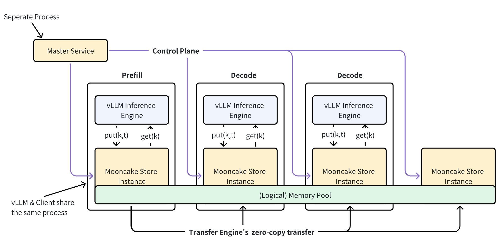

# Mooncake Store

## Introduction

Mooncake Store is a high-performance **distributed key-value (KV) cache storage engine** designed specifically for LLM inference scenarios.

Unlike traditional caching systems such as Redis or Memcached, Mooncake Store is positioned as **a distributed KV cache rather than a generic caching system**. The key difference is that in the latter, the key is derived from the value through hashing, so value is immutable after inserting (although the key/value pair may be evicted).

Mooncake Store provides low-level object storage and management capabilities, including configurable caching and eviction strategies that offer high memory efficiency and is specifically designed to accelerate LLM inference performance.

Key features of Mooncake Store include:
- **Object-level storage operations**: Mooncake Store provides simple and easy-to-use object-level APIs, including `Put`, `Get`, and `Remove` operations.
- **Optional object grouping**: Related objects can carry an optional group ID so that the Master can route their metadata to the same shard and apply best-effort shared lifecycle behavior.
- **Multi-replica support**: Mooncake Store supports storing multiple data replicas for the same object, effectively alleviating hotspots in access pressure. Each slice within an object is guaranteed to be placed in different segments, while different objects' slices may share segments. Replication operates on a best-effort basis.
- **Strong consistency**: Mooncake Store guarantees that `Get` operations always return correct and complete data. Once an object has been successfully `Put`, it remains immutable until removal, ensuring that all subsequent `Get` requests retrieve the most recent value.
- **Zero-copy, bandwidth-saturating transfers**: Powered by the Transfer Engine, Mooncake Store eliminates redundant memory copies and exploits multi-NIC GPUDirect RDMA pooling to drive data across the network at full line rate while keeping CPU overhead negligible.
- **High bandwidth utilization**: Mooncake Store supports striping and parallel I/O transfer of large objects, fully utilizing multi-NIC aggregated bandwidth for high-speed data reads and writes.
- **Dynamic resource scaling**: Mooncake Store supports dynamically adding and removing nodes to flexibly handle changes in system load, achieving elastic resource management.
- **Fault tolerance**: Mooncake store is designed with robust fault tolerance. Failures of any number of master and client nodes will not result in incorrect data being read. As long as at least one master and one client remain operational, Mooncake Store continues to function correctly and serve requests.
- **Multi-layer storage support**​​: Mooncake Store supports offloading cached data from RAM to SSD, further balancing cost and performance to improve storage system efficiency.

## Architecture



As shown in the figure above, there are two key components in Mooncake Store: **Master Service** and **Client**.

**Master Service**: The `Master Service` orchestrates the logical storage space pool across the entire cluster, managing node join and leave events. It is responsible for object space allocation and metadata maintenance. Its memory allocation and eviction strategies are specifically designed and optimized to meet the demands of LLM inference workloads.

The `Master Service` runs as an independent process and exposes RPC services to external components. Note that the `metadata service` required by the `Transfer Engine` (via etcd, Redis, or HTTP, etc.) is not included in the `Master Service` and needs to be deployed separately.

**Client**: In Mooncake Store, the `Client` class is the only class defined to represent the client-side logic, but it serves **two distinct roles**:
1. As a **client**, it is invoked by upper-layer applications to issue `Put`, `Get` and other requests.
2. As a **store server**, it hosts a segment of contiguous memory that contributes to the distributed KV cache, making its memory available to other `Clients`. Data transfer is actually from one `Client` to another, bypassing the `Master Service`.

It is possible to configure a `Client` instance to act in only one of its two roles:
* If `global_segment_size` is set to zero, the instance functions as a **pure client**, issuing requests but not contributing memory to the system.
* If `local_buffer_size` is set to zero, it acts as a **pure server**, providing memory for storage. In this case, request operations such as `Get` or `Put` are not permitted from this instance.

The `Client` can be used in three ways:
1. **Embedded mode**: Runs in the same process as the LLM inference program (e.g., a vLLM instance), by being imported as a shared library. Embedded clients issue requests directly, and when configured with `global_segment_size > 0` they also contribute memory resources to the cluster.
2. **Embedded mode with dummy-real clients**: Each LLM inference **rank** holds an embedded **dummy** client (which holds no resources). Each LLM inference **instance** has one resource-owning **real** client (for example, with TP=8 there can be 8 dummy clients and 1 real client). All dummy clients of the same inference instance forward requests to that one real client. The real client owns the global segment (optionally) and is responsible for RPC handling, memory management, and data transfer. Dummy and real clients communicate via RPC, and use shared memory/zero-copy mechanisms for data transfer, so that the data path remains efficient.
3. **Standalone store service**: A standalone store service (e.g., `python -m mooncake.mooncake_store_service`) wraps a client and provides the global memory/SSD resource pool. With this service, embedded clients can be configured with `global_segment_size = 0` so they contribute network/NIC resources only, while the standalone store service owns memory and storage management. This service can be deployed on the same server as the inference engine or on separate servers.

Mooncake store supports two deployment methods to accommodate different availability requirements:
1. **Default mode**: In this mode, the master service consists of a single master node, which simplifies deployment but introduces a single point of failure. If the master crashes or becomes unreachable, the system cannot continue to serve requests until it is restored.
2. **High availability mode**: This mode enhances fault tolerance by running the master service as a cluster of multiple master nodes coordinated through an etcd cluster. The master nodes use etcd to elect a leader, which is responsible for handling client requests.
If the current leader fails or becomes partitioned from the network, the remaining master nodes automatically perform a new leader election, ensuring continuous availability.

In both modes, the leader monitors the health of all client nodes through periodic heartbeats. If a client crashes or becomes unreachable, the leader quickly detects the failure and takes appropriate action. When a client node recovers or reconnects, it can automatically rejoin the cluster without manual intervention.

(client-c-api)=
## Client C++ API

The `Client` class provides the primary interface for Mooncake Store operations:

| API | Description |
|-----|-------------|
| `Init` | Initialize the client with metadata server, protocol, and master address |
| `Get` | Retrieve object data into pre-registered local memory slices |
| `Put` | Store object data with configurable replication and persistence |
| `Upsert` / `BatchUpsert` | Insert or update with existing placement reuse |
| `Remove` | Delete an object and all its replicas |
| `CreateCopyTask` / `CreateMoveTask` | Asynchronous cross-node data transfer |
| `QueryTask` | Monitor the status of async copy/move tasks |
| `BatchQueryIp` | Discover network locations of storage nodes |
| `BatchReplicaClear` | Batch clear replicas on specific segments |
| `QueryByRegex` / `RemoveByRegex` | Query or delete objects matching a regex |

For full API signatures, parameter details, and usage examples, see the [Mooncake Store C++ API Reference](../api-reference/cpp/mooncake-store.md).

## Master Service

The cluster's available resources are viewed as a large resource pool, managed centrally by a Master process for space allocation and guiding data replication

**Note: The Master Service does not take over any data flow, only providing corresponding metadata information.**

### Snapshot & Restore

To reduce cache warm-up time after a master restart, the Master Service supports periodic snapshots of its in-memory metadata and recovery from these snapshots.

- Snapshot generation
  - A background snapshot thread periodically takes a consistent copy of the in-memory KV metadata, segment information, and allocator state using fork-based copy-on-write, without blocking normal RPC handling.
  - The child process serializes these structures into a compact binary format and writes them to the configured snapshot backend via the `SerializerBackend` abstraction.
- Restore
  - On startup, when snapshot restore is enabled, the master reads the latest snapshot from the backend and reconstructs the Master Service's metadata state in memory.
- Notes
  - Because snapshots are taken periodically rather than continuously, metadata changes after the last successful snapshot may be lost if the master fails before the next snapshot completes.

> **Warning: Managed Storage**
>
> The snapshot storage location is **exclusively managed** by the Mooncake snapshot system. Old snapshots are automatically deleted during cleanup. **DO NOT store other files in this location.** Use a dedicated, isolated storage for snapshots.

### Master Service APIs

The protobuf definition between Master and Client is as follows:

```protobuf
message BufHandle {
  required uint64 segment_name = 1;  // Storage segment name (can be simply understood as the name of the storage node)
  required uint64 size = 2;          // Size of the allocated space
  required uint64 buffer = 3;        // Pointer to the allocated space

  enum BufStatus {
    INIT = 0;          // Initial state, space reserved but not used
    COMPLETE = 1;      // Completed usage, space contains valid data
    FAILED = 2;        // Usage failed, upstream should update the handle state to this value
    UNREGISTERED = 3;  // Space has been unregistered, metadata deleted
  }
  required BufStatus status = 4 [default = INIT]; // Space status
};

message ReplicaInfo {
  repeated BufHandle handles = 1; // Specific locations of the stored object data

  enum ReplicaStatus {
    UNDEFINED = 0;   // Uninitialized
    INITIALIZED = 1; // Space allocated, waiting for write
    PROCESSING = 2;  // Writing data in progress
    COMPLETE = 3;    // Write completed, replica available
    REMOVED = 4;     // Replica has been removed
    FAILED = 5;      // Replica write failed, consider reallocation
  }
  required ReplicaStatus status = 2 [default = UNDEFINED]; // Replica status
};

service MasterService {
  // Get the list of replicas for an object
  rpc GetReplicaList(GetReplicaListRequest) returns (GetReplicaListResponse);

  // Get replica lists for objects matching a regex
  rpc GetReplicaListByRegex(GetReplicaListByRegexRequest) returns (GetReplicaListByRegexResponse);

  // Batch query IP addresses for multiple client IDs
  rpc BatchQueryIp(BatchQueryIpRequest) returns (BatchQueryIpResponse);

  // Batch clear replicas for multiple object keys
  rpc BatchReplicaClear(BatchReplicaClearRequest) returns (BatchReplicaClearResponse);

  // Start Put operation, allocate storage space
  rpc PutStart(PutStartRequest) returns (PutStartResponse);

  // End Put operation, mark object write completion
  rpc PutEnd(PutEndRequest) returns (PutEndResponse);

  // Delete all replicas of an object
  rpc Remove(RemoveRequest) returns (RemoveResponse);

  // Remove objects matching a regex
  rpc RemoveByRegex(RemoveByRegexRequest) returns (RemoveByRegexResponse);

  // Storage node (Client) registers a storage segment
  rpc MountSegment(MountSegmentRequest) returns (MountSegmentResponse);

  // Storage node (Client) unregisters a storage segment
  rpc UnmountSegment(UnmountSegmentRequest) returns (UnmountSegmentResponse);
}
```

1. GetReplicaList

```protobuf
message GetReplicaListRequest {
  required string key = 1;
};

message GetReplicaListResponse {
  required int32 status_code = 1;
  repeated ReplicaInfo replica_list = 2; // List of replica information
};
```

- **Request**: `GetReplicaListRequest` containing the key to query.
- **Response**: `GetReplicaListResponse` containing the status code status_code and the list of replica information `replica_list`.
- **Description**: Used to retrieve information about all available replicas for a specified key. The Client can select an appropriate replica for reading based on this information.

2. GetReplicaListByRegex

```protobuf
message GetReplicaListByRegexRequest {
  required string key_regex = 1;
};

message ObjectReplicaList {
  repeated ReplicaInfo replica_list = 1;
};

message GetReplicaListByRegexResponse {
  required int32 status_code = 1;
  map<string, ObjectReplicaList> object_map = 2; // Matched objects and their replica information.
};
```

- **Request**: GetReplicaListByRegexRequest, which contains the regular expression key_regex to be matched.
- **Response**: GetReplicaListByRegexResponse, which contains a status_code and an object_map. The keys of this map are the successfully matched object keys, and the values are the lists of replica information for each key.
- **Description**: Used to query for all keys and their replica information that match the specified regular expression. This interface facilitates bulk queries and management.

3. BatchQueryIp

```protobuf
message BatchQueryIpRequest {
  repeated UUID client_ids = 1; // List of client IDs to query
};

message BatchQueryIpResponse {
  required int32 status_code = 1;
  map<UUID, IPAddressList> client_ip_map = 2; // Map from client ID to their IP address lists
};

message IPAddressList {
  repeated string ip_addresses = 1; // List of unique IP addresses
};
```

- **Request**: `BatchQueryIpRequest` containing a list of client IDs to query.
- **Response**: `BatchQueryIpResponse` containing the status code `status_code` and a `client_ip_map`. The keys of this map are the client IDs that have successfully mounted segments, and the values are lists of unique IP addresses extracted from all segments mounted by each client. Client IDs that have no mounted segments or are not found are silently skipped and not included in the result map.
- **Description**: Used to batch query the IP addresses for multiple client IDs. For each client ID in the input list, this interface retrieves the unique IP addresses from all segments mounted by that client.

4. BatchReplicaClear

```protobuf
message BatchReplicaClearRequest {
  repeated string object_keys = 1; // List of object keys to clear
  required UUID client_id = 2;     // Client ID that owns the objects
  optional string segment_name = 3; // Optional segment name. If empty, clears all segments
};

message BatchReplicaClearResponse {
  required int32 status_code = 1;
  repeated string cleared_keys = 2; // List of object keys that were successfully cleared
};
```

- **Request**: `BatchReplicaClearRequest` containing a list of object keys to clear, the client ID that owns the objects, and an optional segment name. If `segment_name` is empty, all replicas of the specified objects are cleared (the objects are deleted entirely). If `segment_name` is provided, only replicas located on that specific segment are cleared.
- **Response**: `BatchReplicaClearResponse` containing the status code `status_code` and a list of `cleared_keys` representing the object keys that were successfully cleared. Only objects that belong to the specified `client_id`, have expired leases, and meet the clearing criteria are included in the result. Objects with active leases, incomplete replicas (when clearing all segments), or belonging to different clients are silently skipped.
- **Description**: Used to batch clear replicas for multiple object keys belonging to a specific client ID. This interface allows clearing replicas either on a specific segment or across all segments, providing flexible storage resource management capabilities.

5. PutStart

```protobuf
message PutStartRequest {
  required string key = 1;             // Object key
  required int64 value_length = 2;     // Total length of data to be written
  required ReplicateConfig config = 3; // Replica configuration information
  repeated uint64 slice_lengths = 4;   // Lengths of each data slice
};

message PutStartResponse {
  required int32 status_code = 1;
  repeated ReplicaInfo replica_list = 2;  // Replica information allocated by the Master Service
};
```

- **Request**: `PutStartRequest` containing the key, data length, and replica configuration config.
- **Response**: `PutStartResponse` containing the status code status_code and the allocated replica information replica_list.
- **Description**: Before writing an object, the Client must call PutStart to request storage space from the Master Service. The Master Service allocates space based on the config and returns the allocation results (`replica_list`) to the Client. The allocation strategy ensures that each slice of the object is placed in different segments, while operating on a best-effort basis - if insufficient space is available for all requested replicas, as many replicas as possible will be allocated. The Client then writes data to the storage nodes where the allocated replicas are located. The need for both start and end steps ensures that other Clients do not read partially written values, preventing dirty reads.

6. PutEnd

```protobuf
message PutEndRequest {
  required string key = 1;
};

message PutEndResponse {
  required int32 status_code = 1;
};
```

- **Request**: `PutEndRequest` containing the key.
- **Response**: `PutEndResponse` containing the status code status_code.
- **Description**: After the Client completes data writing, it calls `PutEnd` to notify the Master Service. The Master Service updates the object's metadata, marking the replica status as `COMPLETE`, indicating that the object is readable.

7. Remove

```protobuf
message RemoveRequest {
  required string key = 1;
};

message RemoveResponse {
  required int32 status_code = 1;
};
```

- **Request**: `RemoveRequest` containing the key of the object to be deleted.
- **Response**: `RemoveResponse` containing the status code `status_code`.
- **Description**: Used to delete the object and all its replicas corresponding to the specified key. The Master Service marks all replicas of the corresponding object as deleted.

8. RemoveByRegex

```protobuf
message RemoveByRegexRequest {
  required string key_regex = 1;
};

message RemoveByRegexResponse {
  required int32 status_code = 1;
  optional int64 removed_count = 2; // The number of objects removed.
};
```

- **Request**: RemoveByRegexRequest, which contains the regular expression key_regex to be matched.
- **Response**: RemoveByRegexResponse, which contains a status_code and the number of objects that were removed, removed_count.
- **Description**: Used to delete all objects and their corresponding replicas for keys that match the specified regular expression. Similar to the Remove interface, this is a metadata operation where the Master Service marks the status of all matched object replicas as removed.

9. MountSegment

```protobuf
message MountSegmentRequest {
  required uint64 buffer = 1;       // Starting address of the space
  required uint64 size = 2;         // Size of the space
  required string segment_name = 3; // Storage segment name
}

message MountSegmentResponse {
  required int32 status_code = 1;
};
```

The storage node (Client) allocates a segment of memory and, after calling `TransferEngine::registerLocalMemory` to complete local mounting, calls this interface to mount the allocated continuous address space to the Master Service for allocation.

10. UnmountSegment

```protobuf
message UnmountSegmentRequest {
  required string segment_name = 1;  // Storage segment name used during mounting
}

message UnMountSegmentResponse {
  required int32 status_code = 1;
};
```

When the space needs to be released, this interface is used to remove the previously mounted resources from the Master Service.

### Object Information Maintenance

The Master Service needs to maintain mappings related to buffer allocators and object metadata to efficiently manage memory resources and precisely control replica states in multi-replica scenarios. Additionally, the Master Service uses read-write locks to protect critical data structures, ensuring data consistency and security in multi-threaded environments. The following are the interfaces maintained by the Master Service for storage space information:

- MountSegment

```C++
tl::expected<void, ErrorCode> MountSegment(uint64_t buffer,
                                          uint64_t size,
                                          const std::string& segment_name);
```

The storage node (Client) registers the storage segment space with the Master Service.

- UnmountSegment

```C++
tl::expected<void, ErrorCode> UnmountSegment(const std::string& segment_name);
```

The storage node (Client) unregisters the storage segment space with the Master Service.

The Master Service handles object-related interfaces as follows:

- Put

```C++
    ErrorCode PutStart(const std::string& key,
                       uint64_t value_length,
                       const std::vector<uint64_t>& slice_lengths,
                       const ReplicateConfig& config,
                       std::vector<ReplicaInfo>& replica_list);

    ErrorCode PutEnd(const std::string& key);
```

Before writing an object, the Client calls PutStart to request storage space allocation from the Master Service. After completing data writing, the Client calls PutEnd to notify the Master Service to mark the object write as completed.

- Upsert

```C++
tl::expected<std::vector<Replica::Descriptor>, ErrorCode> UpsertStart(
    const std::string& key,
    const std::vector<size_t>& slice_lengths,
    const ReplicateConfig& config);

std::vector<tl::expected<std::vector<Replica::Descriptor>, ErrorCode>>
BatchUpsertStart(const std::vector<std::string>& keys,
                 const std::vector<std::vector<uint64_t>>& slice_lengths,
                 const ReplicateConfig& config);

tl::expected<void, ErrorCode> UpsertEnd(
    const std::string& key, ReplicaType replica_type);

std::vector<tl::expected<void, ErrorCode>> BatchUpsertEnd(
    const std::vector<std::string>& keys);

tl::expected<void, ErrorCode> UpsertRevoke(
    const std::string& key, ReplicaType replica_type);

std::vector<tl::expected<void, ErrorCode>> BatchUpsertRevoke(
    const std::vector<std::string>& keys);
```

`UpsertStart` / `UpsertEnd` / `UpsertRevoke` mirror the existing put lifecycle
but operate on insert-or-update semantics. If the key does not exist, the flow
behaves like `PutStart`. If the key already exists, the Master may reuse the
current allocation for an in-place update or allocate new space when the object
layout changes. The batch variants provide the same control flow for multiple
keys and are the lower-level primitives used by the high-level `BatchUpsert`
path.

- GetReplicaList

```C++
ErrorCode GetReplicaList(const std::string& key,
                         std::vector<ReplicaInfo>& replica_list);
tl::expected<std::unordered_map<std::string, std::vector<Replica::Descriptor>>, ErrorCode>
GetReplicaListByRegex(const std::string& str);
```

The Client requests the Master Service to retrieve the replica list for a specified key or for all object keys matching a specified regular expression, allowing the Client to select an appropriate replica for reading based on this information.

- Remove

```C++
tl::expected<void, ErrorCode> Remove(const std::string& key);
tl::expected<long, ErrorCode> RemoveByRegex(const std::string& str);
```

The Client requests the Master Service to delete all replicas corresponding to the specified key or for all object keys that match the specified regular expression.

### Optional Object Groups

Object groups are intended for workloads where one logical cache entry is split into multiple Mooncake Store objects, such as separate K/V tensors, parallel shards, or auxiliary index objects. Without grouping, these objects are managed independently, so lease refresh and memory eviction may affect different parts of the same logical entry at different times.

Mooncake Store remains an object-oriented KV cache: objects are still put, queried, and removed by key. For workloads where one logical cache unit is represented by multiple physical objects, callers may attach optional group metadata through `ReplicateConfig::group_ids` during `Put`, `BatchPut`, `Upsert`, or `BatchUpsert`.

For single-object writes, `group_ids` contains one entry. For batch writes, it must have the same length as the key list, and entry `i` is the group ID for key `i`. An empty string stores that key as ungrouped, and leaving the field unset preserves the legacy ungrouped behavior. For an existing object, group membership is immutable: `Upsert` may preserve the existing group, but it cannot move the object to another group or clear its group while the object exists.

On the Master side, group state is tenant-scoped. Objects with a non-empty group ID are routed to the metadata shard selected by `hash(group_id)`, and the Master keeps a tenant-scoped object-to-group routing index so existing key-based APIs can still locate grouped objects. The Master tracks only the current member set of each group; it does not require an expected member count, a member index, or a commit protocol for group completeness.

Group metadata affects lifecycle behavior on a best-effort basis:

- `ExistKey` and `GetReplicaList` refresh the lease, and the soft-pin timeout if present, for the current members of the group.
- Memory eviction expands a grouped candidate to the group's current members and then applies the existing per-object safety checks. Members with active leases, hard pins, soft pins when soft-pin eviction is disabled, incomplete writes, busy replicas, or unavailable replica states are skipped.
- Object removal APIs, copy/move tasks, and NoF eviction keep their existing object-level semantics. Group routing and membership metadata are cleaned up when objects are removed.

This design is intentionally lightweight and backward compatible. Grouping should be treated as a lifecycle hint for related objects, not as a transactional guarantee that all members are created, made visible, or evicted atomically.

## Buffer Allocator

The buffer allocator serves as a low-level memory management component within the Mooncake Store system, primarily responsible for efficient memory allocation and deallocation. It builds upon underlying memory allocators to perform its functions.

Importantly, the memory managed by the buffer allocator does not reside within the `Master Service` itself. Instead, it operates on memory segments registered by `Clients`. When the `Master Service` receives a `MountSegment` request to register a contiguous memory region, it creates a corresponding buffer allocator via the `AddSegment` interface.

Mooncake Store provides two concrete implementations of `BufferAllocatorBase`:

**OffsetBufferAllocator (default and recommended)**: This allocator is derived from [OffsetAllocator](https://github.com/sebbbi/OffsetAllocator), which uses a custom bin-based allocation strategy that supports fast hard realtime `O(1)` offset allocation with minimal fragmentation. Mooncake Store optimizes this allocator based on the specific memory usage characteristics of LLM inference workloads, thereby enhancing memory utilization in LLM scenarios.

For measured utilization and allocation latency across LLM-style workloads, see [Allocator Performance](../performance/allocator-benchmark-result.md).

**CachelibBufferAllocator (deprecated)**: This allocator leverages Facebook's [CacheLib](https://github.com/facebook/CacheLib) to manage memory using a slab-based allocation strategy. It provides efficient memory allocation with good fragmentation resistance and is well-suited for high-performance scenarios. However, in our modified version, it does not handle workloads with highly variable object sizes effectively, so it is currently marked as deprecated.

Users can choose the allocator that best matches their performance and memory usage requirements through the `--memory-allocator` startup parameter of `master_service`.

Both allocators implement the same interface as `BufferAllocatorBase`. The main interfaces of the `BufferAllocatorBase` class are as follows:

```C++
class BufferAllocatorBase {
    virtual ~BufferAllocatorBase() = default;
    virtual std::unique_ptr<AllocatedBuffer> allocate(size_t size) = 0;
    virtual void deallocate(AllocatedBuffer* handle) = 0;
};
```

1. **Constructor**: When a `BufferAllocator` instance is created, the upstream component must provide the base address and size of the memory region to be managed. This information is used to initialize the internal allocator, enabling unified memory management.

2. **`allocate` Function**: When the upstream issues read or write requests, it needs a memory region to operate on. The `allocate` function invokes the internal allocator to reserve a memory block and returns metadata such as the starting address and size. The status of the newly allocated memory is initialized as `BufStatus::INIT`.

3. **`deallocate` Function**: This function is automatically triggered by the `BufHandle` destructor. It calls the internal allocator to release the associated memory and updates the handle’s status to `BufStatus::UNREGISTERED`.

### Client Local Buffer and Python BufferPool

Each Store client can also create a setup-time local buffer through `local_buffer_size`. This memory is registered once with the Transfer Engine and managed by `ClientBufferAllocator` for short-lived client-side staging work.

The Python `BufferPool` reuses this existing local buffer instead of allocating a second registered arena. A pool lease is a sub-allocation from `client_buffer_allocator_`, so the common path avoids per-lease `register_buffer()` and `unregister_buffer()` calls. The pool still keeps the Python-facing lease API, memoryview lifetime checks, blocking acquire semantics, and optional `max_regions` concurrency limiting.

This is a soft-isolation policy: internal Store paths and external Python leases share the local registered buffer, allowing bursty external usage when memory is available rather than reserving a hard partition. If the local buffer is temporarily exhausted, `BufferPool` can allocate and register a short-lived overflow buffer so bursts do not immediately surface as upper-layer errors; that overflow region is unregistered as soon as the lease is released. If callers need to cap long-lived external pressure, they should use pool-level controls such as `max_regions`, `max_bytes`, or acquire timeouts.

## AllocationStrategy
AllocationStrategy is a strategy class for efficiently managing memory resource allocation and replica storage location selection in a distributed environment. It is mainly used in the following scenarios:
- Determining the allocation locations for object storage replicas.
- Selecting suitable read/write paths among multiple replicas.
- Providing decision support for resource load balancing between nodes in distributed storage.

AllocationStrategy is used in conjunction with the Master Service and the underlying buffer allocator:
- Master Service: Determines the target locations for replica allocation via `AllocationStrategy`.
- Buffer Allocator: Executes the actual memory allocation and release tasks.

### APIs

`Allocate`: Finds suitable storage segments from available storage resources to allocate space of a specified size for multiple replicas. Uses best-effort semantics, meaning it allocates as many replicas as possible even if the full requested count cannot be satisfied.

```C++
virtual tl::expected<std::vector<Replica>, ErrorCode> Allocate(
        const AllocatorManager& allocator_manager, const size_t slice_length,
        const size_t replica_num = 1,
        const std::vector<std::string>& preferred_segments = std::vector<std::string>(),
        const std::set<std::string> excluded_segments = std::set<std::string>()) = 0;
```

- **Input Parameters**:
  - `allocator_manager`: The allocator manager that manages the allocators to use
  - `slice_length`: Length of the slice to be allocated
  - `replica_num`: Number of replicas to allocate (default: 1)
  - `preferred_segments`: Preferred segments to allocate buffers from (default: empty vector)
  - `excluded_segments`: Excluded segments that should not allocate buffers from (default: empty set)
- **Output**: Returns tl::expected containing either:
  - On success: vector of allocated replicas (may be fewer than requested due to resource constraints, but at least 1)
  - On failure: ErrorCode::NO_AVAILABLE_HANDLE if no replicas can be allocated, ErrorCode::INVALID_PARAMS for invalid configuration

### Allocation Strategies

Mooncake Store provides multiple built-in allocation strategies to control how storage space is distributed across segments. Users can select a strategy via the `--allocation_strategy` flag when starting the master service:

```bash
./build/mooncake-store/src/mooncake_master --allocation_strategy=free_ratio_first
```

Valid values are: `random` (default), `free_ratio_first`, `cxl` (case-sensitive).

#### How to Choose

| Strategy | Best For | Trade-off |
|---|---|---|
| `random` | Maximum throughput, stable clusters | Limited load balancing; slow convergence when new segments join |
| `free_ratio_first` | Balanced utilization, dynamic scaling | Slightly lower throughput due to sampling and sorting overhead |
| `cxl` | CXL memory hardware | CXL-specific; single-replica only |

**Use `random`** (default) when your cluster is relatively stable (segments rarely join or leave) and you want the highest possible allocation throughput.

**Use `free_ratio_first`** when you need better load balancing across segments, especially in scenarios where:
- Segments have different capacities and you want even utilization ratios.
- New segments are dynamically added at runtime and you need them to absorb load quickly. With `random`, convergence to a well-balanced state can be slow on large or dynamic clusters; `free_ratio_first` accelerates this by preferentially filling emptier segments, substantially increasing the likelihood that newly joined segments are selected for allocations (see details below).

**Use `cxl`** only when your hardware includes CXL (Compute Express Link) memory devices and you want to allocate data exclusively on CXL segments.

For benchmark data comparing `random` and `free_ratio_first` across segment counts, replica counts, and skewed capacities, see [AllocationStrategy Performance](../performance/allocation-strategy-benchmark-result.md).

#### Strategy Details

**`random` — RandomAllocationStrategy**

Pure random allocation with preferred segment support. The allocation process for N replicas is:

1. **Preferred segment phase**: If preferred segments are specified in the `ReplicateConfig`, they are tried first in order. Each successful allocation consumes one replica slot. If all replicas are satisfied, the process finishes early.
2. **Random phase**: For any remaining replicas, a random starting index is chosen among all available segments. The strategy then iterates consecutively from that index, attempting to allocate from each segment. Segments already used for a previous replica of the same slice, as well as explicitly excluded segments, are skipped to guarantee that each replica resides on a different segment.
3. **Retry limit**: The iteration is capped at `min(100, total_segments)` to avoid excessive scanning when most segments are full.
4. **Best-effort result**: If fewer than N replicas are allocated but at least one succeeds, the partial result is returned. The call fails only if zero replicas can be allocated.

All random state uses a thread-local Mersenne Twister (`std::mt19937`), so no locks or shared mutable data are involved.

**`free_ratio_first` — FreeRatioFirstAllocationStrategy (Best-of-N)**

An improved strategy built on top of `RandomAllocationStrategy`. Instead of picking segments purely at random, it samples a small pool of candidates and selects the ones with the most free space. The allocation process for N replicas is:

1. **Preferred segment phase**: Same as `random` — preferred segments are tried first in order.
2. **Sampling phase**: Randomly picks a starting index and takes `min(6*remaining_replicas, total_segments)` consecutive segments as candidates. For each candidate, queries its free space ratio: `free_bytes / total_capacity`.
3. **Sorting phase**: Sorts the candidates in descending order by free space ratio (most free first).
4. **Allocation phase**: Iterates through the sorted candidates from top to bottom, attempting to allocate from each. Excluded and already-used segments are skipped.
5. **Fallback phase**: If insufficient replicas are allocated from the sorted candidates, falls back to the base `RandomAllocationStrategy` random iteration logic for the remaining replicas.

The overhead is minimal: sampling is `O(K)` and sorting is `O(K log K)`, where K is the candidate count (at most `6*N`) — both small since `replica_num` is typically 1–3. The strategy is thread-safe, using `thread_local` random state with no shared mutable data.

The key insight behind Best-of-N is that if a new/empty segment is sampled, it will almost certainly be ranked first due to having the highest free ratio, which naturally accelerates convergence when new segments join the cluster.

**`cxl` — CxlAllocationStrategy**

Specialized for CXL (Compute Express Link) memory hardware. Unlike the other strategies, this one does not perform random or load-balanced selection — it always allocates from a specific CXL segment:

1. Requires `preferred_segments` to be non-empty; the first element is used as the target CXL segment name.
2. Allocates a single replica from the specified CXL segment's allocator.
3. Marks the allocated buffer as CXL type via `change_to_cxl()`, so downstream components can distinguish CXL-backed data from regular DRAM.

Limitations: This strategy only supports single-replica allocation (does not distribute across multiple segments) and does not support the `AllocateFrom()` interface.

## Eviction Policy

When a `PutStart` request fails due to insufficient memory, or when the eviction thread detects that space usage has reached the configured high watermark (95% by default, configurable via `-eviction_high_watermark_ratio`), an eviction task is triggered to free up space by evicting a portion of objects (5% by default, configurable via `-eviction_ratio`). Similar to `Remove`, evicted objects are simply marked as deleted, with no data transfer required.

Currently, an approximate LRU policy is adopted, where the least recently used objects are preferred for eviction. To avoid data races and corruption, objects currently being read or written by clients should not be evicted. For this reason, objects that have leases or have not been marked as complete by `PutEnd` requests will be ignored by the eviction task.

For grouped objects, memory eviction resolves the current group membership and attempts to reclaim eligible members together.

## Lease

To avoid data conflicts, a per-object lease is granted whenever an `ExistKey` request or a `GetReplicaListRequest` request succeeds. While the lease is active, the object is protected from `Remove`, `RemoveAll`, and `Eviction` operations. Specifically, a `Remove` request targeting a leased object will fail, and a `RemoveAll` request will only delete objects without an active lease. This ensures that the object’s data can be safely read as long as the lease has not expired.

For grouped objects, a successful `ExistKey` or `GetReplicaList` refreshes the lease for the current members of the group, so recently accessed members are less likely to be separated by memory eviction.

However, if the lease expires before a `Get` operation finishes reading the data, the operation will be considered failed, and no data will be returned, in order to prevent potential data corruption.

The default lease TTL is 5 seconds and is configurable via a startup parameter of `master_service`.

## Soft Pin

For important and frequently used objects, such as system prompts, Mooncake Store provides a soft pin mechanism. When putting an object, it can be configured to enable soft pin. During eviction, objects that are not soft pinned are prioritized for eviction. Soft pinned objects are only evicted when memory is insufficient and no other objects are eligible for eviction.

If a soft pinned object is not accessed for an extended period, its soft pin status will be removed. If it is accessed again later, it will automatically be soft pinned once more.

There are two startup parameters in `master_service` related to the soft pin mechanism:

- `default_kv_soft_pin_ttl`: The duration (in milliseconds) after which a soft pinned object will have its soft pin status removed if not accessed. The default value is `30 minutes`.

- `allow_evict_soft_pinned_objects`: Whether soft pinned objects are allowed to be evicted. The default value is `true`.

Notably, soft pinned objects can still be removed using APIs such as `Remove` or `RemoveAll`.

## Hard Pin

For objects that must never be evicted under any circumstances (e.g., model weights, critical metadata), Mooncake Store provides a hard pin mechanism. Unlike soft pin, hard-pinned objects are permanently protected from eviction — they will never be selected as eviction candidates regardless of memory pressure.

Hard pin is set at object creation time through the `with_hard_pin` field in `ReplicateConfig` and cannot be changed afterward. Hard-pinned objects can only be removed explicitly via `Remove` (with force) or `RemoveAll`.

Key differences from soft pin:

- Hard pin never expires. Soft pin status is removed after a configurable TTL if the object is not accessed.
- Hard-pinned objects are completely skipped during eviction. Soft-pinned objects may still be evicted when no other candidates are available.
- Hard pin is immutable once set. Soft pin status is automatically refreshed on access.

## Store Agent Hints

Mooncake Store can attach optional agent-workflow metadata to an object through
`ReplicateConfig::agent_hints`:

```cpp
struct AgentHints {
    std::string workflow_id{};
    std::string agent_id{};
    std::string step_id{};
    int64_t step_index{0};
    int64_t total_steps{0};
    std::string parent_step_id{};
    std::vector<std::string> children_step_ids{};
    std::string tool_name{};
    int64_t expected_tool_duration_ms{0};
    int64_t cache_ttl_ms{0};
    std::string shared_prefix_hash{};
    std::string reuse_hint{"neutral"};
};
```

The initial Store-side behavior is intentionally narrow: `reuse_hint="keep"`
maps to the existing soft-pin retention path, and `cache_ttl_ms` can extend the
soft-pin timeout. `reuse_hint="neutral"` and `reuse_hint="discard"` do not add
retention by themselves. `workflow_id` remains an annotation in this layer and
is not mapped to `group_ids`, because groups also affect sharding, lease refresh,
and grouped eviction.

## Zombie Object Cleanup

If a Client crashes or experiences a network failure after sending a `PutStart` request but before it can send the corresponding `PutEnd` or `PutRevoke` request to the Master, the object initiated by `PutStart` enters a "zombie" state—rendering it neither usable nor deletable. The existence of such "zombie objects" not only consumes storage space but also prevents subsequent `Put` operations on the same keys. To mitigate these issues, the Master records the start time of each `PutStart` request and employs two timeout thresholds—`put_start_discard_timeout` and `put_start_release_timeout`—to clean up zombie objects.

### `PutStart` Preemption

If an object receives neither a `PutEnd` nor a `PutRevoke` request within `put_start_discard_timeout` (default: 30 seconds) after its `PutStart`, any subsequent `PutStart` request for the same object will be allowed to "preempt" the previous `PutStart`. This enables the new request to proceed with writing the object, thereby preventing a single faulty Client from permanently blocking access to that object. Note that during such preemption, the storage space allocated by the old `PutStart` is not reused; instead, new space is allocated for the preempting `PutStart`. The space previously allocated by the old `PutStart` will be reclaimed via the mechanism described below.

### Space Reclaim

Replica space allocated during a `PutStart` is considered releasable by the Master if the write operation is neither completed (via `PutEnd`) nor canceled (via `PutRevoke`) within `put_start_release_timeout` (default: 10 minutes) after the `PutStart`. When object eviction is triggered—either due to allocation failures or because storage utilization exceeds the configured threshold—these releasable replica spaces are prioritized for release to reclaim storage capacity.

## Preferred Segment Allocation

Mooncake Store provides a **preferred segment allocation** feature that allows users to specify a preferred storage segment (node) for object allocation. This feature is particularly useful for optimizing data locality and reducing network overhead in distributed scenarios.

### How It Works

The preferred segment allocation feature is implemented through the `AllocationStrategy` system and is controlled via the `preferred_segment` field in the `ReplicateConfig` structure:

```cpp
struct ReplicateConfig {
    size_t replica_num{1};                    // Total number of replicas for the object
    bool with_soft_pin{false};               // Whether to enable soft pin mechanism for this object
    bool with_hard_pin{false};               // Whether to enable hard pin (never evicted)
    std::string preferred_segment{};         // Preferred segment for allocation
};
```

When a `Put` operation is initiated with a non-empty `preferred_segment` value, the allocation strategy follows this process:

1. **Preferred Allocation Attempt**: The system first attempts to allocate space from the specified preferred segment. If the preferred segment has sufficient available space, the allocation succeeds immediately.

2. **Fallback to Random Allocation**: If the preferred segment is unavailable, full, or doesn't exist, the system automatically falls back to the standard random allocation strategy among all available segments.

3. **Retry Logic**: The allocation strategy includes built-in retry mechanisms with up to 10 attempts to find suitable storage space across different segments.

- **Data Locality**: By preferring local segments, applications can reduce network traffic and improve access performance for frequently used data.
- **Load Balancing**: Applications can distribute data across specific nodes to achieve better load distribution.

## Multi-layer Storage Support

This system provides support for a hierarchical cache architecture, enabling efficient data access through a combination of in-memory caching and persistent storage. Data is initially stored in memory cache and asynchronously backed up to a Distributed File System (DFS), forming a two-tier "memory-SSD persistent storage" cache structure.

### Enabling Persistence Functionality

When the user specifies `--root_fs_dir=/path/to/dir` when starting the master, and this path is a valid DFS-mounted directory on all machines where the clients reside, Mooncake Store's tiered caching functionality will work properly. Additionally, during master initialization, a `cluster_id` is loaded. This ID can be specified during master initialization (`--cluster_id=xxxx`). If not specified, the default value `mooncake_cluster` will be used. Subsequently, the root directory for client persistence will be `<root_fs_dir>/<cluster_id>`.

​Note​​: When enabling this feature, the user must ensure that the DFS-mounted directory (`root_fs_dir=/path/to/dir`) is valid and consistent across all client hosts. If some clients have invalid or incorrect mount paths, it may cause abnormal behavior in Mooncake Store.

### Persistent Storage Space Configuration​
Mooncake provides configurable DFS available space. Users can specify `--global_file_segment_size=1048576` when starting the master, indicating a maximum usable space of 1MB on DFS.
The current default setting is the maximum value of int64 (as we generally do not restrict DFS storage usage), which is displayed as `infinite` in `mooncake_maseter`'s console logs.
**Notice**  The DFS cache space configuration must be used together with the `--root_fs_dir` parameter. Otherwise, you will observe that the `SSD Storage` usage consistently shows: `0 B / 0 B`
**Notice** The capability for file eviction on DFS has not been provided yet

### Data Access Mechanism

The persistence feature also follows Mooncake Store's design principle of separating control flow from data flow. The read/write operations of kvcache objects are completed on the client side, while the query and management functions of kvcache objects are handled on the master side. In the file system, the key -> kvcache object index information is maintained by a fixed indexing mechanism, with each file corresponding to one kvcache object (the filename serves as the associated key name).

After enabling the persistence feature:

- For each `Put` or `BatchPut` operation, both a synchronous memory pool write operation and an asynchronous DFS persistence operation will be initiated.
- For each `Get` or `BatchGet` operation, if the corresponding kvcache is not found in the memory pool, the system will attempt to read the file data from DFS and return it to the user.

### 3FS USRBIO Plugin (Experimental)

```{note}
This integration is **experimental** and incomplete; see the plugin page for details before relying on it.
```

If you need to use 3FS's native API (USRBIO) to achieve high-performance persistent file reads and writes, you can refer to the configuration instructions in this document [3FS USRBIO Plugin](../getting_started/plugin-usage/3FS-USRBIO-Plugin.md).

## Builtin Metadata Server
Mooncake Store provides a built-in HTTP metadata server as an alternative to etcd for storing cluster metadata. This feature is particularly useful for development environments or scenarios where etcd is not available.
### Configuration Parameters
The HTTP metadata server can be configured using the following parameters:
- **`enable_http_metadata_server`** (boolean, default: `false`): Enables the built-in HTTP metadata server instead of using etcd. When set to `true`, the master service will start an embedded HTTP server that handles metadata operations.
- **`http_metadata_server_port`** (integer, default: `8080`): Specifies the TCP port on which the HTTP metadata server will listen for incoming connections. This port must be available and not conflict with other services.
- **`http_metadata_server_host`** (string, default: `"0.0.0.0"`): Specifies the host address for the HTTP metadata server to bind to. Use `"0.0.0.0"` to listen on all available network interfaces, or specify a specific IP address for security purposes.
### Environment Variables
- MC_STORE_CLUSTER_ID: Identify the metadata when multiple cluster share the same master, default 'mooncake'.
- MC_STORE_MEMCPY: Enables or disables local memcpy optimization, set to 1/true to enable, 0/false to disable.
- MC_STORE_CLIENT_METRIC: Enables client metric reporting, enabled by default; set to 0/false to disable.
- MC_STORE_CLIENT_METRIC_INTERVAL: Reporting interval in seconds, default 0 (collects but does not report).
- MC_STORE_CLIENT_MIN_PORT: Minimum local port for client connections (default 12300). Must be in range 1024–32767 or 61000–65535; falls back to default on invalid input.
- MC_STORE_CLIENT_MAX_PORT: Maximum local port for client connections (default 14300). Same range constraints; must be ≥ MC_STORE_CLIENT_MIN_PORT.
- MC_STORE_USE_HUGEPAGE: Enables huge page support, disabled by default.
- MC_STORE_HUGEPAGE_SIZE: Specifies the page size of the huge page to use, default 2M.
- MC_MMAP_ARENA_POOL_SIZE: Size of the pre-allocated arena pool for mmap buffer allocations. Accepts human-readable sizes (e.g., `"8gb"`, `"20gb"`). Providing this variable explicitly enables the arena; when enabled via gflag without an env override, the default pool size is `8gb`. The arena is allocated once at first use and serves subsequent allocations via lock-free atomic bump pointer (~50ns per allocation vs ~1000ns for direct mmap).
- MC_DISABLE_MMAP_ARENA: Set to `1` to disable the arena allocator and fall back to per-call `mmap()`, even if the arena was explicitly requested. Also accepts `true`, `yes`, or `on`. This must be set before the first Mooncake mmap-buffer allocation in the process. Useful for debugging or memory-constrained environments where pre-allocating a pool is not desirable.
### Usage Example
To start the master service with the HTTP metadata server enabled:
```bash
./build/mooncake-store/src/mooncake_master \
    --enable_http_metadata_server=true \
    --http_metadata_server_port=8080 \
    --http_metadata_server_host=0.0.0.0
```
When enabled, the HTTP metadata server will start automatically and provide metadata services for the Mooncake Store cluster. This eliminates the need for an external etcd deployment, simplifying the setup process for development and testing environments.
Note that the HTTP metadata server is designed for single-node deployments and does not provide the high availability features that etcd offers. For production environments requiring high availability, etcd is still the recommended choice.

For detailed guidance on monitoring master metrics, Prometheus endpoints, and health checks, see the [Observability guide](../getting_started/observability.md).

## Mooncake Store Python API

**Complete Python API Documentation**: [https://kvcache-ai.github.io/Mooncake/python-api-reference/mooncake-store.html](https://kvcache-ai.github.io/Mooncake/python-api-reference/mooncake-store.html)

## Version Management Policy

The current version of Mooncake Store is defined in [`CMakeLists.txt`](gh-file:mooncake-store/CMakeLists.txt) as `project(MooncakeStore VERSION 2.0.0)`.

When to bump the version:

* **Major version (X.0.0)**: For breaking API changes, major architectural changes, or significant new features that affect backward compatibility
* **Minor version (0.X.0)**: For new features, API additions, or notable improvements that maintain backward compatibility
* **Patch version (0.0.X)**: For bug fixes, performance optimizations, or minor improvements that don't affect the API


---

:::{toctree}
:caption: Related Design Docs
:maxdepth: 1

ssd-offload
:::
