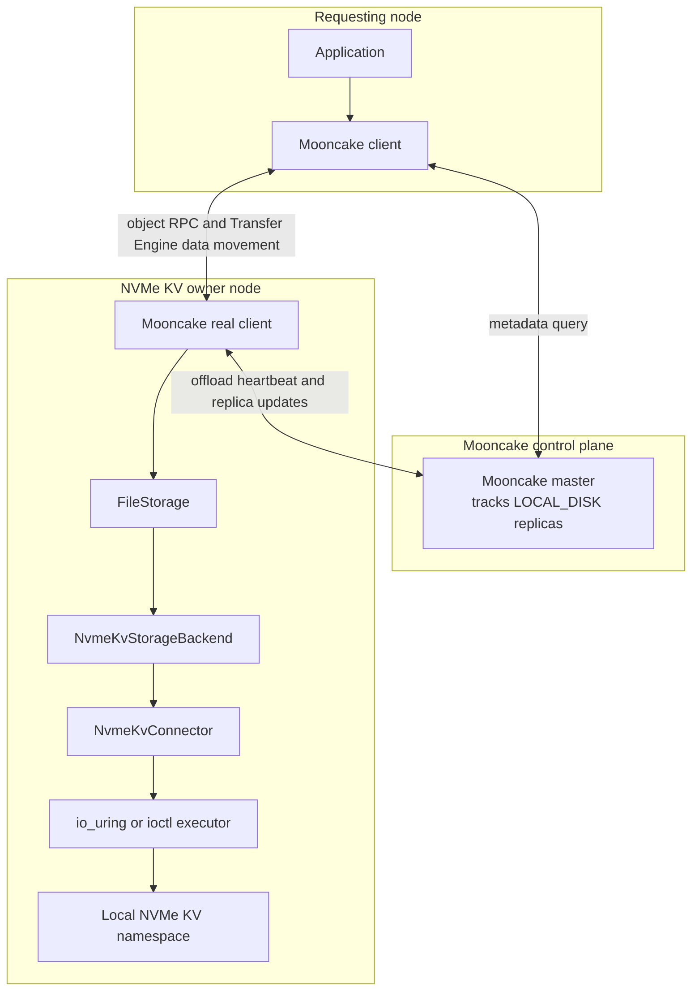
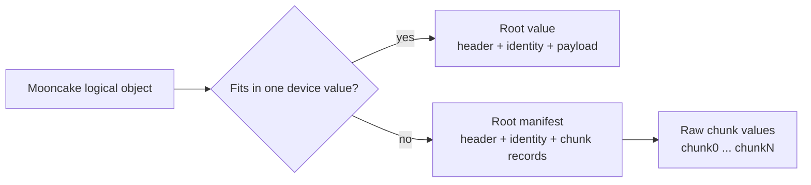
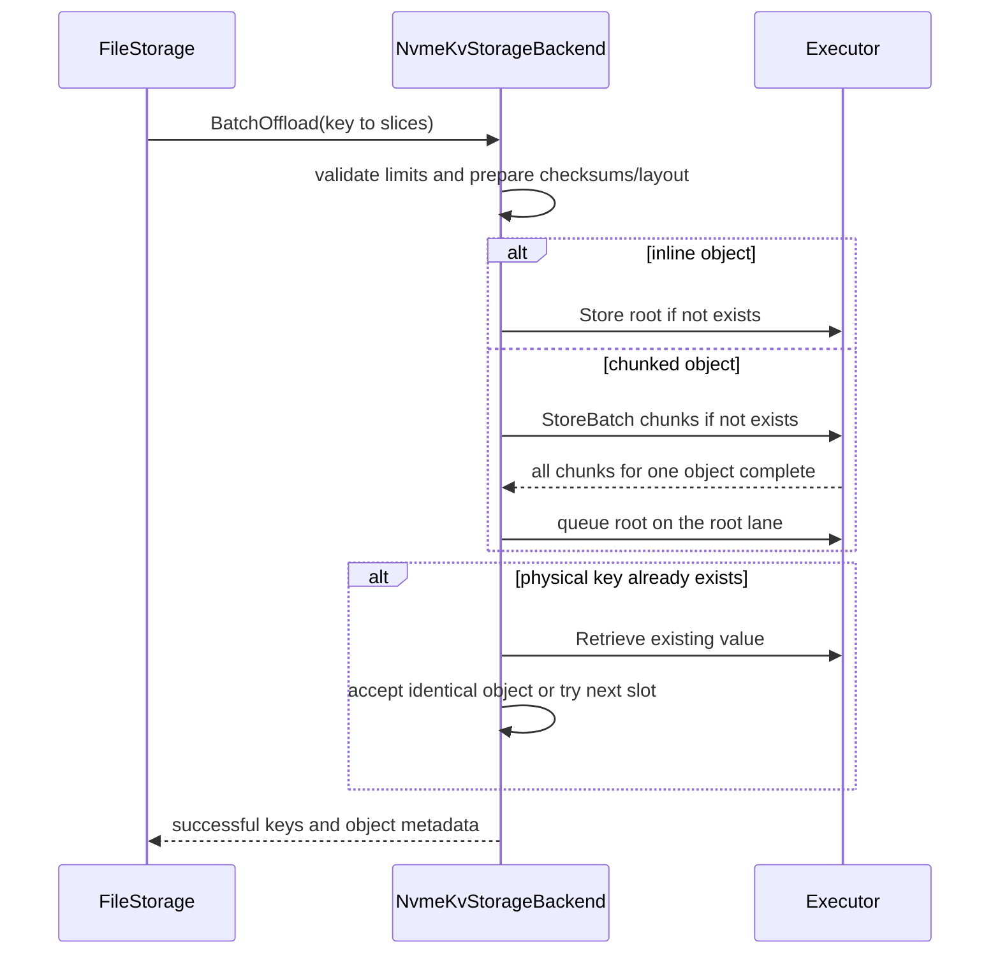

# NVMe KV Backend Design

## Overview

The NVMe KV backend extends Mooncake Store's node-local SSD offload path with an NVMe Key-Value namespace. It preserves Mooncake's logical object API while translating variable-length logical keys and values into fixed-size NVMe KV keys and bounded device values.

The implementation separates object semantics from command transport. `NvmeKvStorageBackend` owns logical object layout, integrity validation, key-conflict handling, and batched I/O orchestration. `NvmeKvConnector` binds one configured device to one executor. `NvmeKvCommandExecutor` submits Store, Retrieve, and Delete commands through io_uring or ioctl.

## Design Goals

- Integrate one node-local NVMe KV namespace with the existing SSD offload flow.
- Preserve object identity and integrity with placement validation and checksums.
- Support logical objects larger than one device value.
- Use store-if-not-exists for idempotent writes and explicit hash-collision handling.
- Overlap object preparation, chunk submission, and root submission with bounded concurrency.
- Use io_uring when available and ioctl as an initialization fallback.

## Architecture



The master records the object as a `LOCAL_DISK` replica owned by a real client. NVMe KV commands remain local to that client.

## Layer Responsibilities

| Layer | Responsibilities |
|------|------------------|
| `FileStorage` | Obtains memory slices, invokes the backend, reports successful replicas, and serves remote SSD reads. |
| `NvmeKvStorageBackend` | Builds object layouts, applies key-conflict policy, coordinates bounded batch I/O, and verifies data returned by the device. |
| `NvmeKvConnector` | Resolves the configured device, selects one executor during initialization, and forwards commands. |
| `NvmeKvCommandExecutor` | Encodes and submits NVMe KV Store, Retrieve, and Delete commands while owning transport-specific buffers and completion handling. |
| NVMe KV namespace | Executes commands submitted through the Linux device node. |

## Physical Keys and Conflicts

NVMe KV namespaces expose key/value limits through their KV format, including
the maximum key length and maximum value length supported by the namespace.
Command completion can also report invalid key or value sizes. Mooncake logical
keys are variable-length strings, so they cannot be passed to the device
unchanged.

NVMe KV commands use a 16-byte physical key, while Mooncake logical keys can be longer. The key codec derives root and chunk keys from the complete logical key, object role, chunk index, and conflict slot. Two independently seeded XXH64 values form the physical key, and four independently seeded XXH64 values form the identity verification hash stored in the root header. No logical-key byte is reserved or discarded.

The backend tries at most 64 conflict slots. Every Store uses store-if-not-exists. When a physical key already exists, the backend retrieves the value and compares it with the expected bytes. Identical bytes mean the same object and make the operation idempotently successful. Different bytes mean a physical-key collision, so the backend tries the next slot. Other device errors are returned to `FileStorage`.

Reads derive the same root keys and probe conflict slots until the stored logical identity matches the requested key. Placement metadata in the root must agree with both the observed physical key and the selected slot.

## Object Layout

The value side has the same shape constraint. Mooncake objects can be larger
than one NVMe KV value, while each Store or Retrieve must stay within the
effective value limit derived from the protocol/device ceiling, runtime
transfer limit, and transfer alignment. Chunking exists to adapt Mooncake's
logical object size to that bounded value model.



An inline root contains `NvmeKvObjectHeader`, stored identity metadata, and the logical payload. The header records object type, payload size, identity verification hash, payload checksum, header checksum, and identity metadata size.

A larger object is split into raw chunk values followed by one root manifest. Each manifest record stores the physical chunk key, chunk size, and checksum. The root manifest is written only after all chunks for that object complete successfully, so the root acts as the visibility marker. The manifest itself must fit in one device value.

## Write Path



Preparation workers build payload views, checksums, chunks, and root manifests while independent submission lanes issue device commands. Chunk lanes feed completed objects to a dedicated root lane instead of waiting for every object in the batch. Worker counts and command batches are bounded by the configured concurrency budget and executor queue depth.

On failure, the backend best-effort deletes only keys created by the current attempt. Pre-existing values accepted as the same object are never deleted.

## Read Path

For each requested logical key, the backend derives and validates its root object. Inline payloads are checksum-verified and copied directly to the destination. Manifest roots are validated and converted into chunk records and destination offsets for the current request.

Chunk reads are grouped into bounded tasks. When the selected executor supports direct destination reads, aligned destinations use `RetrieveIntoBatch` so the device can read directly into the Mooncake buffer. Other destinations, and executors that use the default batch implementation, use executor-owned buffers through `RetrieveBufferBatch` followed by a validated copy. Header, identity, placement, manifest, payload, and every chunk checksum are verified before the operation returns.

## Executor Design

### Common command layer

Common utilities own physical-key packing, NVMe KV opcodes, Store/Retrieve/Delete command construction, transfer rounding, aligned buffer allocation, status mapping, and capability calculation. The effective value limit is:

```text
round_down(min(protocol_max_value_size, runtime_transfer_limit),
           transfer_alignment)
```

### io_uring

The io_uring executor uses a thread-local ring and NVMe uring commands with 128-byte SQEs. It requests CQE32 for command results and retries initialization without CQE32 when the kernel does not support it.

Batch submission maintains a bounded number of commands in flight, drains available CQEs, and refills released SQEs immediately. A generation token plus command index in `user_data` rejects stale, duplicate, and out-of-batch completions. Request buffers remain alive until all accepted commands complete. On partial submission failure, the executor drains commands already accepted by the kernel before resetting the ring.

### ioctl

The ioctl executor builds the same command fields in `nvme_passthru_cmd` and submits them through `NVME_IOCTL_IO_CMD`. Calls are synchronous within one backend worker, while the backend worker pool provides parallelism across requests.

### Selection

`auto` tries io_uring first when compiled in and falls back to ioctl only if io_uring initialization fails. Runtime command failures are returned without changing transports. Explicit `io_uring` and `ioctl` modes fail initialization when the requested executor cannot be created.

## Concurrency and Ownership

- Backend worker pools bound object preparation, chunk submission, root submission, and fallback I/O.
- io_uring rings are thread-local, avoiding a shared hot-path ring lock.
- Batch APIs are synchronous at their boundary, so request arrays and DMA buffers outlive all command completions.
- Direct reads verify checksums in the destination buffer after completion.
- Root submission for a chunked object occurs only after its chunks finish successfully.

## Failure Semantics

| Condition | Behavior |
|----------|----------|
| Key not found | Return `OBJECT_NOT_FOUND`. |
| Store-if-not-exists finds identical bytes | Treat as idempotent success. |
| Store-if-not-exists finds different bytes | Treat as a physical-key collision and try the next slot. |
| Header, identity, placement, manifest, or checksum failure | Return `FILE_READ_FAIL`. |
| Partial chunk write | Best-effort cleanup of keys created by the failed attempt. |
| io_uring submission or completion anomaly | Drain accepted commands, reset the thread-local ring, and fail the operation. |
| io_uring initialization failure in `auto` mode | Try ioctl. |
| Runtime device I/O failure | Return the mapped error without transport fallback. |
