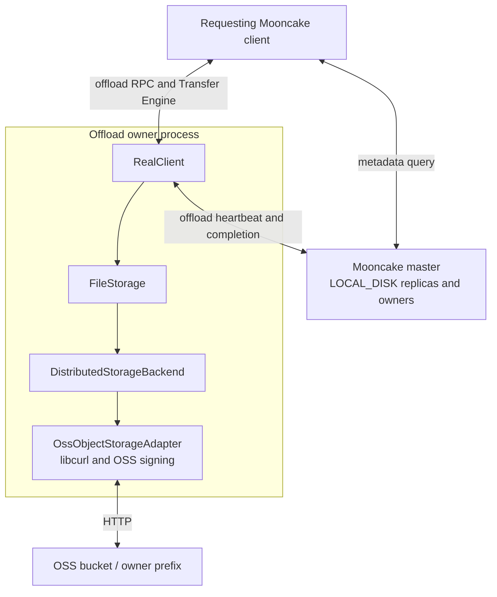
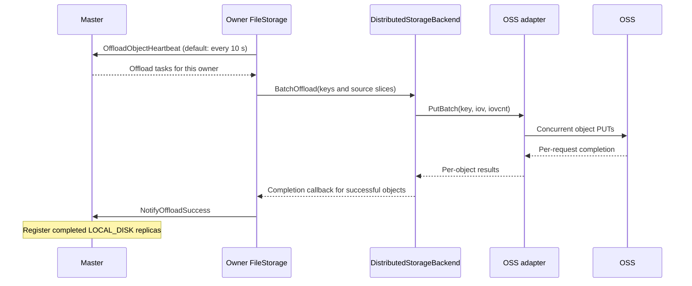
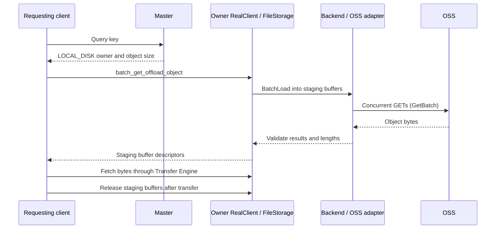

# OSS Backend Design

## Overview

The object-storage backend extends Mooncake Store's client-owned offload path
to key-based storage services, such as OSS and S3, through service-specific
adapters. It uses the same `LOCAL_DISK` replica model as local-file and NVMe KV
backends: the master records an owner and the requesting client reads through
that owner. Object storage is not a separate first-class replica type here.

This document describes the OSS adapter implementation. Its signing protocol
is OSS-specific; S3 requires a compatible adapter, not just a different endpoint.

For prerequisites, configuration, and startup examples, see
[OSS Local-Disk Backend](../deployment/oss.md).

## Design Goals

- Reuse `FileStorage` offload coordination and existing Store APIs.
- Issue concurrent object GETs and PUTs within a synchronous batch.
- Give each batch its own libcurl multi handle, without a shared batch lock.
- Avoid a full-object intermediate string on the direct GET path and avoid
  concatenating upload slices into a full-object buffer.

## Architecture



## Layer Responsibilities

| Layer | Responsibilities |
|-------|------------------|
| Master | Schedule offload tasks and track completed `LOCAL_DISK` replicas and their owners. |
| `FileStorage` | Obtain source slices, call the selected backend, report successful writes, and manage read staging buffers. |
| `DistributedStorageBackend` | Convert `BatchOffload` / `BatchLoad` into object batches and check per-object results and read lengths. |
| `OssObjectStorageAdapter` | Map keys, sign HTTP requests, run libcurl transfers, and implement GET/PUT/HEAD/LIST/DELETE. |
| OSS | Store object payloads under the configured bucket and prefix. |

One `FileStorage` instance selects one backend. Selecting OSS does not also
enable the local-file or NVMe KV backend, or create an SSD-to-OSS cache hierarchy.

## Physical Keys and Object Layout

The adapter maps each storage key supplied by `FileStorage` to one OSS object:

```text
physical_key = owner_prefix + "/" + URIEncode(storage_key)
object_body  = concatenated payload slices
```

The prefix separator is omitted when the prefix is empty. LIST decodes matching
object keys back into logical storage keys; `ScanMeta` uses these keys and object
sizes for metadata registration.

There is no shard/offset allocation, per-object UUID descriptor, root manifest,
or adapter-level checksum envelope. A PUT targets the mapped key, not a
store-if-not-exists operation. Separate owner prefixes prevent owners from
overwriting each other's objects.

## Write Path



The application's memory `Put` is not a synchronous OSS write. Offload is
scheduled separately; only successful uploads are reported as completed
replicas. A batch is not a transaction: successful objects remain in OSS when
another upload fails.

## Read Path



The RPC coroutine posts blocking work to the existing blocking pool. It can
yield while a worker executes `BatchLoad`; the worker waits until the HTTP batch
finishes. No dedicated OSS worker pool is introduced.

`Get`, `GetRange`, and `GetBatch` copy incoming libcurl chunks directly into the
destination buffer. This removes the full-object response string and its final
copy, not all copies. `GetV` still reads into a contiguous temporary buffer and
then scatters. `PutV` / `PutBatch` consume iovec arrays through the upload
callback; copies into libcurl's upload buffer remain.

## Batch Execution

Each `GetBatch` or `PutBatch` call creates a temporary `CURLM` and one easy handle
per prepared request. It admits up to `MOONCAKE_OSS_MAX_CONNECTIONS` requests
(default: 64), advances them together, and admits more as requests complete.
Requests waiting for admission stay outside `CURLM` so that their transfer
timeout is not consumed in libcurl's connection queue.

Connections are reused within a batch, not across batches. Different caller
threads can execute separate batches concurrently; the limit is per batch,
not per adapter or process. Completion order may differ from input order, but
the returned result vector preserves input order and cardinality.

## Concurrency and Ownership

- Adapter APIs are synchronous: they return after batch processing and cleanup.
- Each batch owns its request contexts and libcurl handles; there is no shared
  `CURLM` or adapter-wide lock serializing complete batches.
- **Download buffers, upload iovec arrays, and upload payloads must remain alive
  until the call returns. Upload descriptors and payloads must not be modified
  while in use.**
- **A failed read may have partially modified its destination; do not consume
  that buffer as valid data.** A failed `BatchLoad` does not expose the batch as
  a successful Store read, even if some underlying GETs completed.

## Failure Semantics

| Condition | Behavior |
|-----------|----------|
| Invalid buffer or iovec arguments detected before batch setup | Return `INVALID_PARAMS` for that entry; other valid entries can proceed. |
| GET reports a missing object | Return `FILE_NOT_FOUND`. |
| GET returns an unexpected status or length | Return a read failure; a nonempty range GET requires HTTP 206 and the requested length. |
| PUT returns a non-success HTTP status | Return a write failure; do not report that object as successfully offloaded. |
| Transport error or timeout | Return a request error; a timed-out PUT does not prove that OSS stored nothing. |
| Request setup or multi-handle failure | Return errors for requests that could not complete; do not roll back successful cloud writes. |
| One object fails in a batch | Preserve per-object results; successful uploads are not automatically deleted. |

## Current Limitations

- Readers depend on a reachable owner and valid Master metadata, not just the
  existence of an OSS object. This is different from a first-class DFS replica.
- Master capacity accounting uses each owner's configured capacity and live
  replica sizes. It neither queries OSS free space nor enforces a bucket quota.
- The backend does not implement capacity eviction or automatic cloud-object
  garbage collection. Removing Master metadata does not issue an OSS DELETE;
  metadata usage can therefore differ from actual bucket usage.
- Multipart uploads, automatic parallel range splitting, and automatic
  credential refresh are not implemented.
