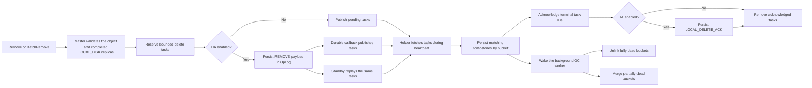
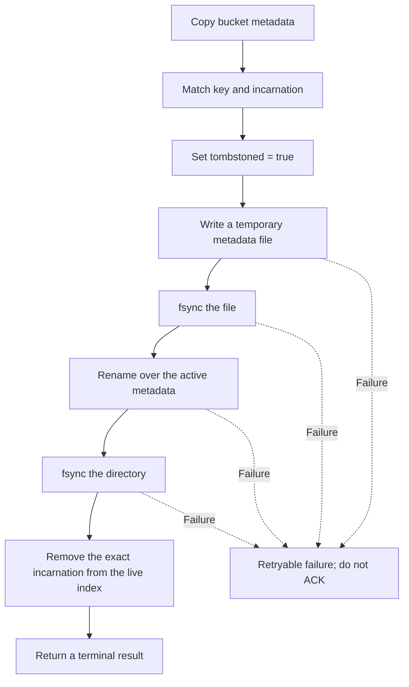
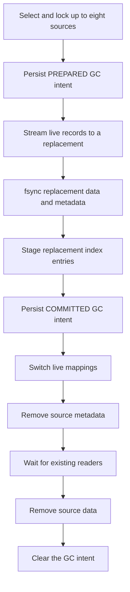

# Reliable SSD Object Deletion and Bucket Garbage Collection

## Overview

Mooncake Store can keep a `LOCAL_DISK` replica after its logical object has
been removed from the master. For the bucket storage backend, unlinking that
replica immediately is not possible because one immutable bucket file contains
multiple objects.

This design connects `Remove` and `BatchRemove` to durable per-replica delete
tasks. The local-disk holder first records a tombstone in bucket metadata, then
a single background worker reclaims the dead records. The worker can remove
fully dead buckets or merge live records from several partially dead buckets
into one replacement bucket.

The design separates two responsibilities:

- the master records which object incarnation must be deleted; and
- the local-disk holder records how that deletion changes its local files.

This separation keeps object deletion correct across master failover and holder
restart without putting bucket-copy I/O on the remove RPC path.

## Scope

The implementation covers:

- `Remove` and `BatchRemove`;
- completed `LOCAL_DISK` replicas that advertise tombstone support;
- the bucket storage backend;
- durable tombstones, background reclamation, and interrupted-GC recovery;
- HA replication of delete tasks and acknowledgements.

It does not change `RemoveAll` or `RemoveByRegex`, and it does not add
per-object reclamation to the file-per-key, offset-allocator, distributed, P2P,
NoF, or DFS backends. It also deliberately uses one GC worker rather than a
general-purpose task scheduler.

## End-to-end flow



Task delivery is at least once. Fetching does not remove a task; only an
acknowledgement removes it. Repeated delivery is safe because both the task and
the bucket entry carry the same object incarnation.

## Delete identity and fencing

### Object incarnation

Every logical object has a 128-bit `ObjectIncarnation`, generated when the
master creates the object. The incarnation is propagated through master
metadata, snapshots, offload tasks, local-disk replica descriptors, bucket
metadata, and delete tasks.

The holder writes a tombstone only when both the key and incarnation match. If
an old task for incarnation N arrives after the same key has been recreated as
incarnation N+1, the task is terminal but does not modify the new object. This
prevents delayed work from causing an ABA-style deletion.

### Stable local-disk identity

The bucket directory stores a stable `local_disk_segment_id` in
`.mooncake_local_disk_segment_id`. A master-issued mount epoch fences old
processes after the directory is remounted, and a local advisory lock prevents
two processes on the same host from using the directory concurrently.

Fetch and acknowledgement requests include both the stable identity and mount
epoch. A stale holder therefore cannot consume or acknowledge work belonging
to the current mount.

## Master-side durability

Before changing logical object visibility, the master reserves enough bounded
registry capacity for all eligible local-disk replicas. If the complete set
cannot be reserved, the remove operation fails without publishing a partial
set of physical-delete tasks.

In HA mode, the versioned `REMOVE` OpLog payload contains the object
incarnation and delete intents. Tasks become visible after the OpLog entry is
durable, and the standby applies the same metadata removal and tasks.
Acknowledgements use a separate `LOCAL_DELETE_ACK` entry. Pending tasks are
also included in master snapshots, so snapshot bootstrap and OpLog replay
produce the same registry state.

In non-HA mode, the reservation is published directly after validation.

## Durable tombstones

The holder groups a fetched batch by bucket. Each affected bucket requires at
most one metadata rewrite:



The result determines acknowledgement behavior:

| Result | Meaning | Acknowledge |
|---|---|---|
| `Removed` | The matching tombstone was persisted by this attempt. | Yes |
| `AlreadyRemoved` | The same incarnation was already tombstoned. | Yes |
| `StaleVersion` | That incarnation is no longer present. | Yes |
| `RetryableFailure` | A file or internal operation failed. | No |

Once the tombstone is durable, the entry is absent from local lookup,
`BatchLoad`, metadata scans, and restart re-registration. The bucket data file
still occupies its original physical space until GC completes.

## Bucket garbage collection

### Scheduling

Each `BucketStorageBackend` owns one background GC worker. A new tombstone
wakes it, and the worker also scans periodically. Under normal usage, a bucket
becomes eligible when its deleted-byte ratio reaches
`MOONCAKE_OFFLOAD_BUCKET_GC_DELETED_RATIO`.

Candidates are ordered by:

1. fully dead buckets;
2. higher deleted-byte ratio;
3. more reclaimable bytes;
4. lower bucket ID.

The current configuration is documented in the
[SSD Offload deployment guide](../deployment/ssd/ssd-offload.md).

### Watermark behavior

GC reuses the existing SSD high and low watermarks. When accounted usage
reaches the high watermark, the deleted-ratio threshold is bypassed and the
worker continues reclaiming eligible dead records until one of these
conditions is met:

- usage reaches the low watermark;
- no reclaimable candidate remains;
- a reclamation operation fails; or
- the worker is stopping.

The heartbeat only signals the GC worker; compaction I/O runs in the background.
When GC is disabled or no dead bytes remain, the existing live-bucket eviction
path remains available for disk-pressure protection.

### Multi-bucket merge

One GC operation selects at most eight source buckets. The combined live data
must fit the existing per-bucket byte and key limits. Fully dead buckets do not
need a replacement; partially dead buckets use copy-on-write:



Live records are copied through a fixed 1 MiB buffer, so memory usage does not
grow with bucket size. The replacement is counted in physical usage before the
sources are subtracted; source bytes are released from accounting only after
their files are removed.

## Failure recovery

The master OpLog and local GC intent solve different failure domains:

| Failure | Durable state | Recovery |
|---|---|---|
| Primary fails before publishing a durable remove | No committed remove entry | No partial task set becomes visible. |
| Primary fails after durable `REMOVE` | OpLog or snapshot contains the tasks | The standby restores and redelivers them. |
| ACK response is lost | Tombstone is durable; task may remain pending | Redelivery returns `AlreadyRemoved`, then ACK is retried. |
| Holder fails after tombstone but before ACK | Tombstone is in synchronized bucket metadata | Restart does not re-register the object; the task can be redelivered. |
| Holder fails with a PREPARED GC intent | Sources remain authoritative | Recovery removes an incomplete replacement and keeps the sources. |
| Holder fails with a COMMITTED GC intent | Replacement is authoritative | Recovery validates the replacement and removes the sources. |

The OpLog cannot describe which local source or replacement file is
authoritative during compaction. That is why `.bucket_gc_intent` is required in
addition to the cluster-level delete log.

## Performance boundaries

- `Remove` and `BatchRemove` do not copy bucket data.
- Tombstone persistence rewrites bucket metadata in the holder heartbeat path.
- GC data copying runs on one background worker.
- A merge reads at most eight source buckets and uses a fixed 1 MiB buffer.
- The global bucket lock is not held while copying data or waiting for readers.
- Below the high watermark, watermark checks do not start compaction unless
  reclaimable data is present.

GC necessarily introduces read and write traffic for live records. Production
evaluation should compare read latency, GC throughput, write amplification,
disk bandwidth, and resident memory with representative bucket sizes.

## Validation

The focused tests require no CUDA, RDMA, or UB hardware. Enable failpoints to
include the primary-process termination cases:

```bash
cmake -S . -B build-ssd-delete -G Ninja \
  -DWITH_STORE=ON \
  -DWITH_EP=OFF \
  -DUSE_CUDA=OFF \
  -DBUILD_UNIT_TESTS=ON \
  -DBUILD_EXAMPLES=OFF \
  -DMOONCAKE_ENABLE_TEST_FAILPOINTS=ON

cmake --build build-ssd-delete --target \
  storage_backend_bucket_delete_test \
  local_delete_test \
  oplog_applier_test \
  local_delete_process_kill_test

ctest --test-dir build-ssd-delete --output-on-failure -R \
  '^(storage_backend_bucket_delete_test|local_delete_test|oplog_applier_test|local_delete_process_kill_test)$'
```

The focused suite covers tombstone durability, stale-incarnation protection,
at-least-once task delivery, OpLog replay, process termination, fully dead
buckets, multi-bucket merge, watermark override, and PREPARED/COMMITTED intent
recovery. Changes to this protocol should also run the existing Store snapshot,
HA, SSD, storage-backend, remove, and client integration regression tests.

## Code organization

| Area | Primary files |
|---|---|
| Delete task registry and identifiers | `mooncake-store/include/local_delete.h`, `mooncake-store/src/local_delete.cpp` |
| Remove, fetch/ACK, OpLog, and snapshots | `mooncake-store/src/master_service.cpp` and `mooncake-store/src/ha/` |
| Holder task processing and watermark signaling | `mooncake-store/src/file_storage.cpp` |
| Tombstones, GC, and local intent recovery | `mooncake-store/src/storage_backend.cpp` |
| Focused tests | `mooncake-store/tests/local_delete_test.cpp`, `mooncake-store/tests/storage_backend_bucket_delete_test.cpp`, and `mooncake-store/tests/ha/oplog/local_delete_process_kill_test.cpp` |
