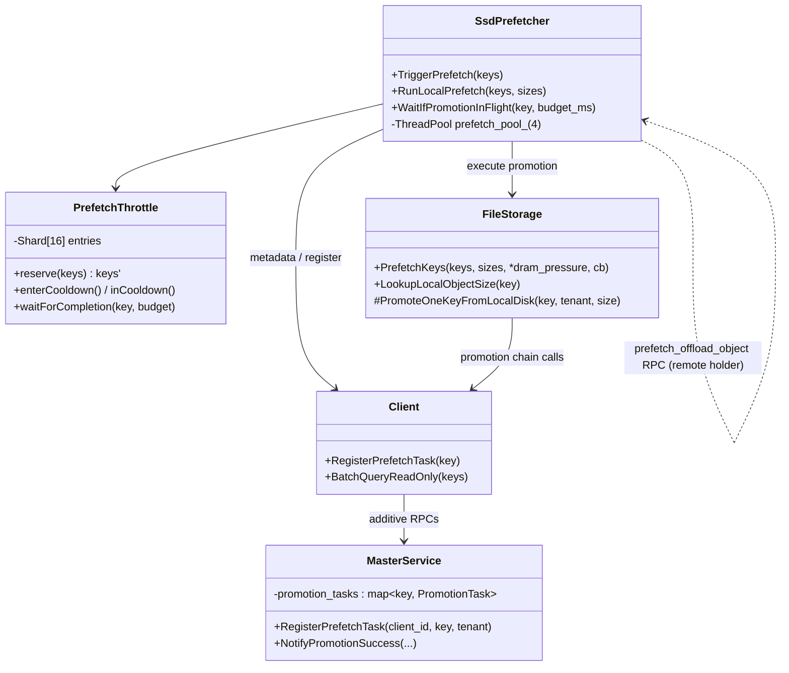
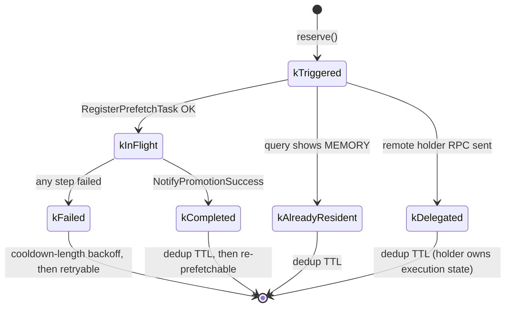
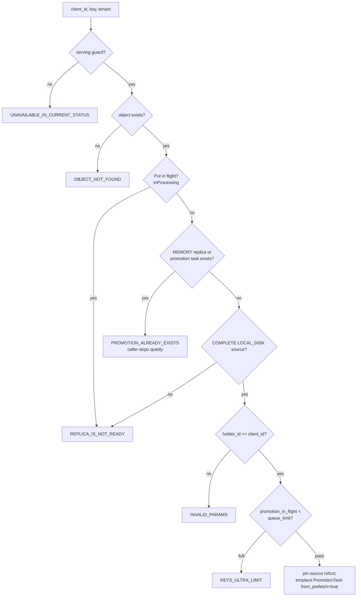

# SSD Prefetch-on-Exist

Related: RFC #2213, promotion-on-hit (PR #2071).

## Goal

`is_exist` / `batch_is_exist` with `ExistOptions.prefetch_to_memory = true` may
start a best-effort SSD→DRAM promotion for keys that only have a `LOCAL_DISK`
replica, so a follow-up `get()` can be served from DRAM. Prefetch must not
change exist/get semantics, must not block the caller, and may be dropped on
any failure. If the disk replica is remote, the holder node reads its own SSD
into its own DRAM.

The feature is off by default (`enable_ssd_prefetch = false`); with the switch
off the exist/get paths behave exactly as before.

## Path

```
is_exist(..., prefetch_to_memory=true)          # synchronous, no RPC added
  → SsdPrefetcher::triggerSsdPrefetch           # throttle.reserve() dedup
    → prefetch thread pool (fixed size 4)
      → 128-key chunks: BatchQueryReadOnly      # no lease, no promotion-on-hit
        → classify: SSD-only (LOCAL_DISK complete, no MEMORY), size > 0
          → local holder:  RegisterPrefetchTask + FileStorage::PrefetchKeys
          → remote holder: prefetch_offload_object RPC → holder promotes locally
```

`PrefetchKeys` shares the promotion execution chain with promotion-on-hit
(`PromoteOneKeyFromLocalDisk`: `PromotionAllocStart` → staging `AllocateBatch`
→ `BatchLoad` → `PromotionWrite` → `NotifyPromotionSuccess`). It does **not**
reuse promotion-on-hit admission (frequency sketch, DRAM watermark gate), the
lease-on-query, or the holder's promotion heartbeat mailbox.

Metadata queries use the read-only admin replica RPCs
(`GetReplicaListForAdmin` / `BatchGetReplicaListForAdmin`, also registered on
the master RPC server), so prefetch never grants a lease, never triggers
promotion-on-hit, and never counts `valid_get` metrics as a side effect.

## Master side: RegisterPrefetchTask

New additive RPC (older masters reject it and prefetch degrades to a no-op).
Semantics differ from promotion-on-hit admission:

- tenant-aware: the key is looked up under the caller's tenant;
- holder-only: `holder_id == client_id`, others get `INVALID_PARAMS`;
- no frequency/watermark admission, no heartbeat mailbox push;
- shares the `promotion_in_flight_` / `promotion_queue_limit_` cap with
  promotion-on-hit (both compete for the same DRAM);
- idempotency is explicit: if a MEMORY replica or an in-flight promotion task
  already exists, the call fails with `PROMOTION_ALREADY_EXISTS`, which the
  caller treats as "skip quietly", not as an error. Prefetch and
  promotion-on-hit therefore cannot double-promote the same key: both paths
  allocate from the same per-key `promotion_tasks` entry.

`NotifyPromotionSuccess` with `from_prefetch = true` grants the same read
lease (`default_kv_lease_ttl`) as exist/get, so the promoted DRAM replica
survives until the follow-up `get()`. If the exist→get gap can exceed the hard
lease, raise `--default_kv_lease_ttl`; note that larger leases can raise Put
`NO_AVAILABLE_HANDLE` under a high DRAM watermark (a capacity trade-off, not a
prefetch bug).

## Throttle, threads, failure handling

Per-client `PrefetchThrottle` (sharded, lock-free fast path per shard):

- `ssd_prefetch_dedup_ttl_sec` (default 30): a key prefetches at most once per
  window. Applies at trigger time (before any RPC) so hot probes on
  DRAM-resident keys do not cause metadata-query storms; the async job still
  re-classifies precisely after `BatchQueryReadOnly`.
- Failed keys retry after the (shorter) cooldown window, not the full TTL.
- `ssd_prefetch_cooldown_sec` (default 5): when promotion fails with
  `NO_AVAILABLE_HANDLE` (DRAM saturated), prefetch backs off so it stops
  competing with eviction/offload, which are what actually frees DRAM. 0
  disables the backoff.
- All prefetch work runs on a fixed-size thread pool (4 workers). If the pool
  is down (shutdown), the job is dropped — prefetch never spawns a thread per
  probe and never falls back to unbounded detached threads.
- Every failure past `PromotionAllocStart` releases the master-side staged
  state eagerly (`NotifyPromotionFailure`, RAII guard) instead of waiting for
  the reaper TTL.

## get() wait (opt-in)

`ssd_get_wait_ms` (default 0 = off) is a **single deadline for the whole
batch-get**, not a fresh timeout per key. A long prefix spans tens of keys;
applying a per-key wait serially multiplied the batch budget by the key
count and produced tens-of-seconds TTFT p99 spikes when prefetch was on.

Wait only when this process has a live local promotion (`kInFlight` /
`kCompleted`). Do **not** wait on `kTriggered` (pool job still queued),
`kFailed`, `kAlreadyResident`, or keys delegated to another holder. A process
with no local SSD object (EngineCore `global_segment_size=0`) must not call
`RegisterPrefetchTask`: that left a `PROCESSING` MEMORY replica the get path
then waited on for the full per-key budget.

**Demand-side kick.** A batch whose best replica is `LOCAL_DISK` gets one
`TriggerPrefetch(disk_keys, ignore_cooldown=true)` before the wait. The
bypass covers only the client-side throttle backoff — never a master-side
gate (the shared in-flight cap, holder check, and dedup TTL all still
apply). Rationale: an in-flight get is the strongest hotness signal there
is, and a request whose exist-triggered promotion was dropped by a
saturated backoff window should not pay an SSD read with no retry.
Measured on a saturated store this kick is what turns a no-gain regime
positive; without it, p99 TTFT regresses slightly as gets wait on
promotions that then fail under pressure.

If nothing is in flight, fall through to SSD immediately.

The re-query is read-only and grants no lease; between observing a COMPLETE
MEMORY replica and the actual transfer the replica could in principle be
evicted. That race is accepted (best-effort): the transfer simply fails and
the caller retries/falls back per the existing error path.

A/B replay (fill → overflow → settle → measure c=2) and the vLLM bench
screen logs live in `scripts/ssd-prefetch-ttft-ab/`.


## Detailed design

The four pieces below are the load-bearing components. Everything here maps
one-to-one onto the code named in [Code map](#code-map).

### Component architecture



### End-to-end trigger flow (exist probe)

```mermaid
sequenceDiagram
    participant E as Engine (exist probe)
    participant P as SsdPrefetcher
    participant T as PrefetchThrottle
    participant M as Master
    participant H as Holder (local/remote)

    E->>P: TriggerPrefetch(keys) [sync: no RPC]
    P->>T: reserve(keys) — TTL dedup, local+remote alike
    T-->>P: unseen subset
    P->>P: enqueue pool job (caller returns here)
    loop per 128-key chunk
        P->>M: BatchQueryReadOnly (no lease / no promotion / no metrics)
        M-->>P: replica descriptors
        P->>P: ClassifySsdPrefetchRoute (SSD-only, COMPLETE, size>0)
    end
    alt local holder
        P->>H: LookupLocalObjectSize (authoritative, not the caller's hint)
        H->>M: RegisterPrefetchTask (holder client_id, tenant)
        M-->>H: OK / PROMOTION_ALREADY_EXISTS (skip quietly)
        H->>H: PrefetchKeys → PromoteOneKeyFromLocalDisk
        H->>M: NotifyPromotionSuccess → grant read lease (from_prefetch)
    else remote holder
        P->>H: prefetch_offload_object RPC (additive; old peers drop)
        Note over H: holder runs the same local branch<br/>with its own client_id
    end
```

### PrefetchThrottle

Sharded (16) per-key state machine; lazy expiry (per-entry deadline plus an
amortized per-shard sweep), so a probe is O(batch) not O(table).



Dedup windows per state (see `EntryExpired`): healthy states block
re-triggering for `ssd_prefetch_dedup_ttl_sec` (default 30 s); `kFailed`
only for `ssd_prefetch_cooldown_sec` (default 5 s) so transient failures
retry quickly. The memory-pressure cooldown is opened when
`PromotionAllocStart` returns `NO_AVAILABLE_HANDLE`: while active,
TriggerPrefetch is a no-op — prefetch (which adds DRAM) yields to
eviction/offload (which frees DRAM). `waitForCompletion` exits immediately
on the three terminal non-success states instead of burning budget.

### Master: RegisterPrefetchTask



The task deliberately skips promotion-on-hit admission (frequency sketch,
watermark) and the holder's heartbeat mailbox — an explicit probe is the
hotness signal — but **shares** the `promotion_in_flight_` cap and the
per-key `promotion_tasks` entry with promotion-on-hit, so the two paths
cannot double-promote a key. `NotifyPromotionSuccess` on a
`from_prefetch` task grants the normal `default_kv_lease_ttl` read lease:
the DRAM replica survives until the follow-up get.

### FileStorage execution chain

`PromoteOneKeyFromLocalDisk` is shared verbatim by promotion-on-hit
(`ProcessPromotionTasks`) and prefetch (`PrefetchKeys`):

```mermaid
sequenceDiagram
    participant F as FileStorage
    participant C as Client
    participant M as Master
    F->>C: PromotionAllocStart(key, tenant, size)
    alt NO_AVAILABLE_HANDLE
        C-->>F: error → *dram_pressure = true → throttle.enterCooldown()
    end
    Note over F: PromotionStateGuard armed (RAII):<br/>any later failure → NotifyPromotionFailure
    F->>F: AllocateBatch (staging) → BatchLoad (SSD read)
    F->>C: PromotionWrite (TE write into staged replica)
    F->>C: NotifyPromotionSuccess
    C->>M: replica COMPLETE; lease granted (from_prefetch)
    Note over F: guard.Dismiss()
```

Per-key failures never propagate (best-effort): they are logged, counted on
`SsdMetric.prefetch_complete/fail_total`, and reported through the
completion callback that drives the throttle states above.

### exist/get wiring

- **exist**: `ExistOptions.prefetch_to_memory` + `enable_ssd_prefetch` →
  TriggerPrefetch. Synchronous cost: one dedup lookup + one pool enqueue.
- **get** (`ssd_get_wait_ms > 0`, default 0 = off): one deadline shared by
  the whole batch; a key is waited on only while a local promotion is
  `kInFlight`/`kCompleted`; re-queries are read-only. A batch headed for
  SSD also gets one demand-side kick (see "get() wait" above) that bypasses
  only the client-side throttle backoff. On a COMPLETE MEMORY replica the
  transfer plan is rebuilt from the refreshed replica list
  (`FilterQueryResult`); otherwise the SSD read proceeds immediately.

## Rolling-upgrade compatibility

- No existing RPC signature changes.
- `RegisterPrefetchTask` and `prefetch_offload_object` are additive: old
  masters/holders reject them, and prefetch degrades to a no-op.
- The read-only replica queries reuse the pre-existing admin RPC handlers.

## Configuration

| key | default | meaning |
|---|---|---|
| `enable_ssd_prefetch` | false | master switch (client config) |
| `ssd_prefetch_cooldown_sec` | 5 | DRAM-pressure backoff; 0 disables |
| `ssd_prefetch_dedup_ttl_sec` | 30 | per-key trigger dedup TTL; 0 disables |
| `ssd_get_wait_ms` | 0 | get-side wait budget; 0 disables |

Requires `enable_ssd_offload` + `ssd_offload_path` (prefetch promotes from the
local SSD tier; without offload there are no LOCAL_DISK replicas).

## Code map

- `prefetch_throttle.h` — throttle state machine (sharded).
- `master_service.*` — `RegisterPrefetchTask`, `PromotionTask::from_prefetch`,
  prefetch lease in `NotifyPromotionSuccess`.
- `rpc_service.*` / `master_client.*` / `client_service.*` — RPC wiring.
- `file_storage.*` — `PrefetchKeys`, `PromoteOneKeyFromLocalDisk` (shared with
  promotion-on-hit), `LookupLocalObjectSize`.
- `storage_backend.*` — `GetObjectDataSize`.
- `ssd_prefetcher.*` — trigger/dedup/classify/delegate and the prefetch pool.
- `real_client.*` — exist-path trigger, get-path wait.
- `replica.h` (`ExistOptions`), `store_c`, `store_py`, `dummy_client` — API
  plumbing.
