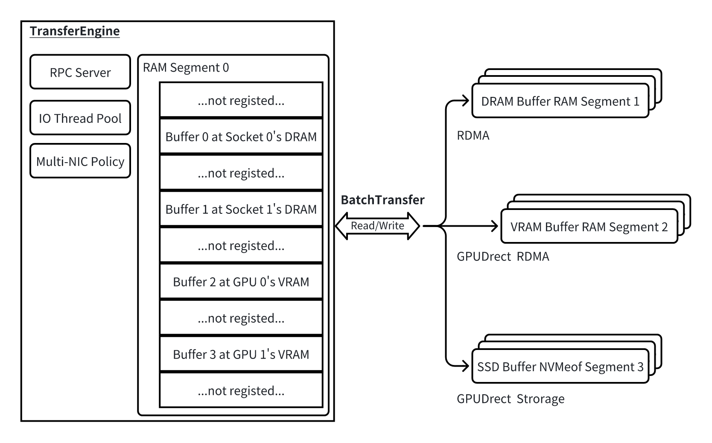
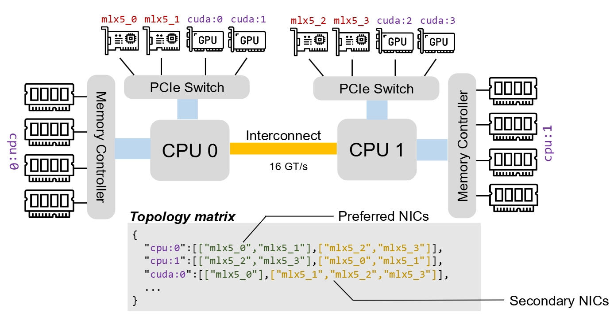
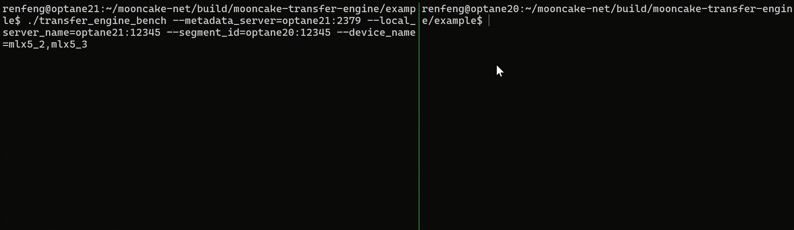

# Transfer Engine

## Overview
Mooncake Transfer Engine is a high-performance, zero-copy data transfer library designed around two core abstractions: Segment and BatchTransfer.

- [**Segment**](#segment) represents a contiguous address space that can be remotely read and written, which can be either non-persistent storage provided by DRAM or VRAM, known as **RAM Segment**, or persistent storage provided by NVMeof, known as **NVMeof Segment**.

- [**BatchTransfer**](#batchtransfer) encapsulates operation requests, specifically responsible for synchronizing data between a set of non-contiguous data spaces in one Segment and the corresponding spaces in another set of Segments, supporting Read/Write in both directions, thus acting like an asynchronous and more flexible AllScatter/AllGather.



As shown in the diagram, each specific client corresponds to a `TransferEngine`, which not only includes a RAM Segment but also integrates management for high-speed transfers across multiple threads and network cards. The RAM Segment, in principle, corresponds to the entire virtual address space of this `TransferEngine`, but in reality, only parts of it (known as a `Buffer`) are registered for (GPUDirect) RDMA Read/Write. Each Buffer can have separate permissions (corresponding to RDMA `rkey`, etc.) and network card affinity (e.g., preferred NICs for different types of memory).

Mooncake Transfer Engine provides interfaces through the `TransferEngine` class (located in `mooncake-transfer-engine/include/transfer_engine.h`), where the specific data transfer functions for different backends are implemented by the `Transport` class, currently supporting `TcpTransport`, `RdmaTransport`, `EfaTransport`, `NVMeoFTransport`, `NvlinkTransport`, `IntraNodeNvlinkTransport`, and `HipTransport`.

### Segment
Segment represents a collection of source address ranges and target address ranges available during the data transfer process in Transfer Engine. That is, all local and remote addresses involved in `BatchTransfer` requests must be within the valid segment range. Transfer Engine supports the following two types of Segments.

#### 1. RAM Segment in Memory Address Space (DRAM, VRAM)
When each process starts, Transfer Engine automatically creates a segment named after its own `local_hostname` (see the initialization function of `TransferEngine`, which needs to be globally unique), which logically covers the entire memory address space, including storage media such as DRAM/VRAM. When using the `BatchTransfer` interface for transfer tasks, Transfer Engine automatically determines the corresponding hardware information to choose the best transfer method. **Each process has and only has one segment.** Other processes can reference the segment and complete read/write operations by calling the `openSegment` interface and passing the correct name.

In actual deployment, application systems usually only use part of the memory address space for data transfer, so Transfer Engine further divides the segment into multiple buffers internally. Each Buffer represents a contiguous address space located on the same device, and when users use the `BatchTransfer` interface to complete read/write operations, if referencing a RAM Segment, each read/write task must be within one of the valid buffers.

The memory range within a segment does not need to be contiguous, which means that multiple DRAM/VRAM address spaces can be allocated and included in the same segment.

In addition, Transfer Engine also supports registering some **local DRAM areas**, which are merely used as the local side storage space for data operations, such as the DRAM PageCache area of vLLM. It is also considered a part of the effective RAM Segment in the current process but cannot be referenced by other processes by calling the `openSegment` interface.

#### 2. NVMeof Segment
Transfer Engine also leverages the NVMeof protocol to support direct data transfer from files on NVMe to DRAM/VRAM via PCIe, without going through the CPU and achieving zero-copy. Users need to follow the instructions to mount remote storage nodes locally and use the `openSegment` interface for reference to complete data read/write operations.

### BatchTransfer

With the help of Transfer Engine, Mooncake Store can achieve local DRAM/VRAM reading and writing of specified parts in valid segments  through TCP, (GPUDirect) RDMA, NVMe-of protocols, etc.

| Remote ↓ Local → | DRAM | VRAM |
| ---------------- | ---- | ---- |
| DRAM             | ✓    | ✓    |
| VRAM             | ✓    | ✓    |
| NVMe-of          | ✓    | ✓    |

- Local memcpy: If the target Segment is actually in the local DRAM/VRAM, direct data copy interfaces such as memcpy, cudaMemcpy are used.
- TCP: Supports data transfer between local DRAM and remote DRAM.
- RDMA: Supports data transfer between local DRAM/VRAM and remote DRAM. It supports multi-network card pooling and retry functions in implementation.
- HIP: Supports intra-node data transfers between GPU VRAM and GPU VRAM, as well as between GPU VRAM and CPU DRAM, using IPC handles or Shareable handles for ROCm.
- cuFile (GPUDirect Storage): Implements data transfer between local DRAM/VRAM and Local/Remote NVMeof.

The BatchTransfer API uses an array of requests, which specify the operation type (READ or WRITE), data length, and local and remote memory addresses. The transfer operation is applicable to DRAM and GPU VRAM. The completion of these operations can be asynchronously monitored through the `getTransferStatus` API.

### Topology Aware Path Selection
Modern inference servers often consist of multiple CPU sockets, DRAM, GPUs, and RDMA NIC devices. Although it's technically possible to transfer data from local DRAM or VRAM to a remote location using any RDMA NIC, these transfers can be limited by the bandwidth constraints of the Ultra Path Interconnect (UPI) or PCIe Switch. To overcome these limitations, Transfer Engine implements a topology-aware path selection algorithm.

Before processing requests, each server generates a topology matrix and broadcasts it across the cluster.
This matrix categorizes network interface cards (NICs) into preferred and secondary lists for various types of memory, which types are specified during memory registration.
Under normal conditions, a NIC from the preferred list is selected for transfers, facilitating RDMA operations within the local NUMA or GPU Direct RDMA through the local PCIe switch only.
In case of failures, NICs from both lists may be utilized.
The process involves identifying the appropriate local and target NICs based on the memory addresses, establishing a connection, and executing the data transfer.



For instance, as illustrated in figure above, to transfer data from buffer 0 (assigned to cpu:0) in the local node to buffer 1 (assigned to cpu:1) in the target node, the engine first identifies the preferred NICs for cpu:0 using the local server's topology matrix and selects one, such as mlx5_1, as the local NIC. Similarly, the target NIC, such as mlx5_3, is selected based on the target memory address. This setup enables establishing an RDMA connection from mlx5_1@local to mlx5_3@target to carry out RDMA read and write operations.

To further maximize bandwidth utilization, if a single request's transfer is internally divided into multiple slices if its length exceeds 64KB.
Each slice might use a different path, enabling collaborative work among all RDMA NICs.

### Endpoint Management
Mooncake Store employs a pair of endpoints to represent the connection between a local RDMA
NIC and a remote RDMA NIC. In practice, each endpoint
includes one or more RDMA queue pair objects. Connections in Mooncake Store are established in an on demand manner;
endpoints remain unpaired until the first request is made.
To prevent a large number of endpoints from slowing down
request processing, Mooncake Store employs endpoint pooling,
which caps the maximum number of active connections. We
use the SIEVE algorithm to manage endpoint eviction.
If a connection fails due to link errors, it is removed from the
endpoint pools on both sides and re-established during the
next data transfer attempt.

### Fault Handling
In a multi-NIC environment, one common failure scenario is the temporary unavailability of a specific NIC, while other routes may still connect two nodes.
Mooncake Store is designed to adeptly manage such temporary
failures effectively. If a connection is identified as unavailable,
Mooncake Store automatically identifies an alternative, reachable
path and resubmits the request to a different RDMA NIC
device. Furthermore, Mooncake Store is capable of detecting problems with other RDMA resources, including RDMA contexts
and completion queues. It temporarily avoids using these
resources until the issue, such as a downed link, is resolved.

## Example: Transfer Engine Bench
The sample program provided in `mooncake-transfer-engine/example/transfer_engine_bench.cpp` demonstrates the basic usage of Transfer Engine by repeatedly reading/writing data blocks from the DRAM of the target node to the initiator node through the Transfer Engine interface. It can also be used to measure read and write throughput. Currently, the Transfer Engine Bench tool supports RDMA and TCP protocols.

After successfully compiling Transfer Engine, the test program `transfer_engine_bench` can be found in the `build/mooncake-transfer-engine/example` directory.

1. **Start the `metadata` service.** This service is used for the centralized highly available management of various metadata for Mooncake, including the internal connection status of Transfer Engine. It is necessary to ensure that both the initiator and target nodes can smoothly access this metadata service, so pay attention to:
   - The listening IP of the metadata service should not be 127.0.0.1; it should be determined in conjunction with the network environment. In the experimental environment, 0.0.0.0 can be used.
   - On some platforms, if the initiator and target nodes have set the `http_proxy` or `https_proxy` environment variables, it will also affect the communication between Transfer Engine and the metadata service.

   Transfer Engine support multiple kinds of metadata services, including `etcd`, `redis`, and `http`. The following describes how to start the metadata service using `etcd` and `http` as examples.

   1.1. **`etcd`**

   By default, the use of etcd service is off. To use etcd service in transfer engine, in `mooncake-common/common.cmake`, change the switch of `USE_ETCD` from `OFF` to `ON`.
   For example, the following command line can be used to start the etcd service:
      ```bash
      etcd --listen-client-urls http://0.0.0.0:2379  --advertise-client-urls http://10.0.0.1:2379
      ```

   1.2. **`http`**

   For example, you can use the `http` service in the `mooncake-transfer-engine/example/http-metadata-server` example:
      ```bash
      # cd mooncake-transfer-engine/example/http-metadata-server
      go run . --addr=:8080
      ```

2. **Start the target node.**
    ```bash
    ./transfer_engine_bench --mode=target \
                            --metadata_server=etcd://10.0.0.1:2379 \
                            [--local_server_name=TARGET_NAME] \
                            [--device_name=erdma_0 | --auto-discovery]
    ```
   The meanings of the various parameters are as follows:
   - `--mode=target` indicates the start of the target node. The target node does not initiate read/write requests; it passively supplies or writes data as required by the initiator node.
      > [!NOTE]
      > In actual applications, there is no need to distinguish between target nodes and initiator nodes; each node can freely initiate read/write requests to other nodes in the cluster.
   - `--metadata_server` is the address of the metadata server. Its form is `[proto]://[hostname:port]`. For example, the following addresses are VALID:
      - Use `etcd` as metadata storage: `"10.0.0.1:2379"`, `"etcd://10.0.0.1:2379"` or `"etcd://10.0.0.1:2379,10.0.0.2:2379"`
      - Use `redis` as metadata storage: `"redis://10.0.0.1:6379"`
      - Use `http` as metadata storage: `"http://10.0.0.1:8080/metadata"`
   - `--local_server_name` represents the segment name of current node, which does not need to be set in most cases. If this option is not set, the value is equivalent to the hostname of this machine (i.e., `hostname(2)`). This should keep unique among the cluster.
   - `--device_name` indicates the name of the RDMA network card used in the transfer process (separated by commas without space). You can also specify `--auto_discovery` to enable discovery topology automatically, which generates a network card priority matrix based on the operating system configuration.
   - In network environments that only support TCP, the `--protocol=tcp` parameter can be used; in this case, there is no need to specify the `--device_name` parameter.

1. **Start the initiator node.**
    ```bash
    ./transfer_engine_bench --metadata_server=etcd://10.0.0.1:2379 \
                            --segment_id=TARGET_NAME \
                            [--local_server_name=INITIATOR_NAME] \
                            [--device_name=erdma_1 | --auto-discovery]
    ```
   The meanings of the various parameters are as follows (the rest are the same as before):
   - `--segment_id` is the segment name of target node. It needs to be consistent with the value passed to `--local_server_name` when starting the target node (if any).

   Under normal circumstances, the initiator node will start the transfer operation, wait for 10 seconds, and then display the "Test completed" message, indicating that the test is complete.

   The initiator node can also configure the following test parameters: `--operation` (can be `"read"` or `"write"`), `batch_size`, `block_size`, `duration`, `threads`, etc.

> [!NOTE]
> If an exception occurs during execution, it is usually due to incorrect parameter settings. It is recommended to refer to the [troubleshooting document](troubleshooting.md) for preliminary troubleshooting.

### Sample Run

The following video shows a normal run as described above, with the Target on the right and the Initiator on the left, at the end of the test the Initiator reports the test duration (10 seconds), IOPS (379008 requests/s), and throughput (19.87 GiB/s). The throughput here exceeds the maximum throughput supported by a single card on the host computer used.



## Transfer Engine C/C++ API
Transfer Engine provides interfaces through the `TransferEngine` class (located in `mooncake-transfer-engine/include/transfer_engine.h`), where the specific data transfer functions for different backends are implemented by the `Transport` class, currently supporting `TcpTransport`, `RdmaTransport`, `EfaTransport` (for AWS EFA), `NVMeoFTransport`, `NvlinkTransport` (for NVIDIA GPUs), `IntraNodeNvlinkTransport` (for NVIDIA GPUs), and `HipTransport` (for AMD GPUs).

For a complete C++ API reference, see [Transfer Engine C++ API Reference](cpp-api.md).

### Data Transfer
Transfer Engine provides batch-based read/write transfers between segments (DRAM/VRAM/NVMeof). A typical flow is: register local memory, open a target segment, submit a batch, and poll status. Detailed function signatures and usage are documented in the C++ API reference.

### Multi-Transport Management

The `TransferEngine` class internally manages multiple backend `Transport` classes.
And it will discover the toplogy between CPU/CUDA and RDMA devices automatically
(more device types are working in progress, feedbacks are welcome when the automatic discovery mechanism is not accurate),
and it will install `Transport` automatically based on the topology.

### Segment Management and Metadata Format
Segment metadata is stored in the metadata service. The following format is provided for reference.

<details>
<summary><strong>Metadata Format</strong></summary>

```
// Used to find the communicable address and exposed rpc port based on server_name.
// Created: when calling TransferEngine::init().
// Deleted: when TransferEngine is destructed.
Key = mooncake/rpc_meta/[server_name]
Value = {
    'ip_or_host_name': 'node01'
    'rpc_port': 12345
}

// For segments, the key naming method of mooncake/[proto]/[segment_name] is used, and the segment name can use the Server Name.
// A segment corresponds to a machine, and a buffer corresponds to different segments of memory or different files or different disks on the machine. Different buffers of the same segment are in the same fault domain.

// RAM Segment, used by RDMA Transport to obtain transfer information.
// Created: command line tool register.py, at this time buffers are empty, only fill in the information that can be known in advance.
// Modified: TransferEngine at runtime through register / unregister to add or delete Buffer.
Key = mooncake/ram/[segment_name]
Value = {
    'server_name': server_name,
    'protocol': rdma,
    'devices': [
        { 'name': 'mlx5_2', 'lid': 17, 'gid': 'fe:00:...' },
        { 'name': 'mlx5_3', 'lid': 22, 'gid': 'fe:00:...' }
    ],
    'priority_matrix': {
        "cpu:0": [["mlx5_2"], ["mlx5_3"]],
        "cpu:1": [["mlx5_3"], ["mlx5_2"]],
        "cuda:0": [["mlx5_2"], ["mlx5_3"]],
    },
    'buffers': [
        {
            'name': 'cpu:0',
            'addr': 0x7fa16bdf5000,
            'length': 1073741824,
            'rkey': [1fe000, 1fdf00, ...], // The length is the same as the number of elements in the 'devices' field
        },
    ],
}

// Created: command line tool register.py, determine the file path that can be mounted.
// Modified: command line tool mount.py, add a mapping of the machine mounting the file to the file path on the mounting machine to the buffers.local_path_map.
Key = mooncake/nvmeof/[segment_name]
Value = {
    'server_name': server_name,
    'protocol': nvmeof,
    'buffers':[
    {
        'length': 1073741824,
        'file_path': "/mnt/nvme0" // The file path on this machine
        'local_path_map': {
            "node01": "/mnt/transfer_engine/node01/nvme0", // The machine mounting the file -> The file path on the mounting machine
            .....
        },
     }，
     {
        'length': 1073741824,
        'file_path': "/mnt/nvme1",
        'local_path_map': {
            "node02": "/mnt/transfer_engine/node02/nvme1",
            .....
        },
     }
    ]
}
```
</details>

### HTTP Metadata Server

The HTTP server should implement three following RESTful APIs, while the metadata server configured to `http://host:port/metadata` as an example:

1. `GET /metadata?key=$KEY`: Get the metadata corresponding to `$KEY`.
2. `PUT /metadata?key=$KEY`: Update the metadata corresponding to `$KEY` to the value of the request body.
3. `DELETE /metadata?key=$KEY`: Delete the metadata corresponding to `$KEY`.

For specific implementation, refer to the demo service implemented in Golang at [mooncake-transfer-engine/example/http-metadata-server](../../../mooncake-transfer-engine/example/http-metadata-server).

## Using Transfer Engine to Your Projects

### Using C/C++ Interface
After compiling Mooncake Store, you can move the compiled static library file `libtransfer_engine.a` and the C header file `transfer_engine_c.h` into your own project. There is no need to reference other files under `src/transfer_engine`.

### Using Golang Interface
To support the operational needs of P2P Store, Transfer Engine provides a Golang interface wrapper, see `mooncake-p2p-store/src/p2pstore/transfer_engine.go`.

When compiling the project, enable the `-DWITH_P2P_STORE=ON` option to compile the P2P Store example program at the same time.

### Using Rust Interface
Under `mooncake-transfer-engine/rust`, the Rust interface implementation of TransferEngine is provided, and a Rust version of the benchmark is implemented based on the interface, similar to [transfer_engine_bench.cpp](../../../mooncake-transfer-engine/example/transfer_engine_bench.cpp). To compile the rust example, you need to install the Rust SDK and add `-DWITH_RUST_EXAMPLE=ON` in the cmake command.

## Advanced Runtime Options
For advanced users, TransferEngine provides the following advanced runtime options, all of which can be passed in through **environment variables**.

- `MC_NUM_CQ_PER_CTX` The number of CQs created per device instance, default value 1
- `MC_NUM_COMP_CHANNELS_PER_CTX` The number of Completion Channel created per device instance, default value 1
- `MC_IB_PORT` The IB port number used per device instance, default value 1
- `MC_IB_TC` Adjust RDMA NIC Traffic Class when switch/NIC defaults differ or for traffic planning. Default value -1
- `MC_IB_PCI_RELAXED_ORDERING` Setting the PCIe ordering to relaxed for the network adapter sometimes results in better performance. Can set 1 to enable RO function. Default value 0
- `MC_GID_INDEX` The GID index used per device instance, default value 3 (or the maximum value supported by the platform)
- `MC_MAX_CQE_PER_CTX` The CQ buffer size per device instance, default value 4096
- `MC_MAX_EP_PER_CTX` The maximum number of active EndPoint per device instance, default value 65536. **Note:** For versions prior to 0.3.7.post1, the default value is 256, and it cannot be manually set to 65536. The maximum supported value is 65535!
- `MC_NUM_QP_PER_EP` The number of QPs per EndPoint, the more the number, the better the fine-grained I/O performance, default value 2
- `MC_MAX_SGE` The maximum number of SGEs supported per QP, default value 4 (or the highest value supported by the platform)
- `MC_MAX_WR` The maximum number of Work Request supported per QP, default value 256 (or the highest value supported by the platform)
- `MC_MAX_INLINE` The maximum Inline write data volume (bytes) supported per QP, default value 64 (or the highest value supported by the platform)
- `MC_MTU` The MTU length used per device instance, can be 512, 1024, 2048, 4096, default value 4096 (or the maximum length supported by the platform)
- `MC_WORKERS_PER_CTX` The number of asynchronous worker threads corresponding to each device instance
- `MC_SLICE_SIZE` The segmentation granularity of user requests in Transfer Engine
- `MC_RETRY_CNT` The maximum number of retries in Transfer Engine
- `MC_LOG_LEVEL` This option can be set as `TRACE`/`INFO`/`WARNING`/`ERROR` (see [glog doc](https://github.com/google/glog/blob/master/docs/logging.md)), and more detailed logs will be output during runtime
- `MC_DISABLE_METACACHE` Disable local meta cache to prevent transfer failure due to dynamic memory registrations, which may downgrades the performance
- `MC_HANDSHAKE_LISTEN_BACKLOG` The backlog size of socket listening for handshaking, default value is 128
- `MC_HANDSHAKE_MAX_LENGTH` The maximum handshake message length in bytes for P2P mode. Valid range: 1MB to 128MB. Default value is 1MB (1048576 bytes). Increase this value when using a single RDMA instance with many registered memory buffers (>10,000) to avoid handshake failures. Example: set to 10485760 for 10MB
- `MC_LOG_DIR` Specify the directory path for log redirection files. If invalid, log to stderr instead.
- `MC_REDIS_PASSWORD` The password for Redis storage plugin, only takes effect when Redis is specified as the metadata server. If not set, no authentication will be attempted to log in to the Redis.
- `MC_REDIS_DB_INDEX` The database index for Redis storage plugin, must be an integer between 0 and 255. Only takes effect when Redis is specified as the metadata server. If not set or invalid, the default value is 0.
- `MC_FRAGMENT_RATIO ` In RdmaTransport::submitTransferTask, if the last data piece after division is ≤ 1/MC_FRAGMENT_RATIO of the block size, it merges with the previous block to reduce overhead. The default value is 4
- `MC_ENABLE_DEST_DEVICE_AFFINITY` Enable device affinity for RDMA performance optimization. When enabled, Transfer Engine will prioritize communication with remote NICs that have the same name as local NICs to reduce QP count and improve network performance in rail-optimized topologies. The default value is false
- `MC_ENABLE_PARALLEL_REG_MR` Control parallel memory region registration across multiple RDMA NICs. Valid values: -1 (auto, default), 0 (disabled), 1 (enabled). When set to -1, parallel registration is automatically enabled when multiple RNICs exist and memory has been pre-touched. Note: If memory hasn't been touched before registration, parallel registration can be slower than sequential registration
- `MC_FORCE_HCA` Force to use RDMA as the active transport, return error if no HCA has been found.
- `MC_FORCE_MNNVL` Force to use Multi-Node NVLink as the active transport regardless whether RDMA devices are installed.
- `MC_INTRA_NVLINK` Enable intra-node NVLINK transport, and cannot be used together with MC_FORCE_MNNVL.
- `MC_FORCE_TCP` Force to use TCP as the active transport regardless whether RDMA devices are installed.
- `MC_MIN_PRC_PORT` Specifies the minimum port number for RPC service. The default value is 15000.
- `MC_MAX_PRC_PORT` Specifies the maximum port number for RPC service. The default value is 17000.
- `MC_PATH_ROUNDROBIN` Use round-robin mode in the RDMA path selection. This may be beneficial for transferring large bulks.
- `MC_ENDPOINT_STORE_TYPE` Choose FIFO Endpoint Store (`FIFO`) or Sieve Endpoint Store (`SIEVE`), default is `SIEVE`.

## C++ API Reference

::::{toctree}
:maxdepth: 1

cpp-api
::::

## EFA Transport (AWS)

:::{toctree}
:maxdepth: 1

efa_transport
:::

## Ascend Transport Component

:::{toctree}
:maxdepth: 1

ascend_direct_transport
ascend_transport
heterogeneous_ascend
:::

## Benchmark and Tuning Guide

:::{toctree}
:maxdepth: 1

transfer-engine-bench-tuning
:::
