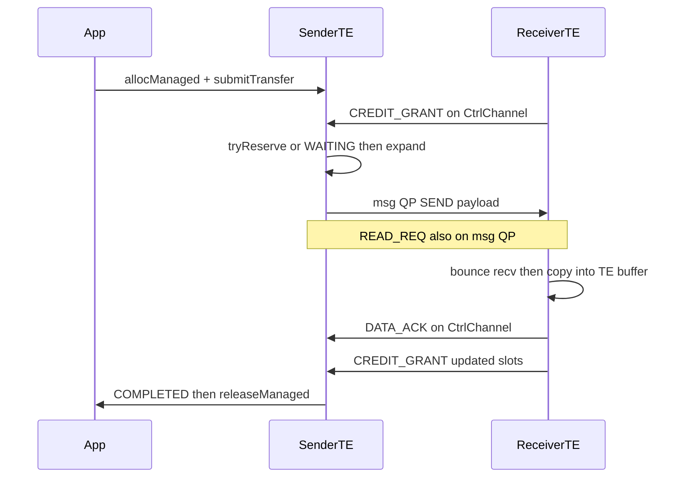

# Classic TE RDMA Two-Sided Communication (Control Plane + Bounce Data Path)

本文描述在 **classic Transfer Engine（TE）** 上落地 RDMA 双边通信的最终成品：**控制面双边**＋**数据面默认双边（TE 托管 bounce）**，单边注册零拷贝路径保留作显式/遗留选项。

目标一句话：

> **默认**数据走 msg QP 的 SEND/RECV，缓冲全部由 TE 分配与回收（上层不 `malloc`/`free` 业务传输内存）；控制信令走 per-peer CtrlChannel（notify QP）；类型化控制帧承载 credit、ACK、FENCE；submit 前 credit admission，不足则排队并按需扩 bounce。注册 segment 的单边 WRITE/READ **保留**，供显式选择的高带宽零拷贝场景。

本文是**最终态**清单。分层依赖：§2–§3（CtrlChannel + 类型帧）可先落地；§4–§5（credit + ACK/FENCE）与 §7（双边数据）应一起接通（双边禁止无 credit 放行）；单边路径保持可编译可跑。

实现侧按模块/函数的代码导读见 [rdma-two-sided-code-map.md](rdma-two-sided-code-map.md)。

## Design Decisions (resolved)

| Topic | Decision |
|-------|----------|
| 默认数据路径 | **默认双边**；单边保留，需显式使用已注册 segment |
| 双边内存 | **全部 TE 托管**；无用户 `malloc`/`free` 传输缓冲接口 |
| 无 credit / Ctrl 重建 | **双边只排队（WAITING）+ 按需扩 bounce**；不 fail-open |
| 多 peer 分槽 | **按需动态** grant；总需求超过已贴槽则扩池后再分 |
| `WAITING` | **使用**现有 `TransferStatusEnum::WAITING`（已在 `transport.h`）表示 credit/扩池排队 |
| Data ack 与 GRANT | **拆开**：`CREDIT_GRANT` 只带资源额度；`DATA_ACK` 专带 per-task 进度（可多帧） |
| `READ_REQ` | **走 msg QP**（与数据同平面），不走 CtrlChannel |
| `sendNotify` | RDMA 路径 **异步**（post 成功即 OK）；重建期可 OOB fallback |
| 安全 | 严格 bounds 校验；非法包丢弃+计数；超阈值断连该 peer msg/ctrl |
| 实现顺序 | CtrlChannel 最小集 + bounce 池 + credit 门禁一并接通双边数据；SESSION/FENCE 可紧随其后 |

## Background

### Current one-sided data path

Classic TE RDMA 热路径今天只有单边：

```text
TransferEngine::submitTransfer
  → TransferEngineImpl / MultiTransport::submitTransfer
    → RdmaTransport::submitTransferTask   // 切 Slice、选 NIC、填 lkey/rkey
      → WorkerPool::submitPostSend
        → RdmaEndPoint::submitPostSend    // IBV_WR_RDMA_READ | WRITE
          → ibv_post_send(data QP)
Worker poll data CQ → Slice/Task 状态
  ← getTransferStatus
```

关键实现：

- [`rdma_endpoint.cpp`](gh-file:mooncake-transfer-engine/src/transport/rdma_transport/rdma_endpoint.cpp) `submitPostSend`
- [`rdma_transport.cpp`](gh-file:mooncake-transfer-engine/src/transport/rdma_transport/rdma_transport.cpp) `submitTransferTask`
- [`worker_pool.cpp`](gh-file:mooncake-transfer-engine/src/transport/rdma_transport/worker_pool.cpp)

### Current notify path (OOB)

`sendNotify` / `getNotifies` 今天走 metadata/handshake **OOB RPC**（带外），不是 RDMA SEND/RECV：

- [`TransferEngineImpl::sendNotifyByID`](gh-file:mooncake-transfer-engine/src/transfer_engine_impl.cpp)
- [`TransferMetadata::sendNotify`](gh-file:mooncake-transfer-engine/src/transfer_metadata.cpp)

### Reference (TENT, pattern only)

TENT 已有独立 `notify_qp_`、recv buffer 池、`sendNotification`，以及本地 `SenderCreditLedger`（尚未完全上线）。Classic TE 最终成品可**借鉴模式**，但实现落在 classic RDMA transport，不依赖链接 TENT 库。

两处**不照搬**：

1. **credit 计量对象**：单边流量用 TE 自计量 inflight 滑窗（`CREDIT_PROGRESS`）；双边 bounce 用真实 bounce 槽计量（TE 托管资源）。ledger 的 grant/consume/epoch 骨架沿用。
2. **通道归属粒度**：改为 **每对 peer 一条 CtrlChannel**（见 §2），独立于 EndpointStore，与 credit key `(receiver_session, sender_peer)` 对齐。

相关参考：

- [`tent/.../endpoint.cpp`](gh-file:mooncake-transfer-engine/tent/src/transport/rdma/endpoint.cpp)
- [`tent/.../receiver_credit.h`](gh-file:mooncake-transfer-engine/tent/include/tent/runtime/receiver_credit.h)

## Goals and Non-Goals

### Goals

1. 独立 **CtrlChannel（notify QP）** + 预贴 recv buffer，支持控制面 RDMA SEND/RECV。
2. **类型化控制帧**（credit / DATA_ACK / FENCE / session 等）。
3. **Credit 流控**全链路；双边不足则 **WAITING 排队**并 **按需扩 bounce**。
4. 控制消息分级可靠：SESSION/FENCE 需 ACK+RTO；GRANT/PROGRESS/DATA_ACK 用累计/幂等。
5. **默认双边数据路径**：缓冲 TE 全托管；`READ_REQ` 与数据同走 msg QP。
6. **保留**注册 segment 单边 WRITE/READ，供显式零拷贝。
7. 现有单边调用方式尽量兼容；双边走新的托管缓冲 API（见 §6）。

### Non-Goals

1. 立刻删除单边代码路径（保留，直至迁移完成）。
2. 在**同一个** QP 上混用 `IBV_WR_SEND` 与 `RDMA_WRITE/READ`。
3. 让用户为双边路径自行 `malloc` 传输缓冲或直接 `free` TE 内部 bounce/落位缓冲。
4. 强制 TCP/EFA/CXI 等非 RDMA transport 实现同一套双边（可继续 OOB 或后续扩展）。

## Architecture

```text
┌─────────────────────────────────────────────────────────────┐
│ Application / Mooncake Store                                │
│  双边默认: allocManaged → submit → status → releaseManaged  │
│  单边遗留: registerLocalMemory → submitTransfer             │
│  sendNotify* / getNotifies                                  │
└───────────────────────────┬─────────────────────────────────┘
                            │
┌───────────────────────────▼─────────────────────────────────┐
│ TransferEngineImpl                                          │
│  · 默认分流 → 双边 msg 路径（peer 能力允许时）               │
│  · 显式注册 segment → 单边 data QP                          │
│  · sendNotify → CtrlChannel / OOB fallback                  │
└─────────────┬───────────────────────────────┬───────────────┘
              │ control                       │ data
┌─────────────▼─────────────┐   ┌─────────────▼───────────────┐
│ CtrlFrame + credit        │   │ RdmaTransport               │
│ DATA_ACK / FENCE / …      │   │  tryReserve → 不足 WAITING  │
└─────────────┬─────────────┘   │  ├─默认双边: msg QP + bounce │
              │                 │  └─显式单边: WRITE/READ     │
┌─────────────▼─────────────┐   └─────────────────────────────┘
│ CtrlChannel (per peer)    │
│  notify QP/CQ, ctrl worker│
└───────────────────────────┘
```



## Detailed Change List

### 1. Handshake and metadata

**Files**

- [`transfer_metadata.h`](gh-file:mooncake-transfer-engine/include/transfer_metadata.h) / [`transfer_metadata.cpp`](gh-file:mooncake-transfer-engine/src/transfer_metadata.cpp)
- RDMA setup in [`rdma_endpoint.cpp`](gh-file:mooncake-transfer-engine/src/transport/rdma_transport/rdma_endpoint.cpp) / [`rdma_transport.cpp`](gh-file:mooncake-transfer-engine/src/transport/rdma_transport/rdma_transport.cpp)

**Changes**

| Item | Description |
|------|-------------|
| `notify_qp_num` / `notify_rq_depth` | CtrlChannel 能力；pending SEND ≤ `min(配置, 对端 rq_depth)` |
| `msg_qp_num[]` | 双边数据 msg QP（per-endpoint）；缺失则该 peer 不能默认双边 |
| 未知字段容忍 | 新旧 HandShakeDesc 双向兼容 |
| Session bootstrap | 交换/派生 `ReceiverSessionId`、初始 `epoch` |
| Managed segment 元数据 | TE 托管缓冲发布为 `two_sided` segment：**无用户 rkey**；地址范围仅 TE 内部可见 |

CtrlChannel handshake per-peer 一次；msg QP 仍随 data endpoint handshake 交换。

### 2. CtrlChannel: per-peer notify QP, CQ, and buffer pools

**归属**：`RdmaTransport` 持有 `peer → CtrlChannel`，**不进 EndpointStore**。

| Item | Description |
|------|-------------|
| notify QP + dedicated CQ | 与 data/msg CQ 分离 |
| Ctrl worker 线程 | 单独轮询 notify CQ；不混入 `WorkerPool::performPollCq` |
| Recv/send 池 | 默认 **4KB × 64**；小帧可 `IBV_SEND_INLINE` |
| `sendCtrlFrame` / `handleCtrlRecv` | 类型分发 + 立刻 repost |
| Lifecycle | 随 transport / peer disconnect：ERR → drain → destroy |

### 3. Typed control frames

**New**：`ctrl_frame.h` / `ctrl_frame.cpp`

```text
| magic | ver | type | flags | session | epoch | seq | ack_seq | payload_len | payload |
```

| Type | Direction | Role |
|------|-----------|------|
| `CREDIT_GRANT` | R → S | **仅**资源累计 grant（`DataBytes`/`RequestSlots`/`BounceBytes`/`BounceSlots`） |
| `CREDIT_PROGRESS` | S → R | 单边滑窗：sender data CQE 累计完成量 |
| `CREDIT_REQUEST` | S → R | 可选，主动要额度 |
| `DATA_ACK` | R → S | 双边 per-task 拷贝进度（见下） |
| `SESSION_OPEN` / `SESSION_CLOSE` | 双向 | session + epoch |
| `FENCE` / `DRAIN_ACK` | 双向 | 世代切换 |
| `CTRL_ACK` | 双向 | 对 SESSION/FENCE 等需确认帧 |
| `NOTIFY_COMPAT` | 双向 | 兼容现有 `NotifyDesc` |

**`DATA_ACK` 载荷（选定方案）**

```text
| ack_count:u16 | repeated { task_id:u64, acked_bytes:u64 } |
```

- 单帧尽量填满剩余 payload（受 4KB 控制槽限制）；装不下则 **连续多帧 `DATA_ACK`**。
- `acked_bytes` 为该 task **累计**已落位字节（幂等，可乱序/重复）。
- **不**塞进 `CREDIT_GRANT`，避免额度更新与完成进度耦合、也避免单帧膨胀。

**`READ_REQ` 不在 CtrlChannel**：见 §7，作为 msg QP 消息头的一种 opcode/flag。

### 4. Credit flow control

**双模资源**

- 单边：`DataBytes` / `RequestSlots` + `CREDIT_PROGRESS` 滑窗。
- 双边：`BounceBytes` / `BounceSlots`；拷贝+repost 后经 `CREDIT_GRANT` 归还；**无 PROGRESS 环路**。

**多 peer（按需动态）**

```text
本机已贴空闲槽 S
  → 按各 peer 的排队/inflight 需求分配 grant（忙的多拿）
  → 空闲 peer 收回未用额度
  → Σ inflight grant ≤ S（不超卖）
  → 若排队需求持续 > S → 扩 bounce（先贴槽再抬 grant）→ 再分配
```

**Admission**

1. `submitTransferTask`：`tryReserve`（task 级一次；slice retry 不计费）。
2. 失败 → per-peer FIFO pending，`getTransferStatus` = **`WAITING`**（已有枚举）。
3. `CREDIT_GRANT` / 扩池完成 → redispatch。
4. 超过 `rdma_credit_queue_timeout_ms` → `FAILED`（0 = 永不超时）。
5. **豁免**：
   - 单边 +（无 notify / `rdma_credit_enabled=false` / Ctrl 重建且 `rdma_ctrl_fail_open`）→ 可不过 gate。
   - **双边：永不 fail-open**；Ctrl 不可用或无 grant → 只 `WAITING`，并触发扩池尝试。

### 5. ACK, retransmission, and FENCE

| Frame | Reliability |
|-------|-------------|
| `CREDIT_GRANT` / `CREDIT_PROGRESS` / `DATA_ACK` | 累计/幂等，不 ACK |
| `SESSION_*` / `FENCE` / `DRAIN_ACK` | `CTRL_ACK` + RTO；耗尽 → 通道重建 |
| `NOTIFY_COMPAT` | 不 ACK（≈ 今日 OOB） |

**通道重建**

1. 重建 QP + `SESSION_OPEN { epoch+1 }`，重同步 grant/progress。  
2. Notify 可 OOB fallback。  
3. **单边** credit 可 fail-open；**双边**保持排队 + 扩池，不放行无 grant SEND。

**FENCE**：停旧 epoch 提交 → 排空 inflight → `deactivate`/`activate`。Data endpoint 驱逐不触发 FENCE。

### 6. Engine API wiring

这是「单边用户 malloc、双边 TE 管」的接口拆分方式。

#### 6.1 单边（遗留 / 显式零拷贝）

保持今天模型：

```text
user_buf = malloc(...)                    // 用户管
engine.registerLocalMemory(user_buf, ...)
engine.submitTransfer(... source/target = user_buf ...)
engine.getTransferStatus(...)
engine.unregisterLocalMemory(user_buf)
free(user_buf)                              // 用户保证无 inflight
```

#### 6.2 双边（默认；TE 全托管）

上层**不**为传输缓冲 `malloc`/`free`：

```text
handle = engine.allocateManagedBuffer(len)   // TE 分配+内部登记 two_sided segment
engine.submitTransfer(... 使用 handle/TE 地址 ...)
engine.getTransferStatus(...)                // 可能 WAITING → PENDING → COMPLETED
engine.releaseManagedBuffer(handle)          // 仅当无 inflight；否则拒绝或内部延后回收
```

| API | Behavior |
|-----|----------|
| `allocateManagedBuffer` / `releaseManagedBuffer`（名称可最终统一） | TE 分配/回收落位与发送 staging；内部 MR/bounce 对用户不可见 |
| `submitTransfer` | peer 支持 msg 且目标为 managed/`two_sided` → 双边；目标为已注册非 two_sided segment → 单边 |
| 默认策略 | 新建传输若未显式指定注册 segment，**优先双边 managed** |
| `getTransferStatus` | credit/扩池排队 → `WAITING`；bounce 完成 → `COMPLETED`（见 DATA_ACK） |
| `sendNotify*` | 优先 RDMA 异步；fallback OOB |
| `getNotifies` | 合并 RDMA + OOB 队列 |

C/Python 绑定同步托管缓冲 API 与 `WAITING` 语义说明。

### 7. Two-sided data path (bounce mode)

**动机**：默认路径下生命周期最简——**缓冲由 TE 分配到释放全闭环**；代价是拷贝与（READ）多一趟消息，可接受则用默认双边，极致带宽再用单边。

**内存**

| 缓冲 | Owner |
|------|--------|
| send bounce / recv SRQ 槽 | TE |
| 落位 managed buffer（segment） | TE |
| 用户堆传输缓冲 | **不使用**（双边路径） |

**分流**

- 默认 / managed `two_sided` → msg 路径。  
- 显式已注册、非 two_sided segment → 单边 WRITE/READ。

**消息格式（msg QP；含 READ）**

```text
[msg header: msg_type | task_id | slice_seq | segment_id | offset | len] + payload?
msg_type = DATA_WRITE | READ_REQ | READ_RESP | …
```

- `DATA_WRITE` / `READ_RESP`：带 payload。  
- `READ_REQ`：**无大 payload**，只带头；走 **msg QP**（可多轨喷洒），响应用 `READ_RESP`。  
- 乱序/重复按 `(task_id, slice_seq)` 幂等。

**传输资源**

| Item | Description |
|------|-------------|
| msg QP | per-endpoint，随 data handshake |
| SRQ | per-context，共享 recv bounce |
| msg CQ | WorkerPool 轮询；wr_id 与 data/ctrl CQ 语义隔离 |
| 接收 | RECV → 校验 segment/bounds → 拷入 TE managed 落位区 → 进度 → `DATA_ACK` + 更新 `CREDIT_GRANT` → repost |

> **TODO / 演进：双边数据面多轨 + poll 粒度对齐单边**
>
> **现状（MVP）**
>
> - 每 peer **一条** `MsgChannel`（单 msg QP），常挂在单一 `RdmaContext` 上。
> - Ctrl **与** Msg 的 CQ 都由 `RdmaTransport` 内 **一条全局 `ctrlWorkerLoop`** 轮询
>   （空闲 `sleep(100µs)`），**未**走每 NIC 的 `WorkerPool`。
> - 控制面流量小，一条线程尚可；但默认双边搬大块时 **字节量与单边同量级**，完成事件也多，
>   单线程 + 非多轨无法对齐全边多卡吞吐与尾延迟（实测已有 ~百微秒级 poll 底噪）。
>
> **目标**
>
> 1. **Msg 数据面多轨**：按 topology / preferred NIC，对每个
>    `(local_nic, peer_nic)`（或等价 rail）建立 msg QP / `MsgChannel`；大块按 slice
>    做 rail 亲和喷洒（与单边 path 选择同思路）。`READ_REQ`/`DATA_WRITE` 均可多轨乱序，
>    用 `(task_id, slice_seq)` 幂等重组。
> 2. **Poll 粒度 per-NIC**：Msg CQ 由对应 `RdmaContext` 的 **WorkerPool**（或同级
>    per-context poller）轮询，与 data CQ 一样吃满多卡并行；**不要**与全局 ctrl worker
>    长期挤在一起。
> 3. **Ctrl 可保持 per-peer 一条**：`CREDIT_GRANT` / `DATA_ACK` / `SESSION_*` 量小，
>    仍可用 transport 级或轻量线程；与 Msg 多轨解耦。
> 4. **Handshake / credit**：交换每轨 `msg_qp_num`（或 per nic-path 描述）；bounce /
>    credit 按轨或共享池计量且不超卖；扩缩池与抬/压 `CREDIT_GRANT` 与多轨一致。
>
> **原则**：控制面按 peer 收敛；**数据面按 rail 扩展**——双边默认路径要扛线速时，
> 多轨 + per-NIC poll 才和单边 `WorkerPool` 同一量级合理。

**安全（选定）**

- 校验 `segment_id` 属于本机 TE managed/`two_sided` segment，且 `offset+len` 在范围内。  
- 失败：丢弃该消息 + metric；同一 peer 连续违规超过阈值 → 断开该 peer 的 msg/ctrl 并报错。

**Bounce 池弹性**

| Item | Description |
|------|-------------|
| 结构 | base + extension 段；默认槽 64KB + 头 |
| 扩容触发 | 空闲低水位、`srq_limit`、**或 pending WAITING 队列超过阈值** |
| 顺序 | 先 alloc+reg+post_recv，再抬 grant |
| 收缩 | 迟滞+冷却；先压 grant → RETIRING → dereg |
| 跨 peer | 按需动态分 grant；不超卖 |

> **TODO（实现缺口）**
>
> 当前 `BouncePool` 仅有 `expand()` API，**无 `shrink`，且 `expand` 尚未被运行时调用**（池大小停留在
> `rdma_msg_pool_base`）。需要补齐：
>
> 1. **收缩逻辑**：空闲高水位 + 迟滞/冷却；先压低对 peer 的 `CREDIT_GRANT`，槽进入
>    RETIRING，inflight 排空后再 `ibv_dereg_mr` / 释放；不得低于 `rdma_msg_pool_base`。
> 2. **内置管理线程**（或挂到现有 ctrl/msg worker 的定时路径）：根据水位、WAITING 队长、
>    inflight、冷却时间决定 **何时扩张 / 何时收缩**，以及 **每次扩张、收缩的步长**
>    （受 `rdma_msg_pool_max` 与配置阈值约束）；扩后抬 grant，缩前先压 grant。
> 3. 将决策与 `MsgChannel` RQ repost、credit `sendCreditGrant` / `redispatchWaitingTasks`
>    接成闭环，避免只扩池不授权或只扣 credit 不还槽。

**完成与重驱动**

| Item | Description |
|------|-------------|
| SEND CQE | 仅到对端 bounce；可回收 send 槽 |
| COMPLETED | 收到覆盖全长的累计 `DATA_ACK` |
| 重驱动 | msg QP 重建后按未 ack slice 重发；接收幂等 |

**READ**

```text
Requester: msg READ_REQ (msg QP)
Responder: 从 TE managed 源区 → send bounce → msg READ_RESP
Requester: recv → 拷入本地 TE managed 目的区 → DATA_ACK → COMPLETED
```

### 8. One-sided stack (kept)

| Component | Keep |
|-----------|------|
| 注册 segment + `submitPostSend` WRITE/READ | 显式零拷贝 |
| Slice / selectDevice / rail retry | 单边语义 |
| 单边 credit 滑窗 + 可选 fail-open | 与双边门禁分离 |

```text
submitTransfer
  → tryReserve
  → 默认双边: (TE buffer) → msg SEND / READ_REQ
       不足 → WAITING → 扩池/按需 grant → redispatch
  → 显式单边: slice → submitPostSend → WRITE/READ
```

### 9. Configuration

| Knob | Default intent |
|------|----------------|
| `rdma_notify_enabled` | on |
| `rdma_notify_recv_count` / `buffer_size` | 64 × 4KB |
| `rdma_notify_max_pending_sends` | min with peer `notify_rq_depth` |
| `rdma_ctrl_rto_us` / `max_retries` | SESSION/FENCE |
| `rdma_credit_enabled` | on |
| `rdma_credit_window_bytes` / `_requests` | 单边滑窗 |
| `rdma_credit_queue_timeout_ms` | 0 = 永不（或部署可配） |
| `rdma_ctrl_fail_open` | **仅影响单边**；双边忽略该开关 |
| `rdma_notify_oob_fallback` | on |
| `rdma_msg_enabled` | on（默认双边能力） |
| `rdma_msg_default` | on：优先 managed 双边 |
| `rdma_msg_slot_size` | 64KB + header |
| `rdma_msg_pool_base` / `_max` | 常驻与扩容上限 |
| `rdma_msg_shrink_idle_ms` / `_watermark` | 收缩 |
| `rdma_msg_srq_limit` | 扩容事件 |
| `rdma_msg_pending_expand_threshold` | WAITING 队列长度触发扩容 |
| `rdma_msg_violation_threshold` | 非法包断连阈值 |

命名对齐 `MC_*`，在 `loadGlobalConfig` 加载。

### 10. Observability

- notify / ctrl RTO / 通道重建  
- credit insufficient、WAITING 时长、扩池次数  
- 多 peer grant 分配、池水位  
- bounce 拷贝延迟、DATA_ACK 滞后、非法包计数  
- 默认双边 vs 显式单边流量占比  

### 11. Tests

| Case | Expectation |
|------|-------------|
| 默认双边 e2e | managed alloc→WRITE/READ→COMPLETED→release |
| 显式单边仍可用 | 注册内存零拷贝路径回归 |
| WAITING→扩池→恢复 | 排队不 RNR；扩后前进 |
| 多 peer 按需 | 忙 peer 多 grant；不超卖；可扩 |
| Ctrl 重建 | 双边保持 WAITING；单边按 fail_open |
| DATA_ACK 多帧 | 大批量 task 进度不丢 |
| READ_REQ on msg QP | 多轨乱序正确 |
| 非法 offset | 丢弃；超阈值断连 |
| Endpoint 驱逐 | CtrlChannel/ledger/SRQ 槽不受影响 |
| 兼容旧 peer | 无 msg/notify 能力时回退行为明确 |
| HandShake 未知字段 | 新旧互操作 |
| notify / bench | 回归 + 新建 managed 路径 bench |

### 12. Documentation and bindings

- 本文  
- C++/Python/C：托管缓冲 API、默认双边、`WAITING`、单边如何显式开启  
- 选型：默认双边（生命周期简单）；极致带宽 → 显式注册单边  

## Call Stack Comparison

### Before

```text
Data:  submitTransfer → … → WRITE/READ（用户注册内存）
Ctrl:  sendNotify → OOB RPC
```

### After

```text
Data (default):
  allocManaged → submitTransfer → tryReserve
    → msg QP SEND/READ_REQ (TE buffers + bounce)
    → WAITING + expand if needed
    → DATA_ACK → COMPLETED → releaseManaged

Data (legacy explicit):
  registerLocalMemory → submitTransfer → WRITE/READ

Ctrl:
  CtrlChannel typed frames (GRANT / DATA_ACK / FENCE / …)
```

## File Checklist (summary)

| Area | Paths |
|------|--------|
| Handshake | `transfer_metadata.*`, `rdma_endpoint.*`, `rdma_transport.*` |
| CtrlChannel | new `ctrl_channel.*`, ctrl worker in `rdma_transport.*` |
| Frames | new `ctrl_frame.*`（含 `DATA_ACK`） |
| Credit | new `receiver_credit.*`, admission + pending + 按需分槽/扩池 |
| Two-sided data | new msg/bounce 模块；`rdma_context` SRQ/msg CQ；`worker_pool` msg poll |
| API | `transfer_engine*.h/cpp`：managed alloc/release；默认分流 |
| Config/tests/docs | `MC_*`、指标、测试、本文与 API 参考 |

## Performance Note

- **默认双边**：优化生命周期与正确性（TE 全托管、有槽才发），不是峰值带宽。  
- **显式单边**：KVCache 等可常驻注册的大流量零拷贝。  
- 控制面相对 OOB：降低 notify 延迟；与 data/msg CQ 分离改善控制尾延迟。

## Related Documents

- [Transfer Engine overview](index.md)
- [TENT overview](../tent/overview.md)
- [TENT receiver credit](gh-file:mooncake-transfer-engine/tent/include/tent/runtime/receiver_credit.h)
