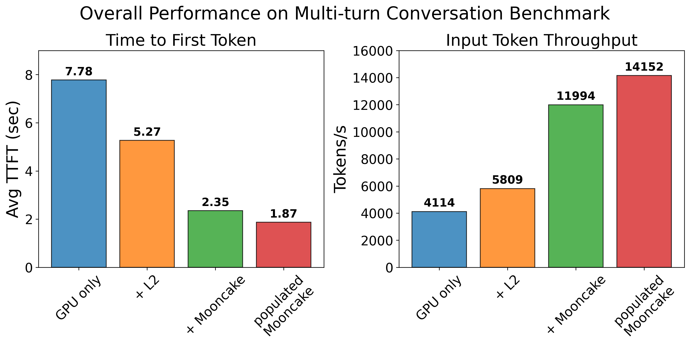
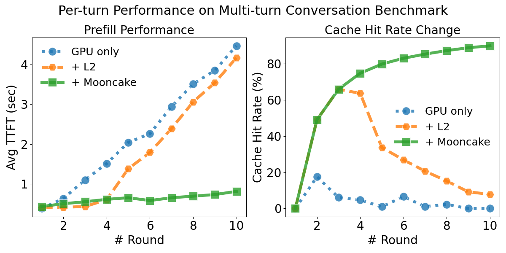

# SGLang HiCache with Mooncake Backend Benchmark

We evaluated the performance of SGLang HiCache using a multi-turn conversation benchmark designed to simulate realistic user interactions. The benchmark spawns concurrent clients, each engaging in multi-round conversations. For every client, starting from the second round, the input consists of the concatenation of the input and output from the preceding round.

Our evaluation covers four different configurations:

* **GPU only**: KV cache stored in GPU memory.
* **(HiCache L1) + L2**: KV cache stored across both device and host memory.
* **(HiCache L1 + L2) + Mooncake backend**: KV cache stored across device, host, and Mooncake storage.
* **Pre-populated Mooncake**: Same as *L1 + L2 + Mooncake*, except that the KV cache is preloaded into Mooncake storage before testing.

Since HiCache is currently used to accelerate the prefill stage, this benchmark focuses on two key prefill metrics: Time-To-First-Token (TTFT) and input token throughput.

## Benchmark Result



We first evaluated the overall performance on a cluster consisting 3 servers, each has 2 NVIDIA A10 GPUs and 2 100Gbps eRDMA NICs.

As shown in the figure, in terms of prefill performance, `populated Mooncake` achieves the best results, followed by `+Mooncake`, `+L2`, and finally `GPU only`.



Next, we take a closer look at the sources of performance differences. We recorded the TTFT and cache hit rate for each conversation round. The experiment was conducted on a server equipped with 8 × H800 GPUs and 8 × mlx5 RDMA NICs. To minimize interference from the decode stage and highlight prefill performance differences, we set the output length to 1.

From the figure, we observe that the KV cache hit rate has a substantial impact on prefill performance. When the cache is hit, the TTFT is significantly lower compared to the cache-miss case.

Across all rounds, `+L2` outperforms `GPU only`, as host memory provides additional capacity for storing the KV cache.

In the first three rounds, `+Mooncake` and `+L2` exhibit the same cache hit rate. During this phase, `+L2` is slightly faster than `+Mooncake` since it avoids the overhead of fetching data from remote storage. However, as the number of rounds increases and the KV cache size exceeds the `+L2`'s memory capacity, `+L2`’s hit rate gradually decreases, leading to a noticeable increase in TTFT. In contrast, Mooncake maintains a high hit rate, and its TTFT grows only very slowly.

In practical deployment, Mooncake aggregates memory across the entire cluster into a large distributed memory pool, enabling the caching of a vast number of KV entries. Each cached KV can be shared by all SGLang instances, which substantially improves the cache hit rate under the same memory budget. As a result, Mooncake reduces inference latency and increases throughput for large-scale model serving.

## Benchmark Setup

### A10 Cluster

**Experimental Environment**

- Hardware Configuration: 2 × NVIDIA A10, 2 × 100Gbps eRDMA NICs.
- Model: Qwen3-14B

**Cluster Deployment:**
The benchmark was conducted across a 3-node cluster connected via eRDMA:
- Machine A: SGLang server, Mooncake master service, Mooncake client (30GB memory)
- Machine B: Mooncake client (60GB memory)  
- Machine C: Mooncake client (60GB memory)
- Total Distributed Memory Pool: 150GB


**Benchmark Script:**

```bash
python3 benchmark/hicache/bench_multiturn.py \
    --model-path $MODEL_PATH \
    --disable-random-sample \
    --output-length 16 \
    --request-length 2048 \
    --num-clients 20 \
    --num-rounds 10 \
    --max-parallel 4 \
    --request-rate 20 \
    --ready-queue-policy random \
    --disable-auto-run \
    --seed 42
```

**GPU Only:**

```bash
python3 -m sglang.launch_server \
    --model-path $MODEL_PATH \
    --tp-size 2 \
    --page-size 64
```

**HiCache L1 + L2:**

```bash
python3 -m sglang.launch_server \
    --model-path $MODEL_PATH \
    --tp-size 2 \
    --page-size 64 \
    --enable-hierarchical-cache \
    --hicache-write-policy write_through \
    --hicache-ratio 2 --hicache-size 0
```

**L1 + L2 + Mooncake:**

```bash
MOONCAKE_TE_META_DATA_SERVER="http://127.0.0.1/metadata" \
MOONCAKE_GLOBAL_SEGMENT_SIZE=0 \
MOONCAKE_PROTOCOL="rdma" \
MOONCAKE_DEVICE="$DEVICE_LIST" \
MOONCAKE_MASTER=127.0.0.1:50051 \
python3 -m sglang.launch_server \
    --model-path $MODEL_PATH \
    --tp-size 2 \
    --page-size 64 \
    --enable-hierarchical-cache \
    --hicache-write-policy write_through \
    --hicache-ratio 2 --hicache-size 0 \
    --hicache-storage-prefetch-policy wait_complete \
    --hicache-storage-backend mooncake
```

**Populated Mooncake**

`Populated Mooncake` uses the same parameters as `L1 + L2 + Mooncake`, except that the KV cache is preloaded into Mooncake storage before testing.

### H800 Server

**Experimental Environment**

- Hardware Configuration: 8 × H800 GPUs, 8 × mlx5 RDMA NICs, 2 NUMA nodes.
- Model: Qwen3-235B-A22B-Instruct-2507

**Benchmark Script:**

We used SGLang's [multiturn benchmark](https://github.com/sgl-project/sglang/blob/main/benchmark/hicache/bench_multiturn.py) for the evaluation.

```bash
python3 benchmark/hicache/bench_multiturn.py \
    --model-path $MODEL_PATH \
    --dataset-path $DATASET_PATH \
    --disable-random-sample \
    --output-length 1 \
    --request-length 2048 \
    --num-clients 80 \
    --num-rounds 10 \
    --max-parallel 4 \
    --request-rate 16 \
    --ready-queue-policy random \
    --disable-auto-run \
    --enable-round-barrier
```

**GPU Only:**

```bash
numactl --cpunodebind=0,1 --interleave=0,1 \
python3 -m sglang.launch_server \
    --model-path $MODEL_PATH \
    --tp 8 \
    --page-size 64
```

**HiCache L1 + L2:**

```bash
numactl --cpunodebind=0,1 --interleave=0,1 \
python3 -m sglang.launch_server \
    --model-path $MODEL_PATH \
    --tp 8 \
    --page-size 64 \
    --enable-hierarchical-cache \
    --hicache-write-policy write_through \
    --hicache-size 30 # 8*30 = 240GB
```

**L1 + L2 + Mooncake:**

```bash
# Total Distributed Memory Pool: 760GB
numactl --cpunodebind=0,1 --interleave=0,1 \
MOONCAKE_TE_META_DATA_SERVER="http://127.0.0.1:8080/metadata" \
MOONCAKE_GLOBAL_SEGMENT_SIZE=816043786240 \
MOONCAKE_PROTOCOL="rdma" \
MOONCAKE_DEVICE="$DEVICE_LIST" \
MOONCAKE_MASTER=127.0.0.1:50051 \
python3 -m sglang.launch_server \
    --model-path $MODEL_PATH \
    --tp 8 \
    --page-size 64 \
    --enable-hierarchical-cache \
    --hicache-write-policy write_through \
    --hicache-ratio 2 \
    --hicache-storage-prefetch-policy timeout \
    --hicache-storage-backend mooncake
```