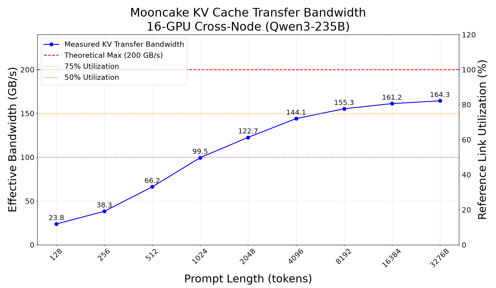
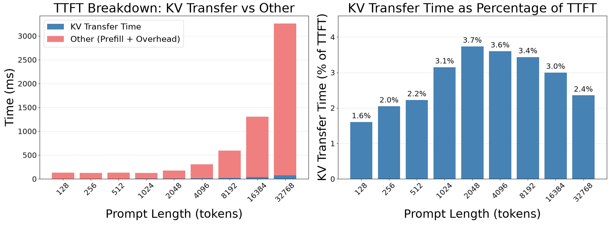
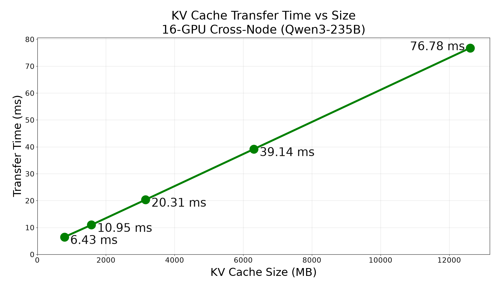

# SGLang PD Disaggregation Performance

Mooncake provides a KV transfer backend for SGLang, enabling Prefill-Decode (PD) disaggregation through the Mooncake Transfer Engine. We evaluated this integration, focusing on the efficiency of cross-node KV cache transfer over RoCE v2.

## Benchmark Result

### Bandwidth Performance

We measured the transfer bandwidth during the execution of requests with varying prompt lengths.



In a 1P1D (1 Prefiller, 1 Decoder) configuration using the Qwen3-235B-A22B-Instruct-2507 model, Mooncake achieved a peak transfer bandwidth of **164.3 GB/s**. Compared with the 200 GB/s aggregate line rate of four 400GbE links per node, this represents **82.2% bandwidth utilization**. This result demonstrates that the Mooncake Transfer Engine and GPUDirect RDMA can sustain high aggregate throughput over the cross-node RoCE v2 fabric.

### Time to First Token (TTFT)

We analyzed the Time To First Token (TTFT) to understand the impact of KV transfer overhead on end-to-end latency. The curve peaks at 2,048 tokens. Beyond this point, prefill computation grows faster than KV transfer time, so transfer accounts for a smaller share of TTFT.





The results show that Mooncake's high-speed transfer keeps the overhead of moving the KV cache small relative to computation time. For a prompt length of 32,768 tokens (transferring 12.62 GB of KV data), the KV transfer took **76.78 ms**, accounting for **2.4%** of the total TTFT.

**Detailed Performance Data:**

| Prompt Length | TTFT (ms) | KV Size | Transfer Time (ms) | Bandwidth (GB/s) | Bandwidth Utilization |
|---|---:|---:|---:|---:|---:|
| 128 tokens | 129.21 | 49 MB | 2.07 | 23.79 | 11.9% |
| 256 tokens | 125.76 | 99 MB | 2.58 | 38.27 | 19.1% |
| 512 tokens | 133.91 | 197 MB | 2.98 | 66.18 | 33.1% |
| 1,024 tokens | 125.84 | 394 MB | 3.96 | 99.47 | 49.7% |
| 2,048 tokens | 172.05 | 789 MB | 6.43 | 122.66 | 61.3% |
| 4,096 tokens | 304.02 | 1.58 GB | 10.95 | 144.05 | 72.0% |
| 8,192 tokens | 591.14 | 3.15 GB | 20.31 | 155.26 | 77.6% |
| 16,384 tokens | 1,305.15 | 6.31 GB | 39.14 | 161.19 | 80.6% |
| 32,768 tokens | 3,260.14 | 12.62 GB | 76.78 | 164.33 | 82.2% |

## Benchmark Setup

### H20 Cluster

- **Hardware Configuration**: NVIDIA H20-3e (143 GB) x 16 (8 per node), 8x NVIDIA/Mellanox ConnectX-7 400GbE ports (4 per node).
- **Topology**: 1P1D. The Prefiller and Decoder are connected through RoCE v2. The SGLang Router runs on the Decoder node.
- **Model**: Qwen3-235B-A22B-Instruct-2507 (BF16).
- **SGLang version**: main at commit [`43124cdd`](https://github.com/sgl-project/sglang/commit/43124cdd), pulled on July 15, 2026.
- **Mooncake version**: main at commit [`6e3a11b9`](https://github.com/kvcache-ai/Mooncake/commit/6e3a11b9), pulled on July 15, 2026.
- **KV Transfer Backend**: Mooncake Transfer Engine.
- **Transfer Method**: Cross-node RDMA over RoCE v2.
- **Cache Configuration**: HiCache and radix cache disabled; chunked prefill disabled.

### Launch Commands

**Prefiller:**

```bash
SGLANG_HOST_IP=<PREFILL_HOST_IP> \
MOONCAKE_PROTOCOL=rdma \
WITH_NVIDIA_PEERMEM=1 \
python -m sglang.launch_server \
  --model-path /path/to/Qwen3-235B-A22B-Instruct-2507 \
  --host 0.0.0.0 --port 30000 \
  --tp-size 8 \
  --dtype bfloat16 \
  --trust-remote-code \
  --stream-interval 1 \
  --chunked-prefill-size -1 \
  --disable-radix-cache \
  --disaggregation-mode prefill \
  --disaggregation-bootstrap-port 8998 \
  --disaggregation-transfer-backend mooncake \
  --disaggregation-ib-device /path/to/ib_devices.json \
  --enable-request-time-stats-logging
```

**Decoder:**

```bash
SGLANG_HOST_IP=<DECODE_HOST_IP> \
MOONCAKE_PROTOCOL=rdma \
WITH_NVIDIA_PEERMEM=1 \
python -m sglang.launch_server \
  --model-path /path/to/Qwen3-235B-A22B-Instruct-2507 \
  --host 0.0.0.0 --port 30001 \
  --tp-size 8 \
  --dtype bfloat16 \
  --trust-remote-code \
  --stream-interval 1 \
  --chunked-prefill-size -1 \
  --disable-radix-cache \
  --disaggregation-mode decode \
  --disaggregation-transfer-backend mooncake \
  --disaggregation-ib-device /path/to/ib_devices.json \
  --enable-request-time-stats-logging
```

**Router (Decoder Node):**

```bash
python -m sglang_router.launch_router \
  --host 0.0.0.0 --port 8000 \
  --pd-disaggregation \
  --prefill http://<PREFILL_HOST_IP>:30000 8998 \
  --decode http://<DECODE_HOST_IP>:30001 \
  --policy round_robin
```

### Benchmark Script

We used the official `sglang.benchmark.serving` module to generate traffic with varying prompt lengths. Each prompt length contains 50 requests with an output length of 128 tokens.

```bash
for prompt_len in 128 256 512 1024 2048 4096 8192 16384 32768; do
  python -m sglang.benchmark.serving \
    --backend sglang \
    --base-url http://127.0.0.1:8000 \
    --model /path/to/Qwen3-235B-A22B-Instruct-2507 \
    --served-model-name Qwen3-235B-A22B-Instruct-2507 \
    --tokenizer /path/to/Qwen3-235B-A22B-Instruct-2507 \
    --dataset-name random \
    --dataset-path /path/to/ShareGPT_V3_unfiltered_cleaned_split.json \
    --num-prompts 50 \
    --random-input-len "${prompt_len}" \
    --random-output-len 128 \
    --random-range-ratio 1.0 \
    --request-rate inf \
    --max-concurrency 1 \
    --seed 42 \
    --flush-cache \
    --warmup-requests 1 \
    --tokenize-prompt \
    --output-details \
    --output-file "result-${prompt_len}.jsonl"
done
```

## Previous Benchmark: PD Disaggregation vs. Regular SGLang

We evaluated the earlier implementation on two A10 servers. By comparing the performance of a 1P1D configuration with that of two regular (non-disaggregated) instances, we observed that P/D disaggregation achieves approximately 30% lower ITL while maintaining comparable total throughput. This aligns with findings from the Mooncake paper, which highlighted that P/D disaggregation is effective in reducing TBT/ITL under similar throughput conditions—or conversely, in enabling higher throughput under stricter ITL/TBT SLOs.

Moreover, we anticipate even greater benefits in larger-scale clusters where both the number of prefill and decode nodes (x and y in xPyD configurations) increase, offering enhanced scheduling flexibility and resource efficiency.

### Traffic Request Rate: 1.0

- model: Qwen2.5-7B-Instruct-GPTQ-Int4
- TP: 4
- random_input_len=8192, random_output_len=512
- num prompt=50

| Configuration  | Output Token Throughput (tok/s)  | Mean E2E Latency (ms) |Total Token Throughput (tok/s)  | Mean TTFT (ms) | P99 TTFT (ms) | Mean ITL (ms) | P99 ITL (ms) |
|----------------|----------------------------------|-----------------------|----------------|---------------|---------------|--------------|---------------------------------|
| 1P1D           | 407.59                           | 3413.86               |7084.46                         | 732.54         | 2952.57       | 7.23          | 10.76        |
| 2 Regular      | 427.65                           | 4586.54               |7433.27                         | 767.18         | 1264.88       | 10.30         | 12.73        |

### Traffic Request Rate: 4.0

- model: Qwen2.5-7B-Instruct-GPTQ-Int4
- TP: 2
- random_input_len=2048, random_output_len=512
- num prompt=200

| Configuration | Output Token Throughput (tok/s) | Mean E2E Latency (ms)  | Total Token Throughput (tok/s)  | Mean TTFT (ms) |P99 TTFT (ms) | Mean ITL (ms) | P99 ITL (ms) |
|---------------|---------------------------------|-------------|--------------------------------|----------------|---------------|----------------|--------------|
| 1P1D          | 1215.17                         | 11519.24    | 6161.43                        | 1111.94        | 2725.89       | 17.06          | 19.72        |
| 2 Regular     | 1223.03                         | 11683.15    | 6201.29                        | 310.01         | 720.91        | 25.74          | 294.89       |

By the Mooncake Team

© Copyright 2026, Mooncake Team.
