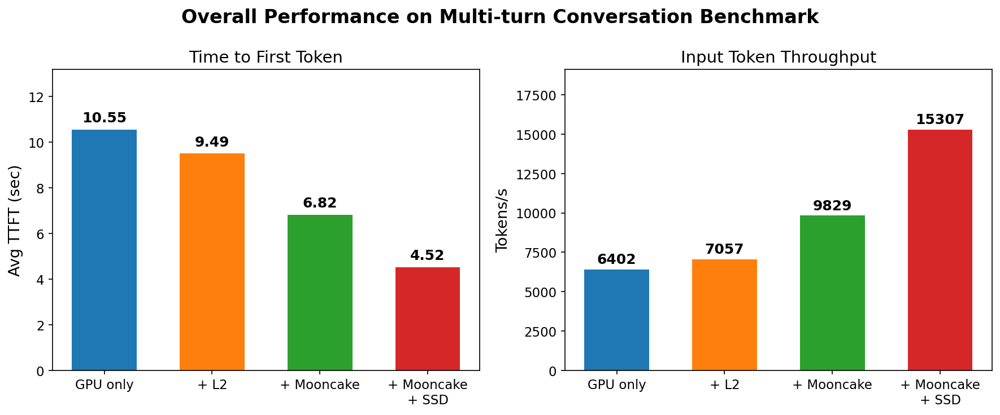
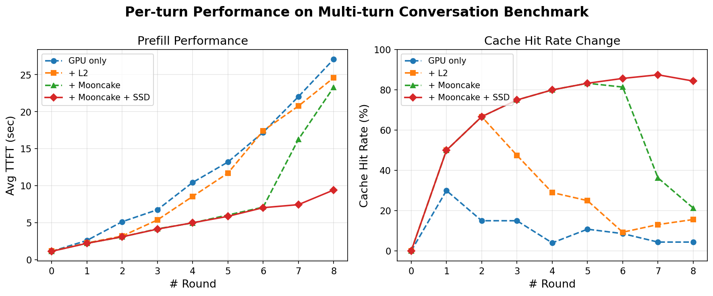

# Mooncake SSD Offload Benchmark

This benchmark measures the performance benefit of Mooncake's SSD offload feature in multi-turn conversation scenarios. In the test, multiple clients send requests concurrently, each simulating a multi-round dialogue where every new round appends the previous context.

We compare four storage configurations for the KV cache:

* **GPU only**: KV cache resides entirely in GPU memory.
* **(HiCache L1) + L2**: KV cache spans GPU and host memory via HiCache's two-level hierarchy.
* **(HiCache L1 + L2) + Mooncake**: KV cache is further extended into an 80GB Mooncake distributed memory pool.
* **(HiCache L1 + L2) + Mooncake + SSD**: On top of the above, SSD offload is enabled so that evicted cache entries are written to local NVMe storage rather than discarded.

The benchmark targets the prefill stage and reports two primary metrics: Time-To-First-Token (TTFT) and input token throughput.

## Benchmark Result



The figure above summarizes the end-to-end results on a single DGX node (8 × A100-SXM4-40GB, dual RDMA NICs). Enabling SSD offload cuts average TTFT by **57%** relative to GPU only and by **34%** relative to Mooncake without SSD, while delivering a **2.4×** improvement in input token throughput.



To better understand where the gains come from, we break down TTFT and cache hit rate by conversation round. The output length is fixed to 1 token so that decode overhead does not obscure prefill differences.

During the first six rounds the 80GB memory pool is large enough, so `+ Mooncake` and `+ Mooncake + SSD` behave identically — both sustain hit rates above 80%.

The divergence appears in round 7. Once the accumulated KV cache exceeds memory capacity, `+ Mooncake` must evict entries and its hit rate plunges from 83% to 36%, pushing TTFT from 6s to 16s. With SSD offload, those evicted entries survive on disk and remain retrievable; the hit rate stays above 84% through round 8, and TTFT remains at 9.4s — roughly half the latency of Mooncake without SSD.

Note that a slight increase in TTFT is visible in round 8 with SSD offload (9.4s vs 7.4s in round 7), reflecting the additional latency of reading evicted entries from NVMe storage rather than RDMA memory. This overhead is modest compared to the alternative of re-computing evicted KV cache from scratch.

This demonstrates that SSD offload turns local NVMe drives into a cost-effective extension of the cache hierarchy. In production, where long conversations and high concurrency are common, this prevents the sharp performance cliff that occurs when DRAM-based caching alone is exhausted.

## Benchmark Setup

### DGX Server

**Experimental Environment**

- GPU: 8 × NVIDIA A100-SXM4-40GB
- Network: Dual RDMA NICs (ibp12s0, ibp75s0), InfiniBand 4X HDR 200 Gb/s each
- Storage: 5 × Samsung NVMe SSDs in RAID0 — 3 × PM1733 3.84TB (PCIe Gen4, 7,000 MB/s seq read each) + 2 × PM983 1.92TB (PCIe Gen3, 3,000 MB/s seq read each). Aggregate theoretical sequential read bandwidth: ~27 GB/s. Mounted at /mnt/data (~14TB usable), used as the SSD offload target.
- Model: Qwen3-8B

**Benchmark Script:**

We used SGLang's [multiturn benchmark](https://github.com/sgl-project/sglang/blob/main/benchmark/hicache/bench_multiturn.py) for the evaluation.

```bash
python3 benchmark/hicache/bench_multiturn.py \
    --model-path $MODEL_PATH \
    --host 127.0.0.1 \
    --port 8189 \
    --disable-random-sample \
    --output-length 1 \
    --request-length 4096 \
    --num-clients 20 \
    --num-rounds 10 \
    --max-parallel 4 \
    --request-rate 16 \
    --ready-queue-policy random \
    --disable-auto-run \
    --enable-round-barrier
```

**GPU Only:**

```bash
python3 -m sglang.launch_server \
    --model-path $MODEL_PATH \
    --tp 1 \
    --page-size 64 \
    --attention-backend triton
```

**HiCache L1 + L2:**

```bash
python3 -m sglang.launch_server \
    --model-path $MODEL_PATH \
    --tp 1 \
    --page-size 64 \
    --attention-backend triton \
    --enable-hierarchical-cache \
    --hicache-ratio 2
```

**L1 + L2 + Mooncake:**

Mooncake master and client must be started before launching the SGLang server.

```bash
# Start Mooncake master
mooncake_master \
    -http_metadata_server_port=8081 \
    -metrics_port=9004 \
    -logtostderr

# Start Mooncake client (requires root)
# Total Distributed Memory Pool: 80GB
mooncake_client \
    --host=127.0.0.1 \
    --global_segment_size=80GB \
    --master_server_address=localhost:50051 \
    --metadata_server=P2PHANDSHAKE \
    --protocol=rdma \
    --device_names=ibp12s0,ibp75s0 \
    --port=50052 \
    --logtostderr
```

```bash
MOONCAKE_MASTER="127.0.0.1:50051" \
MOONCAKE_GLOBAL_SEGMENT_SIZE=0 \
MOONCAKE_PROTOCOL="rdma" \
MOONCAKE_DEVICE="ibp12s0,ibp75s0" \
python3 -m sglang.launch_server \
    --model-path $MODEL_PATH \
    --tp 1 \
    --page-size 64 \
    --attention-backend triton \
    --enable-hierarchical-cache \
    --hicache-ratio 2 \
    --hicache-storage-prefetch-policy wait_complete \
    --hicache-mem-layout page_first_direct \
    --hicache-storage-backend mooncake
```

**L1 + L2 + Mooncake + SSD:**

Compared to the previous configuration, the only change is enabling SSD offload on both master and client. A 20GB local buffer absorbs write bursts before flushing to SSD.

```bash
# Start Mooncake master with offload enabled
mooncake_master \
    -enable_offload=true \
    -http_metadata_server_port=8081 \
    -metrics_port=9004 \
    -logtostderr

# Start Mooncake client with offload enabled (requires root)
# Total Distributed Memory Pool: 80GB
# SSD Offload Buffer: 20GB
MOONCAKE_OFFLOAD_FILE_STORAGE_PATH="/mnt/data/file_storage" \
MOONCAKE_OFFLOAD_LOCAL_BUFFER_SIZE_BYTES=21474836480 \
MOONCAKE_USE_URING=1 \
mooncake_client \
    --host=127.0.0.1 \
    --global_segment_size=80GB \
    --master_server_address=localhost:50051 \
    --metadata_server=P2PHANDSHAKE \
    --protocol=rdma \
    --device_names=ibp12s0,ibp75s0 \
    --enable_offload=true \
    --port=50052 \
    --logtostderr
```

The SGLang server launch command is identical to `L1 + L2 + Mooncake`.
