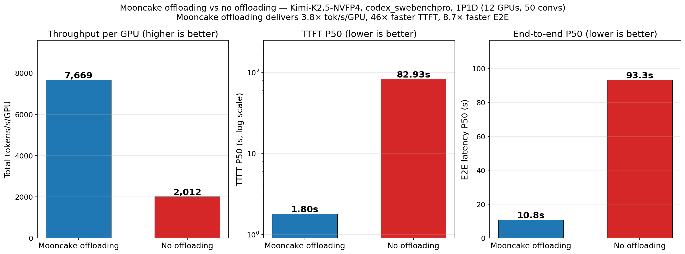
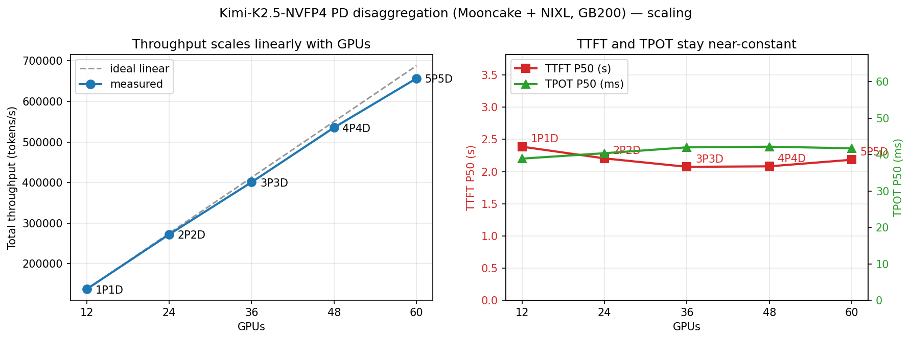

# Benchmark performance
Mooncake leverages the `MooncakeStoreConnector` in vLLM V1 to enable a distributed KV cache pool, supporting cross-instance sharing and reuse of KV caches. Furthermore, vLLM's `MultiConnector` can be configured to orchestrate both the `MooncakeConnector` (for peer-to-peer KV transfer) and the `MooncakeStoreConnector` (for the shared pool), enabling prefill-decode (PD) disaggregation.

We thank the vLLM team, particularly the Inferact team, for conducting the performance evaluation. The results are presented below.

> The original blog is available at https://vllm.ai/blog/2026-05-06-mooncake-store.

## Speeding up real agentic traces

Setup: Kimi-2.5 NVFP4 model on GB200 nodes with PD disaggregation

In this experiment, the model was deployed with a 1P1D configuration across 12 GPUs in total.

The distributed KV cache pool improves vLLM throughput by 3.8x and reduces P50 TTFT and E2E latency by 46x and 8.6x, respectively. These gains are driven by a dramatic increase in cache hit rate: from 1.7%, where only the system prompt is cached, to 92.2%, where nearly the entire prefix is cached.

## Scaling out to multiple nodes

Experiment settings:

* 20K common tokens (system instructions)
* 10K tokens first input
* 2,048 tokens per-turn input length
* 900 output tokens
* 30 turns total
* Number of sessions scaled with number of GPUs: 75 → 150 → 225 → 300 → 375
* Parameters were chosen to roughly align with the original Codex workload and keep the total output/input ratio ~1.3%

To stress-test the datapath under cross-node traffic, we used round-robin routing. As a result, requests could be scheduled on different nodes across turns and often needed to fetch KV caches from a previous node.

Without a distributed KV cache pool, this routing pattern would cause massive cache misses and severe throughput degradation. With Mooncake Store, vLLM consistently achieves a cache hit rate above 95%, and the system scales nearly linearly to 60 GPUs.

This result shows that the distributed KV cache pool substantially improves cache hit rate while maintaining an efficient datapath as the cluster grows.

## Benchmark Scripts

The benchmark scripts are provided in the artifact repository [here](https://github.com/ivanium/vllm/tree/feat/mooncake-store-int/scripts/mooncake/artifacts).

