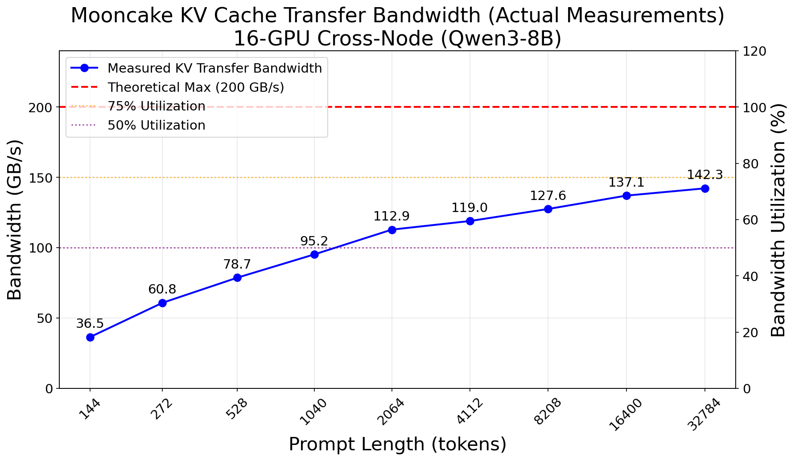
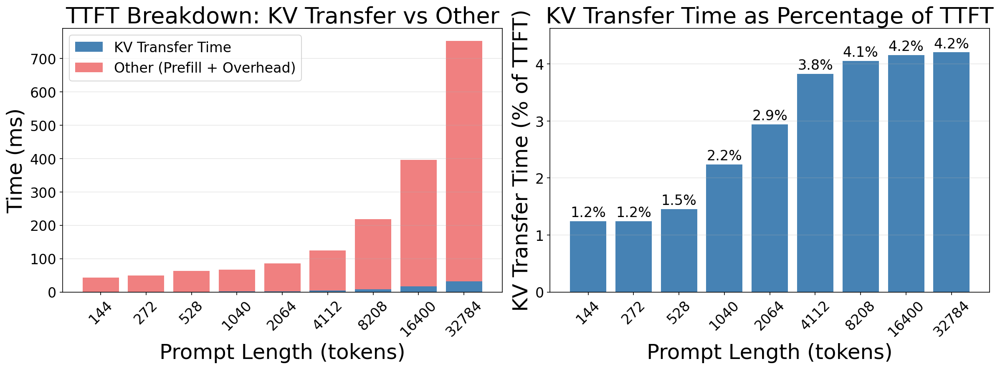
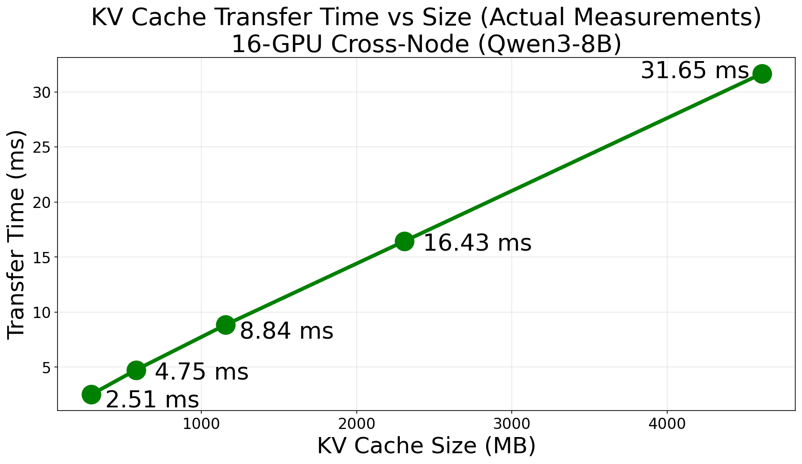

# vLLM with Mooncake Transfer Engine Benchmark

Mooncake has now implemented a vLLM connector, enabling direct support for the Prefill-Decode (PD) separation architecture in vLLM v1. We evaluated the performance of this integration, focusing on the efficiency of cross-node KV cache transfer using RDMA.

## Benchmark Result

### Bandwidth Performance

We measured the actual transfer bandwidth during the execution of requests with varying prompt lengths.



In a 1P1D (1 Prefiller, 1 Decoder) configuration using the Qwen3-8B model, Mooncake achieved a peak actual transfer bandwidth of **142.25 GB/s**. Given the theoretical maximum bandwidth of approximately 200 GB/s for the 8x RoCE connections, this represents a **71.1% bandwidth utilization rate**. This efficiency demonstrates that the custom transfer protocol and GPU Direct RDMA capabilities can effectively saturate high-performance networks.

### End-to-End Latency (TTFT)

We analyzed the Time To First Token (TTFT) to understand the impact of KV transfer overhead on end-to-end latency.





The results show that Mooncake's high-speed transfer ensures that the overhead of moving KV cache is negligible compared to the computation time. For a prompt length of 32,768 tokens (transferring 4.50 GB of data), the actual KV transfer took only **31.65 ms**, accounting for merely **4.2%** of the total TTFT.

**Detailed Performance Data:**

| Prompt Length | Mean TTFT (ms) | KV Size | Actual Transfer Time (ms) | Actual Bandwidth (GB/s) | Bandwidth Utilization |
|-------------|----------------|---------|-------------------|-----------------|------------|
| 128 tokens  | 46.09          | 20 MB   | 0.54              | 36.53           | 18.3%      |
| 256 tokens  | 48.04          | 38 MB   | 0.61              | 60.78           | 30.4%      |
| 512 tokens  | 59.91          | 74 MB   | 0.92              | 78.73           | 39.4%      |
| 1024 tokens | 67.29          | 146 MB  | 1.50              | 95.23           | 47.6%      |
| 2048 tokens | 85.31          | 290 MB  | 2.51              | 112.88          | 56.4%      |
| 4096 tokens | 124.42         | 578 MB  | 4.75              | 119.00          | 59.5%      |
| 8192 tokens | 212.05         | 1.13 GB | 8.84              | 127.57          | 63.8%      |
| 16384 tokens| 387.52         | 2.25 GB | 16.43             | 137.09          | 68.5%      |
| 32768 tokens| 749.62         | 4.50 GB | 31.65             | 142.25          | 71.1%      |

## Benchmark Setup

### H800 Cluster

Experimental Environment

• **Hardware Configuration**: NVIDIA H800 (81GB) x 16 (8 per node), 8x Mellanox ConnectX-7 (RoCE over Ethernet).
• **Topology**: Prefiller and Decoder connected via RoCE.
• **Model**: Qwen3-8B
• **vLLM Version**: 0.11.2.dev358
• **KV Connector**: MooncakeConnector
• **Transfer Method**: Cross-Node RDMA

### Launch Commands

**Prefiller :**

```bash
VLLM_LOGGING_LEVEL=DEBUG CUDA_VISIBLE_DEVICES=0,1,2,3,4,5,6,7 \
  python -m vllm.entrypoints.openai.api_server \
  --model /work/models/Qwen3-8B \
  --host 0.0.0.0 --port 8010 \
  --tensor-parallel-size 8 \
  --no-enable-prefix-caching \
  --kv-transfer-config '{"kv_connector":"MooncakeConnector","kv_role":"kv_producer"}'
```

**Decoder :**

```bash
VLLM_LOGGING_LEVEL=DEBUG CUDA_VISIBLE_DEVICES=0,1,2,3,4,5,6,7 \
  python -m vllm.entrypoints.openai.api_server \
  --model /work/models/Qwen3-8B \
  --host 0.0.0.0 --port 8020 \
  --tensor-parallel-size 8 \
  --no-enable-prefix-caching \
  --kv-transfer-config '{"kv_connector":"MooncakeConnector","kv_role":"kv_consumer"}'
```

**Proxy (Decoder Node):**

```bash
python tests/v1/kv_connector/nixl_integration/toy_proxy_server.py \
  --host 0.0.0.0 --port 8000 \
  --prefiller-host 10.0.28.193 --prefiller-port 8010 \
  --decoder-host 10.0.28.202 --decoder-port 8020
```

### Benchmark Script

We used `vllm bench serve` to generate traffic with varying prompt lengths.

```bash
for prompt_len in 128 256 512 1024 2048 4096 8192 16384 32768; do
  vllm bench serve \
    --model /work/models/Qwen3-8B \
    --num-prompts 50 \
    --random-input-len ${prompt_len} \
    --random-output-len 128 \
    --base-url http://127.0.0.1:8000 \
    --backend openai-chat \
    --endpoint /v1/chat/completions \
    --max-concurrency 1 \
    --dataset-name random
done
```

By the Mooncake Team

© Copyright 2025, Mooncake Team.
