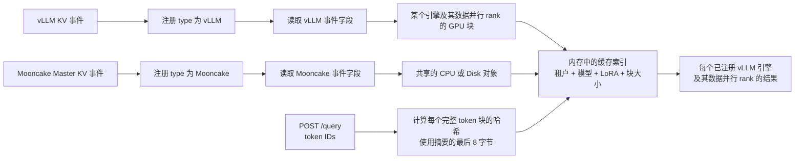

# Mooncake Conductor 架构

[English](../../../design/conductor/conductor-architecture-design.md)

Mooncake Conductor 读取实时的键值（KV）缓存事件，并在内存中维护一份供路由决策使用的缓存索引。本页说明 vLLM 的 GPU 信息和 Mooncake 的 CPU 或 Disk 信息如何进入这份索引、查询中的 token 如何变成查找值，以及低秩适配（Low-Rank Adaptation，LoRA）如何隔离缓存。这里描述的是当前 C++ 服务，也会说明判断缓存命中时需要注意的限制。

## 从事件到查询结果



注册时填写的 `type` 决定 Conductor 怎样读取消息。topic 文本和消息内容（payload）的结构都不会改变这个选择。对于同一个事件源，Conductor 按收到的先后顺序应用有效事件。

vLLM 事件更新已注册引擎及其数据并行（DP）rank 的 GPU 信息。Mooncake 事件更新共享的 CPU 或 Disk 信息。查询会对完整的 token 块计算哈希，按顺序逐块查找；某一项结果遇到第一个缺失块后，便不再继续累计。

## 哪些缓存可以共用

以下四个字段决定注册、事件和查询是否使用同一组缓存信息：

| 字段 | 为什么必须一致 |
|---|---|
| `tenant_id` | 隔离不同租户的缓存信息。 |
| 模型名称 | 防止混用不同模型的缓存块。注册使用 `modelname`，查询使用 `model`，查看状态时使用 `model_name`。 |
| `lora_name` | 隔离基础模型和不同 LoRA 适配器。空字符串表示基础模型。 |
| `block_size` | 同时决定一个块包含多少个 token，以及查询计算哈希时每次处理多少个 token。该值必须为正数。 |

引擎的 `instance_id` 和 DP rank 不会形成新的缓存共享组。它们用来确定哪些 GPU 记录和查询结果属于该引擎。请求中的 `cache_salt` 也不会改变上述四个字段；它改变的是这次查询使用的块哈希链。

每个四字段组合只绑定一个已注册的 `hash_profile`。之后为相同组合注册的事件源，必须使用完全相同的策略、算法、准确的 `python_hash_seed` 文本、派生根摘要和查找规则。目前只支持缓存组 `0`，也可以不填写缓存组。

## vLLM 的 GPU 信息与 Mooncake 的 CPU/Disk 信息

| 注册的事件源 | 接受的缓存位置 | 一个 stored 块表示什么 | 在 `/query` 中出现在哪里 |
|---|---|---|---|
| `vLLM` | GPU，不区分大小写 | 这条注册记录指定的 endpoint、引擎和 DP rank 报告了该块。 | 位于该引擎的 `instances` 结果和对应 DP rank 下。 |
| `Mooncake` | CPU 或 Disk，不区分大小写 | 一个 Mooncake 对象向所有四个缓存共享字段相同的已注册引擎提供该块。 | 作为共享的 `cpu` 或 `disk` 计数，出现在每个兼容的 vLLM 引擎下。 |

Mooncake 注册项只是订阅名称，不是推理引擎，因此不会在 `/query` 中增加一行结果。即使还没有兼容的 vLLM 引擎，Conductor 也可以先接受这个订阅；但在对应的四字段组合建立前，Mooncake 事件无法加入共享缓存信息。因此，[使用指南](./usage.md)会先注册引擎，再注册共享缓存池。

(how-token-blocks-become-lookup-values)=
## token 块如何变成查找值

Conductor 每次对一个完整的 token 块计算哈希。一个块产生的完整 32 字节摘要会成为下一个块的上一个摘要（parent）输入；Conductor 不会使用较短的 64 位查找值继续计算哈希链。

计算块哈希前，Conductor 会按以下规则解析当前支持的 profile：

```text
seed_text   = `random` 或 0..4294967295 范围内的准确 ASCII 十进制文本
seed_cbor   = canonical-CBOR text(seed_text)
root_digest = lowercase_hex(SHA256(seed_cbor))
```

来源 profile 提供 `python_hash_seed`，而不是 `root_digest`。这段准确文本必须与每个兼容 vLLM 进程中的 `PYTHONHASHSEED` 环境变量相同。Conductor 不会去除空白或规范化文本，不会读取自己的进程环境，也不会从 KV Event 推断种子。因此 `"0"` 和 `"00"` 会得到不同根摘要，数值类型的 JSON `0` 则无效。明确设置的 `"random"` 受支持；未设置 `PYTHONHASHSEED` 不受支持，因为此时 vLLM 使用注册信息无法复现的随机根字节。

vLLM 的 `--seed` 控制模型和采样随机数生成器，与前缀缓存的哈希标识无关。LoRA 影响每个块；非空的请求 `cache_salt` 影响第一个块及其所有后继块；Mooncake 的 `additional_salt` 仍只用于诊断。`PYTHONHASHSEED` 是兼容性元数据，不是租户隔离或安全密钥。

对于已经解析的哈希配置，每个块按以下步骤处理：

1. 第一个 parent 是从 `python_hash_seed` 派生的根摘要。后续每个 parent 都是前一个块的完整 SHA-256 摘要。
2. Conductor 编码一个包含三项的规范化简洁二进制对象表示（Concise Binary Object Representation，CBOR）数组：字节形式的 parent 摘要、该块的有符号 token 整数数组，以及 `null` 或一个有固定顺序的额外字符串数组。
3. 非空的 `lora_name` 是每个块的第一个额外字符串。非空的查询 `cache_salt` 只放在第一个块，并排在 LoRA 之后。第一个摘要改变后，哈希链中后续的每个摘要也会随之改变。
4. Conductor 对这些规范化 CBOR 字节计算 SHA-256。
5. Conductor 按无符号大端序（big-endian）64 位整数读取摘要的最后 8 字节，并用这个整数查找缓存块。

末尾不足 `block_size` 个 token 的部分不会计算哈希，也不会计入缓存命中。Mooncake 事件中的 `additional_salt` 会被解析用于诊断，但目前既不会进入四个缓存共享字段，也不会参与这项查找计算。

### 仓库中的 golden vector（固定测试值）

仓库测试数据记录的是 **vLLM 0.22.0 的 `hash_block_tokens` 语义，以及 cbor2 6.1.1 和 `canonical=True`**。其中的示例已解析 profile 记录了 `python_hash_seed` `"0"`：

```json
{
  "strategy": "vllm_v1",
  "algorithm": "sha256_cbor",
  "python_hash_seed": "0",
  "root_digest": "4e1195df020de59e0d65a33a4279f1183e7ae4e5d980e309f8b55adff2e61c3e",
  "index_projection": "low64_be"
}
```

规范 CBOR 把文本字符串 `"0"` 编码为十六进制 `6130`，而不是整数零的编码。对这两个字节计算 SHA-256 会得到上面的根摘要，并把它作为第一个块的 parent。

当 `block_size` 为 `4`、`lora_name` 为空、没有 `cache_salt`，并且 token IDs 为 `[1, 2, 3, 4, 5, 6, 7, 8]` 时，测试数据给出的结果是：

| 块 | 完整 SHA-256 摘要 | 最后 8 字节 | 无符号十进制查找值 |
|---|---|---|---|
| 1 | `c9d58ba695280d69b243e1e0df813136ca9196b286fb1a021e0b2e028ef071cb` | `1e0b2e028ef071cb` | `2164874634404590027` |
| 2 | `24125b23e68883b5c2141db2959d48433fe6bde2f26bd914efad121d154ab2d6` | `efad121d154ab2d6` | `17270480062156288726` |

这组种子和根摘要只是针对上述生成端和库版本的测试向量，不是所有部署的默认值。注册项提供准确的种子声明；Conductor 派生根摘要，并把它作为诊断信息返回。

(what-query-fields-mean)=
## 如何理解查询字段

所有计数的单位都是 token，而不是块。Conductor 会为每个选中的已注册 vLLM 引擎返回一项结果。

| 结果字段 | 含义 |
|---|---|
| `dp` | 每个已注册 DP rank 在该引擎和 rank 上连续命中的 GPU 前缀。rank key 是十进制 JSON 字符串。 |
| `gpu` | 该引擎所有 `dp` 值中的最大值。Conductor 不会把不同 rank 的块拼成更长的 GPU 前缀。 |
| `cpu` | 从查询的第一个块开始，至少有一个兼容共享 CPU 对象的连续前缀。 |
| `disk` | 从查询的第一个块开始，至少有一个兼容共享 Disk 对象的连续前缀。 |
| `longest_matched` | 某个 DP rank 使用该 rank 的 GPU 块，再加上兼容的共享 CPU 或 Disk 块后，能够覆盖的最长连续前缀。同一个块即使存在于多个位置，也只计算一次。 |

例如，假设某个 rank 的前两个块在 GPU 中，只有第三个块位于共享 CPU 缓存，并且 `block_size` 为 `16`。这个 rank 可以报告 `longest_matched: 48` 和 `gpu: 32`；但独立计算的 `cpu` 前缀仍为 `0`，因为第一个块不在 CPU 缓存中。如果第一个和第二个 GPU 块分别属于不同 DP rank，Conductor 不会把它们合并成两个块的命中结果。

## 清理范围

清理操作只删除受影响事件源贡献的信息：

- vLLM 的 remove 或 clear 只影响报告该事件的 endpoint、引擎和 DP rank 的 GPU 记录。其他 rank、其他引擎和共享缓存信息都会保留。
- Mooncake 记录会保存报告事件的 endpoint、后端、租户、对象 key、完整连接器哈希，以及 CPU 或 Disk 位置。因此，即使两个对象的哈希最后 8 字节相同，删除其中一个对象也会保留另一个对象。
- Mooncake clear 只影响报告事件的 endpoint、后端和租户下的共享对象。vLLM GPU 记录和其他 Mooncake 事件源不受影响。
- 注销时，Conductor 会先停止选中的 `(instance_id, tenant_id, dp_rank)` 订阅，再删除该 endpoint 贡献的信息。注销 vLLM 还会从查询结果中删除对应 rank；注销 Mooncake 会删除该 endpoint 保存的全部对象绑定。

[Conductor 订阅端指南](../kv-event/subscriber-guide.md)详细说明事件校验和清理规则。

## 当前限制

- Conductor 连接后只能看到实时事件。当前 Mooncake 发布端不会在启动时发送此前已经缓存的对象列表。
- 传输序号向前跳跃时，Conductor 会记录警告，但保留现有缓存记录。重新连接后，只有配置了 `replay_endpoint` 且 Conductor 已知上一个序号时，才会请求缺失事件；发出请求并不保证能够恢复全部记录。当前 Mooncake publisher 没有 replay 服务。
- Conductor 按收到的批次顺序处理 Mooncake 事件。它不会仅仅因为 `event_id` 重复就自动忽略事件。
- vLLM 只提供 GPU 信息，Mooncake 只提供 CPU 或 Disk 信息。其他缓存位置会被忽略，并记录警告。
- Conductor 会读取连接器 key 中的层和并行 rank 信息，但在报告共享缓存可用之前，不会检查是否已经收到所有层，也不会检查是否已经收到所有张量并行（tensor parallel，TP）、预填充上下文并行（prefill context parallel，PCP）、解码上下文并行（decode context parallel，DCP）或流水线并行（pipeline parallel，PP）部分。

## 维护者参考源码

本页对应的主要实现位于 `mooncake-conductor/src/prefixindex/hash_strategy.cpp`、`mooncake-conductor/src/prefixindex/prefix_indexer.cpp`、`mooncake-conductor/src/kvevent/event_handler.cpp` 和 `mooncake-conductor/src/kvevent/event_manager.cpp`。准确的哈希示例来自 `mooncake-conductor/tests/fixtures/hash_golden_vectors.json`；查询结果行为由 `mooncake-conductor/tests/prefix_indexer_test.cpp` 和 `mooncake-conductor/tests/event_manager_test.cpp` 覆盖。
