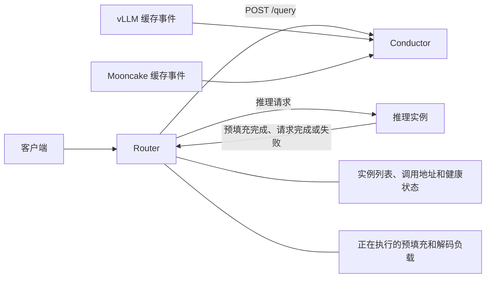

# Conductor 与 Router 集成设计

[English Conductor documentation](../../../design/conductor/index.md)

本文说明如何让 Router 使用 Mooncake Conductor 提供的缓存信息选择推理实例。
集成以 Conductor 的缓存查询能力和 Router 的调度职责为基础，并把 GPU、CPU、Disk
逐层续接作为双方之间的查询契约。

先说明当前状态：

- Conductor 已经能够订阅 KV 缓存事件（KV Event），并通过 `POST /query` 返回
  每个已注册 rank 的 `rank_matches` 分层累计边界，以及实例级汇总值。
- `mooncake-conductor/example/cache_aware_disagg_proxy.py` 已展示最小接入方式：
  选择 `longest_matched` 最大的预填充（Prefill）实例，查询失败或全部为零时
  使用轮询。该示例只消费实例级字段，不是按 rank 路由的完整实现。
- 健康检查、活动负载、过载保护、并发请求记账和重试仍由 Router 负责。本文中这些
  内容是 Router 侧的集成建议，不是 Conductor 当前已经实现的功能。

当前接口约定是：Conductor 对每个已注册 rank 先匹配 GPU，再从 GPU 结束处匹配
共享 CPU，最后从 CPU 结束处匹配共享 Disk。Router 应验证并使用这个有序结果，
而不应根据实例级最大值猜测某个其他 rank 的分层命中。

## 设计目标

这套集成要解决两个问题：

1. 尽量把请求发到已经有可复用 KV Cache 的实例，减少重复预填充计算。
2. 不能只追求缓存命中，还要避免把请求持续压到同一个繁忙实例。

Conductor 不负责发现推理地址（endpoint）、转发请求、判断实例健康状态或维护活动
请求负载。
Conductor 查询失败时，Router 应继续使用原有调度策略，不能让索引服务成为推理请求
的必经故障点。

## 组件职责边界

缓存索引和请求调度应保持分离：

| 组件或能力 | 主要职责 | 集成方式 |
|---|---|---|
| 缓存索引 | 接收 KV 缓存事件、维护缓存索引、回答命中查询。 | 由 Conductor 提供。 |
| 请求调度 | 排除不可用实例，结合缓存命中和活动负载选择目标。 | 由接入 Conductor 的 Router 负责。 |
| 活动请求负载跟踪 | 选择目标后立即记录预计负载，并在 Prefill 完成或请求结束时更新。 | 在 Router 中实现或复用已有负载模块。 |

最重要的边界是：**Conductor 提供缓存信息，Router 做最终决定。**

## 总体架构



Conductor 返回的是查询时刻的缓存视图，不是资源承诺。查询完成后缓存可能被淘汰，
事件也可能尚未到达。最终是否命中，仍以推理实例实际执行结果为准。

## 实例身份和注册

### `instance_id` 必须能映射到 Router 目标

Router 至少需要维护下面的对应关系：

```text
Conductor instance_id
    -> Router 中的推理实例
    -> 一个或多个可路由 DP rank
    -> 每个 rank 的推理 HTTP 或 RPC endpoint
    -> 每个目标的健康状态和活动负载
    -> 一个或多个 KV Event endpoint
```

`instance_id` 应使用稳定的逻辑名称，不要直接使用会随重启变化的进程 ID。Conductor
不保存推理 endpoint，因此 Router 不能从 `/query` 响应直接完成请求转发。

### 已注册 rank 不等于可路由 rank

`/query` 枚举的是 Conductor 在所选 `instance_id` 下已注册的 vLLM DP rank。
注册只表示 Conductor 接受了该 rank 的 KV Event 来源并把它纳入索引；它不证明
Router 当前有该 rank 的 endpoint，也不证明 endpoint 健康、未过载或允许接收
这类请求。

Router 必须把 `rank_matches` 的 key 与自己的可路由 rank 集合求交集：

```text
Conductor 已注册 rank
    intersect Router 可达、健康且允许调度的 rank
    -> 本次请求的候选 rank
```

Conductor 返回但 Router 无法寻址的 rank 必须忽略。Router 可路由但响应中没有的
rank 可以保留为候选，但本次按零缓存命中处理。健康状态、负载、地域、模型别名和
endpoint 映射都以 Router 自己的状态为准；Conductor 不执行这些检查。

如果 Router 对外接受模型别名，应先把别名转换为注册时使用的模型名。还要分别确认：

- Router 和推理实例使用相同的分词器（Tokenizer）和对话模板（Chat Template）；
- 注册、缓存事件和查询中的模型名、`tenant_id`、`lora_name`、`block_size`
  以及 hash profile 一致，尤其是准确的 `PYTHONHASHSEED` 文本；
- 本次请求查询时使用的 `cache_salt` 与推理实例实际执行时一致。

详细字段和哈希规则见 [Conductor 架构](./conductor-architecture-design.md)和
[HTTP API 参考](./indexer-api-design.md)。

### 启动时注册

每个 vLLM DP rank 都需要通过 `POST /register` 注册自己的 KV Event endpoint。
注册应在产生缓存的业务流量之前完成，因为 Conductor 主要依靠连接后的实时事件更新
索引。完全相同的注册可以重复提交。

建议由一个明确的组件负责注册，例如部署控制器或 Router 中的注册模块。通过 HTTP
动态注册的内容只保存在 Conductor 进程内；Conductor 重启后，注册负责方需要读取
`/services` 并重新提交缺失注册。

`/services` 只能证明 Conductor 已接受注册并启动本地订阅，不能证明远端发布端
仍然正常，也不能证明已经收到 KV Event。检查方法见[使用指南](./usage.md)。

重新注册不等于恢复历史缓存。Conductor 初次连接或重启后不会主动拉取事件发布端
已有的全部缓存状态；发现事件序号缺失时，只有发布端和注册都配置了可用的
`replay_endpoint` 才会尝试补发，而当前 Mooncake 发布端不提供该能力。因此索引
可能长期缺少部分历史信息，只能随着后续实时事件更新已知状态。

普通 Router 副本退出时，不应默认注销共享的 KV Event endpoint。只有推理实例或
事件发布端确实被移除、替换时，才调用 `POST /unregister`。

## 如何理解查询结果

Router 使用真实执行所需的 token IDs 调用 `POST /query`：

```json
{
  "model": "model-name",
  "block_size": 16,
  "token_ids": [1, 2, 3, 4, 5, 6, 7, 8, 9, 10, 11, 12, 13, 14, 15, 16],
  "tenant_id": "default",
  "lora_name": ""
}
```

请求使用 `cache_salt` 时，查询也必须带上同一个值。Conductor 只计算完整 token
块，末尾不足一个块的 token 不会计入命中。

### GPU、CPU、Disk 逐层续接

对每个选中的已注册 DP rank，Conductor 按以下顺序查询：

1. 从请求的第一个块开始，在该 rank 的 GPU 中连续匹配。
2. 从第一个 GPU 未命中的块开始，在共享 CPU 中继续匹配。
3. 从第一个 CPU 未命中的块开始，在共享 Disk 中继续匹配。
4. Disk 也未命中时停止。后面的块即使存在，也不再计入这次前缀命中。

后续缓存层只计算从上一层结束位置开始新增的部分。同一个块即使同时存在于多个位置，
也只由最先匹配到它的缓存层计算一次。CPU 阶段可以为空，让 Disk 检查同一个块；
进入 CPU 后不会回到 GPU，进入 Disk 后也不会回到 CPU 或 GPU。

响应使用累计字段表示各缓存层能够连续覆盖的前缀长度，计数单位都是 token：

| 字段 | 含义 |
|---|---|
| `dp` | 每个已注册 DP rank 完成 GPU 阶段后的累计 token 边界，值保持为整数。 |
| `rank_matches` | 与 `dp` 使用相同的十进制 rank key；每项包含该 rank 的累计 `gpu`、`cpu` 和 `disk` 边界。 |
| `gpu` | 当前实例所有 rank 级 `gpu` 边界中的最大值。 |
| `cpu` | 每个 rank 从自身 GPU 续接到 CPU 后得到累计长度，再取所有 rank 的最大值。 |
| `disk` | 每个 rank 再从 CPU 续接到 Disk 后得到累计长度，再取所有 rank 的最大值。 |
| `longest_matched` | 所有 rank 按 GPU、CPU、Disk 顺序连续覆盖的最大 token 数，与 `disk` 相同。 |

例如只有一个 rank 且 `block_size=16`，前两块在 GPU，第三块在 CPU，第四块在 Disk，
则响应包含：

```json
{
  "longest_matched": 64,
  "gpu": 32,
  "dp": {
    "0": 32
  },
  "cpu": 48,
  "disk": 64,
  "rank_matches": {
    "0": {
      "gpu": 32,
      "cpu": 48,
      "disk": 64
    }
  }
}
```

因此，有效响应应满足实例级和 rank 级不变量：

```text
0 <= gpu <= cpu <= disk <= complete_query_tokens
longest_matched == disk
dp.keys == rank_matches.keys
dp[rank] == rank_matches[rank].gpu
0 <= rank_matches[rank].gpu
  <= rank_matches[rank].cpu
  <= rank_matches[rank].disk
  <= complete_query_tokens
```

这些字段是累计长度，不能直接相加。对某一个 rank，各层新增命中长度为：

```text
GPU 新增命中  = rank_matches[rank].gpu
CPU 新增命中  = rank_matches[rank].cpu - rank_matches[rank].gpu
Disk 新增命中 = rank_matches[rank].disk - rank_matches[rank].cpu
```

如果响应不满足上述大小关系，或者任何字段超过输入中完整 token 块的长度，Router 应将
该响应视为无效并退回原有调度策略。分层语义应由 Conductor 保证，不能由 Router 根据
零散字段推测。

累计边界也不是缓存层物理归属的证明。如果 GPU 已覆盖完整输入，即使 CPU 和 Disk
没有副本，同一 rank 的三个累计边界仍会相等。排查 owner 或实际缓存位置时应检查
Conductor 索引状态和事件来源，而不能根据 `cpu` 或 `disk` 的累计值反推。

`longest_matched` 不包含具体的缓存读取方案。使用它参与调度前，必须确认推理后端
能够把该 rank 的 GPU 块和共享 CPU/Disk 块组合起来，并能在索引过期或共享块不完整
时正常回到未命中路径。否则应只使用后端能够实际兑现的字段。

### 多 DP rank 与 `rank_matches`

实例级 `gpu`、`cpu`、`disk` 是各 rank 对应边界的最大值。当前共享 CPU/Disk
可见性保证 GPU 边界最大的 rank 也能实现这些实例级最大值，但 Router 因健康或负载
选择其他 rank 时，不能把实例级最大值套到该 rank 上。

按 rank 调度时，Router 应执行以下步骤：

1. 验证 `dp` 和 `rank_matches` 的 key 集合相同，并检查每个 entry 的累计关系。
2. 将这些 key 与 Router 自己可达、健康且允许调度的 rank 求交集。
3. 为每个候选 `(instance_id, rank)` 使用对应的 `rank_matches[rank]` 计算缓存收益。
4. 选择目标后，把请求发到该准确 rank；随机分配 rank 的共享入口不能兑现
   rank-aware 选择。

即使某个非领先 rank 的 `gpu` 较短，它仍可能因健康或负载更优而被选择。此时必须使用
该 rank 自己的 `gpu`、`cpu` 和 `disk`，不能从实例级最大值相减。

### `rank_matches` 不可用时的降级

Router 应把 `rank_matches` 当作可检测的扩展字段，以便与尚未升级的 Conductor
部署兼容。如果字段缺失、结构无效，或者没有任何 entry 能与可路由 rank 对应：

- 不要声称能够进行精确的多 rank 分层调度，也不要把实例级 `cpu`、`disk` 最大值
  拼到某个 `dp[rank]` 上。
- 如果 Router 能直接路由到某个 rank，可以只用 `dp[rank]` 做 GPU-only 提示，
  但下层命中按未知处理。
- 只有在单 rank 或部署明确保证入口固定到实现实例级汇总的 rank 时，才可以继续
  使用 `longest_matched` 的旧式实例选择。
- 其他情况退回 Router 原有的负载、轮询或一致性哈希策略。

当前示例 Proxy 忽略未知字段并继续使用 `longest_matched`，因此在线路格式上兼容
新增的 `rank_matches`；它本身仍不是精确的多 rank、rank-aware 路由器。

## 一次请求如何选择实例

推荐按下面的顺序处理：

1. Router 根据模型、租户、LoRA、地域、endpoint、健康状态和过载状态，先建立
   可以接收请求的 `(instance_id, rank)` 集合。
2. 使用与推理实例一致的分词器和对话模板得到 token IDs。
3. 调用 Conductor `POST /query`，并设置符合请求延迟预算的超时。
4. 验证实例字段和每个 `rank_matches` entry，再与 Router 的可路由 rank 集合求交集。
   Conductor 返回的未知或不可路由 rank 直接忽略，缺少结果的可路由 rank 按零命中处理。
5. 对每个候选 rank 使用自己的累计边界；`rank_matches` 不可用时执行前述降级策略。
6. 根据各层缓存命中和 Router 自己维护的 rank/实例负载选择目标。
7. 在返回目标前记录本次请求带来的预计负载，然后转发到选中的准确 rank。
8. Prefill 完成、请求完成、取消或失败时更新或清理负载记录。

查询返回后应再次检查实例是否仍然可用，因为实例状态可能在查询期间发生变化。
请求排队较久后才真正调度时，也应重新读取负载；如果缓存结果可能已经过期，应再次
查询 Conductor。

`/query` 只能过滤单个 `instance_id`，不能一次传入 Router 的候选列表。通常做法
是查询当前缓存范围内的全部实例，再与 Router 候选集匹配。实例数、DP rank 数或输入
长度较大时，应压测查询延迟并设置严格超时。

## 第一策略：最小可用策略

首次接入可以沿用当前示例 Proxy 的简单规则，并补上 Router 已有的健康检查。该规则
只适合单 rank，或者 Router 能识别并路由到实现实例级汇总值的 rank：

1. 从可用实例中选择 `longest_matched` 最大且大于零的实例。
2. 多个实例命中相同时，使用 Router 原有的轮询或最小负载规则。
3. Conductor 超时、返回错误、响应格式不正确、没有可用实例或全部命中为零时，完全
   退回 Router 原有策略。

这个阶段容易验证 `instance_id`、分词器、模型信息和哈希配置是否一致，但它
没有解决缓存热点问题，也不应绕过可路由 rank 检查。一个缓存较多的实例可能连续
收到大量请求。

## 第二策略：把缓存命中和负载一起比较

这一阶段不再使用“命中最多就一定胜出”的规则，而是把缓存命中换算成本次 Prefill
可以减少的工作量，同时考虑实例上尚未完成的 Prefill 和 Decode 负载。Router 为每个
候选实例和 rank 计算调度分数，分数越小越优先。这个分数只用于比较候选目标，不表示
真实延迟或执行时间。

下面的分层计算应使用候选目标的 `rank_matches[rank]`。公式中的 `gpu`、`cpu`、
`disk` 均指同一个目标 rank 的累计值，而不是多 rank 实例级的最大值。缺少有效
`rank_matches` 时只能使用前述降级策略。

### 第一步：计算未抵扣缓存时的 Prefill 量

先把缓存放在一边，只回答一个问题：如果把本次请求发给这个实例，实例已有的 Prefill
负载和本次完整输入合起来有多少：

```text
已有 Prefill 负载 = active_prefill_tokens / block_size
本次输入块数 = isl_tokens / block_size

未抵扣缓存时的 Prefill 量 = 已有 Prefill 负载 + 本次输入块数
```

`isl_tokens` 是本次请求的输入 token 数。`active_prefill_tokens` 不是实例上所有活动
请求的原始输入长度，也不一定是字面意义上的“尚未执行 token 数”，而是 Router 对
已经分配到该实例的有效 Prefill 负载估计。选择请求后，Router 先按用于负载记账的
有效缓存 token 数扣除该请求无需重新计算的部分，再把剩余 token 记入实例负载。
启用 Prefill 时长估计时，这个负载会随预计进度减小；没有时长估计时，它通常保持到
Router 收到 Prefill 完成事件。

一种避免重复计算缓存收益的实现顺序是：

```text
uncached_tokens = isl_tokens - min(cached_tokens, isl_tokens)
raw_prefill_tokens = active_prefill_tokens + uncached_tokens + cached_tokens
raw_prefill_blocks = raw_prefill_tokens / block_size
```

在 `cached_tokens <= isl_tokens` 时，中间两项相加就是 `isl_tokens`，所以它等价于前面的
“已有 Prefill 负载 + 本次输入块数”。代码先还原出不考虑缓存的完整输入，下一步再按
GPU、CPU、Disk 的不同权重统一抵扣，避免同一份缓存收益被计算两次。如果不加入已有
负载，缓存较多但已经繁忙的实例会反复胜出。

### 第二步：把分层命中换算成缓存收益

Conductor 返回累计长度，Router 先算出每一层实际新增的块数：

```text
GPU 命中块数  = gpu / block_size
CPU 新增块数  = (cpu - gpu) / block_size
Disk 新增块数 = (disk - cpu) / block_size
```

然后根据读取代价折算成“相当于少做多少个 Prefill 块”：

```text
缓存收益 =
    GPU 命中块数 * GPU 权重
    + CPU 新增块数 * CPU 权重
    + Disk 新增块数 * Disk 权重
```

缓存收益的单位是“等价 Prefill 块”，不一定等于实际命中块数。例如 16 个 CPU 新增
块使用 `0.75` 权重时，只抵扣 12 个 Prefill 块，因为从 CPU 读取通常没有直接复用
GPU 缓存快。逐层命中块互不重复、各层权重在 `0` 到 `1` 之间且命中不超过输入时，
缓存收益自然不会超过本次输入块数。Router 仍应检查这一上限；不满足时应将查询视为
无效，而不是让异常收益抵扣实例已有负载。

GPU、CPU、Disk 权重可以分别从 `1.0`、`0.75`、`0.25` 起步。这些数值只适合作为
初始配置，Mooncake 部署应按实测读取开销和首个 token 延迟调整，并允许独立配置。

### 第三步：计算选择后的 Prefill 负载

先计算当前请求经过缓存抵扣后还会增加多少 Prefill 工作，再加到实例已有的负载上：

```text
本次请求新增的 Prefill 负载 = max(本次输入块数 - 缓存收益, 0)

选择后的 Prefill 负载 =
    已有 Prefill 负载
    + 本次请求新增的 Prefill 负载
```

这就是“预计 Prefill 工作量”的含义：如果选择这个实例，Router 预计该实例需要承担
多少等价 Prefill 块。它由“实例已经背负的负载”和“当前请求新增加的负载”两部分
组成。缓存属于当前请求，所以只减少第二部分，不能消除其他请求已经产生的负载。

实现中也可以把这两部分合并写成：

```text
raw_prefill_blocks = 已有 Prefill 负载 + 本次输入块数
adjusted_prefill_blocks = max(raw_prefill_blocks - 缓存收益, 0)
```

只要 `缓存收益 <= 本次输入块数`，两种写法就完全相同：

```text
已有 Prefill 负载 + 本次输入块数 - 缓存收益
= 已有 Prefill 负载 + (本次输入块数 - 缓存收益)
```

这个条件很重要。外层 `max(..., 0)` 只保证最终结果不为负数；如果异常的缓存收益大于
本次输入，它仍可能继续抵扣已有 Prefill 负载。Conductor 集成应先验证累计命中和权重，
使缓存收益不超过本次输入，或者在 Router 中把缓存收益限制到本次输入块数。本文推荐
保留拆开的写法，因为它直接表达了“缓存只抵扣当前请求”。

### 第四步：加入 Decode 负载

只比较 Prefill 会把请求继续发给 Decode 已经很忙的实例，因此还需要计算：

```text
Prefill 成本 = prefill_load_scale * 选择后的 Prefill 负载

本次请求新增的活动块数 =
    本次请求块数 - 与该实例当前活动序列共享的前缀块数

选择后的活动块数 =
    当前活动 KV 块数 + 本次请求新增的活动块数

总成本 = Prefill 成本 + 选择后的活动块数
```

`prefill_load_scale` 用来调整 Prefill 工作量相对于 Decode block 的重要程度，建议初始
值为 `1.0`。它不是缓存命中权重，而是用来平衡 Prefill 计算压力和 Decode 活动块压力。
Router 先用“本次请求块数减去共享前缀块数”得到新增活动块数，再与当前活动 KV 块数
相加，最后把 Prefill 成本和选择后的活动块数相加得到调度分数，并从可用实例中选择
分数最小者。

这里的共享前缀来自 Router 对当前活动序列的记录，不来自 Conductor 返回的 GPU、CPU、
Disk 命中。即使某个块存在于不活动的缓存中，它仍可能增加活动 KV 占用；相反，本次
请求和正在执行的请求共享的前缀已经计入当前活动块，不应重复增加。因此这个名为
Decode 成本的项不是输出长度、缓存未命中数或 Decode 耗时预测，而是选择后实例需要
承载的活动 KV 块压力。启用输出 block 跟踪后，生成过程跨过新的 block 边界时，Router
还会继续增加活动块记录。

总成本也不是毫秒、真实费用或精确工作量。Prefill 项和活动 KV 块项都换算成“块”后
相加，只是为了给同一请求的候选实例排序；数值越小，候选越优先。

如果 Router 只负责选择 Prefill 实例，Decode 实例由另一套调度策略选择，可以省略
Decode 成本。如果 Router 已经有成熟的负载公式，也可以保留原公式，只把“本次输入
块数减去分层缓存收益”作为本次请求新增的 Prefill 工作量。

### 完整示例

假设 `block_size=16`、输入为 1024 token，即 64 块；GPU、CPU、Disk 权重分别为
`1.0`、`0.75`、`0.25`，`prefill_load_scale=1.0`。

Conductor 的响应单位是 token。假设 Router 可以直接路由到 A 的 rank `0` 和 B 的
rank `1`。`rank_matches["0"]` 给出 A 的 `gpu/cpu/disk` 累计长度
`512/768/896 token`，换算后是 `32/48/56` 块；`rank_matches["1"]`
给出 B 的累计长度 `256/512/512 token`，换算后是 `16/32/32` 块。Router
记录的 A、B `active_prefill_tokens` 分别为 512 和 0。

活动序列记录显示，A 当前有 64 个活动 KV 块，本次请求与这些活动序列共享 56 个前缀
块；B 当前有 32 个活动 KV 块，并共享 32 个前缀块。这里的共享深度由 Router 的活动
序列记录计算，与 Conductor 的缓存命中是两个独立输入。

对于候选 A rank `0`：

```text
已有 Prefill 负载 = 512 / 16 = 32 块
原始 Prefill 工作量 = 32 + 64 = 96 块

GPU 命中 = 32 块
CPU 新增 = 48 - 32 = 16 块
Disk 新增 = 56 - 48 = 8 块
缓存收益 = 32 * 1.0 + 16 * 0.75 + 8 * 0.25 = 46 块

本次请求新增的 Prefill 负载 = 64 - 46 = 18 块
选择后的 Prefill 负载 = 32 + 18 = 50 块

本次请求新增的活动块数 = 64 - 56 = 8 块
potential_decode_blocks = 64 + 8 = 72 块

总成本 = 1.0 * 50 + 72 = 122
```

对于候选 B rank `1`：

```text
已有 Prefill 负载 = 0 块
原始 Prefill 工作量 = 0 + 64 = 64 块

GPU 命中 = 16 块
CPU 新增 = 32 - 16 = 16 块
Disk 新增 = 32 - 32 = 0 块
缓存收益 = 16 * 1.0 + 16 * 0.75 = 28 块

本次请求新增的 Prefill 负载 = 64 - 28 = 36 块
选择后的 Prefill 负载 = 0 + 36 = 36 块

本次请求新增的活动块数 = 64 - 32 = 32 块
potential_decode_blocks = 32 + 32 = 64 块

总成本 = 1.0 * 36 + 64 = 100
```

A 的缓存前缀更长，本次请求只会为 A 新增 18 个等价 Prefill 块，而 B 会新增 36 个。
但是 A 已经有更多 Prefill 负载和活动 KV 块，因此 A 的总成本是 122，B 是 100，
Router 应选择分数更低的 B rank `1`。这正是把每个可路由 rank 的缓存收益和现有
负载一起比较的作用。

### 排序收益和负载记账

选择目标后，Router 应按实际预计少做的 Prefill token 记录请求负载。用于负载记账的
缓存 token 和用于候选排序的分层缓存收益不必始终相等：前者描述后端预计减少的计算量，
后者还可以包含 Router 为调整流量分布而使用的权重或策略。实现中应明确区分这两个值，
避免调度参数变化后负载记录失真。

当缓存较多的实例已经积压大量 Prefill 时，Router 还可以降低该实例的缓存收益权重，
避免它持续胜出。第一版集成可以先使用固定权重，确认基础调度和负载记账正确后，再评估
是否加入随负载变化的收益衰减。

## 选择目标后立即记账

并发请求可能同时看到相同的负载。如果 Router 先返回目标，稍后才记录负载，多个
请求可能一起选择同一个实例。

Router 必须保证下面几步不会被另一个请求插入。例如，可以把它们放在同一把锁内，
或交给同一个串行调度循环执行：

```text
读取最新负载
计算各实例成本
选择目标
把本次请求的预计负载记到目标实例
返回目标
```

如果转发前请求已取消，不应留下记录。如果目标返回给调用方后转发失败，应先清理
该目标的记录，再进入 Router 原有的重试流程。

建议按请求 ID 维护以下状态：

| 事件 | Router 的处理 |
|---|---|
| 目标选择完成 | 记录预计未命中的 Prefill 工作量和本次请求占用的 block。 |
| Prefill 完成；聚合部署中通常表现为首个输出 token | 清除该请求的 Prefill 负载。 |
| 输出跨过新的 block 边界 | Router 已支持时，增加 Decode block 记录。 |
| 正常完成 | 清除该请求的剩余记录。 |
| 取消、超时、客户端断开、后端错误或转发失败 | 使用与正常完成相同的清理逻辑。 |

清理操作应允许重复调用，避免重试或异常路径造成负载记录泄漏。

## 聚合部署和 P/D 分离部署

在聚合部署中，Router 使用缓存命中和负载选择最终处理请求的实例。

在 Prefill/Decode 分离部署中，Conductor 通常只参与 Prefill 实例选择：

1. Router 根据 Conductor 和 Prefill 负载选择 Prefill 实例。
2. Prefill 完成后，继续使用现有 KV 传输流程。
3. Decode 实例仍由原有 Decode 调度策略选择。

当前 `cache_aware_disagg_proxy.py` 就采用这种方式：Prefill 使用
`longest_matched`，Decode 使用轮询。

## 故障和降级

| 场景 | Router 应如何处理 |
|---|---|
| 生成 token IDs 失败 | 跳过 Conductor，使用原有调度策略。 |
| `/query` 超时、返回非成功状态或无效 JSON | 使用原有调度策略。 |
| 实例字段或某个 `rank_matches` entry 不满足逐层累计关系 | 将对应结果视为无效；没有有效候选时使用原有调度策略。 |
| `rank_matches` 缺失或无效 | 不进行精确多 rank 分层调度；按兼容性规则降级到 GPU-only、受约束的实例级策略或原有策略。 |
| 响应包含 Router 不认识的 `instance_id` | 忽略该实例并记录日志或指标。 |
| 响应包含已注册但 Router 不可路由的 rank | 忽略该 rank；注册不能替代 endpoint、健康和负载检查。 |
| Router 中的可路由 rank 未出现在响应中 | 保留该 rank，按零命中处理。 |
| 所有命中为零 | 第一阶段使用原有策略；第二阶段把缓存收益视为零，继续按负载选择。 |
| 选中 rank 在转发前变为不可用 | 清理负载记录，并进入原有重试流程。 |
| 查询显示命中，但执行时缓存已不存在 | Router 仍把结果当作提示；后端应回到未命中路径，不能回退时进入原有错误或重试流程。 |
| 所有可用实例都已过载 | 保留 Router 原有的排队、限流或拒绝行为。 |

连续多次查询失败时，Router 可以暂时停止调用 Conductor，并定期尝试恢复，避免每个
请求都等待一次超时。

当前 Conductor HTTP API 不提供认证或 TLS。`/register` 和 `/unregister` 会改变
订阅和索引状态，生产部署应将接口放在可信内部网络中，或通过带认证和访问控制的内部
网关访问。

## Conductor 接口约束

GPU、CPU、Disk 逐层续接和分层加权是 Router 成本模型的一部分。落地时还需要处理
Conductor HTTP 接口在数据粒度和运行方式上的约束：

| 当前接口约束 | 影响 | 集成时的处理 |
|---|---|---|
| `rank_matches` 包含所有已注册 rank，而不是 Router 可路由 rank。 | 返回 key 可能没有可用推理 endpoint，或者当前不健康、已过载。 | 与 Router 自己的 endpoint、健康和负载状态求交集；不可路由 rank 直接忽略。 |
| 实例级字段是 rank 边界的最大值。 | Router 因负载选择非领先 rank 时，该 rank 的实际边界可能更短。 | rank-aware 调度始终使用选中 rank 的 `rank_matches` entry，不从实例级最大值推导。 |
| 旧部署可能不返回 `rank_matches`。 | Router 无法获得准确的多 rank CPU/Disk 续接结果。 | feature-detect 该字段，并降级到 GPU-only 或原有非分层策略，不声称精确多 rank 分层调度。 |
| Conductor 当前没有节点间快照恢复接口。 | 重启后无法直接恢复完整历史索引。 | 重启后重新注册；继续服务时要接受历史索引可能不完整。 |

Mooncake CPU/Disk 结果会共享给同一缓存范围内的所有已注册 vLLM 实例。当前响应不包含
缓存所在后端、网络距离或读取代价。如果不同实例不能访问同一个共享缓存池，应在部署
或查询范围上先把它们隔离，不能仅凭 `longest_matched` 跨池比较。

Conductor 响应也没有时间戳或版本号。`/services` 和 `/global_view` 用于检查注册
和内存索引结构，不是实例健康检查。

## 多个 Router 副本

多个 Router 可以共享同一个 Conductor，因此它们看到的缓存信息基本相同；但每个
Router 本地记录的活动负载并不会自动同步。

生产部署需要使用 Router 已有的共享负载来源，或者在 Router 副本之间同步“请求加入、
Prefill 完成、请求结束”这几类变化。在负载尚未同步时，应降低各层缓存权重，并重点
观察请求是否集中到少数实例。

请求 ID 应在所有 Router 副本之间保持唯一，重复的清理消息不应导致计数变成负数。

## 验证和上线顺序

建议分阶段上线：

1. **检查配置是否一致**：确认 `instance_id` 映射、模型名、分词器、对话模板、
   `block_size`、租户、LoRA、hash profile 和 `cache_salt` 一致。
2. **验证逐层语义**：确认 GPU、CPU、Disk 按顺序续接，`dp` 与
   `rank_matches` key 相同，每个 rank 的累计字段满足大小关系。
3. **只观察**：执行 Conductor 查询并记录推荐目标，但仍使用 Router 原来的目标。
4. **启用最小策略**：在单 rank 或可固定 rank 的部署中，只在出现正命中时使用
   `longest_matched`，其余情况降级。
5. **加入 rank 和负载**：对可路由 rank 使用 `rank_matches` 计算分层成本，并完成
   选择后的立即记账和所有结束路径的清理。
6. **扩展到多 Router**：确认各 Router 副本看到的负载差异处于可接受范围后再扩大
   流量。

至少覆盖以下测试：

- 只有一个实例正命中；
- 多个实例命中相同；
- GPU 命中结束后由 CPU 续接，再由 Disk 续接，三个累计字段符合预期；
- 同一个块存在于多个缓存层时只计算一次；
- 任一位置在三层都未命中时停止，不使用后面的孤立缓存块；
- 非单调或超过完整输入长度的分层响应会触发降级；
- `dp` 和 `rank_matches` 包含相同 rank，且零命中 rank 仍然可见；
- 已注册但不可路由的 rank 会被忽略，可路由但未返回的 rank 按零命中处理；
- Router 选择非领先 rank 时使用该 rank 自己的 `rank_matches` entry；
- `rank_matches` 缺失时不会把实例级 CPU/Disk 最大值拼接到某个 rank；
- 命中更多但负载更高的实例没有持续成为热点；
- Conductor 超时、错误、空响应和全零响应；
- 响应包含未知或已移除的实例；
- Router 在查询期间发现实例变为不可用；
- 多个并发请求不会持续选择同一个实例；
- 正常完成、取消、超时和转发失败后负载记录都被清理；
- 多 DP rank 场景能够把请求发到实际选中的 rank；
- Conductor 重启后能够重新注册；索引不完整期间请求仍可走原有策略。

建议观察以下指标：

- Conductor 查询延迟、失败次数和降级原因；
- 每次选择的 `instance_id`、rank、对应 `rank_matches` 边界和 Router 负载；
- 各实例请求数、活动 Prefill token 和 Decode block；
- 选择后记账失败、重复清理和未清理请求数；
- 启用前后的首个 token 延迟（TTFT）、吞吐和后端实际缓存命中率。

日志不应记录完整用户输入或完整 token IDs。

## 相关实现路径

Conductor 实现评审应重点检查以下路径：

- `mooncake-conductor/src/prefixindex/prefix_indexer.cpp`；
- `mooncake-conductor/src/kvevent/event_manager.cpp`；
- `mooncake-conductor/example/cache_aware_disagg_proxy.py`。

本文定义的集成前提是 GPU、CPU、Disk 逐层续接。如果实现或测试仍采用各层独立前缀
或逐块并集，应修正 Conductor 及其接口测试，不能让 Router 适配这类结果。

分层缓存语义和负载模型也可以与其他 Router 实现交叉核对。例如 Dynamo commit
`3cabd83e1f5f03783a81a185f1696d1f68cfa03c` 中的以下路径提供了相关实现资料：

- `docs/components/router/standalone-indexer.md` 和 `router-concepts.md`；
- `lib/kv-router/src/indexer/lower_tier_indexers.rs`；
- `lib/kv-router/src/scheduling/` 和 `lib/kv-router/src/sequences/multi_worker.rs`。

这些外部路径只用于理解和交叉验证，不定义 Conductor 的接口或实现约束。
