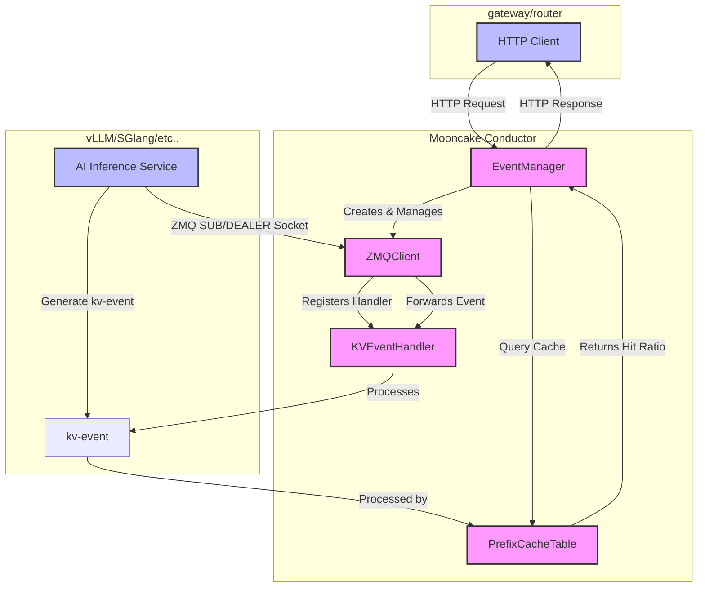

# Mooncake-Conductor
The Mooncake Conductor Indexer is a specialized service designed to efficiently track and report token hit counts across various caching levels for different model instances. It provides a list of APIs that allow users to query token hit statistics based on token ID or chunked token hash, thereby facilitating optimized the performance of LLM inference.More details can be see in [Mooncake Conductor Indexer](https://github.com/kvcache-ai/Mooncake/blob/main/docs/source/design/conductor/indexer-api-design.md)

## Architecture & workflow
The Mooncake Conductor Receives BlockStored/BlockRemoved events from vLLM/Mooncake inference engines via ZMQ, maintains a global prefix cache table, and provides HTTP APIs for cache queries and dynamic service registration.



## Features

- **ZMQ Event Subscription**: Subscribes to BlockStored/BlockRemoved events from vLLM or Mooncake publishers
- **Dynamic Registration**: Register/unregister services via HTTP API without restart
- **Prefix Cache Indexing**: Maintains a global prefix hash table for cache hit computation
- **Multi-Tenant Support**: Supports tenant isolation with tenant_id

## Quick Start

### Build

```bash
cd conductor-ctrl
go build -o mooncake_conductor .
```

### Run

```bash
# Set environment variables
export CONDUCTOR_LOG_LEVEL=DEBUG/INFO

# Run
./mooncake_conductor
```

### Configuration

Create a `conductor_config.json` file under `~/.mooncake/` :

```json
{
  "http_server_port": 13333,
  "kvevent_instance": {
    "instance-1": {
      "endpoint": "tcp://192.168.1.100:5555",
      "replay_endpoint": "tcp://192.168.1.100:5556",
      "type": "vLLM",
      "modelname": "llama-2-7b",
      "lora_name": "",
      "tenant_id": "default",
      "instance_id": "instance-1",
      "block_size": 64,
      "dp_rank": 0,
      "additionalsalt": ""
    }
  }
}
```

## Environment Variables

| Variable | Default | Description |
|----------|---------|-------------|
| `CONDUCTOR_LOG_LEVEL` | INFO | Log level: DEBUG, INFO, WARN, ERROR |
| `CONDUCTOR_CONFIG_PATH` | ~/.mooncake/conductor_config.json | Path to configuration file |
| `CONDUCTOR_SEED` | random | Seed for hash computation |

## Project Structure

```
conductor-ctrl/
├── common/           # Shared types and utilities
├── kvevent/          # Event manager and handler
├── prefixindex/      # Prefix cache table implementation
├── zmq/              # ZMQ client and event types
└── main.go           # Entry point
```