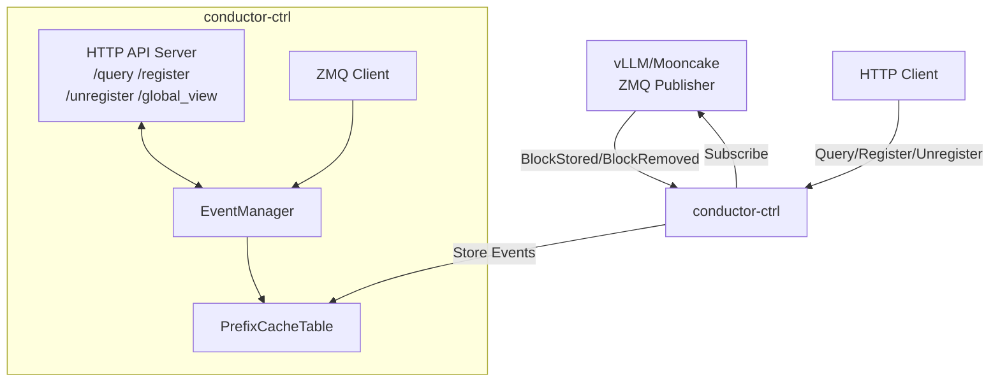

# conductor-ctrl

KV Event Manager for Mooncake Conductor. Receives BlockStored/BlockRemoved events from vLLM/Mooncake inference engines via ZMQ, maintains a global prefix cache table, and provides HTTP APIs for cache queries and dynamic service registration.

## Architecture



## Features

- **ZMQ Event Subscription**: Subscribes to BlockStored/BlockRemoved events from vLLM or Mooncake publishers
- **Dynamic Registration**: Register/unregister services via HTTP API without restart
- **Prefix Cache Indexing**: Maintains a global prefix hash table for cache hit computation
- **Multi-Tenant Support**: Supports tenant isolation with tenant_id

## Quick Start

### Build

```bash
cd conductor-ctrl
go build -o main .
```

### Run

```bash
# Set environment variables
export CONDUCTOR_LOG_LEVEL=INFO
export CONDUCTOR_CONFIG_PATH=/path/to/config.json

# Run
./main
```

### Configuration

Create a `conductor_config.json` file:

```json
{
  "http_server_port": 13333,
  "kvevent_instance": {
    "instance-1": {
      "endpoint": "tcp://192.168.1.100:5555",
      "replay_endpoint": "tcp://192.168.1.100:5556",
      "type": "vLLM",
      "modelname": "llama-2-7b",
      "lora_name": "",
      "tenant_id": "default",
      "instance_id": "instance-1",
      "block_size": 16,
      "dp_rank": 0,
      "additionalsalt": ""
    }
  }
}
```

## HTTP API

### POST /query

Query cache hit status for token IDs.

**Request:**
```json
{
  "model": "llama-2-7b",
  "block_size": 16,
  "token_ids": [1, 2, 3, 4, 5, 6, 7, 8],
  "instance_id": "instance-1",
  "tenant_id": "default"
}
```

**Response:**
```json
{
  "default": {
    "instance-1": {
      "longest_matched": 8,
      "DP": {"0": 8},
      "GPU": 8,
      "CPU": 0,
      "DISK": 0
    }
  }
}
```

### POST /register

Dynamically register a new service.

**Request:**
```json
{
  "endpoint": "tcp://192.168.1.100:5555",
  "replay_endpoint": "tcp://192.168.1.100:5556",
  "type": "vLLM",
  "modelname": "llama-2-7b",
  "instance_id": "instance-2",
  "block_size": 16,
  "dp_rank": 0
}
```

**Response:**
```json
{
  "status": "registered successfully",
  "instance_id": "instance-2"
}
```

### POST /unregister

Unregister a service.

**Request:**
```json
{
  "type": "vLLM",
  "modelname": "llama-2-7b",
  "instance_id": "instance-2",
  "block_size": 16,
  "dp_rank": 0
}
```

**Response:**
```json
{
  "status": "unregistered successfully",
  "removed_instances": ["instance-2|default|0"]
}
```

### GET /global_view

Get global view of all cached prefixes.

**Response:**
```json
{
  "context_count": 2,
  "model_contexts": [
    {
      "model_name": "llama-2-7b",
      "lora_name": "",
      "block_size": 16,
      "additional_salt": "",
      "tenant_id": "default"
    }
  ],
  "hashmap": [
    {"100": 12345}
  ]
}
```

## Environment Variables

| Variable | Default | Description |
|----------|---------|-------------|
| `CONDUCTOR_LOG_LEVEL` | INFO | Log level: DEBUG, INFO, WARN, ERROR |
| `CONDUCTOR_CONFIG_PATH` | /root/conductor_config.json | Path to configuration file |
| `CONDUCTOR_SEED` | random | Seed for hash computation |

## Project Structure

```
conductor-ctrl/
├── common/           # Shared types and utilities
├── kvevent/          # Event manager and handler
├── prefixindex/      # Prefix cache table implementation
├── zmq/              # ZMQ client and event types
├── main.go           # Entry point
└── README.md         # This file
```