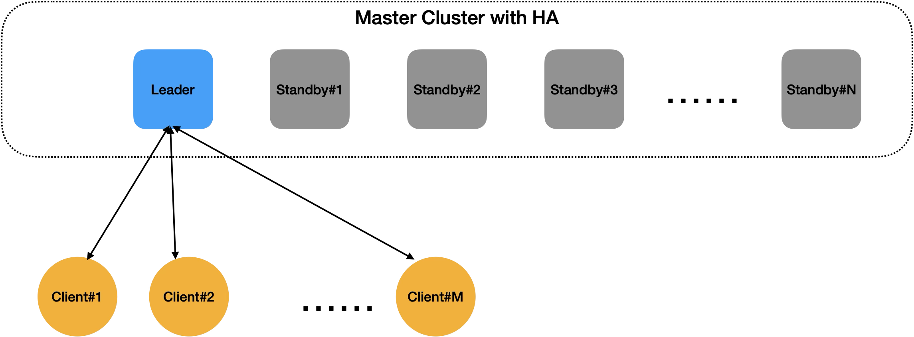
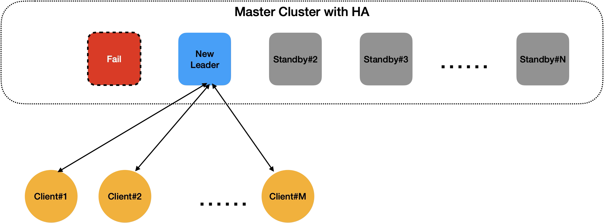
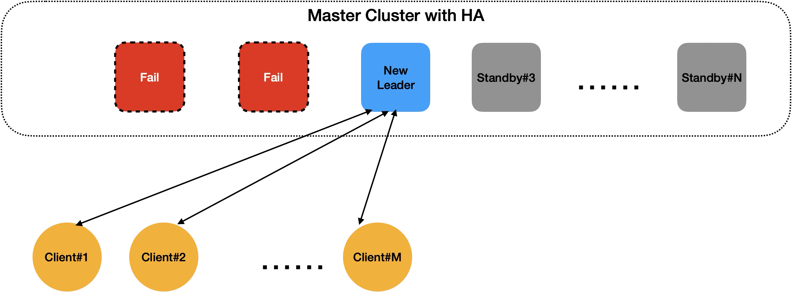
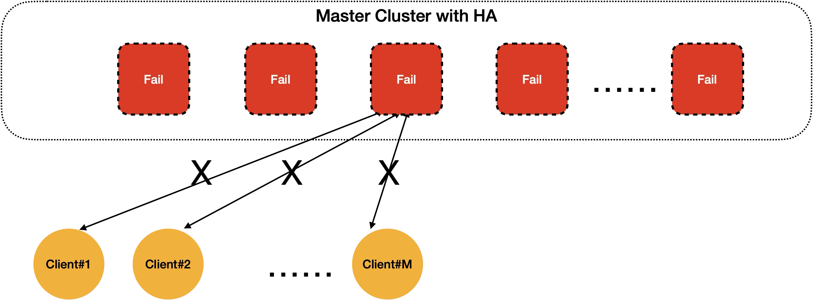
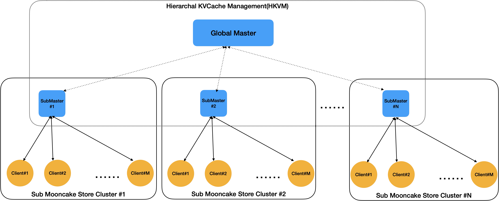
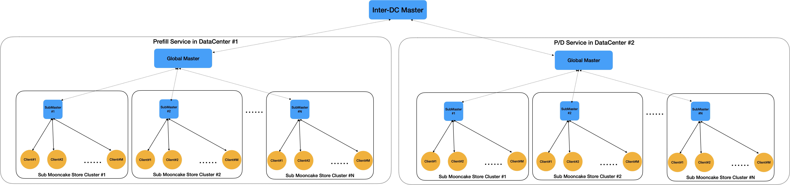

# Hierarchical Arch for Intra/Inter Data Center Deployment

We have extended Mooncake for large scale deployment in more than 10,000 cards datacenter
by Hierarchical KVcache Management(HKVM for short).

# Background

Original [RFC #2117](https://github.com/kvcache-ai/Mooncake/issues/2117).

In AntGroup's practice with Theta KVPool in agentic coding services, where a single LLM service reaches 10,000 card(accordingly 10,000 dummy clients), Mooncake Master becomes an obvious bottleneck. It will fail with these issues:

* Allocators management is too heavy;
* RPC processing will exhaust the CPU threads;
* The recovery time for HA is not acceptable;

Even with HA mode ON, multiple Masters are available, but only one Master instance is active for all clients' requests.

When large mounts of online requests arrived, the former Leader Master instance may crash, the new Leader Master instance is activated, but may crash soon after oplog/snapshot recovery with historical failed and newly arrived requests, which called "avalanche" or "snowslide" effect.

# Design

We propose a Hierarchical KVCache Management(HKVM for simple in the remainder part) Architecture for large scale Mooncake Store deployment.

The picture shows a cluster with N sub-cluster and M nodes(we suggest only 1 real client in a node, dummy clients are 8 or 16 times of real clients with different card type) in each sub-cluster, the total nodes are M*N=C. In a sub-cluster, the Sub Master and Clients are the same with original deployment. The only change is a higher level Global Master for global KVCache management.

In HKVM, a Global Master is tailored from original Master. Its functions are:

* Registry of Sub Masters;
* KVEvent collection from Sub Master;
* Act as a Proxy for cross-sub-cluster transferring;
* Weak Consistency with Sub Masters(in contrast to Sub Master, which is Strong Consistency within sub-cluster);

We can adjust M and N for performance & reliability trade-off. Specially, when M=1, it will behave like the new P2P Arch; when N=1, it will degenerate into original centralized arch. In our practice, we set M to the scale of P/D group(such as 5 in 2P3D, or 2 in 1P1D), and N to number of P/D groups.

# Further Design

If we add a new level, HKVM naturally supports PrfaaS.

Prefill Service(in the left) and P/D Service(in the right) can run on different clusters and heterogeneous hardwares (H200 + H20 in the paper). In each cluster, we create a global kvcache pool. Prefill Service will generate KVCache of long-input-requests continuously. P/D Service will processing normal requests in parallel. The newly added Inter-DC Master collects KVEvents of both sides, checks the diff and launchs incremental updates via WAN(cross-datacenter) or LAN(intra-datacenter). Thanks to the global kvcache pool, KVCaches transferred can be reused in the future before evicted. We need set the pool sizes in each side according to Prefill Service's and P/D Service's max throughput.
Thanks again to the global kvcache pool, we don't need high-bandwidth network between these clusters, the transfer time is relaxed to KVCache eviction period(from minutes to hours in our real environment).

# Plan

Our plan for next step:

* Global Master implementation, 26Q2(done);
* Optimized real clients implementation, 26Q3(doing);
* PrfaaS PoC, 26H2(doing);

# Limitations

Here are some concerns in production environment:

* Adding a new level in HKVM may cause an increase in latency, especially in batchIsExist();
* Weak consistency may lead to consumer side getting an evicted value in provider side, value integrity check is needed;
* Cross-datacenter transferring maybe unreliable, FEC/ECC are needed;

# Acknowgement & Contributions

* AntGroup Theta and Super-Compute Team for the development and large-scale practice
* Alicloud System and Network Team
* Approaching.AI
* Tsinghua University
* Moonshot AI

Any discussions, concerns or co-works(e.g. SGLang Distributed KV) are welcomed!
