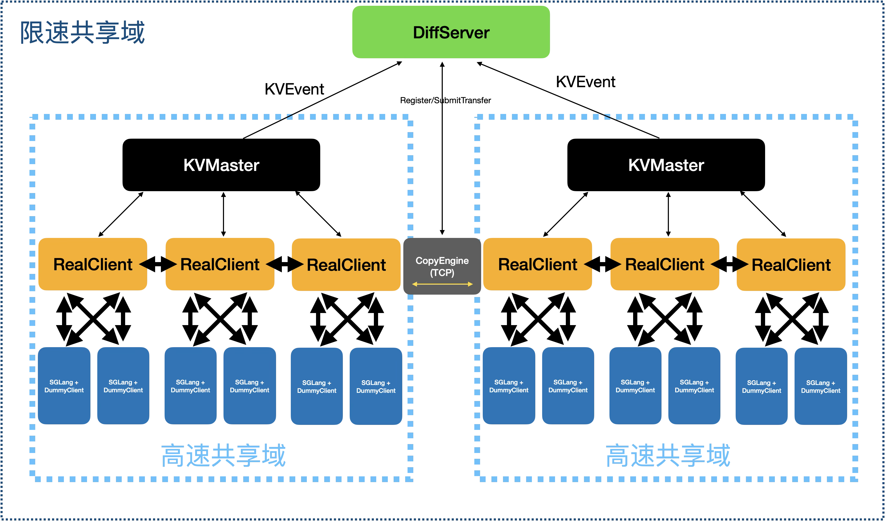

# Yu Gong Moves the Mountain: How to Achieve Cross-Datacenter KVCache Sharing

> Ant Group Internal Technical Share | 2026.08  
> Author: Shen Chong
>

---

## 1. Why Do We Need "Yu Gong Moves the Mountain"?

Ant Group's LLM inference infrastructure faces a unique dilemma:

**Scattered resources, heterogeneous hardware, insufficient pooling.**

We are not a company that builds unified clusters from scratch. The reality is:

+ **Heterogeneous GPU environments**: A100, H20, Ascend 910B/910C, Pingtouge... different compute power, different memory capacity, different interconnect protocols, scattered across multiple datacenters
+ **Multi-DC decentralized deployment**: Active-active in the same city, disaster recovery across regions, each DC operates independently, GPU resources cannot flow across domains
+ **Low KVCache utilization**: Each cluster manages its own KV cache independently, hot requests repeat prefill, cold KV has nowhere to share

The result: **GPUs spend significant time on redundant computations, while idle memory and bandwidth remain underutilized.**

The goal of the Yu Gong Moves the Mountain project is simple—**achieve cross-DC KVCache sharing on existing heterogeneous, distributed infrastructure, allowing KV on one GPU to be directly reused by model services in another building.**

No major reconstruction, no requirement for unified hardware, maximum pooling under existing conditions.

---

## 2. Core Approach: Diff + Copy Dual Engine



Drawing on design concepts from industry solutions like PRFaaS, we decompose cross-DC KVCache sharing into two orthogonal problems:

1. **Discover differences**: Which KVs need synchronization between different sub-clusters?
2. **Transport data**: How to move KV blocks across networks and devices?

This corresponds to two core components:

| Component | Responsibility | Analogy |
| --- | --- | --- |
| **DiffServer** | Collects KV metadata from sub-clusters, compares differences, outputs synchronization list | Scout—discovers where to move |
| **CopyEngine** | Encapsulates intra-cluster and inter-cluster transport engines, executes actual data movement | Transport team—moves things over |

### 2.1 DiffServer: KV Metadata Difference Comparison

Each sub-cluster already has its own KV management mechanism (radix tree, slot allocation, etc.). DiffServer needs to obtain KV meta information without intruding on existing scheduling logic.

**Design points:**

```plain
SubCluster-A                DiffServer              SubCluster-B
┌──────────┐              ┌──────────┐              ┌──────────┐
│ KV Meta  │ ──push/pull──▶│  Diff    │◀──push/pull── │ KV Meta  │
│ Provider │              │  Engine  │              │ Provider │
└──────────┘              └──────────┘              └──────────┘
                                │
                          Sync Task Queue
                                │
                          ┌─────▼─────┐
                          │ Scheduler │
                          │ (Priority/BW)│
                          └───────────┘
```

+ **Meta collection**: Each sub-cluster periodically reports (push) or is pulled for current KV metadata (request_id, block_ids, block_hash, last access time, etc.) via KV Meta Provider
+ **Difference comparison**: DiffServer compares holdings between clusters—A has but B doesn't → add to sync queue; both have → skip
+ **Scheduling decision**: Not all differences need immediate synchronization. Scheduler prioritizes based on:
    - **Hotness**: Recently accessed KVs are synchronized first (reverse LRU ordering)
    - **Bandwidth budget**: Current cross-DC link available bandwidth, avoid saturating and impacting production traffic
    - **KV size**: Large KV blocks have lower priority for latency-sensitive scenarios
    - **Hit rate prediction**: Predict which KVs are most likely to be hit by another cluster based on historical access patterns

### 2.2 CopyEngine: Dual Transport Engine Architecture

The core challenge of Ant's heterogeneous environment is: **Network stacks within and across clusters are completely different.**

```plain
                  ┌─────────────────────────┐
                  │       CopyEngine         │
                  │                          │
                  │  ┌─────────────────────┐ │
                  │  │  IntraClusterEngine │ │
                  │  │  (RDMA / NVLink)    │ │
                  │  └─────────────────────┘ │
                  │                          │
                  │  ┌─────────────────────┐ │
                  │  │  InterClusterEngine │ │
                  │  │  (RDMA / TCP)       │ │
                  │  └─────────────────────┘ │
                  └─────────────────────────┘
```

+ **IntraClusterEngine**: Intra-cluster transport. RDMA (A100/H20 machines with RNIC) or NVLink (multi-GPU single-machine scenarios)
+ **InterClusterEngine**: Cross-DC transport. Depends on dedicated line capabilities:
    - Cross-DC RDMA available (e.g., RoCEv2 over dedicated line) → use RDMA, low latency
    - No cross-DC RDMA → use TCP, acceptable bandwidth but high latency

A complete KV block transport flow:

```plain
Source Cluster KV Store → IntraClusterEngine → Relay Buffer → InterClusterEngine → Target Cluster KV Store
```

**Key: Backpressure mechanism.** If the target cluster's write speed cannot keep up, CopyEngine must backpressure to DiffServer to pause scheduling, avoiding relay buffer overflow.

---

## 3. Ant's Unique Challenges and Responses

### 3.1 Heterogeneous GPUs—Memory and Interconnect Differences

Ant's GPU type mixing is the norm:

| Machine Type | Memory | Interconnect | Impact on KV Sync |
| --- | --- | --- | --- |
| A100 80G | 80 GB | NVLink + RDMA | Most ideal, full-path high speed |
| H20 | 96 GB | RDMA (no NVLink) | No NVLink within cluster, only RDMA |
| Ascend 910B/910C | 64 GB | HCCL + HCCS | Completely different communication stack, needs adaptation layer |
| Pingtouge PPU | 96 GB | Barex | Another communication stack |

**Response strategies:**

+ **CopyEngine abstracts transport interface**, not bound to specific communication libraries. Upper layer only calls `transfer(src, dst, size)`, lower layer selects actual transport path based on GPU type
+ **Unified KV Block format**: Different GPU types may have different KV layouts (head dim, quantization precision). CopyEngine performs necessary format conversion during transport, or target end converts when writing
+ **Memory difference awareness**: KV that 96GB cards can store doesn't equal what 64GB cards can store. DiffServer scheduling must be aware of target cluster memory pressure, avoiding eviction immediately after sync

### 3.2 Multi-Datacenter—Dedicated Line Constraints

Ant's cross-DC dedicated lines are typically:

+ **Same city**: RTT ~0.5ms, bandwidth 40–100Gbps, low packet loss
+ **Different regions**: RTT 5–30ms, bandwidth 10–40Gbps, congestion concerns

**Response strategies:**

+ **Tiered synchronization**: Real-time sync between same-city DCs (hot KVs ready in seconds), on-demand pull across regions (cold KVs delayed sync)
+ **Bandwidth budget management**: Dedicated lines don't just run KV sync; they also carry training weights, data sync, etc. CopyEngine needs a bandwidth quota mechanism—configurable upper limit for KV sync bandwidth, queue when saturated
+ **Compressed transport**: KV blocks support FP8/INT4 quantization before transmission, dequantize at memory end during refresh. Bandwidth calculation: FP16 KV block compressed to FP8 saves half bandwidth

### 3.3 Resource Fragmentation—From "Islands" to "Pool"

Each sub-cluster is currently an independent KV cache island. Yu Gong Moves the Mountain's goal is to connect these islands into a logically unified pool:

```plain
Before:                          After:
┌───┐ ┌───┐ ┌───┐ ┌───┐       ┌─────────────────────────────┐
│DC1│ │DC2│ │DC3│ │DC4│       │     Unified KV Cache Pool    │
│   │ │   │ │   │ │   │       │  ┌───┐┌───┐┌───┐┌───┐       │
│hot│ │hot│ │col│ │col│  -->   │  │DC1││DC2││DC3││DC4│       │
│ KV│ │ KV│ │d  │ │d  │       │  │hot││hot││col││col│       │
└───┘ └───┘ └───┘ └───┘       │  │ KV││ KV││d  ││d  │       │
                                │  └───┘└───┘└───┘└───┘       │
   Repeated prefill, wasted     │  DiffServer + CopyEngine    │
   compute                      └─────────────────────────────┘
                                  Hot KV auto-diffuses, cold KV on-demand pull
```

**Key Metric: Prefill Skip Rate (PSR)**

$ PSR = \frac{\text{Tokens with skipped prefill}}{\text{Total request tokens}} $

Target: After cross-DC KV sharing goes live, increase PSR from current ~5% (only intra-cluster cache hits) to 30%+.

---

## 4. Implementation Plan

### Phase 1: Intra-DC Multi-Sub-Cluster Sync (1-2 months)

**Goal**: Achieve KV sharing between multiple inference sub-clusters within the same datacenter.

+ Deploy DiffServer, connect KV Meta Providers from each sub-cluster
+ Implement CopyEngine's IntraClusterEngine (RDMA path)
+ DiffServer decision logic: Simple scheduling based on hotness + bandwidth
+ **Validation metrics**: KV sync latency between same-city clusters < 2ms, PSR improvement > 10%

This phase has the lowest risk—network is controllable within the same DC, issues are easier to debug.

### Phase 2: Same-City Cross-DC Sync (1 month)

**Goal**: Extend to two datacenters within the same city.

+ Add InterClusterEngine (same-city RDMA or TCP path)
+ Dedicated line bandwidth quota management
+ KV Block format adaptation (if GPU models differ between DCs)
+ **Validation metrics**: KV sync latency between same-city DCs < 5ms, no impact on mainline business bandwidth

### Phase 3: Cross-Region Sync + Intelligent Scheduling (2-3 months)

**Goal**: On-demand sync across regional DCs, introduce intelligent scheduling.

+ InterClusterEngine supports TCP long connection pool + compressed transport
+ DiffServer introduces hit rate prediction model (based on historical access patterns)
+ KV lifecycle management: TTL, eviction strategy, capacity watermarks
+ Heterogeneous GPU adaptation layer: Ascend/Cambricon transport path integration
+ **Validation metrics**: Cross-region KV request hit rate > 20%, no degradation in end-to-end request P99 latency

### Phase 4: Full Rollout + Stability (Ongoing)

+ Monitoring dashboard: Sync latency, bandwidth utilization, PSR, hit rate
+ Self-healing: Auto-degrade to local cache when dedicated line disconnects, incremental catch-up after recovery
+ Stress testing and capacity planning

---

## 5. Pitfall Warnings

### Pitfall 1: PFC Storm in Cross-DC RDMA

RDMA over dedicated lines is zero-tolerance for packet loss. If microsecond-level congestion occurs on the dedicated line, switches send PFC pause frames, potentially stalling all traffic on the entire link—not just KV sync, but also training traffic on the same dedicated line.

**Countermeasures:**

+ Strict rate limiting on RDMA traffic over dedicated lines (PFC quota / rate limiter)
+ Consider using TCP by default for cross-DC, only use RDMA for latency-critical hot KVs
+ Dedicated line quality monitoring: Auto-degrade when packet loss rate > 0.001%

### Pitfall 2: KV Metadata Consistency—"Synced but Not Fully Synced"

DiffServer seeing consistent KV metadata on both sides doesn't mean data is consistent. Possibilities include:

+ Meta reporting has latency, KV already evicted but DiffServer doesn't know
+ KV evicted by source during sync, CopyEngine reads partial data

**Countermeasures:**

+ Add version/epoch to KV Blocks, verify version before sync
+ CopyEngine adds CRC check during transport, target end verifies again after write
+ Source end notifies DiffServer to revoke sync task when evicting KV

### Pitfall 3: Incompatible KV Layout on Heterogeneous GPUs

KV on A100 is FP16 layout, Ascend 910B may have different head dim, cannot read if directly copied.

**Countermeasures:**

+ Define unified KV transport format (Wire Format), CopyEngine converts before sending
+ Or convert at target end during write—this requires target to know source layout, need to carry GPU type and KV parameters in Meta
+ Short-term: Only sync **between homogeneous GPUs**, heterogeneous GPU sync as Phase 4

### Pitfall 4: Dedicated Line Bandwidth Contention—"KV Sync Starved Training Gradients"

Cross-DC dedicated lines are shared resources. Without control, KV sync traffic could consume all bandwidth for training gradient sync.

**Countermeasures:**

+ InterClusterEngine must have configurable bandwidth upper limit (e.g., max 20% of dedicated line bandwidth)
+ DiffServer queue scheduling, new tasks queue when bandwidth is full
+ Align QoS strategy with network team, mark KV sync traffic with low-priority DSCP

### Pitfall 5: GC and Memory Pressure—Sync Window Bloat

If CopyEngine's relay buffer is not released timely, it will continuously bloat. Especially under high GC pressure, target end writes slowly → buffer backlog → OOM.

**Countermeasures:**

+ Set upper bound on relay buffer, backpressure DiffServer to stop dispatching new tasks when full
+ Immediately release buffers after transport completes, no caching
+ Monitor buffer watermarks, alert on threshold exceedance

### Pitfall 6: "Hot KV Becomes Cold After Moving"

Access patterns are not static. Peak-period hot KVs moved to DC-B, no one uses them during off-peak, just occupy memory and get evicted. Worse, constant back-and-forth movement—**KV thrashing**.

**Countermeasures:**

+ DiffServer scheduling must have hysteresis: Not "sync as soon as difference appears", but "sync only after being requested N times continuously and missing locally"
+ Introduce TTL mechanism: Cross-cluster synced KVs auto-evict if not hit after T time
+ Hotness prediction based on sliding window rather than instantaneous count, avoid spike-triggered sync

### Pitfall 7: Ascend/Pingtouge Communication Stack Adaptation

NVIDIA ecosystem has mature RDMA/RoCE support, Ascend uses HCCL + HCCS, Pingtouge uses Barex, each needs adaptation to integrate with CopyEngine.

**Short-term strategy**: Domestic GPU cluster KVs first relay through host memory—GPU → host (via respective communication stacks) → TCP → peer host → GPU. Two extra hops but usable, optimize GPU Direct paths individually later.

---

## 6. Expected Benefits

| Dimension | Current | After Yu Gong Moves the Mountain (Expected) |
| --- | --- | --- |
| Prefill Skip Rate | ~5% (single-cluster only) | 30%+ (cross-DC sharing) |
| Redundant prefill compute waste | High | Reduced > 50% |
| First token latency (cache hit) | Requires full prefill | Skip prefill, 60-80% latency reduction |
| GPU memory utilization | ~40-60% (independent) | 70%+ (global pooling) |
| Heterogeneous GPU collaboration | None | Domestic GPU cache reusable by A100 services |

---

## 7. Summary

Yu Gong Moves the Mountain is not about building a supercomputer, but about maximum pooling on existing fragmented resources.

Core methods:

1. **Diff + Copy separation**—problem discovery and problem solving iterate independently
2. **Heterogeneity awareness**—consider domestic GPUs and mixed environments from day one of design
3. **Progressive rollout**—same DC before cross-DC, homogeneous GPUs before heterogeneous
4. **Bandwidth first**—dedicated line bandwidth is the scarcest resource, all design revolves around "move most valuable KV with least bandwidth"

**Don't pursue perfection in one step, but make every step stable.**

---

