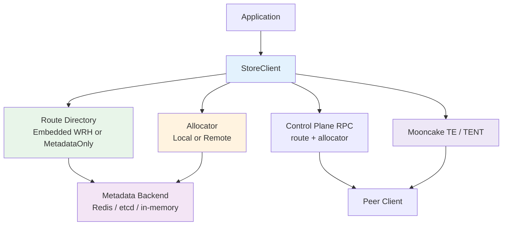

# mooncake-store-rs

A Rust-native Mooncake Store implementation that keeps the Mooncake store programming model, reuses Mooncake TE/TENT for data transfer, and defaults to masterless route control.

## Overview

`mooncake-store-rs` is a workspace that splits the store into four clear layers:

- `mooncake-store-core`: shared types and traits
- `mooncake-metadata`: metadata backends for leases, segments, and route persistence
- `mooncake-store-client`: the main client, allocator, route control, transport bridge, and observability
- `mooncake-store-py`: a Python compatibility layer built on top of the Rust client

By default, object route ownership is selected client-side with embedded weighted rendezvous hashing. Metadata remains the source of truth for leases and segment state, while TE/TENT stays on the data path for read and write transfer.

## Highlights

- Masterless route control with embedded weighted rendezvous hashing
- Optional `MetadataOnly` route mode for simpler deployments and debugging
- Local-first placement with spillover to remote storage nodes
- Request-level replication policy with preferred segment and preferred storage owner hints
- Batch put/get, registered-buffer put/get, and multi-buffer I/O
- Multi-tenant key namespace support
- Lifecycle support for standby, activation, draining, handoff, elastic segment changes, and reclaim
- Built-in tracing and Prometheus-style metrics
- Python compatibility layer with a Mooncake-style API surface

## Architecture



## Quick Start

### Prerequisites

- Rust toolchain
- `cmake` and a C++ toolchain
- `redis-server` and `redis-cli`
- Git submodule support
- Python 3, if you want the compatibility layer

### Fetch the upstream Mooncake submodule

```bash
git submodule update --init --recursive
```

### Run the local Rust e2e and benchmark

```bash
./scripts/run-local-e2e.sh
```

This script will:

- auto-start a local Redis instance on port `6380` when needed
- build Mooncake TE/TENT from `third_party/Mooncake` when native artifacts are missing
- run the Rust end-to-end suite
- print batch put/get benchmark results

### Run the Python compatibility e2e

```bash
./scripts/run-python-compat-e2e.sh
```

## Rust Usage

### Minimal local store

```rust
use std::sync::Arc;
use std::time::{SystemTime, UNIX_EPOCH};

use mooncake_metadata::{MetadataKeyspace, RedisMetadataBackend, RedisMetadataConfig};
use mooncake_store_client::{LocalMemoryConfig, MooncakeCompatibilityFacade, StoreClientBuilder};
use mooncake_store_core::{ClientEpoch, ClientLifecycleState, CompatibilityDescriptor, Result};
use mooncake_transport::{TentEngine, TentEngineConfig, TentTransportFactory};

fn now_ms() -> u64 {
    SystemTime::now()
        .duration_since(UNIX_EPOCH)
        .expect("time should move forward")
        .as_millis() as u64
}

fn main() -> Result<()> {
    let metadata = Arc::new(RedisMetadataBackend::new(
        RedisMetadataConfig::new("redis://127.0.0.1:6380/0")
            .keyspace(MetadataKeyspace::new("mc/store-rs/demo")),
    )?);

    let tent_config = TentEngineConfig::new()
        .set("metadata_type", "redis")
        .set("metadata_servers", "127.0.0.1:6380")
        .set("redis_db_index", "0")
        .set("rpc_server_hostname", "127.0.0.1")
        .set("rpc_server_port", "0")
        .set("log_level", "warning")
        .set("transports/tcp/enable", "true")
        .set("transports/shm/enable", "false")
        .set("transports/rdma/enable", "false")
        .set("transports/io_uring/enable", "false");

    let engine = Arc::new(TentEngine::new(
        &tent_config.clone().set("local_segment_name", "demo-segment"),
    )?);
    let factory = Arc::new(TentTransportFactory::new(tent_config));

    let client = StoreClientBuilder::new(metadata, "demo-store")
        .epoch(ClientEpoch(1))
        .state(ClientLifecycleState::Active)
        .tenant("default")
        .compatibility(CompatibilityDescriptor::default())
        .local_memory(
            LocalMemoryConfig::new()
                .storage_bytes(128 * 1024 * 1024)
                .scratch_bytes(16 * 1024 * 1024)
                .location("cpu:0"),
        )
        .with_tent(engine)
        .transport_factory(factory)
        .build(now_ms() + 600_000)?;

    client.register_local_memory()?;
    client.put("hello", b"world")?;
    assert_eq!(client.get("hello")?, b"world");
    Ok(())
}
```

### Routed writes

Use a placement planner and enable routed mode when you want router nodes to place data on remote storage nodes.

```rust
use mooncake_store_client::PlacementPlanner;

let planner = PlacementPlanner::new(metadata.clone()).require_label("storage", "true");
let routed = StoreClientBuilder::new(metadata, "router-a")
    .state(ClientLifecycleState::Active)
    .label("storage", "false")
    .with_tent(engine)
    .transport_factory(factory)
    .local_memory(local_memory)
    .routed_writes(planner, 2)
    .build(now_ms() + 600_000)?;
```

## Python Usage

Build the native module and expose the Python package from the repository checkout:

```bash
cargo build -p mooncake-store-py
export PYTHONPATH="$PWD/python"
```

```python
from mooncake.store import MooncakeDistributedStore, ReplicateConfig

store = MooncakeDistributedStore()
store.setup(
    "127.0.0.1",
    "redis://127.0.0.1:6380/0",
    128 * 1024 * 1024,
    16 * 1024 * 1024,
    "tcp",
    "",
    "",
    stable_id="py-store-a",
    labels={"pool": "pool-a", "storage": "true"},
)

store.put("hello", b"world")
assert store.get("hello") == b"world"

config = ReplicateConfig(replica_num=2, prefer_local=True)
store.put("replicated", b"payload", config=config)
```

For more Python details, see `docs/python.md`.

## Configuration Notes

### Metadata backends

| Backend | Purpose | Status |
|--------|---------|--------|
| `RedisMetadataBackend` | Leases, segments, route persistence, e2e defaults | Recommended for local runs |
| `EtcdMetadataBackend` | Store metadata on etcd | Supported |
| `InMemoryMetadataBackend` | Unit tests and local-only testing | Test-only |

If store metadata uses etcd in the Python compatibility layer, transport metadata still uses Redis. Set `transport_metadata_url` or `MC_STORE_RS_TENT_REDIS_URL` for that Redis endpoint.

### Route control modes

| Mode | Description | Default |
|------|-------------|---------|
| `EmbeddedWrh` | Client-side weighted rendezvous chooses route owners and keeps route lookups off the metadata hot path | Yes |
| `MetadataOnly` | Object routes are read and written directly from the metadata backend | No |

## Observability

### Tracing

- `MC_STORE_RS_TRACE=1`
- `MC_STORE_RS_TRACE_FILTER=info` or any `tracing_subscriber` filter string

### Metrics

- `MC_STORE_RS_METRICS_ADDR=127.0.0.1:9090`
- `render_prometheus_metrics()` returns a text snapshot
- `start_metrics_http_server()` exposes `/metrics` and `/healthz`

## Workspace Layout

```text
crates/
  mooncake-store-core/      Shared types, identities, routes, lifecycle, traits
  mooncake-metadata/        Redis, etcd, and in-memory metadata backends
  mooncake-store-client/    Client API, routing, allocation, control plane, transport glue
  mooncake-store-py/        Python compatibility bindings
  mooncake-store-e2e/       End-to-end validation and benchmarks
  mooncake-transport/       Safe Rust wrapper around Mooncake TE/TENT
  mooncake-transport-sys/   Native FFI and upstream Mooncake build integration
python/
  mooncake/                 Python convenience package
scripts/
  run-local-e2e.sh          Local Rust e2e + benchmark entrypoint
  run-python-compat-e2e.sh  Python compatibility validation
third_party/
  Mooncake/                 Upstream Mooncake submodule
```

## More Documentation

- `docs/architecture.md`
- `docs/python.md`

## Status

The repository includes automated coverage for:

- single put/get
- batch put/get
- registered-buffer and multi-buffer I/O
- request-level replication policy
- overwrite reclaim and delete reclaim
- routed remote writes
- multi-tenant operation
- dynamic membership, elastic segment changes, and hot-upgrade handoff
