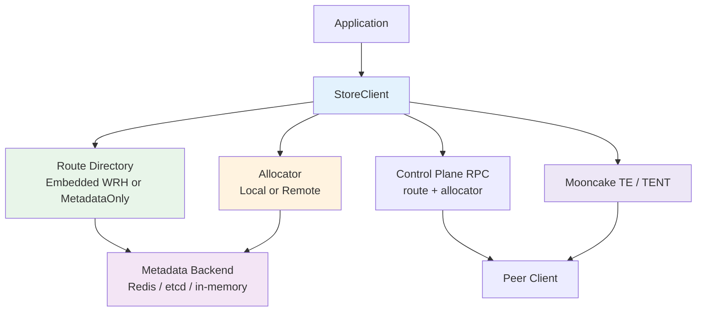

# mooncake-store-rs

A Rust-native Mooncake Store implementation that keeps the Mooncake store programming model, reuses Mooncake TE/TENT for data transfer, and defaults to masterless route control.

## What This Project Is

`mooncake-store-rs` is a complete store implementation built in Rust.

It keeps the familiar Mooncake-style store API, but organizes the system around client-owned routing and peer-to-peer control-plane communication. Object data is transferred through Mooncake TE/TENT, while leases, segment state, and durable metadata stay in Redis or etcd.

The result is a store that is easier to embed into Rust systems, easier to test locally, and easier to expose to Python without adding another store implementation.

## Documentation

Use the document that matches what you are doing.

| If You Want To | Read |
|----------------|------|
| run the project locally | `README.md`, `docs/deployment.md` |
| integrate the client into a Rust service | `docs/rust.md` |
| configure routing, memory, placement, or observability | `docs/configuration.md` |
| use the Python compatibility layer | `docs/python.md` |
| understand repository structure | `docs/components.md` |
| understand implemented capabilities | `docs/features.md` |
| understand runtime flow and control plane behavior | `docs/architecture.md` |

## Project Map

The repository is organized by clear runtime responsibilities.

| Module | Role | Why It Exists |
|--------|------|---------------|
| `mooncake-store-core` | Shared store model | Defines identities, leases, routes, segments, lifecycle, and traits |
| `mooncake-metadata` | Metadata backends | Stores leases, segments, and route state in Redis, etcd, or memory |
| `mooncake-store-client` | Main runtime | Implements store APIs, routing, allocation, reclaim, control-plane RPC, and observability |
| `mooncake-transport-sys` | Native FFI | Links Rust to upstream Mooncake native libraries |
| `mooncake-transport` | Safe transport wrapper | Exposes TE/TENT as Rust-friendly transport abstractions |
| `mooncake-store-py` | Python bindings | Exposes the Rust client as a native Python module |
| `mooncake-store-e2e` | Validation binary | Runs end-to-end checks and benchmark loops |

If you want a deeper module-by-module explanation, read `docs/components.md`.

## Feature Map

The implementation is easier to understand when grouped by capability instead of by crate.

### Data I/O

- single `put` / `get`
- `batch_put` / `batch_get`
- buffer-based and registered-buffer I/O
- multi-buffer put and get for fragmented payloads
- local copy and remote transfer paths through TE/TENT

### Routing

- default client-side route ownership with embedded weighted rendezvous hashing
- optional `MetadataOnly` route mode
- route read, replace, and compare-and-swap through the control plane
- metadata fallback when route authorities are unavailable

### Placement and Replication

- local-only writes
- routed writes to remote storage nodes
- local-first placement with remote spillover
- request-level replication policy
- preferred segment hints
- preferred storage owner hints
- multi-replica publication

### Memory and Reclaim

- local segment registration
- local and remote allocation paths
- overwrite reclaim
- delete reclaim
- configurable reclaim grace window
- elastic segment expansion and retirement

### Lifecycle and Membership

- standby, activate, and draining states
- handoff planning for upgrades
- dynamic live-client membership
- segment-level drain / retire flows
- true client shrink through replica evacuation
- hot-upgrade and elastic-capacity scenarios validated in e2e

### Observability

- tracing through `tracing` / `tracing-subscriber`
- in-process Prometheus-style metrics
- optional metrics HTTP server
- control-plane and data-path metrics coverage

### Python Compatibility

- Mooncake-style `MooncakeDistributedStore`
- `ReplicateConfig` request policy mapping
- batch APIs, route query, metrics helpers, lifecycle helpers
- native module backed by the Rust implementation

If you want a feature-by-feature view, read `docs/features.md`.

## Architecture at a Glance



For the runtime view, read `docs/architecture.md`.

## Quick Start

### Prerequisites

- Rust toolchain
- `cmake` and a C++ toolchain
- `redis-server` and `redis-cli`
- Git submodule support
- Python 3, if you want the Python layer

### Fetch the upstream Mooncake submodule

```bash
git submodule update --init --recursive
```

### Run the local Rust e2e and benchmark

```bash
./scripts/run-local-e2e.sh
```

This script will:

- auto-start a local Redis instance on port `6380` when needed
- build Mooncake TE/TENT from `third_party/Mooncake` when native artifacts are missing
- run the Rust end-to-end suite
- print batch put/get benchmark results

For deployment details and script knobs, read `docs/deployment.md`.

### Run the Python compatibility e2e

```bash
./scripts/run-python-compat-e2e.sh
```

For Python build and API details, read `docs/python.md`.

## Rust Usage

### Minimal local store

```rust
use std::sync::Arc;
use std::time::{SystemTime, UNIX_EPOCH};

use mooncake_metadata::{MetadataKeyspace, RedisMetadataBackend, RedisMetadataConfig};
use mooncake_store_client::{LocalMemoryConfig, MooncakeCompatibilityFacade, StoreClientBuilder};
use mooncake_store_core::{ClientEpoch, ClientLifecycleState, CompatibilityDescriptor, Result};
use mooncake_transport::{TentEngine, TentEngineConfig, TentTransportFactory};

fn now_ms() -> u64 {
    SystemTime::now()
        .duration_since(UNIX_EPOCH)
        .expect("time should move forward")
        .as_millis() as u64
}

fn main() -> Result<()> {
    let metadata = Arc::new(RedisMetadataBackend::new(
        RedisMetadataConfig::new("redis://127.0.0.1:6380/0")
            .keyspace(MetadataKeyspace::new("mc/store-rs/demo")),
    )?);

    let tent_config = TentEngineConfig::new()
        .set("metadata_type", "redis")
        .set("metadata_servers", "127.0.0.1:6380")
        .set("redis_db_index", "0")
        .set("rpc_server_hostname", "127.0.0.1")
        .set("rpc_server_port", "0")
        .set("log_level", "warning")
        .set("transports/tcp/enable", "true")
        .set("transports/shm/enable", "false")
        .set("transports/rdma/enable", "false")
        .set("transports/io_uring/enable", "false");

    let engine = Arc::new(TentEngine::new(
        &tent_config.clone().set("local_segment_name", "demo-segment"),
    )?);
    let factory = Arc::new(TentTransportFactory::new(tent_config));

    let client = StoreClientBuilder::new(metadata, "demo-store")
        .epoch(ClientEpoch(1))
        .state(ClientLifecycleState::Active)
        .tenant("default")
        .compatibility(CompatibilityDescriptor::default())
        .local_memory(
            LocalMemoryConfig::new()
                .storage_bytes(128 * 1024 * 1024)
                .scratch_bytes(16 * 1024 * 1024)
                .location("cpu:0"),
        )
        .with_tent(engine)
        .transport_factory(factory)
        .build(now_ms() + 600_000)?;

    client.register_local_memory()?;
    client.put("hello", b"world")?;
    assert_eq!(client.get("hello")?, b"world");
    Ok(())
}
```

### Routed writes

```rust
use mooncake_store_client::PlacementPlanner;

let planner = PlacementPlanner::new(metadata.clone()).require_label("storage", "true");
let routed = StoreClientBuilder::new(metadata, "router-a")
    .state(ClientLifecycleState::Active)
    .label("storage", "false")
    .with_tent(engine)
    .transport_factory(factory)
    .local_memory(local_memory)
    .routed_writes(planner, 2)
    .build(now_ms() + 600_000)?;
```

For a fuller Rust guide, including lifecycle and buffer-oriented APIs, read `docs/rust.md`.

## Python Usage

Build the native module and expose the Python package from the repository checkout:

```bash
cargo build -p mooncake-store-py
export PYTHONPATH="$PWD/python"
```

```python
from mooncake.store import MooncakeDistributedStore, ReplicateConfig

store = MooncakeDistributedStore()
store.setup(
    "127.0.0.1",
    "redis://127.0.0.1:6380/0",
    128 * 1024 * 1024,
    16 * 1024 * 1024,
    "tcp",
    "",
    "",
    stable_id="py-store-a",
    labels={"pool": "pool-a", "storage": "true"},
)

store.put("hello", b"world")
assert store.get("hello") == b"world"

config = ReplicateConfig(replica_num=2, prefer_local=True)
store.put("replicated", b"payload", config=config)
```

For Python APIs and configuration details, read `docs/python.md`.

## Configuration Notes

For the complete configuration reference, read `docs/configuration.md`.

### Metadata backends

| Backend | Purpose | Status |
|--------|---------|--------|
| `RedisMetadataBackend` | Leases, segments, route persistence, e2e defaults | Recommended for local runs |
| `EtcdMetadataBackend` | Store metadata on etcd | Supported |
| `InMemoryMetadataBackend` | Unit tests and local-only testing | Test-only |

If store metadata uses etcd in the Python compatibility layer, transport metadata still uses Redis. Set `transport_metadata_url` or `MC_STORE_RS_TENT_REDIS_URL` for that Redis endpoint.

### Route control modes

| Mode | Description | Default |
|------|-------------|---------|
| `EmbeddedWrh` | Client-side weighted rendezvous chooses route owners and keeps route lookups off the metadata hot path | Yes |
| `MetadataOnly` | Object routes are read and written directly from the metadata backend | No |

## Observability

### Tracing

- `MC_STORE_RS_TRACE=1`
- `MC_STORE_RS_TRACE_FILTER=info` or any `tracing_subscriber` filter string

### Metrics

- `MC_STORE_RS_METRICS_ADDR=127.0.0.1:9090`
- `render_prometheus_metrics()` returns a text snapshot
- `start_metrics_http_server()` exposes `/metrics` and `/healthz`

## Documentation Index

- `README.md` — project entry and first run
- `docs/deployment.md` — environment setup, local scripts, and deployment roles
- `docs/rust.md` — Rust integration and API usage
- `docs/configuration.md` — builder defaults, request policies, labels, and environment variables
- `docs/components.md` — component guide
- `docs/features.md` — feature-by-feature capability guide
- `docs/architecture.md` — runtime architecture and request paths
- `docs/python.md` — Python usage and compatibility notes

## Workspace Layout

```text
crates/
  mooncake-store-core/      Shared types, identities, routes, lifecycle, traits
  mooncake-metadata/        Redis, etcd, and in-memory metadata backends
  mooncake-store-client/    Client API, routing, allocation, control plane, transport glue
  mooncake-store-py/        Python compatibility bindings
  mooncake-store-e2e/       End-to-end validation and benchmarks
  mooncake-transport/       Safe Rust wrapper around Mooncake TE/TENT
  mooncake-transport-sys/   Native FFI and upstream Mooncake build integration
python/
  mooncake/                 Python convenience package
scripts/
  run-local-e2e.sh          Local Rust e2e + benchmark entrypoint
  run-python-compat-e2e.sh  Python compatibility validation
third_party/
  Mooncake/                 Upstream Mooncake submodule
```

## Status

The repository includes automated coverage for:

- single put/get
- batch put/get
- registered-buffer and multi-buffer I/O
- request-level replication policy
- overwrite reclaim and delete reclaim
- routed remote writes
- multi-tenant operation
- dynamic membership, elastic segment changes, and hot-upgrade handoff
