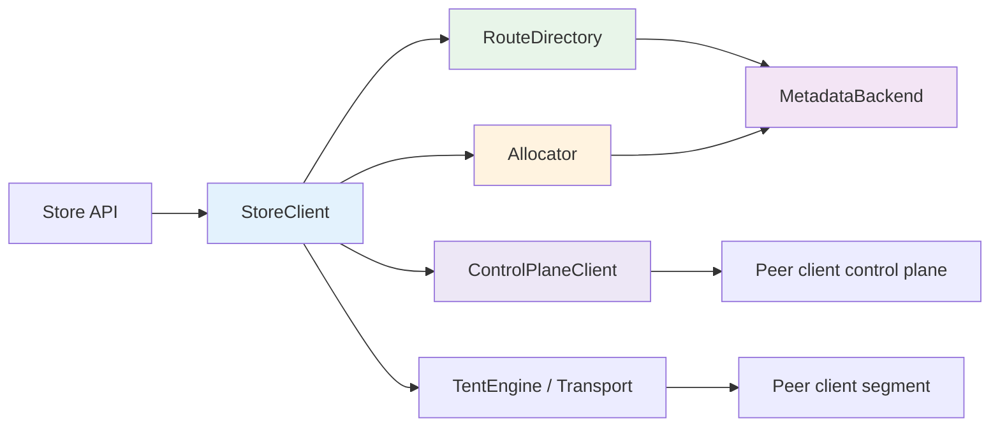
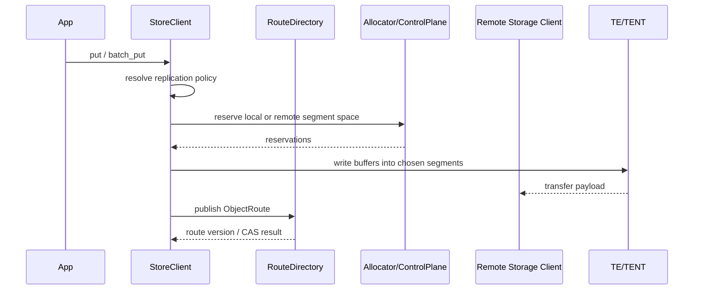
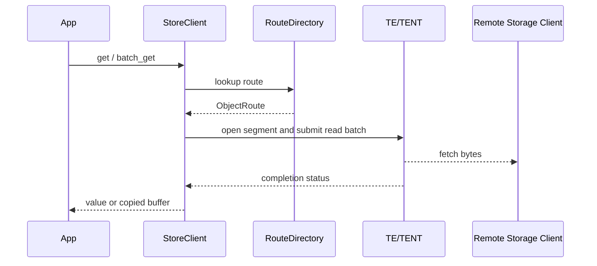

# Architecture

This document describes the runtime architecture implemented in `mooncake-store-rs`.

## Design Goals

- Keep the public store programming model close to Mooncake
- Reuse Mooncake TE/TENT for the data path
- Avoid a dedicated master on the route hot path
- Keep metadata backends responsible for leases, segments, and durable route persistence
- Make lifecycle changes, reclaim, and routing explicit in the client

## Component Model

| Component | Responsibility | Hot Path |
|-----------|----------------|----------|
| `StoreClient` | User-facing API, local state, batching, reclaim scheduling | Yes |
| `RouteDirectory` | Route lookup and route CAS | Yes |
| `ControlPlaneClient` | Peer-to-peer route and allocator RPC | Yes |
| `MetadataBackend` | Leases, segments, fallback route persistence | No for default route lookups |
| `TentEngine` / `TentTransportFactory` | Data transfer and remote segment access | Yes |
| `LocalAllocatorState` | Local segment reservation and release | Yes for local storage |

## Route Control

### Default mode: `EmbeddedWrh`

In the default route mode, the client chooses route authorities with embedded weighted rendezvous hashing.

- candidates come from live client leases
- only compatible, route-capable clients are considered
- one primary and one secondary authority are selected per key
- route reads and route CAS go to authorities over the control plane
- metadata remains the fallback path when authorities are unavailable

This keeps object route lookups off the metadata hot path while preserving a durable fallback.

### Alternative mode: `MetadataOnly`

`MetadataOnly` bypasses client authorities and stores object routes directly in the metadata backend.

| Route Mode | Route Read Path | Route Write Path | Best For |
|------------|-----------------|------------------|----------|
| `EmbeddedWrh` | Authority RPC first, metadata fallback | Authority CAS with secondary mirror | Normal deployments |
| `MetadataOnly` | Metadata backend | Metadata backend | Simpler debugging and bring-up |

## Write Path

A write is split into route resolution, allocation, transfer, and route publication.

### Placement rules

The current implementation supports:

- local-only writes
- routed writes to remote storage nodes
- local-first placement with remote spillover
- explicit preferred segment hints
- explicit preferred storage owner hints
- multi-replica placement

The default request policy prefers local storage when available. When local capacity is insufficient, the client allocates on remote storage nodes selected by the planner and the replication policy.

## Read Path

For reads, the client first resolves the object route, then groups reads by remote segment and submits transfer requests through TE/TENT.

The read path supports:

- single get and batch get
- direct copy into caller buffers
- multi-buffer reads for fragmented targets
- registered-buffer reads for reduced copy overhead

## Allocation and Reclaim

Allocation is split by storage ownership.

- local allocations use `LocalAllocatorState`
- remote allocations use control-plane RPC to the owning client
- metadata allocation remains the fallback when allocator RPC is unavailable

Local memory supports two backing strategies:

- transport-managed memory through the TE/TENT transport
- hugepage-backed native memory allocated directly by store-rs and then registered into the transport

The Python host allocator uses shared `memfd` + `mmap`, and can also request hugepage-backed shm regions when the host kernel is configured for hugepages.

Reclaim is explicit and route-aware.

- overwrites schedule release for the old replicas
- deletes schedule reclaim after route removal
- `reclaim_grace_ms` controls delayed release behavior
- remote release uses batched allocator RPC

## Control Plane

The control plane is implemented with protobuf and tonic.

It handles two categories of RPC:

- route RPC: batch get, compare-and-swap, replace
- allocator RPC: batch reserve any, reserve specific, release

Single-item calls are intentionally folded into the batch path so that the implementation can reuse streaming sessions and keep the control-plane logic uniform.

## Metadata Model

Metadata backends store three persistent categories of data:

- client leases
- segment announcements and segment lifecycle state
- object routes, when metadata persistence is needed

### Backend support

| Backend | Use Case |
|---------|----------|
| Redis | local development, e2e, route and segment persistence |
| etcd | store metadata for distributed deployments |
| in-memory | unit tests |

## Lifecycle and Elasticity

`StoreClient` also exposes lifecycle operations that are used by the compatibility facade.

| Capability | Description |
|------------|-------------|
| `activate` / `enter_standby` / `enter_draining` | Drive client lifecycle state |
| `plan_handoff` | Prepare successor handoff metadata |
| `expand_local_memory` | Add new local storage capacity |
| `drain_segment` / `retire_segment` | Drain and retire individual local segments |
| `evacuate_owned_replicas` / `evacuate_owned_replicas_via` | Rewrite live routes away from a draining client and retire emptied segments |
| remove + reclaim | Delete route state and release segment space |

These APIs are what the e2e suite uses to validate dynamic membership, elastic expansion, true client shrink, and hot-upgrade handoff with payload preservation.

## Observability

The client contains a built-in metrics registry and a lightweight HTTP exporter.

### Metrics

Metrics are recorded per operation and status.

Examples include:

- route lookups
- local copy and remote transfer work
- control-plane batch operations
- bytes in and bytes out
- accumulated latency and max latency

### Tracing

Tracing is built on `tracing` + `tracing-subscriber` and can be enabled from code or by environment variables.

## Python Compatibility Architecture

The Python package exposes two runtime paths over the same Rust implementation.

### Real path

`MooncakeDistributedStore.setup(...)` builds a native `StoreClient`.

That means:

- route lookups use the same `RouteDirectory`
- allocation uses the same local / remote allocator logic
- data transfer uses the same TE/TENT transport path
- lifecycle, reclaim, tracing, and metrics share the same implementation as Rust callers

### Dummy path

`MooncakeDistributedStore.setup_dummy(...)` connects to a standalone `mooncake-store-client` process.

That path is split as follows:

- gRPC carries compatibility operations such as put/get/batch RPCs
- a Unix-domain side channel passes shm file descriptors for registered buffers
- the standalone server resolves those shm registrations and forwards operations into the native store runtime

This preserves compatibility for integrations that expect a dummy client / external server split while keeping the real store logic inside the Rust runtime.

## Code Map

| Path | Role |
|------|------|
| `crates/mooncake-store-core` | Shared contracts and store model |
| `crates/mooncake-metadata` | Backend implementations for metadata |
| `crates/mooncake-store-client/src/client.rs` | Public API, lifecycle, batching, local state |
| `crates/mooncake-store-client/src/route_directory.rs` | Embedded WRH route control |
| `crates/mooncake-store-client/src/control_plane.rs` | protobuf RPC client/server for route and allocator |
| `crates/mooncake-store-client/src/memory.rs` | local memory and segment tracking |
| `crates/mooncake-store-client/src/transport.rs` | transfer submission helpers |
| `crates/mooncake-store-py/src/lib.rs` | Python bindings, real/dummy dispatch, compatibility API |
| `crates/mooncake-store-py/src/dummy_client.rs` | dummy compatibility client and shm registration RPC |
| `crates/mooncake-store-py/src/shm.rs` | shm region ownership, fd passing, shared mapping helpers |
| `crates/mooncake-store-e2e` | runnable system validation |

## When to Read Which Document

- Start with `README.md` for setup and a first run
- Read `docs/deployment.md` for local scripts and deployment roles
- Read `docs/rust.md` for Rust integration
- Read `docs/configuration.md` for defaults and tuning knobs
- Read `docs/python.md` for the Python layer
- Read `crates/mooncake-store-e2e/src/main.rs` for a complete runnable example
