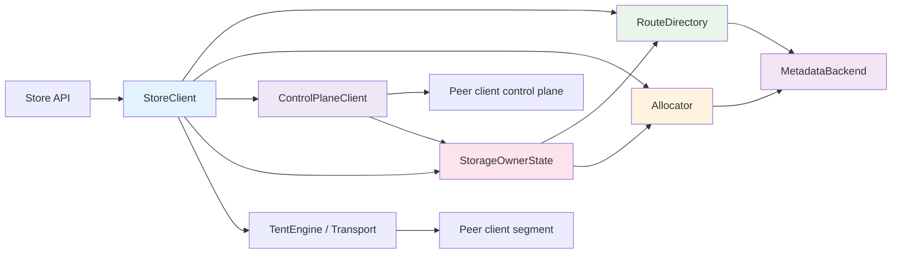
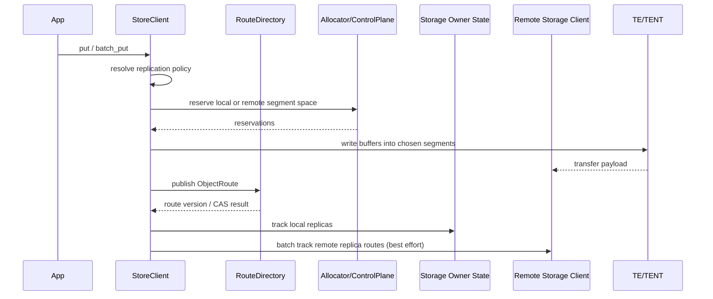
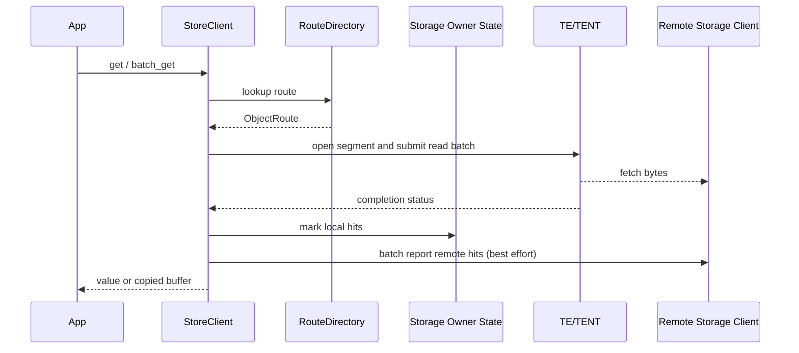

# Architecture

This document describes the runtime architecture implemented in `mooncake-store-rs`.

## Design Goals

- Keep the public store programming model close to Mooncake
- Reuse Mooncake TE/TENT for the data path
- Avoid a dedicated master on the route hot path
- Keep metadata backends responsible for leases, segments, route policy, handoff, and `MetadataOnly` route persistence
- Make lifecycle changes, reclaim, and routing explicit in the client

## Component Model

| Component | Responsibility | Hot Path |
|-----------|----------------|----------|
| `StoreClient` | User-facing API, local state, batching, reclaim scheduling | Yes |
| `RouteDirectory` | Route lookup and route CAS | Yes |
| `ControlPlaneClient` | Peer-to-peer route and allocator RPC | Yes |
| `StorageOwnerState` | Local replica tracking, CLOCK eviction, route-aware reclaim | Yes on storage nodes |
| `MetadataBackend` | Leases, segments, route policy, handoff, and `MetadataOnly` route persistence | No for default `EmbeddedWrh` route lookups |
| `TentEngine` / `TentTransportFactory` | Data transfer and remote segment access | Yes |
| `LocalAllocatorState` | Local segment reservation and release | Yes for local storage |

## Route Control

### Default mode: `EmbeddedWrh`

In the default route mode, the client chooses route authorities with embedded weighted rendezvous hashing.

- candidates come from live client leases
- only compatible, route-capable clients are considered
- the top `route_topk` authorities are selected per key
- the highest-ranked authority is the CAS primary
- the remaining `route_topk - 1` authorities are mirrored authorities
- route reads and route CAS go to authorities over the control plane
- if the mirrored set does not resolve a key, lower-ranked authorities in the same WRH ordering can still be queried

This keeps object route lookups on the authority mesh and off the metadata hot path in normal `EmbeddedWrh` deployments.

Route authority policy is bootstrap-validated through metadata:

- every client starts with a local `route_control + route_topk` policy
- the first client in a metadata keyspace writes the default cluster policy with create-if-absent semantics
- runtimes then resolve the effective route policy for their default tenant: tenant override first, otherwise the default cluster policy
- later clients must match that effective policy or startup fails

This keeps route-authority fanout deterministic across the cluster instead of letting each client silently pick a different authority set size.

### Alternative mode: `MetadataOnly`

`MetadataOnly` bypasses client authorities and stores object routes directly in the metadata backend.

| Route Mode | Route Read Path | Route Write Path | Best For |
|------------|-----------------|------------------|----------|
| `EmbeddedWrh` | Authority RPC across ranked WRH authorities | Authority CAS with mirrored top-k publication | Normal deployments |
| `MetadataOnly` | Metadata backend | Metadata backend | Simpler debugging and bring-up |

## Membership Snapshot Model

`StoreClientBuilder::build(...)` publishes the client lease, prewarms a live-client snapshot, and then starts a background membership sync worker.

The shared snapshot is the membership truth used by the hot request path.

- route-authority selection reads the cached snapshot
- routed placement reads the same cached snapshot
- runtime lease lookup and preferred-storage resolution read the same cached snapshot
- successful background refresh replaces the whole snapshot
- failed refresh keeps the last successful snapshot available

This keeps `list_live_clients()` off the normal request path. Metadata still owns the durable lease set, but request-path consumers read a locally cached view that is refreshed asynchronously.

The membership snapshot is runtime cache, not protocol configuration:

- membership snapshots are refreshed in the background
- route policy is durable cluster configuration stored in metadata
- request-level tenants affect scoped object keys, not the cluster-wide route-authority policy

## Write Path

A write is split into route resolution, allocation, transfer, and route publication.

### Placement rules

The current implementation supports:

- local-only writes
- routed writes to remote storage nodes
- local-first placement with remote spillover
- explicit preferred segment hints
- explicit preferred storage owner hints
- multi-replica placement

The default request policy prefers local storage when available. When local capacity is insufficient, the client allocates on remote storage nodes selected by the planner and the replication policy.

### Remote storage-owner tracking

Route publication and eviction are intentionally decoupled across two owners:

- the route owner is responsible for the authoritative object route version
- the storage owner is responsible for the actual bytes and local capacity

After a write publishes a route, the writer groups replicas by remote storage owner and sends the published routes through `BatchTrackReplicaRoutes`.

This lets each storage owner update its local eviction clock from the published route directly, instead of rebuilding state from metadata during normal write traffic.

## Read Path

For reads, the client first resolves the object route, then groups reads by remote segment and submits transfer requests through TE/TENT.

The read path supports:

- single get and batch get
- direct copy into caller buffers
- multi-buffer reads for fragmented targets
- registered-buffer reads for reduced copy overhead

### Read-hit reporting

Successful reads update eviction heat at the storage owner:

- local hits are reported directly into the local `StorageOwnerState`
- remote hits are grouped by replica owner and sent through `BatchReportRouteHits`

Hit reporting is best-effort. It improves eviction quality but is not part of correctness.

## Allocation and Reclaim

Allocation is split by storage ownership.

- local allocations use `LocalAllocatorState`
- remote allocations use control-plane RPC to the owning client
- remote allocator capacity errors remain owner-local results; transport or protocol failures quarantine that owner and let placement move on

Local memory supports two backing strategies:

- transport-managed memory through the TE/TENT transport
- hugepage-backed native memory allocated directly by store-rs and then registered into the transport

The Python host allocator uses shared `memfd` + `mmap`, and can also request hugepage-backed shm regions when the host kernel is configured for hugepages.

Reclaim is explicit and route-aware.

- overwrites schedule release for the old replicas
- deletes schedule reclaim after route removal
- `reclaim_grace_ms` controls delayed release behavior
- remote release uses batched allocator RPC

### Storage-owner CLOCK with route-owner CAS

Capacity pressure is resolved by the storage owner, but correctness is still enforced by the route owner.

The important invariants are:

- a replica is never released before its route entry is removed
- a failed CAS refreshes local eviction state instead of guessing
- a storage owner can rebuild its CLOCK from route state if best-effort tracking falls behind
- local CLOCK eviction is enabled only on clients labeled `storage=true`
- routed writers without local storage keep the spill-remote behavior

Remote allocator RPC follows the same pattern on the storage owner side. A live remote storage owner returns a real allocator error when it still cannot free capacity. The caller does not silently downgrade that case to metadata allocation.

### Background watermarks plus synchronous fallback

The local storage owner now has two reclaim modes:

- background mode: poll local allocator usage and reclaim from the high watermark down to the low watermark
- synchronous mode: when a reserve still fails, evict immediately and retry the allocation

This keeps steady-state pressure off the front path while still preserving a deterministic fallback under bursty writes.

Default local-memory thresholds are:

- high watermark: `90%`
- low watermark: `80%`
- poll interval: `100ms`

Startup also normalizes the storage role:

- `storage=true` is rejected when `storage_bytes=0`
- `storage_bytes=0` without an explicit storage label is normalized to `storage=false`

## Control Plane

The control plane is implemented with protobuf and tonic.

It handles three categories of RPC:

- route RPC: batch get, compare-and-swap, replace
- allocator RPC: batch reserve any, reserve specific, release
- eviction RPC: batch report route hits, batch track replica routes

Single-item calls are intentionally folded into the batch path so that the implementation can reuse streaming sessions and keep the control-plane logic uniform.

For route control, that batch substrate serves both the CAS primary and the mirrored remainder of the `route_topk` authority set.

## Metadata Model

Metadata backends store four persistent categories of data:

- client leases
- segment announcements and segment lifecycle state
- object routes, when metadata persistence is needed
- tenant policy and strict-quota metadata

For membership specifically, metadata is the authoritative lease store, while the client runtime keeps a prewarmed and background-refreshed snapshot for request-path reads.

For strict quota rollout, the metadata model now also includes tenant-root quota primitives:

- `TenantQuotaState` for committed and pending usage
- `TenantObjectAccounting` for authoritative committed object size/version
- `TenantQuotaReservation` for reserve/finalize/abort coordination

In Phase 1, these primitives exist in the shared contracts and all three metadata backends. The in-memory backend applies them under one write lock, Redis uses backend-atomic Lua reserve/finalize/abort scripts, and etcd uses multi-key compare-and-swap txn loops.

Phase 3 now wires those primitives into the single-object client path: `put` reserves tenant quota before allocation/write, publishes the route, then finalizes quota before returning success. `remove` now reserves and finalizes the negative delta at delete CAS time, so quota/accounting state tracks authoritative object visibility rather than delayed storage reclaim.

### Backend support

| Backend | Use Case |
|---------|----------|
| Redis | local development, e2e, route and segment persistence |
| etcd | store metadata for distributed deployments |
| in-memory | unit tests |

## Lifecycle and Elasticity

`StoreClient` also exposes lifecycle operations that are used by the compatibility facade.

| Capability | Description |
|------------|-------------|
| `activate` / `enter_standby` / `enter_draining` | Drive client lifecycle state |
| `plan_handoff` | Prepare successor handoff metadata |
| `expand_local_memory` | Add new local storage capacity |
| `drain_segment` / `retire_segment` | Drain and retire individual local segments |
| `evacuate_owned_replicas` / `evacuate_owned_replicas_via` | Rewrite live routes away from a draining client and retire emptied segments |
| remove + reclaim | Delete route state and release segment space |

These APIs are what the e2e suite uses to validate dynamic membership, elastic expansion, true client shrink, and hot-upgrade handoff.

## Observability

The client contains a built-in typed metrics registry and a lightweight HTTP exporter.

Observability is split into three stages:

- request-path code records facts into typed families close to the state transition
- `snapshot_metrics()` builds one immutable view of registry + process facts
- the exporter renders Prometheus text from that snapshot without mutating state

This avoids continuing to grow one branchy `operation -> counters` map and keeps `/metrics` deterministic under concurrent request traffic.

### Metrics

Metrics are recorded per operation and status.

Examples include:

- route lookups
- local copy and remote transfer work
- control-plane batch operations
- bytes in and bytes out
- accumulated latency and max latency

The same tracker framework also covers eviction-related work such as:

- storage-owner eviction attempts
- route-hit reporting RPC
- replica-route tracking RPC

### Tracing

Tracing is built on `tracing` + `tracing-subscriber` and can be enabled from code or by environment variables.

## Python Compatibility Architecture

The Python package exposes two runtime paths over the same Rust implementation.

### Real path

`MooncakeDistributedStore.setup(...)` builds a native `StoreClient`.

That means:

- route lookups use the same `RouteDirectory`
- allocation uses the same local / remote allocator logic
- data transfer uses the same TE/TENT transport path
- lifecycle, reclaim, tracing, and metrics share the same implementation as Rust callers

### Dummy path

`MooncakeDistributedStore.setup_dummy(...)` connects to a standalone `mooncake-store-client` process.

That path is split as follows:

- gRPC carries compatibility operations such as put/get/batch RPCs
- a Unix-domain side channel passes shm file descriptors for registered buffers
- the standalone server resolves those shm registrations and forwards operations into the native store runtime

This preserves compatibility for integrations that expect a dummy client / external server split while keeping the real store logic inside the Rust runtime.

## Code Map

| Path | Role |
|------|------|
| `crates/mooncake-store-core` | Shared contracts and store model |
| `crates/mooncake-metadata` | Backend implementations for metadata |
| `crates/mooncake-store-client/src/client/mod.rs` | `StoreClient` assembly and module composition |
| `crates/mooncake-store-client/src/client/builder.rs` | builder defaults, lease publication, membership prewarm |
| `crates/mooncake-store-client/src/client/runtime_core.rs` | runtime lookup, placement, lifecycle, allocator helpers |
| `crates/mooncake-store-client/src/client/runtime_io.rs` | get/batch-get, route scans, migration reads |
| `crates/mooncake-store-client/src/client/runtime_write.rs` | put/batch-put and route publication |
| `crates/mooncake-store-client/src/client/runtime_alloc.rs` | local and remote allocation helpers |
| `crates/mooncake-store-client/src/client/membership_sync.rs` | background live-client snapshot refresh |
| `crates/mooncake-store-client/src/client/facade.rs` | Mooncake-compatible surface methods |
| `crates/mooncake-store-client/src/route_directory.rs` | Embedded WRH route control |
| `crates/mooncake-store-client/src/control_plane/mod.rs` | control-plane module entry and exports |
| `crates/mooncake-store-client/src/control_plane/client.rs` | protobuf RPC client and stream-session reuse |
| `crates/mooncake-store-client/src/control_plane/server.rs` | protobuf RPC server and dispatch |
| `crates/mooncake-store-client/src/memory.rs` | local memory and segment tracking |
| `crates/mooncake-store-client/src/transport.rs` | transfer submission helpers |
| `crates/mooncake-store-py/src/lib.rs` | Python bindings and top-level compatibility API |
| `crates/mooncake-store-py/src/runtime.rs` | real runtime construction from Python setup args |
| `crates/mooncake-store-py/src/dummy_client.rs` | dummy compatibility client and shm registration RPC |
| `crates/mooncake-store-py/src/dummy_service.rs` | standalone dummy compatibility service |
| `crates/mooncake-store-py/src/shm.rs` | shm region ownership, fd passing, shared mapping helpers |
| `crates/mooncake-store-e2e` | runnable system validation |

## When to Read Which Document

- Start with `README.md` for setup and a first run
- Read `docs/deployment.md` for local scripts and deployment roles
- Read `docs/rust.md` for Rust integration
- Read `docs/configuration.md` for defaults and tuning knobs
- Read `docs/python.md` for the Python layer
- Read `crates/mooncake-store-e2e/src/main.rs` for a complete runnable example
