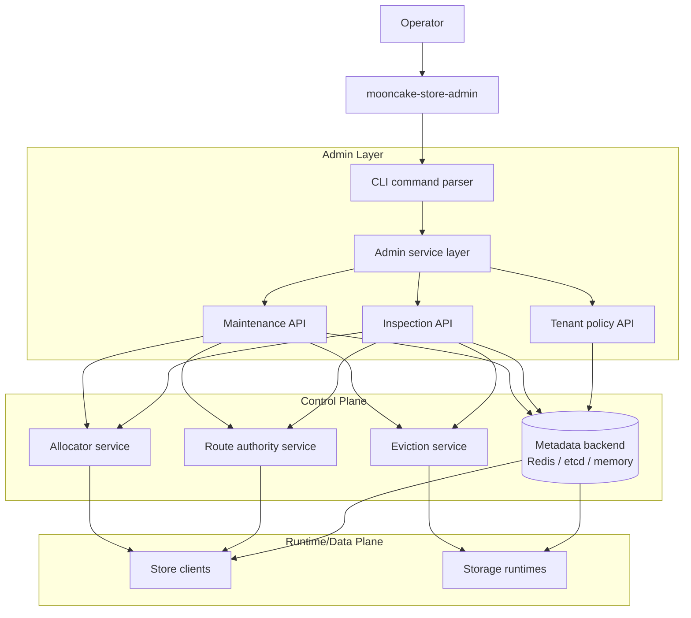
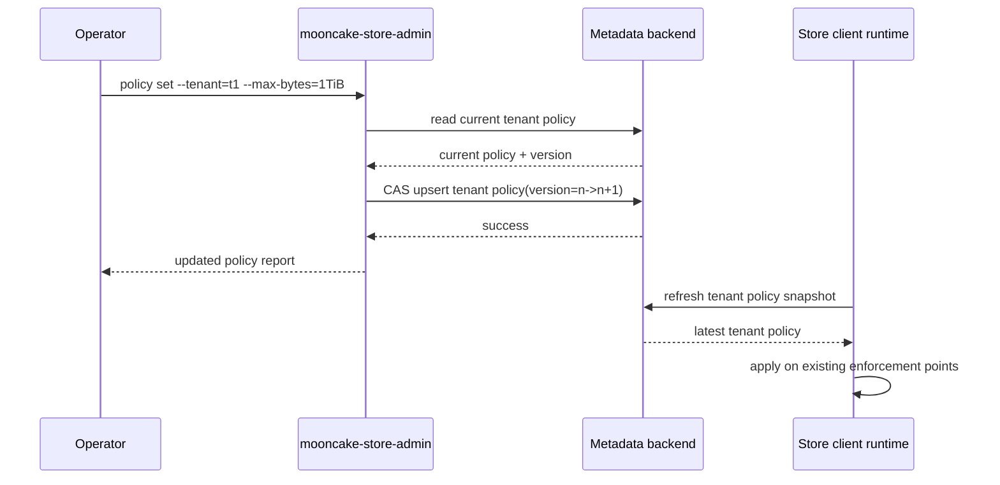
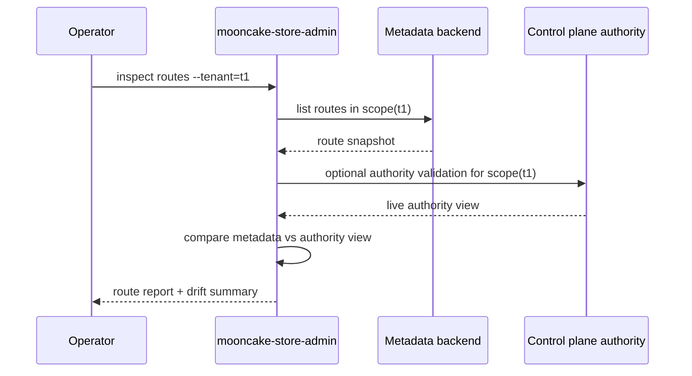
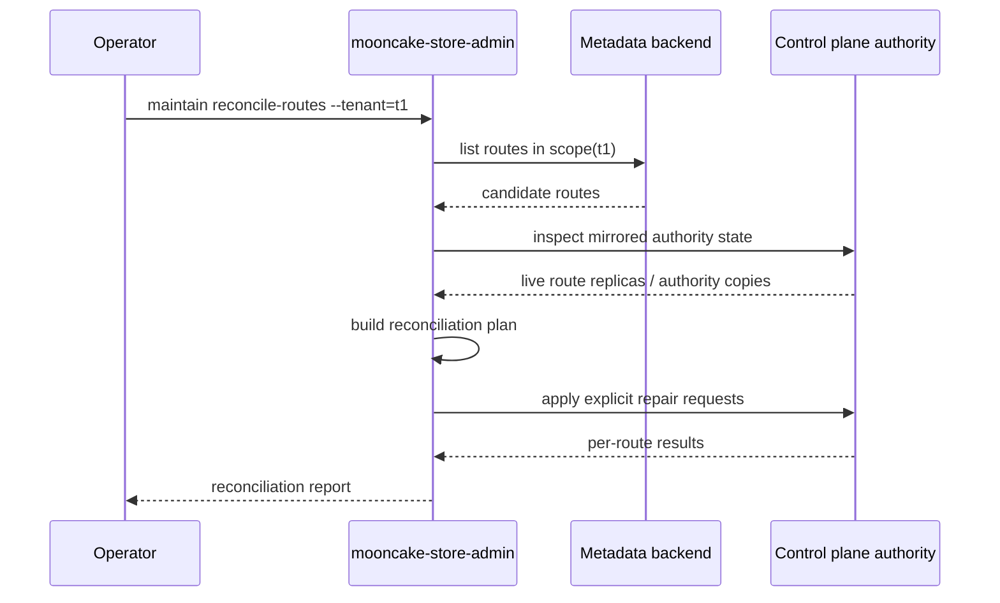

# Multi-Tenant Admin Control-Plane Design

## Background

Store-RS already enforces multi-tenant isolation inside the runtime and control plane:

- request identity carries `tenant / domain / object_set / qos_tier`
- route identity is namespace-aware
- quota checks happen on write paths
- route control RPCs already take a `namespace` parameter
- metadata traits already support scope-aware route listing

What is missing is a **management surface** for operators to configure and inspect tenant-level policy without pushing that responsibility into the request path.

This document proposes extending `mooncake-store-admin` into that management surface.

## Goal

Add a multi-tenant management plane to `mooncake-store-admin` so operators can:

- configure tenant-scoped control-plane policy
- inspect tenant-scoped state
- run explicit tenant-scoped maintenance and reconciliation commands

The admin CLI is **not** responsible for executing resource isolation in the request path. Runtime clients and storage/control-plane services remain the enforcement point.

## Non-Goals

This design does **not** move these responsibilities into admin:

- request-path tenant identification
- request-path quota enforcement
- route selection during reads/writes
- allocator reservation decisions during data writes
- background eviction / reclaim execution
- transport pacing / fairness enforcement

Admin only manages policy and triggers explicit maintenance actions.

---

## Current State

### Existing admin surface

`mooncake-store-admin` currently provides a single explicit metadata maintenance command:

- `cleanup-stale-segments`

Current entrypoint:

- `crates/mooncake-store-py/src/bin/mooncake-store-admin.rs`

### Existing runtime/control-plane capabilities relevant to multi-tenancy

#### Scope-aware object identity

The runtime already models object identity as:

- `tenant`
- `domain`
- `object_set`
- `qos_tier`
- `key`

Relevant code:

- `crates/mooncake-store-client/src/client/types.rs`
- `crates/mooncake-store-core/src/identity.rs`
- `crates/mooncake-store-core/src/identity_codec.rs`

#### Tenant-aware route/control interfaces

Control-plane route APIs already accept a `namespace` string.

Relevant code:

- `crates/mooncake-store-client/src/control_plane/mod.rs`
- `crates/mooncake-store-client/src/control_plane/client.rs`
- `crates/mooncake-store-client/src/control_plane/server.rs`

#### Scope-aware metadata helpers

Metadata traits already expose route listing by scope.

Relevant code:

- `crates/mooncake-store-core/src/traits.rs`

#### Runtime-side quota enforcement

Namespace quota exists today, but it is currently a runtime-side configuration object rather than a centralized policy store.

Relevant code:

- `crates/mooncake-store-client/src/client/types.rs`
- `crates/mooncake-store-client/src/client/mod.rs`

---

## Problem Statement

Today, multi-tenant control-plane behavior is partly implemented, but operators lack a first-class management surface for:

- writing tenant policies into a durable store
- reading back current tenant policy
- inspecting scope-specific route/control-plane state
- triggering explicit scope-specific reconciliation or cleanup

As a result, tenant configuration is fragmented across runtime builder options, deployment config, and ad-hoc inspection.

We need a dedicated management plane that:

1. is explicit and operator-driven like existing admin behavior
2. can persist tenant policy centrally
3. can query both metadata and control-plane state
4. does not become part of the request-path fast path

---

## Design Summary

Extend `mooncake-store-admin` with two new capability groups:

1. **Policy management**
   - get/set/delete tenant-scoped policy records in metadata
2. **Observation and explicit maintenance**
   - inspect tenant-scoped routes and placement state
   - run explicit tenant-scoped reconciliation/cleanup actions

The design adds a new **Tenant Policy Store** in metadata and a thin **Admin Service Layer** inside the CLI that decides whether each command should talk to:

- metadata directly
- control-plane RPC
- both

---

## Architecture



### Architectural principle

- **Admin writes policy and asks questions**
- **Runtime enforces policy and performs isolation work**

This keeps the fast path unchanged while still giving operators a real control surface.

---

## Proposed Components

## 1. Tenant Policy Store

Add a durable metadata-backed store for tenant-scoped control-plane policy.

### Stored entity

A new record, conceptually:

```text
TenantPolicy {
  scope: NamespaceScopeSelector,
  quota: {
    max_bytes,
    max_objects,
  },
  placement: {
    default_replica_count,
    prefer_local,
    preferred_storage_owners,
    preferred_segments,
  },
  qos: {
    default_qos_tier,
    execution_fairness,
    bandwidth_shaping,
  },
  routing: {
    route_scope_label,
    allowed_route_authorities,
  },
  metadata: {
    version,
    updated_at_ms,
    updated_by,
  }
}
```

### Scope model

Policy can target one of these levels:

1. tenant
2. tenant + domain
3. tenant + domain + object_set

This matches the existing namespace identity model and avoids inventing a second scope system.

### Storage backend abstraction

Add new trait methods under metadata, for example:

- `get_tenant_policy(scope)`
- `list_tenant_policies(prefix_scope)`
- `upsert_tenant_policy(policy, expected_version)`
- `delete_tenant_policy(scope, expected_version)`

The exact trait names can vary, but the important point is that this is a **metadata concern**, not a control-plane hot-path concern.

---

## 2. Admin Service Layer

Inside `mooncake-store-admin`, add an internal service layer that maps CLI commands to backends.

### Responsibilities

- parse scope flags into a namespace selector
- route commands to metadata vs control-plane RPC
- perform optimistic concurrency checks for policy updates
- assemble user-facing reports
- keep destructive operations explicit

### Why a service layer

The current admin binary directly constructs `RedisMetadataBackend` and calls one method. That is fine for one command, but it will not scale once some commands need metadata and others need authority/allocator inspection.

A service layer keeps the CLI parsing separate from operational logic.

---

## 3. Control-Plane Admin Adapters

For commands that need live control-plane state, admin should talk to a thin adapter over existing control-plane primitives.

### Candidate operations

#### Read-only inspection

- list routes in scope
- list routes by replica owner in scope
- summarize authority placement for a tenant
- summarize allocator-visible ownership or capacity by tenant

#### Explicit maintenance

- reconcile mirrored authorities for a scope
- remove stale route mirrors for a scope
- rebuild or repair scope summaries
- optional future drain orchestration hooks

### Important constraint

These are **operator-triggered commands**, not background controllers.

That matches the same philosophy as `cleanup-stale-segments`: avoid automatic guesses when the blast radius is tenant data/control metadata.

---

## CLI Design

## Top-level structure

```bash
mooncake-store-admin [global flags] <group> <subcommand> [flags]
```

### Global flags

- `--metadata-url`
- `--keyspace`
- `--trace-filter`
- optional future `--control-address` or `--authority-runtime`

## Command groups

### 1. Policy management

```bash
mooncake-store-admin policy get --tenant t1
mooncake-store-admin policy set --tenant t1 --max-bytes 1TiB --max-objects 10000000
mooncake-store-admin policy delete --tenant t1
mooncake-store-admin policy list --tenant t1
```

### 2. Scope inspection

```bash
mooncake-store-admin inspect routes --tenant t1
mooncake-store-admin inspect routes --tenant t1 --domain d1 --object-set s1
mooncake-store-admin inspect owners --tenant t1
mooncake-store-admin inspect quota-usage --tenant t1
```

### 3. Explicit maintenance

```bash
mooncake-store-admin maintain reconcile-routes --tenant t1
mooncake-store-admin maintain cleanup-stale-routes --tenant t1
mooncake-store-admin maintain cleanup-stale-segments --tenant t1
```

> Note: existing global stale-segment cleanup remains, but tenant-scoped variants can be layered on top when enough route/segment metadata is scope-identifiable.

---

## Proposed CLI Scope Flags

All multi-tenant admin commands should share a common selector surface:

- `--tenant <tenant>` (required for tenant-scoped commands)
- `--domain <domain>` (optional)
- `--object-set <object-set>` (optional)
- `--qos-tier <tier>` (optional for some policy commands)

Rules:

- `domain` requires `tenant`
- `object-set` requires `tenant` and usually `domain`
- commands must print the resolved canonical scope before executing

---

## Policy Model

## v1 policy fields

To keep the first version small, v1 should support only fields that already have strong runtime analogs:

### Quota

- `max_bytes`
- `max_objects`

### Placement defaults

- `default_replica_count`
- `prefer_local`
- `preferred_storage_owners`
- `preferred_segments`

### QoS defaults

- `default_qos_tier`
- `execution_fairness.max_remote_batch_items_per_tenant`
- `bandwidth_shaping.max_remote_batch_bytes`
- `bandwidth_shaping.max_remote_batch_burst_items`
- `bandwidth_shaping.max_inflight_bytes_per_batch`

### Explicitly excluded from v1

- per-request override policy templates
- transport backend selection
- lifecycle automation policies
- dynamic background remediation policies

---

## Runtime Consumption Model

The admin tool writes tenant policy. Runtime clients consume it.

### Proposed runtime behavior

1. client starts
2. client loads default cluster policy as today
3. client loads tenant policy snapshot for configured/default tenant scope
4. request path resolves the most specific matching policy
5. runtime applies policy during existing enforcement points

### Matching order

Most specific wins:

1. tenant + domain + object_set
2. tenant + domain
3. tenant
4. runtime default

This preserves backward compatibility and keeps config layering intuitive.

---

## Policy Update Flow



### Why CAS

We should use optimistic concurrency for policy writes so operators do not unknowingly overwrite each other.

---

## Scope Inspection Flow



This command should support both:

- metadata-only inspection
- metadata + live authority cross-check

The latter is slower but better for debugging divergence.

---

## Explicit Maintenance Flow



### Important invariant

The admin tool computes and submits an explicit repair action. It does **not** become a continuously running reconciliation controller.

---

## Metadata Model Proposal

## Key shape

This document does not lock the exact Redis key strings, but the logical structure should be:

- `tenant_policies/<tenant>`
- `tenant_policies/<tenant>/<domain>`
- `tenant_policies/<tenant>/<domain>/<object_set>`
- optional index for listing by tenant prefix

### Serialization

Use the same serde-based pattern used elsewhere in store metadata records.

### Versioning

Each policy record should contain:

- `version`
- `updated_at_ms`
- `updated_by`

`updated_by` should be an operator-supplied or host-derived identifier to simplify audits.

---

## Security / Safety Model

Admin is powerful and must stay explicit.

### Safety principles

1. all write operations are explicit subcommands
2. no background policy drift correction in v1
3. maintenance commands print scope and counts before applying
4. batch changes support `--dry-run` where practical
5. policy writes use CAS/version checks
6. scope parsing must reject ambiguous input

### Access model

This design does not introduce authz in the CLI itself. It assumes access control is enforced by:

- deployment environment
- metadata backend credentials
- network reachability to control-plane endpoints

If stronger control is required later, the right place is likely backend-side or service-side auth, not local CLI argument checks.

---

## Compatibility and Rollout

## Backward compatibility

- existing runtimes continue working with no tenant policy records present
- absence of tenant policy means runtime defaults apply
- existing `cleanup-stale-segments` command remains unchanged

## Rollout phases

### Phase 1: metadata-backed tenant policy

Add:

- metadata trait + Redis/etcd implementations
- admin `policy get/set/delete/list`
- no runtime consumption yet beyond optional debug reads

### Phase 2: runtime policy consumption

Add:

- runtime tenant policy snapshot loading
- scope matching precedence
- enforcement reuse through existing quota / placement / QoS hooks

### Phase 3: admin inspection

Add:

- `inspect routes`
- `inspect owners`
- `inspect quota-usage`
- metadata-only first, live authority cross-check second

### Phase 4: explicit maintenance

Add:

- `maintain reconcile-routes`
- scope-aware stale cleanup helpers
- `--dry-run`

---

## Open Questions

1. Should tenant policy live only in metadata, or also be cached in route authorities?
   - Recommendation: metadata is source of truth; runtime caches locally.

2. Do we want scope selectors without `domain` but with `object_set`?
   - Recommendation: no in v1; keep hierarchy strict.

3. Should `qos_tier` be part of policy scope or only a policy field?
   - Recommendation: policy field in v1, not part of scope identity.

4. Should admin inspect allocator state through direct metadata reads or control-plane RPC?
   - Recommendation: metadata first where possible; RPC only for live/derived state.

5. Do we need tenant policy inheritance visualization in CLI output?
   - Recommendation: yes, especially for `policy get --effective`.

---

## Recommended v1 Command Set

If we want the smallest useful first cut, build exactly these commands first:

```bash
mooncake-store-admin policy get --tenant <t>
mooncake-store-admin policy set --tenant <t> [policy flags]
mooncake-store-admin policy delete --tenant <t>
mooncake-store-admin policy list
mooncake-store-admin inspect routes --tenant <t>
```

Why this set first:

- it gives operators real value immediately
- it requires no request-path redesign
- it matches the existing explicit-operator philosophy
- it establishes the metadata model needed for later runtime consumption

---

## File-Level Impact

### New / changed likely areas

#### Admin CLI

- `crates/mooncake-store-py/src/bin/mooncake-store-admin.rs`
  - add grouped subcommands
  - add shared scope flag parsing
  - call new admin service layer

#### Metadata traits and implementations

- `crates/mooncake-store-core/src/traits.rs`
  - add tenant policy trait methods
- `crates/mooncake-metadata/src/redis_backend.rs`
  - store/load/list/delete tenant policy
- `crates/mooncake-metadata/src/etcd_backend.rs`
  - matching implementation
- `crates/mooncake-metadata/src/in_memory.rs`
  - test implementation

#### Core policy types

- likely new policy structs in `mooncake-store-core`
  - keeps admin, metadata, and runtime sharing one schema

#### Runtime consumption

- `crates/mooncake-store-client/src/client/*`
  - load effective tenant policy
  - feed existing quota / placement / QoS hooks

#### Optional later control-plane admin helpers

- `crates/mooncake-store-client/src/control_plane/*`
  - only if inspection/maintenance needs new RPCs

---

## Why This Design Fits Store-RS

This design matches existing repository principles:

- explicit operator action for cleanup and maintenance
- metadata as source of truth for durable policy
- runtime/control plane as the execution engine
- no new always-on coordinator for management tasks
- preserves current route-control and data-plane architecture

In short:

- `mooncake-store-admin` becomes the **management plane entrypoint**
- metadata becomes the **durable tenant policy plane**
- runtime/control plane remains the **enforcement plane**

That separation is the cleanest way to add tenant management without polluting the fast path.
