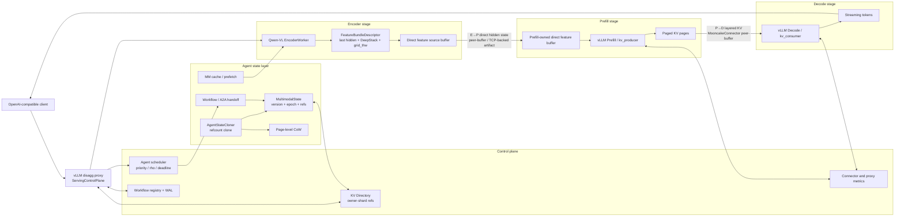

# Mooncake EPD Design

Mooncake EPD implements a state-centric Encoder-Prefill-Decode serving path for
multimodal LLMs and Agent workflows inside the Mooncake repository. The design
keeps correctness-critical metadata in the control plane and moves large
tensors through Mooncake Transfer Engine and vLLM data-plane paths.

## Architecture

## Mooncake integration boundaries

The feature is integrated across existing Mooncake ownership boundaries:

- `../mooncake-transfer-engine/` provides the registered-pointer and
  intra-node transport operations used by peer-buffer handoff.
- `../mooncake-wheel/` exposes Store service lifecycle behavior used by shared
  feature and workflow state.
- `../sitecustomize.py` installs opt-in vLLM hot-path adapters in generated EPD
  workers without changing normal Mooncake process startup.
- This directory owns EPD control-plane logic, vLLM connector extensions,
  launchers, benchmarks, and focused tests.

This layout keeps public interfaces backward compatible while allowing the
implementation to be reviewed as small Mooncake subsystem changes.

## 1. E→P hidden-state path

**Implemented objects**

- `EncoderWorker` in `core/epd_workers.py` runs the Qwen-VL vision tower and emits a `FeatureBundle`.
- `FeatureBundleDescriptor` in `core/state/feature_store.py` records `feature_id`, model/processor fingerprints, tensor shapes, dtypes, byte counts, optional checksums, DeepStack intermediates, and `grid_thw`.
- `DirectFeatureBufferRegistry` in `core/state/direct_feature_buffer.py` lets Prefill allocate destination tensors and export remote pointers.
- `FeatureBundlePeerBufferPlan` and `FeatureBundlePeerBufferResult` in `core/transfer/engine.py` describe direct peer-buffer publication.

**Data flow**

1. Encoder computes visual hidden states and DeepStack intermediate features.
2. Prefill allocates target tensors for the descriptor.
3. Encoder publishes tensor bytes to the Prefill-owned target through Mooncake direct peer-buffer metadata.
4. Prefill validates descriptor compatibility before injecting precomputed image embeddings and skipping the vision tower.

**Artifact-backed status**

The real Qwen3-VL EPD artifact records `vision_encoder_skip_observed=true`, `precomputed_hits=1`, and `hidden_cache_vision_compute_ms_avg=0.0` for the strict TCP direct run.

## 2. P→D layered KV path

**Implemented objects**

- `MooncakeConnector` extension: `core/control/vllm_mooncake_connector.py`.
- Transfer descriptors and counters: `core/control/vllm_transfer_primitives.py`.
- Config generation: `demo/vllm_integration.py`.

**Data flow**

1. Prefill runs as `kv_producer` and emits remote KV block metadata.
2. The proxy records concrete block IDs and starts a directory-managed handoff.
3. Decode runs as `kv_consumer` and receives grouped/layered KV blocks.
4. The control plane commits or rolls back the handoff based on downstream completion.

The measured Qwen3-VL run used Mooncake direct peer-buffer over TCP for P→D. The real multimodal EPD artifact records 46 peer-buffer batches, 301,989,888 P→D peer-buffer bytes, zero fallback batches, zero layered transfer failures, and zero layered receive failures.

## 3. Peer-buffer, SHM, TCP, and protocol boundaries

The code separates *policy* from *transport*:

- `TransferPolicy` in `core/transfer/policy.py` exposes `E2P`, `P2D`, `A2A`, and `Offload` channels with modes such as `stream`, `pull`, `push_batch`, and `shm`.
- `TransferEngine` in `core/transfer/engine.py` wraps Mooncake TCP/RDMA initialization, direct peer-buffer descriptors, memory registration, one-sided writes, and fallback accounting.
- Runner/config CLI options accept `tcp`, `shm`, `rdma`, and `nvlink_intra` protocol selections.

Public artifact boundary:

- **TCP direct peer-buffer** is validated by the real multimodal EPD artifact.
- **`nvlink_intra`** is validated by the same-host 2P2D scale-out artifact with explicit Prefill→Decode affinity.
- **SHM** is available as an intra-node deployment option for hosts that expose
  compatible shared-memory mappings.
- **RDMA** is available through the transport abstraction for deployments with
  a configured RDMA fabric.

Each deployment records the selected backend and direct/fallback counters, so
operators can qualify the fastest path supported by their topology.

## 4. MM cache and prefetch

Implemented pieces:

- `MMStore` in `core/state/mm_store.py` provides event-driven multimodal prefetch with deduplication, worker cache, shared feature store, bounded queue, and strict-mode behavior that disables inline fallback.
- `VLLMMMHiddenStateCache` in `core/state/vllm_mm_hidden_cache.py` stores vLLM multimodal hidden-state entries by stable keys.
- `FeatureHandleProvider` in `core/state/vllm_feature_handle_provider.py` resolves direct or store-backed FeatureHandles for vLLM multimodal kwargs.

Design intent:

- The cache is an optimization, not a correctness dependency.
- Strict measured runs require no hidden-cache errors, no full-miss batches for precomputed handles, and no transfer fallback.
- Prefetch backpressure is explicit: queue overflow can raise `MMStoreBackpressureError` when strict no-fallback is enabled.

## 5. Agent cloning and Copy-on-Write

Implemented pieces:

- `PagedKVManager` in `core/state/page_manager.py` owns physical KV pages, reference counts, and page-level CoW.
- `MooncakeKVStateStore` in `core/state/kv_state_store.py` stores immutable KV state descriptors and clones them by incrementing page references.
- `AgentStateCloner` in `agent/state_clone.py` exposes local tensor zero-copy and descriptor-backed clone APIs.

Semantics:

- Same-node clone is reference-only and copies zero KV tensor bytes.
- Cross-node clone requires a real materializer or explicitly allowed descriptor sharing; it does not pretend local pointers are valid on another node.
- Writes to shared pages must materialize through CoW before mutation.
- Release paths decrement references and report orphan-free cleanup in the clone artifact.

Artifact-backed result: 8 branches over 32 pages showed 10.03× mean clone speedup, `zero_copy_clone_bytes=0`, and `directory_orphans_after_release=0`.

## 6. Workflow and A2A handoff

Implemented pieces:

- `MultimodalState` in `core/state/state.py` records `workflow_id`, `version_id`, `parent_version_id`, `snapshot_epoch`, KV refs, feature hashes, reuse telemetry, status, and TTL.
- `WorkflowStateRegistry` in `core/state/workflow_registry.py` persists state records and transitions to JSONL WAL when configured.
- `ServingControlPlane` starts request records, prepares handoffs, commits/rolls back handoffs, and marks request release/completion.
- `Workflow` in `agent/coordination/workflow.py` models cross-step reuse over an Agent step chain.

A2A/serving handoff is two-phase shaped:

1. Prefill response must include concrete remote KV metadata.
2. Control plane records block IDs and calls `begin_handoff`.
3. Decode receives KV params containing `handoff_id`, source, target, and workflow metadata.
4. Completion commits the handoff; errors or rejected decode paths roll it back.

## 7. Scheduler and backpressure

Implemented pieces:

- `AgentScheduler` in `agent/coordination/scheduler.py` scores workers by capacity, queue depth, GPU utilization, latency, deadlines, worker pools, and affinity hints.
- `ServingControlPlane` registers Prefill/Decode workers, updates EWMA latency/service rate, tracks stage dispatches, backpressure, rejects, and deadline risk.
- `prefill_decode_affinity` maps Prefill workers to preferred Decode workers for topology-aware P→D locality.

Behavior:

- `THINKING` requests favor high-capacity Prefill workers.
- `INTERACTIVE` requests favor low-latency Decode workers.
- `HYBRID` requests balance both pools.
- Backpressure delay scales with rho between warn and critical thresholds; reject paths release admitted scheduler counters.
- Affinity is soft: overloaded targets can be bypassed, and fallbacks are counted.

The 2P2D scale-out artifact recorded `pd_transport_affinity_candidates=24`, `pd_transport_affinity_hits=24`, and `pd_transport_affinity_fallbacks=0`.

## 8. Error handling and resource lifecycle

Error and lifecycle mechanisms visible in code:

- **Strict no-fallback gates**: `core/strict_mode.py`, `check_real_epd_gate.py`, and `check_epd_artifact_gates.py` fail measured runs that silently fall back.
- **Explicit runtime activation**: workspace-scoped vLLM patches load only when `MOONCAKE_EPD_ENABLE_VLLM_PATCHES=1`, which confines monkeypatch behavior to generated EPD workers.
- **Direct-buffer authorization**: generated workers share a deployment token and direct FeatureBuffer routes require `X-Mooncake-EPD-Token`.
- **File-handle confinement**: strict serving accepts file-backed FeatureHandles only below explicitly configured store roots.
- **Descriptor validation**: `FeatureBundleDescriptor.validate_bundle` rejects model, processor, shape, dtype, grid, and checksum mismatches when required.
- **Handoff rollback**: `ServingControlPlane.rollback_handoff` rolls back uncommitted KV handoffs.
- **WAL recovery**: `JsonLineWAL`, `WorkflowStateRegistry`, and handoff/offload WAL paths preserve recovery data when configured.
- **Direct buffer release**: direct feature allocations carry ready/consumed/ref-count state and can be released after Prefill.
- **Offload lifecycle**: `OffloadManager` leases KV block IDs before copying to CPU/spill and updates workflow state through OFFLOADING/RESTORING transitions.
- **Metrics-based gates**: artifact gates check fallback counts, transfer failures, receive failures, direct backend counts, clone bytes, and release cleanup.

## 9. Compatibility

| Layer | Compatibility status |
| --- | --- |
| vLLM | Integrated through a repo-local `MooncakeConnector` module path and vLLM V1 `kv_transfer_config` roles. Artifact environment used vLLM 0.23.0. |
| Qwen3-VL | Real artifacts use Qwen3-VL-8B-Instruct. Encoder code handles Qwen3-VL DeepStack fields and `grid_thw`. |
| Mooncake | Uses Mooncake Python package and Transfer Engine APIs. Artifact environment used `mooncake_python=0.3.11.post1`. |
| Hardware | Artifact-backed host: 8 × RTX A6000. TCP direct peer-buffer and same-host `nvlink_intra` are validated; RDMA is not required for correctness. |
| Python | Artifact environment and full regression suite used Python 3.10.12. |

## 10. Tradeoffs

- **Scale-out vs equal-resource efficiency**: scale-out capacity and
  equal-resource efficiency are reported as separate experiment classes.
- **Median vs tail latency**: the scheduler and transfer pipeline expose both
  central and tail metrics so tuning does not optimize one latency point at
  the expense of another.
- **Strict correctness vs aggressive reuse**: cache and reuse paths are optimized but gated; unsupported reuse must fall back or fail strict validation rather than silently changing semantics.
- **Control-plane observability vs overhead**: workflow registry, KV directory, and connector metrics improve debuggability but add metadata work around hot-path serving.
- **Transport portability vs peak bandwidth**: TCP provides a portable default,
  while SHM/RDMA/NVLink selections enable topology-specific acceleration.
- **Descriptor sharing vs physical locality**: zero-copy Agent clone is cheap on the same node, while cross-node sharing requires explicit materialization or an allowed descriptor-share mode.

## Evidence sources

- `mooncake_epd/artifacts/2026-07-10/benchmark_summary.json`
- Raw artifact digests listed in `benchmark_summary.json`
- Implementation files cited inline above
- Full EPD regression: `371 passed, 1 skipped`
- Mooncake Store API regression: `72 passed`
