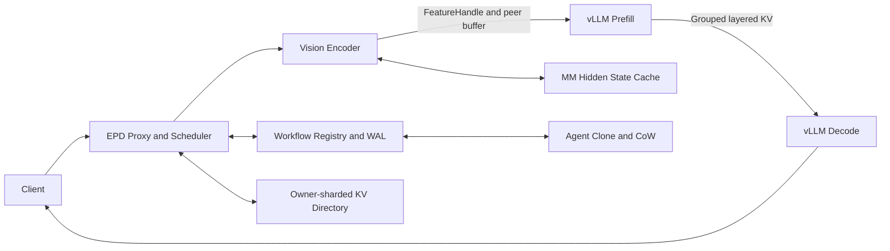

# Mooncake EPD: Multimodal and Agent-State Disaggregation

## Summary

This integration PR adds Encoder-Prefill-Decode disaggregation to Mooncake and
vLLM. It adds real Vision Hidden State transfer, layered paged-KV handoff,
multimodal hidden-state reuse, Agent KV state cloning, state-aware scheduling,
backpressure, and artifact-gated evaluation.

The implementation is organized along existing Mooncake ownership boundaries
so Transfer Engine, Store, vLLM integration, serving control plane, tests, and
benchmarks can be reviewed independently.

## Follow-up development since PR #2836 was opened

The comparison baseline for this section is the original PR head
`6f6514cc8bb8ff468c0da31ec9e587058177e849`. It covers all subsequent local
development, not only the latest prompt/Decode/scheduler optimization.

**Diff boundary:** `6f6514cc` is retained as the original-review baseline.
The follow-up implementation below is included by the subsequent PR branch
update, so reviewers can distinguish the initially submitted code from the
new reliability, state-management, and performance-remediation changes.

### 1. Mooncake integration and vLLM compatibility boundary

- Moved the standalone prototype into the Mooncake source tree as an optional
  `mooncake_epd` package with explicit runtime, test, benchmark, and vLLM
  integration boundaries.
- Added a pinned vLLM compatibility contract, startup probes, capability
  reporting, generated worker configuration, and an explicit adapter surface
  under `integrations/vllm/`.
- Scoped workspace patches behind `MOONCAKE_EPD_ENABLE_VLLM_PATCHES=1`;
  ordinary Mooncake and non-EPD vLLM startup keep their existing behavior.
- Added CPU and self-hosted hardware CI tiers. Missing GPU, RDMA, model, or
  second-host capability is recorded as a skip/unavailable result, never as a
  successful transport claim.

### 2. Encoder-to-Prefill Feature State

- Replaced ad-hoc hidden-state payloads with versioned
  `FeatureStateManifestV2` descriptors that bind model/processor identity,
  tensor shape/dtype/layout, checksums, source generation, destination,
  lifetime, and multimodal structure.
- Added Prefill-owned direct feature buffers with authenticated allocation,
  readiness, generation fences, reference counting, leases, bounded cache,
  transaction cleanup, and explicit release.
- Added `epd-direct://` resolution in vLLM and injection of precomputed
  `image_embeds`, DeepStack intermediates, and `grid_thw`, allowing Prefill to
  skip duplicate Vision Encoder execution.
- Coalesced same-session multi-image FeatureBundles into one Mooncake
  peer-buffer publish and one batched direct read into final hidden-state
  tensors. Different sessions remain isolated and source tensor ownership is
  retained until completion.
- Added cache prefetch, singleflight/coalescing, mutation isolation, and
  instrumentation for cold, warm, and mixed hidden-state reuse.

### 3. Prefill-to-Decode KV handoff and transport integrity

- Added `KVTransferManifestV2`, binding workflow/handoff IDs, source and
  destination generations, model/KV-layout checksums, block groups, transport,
  lease, expiry, and target worker identity.
- Enforced validation at both Decode and the Prefill producer immediately
  before export, preventing stale-generation, wrong-target, expired, tampered,
  or layout-incompatible transfers.
- Connected grouped/layered descriptors to the vLLM KV connector save/load
  lifecycle with prepare, commit, rollback, release, progress, cancellation,
  and restart cleanup.
- Added registered-pointer and peer-buffer batch transfer paths, bounded
  descriptor/byte groups, topology evidence, bandwidth/registration/lock-wait
  telemetry, and strict fallback/failure counters.
- Hardened Mooncake TCP and intra-node NVLink paths: registration ownership,
  CUDA stream/event ordering, partial transfer handling, and receive-side
  lifetime are no longer inferred from a successful API return alone.

### 4. Request-path and TTFT optimization

- Added a generation-fenced, bounded cache for deterministic strict
  `render_generate` results. Dynamic workflow IDs, FeatureHandles, and fresh KV
  handoff metadata are excluded from the cache value/key as appropriate;
  mutable external media bypasses reuse.
- Added strict prompt-only Prefill capability negotiation. The worker contract
  binds vLLM/model/tokenizer/chat-template/KV-schema identities and returns the
  exact prompt token IDs, multimodal placeholders, renderer hashes, and
  bounded structural metadata required by Decode.
- Added a versioned, fail-closed Decode token envelope. Decode consumes exact
  token IDs plus KV handoff metadata without receiving original
  image/video/audio bytes or reapplying the chat template.
- Reconstructs only integrity-bound structural inputs such as
  `image_grid_thw` locally on Decode. Prompt, placeholder, renderer, sampling,
  worker-generation, or manifest mismatches are rejected; measured strict mode
  does not silently fall back to legacy media dispatch.
- Added stage timing for request read/parse, JSON encode, Prefill render and
  generate, Decode dispatch/stream-open/first-content, connector transfer,
  lock wait, payload bytes, and per-stage queueing.

### 5. Agent State Cloning and Store-backed lifecycle

- Defined precise clone semantics: same-node physical zero-copy means retained
  immutable page references; cross-node fork is a metadata-only manifest clone
  followed by explicit materialization before a branch writes.
- Added versioned KV state manifests, Mooncake Store page objects, content
  checksums, reference accounting, Copy-on-Write, fencing tokens, and
  last-reference garbage collection.
- Added a persistent `AgentStateCatalog` with WAL recovery, CAS transitions,
  leases, state/page ownership, branch lineage, idempotent release, and orphan
  cleanup.
- Added `VLLMKVMaterializer` and a strict connector-commit boundary. Importing
  Store pages is not reported as Decode-consumable until the version-compatible
  vLLM connector callback acknowledges the target block envelope.
- Added register/fork/materialize/release control-plane APIs and lifecycle
  tests for duplicate operations, crash recovery, stale leases, and cleanup.

### 6. Agent PD scheduling and backpressure

- Added round-robin, least-loaded, static task-type, and agent-aware policies
  for thinking, interactive, and hybrid workloads.
- Split worker/request lifecycle into
  `queued → running → first_token → completed/failed/cancelled`, with
  idempotent failure, cancellation, timeout, and restart release.
- Added queued/running/active token gauges, Prefill service EWMA, Decode
  first-token/TPOT/output-rate telemetry, GPU/KV capacity, HTTP queue, transfer
  backlog/bandwidth, and native-engine lock wait.
- Telemetry now has freshness, TTL, known/unknown state, and confidence.
  Missing data is neutral/uncertain rather than incorrectly treated as zero
  load.
- Replaced the fixed affinity bonus with an explainable
  queue/service/transfer/control time-cost model, bounded topology benefit,
  congestion escape, re-entry hysteresis, and affinity/rebind statistics.

### 7. Hidden State Prefix Cache

- Added stable exact-cache keys covering input content, model and processor
  revisions, multimodal grids, dtype/layout, schema, and mutation boundaries.
- Added native L1 event synchronization, Store-backed L2 manifests,
  checksum/lease validation, prefetch, singleflight, and recovery.
- Kept partial multimodal prefix reuse experimental and disabled by default.
  It can only activate after a model-specific semantic oracle proves the
  reused `[A, B] → [A, C]` state is correct.

### 8. Omni worker-level pipeline

- Added independent-process AR → Generation → Diffusion stage envelopes with
  cancellation, timeout, lifecycle, and per-edge transport evidence.
- Implemented POSIX-SHM descriptor transfer and a real loopback TCP relay for
  CPU tensors; large tensor payloads are not mislabeled Python pickle copies.
- CUDA IPC/NVLink and RDMA remain capability-gated. Requesting unavailable
  RDMA returns `skipped`/`claim_supported=false` rather than relabeling
  TCP/SHM/CUDA copies as RDMA.
- Added Qwen2.5-Omni worker adapters and benchmark entrypoints while retaining
  an explicit boundary between synthetic transport validation and full
  model-semantic GPU validation.

### 9. Benchmark, dataset, and evidence framework

- Added reproducible Qwen-VL dataset generation with content hashes,
  workload manifests, model preflight, fixed sampling, cold/warm/mixed cache
  profiles, text controls, and W0-W5 request shapes.
- Added colocated vLLM, 1P1D/2P2D EPD, Agent clone, Hidden Cache, Omni, and
  scheduler runners with warmup/measured separation and resource topology.
- Added artifact schemas and fail-closed gates for exact/reference output,
  real service identity, prompt/KV generations, transport backend, checksums,
  fallback, cleanup, resource fairness, and performance-claim scope.
- Added request throughput, output-token throughput, TTFT p50/p95/p99, TPOT,
  latency, goodput, bytes, bandwidth, cache reuse, queueing, GPU/KV load,
  affinity, failures, and orphan-state metrics.
- Added `README.md`, `DESIGN.md`, `EVALUATION.md`, benchmark protocol,
  upstream vLLM split plan, CI workflows, and a compact public evidence
  snapshot with source digests.

### 10. Real-system findings and measured optimizations

- The public Qwen3-VL real EPD artifact validates Vision hidden-state reuse,
  layered KV transfer, strict no-fallback execution, and scale-out capacity.
  The recorded 4-GPU 2P2D versus 1-GPU colocated comparison is explicitly a
  capacity result, not an equal-resource efficiency claim.
- A strict single-host TCP refresh completed 4/4 measured requests with mean
  TTFT 255.93 ms, zero fallback/layered failures, and zero live direct-buffer
  references after release.
- The strict rendered-Prefill-cache ablation preserved exact outputs. At C1 it
  improved TTFT 276.90→210.19 ms (-24.1%) and completion throughput
  25.18→28.80 tok/s (+14.4%); at C4 it improved TTFT
  469.05→379.13 ms (-19.2%) and completion throughput
  71.77→78.97 tok/s (+10.0%).
- A real Qwen3-VL-8B-Instruct 1E1P1D W3/C1 token-envelope smoke on GPUs 5/1/3
  exactly matched shadow mode and all six measured colocated baseline outputs
  (SHA-256
  `c29089b34feccc282a94d04d4e6f1f6f350031cc8ecd79e436ea0d7a35f92c4c`).
  Active token dispatch reduced the Decode request 1,145,006→16,718 bytes
  (-98.54%), JSON encode 18.361→0.766 ms (-95.83%), Decode stream-open
  61.347→8.239 ms (-86.57%), TTFT 378.245→341.123 ms (-9.81%), and end-to-end
  latency 738.778→705.759 ms (-4.47%).

### Evidence boundary

- The latest token-envelope result is one warmup plus one measured request. It
  proves semantics and path activation, not statistically strong throughput.
- The current environment has no verified RDMA fabric or second host. TCP,
  SHM, PCIe P2P, and same-host NVLink results are not presented as RDMA or
  dual-node evidence.
- Qwen2.5-VL, Qwen2.5-Omni, and MiniCPM-o require complete repeated GPU
  campaigns; adapter/preflight or CPU transport coverage is not described as
  equivalent real-model performance evidence.
- C4/C16 repeats, 95% confidence intervals, cold/warm/mixed ablations,
  equal-resource colocated replicas, upstream Mooncake PD, and compatible
  SGLang comparisons remain publication gates.

## Motivation

Multimodal and Agent workloads expose reusable state that is not represented
by a conventional colocated request lifecycle:

- Vision Encoder output can be reused across requests and Agent steps.
- Prefill KV cache can be transferred to independently scaled Decode workers.
- Parallel Agent branches can share immutable KV pages and materialize only
  modified pages.
- Thinking, interactive, and hybrid tasks benefit from different Prefill,
  Decode, priority, and latency policies.

Mooncake provides the transport and shared-state foundation needed to make
these states first-class serving objects.

## Task coverage

### Foundation

- [x] vLLM EPD prototype: Vision Hidden State moves from Encoder to Prefill,
  then paged KV cache moves from Prefill to Decode.
- [x] Agent State Cloning: branches share page references with Copy-on-Write
  and explicit lifecycle management.
- [x] Qwen-VL end-to-end demo: real-model launchers, colocated baseline,
  scale-out runner, metrics, and strict direct-path gates.

### Advanced

- [x] Worker-level transfer primitives: registered pointers, peer buffers,
  layer grouping, topology affinity, and transport telemetry.
- [x] Agent PD scheduling: task-type pools, deadline/rho-aware admission,
  backpressure, and affinity-aware dispatch.
- [x] Hidden State Prefix Caching: stable keys, event prefetch, FeatureHandles,
  vLLM hidden-state injection, and Vision Encoder skip.
- [x] Upstream contribution package: public design, evaluation, tests, and a
  proposed reviewable PR split.

## Architecture



See [`DESIGN.md`](DESIGN.md) for interfaces,
lifecycles, data flow, and tradeoffs.

## Main changes

### Mooncake Transfer Engine

- Add registered-pointer batch transfer for persistent KV regions.
- Preserve registration ownership when memory is already registered.
- Improve intra-node CUDA stream dependency handling.
- Expose prepare, write, registration, and bandwidth telemetry.

### Encoder-to-Prefill FeatureHandle

- Add Prefill-owned direct feature buffers with readiness, reference counting,
  bounded persistent cache, and explicit release.
- Add validated FeatureBundle descriptors for Qwen-VL hidden state, DeepStack
  intermediates, and `grid_thw`.
- Add vLLM-side `epd-direct://` materialization and precomputed
  `image_embeds` injection.
- Add event-driven cache prefetch and concurrent request coalescing.

### Prefill-to-Decode layered KV

- Add generation-fenced `KVTransferManifestV2` validation at both producer and
  consumer boundaries.
- Connect grouped layer descriptors to the vLLM producer/consumer save/load
  path.
- Add direct peer-buffer transfer, topology affinity, receive progress, and
  strict transfer counters.
- Preserve handoff identity across prepare, commit, rollback, and release.

### vLLM request path

- Add bounded strict-render reuse with dynamic handoff metadata re-injection.
- Add prompt-only Prefill capability negotiation and exact prompt/MM envelope.
- Add media-free Decode token dispatch with strict identity, placeholder,
  sampling, and KV-generation validation.
- Preserve OpenAI streaming chunks, usage, finish reasons, cancellation, and
  timeout behavior through the compact internal path.

### Agent state and serving control plane

- Add Store-backed page-reference clone, page-level Copy-on-Write, persistent
  catalog/WAL, materialization, connector acknowledgement, and garbage
  collection.
- Add owner-sharded directory state and workflow registry/WAL transitions.
- Add thinking, interactive, and hybrid task routing.
- Add explicit queued/running/first-token lifecycle, telemetry confidence,
  queue/service/transfer cost, deadline, rho, backpressure, and rejection
  metrics.

### Hidden cache and Omni pipeline

- Add exact L1/L2 hidden-state reuse with stable content keys, event
  synchronization, Store manifests, leases, singleflight, and recovery.
- Keep partial prefix reuse capability-gated behind a semantic oracle.
- Add independent-process Omni stage envelopes with real POSIX-SHM descriptor
  and TCP relay transports, cancellation, cleanup, and truthful unsupported
  RDMA/CUDA capability reporting.

### Benchmarks and documentation

- Add real Qwen-VL EPD, colocated baseline, 2P2D scale-out, Agent clone, and
  multi-model evaluation-matrix runners.
- Add fail-closed gates for real services, direct transfer, cache reuse,
  prompt/KV identity, resource scope, output evidence, and lifecycle cleanup.
- Add public `README.md`, `DESIGN.md`, `EVALUATION.md`, submission material,
  and a compact evidence snapshot.

## Compatibility and security

- Existing Mooncake and non-EPD vLLM startup remains unchanged.
- Workspace-scoped vLLM patches are enabled only when generated EPD workers set
  `MOONCAKE_EPD_ENABLE_VLLM_PATCHES=1`.
- Direct FeatureBuffer routes require a generated deployment token through
  `X-Mooncake-EPD-Token`.
- Strict serving confines file-backed FeatureHandles to configured store roots.
- Public interfaces retain existing defaults; EPD behavior is activated by
  explicit launcher and connector configuration.
- TCP is covered by public measurements. A separately staged engine has a
  strict same-host text-only P→D `nvlink_intra` artifact with native worker-log
  evidence; it is not yet an installed-release, full multimodal E→P→D, or
  dual-node result. SHM and RDMA remain capability-gated transport selections;
  the current environment has no verified RDMA fabric or second-node evidence.

## Validation

From the Mooncake repository root:

```bash
export PYTHONPATH=$PWD

PYTEST_DISABLE_PLUGIN_AUTOLOAD=1 \
MOONCAKE_EPD_ENABLE_VLLM_PATCHES=0 \
python -m pytest -q mooncake_epd/tests

PYTHONPATH=$PWD/mooncake-wheel \
PYTEST_DISABLE_PLUGIN_AUTOLOAD=1 \
python -m pytest -q mooncake-wheel/tests/test_mooncake_store_service_api.py
```

| Verification | Result |
| --- | ---: |
| EPD integration checkpoint (2026-07-13) | 439 passed, 19 skipped |
| Mooncake Store service API | 72 passed |
| Runtime/security boundary subset | 52 passed |
| Compile, JSON, whitespace checks | Pass |
| Strict real-EPD artifact gate | Pass |
| Public-demo facade / online-runner focused regression (2026-07-14) | 73 passed |
| Rendered-Prefill-cache semantics/config/runner regression (2026-07-15) | 91 passed |
| Latest system-Python full EPD collection | 563 passed, 21 skipped, 1 environment failure: vLLM unavailable |
| Prompt/token envelope and Proxy regression | 34 passed |
| Scheduler/control-plane/Proxy regression | 53 passed |
| Pinned vLLM prompt-only/token-adapter regression | 8 passed |

The single latest full-collection failure is not counted as a code pass: the
system interpreter did not contain vLLM. The affected vLLM-specific tests were
rerun with the pinned vLLM environment and passed. GPU/RDMA/model skips remain
capability gates, not successful hardware evidence.

## Benchmark summary

### Real multimodal EPD

Qwen3-VL-8B-Instruct, 1 Encoder + 1 Prefill + 2 Decode GPUs, 8 warmups,
16 measured requests, concurrency 8:

| Metric | Result |
| --- | ---: |
| Request throughput | 8.143 RPS |
| Output throughput | 232.08 tok/s |
| Mean / P95 TTFT | 288.82 / 344.01 ms |
| HTTP and EPD route success | 16/16 |
| P-to-D peer-buffer traffic | 46 batches / 301,989,888 bytes |
| Fallback / send / receive failures | 0 / 0 / 0 |

### Current strict TCP refresh (not a comparison claim)

Qwen3-VL-8B-Instruct, one Encoder + one Prefill + one Decode GPU on one host,
TCP direct peer-buffer, `render_generate`, two warmups, four measured
requests, concurrency one, and a 16-token output budget:

| Metric | Result |
| --- | ---: |
| HTTP success | 4 / 4 |
| Mean / P95 TTFT | 255.93 / 257.65 ms |
| Request / completion throughput | 1.628 RPS / 26.04 tok/s |
| Measured P→D peer-buffer batches / bytes | 8 / 9,437,184 |
| Transfer fallback / layered send / receive failures | 0 / 0 / 0 |
| Direct-feature cache hits / live refs after release | 4 / 4 / 0 |

This result updates implementation confidence and the performance diagnosis,
not the archived benchmark claim. It is intentionally excluded from the
committed public evidence snapshot pending repeated runs, an appropriate
baseline, and artifact review.

### Strict rendered-Prefill-cache ablation (local, not a system comparison)

Qwen3-VL-8B-Instruct, one Encoder + one Prefill + one Decode GPU, same-host
TCP direct peer-buffer, strict `render_generate`, two warmups, six measured
requests per arm, concurrency one, and 16 output tokens:

| Metric | Cache off | Cache on | Change |
| --- | ---: | ---: | ---: |
| Mean TTFT | 276.90 ms | 210.19 ms | -24.1% |
| Mean latency | 635.12 ms | 555.19 ms | -12.6% |
| Request throughput | 1.574 RPS | 1.800 RPS | +14.4% |
| Completion throughput | 25.18 tok/s | 28.80 tok/s | +14.4% |
| Strict Prefill render | 87.33 ms | 1.69 ms | -98.1% |
| Cache hits / exact output match | 0 / 6 / 6 | 6 / 6 / 6 | pass |
| Fallback / layered receive failures | 0 / 0 | 0 / 0 | pass |

This validates a bounded, generation-fenced EPD control-path optimization;
it is not an EPD-versus-colocated/strong-system claim, equal-resource
comparison, multi-node result, or RDMA result. Raw artifacts remain local
until repeat and artifact-review gates are complete.

At concurrency four (16 measured requests per arm), the same cache-on control
kept exact 16/16 output equality and zero fallback/receive failures while
improving mean TTFT 469.05→379.13 ms (-19.2%), RPS 4.485→4.935 (+10.0%), and
completion throughput 71.77→78.97 tok/s (+10.0%).

### Prompt-only Prefill plus Decode token envelope

Qwen3-VL-8B-Instruct, one Encoder + one Prefill + one Decode GPU on the
validated GPU5/GPU1/GPU3 topology, W3, concurrency one, one warmup and one
measured request:

| Metric | Shadow / legacy Decode | Active token envelope | Change |
| --- | ---: | ---: | ---: |
| Decode request bytes | 1,145,006 | 16,718 | -98.54% |
| Decode JSON encode | 18.361 ms | 0.766 ms | -95.83% |
| Decode stream open | 61.347 ms | 8.239 ms | -86.57% |
| TTFT | 378.245 ms | 341.123 ms | -9.81% |
| End-to-end latency | 738.778 ms | 705.759 ms | -4.47% |

The token-envelope output exactly matched shadow mode and all six measured
responses in the existing colocated baseline. This is a correctness/path
smoke, not a throughput claim; the sample count is intentionally visible
rather than hidden behind the percentage.

### Scale-out capacity

The recorded comparison uses four GPUs for 2P2D EPD and one GPU for the
colocated baseline. It demonstrates scale-out capacity, not equal-resource
efficiency.

| Metric | 1-GPU colocated | 4-GPU 2P2D EPD | Change |
| --- | ---: | ---: | ---: |
| Request throughput | 2.580 RPS | 3.685 RPS | +42.8% |
| Output throughput | 74.83 tok/s | 108.24 tok/s | +44.6% |
| Mean latency | 2917.69 ms | 2143.09 ms | -26.5% |
| Mean TTFT | 1271.71 ms | 1413.93 ms | +11.2% |
| P95 TTFT | 2006.39 ms | 1481.26 ms | -26.2% |

### Agent State Cloning

- 10.03x mean clone speedup over deep copy.
- 0 bytes copied for page-reference branch creation versus 67,108,864 bytes
  for deep copy.
- 0 retained states and 0 orphan directory blocks after release.

Full methodology and interpretation are in
[`EVALUATION.md`](EVALUATION.md). The compact evidence
record is
[`artifacts/2026-07-10/benchmark_summary.json`](artifacts/2026-07-10/benchmark_summary.json).

## Proposed review plan

The cumulative worktree is too broad for one upstream review. The intended
split preserves subsystem ownership and dependency order:

1. **Packaging, CI, and explicit vLLM compatibility**
   - Optional package boundary, pinned compatibility probe, adapter/launcher,
     scoped patches, and CPU/hardware CI.
2. **Transfer Engine and transport correctness**
   - Registered-pointer batches, TCP/NVLink synchronization and lifetime,
     registration ownership, lock-wait/bandwidth telemetry, and C++ tests.
3. **Encoder-to-Prefill Feature State**
   - `FeatureStateManifestV2`, authenticated direct buffers, multi-image
     batching, hidden-state injection, leases, cache, and cleanup.
4. **Prefill-to-Decode KV handoff**
   - `KVTransferManifestV2`, producer/consumer generation fences, grouped
     connector lifecycle, prompt-only Prefill, and Decode token envelope.
5. **Agent State and Mooncake Store**
   - KV pages, manifest clone/CoW, persistent catalog/WAL, materializer,
     connector commit, lifecycle APIs, and GC.
6. **Scheduling and serving control plane**
   - Lifecycle state machine, telemetry confidence, task routing, backpressure,
     topology/congestion cost, directory, workflow, and handoff.
7. **Hidden cache and Omni worker runtime**
   - Exact L1/L2 cache, disabled-by-default partial reuse, SHM/TCP stage
     transports, capability truthfulness, and model adapters.
8. **Benchmarks, artifact gates, and documentation**
   - Dataset manifests, colocated/EPD runners, ablations, claim gates, public
     evidence, design, evaluation, and remaining hardware matrix.

## Checklist

- [x] Integrated into the Mooncake repository layout.
- [x] Preserves default behavior unless EPD is explicitly enabled.
- [x] Includes error handling, authorization, lifecycle, and cleanup logic.
- [x] Includes unit, integration, Store API, and real-serving validation.
- [x] Includes baseline and optimized results with resource scope.
- [x] Includes public run instructions using repository-relative paths.
- [x] Includes a reviewable upstream PR split.
- [x] Records the current strict TCP refresh and its non-RDMA/non-dual-node
  evidence boundary separately from the original PR-head evidence.
- [x] Describes all cumulative development after original PR head `6f6514cc`,
  including Store-backed Agent state, Omni/Hidden Cache, reliability work, and
  B/C/D performance remediation.
- [ ] Complete repeated Qwen2.5-VL/Qwen2.5-Omni/MiniCPM-o GPU campaigns.
- [ ] Complete equal-resource and strong-system comparisons with 95% confidence
  intervals.
- [ ] Complete verified dual-node and RDMA evidence when the required hardware
  is available.
