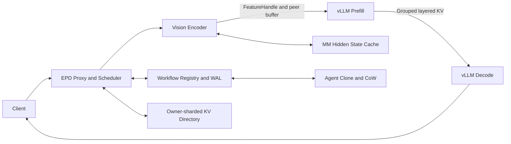

# Mooncake EPD: Multimodal and Agent-State Disaggregation

## Summary

This integration PR adds Encoder-Prefill-Decode disaggregation to Mooncake
and vLLM. It adds real Vision Hidden State transfer, layered paged-KV handoff,
multimodal hidden-state reuse, Agent KV state cloning, state-aware scheduling,
backpressure, and artifact-gated evaluation.

The implementation is intentionally submitted as one cohesive PR because the
data-plane fast paths, ownership protocol, vLLM hooks, scheduler, and strict
evaluation gates share end-to-end contracts. The commits and sections follow
existing Mooncake ownership boundaries so each subsystem can still be reviewed
independently within the same PR.

## Motivation

Multimodal and Agent workloads expose reusable state that is not represented
by a conventional colocated request lifecycle:

- Vision Encoder output can be reused across requests and Agent steps.
- Prefill KV cache can be transferred to independently scaled Decode workers.
- Parallel Agent branches can share immutable KV pages and materialize only
  modified pages.
- Thinking, interactive, and hybrid tasks benefit from different Prefill,
  Decode, priority, and latency policies.

Mooncake provides the transport and shared-state foundation needed to make
these states first-class serving objects.

## Task coverage

### Foundation

- [x] vLLM EPD prototype: Vision Hidden State moves from Encoder to Prefill,
  then paged KV cache moves from Prefill to Decode.
- [x] Agent State Cloning: branches share page references with Copy-on-Write
  and explicit lifecycle management.
- [x] Qwen-VL end-to-end demo: real-model launchers, colocated baseline,
  scale-out runner, metrics, and strict direct-path gates.

### Advanced

- [x] Worker-level transfer primitives: registered pointers, peer buffers,
  layer grouping, topology affinity, and transport telemetry.
- [x] Agent PD scheduling: task-type pools, deadline/rho-aware admission,
  backpressure, and affinity-aware dispatch.
- [x] Hidden State Prefix Caching: stable keys, event prefetch, FeatureHandles,
  vLLM hidden-state injection, and Vision Encoder skip.
- [x] Upstream contribution package: public design, evaluation, tests, and a
  subsystem-oriented review structure within one integration PR.

## Architecture



See [`DESIGN.md`](DESIGN.md) for interfaces,
lifecycles, data flow, and tradeoffs.

## Main changes

### Mooncake Transfer Engine

- Add registered-pointer batch transfer for persistent KV regions.
- Preserve registration ownership when memory is already registered.
- Improve intra-node CUDA stream dependency handling.
- Expose prepare, write, registration, and bandwidth telemetry.

### Encoder-to-Prefill FeatureHandle

- Add Prefill-owned direct feature buffers with readiness, reference counting,
  bounded persistent cache, and explicit release.
- Add validated FeatureBundle descriptors for Qwen-VL hidden state, DeepStack
  intermediates, and `grid_thw`.
- Add vLLM-side `epd-direct://` materialization and precomputed
  `image_embeds` injection.
- Add event-driven cache prefetch and concurrent request coalescing.

### Prefill-to-Decode layered KV

- Connect grouped layer descriptors to the vLLM producer/consumer save/load
  path.
- Add direct peer-buffer transfer, topology affinity, receive progress, and
  strict transfer counters.
- Preserve handoff identity across prepare, commit, rollback, and release.

### Agent state and scheduling

- Add page-reference clone and page-level Copy-on-Write semantics.
- Add owner-sharded directory state and workflow registry/WAL transitions.
- Add thinking, interactive, and hybrid task routing.
- Add queue, service-rate, deadline, rho, backpressure, and rejection metrics.

### Benchmarks and documentation

- Add real Qwen-VL EPD, colocated baseline, 2P2D scale-out, Agent clone, and
  evaluation-matrix runners.
- Add fail-closed gates for real services, direct transfer, cache reuse,
  resource scope, output evidence, and lifecycle cleanup.
- Add public `README.md`, `DESIGN.md`, `EVALUATION.md`, submission material,
  and a compact evidence snapshot.

## Compatibility and security

- Existing Mooncake and non-EPD vLLM startup remains unchanged.
- Workspace-scoped vLLM patches are enabled only when generated EPD workers set
  `MOONCAKE_EPD_ENABLE_VLLM_PATCHES=1`.
- Direct FeatureBuffer routes require a generated deployment token through
  `X-Mooncake-EPD-Token`.
- Strict serving confines file-backed FeatureHandles to configured store roots.
- Public interfaces retain existing defaults; EPD behavior is activated by
  explicit launcher and connector configuration.
- TCP and same-host `nvlink_intra` are covered by public measurements. SHM and
  RDMA remain selectable through the transport policy for compatible hosts.

## Validation

From the Mooncake repository root:

```bash
export PYTHONPATH=$PWD

PYTEST_DISABLE_PLUGIN_AUTOLOAD=1 \
MOONCAKE_EPD_ENABLE_VLLM_PATCHES=0 \
python -m pytest -q mooncake_epd/tests

PYTHONPATH=$PWD/mooncake-wheel \
PYTEST_DISABLE_PLUGIN_AUTOLOAD=1 \
python -m pytest -q mooncake-wheel/tests/test_mooncake_store_service_api.py
```

| Verification | Result |
| --- | ---: |
| EPD unit and integration suite | 371 passed, 1 skipped |
| Mooncake Store service API | 72 passed |
| Runtime/security boundary subset | 52 passed |
| Compile, JSON, whitespace checks | Pass |
| Strict real-EPD artifact gate | Pass |

## Benchmark summary

### Real multimodal EPD

Qwen3-VL-8B-Instruct, 1 Encoder + 1 Prefill + 2 Decode GPUs, 8 warmups,
16 measured requests, concurrency 8:

| Metric | Result |
| --- | ---: |
| Request throughput | 8.143 RPS |
| Output throughput | 232.08 tok/s |
| Mean / P95 TTFT | 288.82 / 344.01 ms |
| HTTP and EPD route success | 16/16 |
| P-to-D peer-buffer traffic | 46 batches / 301,989,888 bytes |
| Fallback / send / receive failures | 0 / 0 / 0 |

### Scale-out capacity

The recorded comparison uses four GPUs for 2P2D EPD and one GPU for the
colocated baseline. It demonstrates scale-out capacity, not equal-resource
efficiency.

| Metric | 1-GPU colocated | 4-GPU 2P2D EPD | Change |
| --- | ---: | ---: | ---: |
| Request throughput | 2.580 RPS | 3.685 RPS | +42.8% |
| Output throughput | 74.83 tok/s | 108.24 tok/s | +44.6% |
| Mean latency | 2917.69 ms | 2143.09 ms | -26.5% |
| Mean TTFT | 1271.71 ms | 1413.93 ms | +11.2% |
| P95 TTFT | 2006.39 ms | 1481.26 ms | -26.2% |

### Agent State Cloning

- 10.03x mean clone speedup over deep copy.
- 0 bytes copied for page-reference branch creation versus 67,108,864 bytes
  for deep copy.
- 0 retained states and 0 orphan directory blocks after release.

Full methodology and interpretation are in
[`EVALUATION.md`](EVALUATION.md). The compact evidence
record is
[`artifacts/2026-07-10/benchmark_summary.json`](artifacts/2026-07-10/benchmark_summary.json).

## Review guide

This is the primary integration PR. Review can proceed by subsystem without
splitting the end-to-end contract:

1. **Transfer Engine / intra-node transport**
   - Registered-pointer fast path, synchronization, registration ownership,
     and telemetry.
2. **Encoder-to-Prefill FeatureHandle**
   - Direct feature buffers, descriptors, hidden-state injection, and cache.
3. **Serving and Agent control plane**
   - Layered KV connector, scheduler, workflow state, directory, handoff, and
     backpressure.
4. **Benchmarks and documentation**
   - Dataset builder, runners, gates, tests, public reports, and evidence.

Small follow-up PRs may extract narrowly scoped transport or framework adapters
after the integrated interfaces are agreed, without changing the public EPD
state and lifecycle semantics established here.

## Checklist

- [x] Integrated into the Mooncake repository layout.
- [x] Preserves default behavior unless EPD is explicitly enabled.
- [x] Includes error handling, authorization, lifecycle, and cleanup logic.
- [x] Includes unit, integration, Store API, and real-serving validation.
- [x] Includes baseline and optimized results with resource scope.
- [x] Includes public run instructions using repository-relative paths.
- [x] Includes one cohesive integration PR with subsystem-oriented commits.
