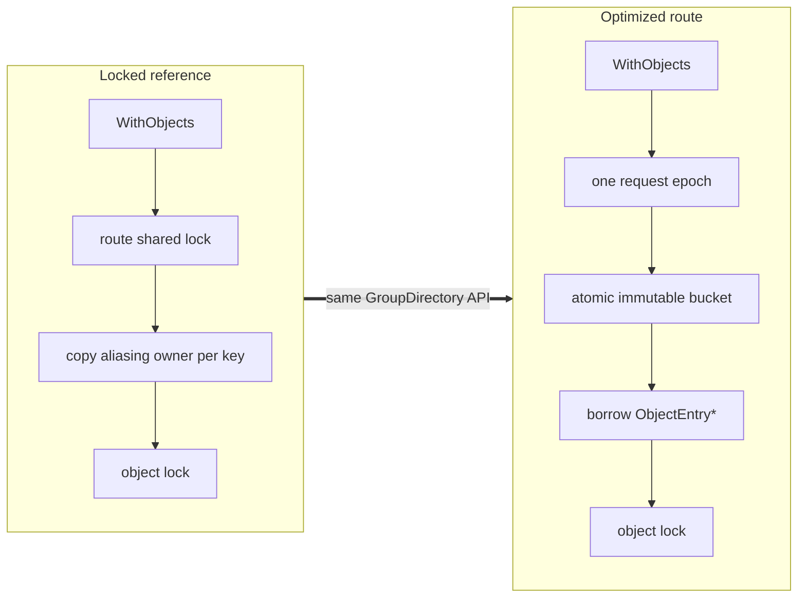
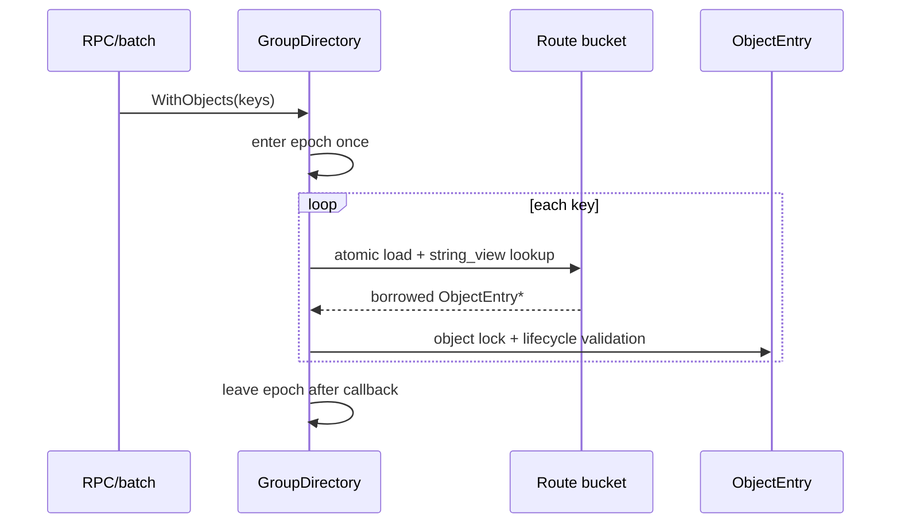

# [RFC][Store]: Group Directory Object-Route Read-Path Optimization

## Summary

This RFC replaces only `GroupDirectory`'s private object-route implementation.
It preserves the ownership, group, object lock, quota, HA, offload, and eviction
semantics defined by
[Tenant-First Object-Level Metadata Locking](rfc-object-level-metadata-locking.md).



For the representative 32-key batch read/write 1:1 workload, the optimized path
measured 59.71 M key ops/s versus 42.73 for main's shard layout and 35.11 for
the locked-owning reference.

```text
M key ops/s

Main shard       42.73  █████████████████
Locked owning    35.11  ██████████████
Epoch bucket     59.71  ████████████████████████
```

## Scope

| Goals | Non-goals |
| --- | --- |
| Remove route locks from synchronous reads | Changing `Tenant -> GroupDirectory -> Object` ownership |
| Avoid per-key `shared_ptr` copies | Lock-free `ObjectState` mutation |
| Enter one epoch per point request or batch | Changing group, eviction, quota, HA, or offload semantics |
| Publish one small immutable route bucket | Making group catalogs/member sets lock-free |
| Preserve `WithObject(s)`, `Pin`, `VisitHandles`, and matched unlink | Dynamic route resizing in the first version |

Tenant-registry COW remains independent and uses its own epoch domain.

## Proposed Route

```cpp
class ObjectRouteIndex {
    // Singleton: normal ObjectEntry owner.
    // Explicit member: aliasing owner whose control block owns GroupEntry.
    using EntryOwner = std::shared_ptr<ObjectEntry>;
    using BucketSnapshot = OwningStringMap<EntryOwner>;

    struct Bucket {
        std::atomic<const BucketSnapshot*> current;
    };

  public:
    template <class Fn> auto WithObject(std::string_view, Fn&&) const;
    template <class Fn> auto WithObjects(KeySpan, Fn&&) const;
    ObjectHandle Pin(std::string_view) const;
    void VisitHandles(const HandleVisitor&) const;
    void Publish(std::string key, EntryOwner);
    bool EraseIfMatch(std::string_view, ObjectId, const ObjectEntry*);

  private:
    EpochDomain& epochs_;
    std::array<Bucket, kObjectBucketCount> buckets_;
    std::array<std::mutex, kObjectWriterStripeCount> writers_;
};
```

Each immutable bucket owns its lookup strings and entry owners. For an explicit
member, `.get()` points directly to `ObjectEntry` while the control block keeps
the whole `GroupEntry` alive.

### Read path



The callback-scoped access object, state references, raw pointers, and epoch
guard cannot escape. `Pin` copies a strong aliasing handle only for work that
must outlive the callback.

### Route publication

Create or matched unlink:

1. lock the writer stripe for the object key;
2. load and copy only its route bucket;
3. apply `Publish` or `EraseIfMatch(ObjectId, pointer)`;
4. publish the new snapshot with release semantics;
5. retire the old snapshot after an epoch grace period.

Group creation, membership, lifecycle, and teardown remain under the core
`GroupDirectory` protocol. Empty buckets share one immutable snapshot. Bucket
and writer-stripe counts are fixed in the first version and selected from
memory and membership-churn measurements.

### Eviction integration

Eviction keeps strong handles and the core group-aware commit protocol:

| Operation | Locked reference | Epoch bucket |
| --- | --- | --- |
| `WithObject(s)` | Copy owner under route lock | Borrow under one request epoch |
| `Pin` | Copy owner under route lock | Copy owner from protected snapshot |
| `VisitHandles` | Copy bounded chunks under route lock | Copy emitted handles under short per-chunk epochs |
| Publish/unlink | Route exclusive lock | Copy/publish one bucket, retire old bucket |

A census never holds one epoch across the entire object population. Ranking,
group deduplication, group/object lock order, HA, and cleanup remain outside the
route implementation.

## Performance Evidence

Measurements are pinned medians on AMD EPYC 7742/GCC 11.4 with 16 threads and
64-byte keys. Microbenchmarks exclude tenant lookup, RPC, quota, external work,
real reclamation, and eviction execution.

### Flat group route versus two-level lookup

The optimized two-level baseline performs object-key -> group followed by a
second string-key member lookup. The flat route returns an aliasing object
handle in one hash lookup.

| Workload | Two-level | Flat alias | Change |
| --- | ---: | ---: | ---: |
| Point reads, group size 32 | 21.84 Mops/s | **29.17 Mops/s** | +33.6% |
| Same-group batch R/W 1:1, 32 keys | 43.39 | **50.34** | +16.0% |
| Cross-group batch R/W 1:1, 32 keys | 25.83 | **39.85** | +54.3% |

Same-group results remained 16-27% faster for group sizes 8-128. For group size
32, flat p50/p99 batch latency was 7.46/11.05 us versus 9.69/13.96 us. At one
million objects, flat RSS was 571.1 MB versus 685.3 MB, a 16.7% reduction,
primarily because group membership uses numeric `ObjectId`s instead of a second
owning string-key map.

These measurements use the locked flat route and validate its shape and
aliasing lifetime cost. They do not validate publication, teardown, or eviction.

### Epoch route versus current and locked reference

`shard` models main's 1,024 shard locks, `owning` models the locked reference,
and `epoch_cow` models the optimized read path with prepublished snapshots.

| Workload | Main `shard` | Locked `owning` | `epoch_cow` | Epoch vs main |
| --- | ---: | ---: | ---: | ---: |
| Point reads | **55.10** | 32.81 | 44.85 | -18.6% |
| Batch R/W 1:1, 32 keys | 42.73 | 35.11 | **59.71** | +39.7% |
| Forced shard collision, batch R/W 1:1 | 2.12 | 33.66 | **55.58** | 26.3x |

For the 32-key batch workload, epoch read/write p99 was 8.58/9.87 us versus
14.01/18.67 us on main. Pure point reads remain slower than main, so the design
is gated on the production-weighted batch mix rather than claimed as a universal
QPS improvement.

## Costs and Gates

The route retains two safe object-key owners: the canonical entry key and the
lookup key. Additional costs are bucket pointers, writer stripes, copied bucket
nodes during membership changes, retired snapshots, and one epoch participant
per registered execution context.

An old route snapshot can pin an entire explicit group through an aliasing
owner. Stalled-reader age and retired bytes must therefore be observable and
bounded. Create/delete bucket copying remains the main unmeasured write cost.

| Gate | Acceptance criterion |
| --- | --- |
| Production batch R/W 1:1 | At least 20% throughput gain at representative batch sizes and threads |
| Point reads | No more than 20% regression versus main |
| Membership churn | Report create/delete throughput, p99, copied bytes, and retired bytes |
| Explicit groups | Run same/cross-group lookup plus publication, teardown, and eviction at representative group sizes |
| Reclamation | Bounded retired memory, stalled-reader diagnostics, and clean shutdown |
| Eviction | No correctness regression; report foreground p99 and census CPU at million-object scale |
| Memory | Report bytes/tenant and RSS/million objects for selected bucket/stripe counts |

## Implementation

1. Establish the core `GroupDirectory` API and lifetime tests.
2. Add a process-wide object-route epoch domain with stalled-reader and retired
   memory diagnostics.
3. Replace locked route shards with immutable buckets and writer stripes.
4. Implement scoped borrowing while preserving `Pin`, `VisitHandles`, publish,
   and matched-unlink behavior.
5. Run TSan/ASan, membership-churn, group, eviction, memory, and production-mix
   gates; then delete the locked route implementation.

The locked reference does not need to be enabled as a separate production
intermediate, and no compatibility mode or dual representation is retained.
