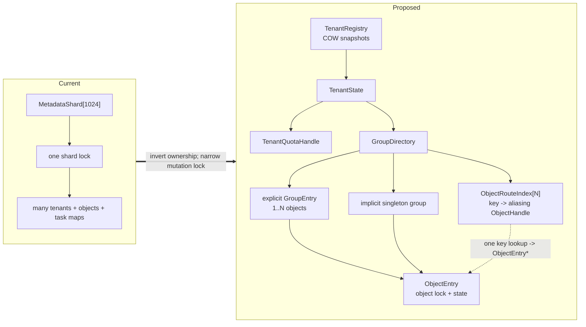
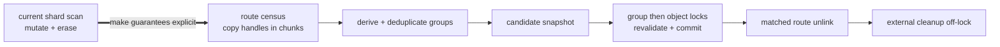

# [RFC][Store]: Tenant-First Object-Level Metadata Locking

## Summary

Move metadata ownership from global shards to tenants and move the mutation
boundary from one shard lock to one object lock.



| Concern | Current | Proposed |
| --- | --- | --- |
| Ownership | Global shards contain fragments of many tenants | `TenantState -> GroupDirectory -> ObjectEntry` |
| Mutation | One shard lock covers unrelated objects | One lock per `ObjectEntry` |
| Group | Separate object-to-group and member maps | One tenant-local `GroupDirectory` |
| Lookup | Shard routing is also the lifetime boundary | One flat object route pins the owning object/group |
| Eviction | Scan and mutate under broad shard locks | Handle census, group-aware commit, matched unlink |

The expected architectural win is isolation and a clear ownership model. The
simple locked route defined here is the correctness baseline. Epoch/COW route
optimization is specified separately in
[Group Directory Object-Route Read-Path Optimization](rfc-object-directory-read-path-optimization.md).

## Scope

| Goals | Non-goals |
| --- | --- |
| Put `TenantState` at the outer semantic boundary | Lock-free object business state |
| Make `GroupDirectory` the only tenant-local object container | Changing the external `group_id` contract |
| Allow unrelated objects to mutate concurrently | Concurrent conflicting mutations of one object |
| Make erase/recreate and async work lifetime-safe | Dynamic route-shard resizing |
| Preserve quota, group, HA, offload, and eviction semantics | A dual representation or compatibility mode |

## Data Model

Every object belongs to one logical group:

- a non-empty external `group_id` resolves to an explicit `GroupEntry`;
- an empty external `group_id` is an implicit singleton group;
- singleton state is physically collapsed into `ObjectEntry`, so it adds no
  group allocation or group lock;
- an explicit `GroupEntry` owns all member objects and destroys them together.

The logical hierarchy does not add a second lookup:

```text
logical ownership: Tenant -> GroupDirectory -> GroupEntry -> ObjectEntry
point lookup:       tenant + object key -> one route hash -> ObjectEntry*
                                             └── owner pins GroupEntry
```

The core C++ shape is:

```cpp
struct TenantInstanceId { uint64_t value; };
struct GroupId { uint64_t value; };
struct ObjectId { uint64_t value; };
struct ObjectToken { TenantInstanceId tenant; ObjectId object; };

class ObjectEntry;
class GroupEntry;

class ObjectHandle {
    std::shared_ptr<TenantState> tenant_;
    // Singleton: owns ObjectEntry.
    // Explicit member: aliases GroupEntry ownership but points to ObjectEntry.
    std::shared_ptr<ObjectEntry> entry_;
};

class GroupEntry {
    const GroupId id_;
    const std::string name_;
    std::atomic<GroupLifecycle> lifecycle_;
    mutable SharedMutex mutex_;
    std::unordered_map<ObjectId, std::unique_ptr<ObjectEntry>> members_
        GUARDED_BY(mutex_);
};

class ObjectEntry {
    const ObjectId id_;
    const GroupId group_id_;
    GroupEntry* const explicit_group_;  // null for singleton
    const std::string key_;
    mutable SharedMutex mutex_;
    ObjectLifecycle lifecycle_ GUARDED_BY(mutex_);
    ObjectState state_ GUARDED_BY(mutex_);  // metadata + runtime tasks
};

class GroupDirectory {
    using ObjectOwner = std::shared_ptr<ObjectEntry>;
    struct RouteShard {
        SharedMutex mutex;
        OwningStringMap<ObjectOwner> objects;
    };

    std::array<RouteShard, kObjectRouteShardCount> routes_;
    SharedMutex group_catalog_mutex_;
    OwningStringMap<std::shared_ptr<GroupEntry>> groups_by_name_;
    std::unordered_map<GroupId, std::shared_ptr<GroupEntry>> groups_by_id_;
    std::array<std::mutex, kLifecycleStripeCount> lifecycle_stripes_;

    template <class Fn> auto WithObject(std::string_view, Fn&&) const;
    template <class Fn> auto WithObjects(KeySpan, Fn&&) const;
    ObjectHandle Pin(std::string_view) const;
    void VisitHandles(const HandleVisitor&) const;
    bool EraseIfMatch(std::string_view, ObjectId, const ObjectEntry*);
};

class TenantState {
    const TenantId id_;
    const TenantInstanceId instance_id_;
    std::atomic<TenantLifecycle> lifecycle_;
    TenantQuotaHandle quota_;
    GroupDirectory groups_;
};
```

For an explicit member, the route stores the standard aliasing form
`shared_ptr<ObjectEntry>(group_owner, member_ptr)`. One route lookup therefore
returns the member directly while keeping the whole group alive. A
`GroupHandle` can be derived in O(1) from the immutable back-pointer; point
operations neither perform a second hash lookup nor take the group lock.

`WithObject(s)` is callback-scoped and exposes no raw pointer or state reference
to its caller. Work that outlives the callback uses a strong `ObjectHandle` or a
weak handle plus `ObjectToken`. Tenant generation, group lifecycle, `ObjectId`,
and object lifecycle fence unregister, erase, recreate, and delayed callbacks.

Stored object keys remain owning strings with transparent `string_view` lookup.
The route owns one safe lookup key and `ObjectEntry` owns the canonical key.
Explicit group names are stored per group, while member objects store only a
numeric `GroupId`.

### Read-mostly tenant registry and quota

`TenantRegistry` uses sharded immutable COW snapshots. A reader enters the
registry epoch, loads one snapshot, copies a strong `TenantHandle`, and leaves
the epoch. Registration and matching-generation removal copy only one registry
shard. Snapshot keys are owning strings.

`TenantHandle::quota()` returns the existing stable quota account. Charge and
release use its atomic protocol; policy updates use existing quota-table locks.
They do not mutate `TenantRegistry` or `GroupDirectory`.

## Access and Locking

```mermaid
sequenceDiagram
    participant R as RPC/batch
    participant TR as TenantRegistry
    participant G as GroupDirectory
    participant E as ObjectEntry

    R->>TR: Lookup(tenant_id)
    TR-->>R: strong TenantHandle
    R->>G: WithObject(key)
    G-->>R: aliasing owner; route lock released
    R->>E: object lock + lifecycle validation
    E-->>R: value result
```

| Lock | Protects | Boundary |
| --- | --- | --- |
| Tenant-registry writer | One tenant snapshot shard | Never includes tenant work or teardown drain |
| Object route | Key membership and handle acquisition | Released before group/object locks |
| Group catalog | Explicit group name/ID lookup | Released before group/object locks |
| Explicit group | Membership and group transaction | Then member objects in canonical key order |
| Object | One object's metadata and tasks | Never includes directory change or external I/O |

Allocator, filesystem, queue, event, and network work run without registry or
directory locks. Timer/retry indexes are also never nested with object locks.

### Lifecycle

| Operation | Protocol |
| --- | --- |
| Create | Serialize the key, create/join its group, build the owning or aliasing handle, then publish the route |
| Singleton erase | Mark object removing, matched-unlink its route, clean up off-lock |
| Explicit group erase | Mark group removing, matched-unlink every member route, clean up the group off-lock |
| Tenant teardown | Close admission, unregister the matching generation, then drain handles |
| Async callback | Upgrade weak handle and revalidate tenant, group, object ID/version, and lifecycle |

Partially published objects remain `kCreating`; removing objects/groups remain
`kRemoving`. Lookup accepts only `kActive`. A retained handle preserves memory,
not logical validity.

## Eviction

Eviction is the largest migration area because current shard locks implicitly
provide scan stability, object lifetime, group serialization, auxiliary-map
consistency, and erase serialization.



The target protocol is:

1. `VisitHandles` copies bounded chunks under route shared locks.
2. Candidate selection runs after route locks are released.
3. Candidates derive `GroupHandle`; repeated `GroupId`s are deduplicated.
4. An explicit group is locked before its member objects in canonical order;
   singleton eviction locks only its object.
5. HA reservation happens before metadata locks. Commit revalidates generation,
   IDs, version, lease, pin state, and lifecycle.
6. Membership teardown is group-wide. Member routes use matched unlink so stale
   work cannot erase a recreated object.
7. Offload, allocator, durable callbacks, and event publication run off-lock.

Global, tenant-quota, NoF, and DFS eviction reuse the same census and commit
kernel with different selection predicates. The implementation must first
extract this kernel on the current shard layout before changing ownership.

## Expected Impact

| Area | Expected benefit | Cost |
| --- | --- | --- |
| Distinct object writes | Independent object locks | More lock objects and checks |
| Tenant isolation | No cross-tenant object-mutation lock | Tenant plus object-route lookup |
| Group operations | One ownership and lifetime unit | Canonical multi-object locking |
| Tenant eviction | Direct tenant-local census | Explicit handle lifetime |
| Identity memory | Group name once; numeric member IDs | Two safe object-key owners |

The explicit-group microbenchmark measured the flat alias route 16-54% faster
than a two-level group/member lookup and 16.7% lower RSS at one million objects.
The simple locked route can still regress uniform singleton workloads versus
main; production enablement therefore requires the companion performance RFC
or equivalent end-to-end evidence.

## Implementation and Validation

1. Add lock metrics and extract the common eviction commit kernel on the
   current representation.
2. Consolidate metadata and per-key runtime maps into `ObjectEntry`.
3. Add `TenantRegistry`, `TenantState`, `GroupDirectory`, handles, IDs, and
   lifecycle fencing.
4. Convert point/batch, create/erase, group, eviction, HA/offload, snapshot, and
   admin paths to the new API.
5. Delete global shard ownership, `object_group_ids_`, per-shard
   `group_members`, parallel per-key maps, and migration adapters.

| Gate | Acceptance criterion |
| --- | --- |
| Lifetime | TSan/ASan coverage for lookup, erase/recreate, group teardown, and delayed callbacks |
| Locking | Distinct colliding objects progress; canonical group/object ordering has no deadlock |
| Eviction | Existing ranking, HA, group, quota, accounting, NoF, and DFS behavior is preserved |
| Foreground impact | Report Get/PutEnd throughput and p99 during million-object eviction |
| Memory | Report bytes/tenant and RSS/million objects, including group-size distribution |
| Fast path | Meet the companion RFC gates or equivalent production-weighted evidence |

One authoritative metadata representation exists in every phase. The locked
reference and optimized route may land in one change series; no feature flag,
dual-write path, or compatibility representation is introduced.
